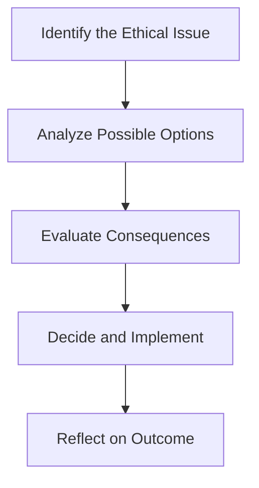

## 1.1 Ethics and Trust in the Investment Profession

Sometimes, we forget just how much faith we put in the investment world. You could say, “Hey, I’m handing over my savings to a fund manager—am I sure they’ll do the right thing?” Trust and ethics are the invisible bonds that keep us, as investors and professionals, working together without constant suspicion. In a sense, if you’ve ever confidently placed your life savings in a retirement fund or let someone else handle your money, you’ve lived (and perhaps sweated a bit) through the very essence of ethics and trust in finance.

Below is a deep look into why ethics and trust matter, how professionals in the investment industry maintain these standards, and some potential pitfalls that might challenge us all along the way.

---

### The Importance of Ethics in Finance

Let’s start with the basics. Ethics is about doing what you believe is right—often guided by an established code of conduct that spells out values and expected behavior. In finance, it’s about telling the truth in your financial reporting, avoiding deceptive sales pitches, and staying honest with clients. Sounds straightforward, right? But, um, actually applying those principles can get tricky in real life because of conflicts of interest, pressure from your boss or clients, or simply the lure of making bigger profits quickly.

Why do we care about ethics in the investment profession? For a start, ethical behavior is crucial for credibility and fairness. If you see repeated ethical lapses—insider trading, misrepresentations, or shady dealings—it erodes confidence in the entire financial system. Investors become wary, liquidity dries up, and everyone from corporations seeking to raise capital to individuals planning their futures suffers. Let’s be honest: nobody thrives in a system that’s built on or peppered with dishonesty. At the end of the day, professional integrity supports the entire ecosystem, from individual investors to global economies.

---

### Trust: The Glue of Investment Markets

Ever heard the saying, “Money is only as real as the trust behind it”? Well, that’s especially true in financial markets. Trust is the belief that your broker, analyst, or fund manager will do what’s best for you without needing to watch them like a hawk every second. Picture the complexity of global markets—hundreds of thousands of trades happening every minute, billions of dollars changing hands. Without trust, none of this could happen at scale, and we’d be stuck scrutinizing every single transaction.

If you think about any transaction—from buying a stock to putting funds in a mutual fund—trust makes it all run smoothly. If you question the honesty of your advisor or suspect they might be engaging in fraud, you’ll pull out of the market or demand much more proof and regulation. High transaction costs and bureaucracy can slow capital formation, hamper investment, and ultimately stunt economic growth.

---

### The Role of a Code of Ethics

When I first heard about the “Code of Ethics” in finance, I remember thinking, “Wait, is that just a fancy set of guidelines that nobody reads?” But, over time, I’ve seen how a well-structured code of ethics, like the CFA Institute’s Code of Ethics & Standards of Professional Conduct, sets out the expectations for how professionals should behave. And yes, people do read them—especially when they want to keep their credentials and avoid disciplinary actions.

A code of ethics:
• Demonstrates the mission and values of the profession or firm.  
• Establishes clear guidelines on issues like integrity, honesty, competence, and respect for client interests.  
• Provides a reference point when you face ethical dilemmas.  

In fact, if you ever find yourself stuck in a moral gray area—say, you suspect your client wants you to “tweak” some numbers—this code can remind you of the right way to handle such pressure. Meanwhile, it signals to clients and the market that, “Yes, we stand for something more than just profit.”

(For an even closer look at codes of ethics within the investment profession, see the next section, 1.2 Code of Ethics and Standards of Professional Conduct.)

---

### The Nature of a Profession

The investment profession isn’t just some random grouping of people who happen to like numbers. Professions like finance, medicine, and law are built on specialized bodies of knowledge. They require years of education, continuous learning, and abiding by certain ethical standards unique to the field. Another crucial piece is the public trust placed in these professions to do the right thing—oftentimes with significant responsibilities (like managing life savings).

In finance, the specialized knowledge might include portfolio management techniques, risk measurement tools, and an understanding of regulatory compliance. However, being “professional” goes beyond passing exams. It entails a commitment to serve the best interests of clients and the broader community. This means that if you see a potential conflict that could hurt investor confidence, you address it head-on. If you let ethical standards slip, the entire profession’s reputation gets tarnished.

---

### Upholding Professionalism

Investment professionals don’t just talk about professionalism. They live it, day in and day out—well, in theory. Professionalism includes:
• Ongoing education—staying up to date on everything from new asset classes to investment analytics tools.  
• Transparency—ensuring that disclosures are clear and accurate.  
• Respect—for clients, colleagues, and the market as a whole, meaning you treat all parties equitably.  

In practice, “acting professionally” might mean telling a client you can’t promise a certain return, even if that’s what they want to hear. Or it might mean refusing business if it conflicts with ethical guidelines. It can be awkward, and it might mean losing revenue in the short term. But the payoff is earning the trust that sustains your business and the profession in the long run.

---

### Common Challenges to Ethical Behavior

Let’s be real: doing the right thing is easier said than done. Consider these everyday challenges:
• Conflicts of interest: This is like your friend recommending a stock because they own tons of it. Suddenly, you’re questioning if you’re really getting unbiased advice. In the professional context, an analyst might feel torn between rating a stock fairly and pleasing the issuer who pays their firm’s underwriting fees.  
• Employer or client pressure: Maybe your boss is pressing you to “get results at any cost.” Sound familiar? Ethical corners can be cut when pressure escalates.  
• Incentive structures: If huge bonuses hinge on short-term performance, the lure to manipulate results or overlook certain risks can be powerful.  
• Cultural or organizational norms: An unwritten rule in some firms might be “Do whatever it takes.” That’s not exactly a motto that fosters transparency or fairness.  

It’s important to recognize these challenges, especially if you feel that uneasy pit in your stomach. That feeling might just be your ethical radar going off, telling you that what’s being asked isn’t right.

---

### Ethics versus Legal Standards

Here’s a question I often get: “Isn’t just following the law enough?” Well, no. Legal standards are typically the minimum threshold set by society to keep things from going off the rails. Ethical standards often hold us to a higher bar—something that goes beyond, “Did I break a rule?” to “Am I doing the truly right thing for my client, for the market, and for society?”

For instance, something might be legal (like making a risky investment) but could be ethically questionable if the client isn’t aware of just how high that risk is. Legal standards might not demand that you clarify every nuance, but an ethical approach typically does. In short, law is about what you can and cannot do; ethics is about what you should or should not do.

---

### A Structured Ethical Decision-Making Framework

Below is a simple framework to guide ethical decisions. I was once in a thicket of an ethical dilemma—figuring out what to do was stressful, but having a set of steps helped keep me grounded.

• Identify the Ethical Issue: Recognize the red flag. Is there a conflict of interest? Is there a risk of misleading someone?  
• Analyze Possible Options: List the ways you could address the situation.  
• Evaluate Consequences: Consider legal, ethical, and practical implications. How will your decision affect stakeholders?  
• Decide and Implement: Pick the most ethical course of action and follow through.  
• Reflect on Outcome: Learn from the experience. Did it preserve trust? Could you improve your approach next time?

In a high-pressure environment, you might be tempted to skip these steps. But this framework helps you stay consistent and transparent, even if you have just a few minutes to think.

---

### Real-World Illustrations and Case Studies

1. Ponzi Schemes and the Erosion of Trust  
   Remember Bernie Madoff? Clients were left devastated when the scheme collapsed because the purported returns were faked. Although it violated multiple laws, the underlying problem was a profound betrayal of trust. The entire episode reminded investors worldwide that robust ethical oversight cannot be taken for granted.

2. Conflict of Interest in Research  
   Imagine you’re an analyst at a major bank. Your research team is paid (in part) by the same firms you’re supposed to evaluate. Even though you’re not directly told to inflate ratings, a subtle pressure might exist to provide a rosy outlook. This is a classic conflict of interest scenario. Maintaining independent judgment and disclosing potential conflicts are crucial ethical steps here.

3. Insider Trading  
   Trading on material, nonpublic information is both illegal and unethical. Individuals who break these rules not only risk prison but also deeply harm the trust that investors place in a fair market.

---

### Best Practices for Maintaining High Ethical Standards

• Have a Written Policy: A formal ethics policy that reiterates your duties to your clients, your employer, and the market. Handy to have a reference even when no immediate crisis is on the horizon.  
• Training and Regular Refreshers: Ethical training shouldn’t be a one-off. Revisiting case studies or new regulatory updates helps keep the conversation active.  
• Whistleblower Protections: If employees notice unethical activities, they should be able to report them without fear of retaliation.  
• Cultural Leadership from the Top: Leaders set the tone. If the CEO doesn’t seem to care about ethics, that message seeps through the organization quickly.  

---

### Encouraging Critical Thinking and Continuous Learning

It’s possible you’re reading this and thinking, “Alright, I get it; do the right thing.” But it can be surprisingly easy to lose sight of ethical principles when under real-world pressure. That’s why it helps to keep reading case studies, discussing dilemmas with peers, and staying up to date with the latest guidelines from organizations like the CFA Institute. A robust, learning-oriented approach can help you spot unethical practices before they turn into headline scandals.

---

### Glossary of Key Terms

• **Ethics**: A system of principles that govern behavior based on concepts of right and wrong.  
• **Trust**: A belief in the reliability and integrity of a person or system. It ensures a smoother operation of markets.  
• **Code of Ethics**: A formal statement of an organization or profession’s values, providing specific guidelines on expected behavior.  
• **Profession**: An occupation demanding specialized knowledge, ethical standards, and service to the public or clients.  
• **Professionalism**: The behaviors, standards, and obligations consistent with being an expert in a field.  
• **Conflict of Interest**: A situation where personal or professional interests compete, potentially compromising objectivity.  
• **Legal Standards**: Enforceable rules set by authorities, establishing the minimum acceptable behavior.  
• **Decision-Making Framework**: A structured approach to identifying, analyzing, and resolving ethical issues.

---

### References and Further Reading

- CFA Institute. (2020). Code of Ethics & Standards of Professional Conduct.  
- “Standards of Practice Handbook” (latest edition), CFA Institute.  
- Kidwell, D., Blackwell, D., Whidbee, D., & Sias, R. (2016). Financial Institutions, Markets, and Money. John Wiley & Sons.  
- CFA Institute Ethics Resources:  
  [https://www.cfainstitute.org/en/ethics-standards/ethics](https://www.cfainstitute.org/en/ethics-standards/ethics)  
- Howard, R. A., & Korver, C. D. (2008). Ethics for the Real World: Creating a Personal Code to Guide Decisions in Work and Life. Harvard Business Press.

If you want to dive deeper, the next section (1.2 Code of Ethics and Standards of Professional Conduct) provides more concrete details on how professional standards are laid out and enforced.

---

## Test Your Knowledge: Ethics and Trust in the Investment Industry



### Which statement best describes the importance of trust in financial markets?

- [ ] Trust allows regulators to enforce rules without needing investor cooperation.  
- [ ] Trust ensures that all investors will receive the same return.  
- [x] Trust facilitates smooth and voluntary participation in the market and reduces unnecessary scrutiny.  
- [ ] Trust eliminates the possibility of investment fraud.  

> **Explanation:** Trust allows markets to function without investors needing to micromanage or question every transaction, which helps maintain efficiency and fluidity in financial markets.

### Which of the following scenarios primarily illustrates a conflict of interest?

- [x] A research analyst covering a company whose advisory services also pay her firm’s underwriting fees.  
- [ ] A mutual fund manager losing money due to unfavorable market conditions.  
- [ ] An investment manager promoting a fund that has been profitable for all clients.  
- [ ] A client requesting extra reports on a stock’s performance.  

> **Explanation:** A conflict of interest arises when the research analyst might be biased to provide a favorable rating for a firm that pays underwriting fees to her organization.

### In an ethical decision-making framework, what is the most appropriate next step after identifying the ethical dilemma?

- [ ] Ignore the issue and follow existing legal standards.  
- [ ] Directly decide on a course of action without evaluation.  
- [x] Analyze possible options to address the dilemma.  
- [ ] Report it immediately to the regulator without any consideration.  

> **Explanation:** After identifying the ethical dilemma, you should explore different ways to handle it, evaluating potential outcomes before making a final decision.

### Which statement accurately distinguishes between ethical standards and legal standards?

- [x] Ethical standards often exceed legal requirements by emphasizing what is right rather than only what is permissible.  
- [ ] Ethical standards are enforced by law enforcement and courts.  
- [ ] Legal standards focus solely on client satisfaction, while ethical standards focus on penalties.  
- [ ] Neither ethical nor legal standards apply to investment professionals.  

> **Explanation:** Legal standards set the minimum floor for acceptable behavior, while ethical standards usually aim higher, emphasizing the spirit of fairness and integrity.

### Which of the following activities represents professional behavior in the investment industry?

- [x] Providing transparent disclosures about potential risks to clients and updating them regularly.  
- [ ] Ensuring that the client only hears positive news to maintain confidence.  
- [x] Pursuing ongoing education to remain informed about new investment tools and regulations.  
- [ ] Guaranteeing a specific return to the client under all circumstances.  

> **Explanation:** Professional behavior entails openness, continuing learning, and prudent communication— not making unrealistic guarantees.

### What is one recommended practice for fostering an ethical culture within an investment firm?

- [x] Implementing whistleblower protections to empower employees to report unethical behavior.  
- [ ] Encouraging employees to overlook minor transgressions to maintain harmony.  
- [ ] Offering large financial incentives for employees who maximize short-term profits.  
- [ ] Restricting access to all internal documents to avoid data breaches.  

> **Explanation:** A whistleblower policy can help identify ethical breaches early, thereby promoting a transparent and accountable working environment.

### Which of the following best describes the concept of “professionalism” in the investment context?

- [ ] A set of laws governing financial reporting to investors.  
- [x] The standards, behaviors, and responsibilities that define expertise and integrity within finance.  
- [x] Ongoing efforts to maintain and update one’s skills to serve the public interest better.  
- [ ] A guarantee of positive returns on investments.  

> **Explanation:** Professionalism combines ethical conduct, specialized knowledge, and respect for client interests, which often involves continuous learning and improvement.

### What is a typical outcome if trust in financial markets is severely eroded?

- [ ] Significantly lower risk premiums in the market.  
- [ ] Higher volume of trading in all market conditions.  
- [ ] Complete disappearance of securities regulations.  
- [x] Reduced investor participation leading to less liquidity and potentially higher costs of capital.  

> **Explanation:** When trust is lost, investors become cautious, trading volumes might drop, liquidity dries up, and it becomes more expensive for businesses to raise capital.

### A code of ethics in the investment profession typically:

- [x] Outlines broad principles of integrity, honesty, transparency, and client focus.  
- [ ] Eliminates all unethical behavior.  
- [ ] Guarantees legal protection against lawsuits for professionals who follow it.  
- [ ] Replaces all existing regulatory rules.  

> **Explanation:** A code of ethics provides overarching guidance for professional conduct but does not guarantee the absence of unethical practices. It complements legal and regulatory frameworks.

### In terms of ethical framework and trust, which statement is TRUE?

- [x] Conflicts of interest can exist even when all parties are acting legally.  
- [ ] Legal standards always require complete alignment with ethical principles.  

> **Explanation:** You can have a situation that is legally permissible but still ethically questionable if conflicts of interest are not addressed or disclosed.


