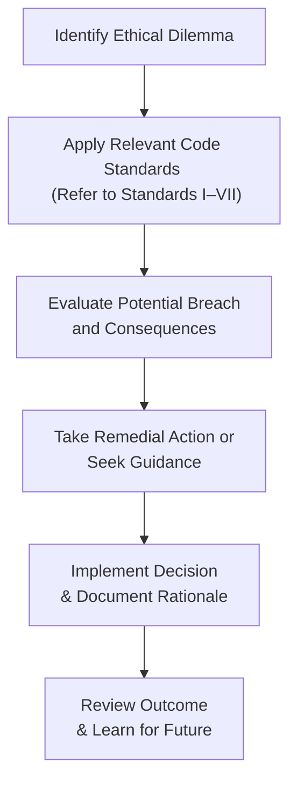

## 1.5 Ethics Application

Picture this: You’re sitting at your desk, reviewing a new client's portfolio while the phone buzzes relentlessly. Details of a potentially lucrative multi-million-dollar trade have just landed in your inbox. The strategy behind this trade? Let’s just say it toes a precariously fine line between compliance and a possible breach of fiduciary duty. One wrong move here—or even an ambiguous interpretation of “material nonpublic information”—and your professional reputation could unravel like a loose thread.

Does that situation sound stressful? Well, welcome to the real world of ethical decision-making in finance. We all hope never to face pressure-cooker situations like this. But, as we learn in the investment profession, ethical quandaries often appear suddenly—even, or especially, when we least expect them. The best defense is a well-developed “professional reflex,” an almost automatic sense that flags potential trouble before it escalates.

This section focuses on applying the concepts, principles, and guidelines from the CFA Institute Code of Ethics and Standards of Professional Conduct (see also “1.2 Code of Ethics and Standards of Professional Conduct”) to real or hypothetical scenarios. By practicing with scenario analysis and case studies, you’ll strengthen your ability to identify and resolve ethical issues in the moment.

---

**Why Scenario-Based Learning Matters**

Scenario-based learning is basically where you study real or fictitious situations to analyze the ethical implications. To be totally honest, I’ve found it to be one of the most practical methods of learning. It’s not just about reading bullet points in a textbook. Instead, you put yourself into the shoes of the characters in a given scenario—maybe you’re an equity analyst, or a portfolio manager, or a compliance officer—and you walk through the tension. Suddenly, all those disclaimers and rules start to feel more tangible.

The benefits include:

- Helping you recognize red flags early.  
- Enhancing your comfort level with tricky decisions.  
- Showing how the Code of Ethics applies in nuanced situations.  

There’s something about reading or hearing, “The associate portfolio manager is confronted with a friend’s insider tip,” that brings real-life stakes to the surface. When you reflect on how you’d behave under similar circumstances, you sharpen your judgment.

---

**Identifying Potential Breaches**

When a scenario is presented, the first step is to identify any potential breaches of the ethical or professional standards. Often, these revolve around areas like:

• Material Nonpublic Information: Perhaps you’ve received information that gives you an unfair advantage in trading.  
• Client Conflicts of Interest: Are you or your firm benefiting at the expense of a client?  
• Duty to Employer vs. Duty to Client: What happens if you discover wrongdoing at your firm that could harm clients?  
• Fair Dealing: Are all clients, big and small, receiving the same opportunities?  
• Disclosure of Conflicts: Did you reveal personal holdings that might influence your objectivity?

A lot of these issues tie back to the specific Standards (I–VII) from 1.2 Code of Ethics and Standards of Professional Conduct. For instance, Standard II(A) “Material Nonpublic Information” may come into play if you learn about a pending merger before it goes public. Or you might recall Standard V(A) “Diligence and Reasonable Basis,” which tells you to have a thorough foundation for investment advice and actions. In scenario-based analysis, you’re basically scanning the situation for potential lines that might be crossed.

---

**Applying the Code and Standards in Real Time**

After you identify a potential breach, the next step is applying the appropriate standard to see whether the conduct is actually in violation. This is where it helps to have some practice. Because, let’s face it, if you go rummaging around in your notes every time a tough phone call comes in, things could spiral pretty quickly. A prime goal is to internalize enough knowledge of the Code that you can navigate everyday complications without flipping through a manual on the spot.

But before you worry that you’ll need to memorize every sentence, remember that the bigger aim is developing a consistent thought process. You want an ingrained mental sequence where you note suspicious details (“Hmm, is this inside information?”), recall relevant guidelines (“Standard II(A) says I can’t trade or tip others if the information is material and not public”), and choose an action that aligns with the standard. This practical mental reflex helps you respond effectively.

---

**Building a Professional Reflex**

What do we mean by professional reflex? It’s the phenomenon of reacting almost instinctively—yet in an informed way—to an ethical dilemma. Ideally, you see an ethical pitfall forming on the horizon and steer away from it. Or if it does land in your lap, you’re prepared to handle it decisively.

Here are some tips to boost that reflex:

• Stay Current: Regularly review updates from the CFA Institute’s “Ethics in Practice” case studies. They’ll keep you on your toes with trending topics (e.g., digital assets or social media stock-touting).  
• Learn from Others: Pay attention to real-world enforcement actions, not because we revel in others’ misfortune, but because we can glean lessons from them.  
• Role-Play: Sometimes, it helps to gather colleagues, create a hypothetical scenario, and see how you’d each respond.  

Me, I once sat in on a “mock hearing” at a local CFA society event, where participants enacted a scenario of a portfolio manager who inadvertently shared nonpublic info with a friend at the gym. Watching the chain of events unfold in a staged environment hammered home how easily a casual comment can snowball. That was an eye-opener.

---

**Common Ethical Dilemmas in Investment Professions**

Ethical dilemmas pop up across the investment landscape. Consider a few typical examples:

• Insider Insight: A friend in the C-suite of a public company gossips about an upcoming product recall that hasn’t been disclosed yet. Even if you didn’t directly ask for this information, it’s now in your possession. How do you proceed?  
• Favored Clients: You manage multiple client portfolios, but one client is especially profitable for your firm. Are you tempted to give them better deals on IPO allocations? Is this fair to your other clients?  
• Client–Firm Conflicts: Suppose your firm is pushing the sale of a specific product that carries higher commissions. But it’s not necessarily the best fit for some clients. Do you push it anyway because your boss is pressuring you?  
• Performance Reporting: You discovered your colleague is using questionable performance metrics to make results look rosier than they are. Is that a violation of integrity?  

In each of these, a professional reflex would kick in to ask: “Do I have a conflict of interest?” “Am I offering full disclosure?” “Does this conform with the client’s best interests, or am I serving someone else’s personal gain?”  

---

**Ethical Decision-Making Process**

To streamline your approach to ethical dilemmas, it helps to visualize a framework. Below is a Mermaid diagram illustrating a simplified process you might follow when confronted with a questionable situation:

- Identify: Spot the potential ethical red flag—maybe a rumor, a trade request, or a push from a superior that feels off.  
- Apply: Reference the standard(s) that might be at stake, such as client interests or misuse of nonpublic information.  
- Evaluate: Assess consequences (professional, legal, reputational).  
- Remedial Action: If a breach is possible, consult with legal or compliance, or consider disclosing to the appropriate regulators if it’s required.  
- Implement: Move forward in alignment with the Code and record your reasoning.  
- Review: Reflect on outcomes so you can better handle a similar scenario next time.  

---

**Remedial Action: Ensuring Compliance and Correcting Breaches**

Even the best professionals sometimes face ethical missteps—maybe they didn’t have all the facts, or their judgment was clouded by time pressure. If you identify a potential or actual violation, focusing on remedial action is both required and wise. Remedial action may look like:

• Promptly disclosing any breach to your compliance department or supervisor.  
• Halting suspicious trades or reversing them if the firm policy allows.  
• Issuing corrected performance reports or disclosures if inaccurate data was published.  
• Providing additional training for employees or colleagues involved in the incident.  
• Strengthening internal policies, for example, requiring multiple checks on trading instructions.  

Quick intervention can prevent bigger damage. The faster you respond, the more you protect clients, maintain trust, and live up to the standards. It’s also part of the personal accountability that underscores genuine professionalism.

---

**Case Study Example: Asset Manager Under Influence**

Here’s a scenario to put things into context:

An asset manager, Carla, has a large institutional client that invests heavily in her firm’s proprietary fund. This client’s representative pressures Carla for “special insights” into the fund’s positions—essentially, a near-daily update on any changes. The client hints that if Carla doesn’t comply, they might pull the investment. Carla wonders whether the requests violate Standard III(B): Fair Dealing, since providing such frequent and detailed updates exclusively to one client might create an information advantage. Still, she feels the financial pressure from her employer to retain that big account.  

How might Carla handle this? Well, we apply the process:

1. Identify Ethical Dilemma: The potential advantage given to one client over others.  
2. Apply Relevant Code Standard: Standard III(B) “Fair Dealing” is likely key, as well as testing for conflicts of interest.  
3. Evaluate Potential Breach: The consequence could be that Carla’s other clients see less timely data, missing advantageous portfolio decisions.  
4. Seek Guidance & Remedial Action: Carla might consult her compliance officer or firm policy. Perhaps there’s a way to share the same updates with all investors in the fund simultaneously—like distributing a standard weekly or monthly update.  
5. Implement Decision & Document: Carla chooses not to grant the special request. She documents the client’s requests and her reasons for denying them.  
6. Review Outcome & Learn: The short-term risk is losing the client, but adhering to the standard builds credibility and trust in the long run.

---

**Scenario Analysis in Action**

Scenario analysis is essentially advanced role-playing to test your ethical radar. Sometimes, an employer or a local CFA society might stage scenario-based workshops. Let’s say they give you a hypothetical: “You overhear your boss telling an acquaintance about a major strategic shift at a company you cover. He says to that person, ‘You should buy that stock first thing on Monday.’”  

But it’s Friday afternoon. Nobody else is around. The market is still open for a bit. Now ask:

1. Does your boss’s conversation constitute material nonpublic information?  
2. Should you trade on it (No!) or share the tip with clients or family (Again, no!)?  
3. How do you address your boss’s possible breach?  

The more you practice these kinds of analyses, the quicker you’ll see the ethical mines, and the more prepared you’ll be to respond. You don’t wait until it’s real to figure out your plan of action.

---

**Real-World Implications**

We can’t ignore that ethical lapses in finance have contributed to some of the biggest crises in recent history. Remember the 2008 Global Financial Crisis? While a host of factors fueled it, misguided incentives and unethical behaviors (e.g., mortgage lenders pushing subprime loans that were doomed to fail) played a significant role. Or take any number of high-profile insider trading cases, from hedge fund managers down to employees who pass along privileged info. These real-world fiascos highlight how even small lapses or rationalizations can escalate to huge black marks on the entire industry.

In a sense, each professional’s daily commitment to ethical practice is that crucial link in the chain—it helps ensure that markets remain fair and that client trust remains intact. If too many links break, the entire system is at risk.

---

**Practical Tips for Day-to-Day Ethical Conduct**

• Create an Ethical Checklist: Simple yes/no items like “Am I certain the information is publicly available?” or “Does this action serve the client’s interest first and foremost?”  
• Build a Support Network: Keep close relations with your compliance department, mentors, or other ethical-minded colleagues. When in doubt, bounce the scenario off them.  
• Document Everything: If you decide not to share something with a client or to withhold a trade, log your reasoning. This is especially helpful down the line if questions arise.  
• Foster a Transparent Culture: Encourage open communication. If someone spots a potential conflict, they should feel safe raising it early.  

---

**Common Pitfalls to Avoid**

• Overconfidence: Thinking, “I’d never do anything unethical” can lead to ignoring little red flags or rationalizing borderline behavior.  
• Groupthink: In the finance environment, if your entire desk is chatting up a hot tip, you might go along with it. Ethical reflex demands stepping back and questioning group assumptions.  
• Complacency: Failing to keep up with evolving regulations or new financial products might blind you to potential pitfalls.  
• Delayed Action: Even if you suspect wrongdoing, you might wait, hoping the problem just fades. This rarely ends well.  

---

**Fostering a Culture of Ethics**

No single professional can keep a firm ethically afloat by themselves. Culture plays an enormous role. A company with robust ethics training, a supportive compliance team, and top-down accountability sets the stage for fewer breaches. On the flip side, if your leaders keep telling you, “Just do whatever it takes to meet the quarterly numbers,” that’s a setup for trouble.

So how do we shape culture?

- Senior managers must demonstrate ethical leadership: If you see the CEO or CIO taking ethics seriously, it speaks volumes.  
- Establish crystal-clear policies: Make sure guidelines are well-documented and easy to reference. “We do not trade on rumors, period.”  
- Educate consistently: Ongoing training and discussion about new ethical scenarios.  
- Encourage internal whistleblowing processes: Provide safe channels for reporting suspicious activities, with no fear of retaliation.

---

**Looking Ahead: Ethics in a Rapidly Changing World**

Finance is always changing. From decentralized finance to new social media–based investment trends, the landscape is dynamic. Each innovation presents fresh ethical angles. For example, an analyst might use alternative data gleaned from web-scraping or satellite imagery. Is that data truly public? Or does collecting it cross privacy or discoverability lines? It’s essential to keep reviewing these emerging areas and to apply timeless ethical principles in new contexts.

When you build and maintain a strong ethical foundation, you can adapt to changing technologies without losing your moral compass. The world can keep spinning faster, but you’ll be rooted in your guiding values.

---

**Further Reading and References**

For those who want to keep digging deeper:

- CFA Institute publishes “Ethics in Practice” case studies regularly on their website. These real-life examples help reinforce a far-reaching professional reflex.  
- Mallen Baker’s “Case Studies in Corporate Responsibility” offers broader corporate ethics scenarios, beneficial for understanding how corporate ethics tie into governance.  
- Boatright, J. R. (2013). “Ethics in Finance.” This is a classic text that discusses a wide range of financial ethics topics, including conflicts of interest and moral hazard.  
- IFC Corporate Governance and ethics resources: [https://www.ifc.org/wps/wcm/connect/topics_ext_content/ifc_external_corporate_site/corporate+governance](https://www.ifc.org/wps/wcm/connect/topics_ext_content/ifc_external_corporate_site/corporate+governance).  
- Our own Chapter 1 references: “1.2 Code of Ethics and Standards of Professional Conduct” and “1.3 Guidance for Standards I–VII” can be revisited whenever you need a refresher.

---

**Wrapping It Up**

Ethics application is not a one-off exercise. It’s a continuous practice, woven into the daily tasks of analyzing markets, advising clients, and making trades. By sharpening your ability to spot red flags, applying the Code and Standards swiftly, and remedying issues proactively, you build a name for trustworthiness—a name that ultimately elevates not just your career but the broader integrity of the financial industry. And trust me, that’s a reputation you can’t put a price on.

Remember: developing an ethical reflex might take time, but each scenario you study, each case you discuss with peers, and each decision you evaluate in the light of the Code is an investment in your professional future. Anyway, ethics can kind of become second nature—if you let it.

---

## Test Your Knowledge: Ethics Application for Investment Professionals



### A portfolio manager receives a tip from a friend about a soon-to-be-announced acquisition. According to the CFA Institute Code of Ethics and Standards, which principle is most directly at risk?

- [ ] Fair Dealing under Standard III(B)  
- [x] Prohibition against trading on Material Nonpublic Information under Standard II(A)  
- [ ] Misrepresentation under Standard I(C)  
- [ ] Responsibilities as a CFA Institute Member or Candidate under Standard VII(A)

> **Explanation:** The scenario describes potential insider trading. Standard II(A) specifically addresses the prohibition on acting or causing others to act on material nonpublic information.

### An equity analyst is told by their boss to recommend a stock that the company’s investment banking arm is underwriting, despite the analyst’s concerns about the stock’s fundamentals. What ethical challenge does this scenario primarily represent?

- [x] Conflict of interest between the research function and investment banking  
- [ ] Breach of client confidentiality  
- [ ] Lack of a reasonable basis for the recommendation  
- [ ] Unfair dealing toward a specific client

> **Explanation:** This scenario depicts a conflict where the analyst is pressured to recommend a stock underwritten by the same firm—creating a risk of compromised objectivity and a conflict of interest with investor needs.

### A junior analyst overhears her supervisor discussing nonpublic details of a company’s earnings with a friend at a restaurant. The analyst considers using this info in a research report. The correct course of action is:

- [ ] Include the info, since it is “publicly overheard”  
- [ ] Ask a friend to trade on your behalf  
- [x] Refrain from using it and report the incident to compliance  
- [ ] Place a personal trade quietly before the next market session

> **Explanation:** Any nonpublic company earnings data is material and must not be used in overt or covert ways. The best action is to refrain from using it and to inform compliance.

### Which of the following best describes a “professional reflex” in ethics application?

- [x] An instinctive, well-trained reaction to ethical dilemmas that aligns with established standards  
- [ ] A spontaneous emotional reaction that disregards regulations  
- [ ] A formal written policy covering all possible ethical situations  
- [ ] An annual training that teaches employees about compliance

> **Explanation:** Having a professional reflex means you automatically sense and respond to ethical pitfalls due to consistent training and familiarity with the Code of Ethics and Standards of Professional Conduct.

### A large institutional client demands daily, exclusive insights into new investment decisions, pressuring the manager to provide them. The manager wonders if it violates Fair Dealing. Which steps should the manager take?

- [x] Consult compliance or legal counsel, document the decision, and ensure equitable treatment of all clients  
- [ ] Provide the client the information to maintain their business  
- [x] Offer a standardized daily update to all clients to ensure fairness  
- [ ] Charge a higher fee for this service if it’s above standard practice

> **Explanation:** Meeting the fairness principle means either providing the same level of detail to all clients or refusing to single out one client for privileged information. Consulting compliance is an additional protective measure.

### If a professional discovers they inadvertently used outdated or incomplete data in an investment recommendation, the best remedial action is to:

- [x] Issue a corrected or updated recommendation as soon as possible  
- [ ] Do nothing, since the data was used in good faith  
- [ ] Delete all records of the previous recommendation  
- [ ] Continue using the outdated data to remain consistent

> **Explanation:** Prompt disclosure of the error and issuing an updated recommendation with current data is the most ethical and transparent course of action.

### A firm’s culture emphasizes “whatever it takes to close the deal” above everything else, including compliance. Which actions help mitigate ethical breaches in such an environment?

- [x] Encouraging open communication and anonymous reporting channels  
- [ ] Hiding any wrongdoing from regulators  
- [x] Educating employees about conflicts of interest and potential repercussions  
- [ ] Keeping a rigid hierarchy where only top executives review ethical issues

> **Explanation:** Building a robust ethical culture involves encouraging transparency, providing proper training, and granting employees safe ways to report concerns without retaliation.

### In evaluating a potential breach, an investment professional should:

- [x] Identify the specific standard(s) involved, seek guidance if unclear, and document the process  
- [ ] Keep decisions private and avoid discussions with compliance  
- [ ] Always exit the firm immediately if in doubt  
- [ ] Provide client information to friends for “feedback”

> **Explanation:** A structured approach involves identifying the applicable standard, seeking advice from compliance or legal teams, and thoroughly documenting the situation and resolution.

### Which of the following best illustrates remedial action after a confirmed ethical breach involving inaccurate performance data?

- [x] Correcting and reissuing performance reports, plus implementing checks to avoid future errors  
- [ ] Maintaining the original report to avoid embarrassment  
- [ ] Hiding the breach until an internal audit reveals it  
- [ ] Blaming a third-party data vendor in a public statement

> **Explanation:** Correcting the mistake and adopting stronger internal review procedures is the appropriate remedial action. Taking responsibility and preventing future errors are central to solid ethical conduct.

### In the context of the CFA Institute Code and Standards, it is true that ethical violations can undermine public trust and the integrity of capital markets.

- [x] True  
- [ ] False

> **Explanation:** Ethical violations erode investor confidence and can harm the broader financial system. Upholding strong ethical practices supports market efficiency and fairness.


