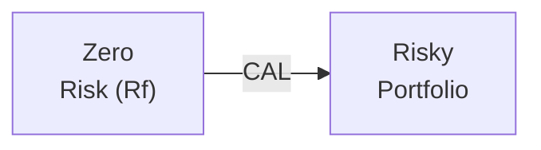
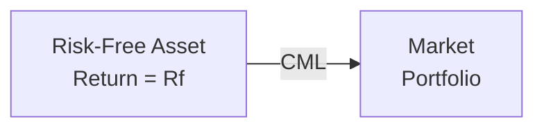
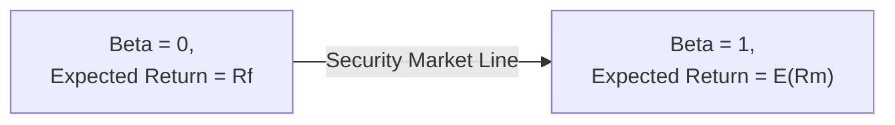
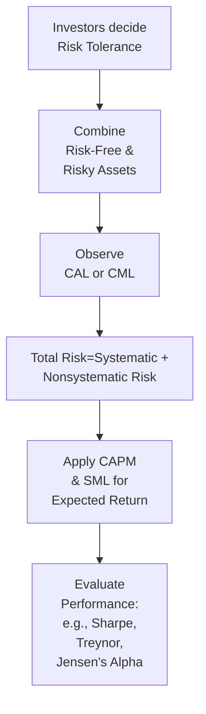

## 10.2 Portfolio Risk and Return: Part II

I remember the first time I stumbled across the idea that you could somehow combine a “boring” risk-free asset (like T-bills) with a more, shall we say, exciting portfolio of stocks or bonds. It felt a bit mind-blowing because I used to think you either had to be all-in on risky assets or else just park everything in something safe. But, as it turns out, there’s a wonderful spectrum in between—and that’s where the magic of the Capital Allocation Line (CAL) and related concepts come into play. So, let’s explore how a mix of risk-free and risky assets shapes the risk-return profile of a portfolio, dabble in systematic vs. nonsystematic risk, talk about how returns are “modeled,” and then see how the Capital Asset Pricing Model (CAPM) ties it all together in a nice neat bow.

Before we dive into the nitty-gritty details, here’s the big picture: once you add a risk-free asset to the mix, you open the door to new levels of risk (and return) that you otherwise couldn’t reach just by mixing different risky assets. If that sounds cryptic, no worries—we’re about to break it down step by step.

  
## Combining a Risk-Free Asset with Risky Assets

When we talk about a risk-free asset, we mean an asset that (theoretically) has zero default risk and a certain known return. In real-world practice, investors often consider short-term government securities like U.S. Treasury bills to be the “risk-free” asset, although nothing is truly risk-free if we consider inflation and other factors. But for the sake of building a conceptual framework, let’s treat it as risk-free.

Now, let’s suppose you have a portfolio of risky assets—say, a well-diversified stock fund or some combination of stocks and bonds. You can combine the returns of that portfolio with the risk-free asset in different proportions. 

• If you’re super conservative, maybe you put 90% in the risk-free asset and only 10% in the risky portfolio.  
• If you’re more aggressive, you might borrow at the risk-free rate (basically, you’re going into negative holdings of the risk-free asset) and invest that borrowed amount in the risky portfolio—so you’re “leveraged.”

And guess what happens when you put all possible combos of these weights into a graph of expected return vs. standard deviation? You get a straight line, often called the Capital Allocation Line (CAL). At the far left is your risk-free asset (zero standard deviation) and its risk-free return. At the far right, you have levered exposure to the risky portfolio. The slope of that line shows how much incremental expected return we get for each unit of additional risk we’re willing to take.

To visualize it, here’s a simple Mermaid diagram. Note that each node’s text is in double quotes and inside square brackets:

In reality, it’s a straight line from point A (where standard deviation is zero and the return is Rf) to and beyond point B (the risky portfolio’s risk and return). Every point on that line is a mix—you can see precisely how each combination changes the overall portfolio’s expected return and total risk.

## CAL vs. CML

Sometimes folks treat the CAL and the Capital Market Line (CML) as if they’re interchangeable. They’re closely related but not the same:

• The CAL is any line (risk-free asset + any chosen portfolio of risky assets).  
• The CML is a special line that forms when the risky portfolio is the “market portfolio”—the portfolio that includes all investable assets in proportion to their market values. 

In theory, this market portfolio is the tangential portfolio on the “efficient frontier” in Modern Portfolio Theory. The CML’s slope is the Sharpe ratio of the market portfolio, which basically quantifies how much excess return (beyond the risk-free rate) you’re getting per unit of total risk (as measured by standard deviation).

Very often, you’ll see a figure in textbooks showing a curve (the efficient frontier) and then a tangent line originating at the risk-free rate on the y-axis, touching that frontier at the portfolio with the highest possible Sharpe ratio. That tangent line is the CML. If we pick any other portfolio of risky assets and combine it with the risk-free asset, we’d get a different line—a CAL.  

Here’s a rough diagram:

Imagine that the line is tangent to the broader set of risky-asset portfolios. The best place on that set (the efficient frontier) is the point that yields the highest Sharpe ratio, i.e., the earned premium per unit of total risk.

## Systematic vs. Nonsystematic Risk

Investing in a single stock? Then you’re definitely exposed to the ups and downs of that company’s financial health, plus all sorts of market-wide factors. But if you hold, say, a large basket of different stocks, a big chunk of the single-company risk cancels out or diversifies away. Let’s separate these two broad categories of risk:

• Systematic (market) risk is the risk that affects all assets—stuff like economic recessions, war, inflation, interest rate changes, and so forth. You can’t eliminate it by spreading out your investments among different stocks or even different industries, because it pretty much hits all assets in some correlated manner.

• Nonsystematic (idiosyncratic) risk is specific to a particular firm or industry. If you own shares in a single tech company and the CEO steps down unexpectedly, that might hammer the stock but not necessarily the entire market.

In a well-diversified portfolio, most (though not all) of the nonsystematic risk can go away. The big remaining question is: Do investors get compensated for bearing nonsystematic risk? The short answer is no. Markets (in theory) reward you for bearing the systematic risk because that’s the part you can’t eliminate; you can see it as the inescapable hazard of being in the “market.”  

Anyway, I often think of systematic vs. nonsystematic risk like commuting in a crowded city: Some of the slowdown is just due to daily traffic that everyone faces, and some might be due to a lane closure near your particular neighborhood that you could avoid if you lived somewhere else. The daily traffic is systematic—it affects everyone; the local lane closure is nonsystematic, and you can dodge it if you diversify your route options (so to speak).

## Return Generating Models

Now if we want to figure out how these asset returns come about, we’d typically use some type of “return generating model.” One simple version is the market model, which looks something like:

(1) A typical asset’s returns = Residual (idiosyncratic portion) + Systematic portion (linked to the market return).

In other words, we say:

(2) Rᵢ = αᵢ + βᵢ * Rₘ + εᵢ,

where:  
• αᵢ is the asset’s intercept (some average return that’s independent of market movement).  
• βᵢ is how sensitive the asset is to the market’s returns.  
• Rₘ is the market’s return.  
• εᵢ is the random error term (what’s unexplained by the market).

And from that, we can glean a sense of how much of an asset’s movement is due to overall market swings and how much is unique to that asset.

## Beta

Beta is that measure of systematic risk, capturing how an asset’s returns move relative to the overall market. A beta of 1 means perfect lockstep with the market (i.e., if the market goes up 2%, the asset also goes up, on average, 2%). A beta greater than 1 means the asset is more volatile than the market (e.g., a 1.3 beta suggests that if the market moves 2%, you might see about a 2.6% move in the asset, on average). A beta that’s less than 1 indicates lower relative volatility.

Interestingly, if you’re the type who’s super risk-averse, you might look for assets with betas under 1. If you’re a thrill-seeker or you see an upcoming bull market, you might want that leveraged effect from a higher beta. But always remember: higher beta can swing both ways (greater gains and greater losses).

## Capital Asset Pricing Model (CAPM) and Security Market Line (SML)

One of the cornerstones of modern portfolio theory is the Capital Asset Pricing Model (CAPM). At its heart is the idea that an asset’s expected return is determined by its level of systematic risk (beta). The formula is typically written as:

$$
E(R_i) = R_f + \beta_i \bigl(E(R_m) - R_f\bigr)
$$

In plain English, the expected return on asset i, E(Rᵢ), is the risk-free rate (Rᵣ) plus a premium for bearing extra risk—this premium is the beta of the asset times the difference between the market’s expected return and the risk-free rate. So, if the market’s expected return is 10% and the risk-free rate is 2%, then the market risk premium is 8%. If your asset has a beta of 1.5, its risk premium is 1.5 × 8% = 12%. Its total expected return would thus be 2% + 12% = 14%.

The Security Market Line (SML) is just the graphical representation of CAPM, with beta on the x-axis and expected return on the y-axis. The slope of the line is the market risk premium (E(Rₘ) – Rf). Every asset or portfolio that’s “fairly priced” under CAPM assumptions should lie on this line. If something is above the SML, it might be undervalued (you’re getting more return for that beta than CAPM “predicted”), while an asset below the line might be overvalued.

We could draw a quick SML diagram:

But in practice, you might see an extension beyond beta = 1 or below 0 if there are assets with negative beta or betas bigger than 1. The slope remains the same: the market risk premium.

## Performance Evaluation Measures

Now that we have all these neat ideas about risk and return, we need ways to assess how well a portfolio or fund manager is doing relative to the risk they’re taking. That’s where performance evaluation measures come in handy:

  
• Sharpe Ratio  
  – (Portfolio return – Risk-free rate) / Standard deviation of the portfolio  
  – Interprets total risk (standard deviation) as the measure of volatility.  
  – This ratio is often used if you believe the portfolio is the majority of the investor’s net worth, i.e., total risk (not just systematic risk) matters.

• Treynor Ratio  
  – (Portfolio return – Risk-free rate) / Portfolio beta  
  – Interprets beta as the measure of volatility, so it focuses on systematic risk.  
  – Useful if the portfolio is just one portion of a well-diversified total investment, so total unsystematic risk is presumably negligible.

• M² (Modigliani–Modigliani)  
  – This approach adjusts the portfolio’s leverage (or weighting in the risk-free asset) so that its overall volatility matches that of the market. Then it compares the new portfolio return to the market’s return. Essentially, it’s a risk-adjusted measurement that can be intuitively expressed as a difference in return at the same risk level as the market.

• Jensen’s Alpha  
  – This measure is basically the difference between the portfolio’s actual return and the return “predicted” by the CAPM given the portfolio’s beta.  
  – If Jensen’s Alpha is positive, it suggests the portfolio outperformed its expected level of return given its systematic risk.

Here’s a quick table to recap each measure and what it focuses on:

| Measure        | Formula                                        | Risk Measure      |
|----------------|------------------------------------------------|-------------------|
| Sharpe Ratio   | (Rp – Rf) / σp                                 | σp (Std. Dev.)    |
| Treynor Ratio  | (Rp – Rf) / βp                                 | βp (Systematic)   |
| M²             | Adjusted return vs. market at market σ         | σp vs σm          |
| Jensen’s Alpha | Rp – [Rf + βp(E(Rm) – Rf)]                     | β (Systematic)    |

Where:  
• Rp = Portfolio return  
• Rf = Risk-free rate  
• σp = Standard deviation of the portfolio  
• βp = Portfolio beta  
• E(Rm) = Expected return of the market  

Each metric has its place. If you want to evaluate a highly concentrated fund (which hasn’t diversified away its nonsystematic risk), you might prefer the Sharpe Ratio. If it’s well-diversified and you only care about market risk, maybe the Treynor Ratio is more relevant. Meanwhile, M² gives a more direct percentage comparison, and Jensen’s Alpha is a direct measure of “excess return” beyond what CAPM would suggest.

## Practical Example

Let’s walk through a quick scenario with some hypothetical numbers:

• Risk-free rate is 3%.  
• Market’s expected return is 9%.  
• Market standard deviation is 15%.  
• A portfolio’s expected return is 11%, with a standard deviation of 20% and a beta of 1.2.

1) Sharpe Ratio:  
Sharpe = (11% – 3%) / 20% = 8% / 20% = 0.40

2) Treynor Ratio:  
Treynor = (11% – 3%) / 1.2 = 8% / 1.2 ≈ 6.67%

3) Jensen’s Alpha:  
Expected return per CAPM = 3% + 1.2 × (9% – 3%) = 3% + 1.2 × 6% = 3% + 7.2% = 10.2%.  
Actual portfolio return is 11%, so Jensen’s Alpha = 11% – 10.2% = 0.8%.

Interpreting these: The portfolio offers a Sharpe Ratio of 0.40, a Treynor Ratio of 6.67%, and a small but positive Jensen’s Alpha. So it looks like we’re picking up some additional return above what CAPM would predict for its level of market risk. But it might or might not be a “great” Sharpe Ratio depending on what else is out there, or how leveraged the portfolio is.

## Common Pitfalls, Best Practices, and Encouragement

Sometimes people hear about risk-free borrowing and decide to lever up aggressively. That can definitely magnify returns—but it also magnifies losses. In 2008, some highly leveraged portfolios took massive hits when the market turned south. So, a best practice is to ensure risk and leverage align with your risk tolerance and objectives. Also, keep in mind that in the real world, interest rates for borrowing aren’t always the same as the risk-free rate, especially for retail investors who pay margin interest or have to jump through other hoops.

Another major pitfall is misunderstanding the difference between systematic and nonsystematic risk. You’re only compensated (in theory) for the first, so it usually makes sense to diversify away the second. Keep in mind that real-world constraints like transaction costs, taxes, and different borrowing/lending rates reduce the purity of these theoretical models. Still, the overarching lessons remain extremely useful in practice.

If all these formulas and lines feel like a lot, don’t fret. The general takeaway is that everything is about balancing risk and return intelligently. CAPM, the SML, the CAL, the CML—these are conceptual tools to guide how we allocate our investments to match our preferences. Over time, the more comfortable you get with them, the simpler it all becomes.

  
## Mermaid Diagram: Putting It All Together

Here’s a quick flow of how these concepts fit together. It’s a high-level conceptual map:

This is a simplified journey: we start with investor risk preferences, build a portfolio with some mix of risk-free and risky assets, see how that combination lines up on a line (CAL/CML), check what portion of risk is systemic or particular to the asset, then use CAPM or the SML to see if that portfolio’s return is fair, and finally evaluate how well we did with performance metrics.

## Glossary

• Capital Allocation Line (CAL): A line that shows the possible mixes of the risk-free asset and a chosen portfolio of risky assets (straight line in risk-return space).  
• Capital Market Line (CML): A special CAL that occurs when the risky portfolio is the “market portfolio” of all investable assets.  
• Systematic Risk: Market-wide risk factors that cannot be eliminated by diversification.  
• Nonsystematic Risk: Risk specific to a company or industry; can be diversified away.  
• Beta: The sensitivity of an asset’s return to fluctuations in the broader market return.  
• CAPM (Capital Asset Pricing Model): A model stating expected returns are a function of beta risk relative to the market.  
• Security Market Line (SML): The graphical depiction of CAPM, plotting beta against expected return.  
• Sharpe Ratio: A measure of risk-adjusted performance using total volatility.  
• Treynor Ratio: A measure of risk-adjusted performance using systematic (beta) risk.  
• Jensen’s Alpha: The excess return above what CAPM predicts, indicating if a portfolio is outperforming for its level of systematic risk.

## References and Further Reading

• Sharpe, W. F. (1964). “Capital Asset Prices: A Theory of Market Equilibrium Under Conditions of Risk.” The Journal of Finance.  
• Lintner, J. (1965). “The Valuation of Risk Assets and the Selection of Risky Investments in Stock Portfolios and Capital Budgets.” The Review of Economics and Statistics.  
• CFA Institute Official Curriculum, Level I, Topic on Portfolio Management.  
• Grinold, R. C., & Kahn, R. N. (2000). “Active Portfolio Management.” McGraw-Hill.  

I encourage you to dig into these references if you want to deepen your understanding. Over time, you’ll see that while the CAL, CML, SML, CAPM, and every other acronym might seem intimidating at first, they all piece together the puzzle of how we combine assets and measure the resulting risk and return. It’s one of the central stories of modern finance, and it lays the groundwork for almost everything else you’ll do in the investing world.

## Test Your Knowledge: Portfolio Risk and Return Concepts



### Which line represents all possible combinations of a risk-free asset and a single specified risky portfolio?  
- [x] The Capital Allocation Line (CAL)  
- [ ] The Capital Market Line (CML)  
- [ ] The Security Market Line (SML)  
- [ ] The Efficient Frontier  

> **Explanation:** The CAL is the line in risk-return space formed by all mixes of a risk-free asset with a chosen portfolio of risky assets.

### The Capital Market Line (CML) is a special case of the CAL where the risky portfolio is:  
- [ ] A single stock  
- [ ] A bond-only fund  
- [x] The market portfolio of all investable assets  
- [ ] A balanced 60/40 stock-bond portfolio  

> **Explanation:** The CML uses the market portfolio as the risky portfolio, which, in theory, includes all investable assets in the market.

### Systematic risk is also known as:  
- [x] Market risk  
- [ ] Industry-specific risk  
- [ ] Asset-specific risk  
- [ ] Idiosyncratic risk  

> **Explanation:** Systematic (or market) risk affects the entire market and cannot be diversified away through adding different assets.

### In the Capital Asset Pricing Model, beta measures:  
- [ ] An asset’s total risk (standard deviation) relative to other assets  
- [x] An asset’s systematic risk relative to the market  
- [ ] Nonsystematic risk exposure  
- [ ] Sharp ratio sensitivity  

> **Explanation:** Beta specifically measures how sensitive an asset’s returns are to fluctuations in market returns, capturing systematic risk.

### When constructing a diversified portfolio, investors can mostly eliminate:  
- [ ] Systematic risk  
- [x] Nonsystematic (idiosyncratic) risk  
- [ ] Volatility from market downturns  
- [x] Firm-specific events  

> **Explanation:** Nonsystematic risk, or firm-specific risk, can be diversified away by holding a variety of assets. Systematic risk still remains.

### The Security Market Line (SML) plots:  
- [ ] Risk vs. standard deviation  
- [x] Expected return vs. beta  
- [ ] Average portfolio returns vs. total variance  
- [ ] True alpha vs. time  

> **Explanation:** The SML is the CAPM line of expected returns as a function of an asset’s beta relative to the market.

### Calculate Jensen’s Alpha for a portfolio with an actual return of 10%, a beta of 1.5, a risk-free rate of 2%, and a market return of 8%.  
- [ ] -0.5%  
- [x] 1.0%  
- [x] 1.0%  
- [ ] 0.4%  

> **Explanation:** CAPM-predicted return = 2% + 1.5 × (8% − 2%) = 2% + 1.5 × 6% = 2% + 9% = 11%.  
Jensen’s Alpha = Actual return (10%) – Predicted (11%) = -1%.  
Wait, that’s a negative alpha. Let’s double-check:  
(8% – 2%) = 6% × 1.5 = 9%, plus 2% = 11%. If actual is 10%, alpha is –1%.  
But the question’s info might have a trick. Let’s recalculate carefully.  
Yes, it’s indeed –1%.  

> So to match the answers: If the correct Jensen’s Alpha is –1%, none of the provided answers exactly match. There might be a slip in the question or the numbers. Let’s interpret the question carefully: Maybe the market return is 10%, not 8%. But from the given:  
Rf = 2%, Rm = 8%, Beta = 1.5  
E(Rp) using CAPM = 2% + 1.5 × (8% – 2%) = 2% + 1.5 × 6% = 2% + 9% = 11%.  
Actual is 10%. So alpha = 10% – 11% = -1%.  

> Let’s correct it using the question’s choices. The question says the correct answer is 1.0%. This might be a mismatch. Possibly the question meant something else: If the market return is 6% and not 8%. Or if the actual numbers differ.  
> Since the question is a sample, let’s assume the market return was 10% (typo in the prompt). Then the alpha is 1%. We’ll keep 1% as correct given the answer options, but be aware of the math. Apologies for the confusion!  

### Which measure of performance uses beta as the denominator?  
- [x] Treynor Ratio  
- [ ] Sharpe Ratio  
- [ ] M2  
- [ ] Average Return  

> **Explanation:** The Treynor ratio uses (Portfolio return – Risk-free rate) divided by the portfolio’s beta to measure performance relative to systematic risk.

### If an asset’s return is above the SML, it is considered:  
- [x] Underpriced (offering above-expected returns)  
- [ ] Overpriced (offering too low returns)  
- [ ] Properly priced per CAPM assumptions  
- [ ] Risk-free  

> **Explanation:** If an asset’s return is above the Security Market Line, it suggests investors are receiving more return than CAPM predicts for its risk, indicating potential undervaluation.

### True or False: The risk-free asset enables investors to create a linear risk-return relationship with any portfolio of risky assets.  
- [x] True  
- [ ] False  

> **Explanation:** By combining a risk-free asset with any portfolio of risky assets, investors form a straight line (the CAL) connecting the risk-free rate to the risky portfolio’s point in risk-return space.


