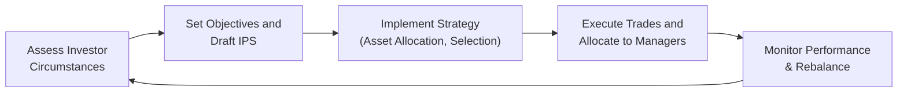

## 10.3 Portfolio Management: An Overview

Sometimes, when we talk about investing, we imagine dissecting a single stock, analyzing every ratio, and poring over each bit of news. That's absolutely important—understanding individual securities can help us gauge intrinsic values. But, you know, I once tried building a retirement portfolio for a relative by cherry-picking individual stocks without paying attention to overall risk. The experience was, uh, enlightening (and a bit painful). It showed me that focusing on single securities is only part of the story. The bigger vision is how all these holdings blend together. That’s why portfolio management, which emphasizes an integrated approach, is crucial in meeting investment objectives.

Below, we’ll explore how the portfolio approach to investing helps investors spread risk effectively, how the portfolio management process unfolds, the varied needs of different investor types, and the vital difference between different retirement plan structures. Along the way, we’ll delve into the asset management industry, pooled investment vehicles, and lots more. So, let’s roll up our sleeves and step into this wide world of portfolio construction and oversight.

---

### The Portfolio Approach to Investing

What is the “portfolio approach”? Well, instead of looking at each investment in isolation—like shining a light on a single gem—we examine how groups of holdings work together. The rationale is that single-securities risk might be reduced when packaged with other investments that behave differently. This is the essence of diversification. If one stock swoons, another might soar, cushioning the overall portfolio’s fluctuations and hopefully keeping your returns on track.

• Diversification: Rather than putting all your eggs in one basket, you spread your investments across various asset classes (like equities, bonds, and sometimes alternative assets such as real estate or hedge funds), sectors (like energy, healthcare, and technology), and regions (domestic, international, emerging markets). The simple theory is that not everything will drop in value at the same time.  
• Risk Budgeting: Another cool element is allocating risk in line with your goals—maybe you want certain strategies (like high-yield bonds or emerging market stocks) but with boundaries guiding how much risk each strategy adds to the total portfolio. This structuring process is called “risk budgeting,” where you essentially decide how to “spend” your overall risk tolerance across various investments.  
• Strategic vs. Tactical Asset Allocation: You might map out what you think is an ideal long-term mix of stocks, bonds, and other types of assets (that’s your strategic allocation). From time to time, though, you might make near-term adjustments guided by market conditions (tactical allocation). For instance, if you think equity markets are undervalued right now, you might overweight equities temporarily.

On a practical level, the portfolio approach recognizes market movements in correlation. For example, sometimes equities and bonds move in the same direction (especially in extreme market scenarios), but typically they don’t move in perfect sync. Understanding how correlated or uncorrelated various asset classes are can really help shape an effective strategy. Anyway, you get the gist: It’s all about the bigger picture and how these little puzzle pieces work together.

---

### Steps in the Portfolio Management Process

Portfolio management is a continuous cycle that balances planning, execution, and feedback. I like to think of it as cooking a big meal: you plan your recipe, then you select and prepare your ingredients, and finally—taste, adjust, and keep everything fresh. In finance terms, we typically break it down into three phases:

#### Planning
The first step is about understanding who you’re investing for and what they need:

• Investor Circumstances: For an individual, are they saving for retirement in 20 years, or do they need to fund a house down payment in 3 years? For institutions, do they have massive long-term liabilities, like pension payments, or must they maintain high liquidity to meet near-term obligations?  
• Constraints and Objectives: Risk tolerance, liquidity needs, time horizon, tax considerations, legal and regulatory constraints, and unique preferences (like ethical or socially responsible investing) feed into plan formation.  
• Investment Policy Statement (IPS): This is the formal, written document that captures all these details. It states the objectives (often couched in terms of risk and return) as well as constraints like investment time horizon, liquidity requirements, and regulatory or governance issues. The IPS becomes a guiding light for all future decisions.

#### Execution
Once the plan is clear, it’s time for action:

• Asset Allocation: This step determines the broad mix of asset classes in the portfolio, often referred to as the “biggest driver” of performance. It’s typically broken into:  
  – Strategic Asset Allocation: The baseline or target portfolio allocation that remains fairly consistent over the long run.  
  – Tactical Asset Allocation: Short-term adjustments to the strategic weights in reaction to market conditions or opportunities.  
• Security Selection: Within each asset class, choose specific instruments (e.g., selecting which stocks or bonds to buy). You might also delegate this selection to active managers or use index funds.  
• Trade Execution: Implementation can be straightforward (buy some shares using a brokerage platform), or more complex (using derivatives to hedge interest rate risks, or setting up algorithmic trades to reduce market impact).  
• Allocation to Specific Managers/Funds: If you’re managing a big institutional portfolio, you might pick specialized asset managers for certain strategies (like emerging markets or small-cap equities).

#### Feedback / Monitoring
Nothing in investing is “set it and forget it.” Even though some strategies are less hands-on than others, you still have to:

• Review Performance: Did the portfolio meet its objectives over the last quarter or year? Did those individual managers underperform or outperform?  
• Rebalance: If your allocation drifts from targets (say, stocks soared and now make up a larger fraction of your portfolio than initially planned), you’ll rebalance to your desired mix.  
• Update Strategy: Factors change—maybe the investor’s risk tolerance shifts, or there’s a tax law update, or the markets look extremely different from your assumptions. Adjustments keep the portfolio aligned with the original (or updated) IPS.

If you prefer a quick visual of this iterative loop, here’s a helpful diagram:

---

### Types of Investors and Their Distinctive Needs

Not everyone is in the same boat. An 80-year-old retiree has vastly different goals than a 20-something who just started working. Likewise, a big pension fund with billions in assets has unique objectives compared to a commercial bank. Let’s consider some broad categories:

#### Individuals
• Varied Goals: Individuals might be saving for retirement, kids’ college funds, a dream home, or philanthropic legacy. Each goal can influence how you build a portfolio.  
• Risk Tolerance: Differences in age, wealth, personality, and obligations can lead to drastically different comfort levels with potential losses.  
• Time Horizon: Generally, younger folks have a longer time frame to invest and can handle more volatile assets. But an individual nearing retirement might opt for less-risky investments.

#### Institutional Investors
• Pension Funds: They often have very long horizons, especially Defined Benefit (DB) plans, because they need to meet retirees’ financial needs decades down the road. They may prefer stable, long-term growth.  
• Insurance Companies: They have to hold investments that match or exceed future claim liabilities, often requiring high-grade bonds or structured products that focus on safety and liquidity.  
• Endowments and Foundations: These organizations aim to preserve capital while generating enough returns to fund grants or operations in perpetuity. They may hold more aggressive, growth-oriented portfolios if their charters allow.  
• Banks: They have to keep sufficient liquidity to meet depositor withdrawals (and adhere to strict regulatory capital requirements), which influences the kinds of securities they can hold.

#### Asset Managers
Asset management companies invest on behalf of others. They typically adhere to mandates and constraints set by their clients or the fund’s stated objectives. The main difference is that asset managers jostle in a competitive environment, showcasing their track record and controlling fees to attract investors and grow assets under management (AUM).

---

### Defined Contribution (DC) versus Defined Benefit (DB) Plans

Retirement planning is a huge part of portfolio management. There are two main flavors of employer-sponsored retirement plans:

#### Defined Contribution (DC) Plans
• Fixed Contributions: The employer (and often the employee) contributes a set amount (e.g., a percentage of the employee’s salary) into a retirement account.  
• Investment Risk: The employee picks from a menu of investment options—often mutual funds—and bears the ultimate risk/reward of the portfolio’s performance.  
• No Guaranteed Final Benefit: The final payout at retirement is not guaranteed; it depends on how well the investments perform over time.  
• Example: A 401(k) in the United States.

If you’re the plan sponsor, you’re mostly off the hook for the actual performance. If you’re the plan participant, you need to keep an eye on your holdings—maybe not daily, but at least periodically—and adjust as your situation changes.

#### Defined Benefit (DB) Plans
• Promised Benefits: The employer commits to paying a certain amount in retirement, often calculated based on years of service and salary history.  
• Employer Bears Risk: Because the benefit is fixed, the employer is on the hook to make sure the plan has enough assets to meet those liabilities.  
• Actuarial Calculations: DB plans rely on actuarial assumptions (like life expectancy and wage growth) to figure out how much the company must contribute to meet future obligations.  
• Example: A traditional company pension that pays a fixed monthly benefit in retirement.

DB plans typically invest more conservatively or in a way that matches the plan’s liabilities, though many still hold equities to generate growth. Some large, well-funded DB plans also invest in alternative assets to seek higher returns and diversification.

---

### Aspects of the Asset Management Industry

Asset management is an entire industry in itself, managing trillions of dollars worldwide through a plethora of investment vehicles and strategies. The main points:

• Mutual Funds: Highly regulated, typically open-ended funds that pool assets from multiple investors who share in the gains and losses.  
• ETFs: Similar to mutual funds but traded on exchange throughout the day. They often seek to mimic an index but can also be actively managed.  
• Hedge Funds: Private funds with more flexible strategies (long-short, derivatives, leverage). Often limited to sophisticated investors.  
• Private Equity Funds: Pool capital to buy or invest in private companies.  
• Other Structures: Real estate investment trusts (REITs), infrastructure funds, socially responsible funds, etc.

Competition among asset managers is fierce. Many tout their performance records, specialized expertise, and lower fees to draw investors. The size of assets under management brings scale advantages, but can also introduce complexities (a huge fund might struggle to move in or out of positions swiftly without affecting market prices).

---

### Mutual Funds and Other Pooled Investment Products

Pooled investments let individual or institutional investors gain access to a diversified portfolio without the burden of piecing together everything themselves. Some key structures:

• Mutual Funds:  
  – Open-End Funds: Continually issue new shares or redeem existing shares at the net asset value (NAV), typically priced at the end of each trading day.  
  – Multiple Share Classes: Different fee structures (e.g., some might have front-end loads, others might not).  
• Closed-End Funds:  
  – Fixed Number of Shares: These trade on stock exchanges, so the price fluctuates based on supply and demand, not just the underlying NAV.  
  – Potential Premiums or Discounts to NAV: You might see these funds trading at a discount or premium to the value of the assets they hold, which can be compelling for certain strategies.  
• ETFs:  
  – Intraday Trading: Can be bought or sold on exchanges at market prices throughout the day.  
  – Often Passive: Many replicate an index or strategy but a growing segment is actively managed.  
  – Tax Efficiency: A big selling point in some jurisdictions because of in-kind share redemptions.  
• Hedge Funds and Private Partnerships:  
  – Strategy Variety: May engage in short selling, leverage, derivatives, and other sophisticated tactics.  
  – Less Regulated: Typically open to qualified or accredited investors—meaning folks or institutions with sufficiently high net worth or income.  
  – Liquidity Constraints: Many require lock-up periods, restricting capital withdrawals for a set time frame.

---

### Best Practices, Pitfalls, and Key Considerations

• Don’t Overreact to Short-Term Noise: It’s easy to become flustered by volatility. Try to let your risk and return objectives outlined in the IPS guide you.  
• Rebalance Periodically: Left unchecked, your portfolio can morph into a riskier or more conservative animal than you intended, simply because of market movements.  
• Avoid Concentrated Positions: Unless you have specialized knowledge or a unique strategy, large single-stock exposures can wreak havoc on your portfolio’s risk profile.  
• Understand Costs and Fees: Trading costs, management expenses, performance fees, and taxation can eat into returns.  
• Stay Informed About Regulatory and Tax Regimes: They can shift, impacting everything from allowable investments to after-tax returns.  
• Evaluate Correlations: During normal times, assets might show nice diversification benefits. However, in crisis periods, correlations can spike, limiting the protective benefits you originally hoped for.

---

### Glossary

• Diversification: The practice of spreading investments across different assets to reduce unsystematic risk.  
• Investment Policy Statement (IPS): A written document outlining your (or your client’s) objectives, constraints, risk tolerance, return requirements, and investment guidelines.  
• Defined Benefit Plan: A pension plan where the employer promises a specific retirement benefit—employer bears the investment risk.  
• Defined Contribution Plan: A pension plan where contributions are specified but the final benefit depends on investment performance—employee bears the investment risk.  
• Mutual Fund: An investment vehicle that pools money from many investors to buy securities, managed by a professional investment firm, typically open-ended.  
• Exchange-Traded Fund (ETF): A fund trading on an exchange, often mirroring an index or investment strategy, offering intraday liquidity.

---

### References and Further Reading

- CFA Institute Official Curriculum, Level I, “Portfolio Management” topic.  
- Maginn, J. T., Tuttle, L. E., Pinto, J. E., & McLeavey, D. W. (2007). Managing Investment Portfolios: A Dynamic Process. CFA Institute Investment Series.  
- Bernstein, P. L. (1996). Against the Gods: The Remarkable Story of Risk. Wiley.  
- Swensen, D. F. (2009). Pioneering Portfolio Management. Free Press.

---

## Test Your Knowledge of Portfolio Management



### Which statement best describes diversification in portfolio management?

- [ ] Holding a single stock in a portfolio.
- [x] Spreading investments across different assets to reduce unsystematic risk.
- [ ] Focusing exclusively on government bonds to avoid risk altogether.
- [ ] Investing only in equities that belong to the same sector.

> **Explanation:** Diversification involves investing in a range of different asset classes, industries, and geographic markets to reduce the risk associated with any one investment.

### Which phase of the portfolio management process includes developing an Investment Policy Statement (IPS)?

- [x] Planning phase
- [ ] Execution phase
- [ ] Feedback/Monitoring phase
- [ ] Post-Implementation phase

> **Explanation:** The IPS is created during the planning stage. It captures the investor’s objectives and constraints, guiding subsequent portfolio decisions.

### What is a primary difference between strategic and tactical asset allocation?

- [x] Strategic asset allocation is focused on long-term goals, while tactical asset allocation is about shorter-term shifts based on market conditions.
- [ ] Strategic allocation involves choosing individual securities, while tactical allocation involves choosing asset classes.
- [ ] They are essentially the same, just different terminologies for the same process.
- [ ] Strategic allocation is only applicable to high-net-worth individuals.

> **Explanation:** Strategic asset allocation sets a baseline portfolio reflecting long-term targets. Tactical adjustments deviate from these targets temporarily to exploit market opportunities or mitigate risks.

### Why might an insurance company emphasize holding high-grade fixed-income instruments?

- [x] To ensure liquidity for future claims and maintain stability in the investment portfolio.
- [ ] Because equity investments are illegal for insurance companies.
- [ ] To chase higher returns without regard to overall risk.
- [ ] Because regulators mandate investing solely in foreign equities.

> **Explanation:** Insurance companies must ensure adequate liquidity and protect their capital to meet claims and regulatory solvency requirements, making safer, high-grade bonds more appealing.

### How does a defined benefit (DB) pension plan differ from a defined contribution (DC) plan?

- [x] In a DB plan, the employer bears the investment risk; in a DC plan, the employee bears it.
- [ ] In a DC plan, the employer has guaranteed retirement payments; in a DB plan, the employee is responsible for the final benefit.
- [x] DB plans normally promise a set retirement amount; DC plans do not guarantee future benefits.
- [ ] DC plans require longer minimum vesting periods than DB plans.

> **Explanation:** DB plans promise a retirement benefit, so the employer must fund any shortfall. DC plans have no guaranteed benefit; final payouts depend on contribution levels and investment performance.

### What is one reason rebalancing is an important part of portfolio management?

- [x] It helps maintain the intended risk–return characteristics of the portfolio.
- [ ] It eliminates the need for an IPS.
- [ ] It guarantees above-market returns.
- [ ] It prevents any losses in the portfolio.

> **Explanation:** Over time, positions can drift from their target weights due to market fluctuations. Rebalancing realigns the portfolio with the investor’s intended strategic or tactical asset allocation.

### Which of the following best describes an open-end mutual fund?

- [x] A fund that continually issues and redeems shares at net asset value (NAV).
- [ ] A fund with a fixed number of shares that trade on an exchange.
- [x] A product with multiple share classes, often subject to different fee structures.
- [ ] A private partnership restricted to accredited investors.

> **Explanation:** An open-end mutual fund issues and redeems shares directly based on NAV, often offering share classes with varied fee structures. This is distinct from closed-end funds or ETFs.

### One advantage of an ETF over most mutual funds is:

- [x] Intraday trading and pricing, enabling investors to buy or sell throughout the trading day.
- [ ] Guaranteed better performance than mutual funds.
- [ ] Absence of any fees or expenses.
- [ ] They only invest in fixed-income assets.

> **Explanation:** ETFs trade like stocks, which means intraday liquidity. Mutual funds are priced once daily, at the close of market. ETFs can have fees, but their structure can be more tax-efficient for some investors.

### Which of the following is most likely a short-term reason for making tactical asset allocation changes?

- [x] Belief that equity markets are undervalued, leading to a temporary overweight in equities.
- [ ] Setting the baseline long-term weights of stocks and bonds.
- [ ] Creating investment policy guidelines for a new client.
- [ ] Determining risk tolerance for a 30-year retirement horizon.

> **Explanation:** Tactical shifts are made to capitalize on perceived market mispricings or short-term opportunities, such as believing equities are undervalued.

### In portfolio management, is it true or false that strategic asset allocation completely eliminates the need for any follow-up portfolio monitoring?

- [x] True
- [ ] False

> **Explanation:** This is a trick statement intended to highlight the importance of monitoring. In reality, ongoing monitoring is crucial to ensure the portfolio remains aligned with objectives and constraints, even if the strategic weights do not change frequently.


