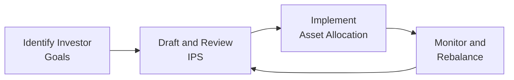

## 10.4 Basics of Portfolio Planning and Construction

Imagine you’ve just landed your first big gig—maybe you’ve saved up some money, or you’ve been asked to help manage a small charitable fund, or your family wants you to take care of a small inheritance. It’s all exciting, right? Then you sit down to figure out what to do with these funds, and suddenly you realize there are all these things you need to keep in mind: risk tolerance, time horizon, legal stuff, taxes, you know, the works. Well, that’s where a bit of formalized planning called a Written Investment Policy Statement (IPS) comes in handy.

People often ask, “But do I really need one of these policy statements? Isn’t that just for huge institutions or super-rich individuals?” Actually, an IPS can be helpful for practically anyone with measurable objectives—even for smaller portfolios. Think of an IPS as a roadmap that keeps you heading in the right direction and ensures accountability between you and whoever is managing the money (which might just be you!). Let’s explore exactly how this works.

### Why Have a Written Investment Policy Statement (IPS)?

You might wonder why it’s so crucial to put your basic portfolio plan into writing. Well, if you’ve ever tried assembling furniture without reading the manual—perhaps hoping to “wing it” based on the picture on the box—you’ll know how easily things can get mixed up. An IPS is that “instruction manual,” but for your portfolio.

An IPS clarifies objectives and constraints. It’s not just for compliance or best practice reasons (though that can matter if you’re an institutional investor). More importantly, it ensures that your investment strategy aligns with your actual financial needs, comfort level, and future plans. Whether your portfolio is designed for retirement, a child’s education fund, philanthropic endeavors, or something else, the IPS is the place to explicitly document that purpose.

Beyond that, the IPS explicitly sets guidelines on acceptable risk levels, expected return goals, liquidity needs, time horizons, legal and regulatory constraints—like pension rules in certain jurisdictions—and even unique personal preferences, such as excluding specific industries or focusing on environmental, social, and governance (ESG) factors. The clarity provided by the IPS helps decision-makers, be they individual investors or outside money managers, stay on track. It’s like a trusty compass in the jungle of investment choices.

Let me share a quick anecdote. A while back, I met a friend who had a decent sum from selling his small tech startup. He wanted to invest but had no plan beyond “I want to make more money!” He ended up chasing hot stocks, listening to random rumors, and eventually found his portfolio in chaos. Later, he got help drafting a simple IPS that stated his risk tolerance, time horizon, desired liquidity, and personal preferences (he absolutely hated tobacco stocks, for instance). Suddenly, most investment decisions had a clear rational basis: “Would buying Stock A align with my IPS?” If the answer was “yes,” he’d go for it. If “no,” then he’d think twice. That discipline made all the difference.

So, in short: an IPS is there to ensure what you do in your portfolio lines up with why you’re investing in the first place.

### Major Components of the IPS

Though each IPS looks a bit different depending on who it’s for, most share some common elements. Think of it like a recipe—you need your ingredients list, cooking instructions, and maybe a little note about who it’s serving (and whether they have dietary restrictions!). In portfolio-land, these “ingredients” include:

Statement of Investment Objectives  
• This is where you jot down your core goals. Is the investor seeking long-term capital growth, short-term income, or something else entirely? Some folks aim for a modest, stable return to beat inflation, while others want aggressive growth.  
• Typically, these objectives can be split into short-term (maybe you need quick liquidity in two years to buy a house) and long-term (retirement in 20 years, for example).

Statement of Investment Constraints  
• Constraints go hand in hand with objectives. Once you know what you’re aiming for, you figure out what stands in your way or shapes your path. These constraints often include:  
  – Liquidity: Do you need quick access to the funds for an emergency, or can you lock the money up in a less liquid investment?  
  – Time Horizon: Are you investing for your child’s college (say, 10 years from now) or for your own retirement 35 years away?  
  – Taxes: This is a big one. High net-worth or high-income individuals, for instance, might go for tax-advantaged accounts. Or maybe you live in a place with high capital gains tax. Your IPS should clarify how those issues affect your investment choices.  
  – Legal and Regulatory: If you’re managing a corporate pension or a foundation, certain laws and guidelines (like ERISA in the U.S.) will apply.  
  – Unique Circumstances: Maybe you have philanthropic aims, or you want to exclude industries you consider unethical. The IPS will mention these specifics.

Performance Measurement Benchmarks  
• It’s all well and good to have objectives, but how do you know if you’re actually succeeding? Benchmarks are your measuring stick. For an equity-heavy portfolio, you might compare performance to a broad index like the S&P 500. For a balanced portfolio, you could use a blend of equity and fixed-income indices.  
• Benchmarks should be consistent with your investment strategy. If you’re only investing in small-cap stocks, an all-market index like the S&P 500 might not be the best gauge of success. You’d pick a small-cap index or a combination that better represents your chosen universe.

Governance  
• Who’s in charge of all this? Who makes the final call on investment decisions, and who just consults? Who sets the benchmarks? If there’s a portfolio manager, how do they communicate with the investor or the board of trustees?  
• The IPS outlines roles and responsibilities, ensuring accountability. Everyone knows their piece of the puzzle and under what conditions they can act.

It can feel like a lot, but once you’ve put these components on paper, you’ve got a blueprint for building the portfolio. In the following sections, we’ll highlight how risk and return objectives fit into this bigger picture, and how constraints drive so many of the practical choices we make.

### Risk & Return Objectives

At the heart of your IPS are two big questions: How much risk can you stomach, and how much return do you need? These factors define your portfolio’s essential DNA.

Return Objective  
• This might be expressed as a specific number (e.g., I want a 7% annual return) or benchmark-based (e.g., I want to beat the S&P 500 by 1% each year).  
• Sometimes, especially for institutional portfolios, the return objective can be something like “At least 2.5% above inflation over 10 years,” or “Meet our defined benefit pension obligations.”  
• The key is that you’re being realistic. It’s easy to say “I want 15% a year,” but is that feasible given your constraints and market realities?

Risk Objective  
• If you’re not sleeping at night because your portfolio is gyrating too wildly, you’re probably taking on more risk than you can handle. Balancing your “willingness” and “ability” to bear risk is critical.  
• Some people are psychically tolerant of risk but can’t truly afford a large drawdown if, say, they’re about to retire in two years. Conversely, a younger investor might be overly fearful of short-term market turbulence even though they genuinely have time to recover from dips.  
• A formal risk objective might say something like, “The annualized standard deviation of returns should not exceed 12%,” or “We aim to limit maximum portfolio drawdown to 15%.” Of course, real-world markets don’t always respect your lines in the sand, but these guidelines help keep your portfolio’s volatility range in mind.

Reconciling Willingness vs. Ability to Take Risk  
• Let’s say an investor really wants to chase maximum returns, but they have a short investment horizon or critical liquidity needs. The “ability” to take risk is low, even though the “willingness” might be high. A mismatch can spell disaster, so the IPS aims to find a balanced approach.  
• In my opinion, ignoring the difference between willingness and ability is one of the biggest oversights novices make. It’s easy to get swept up in bullish market moods or get anxious when markets retreat, so carefully evaluating both aspects keeps you from making knee-jerk decisions.

In a nutshell, your risk and return objectives become the twin pillars you use to build out every other detail of your policy. Keep them front and center.

### Constraints and Their Implications

Constraints are like guardrails on the road. Without them, you might veer off and wind up in a ditch. But occasionally, constraints also help you do interesting things, like incorporate personal or social values into your investing. Let’s dig a bit deeper into each constraint:

Liquidity  
• Liquidity is about how easily and quickly you can convert assets to cash. If you need frequent or large cash withdrawals, you might require more liquid assets—like money market funds or Treasury bills.  
• If you can lock up money for years, you can invest in less liquid stuff like private equity or certain hedge funds.  
• The advantage of less liquid investments can be the potential for higher returns or access to unique opportunities. The downside is you can’t just snap your fingers and get your money out when you need it.

Time Horizon  
• The shorter your time horizon, the more cautious you generally have to be due to market volatility. A big loss near the end of your time horizon can ruin your plans.  
• With a long time horizon, you can (maybe) ride out market downturns, so you can genuinely consider growth-oriented, riskier assets.  
• A big question is whether your time horizon is truly long-term, or if it’s segmented. For instance, a multi-stage retirement plan might have near-term income needs but also longer-term growth needs.

Taxes  
• Taxes can heavily influence how you allocate your investments. If your top priority is tax minimization, you might use tax-advantaged structures or pick securities that distribute minimal taxable gains.  
• Some folks ignore taxes until they get a massive capital gains bill, which can be, well, a surprise, to say the least.  
• Being upfront about your tax situation in the IPS helps guide you toward tax-managed strategies, if relevant.

Legal and Regulatory  
• In some places, if you’re managing a pension fund, you must adhere to certain codes (like ERISA in the United States). If you’re managing an institutional endowment, there could be a board or government entity that sets guidelines.  
• Individual investors usually have fewer explicit legal constraints but still need to comply with relevant regulations for their accounts.

Unique Circumstances  
• This can include anything from ethical or faith-based investing preferences (“No investments in tobacco or arms manufacturers,” for instance) to concentrated positions in a certain stock that the investor is unwilling to sell.  
• ESG (Environmental, Social, Governance) constraints are increasingly common, with investors asking their managers to screen out certain categories or focus on sustainable businesses.  
• Sometimes these unique constraints might also include stark practicality, such as “I have half my net worth tied up in a family business, so I need the rest of my portfolio to be more conservative.”

Basically, all these constraints shape the portfolio’s composition in tandem with risk and return objectives. If the investor has a short time horizon, they likely can’t afford to hold illiquid private equity for 10 years. If they have moral constraints against certain equities, that affects the set of potential investable securities. You see how the puzzle pieces start to fit together.

### Specification of Asset Classes in Asset Allocation

Now that we know the objectives and constraints, how do we decide where to invest? That’s basically the asset allocation question, one of the most critical portfolio decisions you’ll make.

Strategic Asset Allocation (SAA) vs. Tactical Asset Allocation (TAA)  
• Strategic Asset Allocation is the long-term “policy” allocation that aligns with the investor’s IPS. It’s like setting your cruise control on a road trip. You decide on target weights for, say, large-cap equities, small-cap equities, international stocks, bonds, and so on, based on your long-run outlook and risk tolerance.  
• Tactical Asset Allocation is more of a short-term or opportunistic tweak to those target allocations. Maybe you think stocks are undervalued, so you tilt a bit heavier into equities for a stretch. Or you foresee rising interest rates, so you temporarily reduce your bond exposure.

Why Are Asset Classes Important?  
• Asset classes are generally groups of securities that share similar characteristics, behave similarly in the marketplace, and are governed by the same laws. Stocks, bonds, real estate, commodities, and cash-like instruments each have their own risk and return profiles.  
• Modern research shows that a large chunk of a portfolio’s overall return variability (some studies say around 90%) is explained by your asset allocation—not which stock or bond you pick.  
• The IPS typically spells out the target allocation range for each asset class. For instance, maybe the policy says you’ll keep domestic equities at 40%–50% of the portfolio, bonds at 30%–40%, and real estate at 10%–15%. You’ll have to rebalance periodically to stay close to these targets.

Rebalancing  
• Markets can cause your actual allocation to drift away from the desired policy. If equities surge in a bull market, your equity portion might blow past its target. That’s not necessarily bad, but it might violate your risk objective.  
• Rebalancing is simply the act of trimming positions that have outgrown their targets and adding to positions that have underperformed. It keeps your portfolio aligned with the strategic plan.  
• However, rebalancing might come with transaction costs or tax consequences, so investors weigh those factors carefully when deciding on rebalancing thresholds and frequency.

### Principles of Portfolio Construction

Okay, so how do you pull all these threads together—IPS, objectives, constraints, asset allocation—into a real-world portfolio? It’s both an art and a science, but here are a few guiding principles:

Diversify to Reduce Idiosyncratic Risk  
• Diversification is the idea of not putting all your eggs in one basket. By investing in multiple asset classes, sectors, and perhaps geographies, you can reduce the impact of a single underperforming holding on your overall returns.  
• Careful, though: if you pick too many similar assets, you might not be as diversified as you think. For instance, different large-cap tech stocks might be highly correlated.

Construct Multi-Asset Portfolios to Achieve Risk and Return Goals  
• Most portfolios for large institutions, and even many individuals, include a mix of equities, fixed income, and maybe alternative investments (like real estate or private equity).  
• The exact blend goes back to your risk and return objectives. If you need stability and steady income, bond-heavy or stable dividend-paying stocks might be a priority. If you have a longer horizon and want growth, equities or alternatives might increase.

Periodic Review and Rebalancing  
• Building a portfolio is not a “set it and forget it” affair. Even if you have confidence in your strategic asset allocation, markets and your personal circumstances can change. You might get married, have kids, inherit money, or face unexpected expenses.  
• Regular check-ups (maybe annually, quarterly, or even monthly for institutional investors) can keep your plan on track.  
• If something major in your life or the market environment shifts, you may need to revisit the IPS.

Psychological and Behavioral Considerations  
• Behavioral finance (see 10.5 The Behavioral Biases of Individuals) shows us that people don’t always invest rationally. We get scared, euphoric, or anchored to past beliefs.  
• A strong IPS helps mitigate these biases by giving a rulebook you can refer to when emotions run high.  
• If you find yourself tempted to deviate from your strategy, revisit your IPS to confirm whether it’s a truly justified, rational decision or just a reaction to short-term market noise.

Let’s visualize a simplified process for portfolio planning and construction in a diagram:

In many professional investment mandates, this cycle runs constantly. You identify objectives, craft or refresh the IPS, implement the strategy, monitor performance, rebalance if needed, and then review the IPS again to ensure it remains relevant.

In reality, portfolios evolve. Even the best-crafted design might need tweaking if, for example, your constraints shift drastically—maybe you come into a large inheritance, or you decide to move to a different tax jurisdiction that changes your approach. That’s the beauty of having a documented policy: you have a baseline to revise rather than making frantic, ad-hoc adjustments.

Below is a common mathematical expression for your portfolio’s average return and standard deviation, terms you might discuss while setting risk/return objectives in the IPS:

If your portfolio has returns \\( r_1, r_2, \dots, r_n \\), then:


\bar{r} = \frac{1}{n}\sum_{i=1}^n r_i


This \\(\bar{r}\\) is the mean return over \\(n\\) periods.

Your portfolio’s standard deviation \\(\sigma\\) is:


\sigma = \sqrt{\frac{1}{n-1}\sum_{i=1}^n (r_i - \bar{r})^2}


This measures the volatility of returns around the mean—essential for quantifying risk. In practice, you might refine these formulas to reflect annualized measures or weight by the size of each position, but the concept remains: understanding average returns and volatility helps you gauge whether your portfolio meets the IPS risk and return targets.

### A Quick Case Study

Let’s say we have a fictional investor, Charlotte, who is 40 years old and aims to retire at 65. She’s currently building a retirement portfolio. Through discussions with her adviser, they find out:

• She wants about 7% annual returns over the long term.  
• She’s moderately risk-tolerant but can’t stomach catastrophic losses.  
• She has 25 years until retirement, which is a decent time horizon.  
• She doesn’t have significant liquidity needs beyond a small emergency reserve.  
• She’s concerned about climate change and doesn’t want to invest in coal companies.  
• She invests in a country with relatively high capital gains taxes.

Her IPS might then read (in part):
• Investment Objective: Annual average total return of 7% net of fees, aiming for moderate growth.  
• Risk Objective: Portfolio standard deviation to remain within 12%–15% over a rolling 3-year period.  
• Constraints:  
  – Liquidity: Maintain at least 3% of assets in highly liquid form.  
  – Time Horizon: 25 years to retirement.  
  – Taxes: Use tax-advantaged accounts where possible (e.g., 401(k) or IRAs in the U.S.), manage taxable accounts with attention to capital gains.  
  – Legal/Regulatory: No special compliance issues beyond basic tax laws.  
  – Unique: Exclude companies primarily involved in thermal coal.  
• Asset Allocation: 60%–70% equities (including ESG-screened mutual funds), 25%–35% fixed income, up to 10% real estate, with periodic rebalancing.

A simple policy, but it hits all the main points. Now Charlotte and any adviser she uses can reference this IPS whenever there’s uncertainty or new opportunities.

### Glossary

Investment Policy Statement (IPS):  
A blueprint that outlines objectives, constraints, and responsibilities for an investment portfolio.

Return Objective:  
A stated goal for the portfolio’s annual or multi-year returns, either absolute (e.g., 7% a year) or relative (e.g., outperform a particular benchmark).

Risk Objective:  
A definition of how much volatility or potential drawdown the investor can tolerate (e.g., standard deviation limits, maximum loss thresholds).

Tactical Asset Allocation (TAA):  
Short-term adjustments to the portfolio’s strategic asset allocation to capitalize on perceived market opportunities or risks.

Strategic Asset Allocation (SAA):  
A long-term, policy-based allocation that aligns the portfolio with its overarching risk and return objectives, typically expressed in target percentage ranges for each asset class.

### References and Further Reading

• CFA Institute Official Curriculum, Level I, “Basics of Portfolio Planning and Construction.”  
• Maginn, Tuttle, Pinto, & McLeavey. (2007). “Managing Investment Portfolios.” CFA Institute Investment Series.  
• Brinson, G. P., Hood, L. R., & Beebower, G. L. (1986). “Determinants of Portfolio Performance.” Financial Analysts Journal.  
• For deeper insights into time value of money, risk measures, and statistical approaches, see Chapter 2: Quantitative Methods.  
• For perspectives on investor psychology and biases, see Chapter 10.5, “The Behavioral Biases of Individuals.”

Maintaining a thoughtful, well-structured portfolio planning and construction process anchors you amid the ups and downs of financial markets. It’s not about guaranteeing success every year—no magic crystal ball can do that. Instead, it’s about ensuring coherence between your goals, your constraints, and the real investments you choose to hold. Don’t let noise or get-rich-quick temptations guide your decisions. An IPS is there to keep you tethered to reality, evolving as needed but always with your best interests in mind.

## Test Your Knowledge: Portfolio Planning and Construction Quiz



### Which of the following is the most important reason for creating a Written Investment Policy Statement (IPS)?
- [ ] To have a document to market investment services to potential clients
- [x] To establish clear objectives and constraints that guide portfolio decisions
- [ ] To list out ways to pick individual stocks or bonds
- [ ] To satisfy a regulatory requirement only for institutional investors

> **Explanation:** While regulatory or marketing aspects can be relevant, the primary purpose is to align the investor’s goals, risk tolerances, and constraints in a guiding document.

### Which component of the IPS specifies how quickly assets may need to be turned into cash?
- [ ] Risk tolerance
- [ ] Return objective
- [x] Liquidity constraint
- [ ] Benchmark specification

> **Explanation:** Liquidity constraints define the need for ready cash, which can drive allocations to more liquid securities.

### What is the primary distinction between strategic asset allocation (SAA) and tactical asset allocation (TAA)?
- [x] SAA is a long-term policy-based allocation, while TAA involves short-term adjustments
- [ ] SAA is used only for individuals, while TAA is used strictly by institutions
- [ ] TAA is performed only annually, while SAA changes daily
- [ ] TAA is more important than SAA in reducing overall portfolio risk

> **Explanation:** Strategic allocation sets the core, long-term mix; tactical allocation makes short-term shifts around that mix based on market views.

### Which of the following is an example of a “unique circumstance” that might appear in an IPS?
- [x] Excluding certain industries for ethical reasons
- [ ] Short-term liquidity needs for living expenses
- [ ] Long-term capital appreciation goal
- [ ] Medium time horizon of 5–10 years

> **Explanation:** Ethical or faith-based exclusions, concentrated stock positions, or other personal nuances are classic unique circumstances.

### An investor wants a target return of 6% annually but cannot accept more than 10% volatility. Which two objectives in the IPS are being referred to?
- [x] Return Objective and Risk Objective
- [ ] Time Horizon and Liquidity Constraint
- [x] Risk Objective and Return Objective
- [ ] Tax Constraint and Liquidity Constraint

> **Explanation:** The desired annual return is the Return Objective, and the volatility limit represents the Risk Objective.

### Which of the following best describes liquidity in a portfolio context?
- [x] The ease with which assets can be converted to cash without significant loss in value
- [ ] The overall risk level an investor can tolerate
- [ ] The time horizon for which an investor holds assets
- [ ] An investor’s preference regarding socially responsible investing

> **Explanation:** Liquidity refers to how quickly and efficiently you can sell an asset. High liquidity means you can convert it to cash relatively easily.

### Which factor is typically least influenced by an investor’s time horizon?
- [ ] Asset allocation toward equities vs. bonds
- [x] The choice of performance benchmark
- [ ] The level of illiquid alternatives held
- [x] The investor’s short-term liquidity needs

> **Explanation:** Time horizon mainly drives the blend of long- vs. short-term assets, not necessarily the choice of a specific performance benchmark. Also, systematic handling of short-term liquidity is often more about near-term constraints than broad time horizon.

### What is a fundamental reason to periodically rebalance a portfolio?
- [x] To align allocations back to the intended strategic asset mix
- [ ] To avoid any transaction fees
- [ ] To always increase portfolio volatility
- [ ] To reduce correlation between asset classes

> **Explanation:** Rebalancing pulls the actual holdings back in line with the strategic policy targets, although it can involve transaction costs and is not solely for correlation reduction.

### In the context of an IPS, a time horizon that is shorter than expected might lead to:
- [x] More conservative asset allocation
- [ ] Greater acceptance of overall risk
- [ ] Higher allocation to equities
- [ ] Elimination of any liquidity considerations

> **Explanation:** A shorter time horizon typically pushes investors to emphasize capital preservation over high-growth, higher-risk securities.

### For an investor who wants an 8% return but no more than 15% volatility, is it guaranteed they will meet these objectives every year if they follow the IPS exactly?
- [x] True
- [ ] False

> **Explanation:** Even a well-crafted IPS cannot guarantee consistent returns or volatility control, as market conditions can fluctuate beyond any investor’s control.


