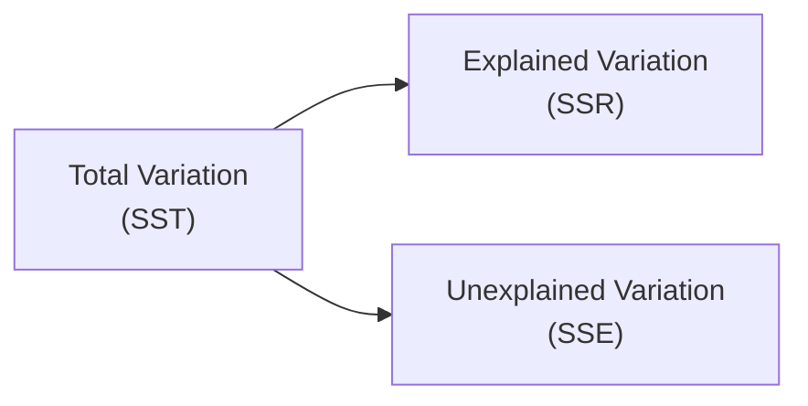

## 2.10 Simple Linear Regression

Sometimes I remember the first time I came across a scatterplot in finance class—dots everywhere, me scratching my head, thinking, “Um, how do I make sense of this?” So, let’s explore that question together in a simple, straightforward way. Simple Linear Regression helps us draw a line through those dots, or data points, so we can (hopefully) spot meaningful trends and make predictions.

### Introduction

Simple Linear Regression is an important tool in quantitative methods (see other sections in Chapter 2, such as 2.8 Hypothesis Testing, for complementary statistical concepts). It tries to explain or predict a “dependent” variable (often denoted y) using a single “independent” or “explanatory” variable (x). We assume there is some sort of linear relationship between x and y, so you might write it like this:

(1) y = α + βx + ε

Where:
• y = Dependent variable (the outcome we’re trying to predict)  
• x = Independent variable (the predictor we use to explain or predict y)  
• α = Intercept (sometimes called a constant)  
• β = Slope coefficient  
• ε = Error term, capturing unexplained variation  

Once we estimate α and β, we get a line—our regression line—that ideally does a decent job of fitting our observed data.

### The Simple Linear Regression Model

The main driver behind simple linear regression is the assumption that the predicted value of y is a linear function of x. In real life, we might use monthly sales (y) as a function of advertising expenditure (x). Another time, we might use a company’s stock return (y) as a function of the market index’s return (x). The possibilities are basically endless in finance, from modeling interest rates to forecasting corporate earnings.

Mathematically, we want to fit a line through the points (xᵢ, yᵢ) such that it captures the overall pattern. The “best fit” line is almost always found using the Ordinary Least Squares (OLS) method.

### Ordinary Least Squares (OLS) Estimation

OLS is a fancy name for the criterion we use to select the optimal α (intercept) and β (slope). We choose α and β to minimize the sum of squared residuals (SSR). Those residuals are just the difference between each observed yᵢ and the predicted value ŷᵢ (i.e., yᵢ - ŷᵢ).

Here’s how we get the estimates of our parameters:

• Slope coefficient (β̂):  

$$
\hat{\beta} = \frac{\sum (x_i - \bar{x})(y_i - \bar{y})}{\sum (x_i - \bar{x})^2}
$$

• Intercept (α̂):  

$$
\hat{\alpha} = \bar{y} - \hat{\beta} \,\bar{x}
$$

where:  
• \\( \bar{x} \\) is the mean of all x values.  
• \\( \bar{y} \\) is the mean of all y values.  

So this is what literally ties your regression line to the data. The slope captures how y changes if x changes by one unit. The intercept is the predicted value of y when x = 0 (though in some cases, x = 0 might not make practical sense—like when x is “years of education,” or “advertising dollars,” or “time,” but let’s keep moving).

#### A Quick Example

Imagine you have monthly sales data (y) and monthly advertising budgets (x). Maybe your dataset is (in thousands of dollars for advertising, and thousands of units sold for sales numbers):

• Month 1: x = 10, y = 65  
• Month 2: x = 12, y = 70  
• Month 3: x = 9,  y = 60  
• Month 4: x = 11, y = 68  
• …  

Plugging these into the formulas will yield specific values of α̂ and β̂. And like magic, you get a line: ŷ = α̂ + β̂x. That line then helps you forecast sales for next month, provided you have an advertising budget guess.

### Interpreting Slope and Intercept

Interpretation is often more important than fancy math. The slope (β̂) is the expected change in y per unit change in x. If β̂ = 2, that tells you that for every 1-unit increase in x, the expected change in y is +2 units. If x = 10 and it moves to 11, then we’d expect y to move from ŷ1 to ŷ2 with a difference of 2. In language: “We expect an additional 2 units of y if x goes up by 1.”

The intercept (α̂) is the value of y when x = 0. But as we mentioned earlier, this may not always be meaningful. For instance, if x represents “years of work experience,” then x = 0 is “no experience.” The intercept is the predicted y for that hypothetical scenario. In some business cases, x=0 might be something we never actually see in practice or doesn’t even exist. So if the intercept is huge or negative or doesn't make sense in real-world terms, we usually just say “it’s the value of the line at x=0,” but we might not interpret it too literally.

### Assumptions of the Linear Regression Model

Well, linear regression is powerful, but it comes with a few big assumptions. Think of them like the ground rules we assume about our data and error terms.

• Linearity: The relationship between x and y is linear. If the actual relationship is curvature or something more complicated, simple linear regression might not be the perfect fit.  

• Independence of Errors: The residuals (ε) should not be correlated with each other. If your data is time-ordered, it’s easy to have autocorrelation. That’s basically consecutive points being related in a pattern.  

• Homoscedasticity: The variance of the error terms is constant across all values of x. When variance changes with x—maybe the residuals get bigger for bigger values of x—that’s heteroscedasticity.  

• Normality of Errors: The error terms are assumed to be normally distributed with mean zero and variance σ². This assumption influences the validity of confidence intervals and hypothesis tests.  

• No or Little Multicollinearity: In simple linear regression with only one x, you don’t have to worry too much about multicollinearity (that’s more relevant for multiple regression, which references other chapters).  

When these assumptions hold, the OLS estimates are “Best Linear Unbiased Estimates” (BLUE). If they don’t hold, well, the inferences and predictions might go haywire.

### Goodness of Fit Measures

After we fit a line, we want to see how well it explains the variation in y. That’s where R², the coefficient of determination, and the Standard Error of the Estimate (SEE) step in.

#### Coefficient of Determination (R²)

R² is a number between 0 and 1 that basically says, “Hey, this fraction of the variation in y is explained by the x variable(s) in your model.” The bigger the R², the more variability your model accounts for. Let’s define it:

$$
R^2 = \frac{\text{Explained Sum of Squares (SSR)}}{\text{Total Sum of Squares (SST)}}
$$

In words, SSR is the portion of the variation in y explained by the regression line, and SST is the total variation in y around its mean.

• If R² = 0.80, it suggests that 80% of the variation in y is explained by the model.  

#### Standard Error of the Estimate (SEE)

The SEE is the standard deviation of the residuals. It shows, on average, how far off your predictions are from the actual observed y values. A smaller SEE means your model predictions are closer to reality. The formula for SEE (sometimes denoted sᵧₓ) is:

$$
\text{SEE} = \sqrt{\frac{\sum (y_i - \hat{y}_i)^2}{n - 2}}
$$

where n is the number of data points. We use (n - 2) because we estimated two parameters: α and β.

### ANOVA and Significance Testing

Analysis of Variance (ANOVA) is used to test the overall significance of your regression model. If you like exploring sums of squares (SST, SSR, SSE), this is your jam. It partitions the total variability (SST) into explained variation (SSR) and unexplained variation (SSE). Then it uses an F-test to see if your model is “statistically significant”—basically checking whether β ≠ 0.

You can visualize it like this:

Where:  
• SST = SSR + SSE  
• SSR is the regression sum of squares.  
• SSE is the error sum of squares.  

We often see an F-test determined by:  
$$
F = \frac{\text{MSR}}{\text{MSE}} = \frac{\text{SSR}/1}{\text{SSE}/(n - 2)}
$$

If this F-statistic is sufficiently large (and the p-value is small), we reject the null hypothesis that β=0, indicating that x is significantly related to y. If not, our fancy regression line might be no better than a random guess.

### Forecasting and Predicting Using Simple Linear Regression

All right, so once we have that line ŷ = α̂ + β̂x, we can predict (or forecast) y for a given x. Let’s say you want to forecast next month’s sales (y) given your planned advertising budget (x). That’s straightforward: just plug x into your equation.

#### Confidence Intervals and Prediction Intervals

Because estimates aren’t guaranteed, we often attach intervals around them. Two common intervals:

• Confidence Intervals (CI): e.g., an interval for the *average* predicted y. “We’re 95% confident that the mean value of y for a given x is between these two numbers.”  

• Prediction Intervals (PI): e.g., an interval for a *particular* predicted value of y. “We’re 95% confident that an individual outcome for y for a given x will be between these two numbers.”  

A PI is wider than a CI because it accounts for the extra uncertainty of an individual observation, not just the average.  

### Transformations and Nonlinearity

So, does that mean all financial data is linear? Ha, not even close. If your data is strongly skewed or you see a pattern in the residuals (like a funnel shape indicating heteroscedasticity), you might try transformations:

• Log transform: Replace y with ln(y) (and/or x with ln(x)).  
• Polynomial: Fit y = α + β₁x + β₂x² + … (a polynomial shape).  
• Other functional forms: Exponential, reciprocal, etc.  

These transformations can address nonlinearity or reduce heteroscedasticity. For instance, in economics, it’s often common to regress ln(y) on ln(x) for elasticity analysis. But for the scope of single-equation, simple linear regression, we typically stick to the format y = α + βx + ε.

### Practical Examples

Let’s imagine Bob, a personal friend, who complains: “I opened a small coffee stall in the weekend farmers’ market, and I notice that on days with more foot traffic (x), I sell more pastry combos (y). But how do I forecast next weekend’s sales?” Step one: gather data on foot traffic and combos sold across multiple weeks. Step two: apply simple linear regression, estimate α̂ and β̂, interpret them. Step three: forecast combos sold for a projected foot traffic figure you might expect next weekend. Step four: check how well the model fits the data using R². If you see that R² is 0.90, that’s a strong relationship, but if it’s 0.25, maybe foot traffic alone is insufficient to explain sales.

### Glossary

• Ordinary Least Squares (OLS): A method to estimate α and β by minimizing the sum of squared residuals.  
• Intercept (α): Predicted value of y when x = 0.  
• Slope Coefficient (β): Expected change in y for a one-unit change in x.  
• Residual (Error) Term (ε): The difference between actual y and predicted y.  
• Homoscedasticity: Constant variance of the error term across different x values.  
• Coefficient of Determination (R²): Fraction of variance in y explained by the model.  
• ANOVA (Analysis of Variance): Statistical method to evaluate the model’s significance by partitioning total variation into explained and unexplained components.  
• Standard Error of Estimate (SEE): Standard deviation of the model’s residuals, measuring predictive accuracy.  

### References and Additional Resources

• Gujarati, D. N., & Porter, D. C. (2008). Basic Econometrics. McGraw-Hill.  
• Kennedy, P. (2008). A Guide to Econometrics. Wiley-Blackwell.  

These texts provide a deeper dive into regression analysis, the math behind OLS, and advanced diagnostic tests for validating assumptions.

So, that’s the gist of simple linear regression. Sure, it can get fancier with multiple regressors, cross-sectional and time-series data intricacies, or advanced techniques like robust standard errors (to tame heteroscedasticity). But for a core understanding, the straightforward approach of a single x explaining y is a pretty awesome starting point for any aspiring analyst or curious mind.  

Anyway, ready to test your understanding?

## Test Your Knowledge of Simple Linear Regression



### What is the primary goal of Ordinary Least Squares (OLS) in Simple Linear Regression?

- [ ] To minimize the absolute value of residuals
- [x] To minimize the sum of squared residuals
- [ ] To maximize the intercept
- [ ] To normalize the residual distribution

> **Explanation:** OLS focuses on minimizing the sum of squared differences between actual y values and predicted y values.

### If a Simple Linear Regression model has a slope coefficient (β̂) of 3.0, what does that mean?

- [x] For each one-unit increase in x, y increases by 3 units on average.
- [ ] The intercept of the regression is 3 units.
- [ ] The coefficient of determination (R²) is 3.0.
- [ ] The residual variance is 3.0.

> **Explanation:** The slope tells you how much y changes when x changes by 1 unit. So β̂ = 3 means y increases by 3 on average for a 1-unit rise in x.

### Which of the following is NOT a standard assumption of the Simple Linear Regression model?

- [ ] Linearity of the relationship between x and y
- [ ] Homoscedasticity of error terms
- [ ] Normality of error terms
- [x] Perfect correlation among multiple independent variables

> **Explanation:** Perfect correlation among multiple independent variables refers to multicollinearity, which is a concern in multiple regression settings, not simple linear regression with one x.

### In an ANOVA table for Simple Linear Regression, the total sum of squares (SST) is partitioned into:

- [ ] Regression sum of squares and total sum of squares
- [x] Regression sum of squares and error sum of squares
- [ ] T-statistic and F-statistic
- [ ] Shapiro-Wilk sum of squares

> **Explanation:** SST = SSR + SSE. SSR is explained by the model; SSE is unexplained (the error part).

### When we say “the intercept (α̂) might not be meaningful,” we mean:

- [x] x = 0 may not be a realistic or observable value in the real world.
- [ ] The intercept is always negative.
- [ ] The intercept cannot be used for predictions.
- [ ] The slope is always the same as the intercept.

> **Explanation:** Sometimes, x=0 is outside the range of data or simply nonsensical. In such cases, the intercept (the predicted y at x=0) isn’t meaningful.

### What does the coefficient of determination (R²) represent?

- [x] The proportion of variance in y explained by the model.
- [ ] The slope of the regression line.
- [ ] The standard error of the regression.
- [ ] The total sum of squares in the data.

> **Explanation:** R² measures how much of y’s variation is accounted for by the regression model.

### Which of the following is true about the standard error of the estimate (SEE)?

- [x] SEE is the standard deviation of residuals, indicating how far observations typically deviate from the regression line.
- [ ] SEE is always equal to R².
- [x] SEE becomes larger if residuals become more variable.
- [ ] SEE is not related to how well the model fits the data.

> **Explanation:** SEE measures the spread of the residuals. The more spread out the points around the regression line, the higher the SEE.

### In a Simple Linear Regression with α̂ = 5 and β̂ = 1.5, if x = 10, what is ŷ?

- [x] ŷ = 5 + 1.5 × 10 = 20
- [ ] ŷ = 10 + 5 × 1.5 = 17.5
- [ ] ŷ = 15 + 5 × 10 = 65
- [ ] ŷ = 1.5 × 5 = 7.5

> **Explanation:** Just plug in x=10: ŷ = 5 + (1.5 × 10) = 5 + 15 = 20.

### Which interval tends to be wider?

- [x] A prediction interval for an individual observation
- [ ] A confidence interval for the mean of y
- [ ] They are always the same
- [ ] Neither is used in regression analysis

> **Explanation:** Prediction intervals are wider because there’s more uncertainty about a single point prediction than about the mean response for a given x.

### True or False: Transformations like taking the logarithm of x or y can help deal with nonlinearity or heteroscedasticity in regression models.

- [x] True
- [ ] False

> **Explanation:** Log transformations and other transformations can often fix or reduce nonlinearity and heteroscedasticity, improving model fit.




