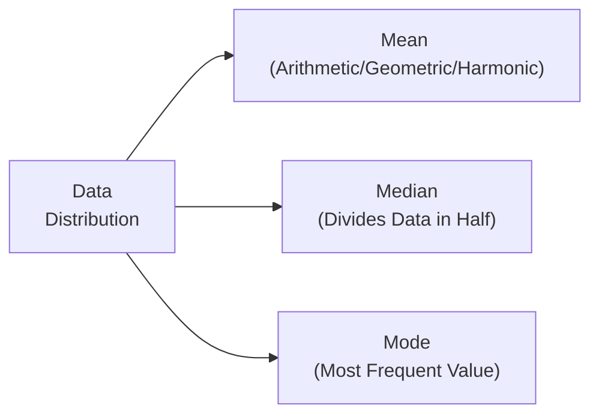

## 2.3 Statistical Measures of Asset Returns

Let’s say you’re juggling a small portfolio of stocks and bonds, and at the end of each month, you look at how each investment performed. Maybe you’re up 2% one month and down 1% the next, and so on. Over time, these returns form a data set that can tell you how well (or not so well) your portfolio is doing. Now, the question is: how do you interpret that data? That’s where statistical measures of asset returns come in.

In this section, we’ll explore how to describe, quantify, and interpret the behavior of asset returns. We’ll begin with measures of central tendency—simple but powerful tools that give a quick sense of where the “middle” of your data is. Then we’ll show how to measure data spread (a.k.a. dispersion), shape (skewness), and tail heaviness (kurtosis). Finally, we’ll introduce correlation to see how multiple assets might move together. Let’s dive in.

---

### Measures of Central Tendency

Central tendency is basically your best guess at “where the data is centered.” When you think of an “average,” you’re typically thinking of the arithmetic mean. But in finance, we have four main measures of central tendency that each serve different purposes:

• Arithmetic Mean  
• Geometric Mean  
• Harmonic Mean  
• Median  
• Mode  

Let’s unpack them one by one.

#### Arithmetic Mean

It’s the plain vanilla average—add up all your returns, then divide by the total number of observations. Formally, for \\(n\\) asset returns \\(r_1, r_2, \ldots, r_n\\):


\bar{r} = \frac{1}{n} \sum_{i=1}^{n} r_i


People love the arithmetic mean because it’s intuitive, and if you’re looking at a single period’s average performance or trying to get a sense of your typical monthly return, this can work great. However, if you’re dealing with returns over multiple periods and you want to know the overall growth rate, the arithmetic mean might mislead you. 

I’ll give you a personal anecdote: once, I tried analyzing a stock that had returns of +50% in one year and –50% the next year. The arithmetic mean was 0%, but my initial investment sure didn’t end up where it started. This leads us to the geometric mean.

#### Geometric Mean

The geometric mean is perfect for measuring growth rates over multiple periods because it accounts for compounding. Mathematically, it’s the \\(n\\)th root of the product of our returns plus 1 (i.e., 1 + return, to represent growth factor), minus 1:


\text{Geometric Mean} = \left(\prod_{i=1}^{n} (1 + r_i )\right)^{\frac{1}{n}} - 1


If your returns over the year are +50% and –50%, then:


(1+0.5)\times(1-0.5) = 1.5 \times 0.5 = 0.75


\left(0.75\right)^{\frac{1}{2}} - 1 \approx -0.13 \quad (\text{or } -13\%)


So, your “average” return is actually –13% per year in geometric terms. Ouch. That’s why geometric mean is often more appropriate than arithmetic mean when analyzing multi-period returns. This measure basically answers: “If I started with \$1, how much would I have after all these compounding periods?”

#### Harmonic Mean

Honestly, the harmonic mean is less common in day-to-day finance discussions, but it’s handy when averaging ratios (like price-to-earnings ratios) or analyzing certain rate-based metrics. In its simplest form:


\text{Harmonic Mean} = \frac{n}{\sum_{i=1}^{n} \left(\frac{1}{x_i}\right)}


If you want a quick rule of thumb: the harmonic mean is always less than or equal to the geometric mean (which is less than or equal to the arithmetic mean), especially when there’s variability in the data. If you measure average speed (e.g., miles per hour) over multiple equal distance segments, the harmonic mean is your friend.

#### Median

Sometimes, you want the value that sits right in the middle of all your returns. That’s your median. If you have an odd number of observations, the median is that single middle value; if you have an even number, it’s the average of the two middle values. Essentially, the median slices the data set in half, so half the data is below the median, and half is above.

This is particularly good if your data has outliers—like a spectacular monthly return of +200% (we can dream, right?), or a catastrophic –80% meltdown. The median won’t get pulled in by extreme values, so it can paint a more stable picture of your “typical” return.

#### Mode

Mode is the most frequently occurring value in your data. For continuous data, like daily asset returns, you often won’t see an exact repeated value, so it’s a bit less common to use. However, if you’re analyzing frequency distributions (for example, credit ratings or stock price bins), the mode might be more meaningful.

---

### Suitability of Each Measure

• **Arithmetic Mean**: Best for a quick “average return” snapshot over a single period or if you expect to “add” the returns.  
• **Geometric Mean**: Fantastic for returns measured over multiple compounding periods.  
• **Harmonic Mean**: Use for averaging ratios or rates (like cost per unit if you purchase shares at different prices).  
• **Median**: Handy if data has outliers, as it’s robust to extreme values.  
• **Mode**: More relevant for discrete or categorical data, not so much for continuous returns.

---

### Measures of Location

Beyond the central measures, we often care about where specific points lie in the distribution. This is especially relevant if you want to see how often returns thrive in the top 10% or slump in the bottom 5%. That’s where percentiles, deciles, and quartiles come into play.

• **Percentiles**: These partition a data set into 100 equal parts. The 75th percentile is the point below which 75% of observations fall.  
• **Deciles**: Split data into 10 equal parts.  
• **Quartiles**: Split data into 4 equal parts. The first quartile (Q1) is the 25th percentile, the second quartile (Q2) is the 50th percentile (a.k.a., median), and the third quartile (Q3) is the 75th percentile.

If you see that a certain asset’s monthly return is at the 90th percentile relative to peers, that means it outperforms 90% of the group. Understanding location is key when you compare an asset to a benchmark or a group of other similar assets.

---

### Visual Representation Using Mermaid Diagrams

To help illustrate how measures of central tendency align within a distribution, let’s look at a simple diagram. Imagine we plot your asset returns on a number line to spot the mean, median, and mode.

In a perfectly symmetrical (“normal”) distribution, the mean, median, and mode line up exactly. Of course, real-world returns aren’t usually that polite—they can be skewed, or have heavy tails, resulting in these measures diverging.

---

### Measures of Dispersion

Now, we move to the question: “How spread out are those returns?” Dispersion is about understanding the variability or risk. An investment with an average return of 5% but with a standard deviation of 20% is riskier than one with an average of 5% but a standard deviation of only 5%.

Here are the core metrics:

• **Variance (\\(\sigma^2\\))**: The average of the squared differences from the mean.  
• **Standard Deviation (\\(\sigma\\))**: The square root of variance.  
• **Range**: The difference between the maximum and minimum value.  
• **Interquartile Range (IQR)**: The difference between the 75th percentile (Q3) and 25th percentile (Q1).  
• **Mean Absolute Deviation (MAD)**: The average of the absolute deviations from the mean.

#### Variance and Standard Deviation

Let’s say you have \\(r_1, r_2, \ldots, r_n\\) as your returns, and \\(\bar{r}\\) is the mean return. Then:


\text{Variance} = \sigma^2 = \frac{1}{n}\sum_{i=1}^{n} \bigl(r_i - \bar{r}\bigr)^2


\text{Standard Deviation} = \sigma = \sqrt{\sigma^2}


In many finance contexts—especially when dealing with sample data rather than the entire population—you’ll see a slightly different denominator, \\(n-1\\), to give an unbiased estimate of the population variance. That’s called the “sample variance.” But the intuition is the same.

A bigger standard deviation means more volatility. That can be good or bad, depending on your appetite for risk. If you like roller coasters, maybe you’re okay with a large standard deviation. If you get motion sickness, you might prefer a smaller one.

#### Range and Interquartile Range

Range is super simple: it’s just \\(\text{Max} - \text{Min}\\). But it doesn’t tell you much if those extreme values happen once in a blue moon. The interquartile range is often more robust. It focuses on the middle 50% of the data—between the 25th and 75th percentiles. So if your IQR is really wide, it suggests the “middle chunk” of returns is quite spread out.

#### Mean Absolute Deviation

Mean absolute deviation is literally the mean of the absolute differences from the mean. For each observation \\(r_i\\), take \\(|r_i - \bar{r}|\\), sum those up, and divide by \\(n\\). It’s a simpler measure than variance and can feel more intuitive to some folks because it operates in absolute values, not squares.

---

### Shape of the Distribution: Skewness and Kurtosis

Even if we know the center (mean) and spread (standard deviation), we might also care about how returns are distributed around that center. Do we have a chunky tail to the left? A big bulge at the center? Two lumps? Enter skewness and kurtosis.

#### Skewness

Skewness measures the asymmetry of a distribution:

• **Positive skew (right skew)**: The tail extends to the right, and the mean is pulled above the median. You might see a few big positive returns that make the average look higher.  
• **Negative skew (left skew)**: The tail extends to the left, and the mean is pulled below the median. This often happens when a few extremely bad months (like –60% returns) are out there.

If you see a strongly skewed distribution, that signals you shouldn’t rely purely on the mean. You might want to glance at median or even track the possibility of extreme outliers.

#### Kurtosis

Kurtosis is a measure of “tailedness” or how peaked the distribution is:

• **Leptokurtic (> 3 in excess kurtosis)**: Fatter tails and a sharper peak compared to the normal distribution.  
• **Mesokurtic (= 3 exactly)**: Same “tailedness” as a normal distribution.  
• **Platykurtic (< 3 in excess kurtosis)**: Thinner tails and a flatter peak.

If your asset returns have high kurtosis, that means more extreme events—both big ups and big downs—could be more likely than a normal distribution would predict. In other words, a tail event (like a sudden market crash or skyrocketing price) might happen more frequently than you’d think if you assumed normality.

---

### Correlation: Connecting Two Variables

So far, we’ve mostly looked at a single asset’s return distribution. But what if we want to consider two assets side by side, or an asset in relation to a benchmark? That’s where correlation helps. 

The correlation coefficient \\(\rho\\) between two sets of returns \\(x\\) and \\(y\\) is:


\rho_{x,y} = \frac{\text{Cov}(x,y)}{\sigma_x \sigma_y}


where \\(\text{Cov}(x,y)\\) is the covariance between \\(x\\) and \\(y\\), and \\(\sigma_x\\) and \\(\sigma_y\\) are the standard deviations of \\(x\\) and \\(y\\), respectively.

• \\(\rho = +1\\): Perfect positive correlation (they move in lockstep).  
• \\(\rho = 0\\): No linear relationship.  
• \\(\rho = -1\\): Perfect negative correlation (one goes up, the other goes down).

When building a portfolio, correlation is huge. You might find two assets that individually are volatile, but when combined, they can reduce overall portfolio risk if they’re not too correlated. That’s the magic behind “diversification.”

---

### Sampling Error and Non-Normal Returns

In practice, a lot of our measures—mean, variance, correlation—are estimates from a finite sample of historical data. We measure a few months or years, and we assume that’s representative of the future. But the reality is that future returns might look wildly different (especially in stressed markets when correlations tend to spike).

Also, not all asset returns follow a normal distribution. Many exhibit skew or have heavy tails (kurtosis), meaning “rare” events happen more frequently. This is critical if you’re performing risk management. Relying on normal assumptions might send you into a false sense of security.

---

### Putting It All Together in a Real-World Example

Suppose you have monthly returns for a tech stock for the past 24 months:

• Some months, you see swings of +12% or –10%—that’s fairly high volatility.  
• Over the whole period, you might compute an arithmetic mean of +2% per month.  
• The standard deviation might turn out to be 8%.  
• You notice the distribution is slightly skewed to the right, meaning there are a few big up-moves.  
• The correlation with a broad market index might be around +0.7, showing it’s positively correlated—but not perfectly so.

Putting this together:

1. The average monthly return is 2%. A naive approach might suggest 24 months * 2% = 48% total if we just stacked them.  
2. But the geometric mean—accounting for compounding—could be somewhat less than 2% a month.  
3. A standard deviation of 8% means returns can be quite spread out around that mean.  
4. A positive skew says you have the potential for big upside surprises, but that doesn’t mean the downside risk is negligible.  
5. The correlation of +0.7 with the market suggests you’re exposed to systemic movements, but there’s still some diversification benefit if you pair this with assets that have lower correlation.

---

### Best Practices, Pitfalls, and Strategies

• **Use the geometric mean for multi-period returns**—don’t just rely on the arithmetic mean.  
• **Check for outliers**; the mean might be misleading if a few extreme values dominate.  
• **Understand distribution shape** (skewness, kurtosis). If your data is heavily skewed or leptokurtic, normal-based methods (like Value at Risk or standard deviation as a risk proxy) might understate tail risk.  
• **Beware of correlation breakdowns** in stressed markets. Sometimes assets that seemed uncorrelated might suddenly move in sync during a crisis (the dreaded “all correlations go to 1” phenomenon).  
• **Use sample statistics carefully**; remember they’re estimates from historical data and might not perfectly forecast the future.

---

### References and Additional Resources

- Sharpe, W. F., Alexander, G. J., & Bailey, J. V. (1999). Investments. Prentice Hall.  
- LeBow, G. (2017). Statistics for Business and Financial Economics. Springer.  
- “Statistical Analysis for Business” (Wiley).  

Exploring any of these will help you deepen your understanding, particularly when you start tackling advanced topics like hypothesis testing (Chapter 2.8) or big data analytics (Chapter 2.11).

---

## Test Your Knowledge: Statistical Measures of Asset Returns



### Which measure of central tendency should be used to calculate an average growth rate over multiple periods?

- [ ] Arithmetic Mean
- [x] Geometric Mean
- [ ] Harmonic Mean
- [ ] Median

> **Explanation:** The geometric mean is appropriate for multi-period returns because it captures the effect of compounding over time.

### Comparing the arithmetic mean to the geometric mean, which statement is correct?

- [ ] The arithmetic mean is always smaller than the geometric mean.
- [x] The arithmetic mean is generally higher or equal to the geometric mean.
- [ ] They are always the same value.
- [ ] They have no relationship to each other.

> **Explanation:** Because the geometric mean accounts for compounding, it is usually less than or equal to the arithmetic mean for data with variability.

### If data is heavily skewed due to extreme outliers, which measure of central tendency is generally more reliable?

- [ ] Arithmetic Mean
- [x] Median
- [ ] Mode
- [ ] Harmonic Mean

> **Explanation:** The median is less affected by extreme values, making it more reliable when outliers are present.

### What does a positive skew (right skew) suggest about the distribution of asset returns?

- [x] The distribution has a longer tail on the right side, with possible large positive returns.
- [ ] The distribution is perfectly symmetrical, indicating no extreme values.
- [ ] The distribution has a longer tail on the left side, with possible large negative returns.
- [ ] The mean is always equal to the median.

> **Explanation:** Positive (right) skew means the data extends (tails) to the right; thus, large positive returns occur more frequently than a symmetrical distribution would suggest.

### Which of the following is true about the interquartile range (IQR)?

- [x] It focuses on the middle 50% of the data by subtracting Q1 from Q3.
- [ ] It measures the difference between the maximum and minimum values.
- [x] It is less influenced by extreme outliers than the range.
- [ ] It is typically larger than the standard deviation.

> **Explanation:** The IQR captures the spread of the middle 50% of the observations and is more robust to outliers than the full range.

### Why might high kurtosis be significant when analyzing asset returns?

- [x] High kurtosis indicates fatter tails, suggesting a higher probability of extreme returns.
- [ ] It implies a perfect normal distribution.
- [ ] It means there is no skew in the data.
- [ ] It indicates the dataset only has outliers on the left side.

> **Explanation:** High (leptokurtic) kurtosis implies more extreme outcomes than a normal distribution would predict, meaning bigger up or down movements are more likely.

### Which statement best describes the correlation coefficient?

- [x] It measures the degree of linear relationship between two variables, ranging from –1 to +1.
- [ ] It measures the probability of default for a corporate bond.
- [x] A correlation of 0 implies no linear association.
- [ ] It cannot be used to determine diversification benefits.

> **Explanation:** Correlation is a standardized measure of how two variables move together. A coefficient close to +1 or –1 suggests a strong relationship, while 0 suggests independence in a linear sense.

### When computing sample variance instead of population variance, why might you use n–1 in the denominator?

- [x] To correct for a bias in the sample’s estimate of the true variance.
- [ ] Because the arithmetic mean is larger.
- [ ] To ensure the variance is always positive.
- [ ] Because the data is negatively skewed.

> **Explanation:** Dividing by n–1 (instead of n) in the formula for sample variance corrects for the bias that occurs when using a sample to estimate the population variance.

### What does range measure in a data set?

- [x] The difference between the maximum and minimum values.
- [ ] The average standard deviation.
- [ ] The difference between Q1 and Q3.
- [ ] The average correlation.

> **Explanation:** The range is the simplest dispersion measure, found by subtracting the minimum value from the maximum value.

### True or False: A normal distribution by definition has a skewness of 0 and a kurtosis of 3 (i.e., excess kurtosis of 0).

- [x] True
- [ ] False

> **Explanation:** The normal distribution is symmetric (zero skew) and has an excess kurtosis of 0, corresponding to an absolute kurtosis value of 3.


