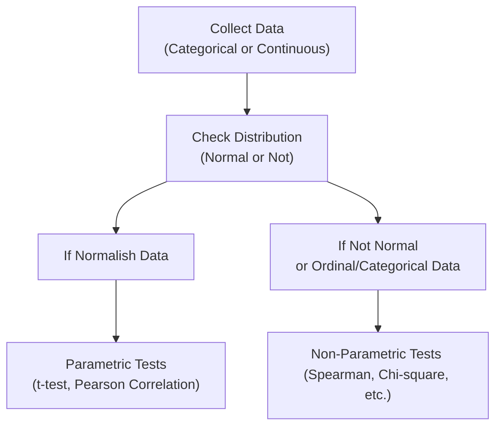

## 2.9 Parametric and Non-Parametric Tests of Independence

Sometimes I joke that financial data has more mood swings than I do on a Monday morning—markets go up, markets go down, and everything in between. Amid this sea of numbers, we often need to test whether two variables (like asset returns, economic indicators, or interest rates) actually move together or not. The concept of “independence” in statistical terms is at the heart of these questions. If you recall from earlier sections in this chapter, we rely on correlation to measure how pairs of variables move, but now we want to see how to test if that correlation is real (and not random noise). This section focuses on different ways to test independence, especially using parametric versus non-parametric approaches.

The main difference between these two categories is that parametric methods assume a specific underlying distribution (usually normal), while non-parametric methods remain distribution-free and can handle weirdly shaped or small datasets more gracefully. Investing in real-world scenarios often pushes us to be flexible—there isn’t always a neat bell curve distribution of returns. So, let’s dig in.

---

## Introduction

Let’s be honest: few things in finance feel more fundamental than asking, “Is X related to Y?” Maybe you’re curious about whether a company’s earnings influences its stock price changes, or if GDP growth influences bond yields, or if the performance of gold is linked to the performance of equities. The fancy statistical term for detecting such relationships is testing for independence. 

Financial analysts use these statistical tests to guide a variety of decisions:

• Portfolio managers want to know if assets are truly uncorrelated to improve diversification.  
• Risk managers test independence assumptions for building robust risk models.  
• Researchers analyze factor correlations in search of alpha or to confirm certain factor exposures.  

Let’s walk through the two primary categories of tests you can use: parametric and non-parametric. Along the way, we’ll explore real-world examples, formula derivations, and a few “oops” moments to watch out for.

---

## Parametric vs Non-Parametric Tests

So, what’s the difference? Parametric tests depend on a set of assumptions regarding the data’s underlying distribution. Typically, we assume normality, which implies that the data looks something like the classic bell curve. Non-parametric tests, on the other hand, do not rely on these distributional assumptions. This difference sounds innocent enough, but it can mean everything when your data is heavily skewed, has outliers, or comes in a small sample.

Below is a quick reference table to keep in mind:

| Aspect                        | Parametric Tests                                   | Non-Parametric Tests                          |
|------------------------------|----------------------------------------------------|------------------------------------------------|
| Distribution Assumptions     | Assume specific distribution (often normal)       | Distribution-free                              |
| Data Usage                   | Typically for interval or ratio data that is at least approximately normal | Can handle ordinal, interval, or ratio data; no normality assumption |
| Examples                     | t-test, ANOVA, parametric correlation tests       | Chi-square test, Spearman’s rank correlation, rank-sum tests, runs test |
| Sensitivity to Outliers      | Usually more sensitive                             | Often less sensitive                          |
| Typical Usage in Finance     | Performance metrics, returns analysis when normal assumptions hold | Non-normal returns, skewed data, small sample sizes |

In practice, parametric tests are typically more powerful if the underlying assumptions are actually satisfied. But if your data is suspiciously shaped (like small-cap stock returns during a sudden market squeeze) or ranks (like credit ratings), a non-parametric test might save the day.

---

## Testing Correlation with T-Tests (Parametric)

When you suspect two continuous variables have a linear relationship, you often estimate Pearson’s correlation coefficient (r). But is your measured correlation significantly different from zero, or might it just be a fluke from random sampling?

Here’s how you can test the hypothesis:

• Null Hypothesis (H₀): ρ = 0 (the population correlation is zero).  
• Alternative Hypothesis (H₁): ρ ≠ 0 (the population correlation is not zero).  

You can apply a parametric t-test, which is valid under assumptions of normality for the variables involved and a random sample. The test statistic (using n data pairs) is typically:

$$
t = \frac{r \sqrt{n - 2}}{\sqrt{1 - r^{2}}}
$$

This test statistic follows a t-distribution with \\(n - 2\\) degrees of freedom. If this t-value is large enough (in absolute terms) for a chosen significance level (like 5%), you reject the null and conclude that ρ (the population correlation) is indeed different from zero.

Imagine you have daily returns for two stocks over 100 trading days. You compute a correlation of 0.35. That might look fairly strong—unless your sample is too small and the data distribution is peculiar. If all assumptions hold, plugging r=0.35 and n=100 into the formula will yield a test statistic. If that t-statistic crosses a critical threshold, you can confidently say the correlation is statistically distinct from zero (though there’s no guarantee it will continue in the future—a reality check we all need in finance).

---

## Spearman’s Rank Correlation (Non-Parametric)

Now let’s talk about the non-parametric cousin of Pearson’s correlation: Spearman’s rank correlation coefficient (often denoted as Spearman’s ρ). Spearman’s measures the strength and direction of a monotonic relationship based on ranked data. A quick story: I once tried to see if there was a correlation between the ranking of my coffee consumption each day (low, medium, or high) and my ranking of productivity (low, medium, or high). Spearman’s correlation was perfect for that because it didn’t assume my productivity or caffeine intake was normally distributed.

In finance, Spearman’s ρ is excellent when the relationship might not be strictly linear but is monotonic. For instance, you might suspect that when interest rates go up, real estate investment trust (REIT) returns go down in a fairly consistent but not necessarily linear manner. Here’s how you typically compute Spearman’s ρ:

1. Rank the data values for each variable.  
2. Compute the difference in ranks for each paired data point.  
3. Plug those differences into the Spearman’s formula, which is basically:

$$
\rho_{\text{Spearman}} = 1 - \frac{6 \sum d_i^2}{n(n^2 - 1)},
$$

where \\(d_i\\) is the difference in ranks for the \\(i\\)-th pair, and n is the number of data pairs. The result is always between -1 and +1, just like Pearson’s r. A value of +1 indicates perfect positive monotonic correlation, -1 is perfect negative, and 0 is no apparent monotonic relationship. 

You can also run a statistical test to see if \\(\rho_{\text{Spearman}} = 0\\) is plausible or not, which follows a specific distribution when n is large enough. Or, for bigger sample sizes, you might even approximate it using distributional assumptions. However, no parametric assumption of normality is forced on you here.

---

## The Chi-Square Test of Independence

Sometimes, the variables you’re studying are categorical rather than continuous (like “High,” “Medium,” “Low,” or perhaps “Default” vs. “No Default,” or an investor rating scale such as AAA, BBB, etc.). In such cases, you might organize the observed and expected frequencies into a contingency table.

The chi-square test of independence helps you figure out whether the row and column variables in that contingency table are related (or not). The null hypothesis is that the two variables are independent—i.e., knowledge of one category tells you nothing about the other category’s distribution. The test statistic is:

$$
\chi^2 = \sum_{\text{all cells}} \frac{(O_i - E_i)^2}{E_i},
$$

where \\(O_i\\) is the observed frequency in cell \\(i\\), and \\(E_i\\) is the expected frequency in cell \\(i\\) under the assumption of independence. The degrees of freedom are typically:

$$
(\text{number of rows} - 1) \times (\text{number of columns} - 1).
$$

If the computed chi-square statistic is large relative to the critical value from the \\(\chi^2\\) distribution, you reject the null hypothesis and conclude that the row and column variables are not independent. 

Here’s a quick example: Suppose you suspect that a bond’s rating category (AAA, AA, A, BBB, etc.) might be related to whether that bond is issued by a certain industry (e.g., Financials, Utilities, Tech). You lay out a contingency table of rating vs. industry with counts of how many bonds fall into each cell. If your chi-square test p-value is super small, maybe you’ve found that industry does matter for bond rating. Or if you fail to reject the null, maybe rating is largely independent of industry classification for the sample you tested.

---

## Non-Parametric Methods in Practice

1. Rank-Sum Tests  
   If you’re comparing whether two groups come from the same distribution, you might not be able to rely on parametric tests like a two-sample t-test. Instead, a rank-sum test (like the Wilcoxon-Mann-Whitney test) can check whether the median ranks of the two groups significantly differ. In finance, you might compare returns of two investment strategies that do not pass normality tests.

2. Runs Test  
   The runs test (also known as the Wald-Wolfowitz test) checks for randomness in a sequence of data. For market prices, if the data points are truly random, you’d expect a certain pattern of “runs” (sequences of consecutive ups or downs). If the actual pattern is too unusual, you might suspect some form of dependence or trend.

Broadly speaking, these non-parametric methods are more appropriate when dealing with small samples, skewed distributions, or purely ordinal data. If someone says, “We only have 12 months of data, and some of our monthly returns are extreme,” you might consider a non-parametric approach.

---

## Relevance to Portfolio Diversification, Risk Management, and Factor Modeling

Now you might be thinking, “These tests sound a bit academic—how do they apply to my real investment process?” Indeed, they do:

• Portfolio Diversification: Testing independence (or correlation) among asset classes is crucial. If two assets are truly uncorrelated (or better yet, negatively correlated), combining them may reduce overall portfolio risk for a given expected return. We often rely on correlation coefficients and independence testing to confirm that diversification is real—not just theoretical.  

• Risk Management: Risk managers frequently rely on correlation estimates among different risk factors (interest rates, commodity prices, credit spreads). If they assume independence when those factors are actually correlated, they might seriously underestimate the tail risk.  

• Factor Modeling: Suppose you believe that certain stock factors (like value, momentum, and quality) might be capturing different dimensions of returns. A critical step is to check whether those factors are independent. If factors are correlated, it affects how you combine them in your factor-based strategy (like avoiding factor overlap that leads to “diworsification”).

There’s a lot of tricky nuance here. Correlation and independence testing seldom remain static: correlations can change dramatically in times of crisis. That’s an important caveat to keep in mind. 

---

## Best Practices and Pitfalls

• Assumption Errors: Using a parametric test when your distribution is far from normal can lead to misleading conclusions.  

• Sample Size Issues: With small n, tests might not have enough power to detect differences or correlations.  

• Multiple Comparisons: Doing plenty of independence tests on a big dataset can lead to spurious significance. Adjust your significance level or consider applying corrections (e.g., Bonferroni, Holm’s correction).  

• Data Snooping: If you rummage around the data too much, you may start “finding” relationships that aren’t real—p-hacking is not a myth.  

• Interpreting p-values: A low p-value doesn’t guarantee a strong effect or correlation—it just means it’s unlikely to be zero. Also, a high p-value doesn’t necessarily prove independence; it just means you couldn’t reject the null.

---

## Visual Overview

Below is a simple diagram illustrating how data, assumptions, and test choices flow. It’s not perfect, but it might help you keep things organized:

As a rough rule of thumb: if your data is at least somewhat normal and continuous, parametric tests (like the t-test for correlation) are likely more informative. If not, or if you have ordinal/categorical structures, non-parametric methods (like Spearman, chi-square, rank-sum) make sense.

---

## Conclusion

In the real world of finance, independence tests guide many daily decisions, from verifying correlations between foreign exchange rates and equity indexes to checking if a new factor in a multi-factor model offers truly uncorrelated alpha. Whether you choose a parametric or non-parametric method depends on the shape and size of your dataset, as well as the nature of the variables (continuous vs. categorical). 

Anyway, I hope you feel a bit more confident. We covered a whole menu of independence tests: the t-test for correlation (for nice, normal distributions), Spearman’s rank correlation (for monotonic relationships in any shape of data), and the versatile chi-square test (for categorical “yes/no” or multi-category variables). Whichever test you pick, always keep your eyes open for assumptions made, sample sizes used, and practical significance vs. statistical significance. You know, a p-value alone doesn’t necessarily confirm your investment thesis—be sure the real world story matches the statistical story.

Remember, no single test or method is a silver bullet. Good analysts combine knowledge of statistical distributions with domain expertise about the assets or phenomena they’re investigating, leading to more robust insights. Keep learning, keep experimenting, and keep an eye on your data’s peculiarities.

---

## Further Reading

• Siegel, S., & Castellan, N. (1988). Nonparametric Statistics for the Behavioral Sciences. McGraw-Hill.  
• Mood, A. M., Graybill, F. A., & Boes, D. C. (1974). Introduction to the Theory of Statistics. McGraw-Hill.  
• For a deeper understanding of correlation dynamics in financial markets, see academic journals like the Journal of Finance or the Journal of Financial and Quantitative Analysis.  

---

## Test Your Knowledge: Parametric and Non-Parametric Tests of Independence



### Which best describes a parametric test?

- [x] A test that assumes a specific distribution (often normal) for the data
- [ ] A test that uses rank transformations
- [ ] A test that does not assume any distribution
- [ ] A test used only for categorical variables

> **Explanation:** Parametric tests rely on assumptions about the data’s distribution, typically requiring normality.  

### What is the main difference between non-parametric and parametric tests?

- [x] Non-parametric tests do not require distributional assumptions
- [ ] Non-parametric tests are always more powerful
- [ ] Parametric tests can only be used for very large samples
- [ ] Parametric tests never require normality assumptions

> **Explanation:** Non-parametric tests are distribution-free and can handle a wider variety of data shapes, while parametric tests generally assume normality.  

### An analyst has 50 observations of two variables. After computing Pearson’s r of 0.62, she uses a t-test for correlation and obtains a p-value < 0.05. What can she conclude?

- [x] The observed correlation is statistically significant at the 5% level
- [ ] The variables are definitely causally related
- [ ] The correlation is definitely greater than 0.8
- [ ] The variables must be independent from each other

> **Explanation:** A significant p-value at 5% indicates you reject the null hypothesis (ρ=0). This doesn’t prove causation or a specific correlation level beyond the estimate.  

### Spearman’s rank correlation is typically used in which scenario?

- [x] When you want to measure monotonic relationships in ordinal data or when data is not normally distributed
- [ ] When comparing means of two normally distributed populations
- [ ] When investigating independence in two categorical variables
- [ ] When verifying linear relationships in large parametric datasets

> **Explanation:** Spearman’s rank correlation is perfect for ordinal data or data without assumed normality.  

### In a chi-square test of independence, which statement is correct?

- [x] The test relies on the difference between observed and expected frequencies in a contingency table
- [ ] The test is used only for parametric data
- [x] The test checks whether two categorical variables are independent
- [ ] The test requires continuous data following a bell-curve distribution

> **Explanation:** Chi-square tests are used with categorical data; they compare observed vs. expected frequencies to determine if the variables are independent.  

### What is the standard null hypothesis in a Chi-square test of independence?

- [x] That the two variables are independent
- [ ] That the two variables are perfectly correlated
- [ ] That the distribution is normal
- [ ] That at least one sample mean is different

> **Explanation:** The typical null hypothesis is that the row variable and the column variable are unrelated (independent).  

### Why might a non-parametric test be chosen over a parametric test?

- [x] The sample size is small, or the distribution is highly skewed and not well-approximated by normality
- [ ] The sample size is extremely large
- [x] The data is purely categorical or ordinal
- [ ] Parametric tests never work with real finance data

> **Explanation:** Non-parametric tests shine when normal assumptions don’t hold or the data is ordinal/categorical.  

### Which is true about the t-test for correlation?

- [x] It uses a t-distribution with n-2 degrees of freedom
- [ ] It is always robust to outliers
- [ ] It cannot be implemented in Excel or financial software
- [ ] It does not require any step to check normality

> **Explanation:** The test statistic follows a t-distribution with n−2 degrees of freedom, and normality is typically assumed for valid results.  

### Spearman’s rank correlation:

- [x] Measures monotonic relationships based on data ranks
- [ ] Requires the data to be normally distributed
- [ ] Is invalid for ordinal data
- [ ] Always produces the same result as Pearson’s correlation

> **Explanation:** Spearman’s rank correlation is designed for monotonic relationships and is computed using the ranks of the data, with no normality requirement.  

### A financial analyst conducts a chi-square test of independence on a contingency table for bond ratings vs. industry classification. The p-value is 0.03 at a 5% significance level. Which conclusion is correct?

- [x] There is enough evidence to conclude that bond rating and industry classification are not independent
- [ ] The two variables are definitely independent
- [ ] Bond rating must be a normal variable
- [ ] None of the bonds in the sample are rated AAA

> **Explanation:** A statistically significant p-value below 5% level indicates rejecting the null hypothesis of independence.  




