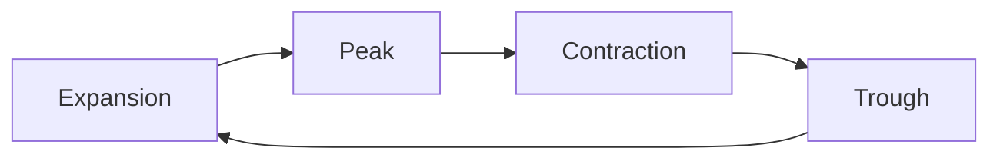
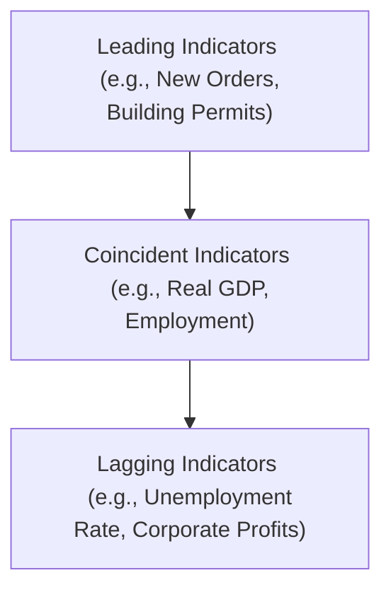

## 3.2 Understanding Business Cycles

Ever notice how the economy sometimes feels like it’s on top of the world, only to slow down a few months or years later? That’s the essence of business cycles—recurring expansions and contractions in overall economic activity. I recall when I first started hearing terms like “peak” and “trough.” It felt like folks were talking about a wild roller coaster ride, and honestly, it kind of is. Understanding these cycles can help you (and me) see what’s around the corner for jobs, investments, corporate profits, and everything in between.

Below, we’ll walk through each stage of the business cycle, discuss the role credit conditions play, identify various economic indicators worth paying attention to, and explore how consumer spending, housing, and even global trade can swing like pendulums throughout these cycles.

## The Phases of the Business Cycle

Business cycles move in four main phases: expansion, peak, contraction (or recession), and trough. Let’s look at each one in more detail.

• Expansion phase: This is when the economy is on the upswing—think rising GDP, lower unemployment, and growing consumer confidence. Businesses invest more in production capacity, wages often rise, and customers generally feel good about spending.  
• Peak: Eventually, the expansion can’t keep climbing forever. At the peak, economic indicators are often at their most favorable (e.g., high GDP, low unemployment), and people might feel a bit euphoric. But watch out—this point marks the transition from growth to a potential slowdown.  
• Contraction (recession) phase: During a contraction, economic activity declines. GDP often dips, companies might scale back production, unemployment can rise, and consumer confidence tends to shrink. Recessions can last for months or even years.  
• Trough: Eventually, the downward spell hits bottom. At this lowest point, or trough, the economy is primed for a rebound. Utilization of resources is typically low, and things are battered, but that also means there’s potential for a new expansion phase to begin.

To visualize these phases, let’s use a simple diagram:

### Typical Characteristics of Each Phase

• Expansion: Real GDP is growing steadily, labor markets are strong, and corporate profits are rising. Consumer demand is high, and folks are often optimistic.  
• Peak: Economic data look stellar on the surface—GDP is near its cycle high and employment is high. But inflationary pressures may emerge, and consumer spending might be pushing up against capacity constraints.  
• Contraction (recession): GDP growth goes negative or stalls, companies reduce payrolls, consumer confidence slides, and investment projects get delayed. Firms will typically reduce or freeze hiring and lay off employees to cut costs.  
• Trough: With the economic downfall bottoming out, most economic measures show minimal or even zero growth. Labor markets are stressed, but capacity is usually underutilized, meaning an opportunity for a rebound once demand picks up again.

## Understanding Credit Cycles

Credit cycles often run alongside (but not always in perfect lockstep with) business cycles. Credit conditions refer to how easy or hard it is to borrow money. When credit is cheap and accessible—like low interest rates and broad lending—consumers and businesses can borrow more freely, fueling expansion. You might hear phrases like “credit boom,” during which new loans help drive up spending on homes, cars, business equipment, and more.

Of course, central banks and financial institutions can tighten credit when they see overheating in the economy or rising inflation threats. Higher interest rates and stricter lending conditions can slow things down, making borrowing more expensive. The result: a downward pressure on spending and, in some cases, a deeper or faster move from expansion to contraction.

Sometimes people forget that credit conditions can influence how strong or weak each phase of the business cycle turns out to be. A short story: a friend of mine was itching to buy a new house right at the end of a big credit boom. Rates started creeping upward, and banks got picky about who they’d lend to. By the time my friend was ready, he discovered that his mortgage interest rate was higher than it would have been just a few months earlier, effectively shrinking his budget. That’s the credit cycle in action.

## Leading, Coincident, and Lagging Indicators

One of the trickier things about business cycles is figuring out where we are right now and where we might be heading. That’s where economic indicators come into play. While no one has a perfect crystal ball, data can guide us.

• Leading Indicators: These stats tend to change before the broader economy does. Examples include building permits, new orders for manufacturing, stock market indices, and some forms of consumer sentiment. If new building permits plummet, that might signal a future downturn in the construction sector.  

• Coincident Indicators: These indicators move roughly in step with the economy’s current health. Real GDP, employment figures, and personal income are common coincident measures. If GDP is going up, you can guess that the economy is generally doing well at that moment.  

• Lagging Indicators: These lag behind the overall economic changes. Think of the unemployment rate—often, it continues to go up several months into an expansion because businesses remain cautious about hiring until they’re sure the recovery is stable. Other lagging indicators might include corporate profits relative to previous capital expenditures.

To see how these indicators can help identify each phase, let's imagine your local economy. Suppose you notice that local businesses have begun ordering fewer supplies and cutting back hours. These signs may appear before an actual dip in quarterly GDP data arrives. By the time official GDP stats confirm a contraction (coincident indicator), it’s already happening. Later, you might see an uptick in unemployment (a lagging indicator) that confirms the recession is truly under way or has been for a while.

## How Resource Use Changes Through the Cycle

Throughout each business cycle phase, the use of resources—like labor, manufacturing capacity, and inventories—ebbs and flows.

• Labor Utilization: During expansions, businesses hire more workers, which can push unemployment lower. In a contraction, firms often cut hours or lay people off. At the trough, unemployment can peak just before the next expansion starts.  

• Capacity Utilization: This measures how fully firms are using their resources. If factories are operating at near-full capacity, that typically indicates strong demand (often seen toward the latter part of an expansion, right near the peak). During a contraction, many facilities run below capacity.  

• Inventory Management: If businesses expect future demand to be high, they might build up inventories in anticipation. But if those demand forecasts prove overly optimistic, managers get stuck with excess stock, which they have to discount or reduce, further contributing to a slowdown in production.

## Variations in Consumer Spending, Business Investment, and Housing

Throughout the business cycle, certain sectors show more dramatic swings than others. Consumer spending, for instance, often remains somewhat resilient in mild recessions—especially for necessities—but can still be affected if job losses mount. Big-ticket goods that rely on financing, like cars or appliances, might drop off quickly if borrowing conditions worsen.

Business investment can be quite sensitive to the economic environment. When the economy’s humming and credit is cheap, companies ramp up capital expenditures. But when a slowdown looms, CFOs get cautious, cut back on new projects, and wait to see clearer signs of recovery.

The housing sector is famously cyclical. In expansions (especially with low interest rates and easy mortgage access), housing booms can occur. Prices climb, new construction flourishes, and real estate agents are busy. Then, as the cycle shifts and credit conditions tighten, demand cools off, prices may plateau (or fall), and new construction slows. This was particularly evident in the global financial crisis of 2008–2009, when a major housing bubble burst, triggering a widespread downturn.

## International Trade and the Business Cycle

Economic activity typically doesn’t happen in a vacuum—most nations are tied together through trade. Expansions can mean increased imports because households and businesses have more disposable income for foreign goods. This can widen a trade deficit if exports don’t keep pace. On the flip side, during contraction phases, imports may shrink as domestic demand weakens, potentially improving the trade balance if exports remain steady.

In some cases, a booming economy can lead to stronger local currency valuations, making exports less competitive abroad. Conversely, in recessions, the local currency might depreciate, which can spur export growth. None of these effects guarantees a particular outcome, but trade balances do tend to shift in tandem with domestic demand and currency movements.  

## Practical Real-World Example

Let’s piece it all together with a hypothetical scenario that maybe some of us can relate to:

1. Suppose you run a small chain of restaurants. The economy is booming (expansion), customers are dining out often, and you decide to open two new locations.  
2. As your sales keep rising, you start noticing higher labor costs, so you raise menu prices slightly—people still pay, no big deal. This partially signals the economy might be near its peak, as resource constraints and prices begin to climb.  
3. Suddenly, consumer spending starts to slow (coincident with a possible GDP slowdown). People worry about job security, so they cut down on discretionary dining. Your revenues dip, and you realize the economy is entering a contraction.  
4. You reduce staffing, cut hours, and stop expansion plans. You see your inventory piling up. Eventually, the broader economy hits the trough.  
5. Over time, conditions stabilize, customers start coming back (though slowly), and you begin to notice you can refinance your business loans at favorable rates because central banks are loosening monetary policy. This fosters a new expansion, and you’re back to growth mode.

That’s the cyclical nature of business in action—expansion, peak, contraction, trough, and then the cycle restarts.

## Best Practices and Pitfalls

• Be Flexible With Forecasts: It’s crucial to remember that business cycle timing is notoriously tricky. No set length or uniform pattern exists. Relying on a single indicator can be misleading.  

• Keep an Eye on Credit Markets: Rapid changes in interest rates or credit standards might accelerate a downturn or fuel an overextended expansion. Don’t overlook them.  

• Diversify Risk: Whether running a business or managing a portfolio, cycle shifts can catch you off guard. Diversifying across different regions, industries, and asset classes can help.  

• Avoid Emotional Traps: In a peak environment, people tend to get overconfident. In a trough, despair can take over. Maintaining a balanced perspective can help you avoid poor decisions driven by herd behavior.

## Additional Mermaid Diagram: Indicators and the Cycle

Below is a simple illustration of how different indicators might align with each stage of the cycle:

Even if these categories often overlap in the real world, the chart might remind you that some data points give us a clue early, some right on time, and others only after we’ve already progressed to the next phase.

## Conclusion

Business cycles matter to everyone—entrepreneurs, employees, investors, and policy makers alike. The cycle’s ups and downs shape everything from whether you get that house loan to how soon your favorite coffee shop expands. By staying tuned to credit conditions, analyzing leading/coincident/lagging indicators, and paying attention to broader patterns in resources and trade, we can gain valuable insights into where the economy is headed and how to act accordingly.

Remember that each cycle is distinct, shaped by factors like innovation, global events, policy decisions, and psychological swings in consumer and business sentiment. In my opinion, maintaining a healthy dose of skepticism—without getting too pessimistic—helps you navigate these cycles with a clear head.

---

## Glossary

• Business Cycle: Fluctuations in economic activity over time, typically including expansion, peak, contraction, and trough phases.  
• Credit Cycle: Periodic fluctuations in the availability and cost of credit, influencing borrowing and investment.  
• Leading Indicators: Economic statistics such as new orders or building permits that precede changes in overall economic activity.  
• Coincident Indicators: Measures such as real GDP or employment that move roughly in line with the overall economy.  
• Lagging Indicators: Statistics like the unemployment rate that often change direction after the broader economy does.  
• Peak: The highest point in the business cycle, marking the end of an expansion before a contraction begins.  
• Trough: The lowest point in the business cycle, marking the transition from contraction to expansion.

---

## References and Suggested Resources

• “Business Cycles and Forecasting” by H.G. Burnham (Irwin/McGraw-Hill)  
• Federal Reserve Economic Data (FRED): https://fred.stlouisfed.org/  
• OECD Composite Leading Indicators (CLI): https://www.oecd.org/sdd/leading-indicators/  

---

## Test Your Knowledge: Understanding Business Cycles Quiz



### Which of the following best describes the typical order of phases in a business cycle?

- [ ] Peak → Expansion → Trough → Contraction
- [ ] Trough → Contraction → Peak → Expansion
- [x] Expansion → Peak → Contraction → Trough
- [ ] Contraction → Trough → Peak → Expansion

> **Explanation:** The classic cycle is Expansion, then Peak, then Contraction (or Recession), and then Trough before the cycle restarts.

### Which of the following is considered a leading economic indicator?

- [x] Building permits
- [ ] Real GDP
- [ ] Unemployment rate
- [ ] Consumer spending

> **Explanation:** Building permits usually shift before the broader economy. Real GDP is a coincident indicator, unemployment is typically lagging, and consumer spending can be both, but often is coincident.

### How does tightening credit availability typically affect the economy?

- [x] It may slow economic expansion and contribute to a contraction.
- [ ] It automatically leads to lower inflation with no effect on growth.
- [ ] It stimulates immediate growth as consumers rush to borrow.
- [ ] It has no effect unless interest rates remain unchanged.

> **Explanation:** When credit is harder to obtain, borrowing costs rise and spending/investment typically drop, slowing or reversing an expansion.

### In the expansion phase of a business cycle, you would typically expect:

- [x] Lower unemployment rates and rising GDP.
- [ ] Declining GDP.
- [ ] Widespread facility closures.
- [ ] Negative consumer sentiment.

> **Explanation:** During the expansion phase, overall economic indicators (like GDP) trend upward, and unemployment typically falls.

### Which indicator is most likely to confirm an economic contraction only after it begins?

- [ ] Building permits
- [ ] Consumer confidence
- [x] Unemployment rate
- [ ] Equity market indices

> **Explanation:** The unemployment rate often lags because companies tend to lay off employees only after they see persistent signs of weak demand.

### During which phase of the business cycle would you expect consumer confidence to be highest?

- [x] Near the peak
- [ ] During the trough
- [ ] Throughout contraction
- [ ] During long-lasting recessions

> **Explanation:** Consumer confidence is often highest toward the end of an expansion and near the peak, though it can start to fade if people see signs of overheating.

### If manufacturers are operating below capacity and holding excess inventory, the economy is most likely:

- [x] In a contractionary phase
- [ ] At a peak
- [x] Near a trough
- [ ] In an early expansion

> **Explanation:** When capacity utilization is low and inventories are piling up, that typically occurs during a contraction (or very close to a trough) before expansion resumes.

### Housing construction is often most robust during:

- [x] Early to mid-expansion
- [ ] Peak only
- [ ] Recession
- [ ] Trough only

> **Explanation:** During expansions, especially if interest rates are low, housing markets often see increased construction and sales.

### What typically prompts businesses to reduce workforce hours or lay off employees?

- [x] Expectations of weakening demand
- [ ] Rising consumer sentiment
- [ ] Low interest rates
- [ ] High stock prices

> **Explanation:** If businesses expect lower sales, they cut back hours or lay off employees to reduce costs and avoid excess capacity.

### True or False: A strong local currency during an economic boom can make a nation’s exports less competitive internationally.

- [x] True
- [ ] False

> **Explanation:** A stronger currency makes domestic goods more expensive for foreign buyers, potentially reducing export demand.


