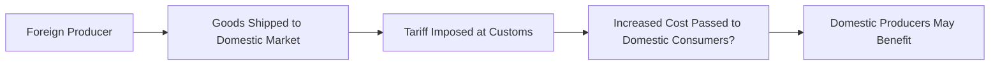

## 3.6 International Trade

International trade. It sounds so grand, doesn't it? You know, big ships hauling containers across oceans, airplanes loaded with fresh produce cruising the skies, and global supply chains connecting farmers in Brazil to coffee shops in Berlin. Maybe that conjures up images of well-oiled machines humming along in perfect harmony—or maybe you just think of crazy shipping costs, currency fluctuations, and those news stories about trade wars. Either way, let’s say we dig into how and why trade happens in the first place, the benefits that can come along, and yes, the downsides as well. Because it’s not all sunny days out there.

Specialization, comparative advantage, efficient resource allocation—these might sound like dull terms, but they’re kind of the heart of why some countries love to export bananas while others might focus on, say, microchips. This dynamic can create a whole world (literally) of efficient production. Yet, it can also ruffle some feathers at home, because while free trade might make goods cheaper, it can displace some domestic industries. 

Below, we’ll explore the core concepts around international trade and how it influences both the big picture—trading blocs, foreign market expansion—and the little picture, like the cost of your morning latte. And I’ll throw in a personal anecdote or two if you don’t mind, because, well, real life doesn’t separate so neatly from theory, does it?

### Why Trade Matters

One time, I visited a friend who was studying abroad in New Zealand. I kept asking, “Why do I see so many sheep around?” And she said, “We’re good at raising them, so we tend to export lamb and wool.” I noticed that in the local stores, there were also a lot of goods imported from Australia, Japan, the US—you name it. Clearly, they specialized in some products and brought in others that were more expensive or inefficient to produce domestically. This is, in essence, how comparative advantage works.

#### Comparative Advantage and Specialization
Comparative advantage refers to a country’s ability to produce a certain good or service at a lower opportunity cost than another country. Essentially, you can do it more “efficiently,” or, in simpler language, you’re giving up less of something else to make that product. If you think about your life, maybe you’re amazing at financial modeling but not so great at designing websites. You might trade your modeling know-how with a friend who’s a web design whiz; both of you end up saving time and frustration. Countries do the same thing on a large scale.

• Imagine Country A is great at producing wheat but terrible at making televisions.  
• Meanwhile, Country B is superb at making televisions but not so good at producing wheat.  
• If A produces more wheat and sells (exports) it to B, A can import cheaper TVs from B than if A tried to produce TVs at home.  
• Both countries end up better off, with more resources freed up to use on other priorities.

This is how the global pie can get bigger—by allowing each participant to specialize in what they do best. 

### The Benefits of International Trade
Let’s be clear: trade isn’t just about theoretical models. It has real impacts on consumers and producers. 

• Access to Broader Markets: With trade, domestic producers can sell to a global customer base. It can help them grow and leverage economies of scale.  
• Lower Prices: Consumers typically enjoy cheaper goods if those goods can be produced more efficiently abroad. (How often do you see electronics labeled “Made in…” somewhere that isn’t your home country?)  
• Variety of Goods: We get more variety in our stores—books from the UK, chocolate from Belgium, gadgets from South Korea.  

I’ll never forget the day I realized how many of the apples on supermarket shelves were from halfway across the world, even though we had local orchards around. Sometimes it’s purely cost-based, sometimes it’s a seasonal supply issue. But the idea is that trade brings more choices.

### The Costs of International Trade: Displacement and Adjustments
But, hey, let’s talk about the heartbreakers—because sometimes trade can hurt. Domestic industries that can’t compete with cheaper foreign goods may shrink or even shut down. This can abruptly displace workers, leading to painful transitions. In many countries, you see entire regions that were once manufacturing powerhouses become economically distressed when production moves abroad.

• Displaced Workers: Think of a car factory that can’t compete. Skilled workers might face a long adjustment period, needing to retrain, relocate, or accept different jobs altogether.  
• Political and Social Tensions: Calls for protectionism often heat up when local industries feel threatened by global competition.  

In principle, trade leads to net gains for society as a whole, but the burdens aren’t always evenly shared. The question is how policy can handle those disruptions, providing retraining programs and social safety nets to cushion the blow.

### Trade Restrictions: Who’s Protecting Whom?
Sometimes, I laugh a little at how “trade wars” make the news: country X imposes tariffs, country Y retaliates with quotas, etc. It’s like a global chess match, except real people’s livelihoods are at stake. Let’s check out the main types:

#### Tariffs
Tariffs are taxes on imported goods. Think of them as a fee that importers have to pay to the government when they bring goods in. 

• Price Impact: Tariffs typically drive up the price of imported goods, thus granting domestic goods a sort of buffer.  
• Government Revenue: Tariffs can generate revenue for governments, which can be appealing from a fiscal standpoint.  
• Domestic Producers: They are often shielded—at least temporarily—from foreign competition.  
• Domestic Consumers: They usually face higher prices.  

To visualize the basic mechanics of a tariff, consider this simple flowchart:

When that foreign producer sells in the domestic market, the tariff means there’s an extra cost. That cost tends to be passed on to consumers. Domestic producers can gain in that they become relatively cheaper compared to imports. But guess who actually pays more? That’s right, domestic consumers.

#### Quotas
Quotas set direct limits on how much of a good can be imported. If you’re only allowed to import a certain quantity of sugar, for instance, once the quota is reached, no more sugar from abroad can enter legally.

• Limit Supply from Abroad: Domestic producers face less competition, which can let them raise prices.  
• No Direct Government Revenue: Quotas don’t typically generate revenue the way tariffs do.  
• Potential for Corruption or Discretionary Licensing: Because the right to import is restricted, it can lead to competition among importers for these limited shares.  

I once met an importer who talked about how government-issued licenses for quota-limited goods could sometimes be traded like scarce assets. That’s how you know you’re in an environment where quotas significantly shape the market.

#### Export Subsidies
Ah, subsidies: the sweeteners that a government might give to domestic producers to boost their international competitiveness.

• Direct Financial Support/Tax Breaks: Exporters may get money back, tax rebates, or other benefits that reduce the cost of producing for foreign markets.  
• Potential for Global Market Distortion: Other countries might cry foul, labeling it unfair competition. This sometimes triggers disputes in organizations like the World Trade Organization (WTO).  
• Could Weaken Domestic Incentives: If companies rely heavily on subsidies, they might not stay lean and competitive on their own.  

### Economic Impact of Trade Barriers
When a government slaps on a tariff or sets up quotas:

• Consumers often face higher prices and fewer choices.  
• Domestic producers may see relief from intense foreign competition (in the short run) and, in some cases, a boost in profits or market share.  
• The government can gain from tariff revenue (if we’re talking about tariffs specifically).  
• Foreign producers face lower profit margins or see reduced market share abroad.  

In the long run, these measures can also reduce overall economic welfare. Because guess what? When you protect less efficient industries, the overall allocation of resources might not be so great. But, from a government’s perspective, those policies can be politically popular among certain voter bases. Let’s say you want to get re-elected… well, you might be inclined to shield local businesses from foreign competition.

### Trading Blocs: A Club with Benefits (and Some Drawbacks)
Countries often form groups—trading blocs—to reduce or eliminate barriers among members. Why? To encourage trade within the bloc, boost economic cooperation, and sometimes even share regulations or standards. These come in various forms:

• Free Trade Areas (FTAs): Members remove tariffs and quotas among themselves but maintain independent trade policies with non-members.  
• Customs Unions: Members add a common external tariff policy, so they share the same rules for imports from outside.  
• Common Markets: These go further by allowing free movement of factors of production (like labor and capital) across member states.  
• Economic Unions: The highest level, where members might share common economic policies, currency (like the Eurozone), and more.

Inside these blocs, trade can skyrocket because companies don’t have to worry about tariffs between partner countries. But from an external perspective, you might see new external barriers, making it harder for outsiders to do business with members of the club. So while these organizations definitely help intra-bloc trade, they may change the competitive dynamics with the rest of the world.

I remember living in Europe for a little while and noticing how easy it was to travel across borders without having to stop for checks or change currencies (depending on the country). That was a direct benefit of deeper economic and political integration.

### Common Pitfalls and Best Practices
• Assuming All Gains, No Pains: While free trade can increase efficiency and lower consumer prices, ignoring the transition costs for displaced workers is risky.  
• Retaliatory Trade Policies: Countries might impose tariffs in response to other tariffs, and it can escalate quickly. Everyone ends up paying more.  
• Over-Dependence on Subsides: Domestic industries might get lazy and uncompetitive on the world stage over time.  

Policymakers must balance how to maximize benefits while minimizing social costs. The best approach often involves wise use of transitional support—like job retraining, re-employment services, maybe even relocation assistance for impacted workers—and avoiding unnecessary trade wars.

### Real-World Example: The US-China Trade Relationship
You may have heard plenty about US-China tariffs. Over the last decade or so, tensions have risen as each country tries to protect certain industries it deems “critical” or “strategic.” Tariffs have gone up on products ranging from steel and aluminum to soybeans. Consumers in both countries might pay higher prices—or simply shift to alternative suppliers. Meanwhile, some domestic producers might enjoy short-term relief from competition, but exporters can suffer if other nations retaliate or if supply chains become less efficient. It’s a real roller-coaster, and it illustrates how global trade can be as much about politics as it is about economics.

### Diagram: High-Level View of Trade Flows
Here’s a basic flow diagram to visualize how trade can occur between two countries, factoring in tariffs or quotas:

In simpler words: goods move from producers in one country, pass through any export restrictions, then arrive in another country, where authorities might impose tariffs or respect a quota. Eventually, those goods reach consumers in the destination market—albeit at potentially higher prices or restricted quantities.

### Strategies for Navigating International Markets
• Diversify Sourcing: Firms that rely on foreign inputs often spread suppliers across different countries to hedge against sudden trade barriers or political tensions.  
• Comply with Local Regulations: Understand custom regulations, labeling laws, or any health and safety standards.  
• Monitor Policy Shifts: Stay informed about government announcements—trade policies can change quickly.  

### Conclusion
International trade, as wonderful as it can be, is never one-dimensional. It can fuel growth, expand variety, lower costs, and foster cooperation among nations—but it can also displace workers, spark political back-and-forth, and reshape industries in challenging ways. Ultimately, the big question for policymakers and business leaders is how to embrace the gains from trade while ensuring that people left behind or forced to transition are supported quickly and effectively. That’s truly what a healthy, forward-thinking economy aims for—balancing global efficiency with local well-being.

And so, the next time you spend a lazy Sunday morning sipping coffee from Colombia while working on a laptop from Taiwan—maybe wearing a sweater from Peru—remember that behind these products is a complex web of trade relationships. If done well, it’s a story of mutual gain and specialized production that helps everyone get a slice of the pie. But we can’t ignore the complexities of how that pie is divided.

---

### Glossary

Comparative Advantage  
: The principle that countries benefit by specializing in producing goods for which they have a lower opportunity cost.

Tariff  
: A tax on imports designed to protect domestic industries or raise government revenue.

Quota  
: A limit on the amount of a particular good that can be imported or exported.

Export Subsidy  
: A benefit (e.g., cash payment or tax reduction) given to domestic producers to stimulate exports.

Trading Bloc  
: A group of countries that have joined together to reduce or eliminate trade barriers among members.

---

### References and Suggested Resources
- Krugman, Paul & Obstfeld, Maurice. “International Economics: Theory and Policy.” (Pearson)  
- WTO Reports and Data:  
  https://www.wto.org/  
- World Bank “World Development Report” publications:  
  https://www.worldbank.org/  

---

## Test Your Knowledge: International Trade Fundamentals



### Which key concept describes a country's ability to produce goods at a lower opportunity cost than another country?
- [x] Comparative Advantage
- [ ] Absolute Advantage
- [ ] Tariff Advantage
- [ ] Dynamic Efficiency

> **Explanation:** Comparative advantage emphasizes producing goods where you sacrifice less of other products, fostering more efficient global trade.

### A tariff generally:
- [ ] Lowers the price of imported goods.
- [ ] Has no effect on government revenue.
- [x] Raises the price of imported goods.
- [ ] Increases the availability of goods in a domestic market.

> **Explanation:** Tariffs are essentially taxes on imports, which typically leads to higher domestic prices and additional revenue for the government.

### When a government sets a specific limit on how many units of a good can be imported, it is imposing a:
- [ ] Tariff
- [ ] Tax
- [x] Quota
- [ ] Trade Cure

> **Explanation:** A quota restricts the volume of imports, directly limiting supply rather than indirectly raising prices like a tariff.

### Which measure most directly increases government revenue among the listed trade barriers?
- [ ] Quota
- [x] Tariff
- [ ] Export Subsidy
- [ ] Import Ban

> **Explanation:** Although a quota can raise prices, it does not produce direct government revenue. Tariffs bring in revenue through taxes on imported goods.

### A key downside of export subsidies is that they:
- [ ] Never lead to increased exports.
- [x] May encourage inefficient domestic companies reliant on government support.
- [ ] Are always banned by trading blocs.
- [x] Prevent local industries from expanding internationally.

> **Explanation:** Overly generous subsidies can create complacent firms that rely on government aid rather than improving efficiencies to succeed in global markets. They also distort prices and can lead to international disputes.

### Trading blocs increase trade within member countries primarily by:
- [ ] Adding more tariffs between members.
- [x] Removing or reducing trade barriers among members.
- [ ] Increasing import taxes on non-member nations.
- [ ] Restricting overall commodity production.

> **Explanation:** By removing barriers such as tariffs and quotas among members, trading blocs foster intra-bloc trade, making it easier and cheaper to move goods across borders.

### A custom union differs from a free trade area in that it:
- [ ] Removes internal tariffs but adds internal speeches.
- [x] Adopts a common external trade policy against non-members.
- [x] Fully integrates members into a single currency union.
- [ ] Has no formal institutions.

> **Explanation:** A customs union not only eliminates tariffs among member countries but also agrees on a common external tariff schedule for non-members.

### Which of the following typically suffers most when a tariff is imposed on imported goods?
- [ ] Domestic producers
- [x] Domestic consumers
- [ ] The government
- [ ] The environment

> **Explanation:** Domestic consumers often pay higher prices and have fewer choices because tariffs raise the cost of imported goods.

### One potential positive effect of quotas for domestic producers is:
- [x] Reduced foreign competition in the domestic market.
- [ ] Reduced prices for consumers.
- [ ] Increase in government revenue.
- [ ] Elimination of domestic resource constraints.

> **Explanation:** By physically capping how many foreign goods can enter, quotas help shield domestic industries from intense competition.

### Trade can be beneficial overall, but it might cause local disruptions when industries cannot compete with cheaper imports.
- [x] True
- [ ] False

> **Explanation:** While international trade boosts overall efficiency and consumer choice, certain domestic industries might face layoffs or closures, creating significant adjustments for workers and communities.


