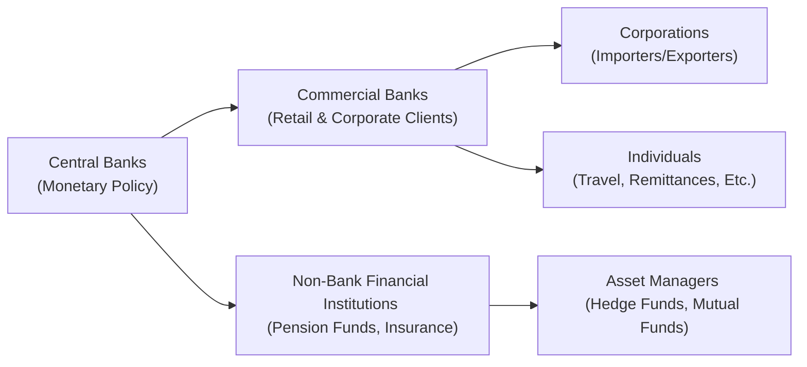

## 3.7 Capital Flows and the FX Market

Sometimes, I remember my very first international trip. I was honestly more excited about exchanging my local currency for some new, colorful banknotes than the actual destination. I’m not sure if that’s just me, but it felt like a little window into a vast and interconnected global economy. It’s easy to overlook how those exchange rates we see at airport kiosks or financial websites are part of a much larger story—one that influences goods we buy, investment decisions, and policy choices worldwide. Let’s explore how capital flows and foreign exchange (FX) markets shape economies, the role of different participants, and how policy goals can drive strategic decisions in cross-border finance.

### The Foreign Exchange Market: An Overview

The foreign exchange market is often likened to a sprawling global network intersecting financial institutions, central banks, corporations, investment funds, and individual traders. In other words, it’s huge. Estimates from the Bank for International Settlements (BIS) Triennial Central Bank Survey consistently value average daily foreign exchange turnover in the trillions of US dollars. And no, that’s not a typo—trillions, with a “t.”

If you’ve ever tried to buy or sell foreign currency, whether for personal travel or cross-border commerce, you’re already a participant in the FX market. But the scope goes well beyond just that. International corporations hedge foreign currency risks to smooth revenue streams. Hedge funds speculate on macroeconomic trends. Central banks intervene to manage exchange rate volatility or to steer economic targets such as inflation or growth.

From a structural perspective, the FX market is decentralized—there is no single physical “location” where currencies get exchanged. Instead, an extensive electronic network connects buyers and sellers around the globe, operating 24 hours a day, five days a week. The major trading centers are typically in London, New York, Tokyo, Hong Kong, and Singapore, though plenty of other financial hubs play significant roles.

Below is a simple diagram showing the main branches of participants in this vast market:

- Central Banks: They’re the giants controlling monetary policy and foreign exchange interventions.  
- Commercial Banks: They handle currency transactions for clients—both retail and wholesale—and also trade for their own accounts.  
- Non-Bank Financial Institutions: Pension funds, insurance companies, and other big players typically trade FX when adjusting their overseas investments or meeting liquidity needs.  
- Corporations: Large importers and exporters regularly convert currencies to pay for goods and services.  
- Individuals: Anyone who buys or sells foreign currency for travel, personal investment, or remittances.  

### Nominal vs. Real Exchange Rates

One of the most fundamental concepts you’ll encounter in the FX market is the notion of nominal versus real exchange rates. The nominal exchange rate is like the price tag you see when you go to buy a certain amount of one currency with another. For example, if 1 Euro is worth 1.10 US dollars, that’s the nominal rate.

But the real exchange rate is adjusted for price levels across countries. Think of it this way: If country A’s inflation is skyrocketing while country B’s inflation remains stable, then the nominal exchange rate might not give you an accurate picture of the true underlying purchasing power. The real exchange rate helps gauge whether goods and services are becoming more or less expensive relative to something “baseline” in another country.

Mathematically, you can define the real exchange rate (RER) between two countries (say, domestic country D and foreign country F) roughly as:


\text{RER} = E_{\text{nom}} \times \frac{P_D}{P_F}


Where:  
- \\(E_{\text{nom}}\\) is the nominal exchange rate (units of foreign currency per unit of domestic currency).  
- \\(P_D\\) is the price level in the domestic country.  
- \\(P_F\\) is the price level in the foreign country.  

This ratio helps businesses and policymakers figure out if domestic goods are cheaper or more expensive compared to foreign goods, factoring in inflation differences.  

### Percentage Changes in Currency Values

Let’s say you want to see how your home currency’s value changed relative to a foreign currency. Maybe you noticed that last week 1 USD was worth 1.05 EUR, and this week 1 USD is worth 1.10 EUR. What’s the percentage change?

The formula for percentage change is:


\text{Percentage Change} = \left(\frac{\text{New Rate} - \text{Old Rate}}{\text{Old Rate}}\right) \times 100\%


Using our example:


\text{Percentage Change} = \left(\frac{1.10 - 1.05}{1.05}\right) \times 100\% \approx 4.76\%


That means the USD appreciated by about 4.76% relative to the EUR over that period. Conversely, from the euro’s standpoint, it depreciated against the dollar by that percentage. Understanding how to interpret these changes is crucial. Even minor shifts can have huge implications for multinational corporations or investors who manage large sums denominated in multiple currencies.

### Exchange Rate Regimes: From Fixed to Floating

So, who or what determines these exchange rates? Well, it depends on the currency regime each country’s central bank adopts. Generally, these regimes fall on a spectrum between fully fixed (or pegged) and freely floating.

• Pegged or Fixed Exchange Rate: In a pegged system, the central bank commits to fixing its currency’s value against some reference currency or basket of currencies. As an example, suppose Country X pegs its currency to the US dollar at a fixed rate of 5.0 X-dollars for 1 USD. If market forces push the X-dollar away from this level, the central bank will intervene—typically by buying or selling foreign reserves—to keep the currency level stable. The advantage is reduced exchange rate volatility, potentially attracting foreign investment. The downside is the risk of depleting foreign currency reserves if the peg becomes misaligned with economic fundamentals.

• Floating Exchange Rate: Also called a flexible exchange rate system, floating simply means currency values float (i.e., shift) according to supply and demand in the marketplace. Countries with floating regimes (like the US, Canada, the Eurozone, the UK, and many others) typically rely on monetary policy to target domestic inflation and economic growth, rather than a strict currency peg. That said, some countries adopt a “managed float,” occasionally intervening without committing to a fixed rate.

• Intermediate Arrangements: Many countries opt for “soft pegs” or “crawling pegs,” where the currency is pegged but with the possibility of small, scheduled adjustments. Some adopt “currency boards,” which require holding enough foreign reserves to fully back all domestic currency in circulation. Think of these arrangements as methods to instill confidence or discipline in monetary policy, but they come with constraints on the central bank’s independence.

### How Exchange Rates Influence Trade, Capital Flows, Inflation, and Growth

Exchange rates can be a pretty big deal for lots of economic variables. Let’s explore a few:

**Trade Balances:** A weaker domestic currency makes exports cheaper overseas (encouraging foreign consumers to buy more exports) and makes imports more expensive (discouraging domestic consumers from buying foreign goods). This shift often improves a country’s trade balance—but only up to a point, and only if demand for exports grows enough to offset the higher import costs. Conversely, an appreciating currency can dampen the trade balance by making exports costlier and imports cheaper.

**Capital Flows:** Global investors chase returns. When a currency is expected to strengthen, or if interest rates look attractive in that currency’s country, capital inflows often increase as foreign investors buy local assets to take advantage of competitive yields or potential capital appreciation. On the flip side, if investors suspect trouble—say, political instability or an eventual devaluation—they might pull out their funds, creating abrupt capital outflows that can hamper economic stability.

**Inflation:** Exchange rates and inflation share a close relationship. If a currency suddenly plummets, imports become pricier, fueling inflation, particularly in economies that rely heavily on importing essential goods like food or energy. Central banks often tweak interest rates or intervene in the FX market to manage inflation risk. But be mindful, a strong currency can help temper imported inflation but may hurt export competitiveness.

**Economic Growth:** Some countries prefer certain exchange rate policies to stimulate growth. For instance, an undervalued currency (intentional or otherwise) can promote export-led growth. However, persistent undervaluation can also provoke trading partners and even lead to trade disputes.

### Capital Restrictions: Objectives and Unintended Consequences

You might hear about “capital controls” or “capital restrictions.” This refers to policies aimed at “controlling,” “motivating,” or “restricting” the flow of capital—especially large sums—across international borders. So, why would a government clamp down on capital flows?

**Objectives might include**:  
• Shielding the local currency against speculative attacks.  
• Maintaining a stable or pegged exchange rate without hemorrhaging foreign reserves.  
• Preventing overreliance on foreign debt or foreign capital inflows that could exit at the first sign of turbulence.  
• Controlling capital flight during periods of financial distress.  

However, capital restrictions can generate unintended consequences:  
• Investors may find opaque workarounds to circumvent restrictions, breeding inefficiency.  
• Lower foreign investment could hamper growth.  
• Domestic firms might face higher financing costs if they can’t tap global capital markets freely.  
• Market manipulations or black-market exchange rates can emerge, undermining official policies.

Many emerging markets experiment with some form of capital controls to manage their economic development. It can be a delicate balancing act—control too much, and you curb growth; control too little, and you face hot money inflows that might exit quickly, destabilizing the economy.  

### Key Considerations and Pitfalls

Whenever you’re looking at capital flows and FX markets, watch out for these common issues:

• **Overreliance on Pegging:** If a country tries to maintain a strict peg even as economic fundamentals shift, it risks depleting foreign reserves or resorting to drastic measures like capital controls.  
• **Ignoring Inflation Differences:** Focusing on nominal exchange rates alone without accounting for inflation can lead to misguided conclusions about competitiveness.  
• **Excessive Short-Term Debt:** Countries reliant on short-term foreign financing may be susceptible to abrupt capital outflows if investor sentiment sours.  
• **Policy Uncertainty:** Frequent governmental or central bank policy changes can whipsaw the market and discourage foreign investment.  

### A Personal Reflective Moment

I once chatted with a friend who worked in corporate treasury for a big multinational. They spent a good chunk of their day hedging currency risk, trying to net out exposures across different countries. No joke—some nights they barely slept, waiting for central bank announcements or major geopolitical events that could send exchange rates flipping. It’s a reminder that for those dealing with big currency swings, the FX market isn’t just a theoretical concept—it’s a daily reality that can make or break profitability.

### Practical Example: Hedging Strategy for an Exporter

Suppose you manage finances for a Canadian company exporting furniture to the United States. You earn revenue in US dollars but pay suppliers and employees in Canadian dollars. If the USD weakens against the CAD, your revenue in Canadian dollar terms shrinks, hurting profitability.

To manage this, you might enter into a forward contract, agreeing to exchange a certain amount of USD for CAD at a set rate in the future. This way, you lock in your CAD income and protect yourself from unfavorable currency moves. However, if the USD unexpectedly strengthens, you’d miss out on a more favorable exchange rate. It’s always a trade-off—but this approach gives stability and reduces risk.

### Best Practices for Navigating Currency Markets

• **Stay Informed:** Track economic indicators, interest rate trends, geopolitical events, and central bank communications that might affect exchange rates.  
• **Use Multiple Tools:** Combining currency forwards, options, or swaps can mitigate exposure or exploit opportunities.  
• **Maintain Adequate Reserves:** This applies to both banks and corporations. Liquidity in local and foreign currencies helps weather volatility.  
• **Balance Growth and Stability:** Policymakers should weigh the benefits of attracting capital inflows against the risks of too much hot money fueling asset bubbles and subsequent crashes.  
• **Understand the Local Environment:** Especially in emerging markets, be aware of potential capital controls, quasi-pegs, or political developments.  

### Glossary

• **Nominal Exchange Rate:** The price of one currency expressed in terms of another (e.g., 1 USD = X Euros).  
• **Real Exchange Rate:** The nominal exchange rate adjusted for differences in price levels between countries.  
• **FX Market Participants:** Entities that engage in currency transactions, including central banks, retail clients, and institutional investors.  
• **Pegged Exchange Rate:** A regime where a currency’s value is fixed relative to another currency or basket of currencies.  
• **Floating Exchange Rate:** A regime where the currency’s value is determined by market forces (supply and demand).  

### References and Further Study

For a deeper dive into these topics, it’s helpful to explore reference materials and global data sources:

• Mishkin, Frederic S. “The Economics of Money, Banking, and Financial Markets.” (Pearson)  
• Bank for International Settlements (BIS) Triennial Central Bank Survey on FX Markets:  
  <https://www.bis.org/statistics/rpfx.htm>  
• International Monetary Fund (IMF) Resources on Capital Flows and Exchange Rates:  
  <https://www.imf.org/en/Data>  

You’ll find plenty of insights and research papers explaining how capital flows can boost or hinder growth in emerging and developed markets alike. The BIS data is particularly valuable for anyone wanting to track how currency market turnover evolves over time.

By now, you should have a thorough sense of how the FX market functions, how multiple parties interact, and how the interplay of market forces and policy choices can swing exchange rates up or down. Try to keep in mind that a currency’s “price” is more than a number on a screen—it’s anchored to economic fundamentals, political variables, and the messy psychology of global markets. Let’s keep exploring onward and see how the rest of the global economic puzzle connects!

---

## Test Your Knowledge: Capital Flows and the FX Market



### Which of the following best describes the nominal exchange rate?

- [ ] It’s the exchange rate adjusted for international interest rate differentials.
- [ ] It’s the exchange rate used only by central banks in fixed regimes.
- [x] It’s the price of one currency expressed in terms of another, unadjusted for price levels.
- [ ] It’s the purchasing power of a currency relative to another, accounting for inflation differences.

> **Explanation:** The nominal exchange rate is simply one currency’s price in terms of another without adjusting for price levels or inflation.

### A real exchange rate is best characterized as which of the following?

- [ ] The rate posted by currency traders during after-hours trading.
- [x] The nominal rate adjusted for differences in inflation or price levels.
- [ ] The rate quoted by central banks for cross-border loans.
- [ ] The price of a currency used by hedge funds exclusively.

> **Explanation:** Real exchange rates incorporate inflation differences, providing a clearer sense of purchasing power between currencies.

### If the USD/CAD exchange rate increases from 1.25 to 1.30, how much has the USD appreciated against the CAD (using approximate percentage change)?

- [ ] 2%
- [x] 4%
- [ ] 1%
- [ ] 0.5%

> **Explanation:** Percentage change = ((1.30 – 1.25) / 1.25) × 100% ≈ 4%.

### Under a pegged exchange rate regime, what primary action does a central bank typically take to maintain the peg?

- [ ] It publishes reports criticizing foreign currency movements.
- [x] It buys or sells foreign reserves to stabilize the currency value.
- [ ] It mandates private companies to hold only local currency.
- [ ] It defaults on foreign debt to reduce capital outflows.

> **Explanation:** Central banks intervene by buying or selling reserves (often US dollars or other major currencies) to keep the local currency at the desired level.

### Which of the following is a likely effect of a sudden depreciation in the domestic currency?

- [x] Exports become more competitive abroad.
- [ ] Imports become cheaper.
- [x] Potential rise in inflation due to pricier imports.
- [ ] It guarantees higher economic growth over the long term.

> **Explanation:** A depreciated currency makes exports cheaper for foreign buyers but raises prices for imports, which can stoke inflation.

### Which is a common objective of capital restrictions?

- [x] To manage large inflows or outflows and reduce currency speculation.
- [ ] To ensure no international borrowing occurs.
- [ ] To phase out central bank involvement in the FX market.
- [ ] To eliminate all forms of inflation.

> **Explanation:** Policymakers use capital controls to handle volatile capital flows, curb speculation, and maintain financial stability.

### A major unintended consequence of capital controls might be:

- [ ] Improved transparency in currency transactions.
- [x] The emergence of black-market exchange rates.
- [x] Reduced foreign investment.
- [ ] Guaranteed increase in central bank autonomy.

> **Explanation:** Capital controls can drive transactions underground and reduce foreign investor confidence, ultimately hampering capital inflows.

### Which statement is most accurate regarding a floating exchange rate regime?

- [x] Currency values are largely determined by market supply and demand.
- [ ] The central bank enforces a strict rate without exceptions.
- [ ] It never experiences volatility.
- [ ] It only changes once per fiscal quarter.

> **Explanation:** In a floating regime, exchange rates move freely as market participants buy and sell currency, though the central bank may occasionally intervene.

### When analyzing exchange rates for international trade, why is focusing solely on nominal rates potentially misleading?

- [ ] Nominal rates exclude all government taxes.
- [ ] Nominal rates are only used in black-market transactions.
- [ ] Nominal rates always align with real rates.
- [x] Nominal rates do not account for inflation or differences in price levels across countries.

> **Explanation:** Inflation differences can cause the nominal rate to misrepresent the true cost or competitiveness of goods.

### A country with high foreign debt and a pegged exchange rate faces economic difficulties. True or False?

- [x] True
- [ ] False

> **Explanation:** The country may struggle to defend the peg if investors lose confidence, possibly leading to rapid depletion of foreign reserves or a forced devaluation.


