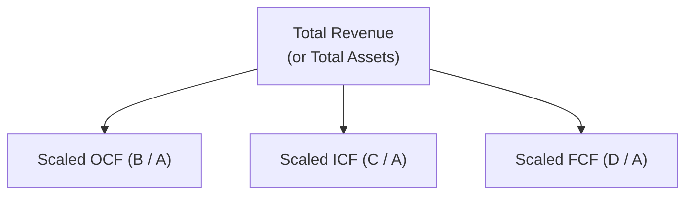
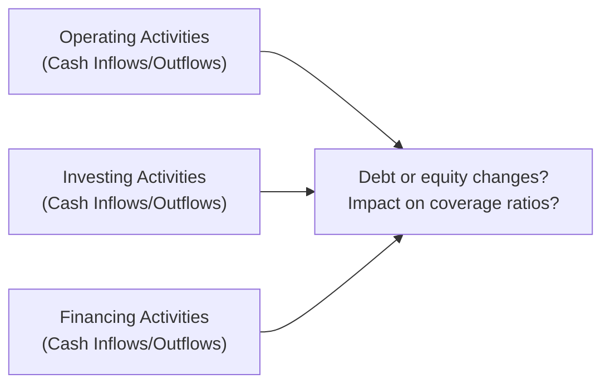

## 4.5 Analyzing Statements of Cash Flows II

Sometimes I like to joke that the Statement of Cash Flows is the “unsung hero” of financial statements. If the Income Statement is the star quarterback (all eyes on it for measuring performance), and the Balance Sheet is the sturdy offensive line of assets and liabilities, the Cash Flow Statement is the team’s heartbeat—constantly pumping liquidity in and out of the business. In reality, nothing quite spells survival like healthy cash flows. Speaking from my own experience, you can ride an exciting wave of earned revenue for only so long, but if you don’t collect the cash eventually, your business might, well, face a whole lot of trouble.

This section dives deeper into how we can analyze and interpret the Statement of Cash Flows to uncover a company’s operational efficiency, sustainability, and overall financial health. We’ll look at common-size analysis, free cash flow calculation, cash flow-based ratios, and ways to assess whether the sources and uses of cash you see are sustainable or just short-term illusions.

Feel free to check back on earlier sections—even glancing at “4.4 Analyzing Statements of Cash Flows I” might help refresh some fundamentals. Let’s jump right in and see how these techniques let us probe beyond the surface of raw cash flow numbers.

---

### Common-Size Analysis of the Cash Flow Statement

Common-size analysis is a powerful tool often used on the Income Statement or Balance Sheet. The idea is to scale each line item by a certain base figure, making it easier to compare across different periods (or between different companies) without worrying about differences in absolute size. But you might be thinking, “Well, how does that even apply to the Statement of Cash Flows?” Great question.

For the Statement of Cash Flows, typical bases for scaling can include:

• Total revenue (from the Income Statement)  
• Total assets (from the Balance Sheet)

When we do this, each line item of the Statement of Cash Flows (from operating, investing, or financing sections) becomes a percentage of either total revenue or total assets. This shows us how each category of cash flow consumption or generation lines up in proportion to a company’s overall size or top-line performance.

If a particular line item—say “Cash Paid to Suppliers”—is consistently growing faster than revenue, it raises questions: Are we dealing with inefficiencies? Is the company in a more capital-intensive phase, requiring higher supplier payments relative to the income it’s generating? Or maybe the company is anticipating greater production needs? By turning everything into percentages, it’s easier to spot these red flags and success stories.

#### Simple Example

Let’s say we have a small company, ABC Apps, generating $100 million in revenue in Year 1. They report net cash from operating activities of $20 million. When performing common-size analysis using total revenue as the base, that’s 20%. Next year, revenue grows to $130 million, but operating cash flow moves to $22 million—around 16.9% of total revenue. The absolute number of cash flow went up, but it’s dropped as a percentage of that base. That discrepancy might prompt us to dig deeper: is the working capital requirement ballooning, or did we see a large one-time expense?

#### Mermaid Diagram: Common-Size Concept

Below is a simplified Mermaid diagram illustrating the concept of common-size analysis in a Statement of Cash Flows. It’s just a conceptual flow (not an actual process flow), but it might help visualize how each line item relates to the total:

Each item in the operating, investing, or financing categories is divided by total revenue (or total assets) to identify trends in efficiency, growth, or capital intensity.

---

### Free Cash Flow Calculations and Interpretations

When professionals mention “free cash flow,” they’re essentially looking past standard net income, focusing instead on actual cash that remains available after subtracting critical capital expenditures and working capital needs. Why is this important? Because a company might show solid earnings on paper, but if those earnings are tied up in building expansions or massive inventory, the business might not have much spare cash left to pay dividends, buy back stock, or even cover its bills. 

There are two main flavors of free cash flow we talk about at this level: Free Cash Flow to the Firm (FCFF) and Free Cash Flow to Equity (FCFE).

#### Free Cash Flow to the Firm (FCFF)

Free Cash Flow to the Firm represents the cash flow available to all providers of capital—both debt holders and equity holders. The basic formula often looks like this:


\text{FCFF} = \text{NOPAT} + \text{Non-Cash Charges} - \text{Investments in Fixed Capital} - \text{Investments in Working Capital}


• NOPAT = Net Operating Profit After Taxes  
• Non-Cash Charges = Depreciation, Amortization, etc.  
• Investments in Fixed Capital = Capital Expenditures  
• Investments in Working Capital = Changes in inventory, receivables, payables

(Note: Sometimes you’ll see a slightly different form, or you might see interest added back if you start with net income rather than NOPAT, but the concept is the same.)

This measure is a great gauge of a company’s capacity to generate cash from its core operations and then fund growth (via capital expenditures) without necessarily relying on external capital injections.

#### Free Cash Flow to Equity (FCFE)

Free Cash Flow to Equity is a narrower concept. It’s basically what’s left for common shareholders after meeting the firm’s obligations to creditors. A simplified formula goes like this:


\text{FCFE} = \text{FCFF} - \text{Interest Expense} \times (1 - \text{Tax Rate}) + \text{Net Borrowings}


Where net borrowings (or net changes in debt) represent any additional debt the company might have taken on during the period, less any repayments. FCFE is useful if you’re an equity investor wanting to see how much cash might be sent back to shareholders—through dividends, share repurchases, or simply reinvested on behalf of shareholders.

#### Practical Uses

• **Valuation Models**: Both FCFF and FCFE are key inputs in various valuation models (like discounted cash flow analysis).  
• **Capital Allocation**: Management uses free cash flow to decide how much it can feasibly invest in expansion, repay loans, or reshuffle its capital structure.  
• **Dividend Policy**: A company with a growing FCFE can more confidently increase or maintain dividends (if it chooses to pay dividends at all).

---

### Cash Flow-Based Ratios

While the raw cash flow figures are important, ratios that draw on these figures can provide a much more dynamic lens. Let’s face it: a company with $10 million in net operating cash flow might look strong—but if that company also has $1 billion in total liabilities, maybe it’s not so hot.

#### Cash Flow Margin

Cash flow margin typically compares operating cash flow to total revenue:


\text{Cash Flow Margin} = \frac{\text{Operating Cash Flow}}{\text{Net Revenue}}


It’s similar to calculating a profit margin except that it uses actual cash from operations in the numerator rather than net income. This approach can be revealing if you want to see how efficient the company is at converting its sales into cash. For instance, a high cash flow margin might indicate stronger cash conversion—customers are paying quickly, and the company is managing payables, inventory, etc., effectively.

#### Cash Return on Assets (ROA) or Equity (ROE)

Sometimes you’ll see these metrics:


\text{Cash ROA} = \frac{\text{Operating Cash Flow}}{\text{Total Assets}}



\text{Cash ROE} = \frac{\text{Operating Cash Flow}}{\text{Equity}}


These are analogous to traditional ROA and ROE, which use net income in the numerator. The cash versions are helpful in comparing how effectively a company’s asset or equity base generates cash. If the ratio is shrinking, you might wonder whether the company is being forced to spend more than it earns to stay operational.

#### Coverage Ratios

Coverage ratios use cash flow to gauge how comfortably a firm can meet its financial obligations, typically interest expense or total debt. Let’s look at two popular ones:

• **Cash Interest Coverage** = (Operating Cash Flow + Interest Paid + Taxes Paid) ÷ Interest Paid  
• **Cash Debt Coverage** = Operating Cash Flow ÷ Total Liabilities

Coverage ratios are crucial because they highlight how robust the operating cash generation is relative to the company’s financing commitments. If a company consistently has an interest coverage ratio close to 1, it means nearly all of its cash from operating activities goes to servicing interest—yikes.

---

### Assessing the Sustainability of Cash Flows

If you can gather one thing from all these metrics, it’s that we want to know not only how much cash a company generates, but also how stable or reliable these cash flows are long-term. A one-time sale of a large asset might give a temporary pop to operating or investing cash flow, but that’s not necessarily indicative of normal operations. Let’s talk about a few ways to keep an eye on sustainability:

• **Look for Non-Recurring Cash Flows**: That might include big lumps of litigation settlements, insurance proceeds, or the sale of an old warehouse. Sure, it’s great to receive these chunks of cash, but if they’re one-and-done transactions, you should exclude them when evaluating recurring operational strength.  
• **Compare with the Income Statement**: Sometimes, clever managers can speed up receipts or delay payments to artificially boost the Statement of Cash Flows in a particular quarter. Check the Income Statement to see if reported revenue and recognized expenses align reasonably.  
• **Check the Balance Sheet**: If payables are spiking each period, it could be that the company is deferring payments to suppliers to inflate operating cash flow. That’s not inherently evil—companies often manage working capital cycles—but consistent, large deferrals can be a sign that the strong operating cash flow you see is partly ephemeral.  
• **Identify Strange Patterns**: If a firm normally invests in capital expenditures throughout the year but suddenly slashes them to near zero while touting “record free cash flow,” be skeptical. Maybe next quarter they’ll have to resume investing—and you’ll see a big reversal in free cash flow.

In my own work, I once encountered a mid-sized electronics manufacturer that boasted a surge in operating cash flow. Turned out they had sold an entire division’s worth of inventory to a single large distributor under super-generous payment terms. Revenue soared, and short-term cash got a little jump, but the terms gave the distributor 120 days to pay (instead of the usual 30). So eventually, that inflated operating cash flow was offset when the 120-day pay cycle finally kicked in (plus a high risk of a portion of that becoming uncollectible). Always keep your eyes on the bigger picture.

---

### Spotlight: Diagram of Cash Flows and Analysis Points

To visualize the interplay between operating, investing, and financing activities—and where analysis points commonly occur—consider the Mermaid diagram below:

---

### Glossary

Free Cash Flow to the Firm (FCFF)  
Cash flow available to all capital providers (both debt and equity) after operating expenses and investments in fixed and working capital.

Free Cash Flow to Equity (FCFE)  
Cash flow remaining after covering the firm’s debt holders, typically calculated by adjusting FCFF for after-tax interest expense and net changes in debt. This is the amount theoretically distributable to common shareholders.

Coverage Ratios  
A set of financial measures that illustrate how easily a firm can meet its interest or debt obligations using cash flows. Examples include interest coverage and debt coverage.

---

### References and Further Reading

• Penman, S.H. (2013). Financial Statement Analysis and Security Valuation. McGraw-Hill.  
• Mulford, C.W., & Comiskey, E.E. (2002). The Financial Numbers Game: Detecting Creative Accounting Practices. Wiley.  

These texts provide deeper insights into financial statement analysis, discussing everything from the fundamental interpretation of cash flows to the complexities of creative accounting practices.

---

So, that’s the scoop on analyzing Statements of Cash Flows, Part II. Always remember: healthy and sustainable cash flows are often more telling of a company’s true position than many other metrics. The next time you read about a company touting “record earnings,” maybe peel back the Income Statement and see if those gains are turning into ready-to-use cash. Chances are, you’ll discover whether that “record” is built on real fundamentals or some ephemeral house of (accounting) cards. 

Anyway, let’s keep pushing forward. If you’re feeling good, let’s jump into some practice questions.

## Test Your Knowledge: Cash Flow Analysis in Practice



### Which of the following best describes a common-size analysis of the Statement of Cash Flows?

- [ ] Converting the Cash Flow Statement into ratios that compare the firm’s cash flows against industry benchmarks only.
- [x] Scaling each line item of the Cash Flow Statement by total revenue or total assets in order to identify trends in operating efficiency and capital intensity.
- [ ] Comparing operating cash flow to net income to see if the firm’s earnings are stable.
- [ ] Summing all cash inflows and comparing them to total liabilities.

> **Explanation:** Common-size analysis of the Cash Flow Statement involves scaling each line item by a base—often total revenue or total assets—to highlight how large or small each cash flow component is relative to the company’s overall scale.

### Which of the following is the correct formula for calculating Free Cash Flow to the Firm (FCFF), given Net Operating Profit After Taxes (NOPAT), non-cash charges, and investments?

- [x] FCFF = NOPAT + non-cash charges – investments in fixed capital – changes in working capital.
- [ ] FCFF = NOPAT – non-cash charges + provisions for taxes – marketable securities.
- [ ] FCFF = NOPAT + inventory purchases – dividends declared + changes in working capital.
- [ ] FCFF = Net Income + depreciation expense – stock-based compensation + changes in tax rate.

> **Explanation:** FCFF accounts for the cash flow available to all capital providers (debt and equity) by including adjustments for non-cash charges and subtracting necessary investments in fixed and working capital.

### In comparing FCFF and FCFE, which statement is most accurate?

- [x] FCFE represents the cash flow purely available to equity holders after debt obligations, whereas FCFF is available to both debt and equity holders.
- [ ] FCFE is always higher than FCFF.
- [x] FCFE and FCFF are calculated using the exact same formula.
- [ ] FCFE only considers dividends, whereas FCFF includes principal repayments.

> **Explanation:** FCFE derives from FCFF by subtracting after-tax interest expense (the cost for debt providers) and adding net borrowings. Thus, FCFE is cash available to equity holders, while FCFF is available to all providers of capital.

### An investor wants to see how efficiently the firm converts its revenue into cash flows. Which ratio would be most useful?

- [x] Cash flow margin (Operating Cash Flow ÷ Net Revenue).
- [ ] Current ratio (Current Assets ÷ Current Liabilities).
- [ ] Quick ratio ((Current Assets – Inventory) ÷ Current Liabilities).
- [ ] Debt-to-equity ratio (Total Liabilities ÷ Equity).

> **Explanation:** Cash flow margin directly measures how much operating cash flow is generated per dollar of revenue. That directly addresses conversion of sales into actual cash.

### Which statement about coverage ratios is most accurate?

- [x] They help assess a firm’s ability to meet interest or debt obligations using cash flows.
- [ ] They measure the efficiency of converting net income to total assets.
- [x] They measure how effectively a firm uses its fixed assets.
- [ ] They focus solely on the reinvestment rate of retained earnings.

> **Explanation:** Coverage ratios test how comfortably a firm’s cash flows (often from operations) can cover debt service requirements—especially interest. They give a sense of financial risk and liquidity.

### If a company’s operating cash flow is positive primarily because it is delaying payments to suppliers (increasing accounts payable significantly), what is the key concern for an analyst?

- [x] The company's operating cash flow may not be sustainable once suppliers demand payment.
- [ ] The company is overinvesting in capital expenditures.
- [ ] The company’s revenue recognition policy is too conservative.
- [ ] The company will have to pay a dividend soon.

> **Explanation:** A surge in accounts payable artificially inflates operating cash flow in the short term. Eventually, the supplier must be paid, which will lower future operating cash flows. Analysts need to evaluate whether this practice is temporary or a growing liability.

### How might a non-recurring cash inflow, such as the sale of a large piece of equipment, distort analysis?

- [x] It may inflate operating or investing cash flow figures, giving a misleading impression of recurring cash-generating ability.
- [ ] It always lowers net income but increases total revenue.
- [x] It consistently reduces the company’s leverage position.
- [ ] It indicates the firm’s core operations are more profitable than they really are.

> **Explanation:** Large one-time cash inflows can make the firm look temporarily stronger in terms of cash, but they do not reflect core recurring cash generation. Adjusting for non-recurring items is key to accurate analysis.

### Which of the following best defines the Cash Flow Margin metric?

- [x] (Operating Cash Flow) ÷ (Revenue).
- [ ] (Investing Cash Flow) ÷ (Net Income).
- [ ] (Operating Cash Flow) ÷ (Market Capitalization).
- [ ] (Financing Cash Flow) ÷ (Equity).

> **Explanation:** Cash Flow Margin shows the proportion of revenue that ends up as cash from operations, providing insight into the company’s ability to turn sales into cash.

### Which of the following is a sustainability red flag in the Statement of Cash Flows?

- [x] A firm claiming “record free cash flow,” accompanied by drastically reduced capital expenditures that appear well below normal operational needs.
- [ ] A moderate increase in accounts receivable that matches revenue growth.
- [ ] A stable ratio of depreciation to capital expenditures.
- [ ] A small seasonal inventory buildup consistent with previous years’ trends.

> **Explanation:** Slashing capital expenditures to artificially boost “free cash flow” can be unsustainable if the firm must inevitably resume normal or higher capital spending in future periods.

### The Cash Interest Coverage ratio is used to measure:

- [x] How comfortably operating cash flow can cover interest payments.
- [ ] How much debt the firm can pay off if it converts its inventory to cash.
- [ ] Whether the firm’s cost of goods sold is too high.
- [ ] The effectiveness of the firm’s dividend payout policy.

> **Explanation:** By comparing operating cash flow (sometimes adjusted for interest and taxes) to interest expense, one can evaluate whether the cash generated by operations is sufficient to pay the firm’s interest obligations comfortably.


