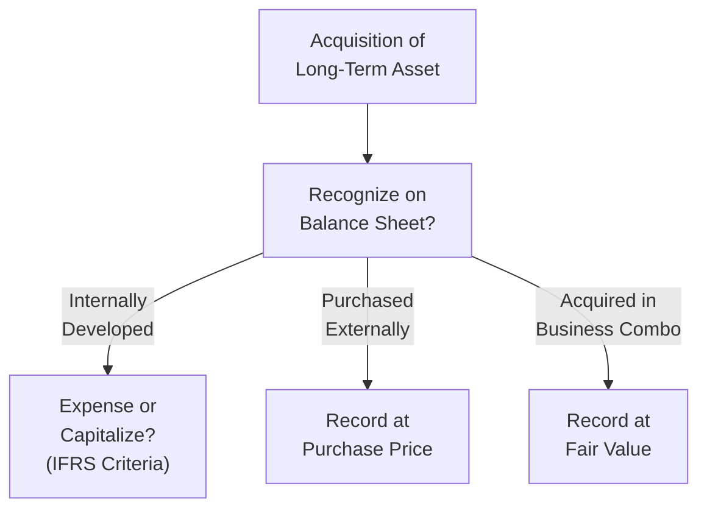
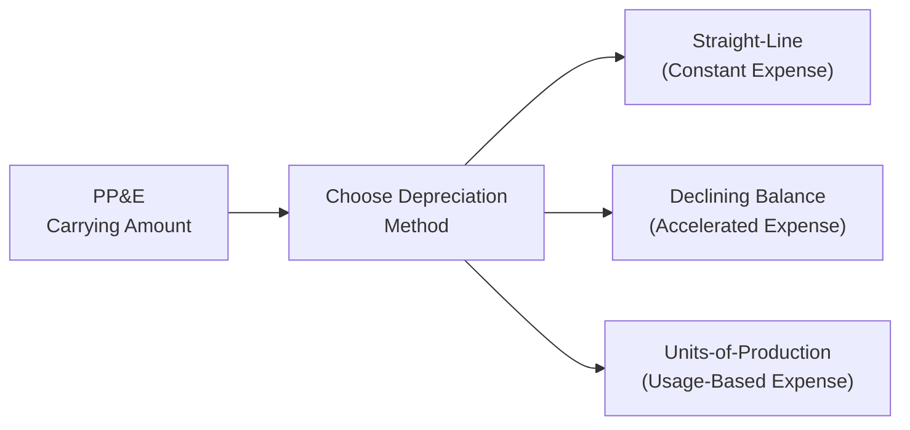

## 4.7 Analysis of Long-Term Assets

Long-term assets can be a big deal when you’re trying to assess a company’s true financial health. These are the resources an organization plans to use for more than one fiscal period—those big, chunky assets that often define a firm’s capacity to operate efficiently or innovate in the long run. Think property, plant, and equipment (PP&E) and intangible assets ranging from patents to software. 

Sometimes, I remember a conversation I had with a buddy who worked at a small tech startup. They spent a boatload on research and development (R&D) for a fancy new product—so much, in fact, that in the company’s infancy, the R&D overshadowed any income they could’ve shown. Eventually, he said something like, “We’ve basically got these intangible resources that might pay off down the road, but if you look at our books right now, you’d have no clue we were building something huge.” That sums up a key challenge in analyzing long-term assets: there can be a big difference between book values, future economic benefits, and actual market value.

Below, let’s talk through some of the key categories—intangible assets, PP&E, and the intricacies of revaluation, impairment, and disposal. We’ll also touch on the IFRS vs. US GAAP differences, which can be surprising if you’re new to it.

Understanding these topics can feel daunting at first, but hang in there. Let’s break them down in a—hopefully—friendly, practical way.

### Intangible Assets

Intangible assets are non-physical resources that create value, like patents, trademarks, software, or customer lists. Because they aren’t tangible, it can be tricky to capture their worth on the financial statements. 

There are three typical ways intangible assets show up:

• Purchased externally  
• Internally developed (think proprietary software or in-house R&D)  
• Acquired in a business combination (like a takeover or merger)

Anyway, let’s talk about how each is accounted for:

Purchased intangible assets are usually recognized on a company’s balance sheet at cost. Suppose your business buys a patent from another entity for $100,000. That purchase price is your initial recognition value. From there, you’ll amortize or test for impairment depending on whether the intangible has a finite or indefinite life.

Internally developed intangible assets can be a little trickier. Under US GAAP, unless the intangible is related to software development under specific guidelines, the R&D costs are usually expensed as incurred. IFRS, however, distinguishes between a “research phase” and a “development phase.” Research expenditures get expensed, while development expenditures can be capitalized if specific criteria (technical feasibility, intention to complete, probable future economic benefits, etc.) are met. To many folks, that’s a major difference: IFRS can allow some intangible assets to appear on the balance sheet for internally developed projects, whereas US GAAP would keep them off (just R&D in the income statement).

Acquired intangibles from a business combination involve the acquiree’s intangible assets recognized at fair value on the acquirer’s balance sheet. Let’s say you purchase a software company with a well-known brand name. The brand might have zero carrying value on the target’s books because it was internally developed. However, if you buy that company, you must measure the brand at its fair value on your consolidated financial statements. Often, this requirement can produce large intangible assets on the merger date that might not have shown up in the target’s historical statements.

Check out the below Mermaid diagram for a simplified visualization of the intangible asset recognition process:

### Property, Plant, and Equipment (PP&E)

PP&E includes those tangible, physical (often big) fixed assets: buildings, machinery, vehicles, manufacturing equipment, and so on. They help generate revenue over multiple periods, so their costs are usually capitalized and subsequently depreciated. 

Under both IFRS and US GAAP, you initially record PP&E at cost, which includes all directly attributable costs to get the asset ready for its intended use (like shipping and installation). However, IFRS and US GAAP differ in what they allow after initial recognition. IFRS permits two models:

• Cost Model: Carry the asset at historical cost minus accumulated depreciation and accumulated impairment losses.  
• Revaluation Model: Revalue the asset to its fair value at specific revaluation dates. Changes in fair value (above cost minus depreciation) often go to Other Comprehensive Income (OCI), while decreases may hit the income statement if they exceed any previously recognized gain in OCI.

US GAAP does not permit revaluation to fair value. Instead, you stick with the cost model, adjusting only for depreciation and impairment.

You might see a situation where a company that uses IFRS revalues its buildings (or any property) every few years. In booming real estate markets, that can significantly increase reported equity, because the revaluation can be credited to a revaluation surplus within equity. Sure, it’s a bit of an “upward push” that GAAP-based statements don’t allow. As an analyst, it’s wise to note these differences when comparing IFRS and US GAAP firms side by side.

### Depreciation Methods

How a company allocates the cost of a long-term asset over its useful life affects both the balance sheet and the income statement. Common depreciation methods include:

• Straight-Line: Recognizes an equal expense each year.  
• Declining Balance: Accelerates depreciation by applying a fixed rate to the carrying amount, leading to higher depreciation charges earlier in the asset’s life.  
• Units-of-Production: Depreciates based on actual usage or production levels—handy when usage is uneven over time.

So why should we care about these methods? Well, different methods can yield significantly different annual depreciation charges, net income, and asset book values. A piece of equipment can have the same total depreciation across its life, but the pattern of how it’s recognized in each period can make a difference in how profit looks. When you’re analyzing multiple companies, it’s always good to check their depreciation approach. Are they using a method that front-loads expenses? Or do they keep it nice and steady with straight-line? Understanding that can help you see beyond the raw numbers on the income statement.

### Impairment and Derecognition

An asset is impaired when its recoverable amount (the higher of fair value less costs to sell or value in use) goes below its carrying amount on the balance sheet. IFRS calls for impairment testing to happen when there’s any indication that the asset might be impaired. US GAAP also has a multi-step approach for impairment testing, especially for long-lived assets.

If an impairment is recognized, you reduce the carrying value of the asset and record a loss in the income statement. You might see an intangible asset or PP&E item get hammered if, say, market conditions turn sour. Under IFRS, there’s a possibility of reversing impairments in certain circumstances (for assets other than goodwill), but US GAAP generally doesn’t allow reversals of impairment losses once recognized, except in extremely rare circumstances (like certain intangible assets under specialized guidelines).

Derecognition refers to removing the asset from the balance sheet, typically because you’ve disposed of it (sold, scrapped, or no longer expect benefits) or it’s retired. The accounting process usually involves taking the asset and accumulated depreciation off your books and recording any resulting gain or loss in the income statement.

### Disclosures and Analyst Considerations

Companies must disclose details about their depreciation methods, key estimates for useful lives, salvage values (the residual value), and how they handle revaluations (where allowed). As an analyst, you’ll want to:

• Check consistency: Have they changed depreciation methods or useful lives recently? Such changes can significantly alter reported profits.  
• Evaluate reasonableness: Are those salvage values realistic, or are they artificially inflated to reduce depreciation expense?  
• Understand revaluation impacts: If a company is using the revaluation model under IFRS, keep an eye on what portion of equity is tied to revaluation surpluses.  

Sometimes companies tweak these assumptions if they need to manage earnings or debt covenant ratios. While we never want to assume the worst about management, it’s wise to maintain a healthy skepticism.

### Example: Comparing Two Companies

I once compared two manufacturing firms—one used straight-line depreciation and rarely upgraded equipment, while the other used an accelerated method and replaced machinery frequently. On the face of it, they had wildly different depreciation expense patterns, which also meant different net income trajectories. The second firm looked less profitable at first glance, but once you adjusted for the difference in depreciation strategy, you could see that the second firm’s assets were newer and more productive, potentially giving them a competitive edge down the road.

### Practical Observations

• Internally Developed R&D: Under IFRS, partial capitalization in the development phase might push up intangible assets on the balance sheet, making a company appear more asset-rich than it would under US GAAP.  
• Revaluation Surplus: IFRS revaluation can inflate equity if property values ramp up. This is neither “good” nor “bad” by itself, but it complicates comparisons to a US GAAP-based firm that doesn’t revalue PP&E.  
• Impairment Waves: In economic downturns, big impairment charges can show up. This might reorder a company’s balance sheet in a hurry.  
• Retirement or Disposal Gains/Losses: Keep an eye on asset disposals. When a firm sells old machines or intangible assets like patents, you might see a one-time gain or loss if carrying values differ from fair values.

### Glossary

• Internally Developed Intangibles: Generally expensed under US GAAP, with IFRS allowing some capitalization of development costs if strict criteria are met.  
• Revaluation Model (IFRS): Permits PP&E to be carried at fair value, with changes reflected in other comprehensive income or profit/loss.  
• Impairment: A downward revision of an asset’s carrying value to its recoverable amount.  
• Derecognition: Removal of an asset from the balance sheet when it’s disposed of or retired.  

### Mermaid Diagram for Depreciation Methods (Simplified)

### References & Further Reading

• IAS 16 (Property, Plant, and Equipment)  
• IAS 38 (Intangible Assets)  
• IFRS 13 (Fair Value Measurement)  
• FASB ASC 360 (Property, Plant, and Equipment)  

It can help to scan through these standards directly if you ever want to see the official language. They’re not always a riveting read, but they’re definitely thorough!

---

## Test Your Knowledge: Analysis of Long-Term Assets



### Which of the following best describes internally developed intangible assets under IFRS?  
- [ ] They are fully capitalized regardless of development stage.  
- [x] They can be capitalized only if specific development criteria are met.  
- [ ] They are always expensed on the income statement under IFRS.  
- [ ] They cannot be recognized on the balance sheet even if they have future economic value.  

> **Explanation:** Under IFRS, research costs are expensed, but development costs can be capitalized if specific criteria are satisfied (such as technical feasibility and the intent to use or sell the intangible).

### Under the revaluation model for PP&E, which statement is correct?  
- [ ] US GAAP allows upward revaluations on the balance sheet if market values rise significantly.  
- [x] IFRS allows an entity to carry PP&E at fair value with changes going to other comprehensive income.  
- [ ] Revaluation surpluses must be expensed immediately in the income statement.  
- [ ] The revaluation model applies only to intangible assets and not to PP&E.  

> **Explanation:** IFRS offers a choice between the cost model and the revaluation model for PP&E. Under the revaluation model, unrealized gains typically go to revaluation surplus in equity (OCI), while losses may affect the income statement after offsetting existing revaluation surplus.

### An asset is impaired when its:  
- [ ] Carrying amount is greater than its net realizable value, but still less than original cost.  
- [x] Carrying amount exceeds its recoverable amount.  
- [ ] Fair value is below original cost even if higher than carrying amount.  
- [ ] Salvage value is less than the net book value net of depreciation.  

> **Explanation:** Under both IFRS and US GAAP, an asset is considered impaired if its carrying amount exceeds the higher of fair value less costs to sell or value in use (recoverable amount).

### What happens when a company disposes of a piece of machinery at an amount different from its carrying value?  
- [ ] Any difference is treated as an extraordinary item.  
- [ ] The difference is deferred until the next reporting period.  
- [x] A gain or loss is recognized in the income statement.  
- [ ] The difference is allocated directly to shareholders’ equity.  

> **Explanation:** Upon disposal, the derecognition process removes both the asset and its accumulated depreciation from the books, and the difference between the proceeds and the carrying value is a gain or loss on the income statement.

### For revaluation of PP&E under IFRS, how is an upward revaluation accounted for?  
- [ ] Recognize it directly in retained earnings.  
- [ ] Recognize it as operating income in the current period.  
- [ ] Never allowed under IFRS.  
- [x] Recognize it in Other Comprehensive Income (as revaluation surplus) unless reversing a previously recognized loss.  

> **Explanation:** IFRS requires that any increase in an asset’s carrying amount due to revaluation is typically credited to OCI, creating a revaluation surplus in equity. If a revaluation decrease was previously recognized in profit or loss, then the increase can offset that expense first.

### Why do analysts often review the assumptions about useful lives and residual values for a firm’s PP&E?  
- [x] Because these assumptions directly impact depreciation expense and net income.  
- [ ] Because residual values and useful lives never change once an asset is placed in service.  
- [ ] Because IFRS requires immediate expensing of these values.  
- [ ] Because US GAAP forbids using any residual value estimates.  

> **Explanation:** Companies can influence reported earnings by changing assumptions on asset lives and salvage values. Analysts check consistency and reasonableness to ensure that the financial statements are comparable over time.

### If a firm capitalizes development costs under IFRS when all criteria are met, how does this typically affect financial statements compared to expensing those costs?  
- [x] It increases assets and decreases current period expenses, raising net income in the short term.  
- [ ] It has no impact on the income statement but increases net cash flow from financing.  
- [ ] It must be offset by a liability of the same amount.  
- [ ] It usually decreases net income in the long term.  

> **Explanation:** Capitalizing development costs means they appear as an asset rather than an immediate expense, boosting short-term net income. Over time, these capitalized amounts are then amortized or impaired.

### Under US GAAP, how are research and development costs generally treated?  
- [ ] Both research and development expenses are capitalized if future economic benefits are probable.  
- [ ] Development costs are capitalized once technical feasibility is established.  
- [ ] Research costs are capitalized while development costs are expensed.  
- [x] They are generally expensed as incurred, with certain exceptions for software development.  

> **Explanation:** US GAAP usually requires R&D costs to be expensed in the period incurred unless they meet the specific criteria for software under ASC 985-20. 

### Which of the following best describes impairment reversals under IFRS and US GAAP?  
- [ ] Both IFRS and US GAAP generally allow impairment reversals for goodwill.  
- [ ] US GAAP permits reversals for long-lived assets, while IFRS forbids them.  
- [x] IFRS allows impairment reversals (except for goodwill), while US GAAP generally prohibits reversals.  
- [ ] Neither IFRS nor US GAAP allows any type of impairment reversal.  

> **Explanation:** IFRS allows impairment reversals for long-lived assets, but not for goodwill. Under US GAAP, once an asset has been written down, it stays at that reduced carrying value (no reversal), except in rare circumstances.

### Under the declining balance method of depreciation, why are depreciation charges higher in the early years?  
- [x] Depreciation is calculated on the declining net book value, applying a constant rate to the decreasing balance.  
- [ ] A constant amount is charged every year, but it accumulates in the early years.  
- [ ] Salvage value is subtracted from net income in the first year under IFRS.  
- [ ] It’s required by law to inflate early-year expenses.  

> **Explanation:** Under a declining balance method, an accelerated depreciation rate is applied to the book value each year, resulting in higher expenses initially that diminish as the asset gets older.


