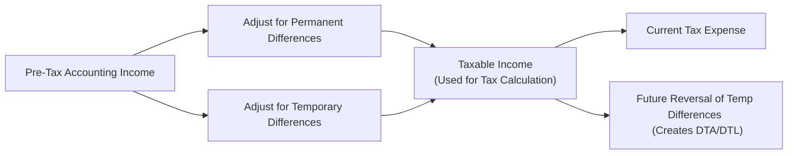

## 4.9 Analysis of Income Taxes

Income taxes can feel a bit like that mysterious curtain you’re never sure if you’re allowed to peek behind. But trust me, analyzing income taxes for financial statement purposes is not just for hardcore accountants. If you’re an investor, analyst, or just a curious soul who wants to see how taxes can shape a company’s financials, you’ll find plenty of helpful nuggets here—some surprising, some straightforward, and some that might just stop you in your tracks.

It’s easy to get confused when you see that a company’s tax bill in its annual report doesn’t match what you’d expect from multiplying its pre-tax earnings by the statutory tax rate. So, let’s walk through the logic behind “accounting profit” versus “taxable income,” how temporary and permanent differences show up, and what exactly “deferred tax liabilities” or “deferred tax assets” are trying to tell us.

And I might throw in a few stories from my own experiences (embarrassing or otherwise) of grappling with taxes in the real world. Let’s go.

---

### Why Understanding Income Taxes Matters

Let me share a quick anecdote: Years ago, I analyzed a tech firm that appeared to have a super-low effective tax rate—somewhere in the single digits. My first reaction was “Wow, what amazing tax planning genius do they have?” But after some digging, I discovered their enormous deferred tax asset resulting from prior years of losses. They didn't owe as much tax right now, but that situation was likely to change once they used up their net operating loss (NOL). That’s the sort of “aha” moment that underscores the importance of analyzing a firm’s income tax lines carefully.

In financial analysis, evaluating how taxes flow through a company’s financials helps us see its real performance, make sense of its future tax exposures, and form a better picture of long-term profitability. This is precisely why we can't just look at the “tax expense” line in isolation. We need to connect the dots: from statutory tax rates, permanent and temporary differences, to the company’s effective tax rate, and on to the hidden complexities behind deferred tax accounts and net operating losses.

---

### Accounting Profit vs. Taxable Income

One of the most important distinctions when trying to understand corporate taxes is the difference between “accounting profit” (or pre-tax financial income) and “taxable income.” They rarely match perfectly because financial accounting rules (like IFRS or US GAAP) have different objectives and timing requirements for recognizing revenues and expenses compared to tax regulations.

• Accounting Profit  
  This is the figure you see on the income statement, reflecting a company's performance according to financial reporting standards (e.g., IFRS or US GAAP). In principle, it aims to measure economic performance over a particular reporting period.

• Taxable Income  
  This is the income figure used for calculating income tax liability under the relevant tax laws. Think internal revenue codes or local tax statutes. Essentially, the government uses a set of tax rules to figure out how much a firm should pay.

When the two sets of rules differ, a company might wind up with “permanent differences” or “temporary differences” between accounting profit and taxable income.

#### Permanent Differences
Permanent differences never reverse. They pop up because certain items may be recognized for accounting purposes but never recognized for tax purposes, or vice versa. For instance, if a company is fined for a regulatory violation, that fine might be recognized as an expense for financial accounting. But many tax codes do not allow a company to deduct fines or penalties from taxable income. So that difference is permanent.

It’s like if you had a personal expense that you wrote in your checkbook but you knew you’d never get reimbursed for—there’s just no reversing that. Another common example is tax-free interest income from certain government bonds. Such income might be recognized for accounting but excluded from taxable income altogether.

#### Temporary Differences
Temporary differences eventually reverse over time. So, today's difference might flip tomorrow. Typical scenarios include differences in when revenue or expense is recognized for financial reporting versus when it’s recognized for tax. For example, a company may use straight-line depreciation for its financial statements but use an accelerated depreciation method for tax. The result is typically lower taxable income in the earlier years and higher taxable income in the later years.

This sort of timing difference leads directly to the creation of “deferred tax liabilities” (DTLs) and “deferred tax assets” (DTAs).

---

### Deferred Tax Liabilities (DTLs) and Deferred Tax Assets (DTAs)

Now that we’ve introduced the idea of temporary differences, it’s time to bring in the concept of deferred tax items. My very first run-in with deferred taxes was quite a humbling experience: I remember looking at the company’s balance sheet (fresh out of college, mind you) and seeing a big chunk of “deferred tax” that didn't match up with my back-of-the-envelope calculations. As it turned out, I was only considering immediate taxes, not the full effect of timing differences that shift taxable income across multiple periods.

#### Deferred Tax Liabilities
A deferred tax liability is, well, a potential future tax bill. It arises when a company pays less tax now (for example, because of accelerated depreciation for tax purposes) but will likely pay more tax in future periods when those timing differences reverse.

In short, you can think of a DTL as an IOU to the tax authorities: “I owe more in taxes eventually because I recognized certain items for tax now—like higher depreciation—that reduce my current taxable income. But when that advantage flips in the future, I’ll owe the difference.”

#### Deferred Tax Assets
A deferred tax asset is the opposite. It means the company has effectively paid more tax now (or recognized fewer tax deductions at present) but will likely pay less in the future. This can come about when the accounting rules recognize an expense early, while tax rules push that expense to a future period. Net operating losses (NOLs) are a classic source of deferred tax assets because they can be carried forward to offset future taxable income.

Let’s visualize the typical flow leading to deferred tax items:

- “Pre-Tax Accounting Income” is your financial statement starting point.  
- “Adjust for Permanent Differences” affects the calculation once-and-for-all.  
- “Adjust for Temporary Differences” will create a difference now but reverse in later periods.  
- “Taxable Income” is then used to calculate the “Current Tax Expense.”  
- Deferred tax items appear in the balance sheet thanks to those “Future Reversal of Temp Differences.”

---

### Effective Tax Rate, Statutory Tax Rate, and Cash Tax Rate

The statutory tax rate is straightforward: it’s the legally enacted rate that companies in your jurisdiction must pay (subject to all the rules and carve-outs, of course). But then you may notice a company reporting an “effective tax rate” that differs from the statutory one.

• Statutory Tax Rate  
  The official tax rate set by the government. For instance, if the law says 30% for corporate income, that’s the statutory tax rate.

• Effective Tax Rate  
  The effective tax rate is typically calculated as:

  
  \text{Effective Tax Rate} = \frac{\text{Income Tax Expense}}{\text{Pre-Tax Accounting Income}}
  

  This might end up being higher or lower than the statutory rate because of permanent differences, tax credits, foreign taxation issues, and so forth.

• Cash Tax Rate  
  The cash tax rate focuses on actual cash flow, measured as:

  
  \text{Cash Tax Rate} = \frac{\text{Taxes Paid in Cash}}{\text{Pre-Tax Accounting Income}}
  

  Sometimes you’ll see huge differences between the effective tax rate and the cash tax rate. For instance, maybe the company’s recognized a bunch of expense on the income statement, but the actual check they wrote to the IRS is smaller because they're still using a carryforward NOL from past losses.

From an analyst's perspective, the cash tax rate can give you a better sense of the actual impact on day-to-day liquidity and operational resources. Meanwhile, the statutory tax rate sets the baseline for what we’d expect, and the effective tax rate shows what’s actually hitting the company’s P&L from a book perspective.

---

### Disclosures Surrounding Deferred Taxes and Tax Reconciliation

Companies need to give you enough detail in their financial statements to figure out how their effective tax rate is derived and how big their deferred tax assets and liabilities are. You might see a “tax note” that explains permanent differences (like tax-exempt interest or non-deductible expenses) and breaks down deferred tax components.

Consider these key items:

• Deferred Tax Rollforward  
  Companies often provide a schedule that reconciles beginning and ending DTLs and DTAs. This might list major types of temporary differences (like depreciation, provisions, NOL carryforwards) and how they changed during the period.

• Tax Rate Reconciliation  
  Many companies must reconcile their “expected tax expense” (pre-tax accounting income multiplied by statutory tax rate) with the “actual tax expense.” The difference arises from items such as permanent differences, tax credits, or changes in tax rates. This helps you see what’s recurring versus one-time.

• NOLs and Other Tax Credits  
  If a company has large net operating loss carryforwards, that can significantly reduce future taxes. However, these assets sometimes expire if not used within a certain time frame. Companies must also evaluate the “recoverability,” meaning whether it’s more likely than not they'll earn enough taxable income to use the DTA. If not, they have to create a valuation allowance that reduces the DTA.

---

### Bringing It All Together with a Simplified Example

Imagine TechVision, Inc. has these simplified numbers (and let’s keep it super high-level):

• Pre-tax accounting income: $100 million  
• Statutory tax rate: 25%  
• Permanent differences increasing income by $2 million (not subject to tax).  
• Temporary differences reduce current taxable income by $5 million, but that difference is expected to reverse in future years.  

Given these data:

1. **Taxable Income**  
   Taking pre-tax income of $100 million and subtracting the $5 million temporary difference, you get $95 million. The $2 million permanent difference that increases income for accounting purposes but not for tax means that for tax, it’s basically ignored (assuming a scenario like non-deductible expenses or similar). So let’s imagine it’s an expense that never gets deducted for tax, or interest income that never gets taxed. Adjusting in the correct direction leads to a final taxable income of $95 million anyway.  

2. **Calculation of Current Tax Expense**  
   With a 25% rate, your current tax expense is $95 million × 25% = $23.75 million.  

3. **Deferred Tax Impact**  
   Because you recognized $5 million less in taxable income now (due to the temporary difference), you expect to recognize that $5 million in future taxable income (as it reverses). The deferred tax liability portion would be $5 million × 25% = $1.25 million. This is the extra tax you’ll pay later once the timing difference reverses.  

4. **Income Tax Expense on the Financial Statements**  
   Total income tax expense is the sum of current expense plus deferred expense (or minus deferred benefit). Here, it’s $23.75 million current plus $1.25 million deferred = $25 million total.  

5. **Effective Tax Rate**  
   Using the formula:  
   Effective Tax Rate = $25 million ÷ $100 million = 25%.  

In this simple example, the permanent difference I suggested didn’t change the final number significantly because I set them up to net out. In practice, a permanent difference would alter your effective tax rate. For instance, if part of your income was non-taxable, your effective tax expense might be lower than the statutory rate. If some of your expenses were non-deductible, you might end up with a higher effective rate.  

---

### Practical Analysis Tips

1. **Look for Recurring vs. One-Time Factors:**  
   You might see big changes in a company’s effective tax rate from year to year. Check if these changes are due to structural factors (like a shift to a low-tax jurisdiction) or if they’re one-off events (like a tax settlement).

2. **Evaluate Future Tax Position:**  
   If a company has a large deferred tax asset, dig into management’s assumptions about where future taxable income will come from. If their expectations seem unrealistic, the DTA might be overstated.

3. **Keep an Eye on Valuation Allowances:**  
   Valuation allowances reduce DTAs on the balance sheet if there's not enough future taxable income to utilize them. These allowances can change earnings significantly if reversed later on.

4. **Compare Cash Tax Paid to Income Tax Expense:**  
   If the difference is consistently large, you want to know why. Are they deferring tax payments, or are they using special credits or carryforwards?

5. **Understand Cross-Border Tax Implications:**  
   Tax rules can vary widely from one country to another, and multinational firms often engage in complex tax planning. Pay attention to foreign income and related foreign tax rates.

---

### Glossary

• **Deferred Tax Liabilities (DTLs):** Future tax payable when accounting income exceeds taxable income temporarily (leading to underpaid tax now that will be paid later).  
• **Deferred Tax Assets (DTAs):** Future tax reduction when taxable income exceeds accounting income temporarily (leading to overpaid tax now that will be recouped later).  
• **Permanent Differences:** Differences that never “reverse,” such as fines (non-deductible) or certain forms of tax-exempt income.  
• **Net Operating Loss (NOL):** A loss that a company can carry forward (or backward, under certain regimes) to reduce future (or past) taxable income.

---

### References & Further Reading

• IAS 12 Income Taxes; FASB ASC 740 Income Taxes  
• Schilit, H., & Perler, J. (2010). Financial Shenanigans: How to Detect Accounting Gimmicks & Fraud. McGraw-Hill.  

These sources go into more detail about specific requirements for how to measure and present income tax expenses and disclosures. They’re definitely worth a read if you want to get deeper into the regulations themselves.

---

So, there you have it: a thorough (though hopefully still interesting) deep dive into the analysis of income taxes. Sometimes these concepts can feel a little heavy—like you’re wading through a jungle of arcane rules—but trust me, the more comfortable you get with them, the more clearly you’ll see how taxes influence a company’s reported performance and financial position. Taxes are never just a “footnote”; they’re often a real game-changer for both short-term earnings and long-term viability.

## Test Your Knowledge of Income Tax Analysis



### Which statement best describes the relationship between accounting profit and taxable income?

- [x] They can differ because accounting standards and tax laws use different rules.
- [ ] They are always the same because both follow IFRS or US GAAP.
- [ ] They only differ if a company is unprofitable.
- [ ] They differ only if tax rates change mid-year.

> **Explanation:** Accounting profit is calculated under financial reporting standards, while taxable income is determined by tax regulations. These two frameworks often produce different figures, leading to temporary and permanent differences.

### What is the defining characteristic of permanent differences?

- [x] They never reverse over time.
- [ ] They result only from depreciation differences.
- [ ] They only lower taxable income.
- [ ] They always expire within 3 to 5 years.

> **Explanation:** Permanent differences are items that will not reverse in a future period (e.g., fines and penalties or tax-exempt interest). They are recognized differently under accounting rules and tax laws and do not cause a future reversal.

### How would you typically interpret a deferred tax liability?

- [x] A future tax outflow the company expects to pay because it currently pays fewer taxes.
- [ ] A future tax inflow resulting from currently paying more taxes than required.
- [ ] A tax savings the company receives now, permanently.
- [ ] A result of errors in the company’s financial statements and must be written off immediately.

> **Explanation:** A deferred tax liability represents the anticipation that the company will owe more taxes in future years when temporary differences (e.g., accelerated depreciation) reverse.

### A deferred tax asset usually indicates what?

- [x] The company may pay less tax in the future because it has effectively paid more now.
- [ ] The firm is evading taxes by writing off expenses early.
- [ ] The firm permanently pays lower taxes compared to other firms.
- [ ] The government owes the firm a refund for the current period only.

> **Explanation:** A deferred tax asset often arises from situations where the company’s taxable income is higher than accounting income in the current period (or has generated a net operating loss). Subsidizing future tax savings is the key concept.

### Which of the following best describes the statutory tax rate?

- [x] The legally enacted rate set by the taxation authority.
- [ ] The actual tax rate the company pays on its net income.
- [x] The baseline rate before accounting for any deductions or credits.
- [ ] The average rate paid across multiple years.

> **Explanation:** The statutory tax rate is the official rate set by the government (e.g., 30% corporate tax). It's often the starting point in determining theoretical tax expense before adjustments.

### If a company’s effective tax rate is consistently lower than the statutory rate, which of the following is a possible explanation?

- [x] The company has significant permanent tax differences or tax credits.
- [ ] The statutory tax rate is understated.
- [ ] The company is misapplying accounting standards.
- [ ] The government has automatically reduced the firm’s tax rate with no explanation.

> **Explanation:** A consistent gap between the effective and statutory rates often points to real structural factors, such as permanent differences, research credits, or foreign income taxed at lower rates.

### Which line-item on the financial statements directly captures the firm’s actual cash outflows due to taxes in a given period?

- [x] “Taxes Paid” in the statement of cash flows.
- [ ] “Income Tax Expense“ in the Income Statement.
- [x] “Deferred Tax Asset” found in the Balance Sheet.
- [ ] “Retained Earnings” in the Balance Sheet.

> **Explanation:** The “Taxes Paid” figure in the statement of cash flows (often found in the operating activities section) shows the actual cash outflow. Income Tax Expense on the income statement includes both current and deferred components, which may not reflect actual cash outflows.

### What is one key benefit of performing a tax rate reconciliation?

- [x] It reveals the primary drivers causing the difference between the statutory and effective tax rate.
- [ ] It confirms whether the statutory tax rate is correctly set by lawmakers.
- [ ] It tells you the company’s future tax burden with complete certainty.
- [ ] It avoids the need to account for deferred tax liabilities or assets.

> **Explanation:** The tax rate reconciliation highlights factors such as permanent differences and foreign tax rates. It helps analysts see which items most significantly affect the effective tax rate compared to the statutory rate.

### What is a valuation allowance related to a deferred tax asset?

- [x] A reduction of the deferred tax asset if there’s doubt about the company’s ability to generate future taxable income.
- [ ] An increase in the deferred tax liability if the company overstated revenue.
- [ ] A way to net permanent differences over multiple reporting periods.
- [ ] A penalty imposed by tax authorities when a firm uses accelerated depreciation.

> **Explanation:** A valuation allowance is used when it’s uncertain that all or part of the deferred tax asset can be realized. If the company lacks sufficient future taxable income projections, the DTA is partially or fully offset by a valuation allowance.

### True or False: A large deferred tax asset always ensures lower effective tax rates in the future.

- [x] True
- [ ] False

> **Explanation:** Generally, a large deferred tax asset indicates the possibility of offsetting future taxable income, lowering effective tax rates in upcoming periods—provided the company’s assumptions about future profitability hold.


