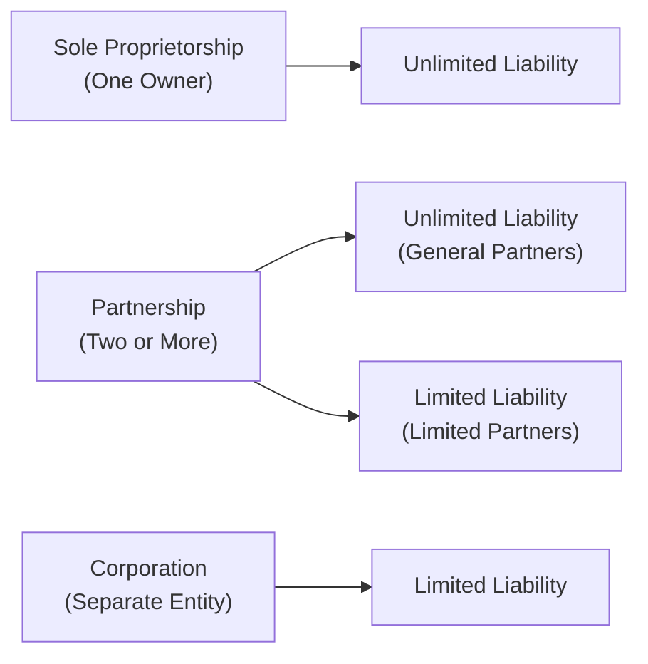
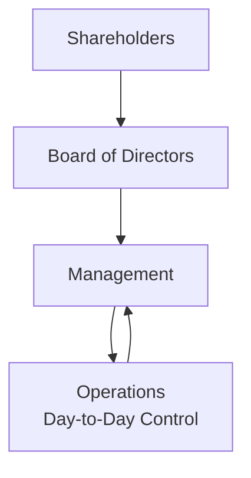

## 5.1 Organizational Forms, Corporate Issuer Features, and Ownership

Imagine you’re hanging out with a friend who’s thinking about starting a new business and isn’t sure whether to go solo, find a partner, or form a corporation. Honestly, it can feel a bit confusing—especially when words like “unlimited liability” or “share classes” get thrown around. But hang on, let’s break it down piece by piece, just like you’d explain it over coffee.

It might be helpful to recall that businesses exist in different forms for some good reasons. Every form—from the tiny food truck on the corner to a major global corporation—has unique pros, cons, legal requirements, and levels of risk. They also differ in how ownership is structured and how it can be transferred. By the end of this discussion, you’ll be able to talk confidently about sole proprietorships, partnerships, corporations, and more. You’ll also see how these structures tie into corporate governance, accountability, and regulatory requirements. So let’s dive in!

---

### Sole Proprietorship
Many of us have come across a one-person show: maybe a favorite local barber or a freelance designer who does everything themselves. In a nutshell, a sole proprietorship is a business owned by a single individual. The owner and the business are one and the same—legally speaking.

• Liability:  
  Because the owner and the business are not seen as separate, the owner is personally responsible for all business debts. If the business can’t pay its bills, the owner’s personal assets (like a house or car) can be at risk. This is what we mean by “unlimited liability.”

• Control:  
  On the upside, sole proprietors have complete control over decision-making. No need to consult a partner or board.

• Taxes:  
  It’s “flow-through” taxation—basically, the profits or losses pass directly to your personal tax return. This can make tax filing simpler (just a schedule on your personal taxes in many jurisdictions).

• Pros and Cons:  
  – Pros: Full ownership, full control, easier and cheaper to set up.  
  – Cons: Unlimited liability can be scary; raising money can be really tough without outside investors.

I once had a friend, Kelly, who started a home-based bakery as a sole proprietor. At first, it was great—low overhead, quick decisions, no messy partnership agreements. But Kelly eventually dreamed of growing into a bigger shop. That meant needing more funds, and the personal liability started to look pretty intimidating. Kelly ended up forming a Limited Liability Company to get that liability protection and an easier time getting a bank loan. But we’ll get to LLCs in a bit.

---

### Partnership
Now, a partnership is like a team effort. You and one or more people (or even other companies, in some cases) pool your resources. There are a couple of flavors: a general partnership or a limited partnership. In a general partnership, all partners typically share responsibility and liability. In a limited partnership, you’ll have at least one general partner (with management control and unlimited liability) and one or more limited partners (with limited liability but usually no active management role).

• Liability:  
  In a general partnership, each partner can be personally on the hook for debts incurred by the business (again, unlimited liability). In a limited partnership, at least one person has unlimited liability, while others can limit their liability to their invested capital.

• Decision-Making:  
  Partners usually establish a partnership agreement that clarifies responsibilities, how profits or losses are divided, how decisions are made, and how to handle disputes.

• Taxes:  
  Partnerships often use pass-through taxation: the partnership itself doesn’t pay taxes at the entity level; instead, each partner reports their share of the profits or losses.

• Pros and Cons:  
  – Pros: Shared resources, collaboration, synergy of multiple skill sets.  
  – Cons: Potential conflicts among partners, possible unlimited liability for general partners, and the risk that one partner’s actions can bind the entire partnership.

As a personal aside, I once was part of a small partnership for a side hustle in college. Let me tell you, it was both exciting (yay, a partner to share the work!) and nerve-wracking (the buddy had the authority to sign contracts on behalf of our blossoming operation). We ended up making a bulletproof partnership agreement that spelled out exactly who did what, so there weren’t any misunderstandings.

---

### Corporation (Company)
A corporation is next-level. It’s like a separate “person” in the eyes of the law—distinct from the founders, managers, and shareholders. These are the businesses you see listed on stock exchanges, or that are formed to raise capital from a large number of investors. The big hallmark of a corporation is limited liability for shareholders.

• Limited Liability:  
  This means that if the corporation faces financial trouble or lawsuits, the shareholders’ personal assets are typically shielded (except when courts “pierce the corporate veil” if there’s major wrongdoing or not enough separation between owner and entity).

• Separate Legal Personality:  
  The corporation can sign contracts, borrow money, sue or be sued, all under its own name without implicating shareholders directly.

• Separation of Ownership and Control:  
  Ownership belongs to stockholders who (generally) elect a board of directors. Professional managers and executives handle day-to-day operations. While that’s great for specialization, it also introduces the possibility of conflicts between management (agents) and shareholders (principals).

• Taxation:  
  Corporations are often taxed at the entity level, and then any dividends distributed to shareholders can be taxed again at the personal level. That’s the so-called “double-taxation” issue. Some jurisdictions allow special structures (like S Corporations in the U.S.) that avoid double-taxation.

• Pros and Cons:  
  – Pros: Limited liability, easier capital-raising, potential for perpetual existence.  
  – Cons: More regulations, higher setup costs, potential double taxation, the agency problem.

All in all, corporations are the main form used by big companies you see on major stock exchanges, as well as countless privately held smaller to mid-sized companies. In Chapter 5.3 of this text, we talk more about the mechanisms that mitigate the conflicts that can arise from the separation of ownership and control.

Below is a quick diagram to visualize how ownership, liability, and control can differ across select organizational forms. Think of it as an at-a-glance snapshot:

---

### Limited Liability Company (LLC) and Limited Liability Partnership (LLP)
These are hybrids that combine some benefits of corporations (like limited liability) with the flow-through taxation often seen in partnerships. They’re not the same in every country—laws can differ significantly from place to place—but generally, the idea is:

• Limited Liability:  
  Owners (sometimes called “members”) are usually protected from personal liability beyond their investment.

• Tax Flexibility:  
  Many LLCs in certain jurisdictions can choose to be taxed like a partnership (flow-through) or as a corporation.

• Ease of Management:  
  LLCs often have fewer corporate formalities, making them easier to operate than a regular corporation. At the same time, they may not have the same broad access to public capital markets as a corporation.

• LLPs:  
  Commonly used by professional service firms (e.g., law, accounting), because they provide partnership structure plus liability protections for each partner from other partners’ negligence or misconduct.

---

### Public vs. Private Ownership
Now, deciding whether your corporation should be public or remain private is a big deal. Many start-ups begin private and then move toward an initial public offering (IPO) if they want to tap large amounts of capital from the general public and provide liquidity for early investors.

• Public Companies:  
  Their shares are typically traded on a recognized stock exchange or through over-the-counter (OTC) markets. Because their shares are out in the public domain, they’re subject to stricter regulations, more extensive disclosure requirements (such as quarterly earnings reports), and possible scrutiny from analysts and the media. One plus is that it’s generally easier to sell shares on an exchange, so capital is more fluid.

• Private Companies:  
  Their shares are not publicly traded, so they rely on private funding from, for instance, venture capitalists, private equity, or the founders’ own funds. This means fewer formal regulatory filings, more confidentiality, and less public pressure for short-term performance. The downside is that it can be harder to raise large amounts of capital or allow shareholders to exit their positions easily.

Public vs. private ownership also affects how management teams make decisions. Public firms might feel pressured to show quarterly gains to keep shareholders happy, whereas private companies sometimes have more freedom to pursue long-term initiatives without constant external scrutiny.

---

### Key Corporate Issuer Features
Corporations, whether private or public, share some important traits:

• Legal Personality:  
  The corporation is recognized as a separate legal entity—it can sue, be sued, and even enter into contracts in its own name.

• Transferability of Ownership:  
  Shares can be traded or transferred. For a publicly listed company, this can happen on a stock exchange. Private corporations, however, often restrict share transfers to insiders or pre-approved buyers.

• Separation of Ownership and Control:  
  This is a big one. Shareholders own the firm, but managers run the day-to-day business. Thus, governance structures like boards of directors, committees, and regulatory oversight become critical. See Chapter 5.3 for a deeper dive on corporate governance.

---

### Ownership Types (Share Classes)
Corporations can issue different classes of shares, each with its own privileges and constraints. If you’ve ever wondered why some shares come with extra voting rights or guaranteed dividends, this is where it all fits in:

• Common Stock:  
  Common shares represent the bulk of ownership in many firms. Holders often have voting rights, a claim on residual earnings (dividends, if declared), and the potential to benefit from capital gains. If the company is liquidated, though, common shareholders get paid last—after creditors and preferred stockholders.

• Preferred Stock:  
  Preferred shareholders usually get a fixed dividend before any common dividend is paid, and they typically have priority in liquidation over common shareholders. They often lack voting rights in typical corporate matters. Some forms of preferred shares can be converted into common stock, providing upside potential if the stock price soars.

• Dual-Class Shares:  
  Companies sometimes issue Class A and Class B shares. Maybe Class A has more voting rights than Class B, or vice versa. This structure is often used by founders who want to maintain control (through high voting shares) while still raising capital from the broader investing public.

If you recall, some major tech companies have dual- or multi-class share structures to ensure that founders keep a tight grip on strategic direction while still accessing the capital markets for funding.

---

### Governance and Accountability
Governance frameworks, typically led by a board of directors, ensure that management’s decisions serve the best interests of shareholders (or at least that’s the idea). This is where accountability steps in to mitigate the so-called agency problem.

• Board of Directors:  
  Elected by shareholders, the board supervises top-level decisions, hires/fires top executives, oversees major corporate strategies, and ensures compliance with laws. The board’s composition, independence, and expertise can significantly shape a firm’s direction.

• Executive Compensation and Incentives:  
  To align management with shareholders, compensation packages might include performance-based bonuses, stock options, restricted stock units, or other incentives. It’s a delicate balance: you want to reward good stewardship without encouraging excessive short-term risk-taking that could harm the firm in the long run.

• Shareholder Rights:  
  Depending on the firm’s bylaws and the jurisdiction’s rules, shareholders usually have the right to vote on key issues like board elections, major mergers or acquisitions, and changes in corporate charters.

In many countries, strong governance is required by law for publicly traded companies, typically enforced by a regulatory agency overseeing securities markets. You might find that private companies have more flexible governance structures, often concentrated in the hands of a couple of major equity holders.

---

### Legal Environment and Regulation
Let’s be honest: the list of regulations can make your head spin. However, the aim is to protect investors from fraud and ensure that markets remain efficient and transparent.

• Regulatory Structures:  
  In the U.S., the Securities and Exchange Commission (SEC) enforces laws that govern how publicly listed firms report financials, disclose material information, and handle insider trading issues, among many other topics. In Europe, you might encounter the European Securities and Markets Authority (ESMA), plus each country’s local agencies.

• Listing Requirements:  
  Each stock exchange has its own rules around corporate governance, minimum share prices, minimum market capitalization, and periodic disclosure of financial statements. These requirements can be stringent, but they also add credibility.

These regulations and listing rules mean that many public companies are forced to maintain robust internal controls, conduct external audits, and provide transparent updates. Sure, regulatory compliance is extra work, but for many corporations, it’s the price of admission to large-scale capital markets.

---

### Ownership Concentration and Control
You might wonder: how does ownership concentration affect the direction of a company? In truth, it can have major implications.

• Concentrated Ownership:  
  Founders, families, or large institutional investors can hold major stakes. This can sometimes lower the agency problem because these big shareholders have strong incentives to monitor managers closely. Then again, if a controlling shareholder is steering the ship, minority shareholders might feel their interests are being overlooked.

• Dispersed Ownership:  
  In many large public companies, ownership is widely spread out among thousands—or even millions—of shareholders. No single group may hold enough votes to exert strong control, so management might have a freer hand. This can lead to principal-agent problems where managers may not always act optimally for shareholders.

Some companies have strong institutional investors (like pension funds or mutual funds) that group together to influence decisions. Activist shareholders sometimes push companies to make changes they believe will boost shareholder value.

---

### Factors Influencing Choice of Organizational Form
Why does your friend Kelly from earlier decide on an LLC? Why does a superstar tech start-up eventually go public? Here are some of the main reasons:

• Liability Concerns:  
  If the business is high-risk (like real estate development or medical devices), owners often prefer limited liability structures to safeguard their personal wealth.

• Tax Considerations:  
  Depending on one’s jurisdiction, certain structures may offer pass-through tax benefits or other advantages.

• Need for Capital and Financing Flexibility:  
  Big visions often need big money, which can lead to a corporate structure that enables equity fundraising. Going public can raise enormous sums, but also requires abiding by strict regulations and scrutiny.

• Regulatory and Disclosure Requirements:  
  A sole proprietorship or private firm can sometimes enjoy more confidentiality. Meanwhile, public corporations must keep shareholders and regulators in the loop with significant disclosures.

• Ownership Structure Goals and Exit Strategy:  
  If you plan to hand the company over to your kids someday, maybe a family-run private business model is ideal. If you envision eventually selling it to the public, you’ll want to structure it with an eye to an IPO or acquisition.

---

### Additional Representation of Ownership and Control
Here is a simplified diagram illustrating the separation of ownership (shareholders) and control (managers) in a typical corporation, along with the role of the board of directors.

Shareholders elect the board, which oversees management. Management runs daily operations, which ultimately feed back to management’s responsibility to meet shareholder aims. If you think about it, this separation can be very efficient, but it also creates a window for potential conflicts of interest—known in finance as agency problems.

---

## Glossary

• Limited Liability:  
A legal structure where an investor’s financial loss is limited to the amount invested (i.e., personal assets are generally protected).

• Sole Proprietorship:  
A business owned by one individual, bearing unlimited personal liability for debts and obligations.

• Partnership Agreement:  
A legal document outlining responsibilities, profit-sharing, decision-making authority, and conflict resolutions for partners in a partnership.

• Public Company:  
A firm whose shares are listed on a stock exchange or traded publicly, enabling the general public to buy and sell ownership stakes.

• Private Company:  
A firm not listed publicly; shares are typically held by founders, families, private equity, or select private investors.

• Share Class:  
A specific type of stock, often differing in terms of voting rights, dividend priority, and other privileges.

• Transferability:  
How easily ownership interests (typically shares) can be sold or exchanged. Publicly listed companies have high transferability, while private ones may have restrictions.

• Agency Problem:  
A conflict of interest between agents (managers) and principals (shareholders), often arising when managers do not act in the best interests of the owners.

---

## Best Practices, Pitfalls, and Strategies
• If you’re forming a partnership, draft a robust partnership agreement to minimize conflicts. Clarity is king.  
• A corporation’s separation of ownership and management can drive efficiency, but it’s crucial to implement good governance practices, like an independent board of directors, to mitigate agency risk.  
• For entrepreneurs, selecting LLCs or LLPs can offer liability protection and tax benefits, but always consult local regulations because rules differ widely.  
• When going public, be prepared for more intense scrutiny, from both regulators and the public eye. Develop a solid internal control and reporting structure early.

---

## Encouragement to Dive Deeper
Honestly, this is just the tip of the iceberg. If you find yourself eager to learn more, the next sections in Chapter 5 examine corporate governance more deeply, how corporations juggle capital decisions, and how they navigate working capital challenges (Chapter 5.4). Also, keep your eyes peeled for what’s covered in Chapter 6 about Equity Investments (especially 6.4 on equity securities—lots of overlap with share classes!).

---

## References and Further Reading
• CFA Institute Level I Curriculum (Corporate Issuers)  
• Brealey, Myers, and Allen, “Principles of Corporate Finance”  
• Ross, Westerfield, and Jaffe, “Corporate Finance”  
• Official regulatory pages for listener jurisdictions:  
  – For the U.S., the Securities and Exchange Commission (SEC): https://www.sec.gov/  
  – For the UK, the Financial Conduct Authority (FCA): https://www.fca.org.uk/  
  – For the EU, the European Securities and Markets Authority (ESMA): https://www.esma.europa.eu/  

---

## Test Your Knowledge: Organizational Forms, Corporate Features, and Ownership



### Which of the following structures exposes its owners to unlimited liability for the debts of the business?

- [ ] A private corporation
- [x] A sole proprietorship
- [ ] A limited liability company
- [ ] A public corporation

> **Explanation:** In a sole proprietorship, there is no legal separation between the owner and the business, so the owner has unlimited liability.

### Common stock typically offers shareholders:

- [ ] Guaranteed dividends regardless of profit
- [x] Voting rights and a residual claim on earnings
- [ ] Priority in liquidation over creditors
- [ ] Priority in liquidation over preferred shareholders

> **Explanation:** Common stock usually provides voting rights and a residual claim on earnings. However, in liquidation, creditors and preferred shareholders have priority.

### One key difference between public and private companies is that public companies:

- [x] Are subject to more rigorous disclosure requirements
- [ ] Are not allowed to distribute dividends
- [ ] Have no board of directors
- [ ] Are exempt from any regulatory oversight

> **Explanation:** Public companies face more detailed regulatory and public reporting requirements, which private companies typically do not.

### An agency problem arises primarily because:

- [ ] All shareholders have unlimited liability
- [ ] Creditors have fewer rights than shareholders
- [x] Management and shareholders have different interests
- [ ] The board of directors always has full control

> **Explanation:** Agency problems exist when the managers (agents) may not act in the best interests of shareholders (principals).

### In a limited partnership:

- [x] At least one partner has unlimited liability, and others have limited liability
- [ ] All partners share unlimited liability equally
- [x] Limited partners generally do not participate in active management
- [ ] The partnership must be publicly listed

> **Explanation:** In most limited partnership structures, the general partner(s) has unlimited personal liability, and the limited partner(s) have their liability confined to their investment while usually not managing the business.

### A beneficial feature of an LLC (Limited Liability Company) is:

- [x] The potential flow-through taxation
- [ ] Mandated public listings upon formation
- [ ] Required dual-class shares
- [ ] No liability protection whatsoever

> **Explanation:** LLCs can often elect flow-through taxation and provide members with limited liability.

### Preferred stock typically:

- [x] Has priority in dividend payments over common stock
- [ ] Offers the highest voting rights in most corporations
- [x] May be convertible into common stock
- [ ] Must always be publicly traded

> **Explanation:** Preferred stock usually has a fixed dividend that must be paid before common dividends, and some have convertible features. However, they generally have no voting rights.

### A major advantage of going public is:

- [x] Easier access to capital markets
- [ ] No oversight from regulators
- [ ] No board of directors is required
- [ ] Elimination of the agency problem

> **Explanation:** Publicly traded companies can more easily raise capital by issuing shares to the investing public, though this comes with greater regulatory scrutiny.

### Ownership concentration in a corporation often:

- [x] Reduces agency costs because large shareholders have incentives to monitor management
- [ ] Eliminates the need for a board of directors
- [ ] Prohibits issuance of preferred shares
- [ ] Falls under the sole proprietorship legal framework

> **Explanation:** When ownership is concentrated in the hands of a few big shareholders, they tend to oversee management more closely, helping mitigate agency issues.

### In a typical corporation, shareholders elect the board of directors, who in turn hire managers to run the firm. True or False?

- [x] True
- [ ] False

> **Explanation:** This is the foundation of corporate governance in which shareholders indirectly influence daily operations through the board's oversight of management.


