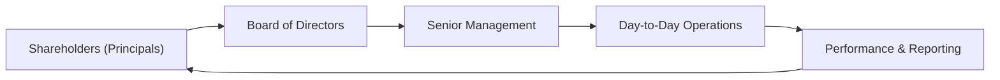

## 5.3 Corporate Governance: Conflicts, Mechanisms, Risks, and Benefits

Corporate governance often feels like that invisible framework that keeps a company on the straight and narrow (well, at least it tries to!). You might think of it as those guardrails on the side of a winding mountain road—without them, everything would be riskier, managers could do, um, pretty much whatever they liked, and investors might be left in the dark. In simplest terms, corporate governance is the set of rules, policies, and processes by which companies are directed and controlled. And yes, while that sounds a bit dry, it plays a massive role in shaping financial performance, investor confidence, and overall market integrity. Think about it this way: Good governance builds trust; poor governance destroys it.

Below, we’ll walk through the most important aspects of corporate governance: from the principal-agent relationship to the biggest conflicts, from the mechanisms that help mitigate these conflicts to the potential risks if governance goes sideways, and ultimately, the benefits of getting it all right. By the time we’re done, you should have a rock-solid grasp of why corporate governance is integral to long-term value creation and how it influences just about everything in a firm—from the composition of the board of directors to the paychecks of top executives.

---

### Understanding the Principal-Agent Relationship

At its core, corporate governance is about managing the relationship between those who own the company and those who run it. In fancy terms, it’s the “principal-agent relationship.” The principals are the shareholders (or owners), and the agents are the managers (including the CEO and the entire executive team) who act on the principals’ behalf.

• Shareholders: They contribute capital to the firm in exchange for ownership. But they usually can’t run the show on a day-to-day basis—especially in larger companies—so they hire managers.  
• Managers: In theory, managers are supposed to work in the best interests of the shareholders. However, humans are humans, and managers might make decisions that maximize their own utility (like awarding themselves lavish perks) rather than strictly looking out for the bottom line or shareholder value.

I remember chatting with a neighbor who was a mid-level manager at a large corporation. She said something like, “Well, I guess I do have a big expense budget, but that’s just how it is in my industry.” It turned out her expense budget was ballooning, and she admitted that at times she felt that the line between “entitlement” and “running the business” was, you know, a bit fuzzy. That’s precisely the dynamic we’re talking about here. Without proper governance, it’s pretty easy for personal interests to overshadow shareholder interests.

---

### Common Governance Conflicts

Conflicts arise when the motivations of management don’t line up with the objectives of shareholders. You see, managers might have short-term performance metrics at heart or be influenced by personal benefits (like job security or that gold-plated office furniture), while shareholders are (usually) looking for sustained, long-term growth.

• Management Entrenchment: This is where managers try to solidify their positions, making it difficult for outsiders (or even the board) to remove them. For example, managers might resist any operational changes—such as cost cuts or restructuring—that would threaten their personal benefits or status.  

• Expropriation of Minority Shareholders: Sometimes, controlling shareholders or top executives take advantage of their influence to benefit themselves at the expense of minority shareholders. This might be done through related-party transactions (e.g., awarding contracts to firms owned by friends or family) or by extracting higher compensation packages that are not in line with performance.

Imagine you own 2% of the shares while the controlling shareholder owns nearly 50%. You might feel powerless if that shareholder decides to transfer assets out of the company at a sweetheart deal to a related party. That scenario is the classic expropriation fear that minority holders often have.

---

### Corporate Governance Mechanisms

All right, so we have these potential conflicts. How do we keep the management bear from wandering into the shareholder picnic basket? The answer lies in corporate governance mechanisms—both inside and outside the firm. They are designed to align management’s incentives with those of the shareholders, or at least to keep management behavior in check. Some key ones include:

#### Board of Directors

The board of directors is like the bridge between shareholders and management. In theory, the board acts independently and in the best interests of all shareholders. For this to hold true, board members should (1) have a majority of independent directors—people who are not directly tied to the company—and (2) be both active and well-informed about the company’s operations.

If the board is dominated by insiders or friends of the CEO, you can guess what might happen: limited oversight and rubber-stamped decisions. An independent board, on the other hand, can question, challenge, and evaluate management’s decisions effectively.

#### Ownership Structure

Ownership structure matters a lot for governance. Large institutional investors—think pension funds, mutual funds, sovereign wealth funds—often have more muscle to push for transparency and accountability. They can demand better disclosures and influence board appointments. The fear of losing big investors can also encourage a company’s top management to stay aligned with broad shareholder interests.

#### Executive Compensation

If you’ve ever wondered why CEOs often receive stock options or restricted shares, it’s to align their financial interests with the company’s performance. The logic is that if an executive benefits from share price appreciation, they will work to improve long-term shareholder value. Of course, the devil is in the details: If compensation is poorly structured, managers might end up focusing only on short-term share price jumps.

Sometimes, performance-based metrics include measures like Earnings Per Share (EPS) growth, Return on Invested Capital (ROIC), or Economic Value Added (EVA®). The aim is to tie managerial reward to actual value creation. But compensation committees must be careful: tying pay too strongly to short-term results can lead to excessive risk-taking or earnings manipulation.

#### Market for Corporate Control

In a free market economy, if a company is underperforming, it becomes an attractive takeover target. This external threat—hostile takeovers, leveraged buyouts, mergers—can serve as a powerful motivator for managers to keep the firm profitable and efficient. No manager wants to lose their job or see their company get carved up by new owners. This fear can keep management on its toes, ensuring shareholder interests are prioritized.

---

### Distinguishing Between Internal and External Governance Mechanisms

We can separate governance mechanisms into two big buckets: internal and external. It’s kind of like having both an internal family meeting to solve issues and an external mediator if the family’s fight grows too intense.

#### Internal Governance Mechanisms

1. Board Oversight: As mentioned, the board is an internal gatekeeper.  
2. Internal Audits: These ensure financial reporting accuracy and compliance with internal controls.  
3. Senior Management Committees: Risk committees, ethics committees, or strategy committees can provide additional checks and balances within the firm.

#### External Governance Mechanisms

1. Regulations and Legal Frameworks: These include listing requirements, securities laws, and formal codes of conduct.  
2. Activist Investors: They can push for leadership changes, strategic overhauls, or better disclosure if they feel a company is underperforming or has governance issues.  
3. Competitive Market Pressures: The fear of losing customers, market share, or being taken over by another firm if performance slips.

Put simply, internal mechanisms are like rules set within the house, while external mechanisms come from the neighborhood—government, investors, or rivals.

---

### Risks of Poor Corporate Governance

Poor governance can be both a slow burn and a sudden meltdown. Think of examples like Enron, WorldCom, or other big-name scandals people cite in finance classes all the time. At first, everything might appear normal, but eventually, cracks in oversight and accountability create an environment ripe for:

• Fraud and Misreporting: If a board is asleep at the wheel, managers might fudge the numbers to meet performance targets or hide losses.  
• Value Destruction: Without accountability, managers can invest in pet projects, pay scant attention to project risks, or engage in nepotism. This invariably leads to a waste of resources.  
• High Cost of Capital: Investors tend to demand a higher return if they sense that the firm’s governance structures are weak, which can lead to higher costs for raising capital.  
• Legal and Regulatory Sanctions: Major governance failures often lead to lawsuits, fines, or even the dissolution of the firm.

I vividly recall noticing the difference in cost of capital for two companies in the same industry. One was known for strong governance, the other had rumors swirling about shady insider transactions. Unsurprisingly, the “shady” one had to pay higher interest rates on its bonds. The market, as always, priced in that governance risk.

---

### Benefits of Effective Corporate Governance

If you get governance right, you’ll see benefits that can profoundly shape both the company’s reputation and its bottom line—like a well-maintained engine that hums along without issues. Key advantages include:

• Enhanced Reputation: Investors, customers, and suppliers are far more comfortable dealing with a company that demonstrates strong oversight.  
• Reduced Agency Conflict: By aligning management’s interests with shareholders’, the overall friction is minimized, leading to better decision-making.  
• Stable Performance: Good governance often correlates with better risk management, more disciplined capital allocation, and sustainable financial performance.  
• Access to Capital: A well-governed company can typically obtain funding at lower costs because it’s perceived as lower risk.  
• Ethical and Strategic Decision-Making: Focused boards and transparent management teams tend to take the “long-game” approach, so decisions are made with a clear sense of accountability and ethics.

---

### Risk Mitigation Tools

Companies often develop formal—and informal—mechanisms to stave off governance breakdowns. A few fundamental tools include:

• Robust Internal Controls: An effective internal control system is crucial for accurate financial reporting and compliance. It includes checks and balances like segregation of duties, standard operating procedures, and regular internal audits.  
• Ethical Guidelines and Training: A code of ethics combined with continuous training can shape a healthy corporate culture, ensuring employees speak up when something looks amiss.  
• Transparent Compensation Policies: Openness about how executives are paid, including the metrics and vesting periods used, can reassure investors that pay and performance are properly linked.  
• Performance Reviews: Regular and systematic reviews not only for managerial staff but also for board members. This fosters accountability and improvement at every level of leadership.

---

### Shareholder Activism and Regulatory Oversight

Activist shareholders have gained a lot of attention in recent years, and for good reason. They aren’t just passive owners who read the annual report and go about their day. They can, and often do, demand changes to executive compensation, board composition, or strategic direction if they feel the company isn’t living up to its potential.

Regulatory bodies—like the SEC in the United States or similar agencies across the globe—mandate disclosures, set listing standards, and enforce rules around corporate governance. These bodies try to ensure that management remains accountable and that investors have access to transparent and timely information. When these regulators get involved, companies quickly realize that ignoring governance best practices comes with significant pitfalls.

---

### Corporate Governance Illustrated

Below is a simple diagram to visualize the general structure of a corporate governance system:

In this flow, shareholders appoint the board to represent their interests. The board sets overall strategy and supervises management, who in turn runs the company’s operations. Performance results and reporting then loop back to shareholders. Along the sides are governance mechanisms—both internal and external—to keep everyone honest and aligned with the firm’s long-term goals.

---

### Practical Perspectives and Case Study

Let’s consider a hypothetical scenario: BlueRock Manufacturing, a major industrial components producer, faces repeated proxy battles launched by a group of dissatisfied institutional investors. The activists argue that BlueRock’s CEO is overpaid, that compensation is too heavily tied to short-term revenue growth, and that the board doesn’t properly represent independent shareholder interests.

Through discussions (and frankly, a bit of conflict), the board agrees to appoint new independent directors with significant operations and finance backgrounds. The CEO’s compensation package is revamped, tying a larger portion of pay to long-term results like five-year average return on capital and sustainability targets. Soon after, the new board sets up a risk committee to monitor capital project proposals more thoroughly. Though it’s not an overnight transformation, over the following year BlueRock’s share price stabilizes, and the firm’s credit rating improves slightly as credit agencies see stronger oversight in place.

It’s a classic illustration of how external pressure (activist investors) can prompt internal governance changes (board composition, pay rework, risk oversight), which in turn can bolster a firm’s market value and stakeholder confidence.

---

### Glossary

• **Principal-Agent Relationship:** A structure in which one party (the principal, typically shareholders) delegates authority to another (the agent, typically management) to perform tasks on their behalf.  
• **Entrenchment:** When managers take actions—like adopting certain bylaws or resisting changes—that make it harder for others to remove or influence them, often at the expense of shareholders.  
• **Performance-Based Compensation:** Ties managerial rewards to specific performance metrics such as ROI, EPS growth, or EVA®, aiming to align manager interests with shareholders.  
• **Takeover Defense:** Strategies (like poison pills, golden parachutes, or staggered boards) designed to discourage or make hostile takeovers more difficult or expensive.  
• **Related-Party Transaction:** A business transaction between parties who have an existing relationship, such as family ties or ownership links, potentially creating conflicts of interest.  
• **Activist Investor:** A shareholder—often with a significant ownership stake—who seeks to influence a company’s strategy, structure, or leadership through direct engagement or proxy fights.  
• **Proxy Fight:** A battle to secure sufficient shareholder votes via proxy statements to influence board composition or major corporate decisions.  
• **Internal Control System:** Company-wide processes and procedures aimed at ensuring accurate financial reporting, regulatory compliance, and operational efficiency.

---

### References and Further Reading

• CFA Institute Level I Curriculum (Corporate Issuers).  
• Monks and Minow, “Corporate Governance.”  
• OECD Principles of Corporate Governance.  
• ICGN (International Corporate Governance Network) resources on best practices.

---

## Test Your Knowledge of Corporate Governance and Agency Conflicts



### Which best describes the principal-agent relationship in a corporation?

- [ ] A situation where managers continuously outperform shareholders.  
- [x] A setup in which shareholders (principals) hire managers (agents) to run the company on their behalf.  
- [ ] A legal arrangement in which creditors act on behalf of management.  
- [ ] A scenario where the government oversees daily operations of corporations.  

> **Explanation:** The principal-agent relationship refers to shareholders (principals) delegating authority to managers (agents) to run the firm. Management is expected to act in shareholders’ best interests.

### Which of the following is a common example of management entrenchment?

- [ ] Management offering early retirement packages to employees.  
- [x] Executives enacting bylaws that reduce board oversight or make it harder to replace them.  
- [ ] Minority shareholders voting for a special dividend.  
- [ ] A firm limiting the sale of its shares on secondary markets.  

> **Explanation:** Entrenchment happens when executives or the board take actions to solidify their positions, making it tougher for outsiders to remove or influence them.

### Which mechanism is considered an internal governance structure?

- [x] Board of directors monitoring management.  
- [ ] Regulatory inquiries by government agencies.  
- [ ] Hostile takeover attempts by competitors.  
- [ ] Public shareholder activism campaigns.  

> **Explanation:** The board of directors is an internal governance mechanism, while the others listed (regulatory oversight, hostile takeovers, shareholder activism) are external.

### What is a key benefit of performance-based compensation?

- [x] It helps align managerial incentives with shareholder interests.  
- [ ] It guarantees that the company’s stock price outperforms market benchmarks.  
- [ ] It eliminates the possibility of accounting fraud.  
- [ ] It allows managers to avoid regulatory oversight.  

> **Explanation:** Performance-based compensation can encourage managers to focus on boosting long-term shareholder value, thus reducing agency conflicts.

### Which of the following best characterizes expropriation of minority shareholders?

- [x] Controlling shareholders or managers transferring resources out of the firm for personal gain at the expense of smaller shareholders.  
- [ ] Management awarding performance bonuses to junior staff.  
- [x] Executives giving favorable contracts to related businesses.  
- [ ] Board members seeking input from all shareholders equally.  

> **Explanation:** Expropriation of minority shareholders often involves transferring resources (e.g., funds, contracts) to insiders or related parties, harming those without controlling power.

### How does a strong system of internal controls help a firm?

- [x] By increasing the reliability of financial reporting and ensuring compliance with laws.  
- [ ] By eliminating the need for a board of directors.  
- [ ] By guaranteeing a higher stock price.  
- [ ] By reducing product development timelines.  

> **Explanation:** Robust internal controls provide checks and balances to ensure accurate financial reporting and regulatory compliance, which supports good governance.

### What is a potential downside of poorly structured performance-based compensation?

- [x] Managers may take excessive short-term risks to inflate metrics.  
- [ ] Managers receive no pay unless they meet their targets.  
- [x] Managers are guaranteed to be replaced if they miss targets once.  
- [ ] Managers automatically align with long-term shareholder interests.  

> **Explanation:** If performance incentives are too focused on short-term gains, managers might cut corners or take unwarranted risks to boost immediate numbers, ignoring long-term impacts.

### Which of the following is an external governance mechanism?

- [x] Market for corporate control (hostile takeovers).  
- [ ] Internal risk committees formed by management.  
- [ ] Internal audits of operational efficiency.  
- [ ] Board’s oversight of managerial decisions.  

> **Explanation:** The market for corporate control (including hostile takeovers) is an external mechanism that can force underperforming management teams to align with shareholder value or risk being replaced.

### Why do investors often demand a higher return from companies with poor corporate governance?

- [x] To compensate for the increased risk of misreporting or capital misallocation.  
- [ ] Because management is more ethical, requiring higher pay.  
- [ ] Due to stable and predictable cash flows.  
- [ ] Because auditors demand more compensation.  

> **Explanation:** Companies with weak governance present higher risks (fraud, mismanagement), so investors require higher returns to offset these uncertainties.

### A “proxy fight” is:

- [x] True  
- [ ] False  

> **Explanation:** In a proxy fight, an opposing group solicits shareholder votes to replace board members or to effect specific corporate policy changes, often regarding governance issues.


