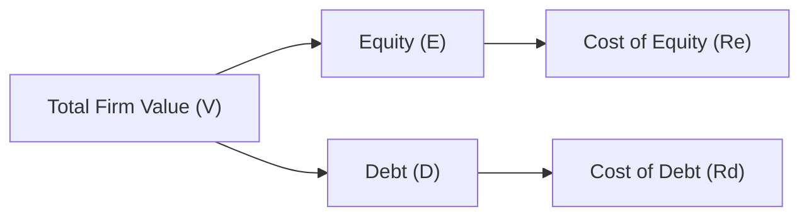

## 5.6 Capital Structure

It’s funny how the idea of “capital structure” could seem so intimidating the first time you hear it—like some technical wizardry that only big-time CFOs understand. But, in essence, we’re just figuring out how much debt and equity a company uses to finance its operations, and why that mix might matter. I once had a friend who started a small food truck business. His struggle was about how much money he should borrow from the bank (debt) versus how much he should gather from personal savings and outside investors (equity). The more he borrowed, the more pressure he felt—um, you know, monthly principal and interest payments are no joke—but the less of the business he had to give away in exchange for financing. It’s a pretty universal dilemma, from mom-and-pop shops to giant corporations. That’s basically the essence of capital structure decisions.

Below, we’ll dive into many nuances of capital structure that matter for corporate finance. We’ll talk about Weighted-Average Cost of Capital (WACC), the factors that shape capital structure decisions, theories like Modigliani–Miller and the trade-off theory, signaling, and a bunch of practical angles that CFOs (and business owners in general) constantly juggle. So let’s get started.

### Weighted-Average Cost of Capital (WACC)

Let’s begin with a fundamental concept: the Weighted-Average Cost of Capital, or WACC. WACC is often described as the “hurdle rate” a firm must exceed to create value. In other words, if your projects aren’t generating returns above your WACC, you’re not increasing shareholder wealth. (And that’s usually bad news.)

Mathematically, we describe WACC as:


\text{WACC} = \left(\frac{E}{V}\right)R_{e} + \left(\frac{D}{V}\right)R_{d}(1 - \text{Tax Rate})


Where:
• \\(E\\) = market value of equity  
• \\(D\\) = market value of debt  
• \\(V = E + D\\)  
• \\(R_e\\) = cost of equity (the return equity investors “demand”)  
• \\(R_d\\) = cost of debt (the yield lenders require for the firm’s bonds or loans)  
• \\(1 - \text{Tax Rate}\\) accounts for the fact that interest on debt is often tax-deductible  

This formula basically says: “Take the fraction of the firm financed by equity (E/V), multiply by the cost of equity (Re), then add the fraction financed by debt (D/V), multiply by the cost of debt (Rd), and adjust for the tax benefit.” The result is the overall required rate of return that reflects the cost of tapping both equity and debt markets.  

Many everyday business decisions revolve around whether an expected project return beats the WACC. If the project’s return is higher than WACC, it presumably adds value. If it’s lower, managers fret about whether the best choice is to reject the project altogether.

### Factors Affecting WACC and Capital Structure

But, well, how do firms decide on their blend of debt and equity in the first place? Why not just add more debt so the equity portion gets a higher return? It’s not that simple.

• Interest Rates and Market Conditions:  
  When interest rates are relatively low, issuing debt may be cheaper than raising equity. Conversely, in a high-rate environment, interest costs can skyrocket. Also, if equity markets are hot and valuations are robust, it might be advantageous to issue shares instead of taking on too much debt.

• Business Risk:  
  Firms with erratic or volatile revenue streams typically can’t load up on too much debt. If a big chunk of your cash flows is promised to lenders, you risk not being able to meet obligations during a downturn. If your business is super stable—like a regulated utility—then you can handle more debt.

• Tax Rates:  
  Because interest paid on debt is often tax-deductible in many jurisdictions, higher corporate tax rates magnify the benefits of financing with debt (creating what we call a “tax shield”). So sometimes, you’ll see firms in high-tax environments adopt more leverage than firms in lower-tax environments.

• Asset Structure:  
  Firms with lots of tangible assets—think real estate or heavy equipment—often can borrow more because they have collateral to pledge against loans. Tech startups with intangible assets (like software or brand value) usually find that lenders charge a higher interest rate or require stricter covenants, since there’s less collateral to seize if things go south.

Below is a simple diagram illustrating the interplay between major capital components and the firm’s overall valuation:

As the diagram suggests, the business decides how to slice total value (V) between equity (E) and debt (D). Each portion has its own expected return, and the overall cost to the firm is the weighted average of those returns—WACC.

### Modigliani–Miller Propositions

In the late 1950s and early 1960s, economists Franco Modigliani and Merton Miller published seminal work on capital structure. Their theories, known as the Modigliani–Miller (M–M) propositions, form the foundation of modern corporate finance. Let me just say, if you ever crack open these papers, they can be quite dense, but the big ideas are actually quite intuitive.

• Proposition I (Without Taxes):  
  The original proposition states that in an ideal world (with no taxes, no bankruptcy costs, and perfect information), capital structure does not affect the firm’s value. So if you have 50% debt or 10% debt or 90% debt, the total value is the same. It’s like rearranging slices of pizza—it’s still the same pizza.

• Proposition II (Without Taxes):  
  While the overall value doesn’t change (under those unrealistic conditions), the cost of equity skyrockets as you add more debt, because equity holders bear more risk. So even though you might be tempting to borrow cheaply, the higher financial leverage means your shareholders expect a higher return to compensate for that risk.

• Extensions (With Taxes):  
  Once you consider taxes, M–M recognized that debt can create interest tax shields, increasing the firm’s total value. Essentially, each dollar of interest you pay reduces taxable income, so more debt can lead to higher after-tax cash flow, in principle. That’s where the famous statement “taxes make debt financing more favorable” arises.

Shell out the taxes from the equation, and the advantage from the interest deduction disappears. That’s why the real world sees actual “optimal” capital structures that weigh these tax benefits against the costs of higher leverage.

### Optimal Capital Structure

Now, is there a single “optimal” capital structure that every firm should follow, say 30% debt and 70% equity? Eh...not exactly. Each firm’s unique business risk, industry, and growth prospects shape its capital structure. But the general principle is to find that debt-to-equity ratio that balances tax benefits of debt with costs of financial distress.

Picture a continuum:  
• Very low debt: The firm doesn’t fully enjoy the tax benefits but keeps financial risk minimal.  
• Very high debt: The firm gets a big tax shield but risks failing to meet interest payments if a downturn hits.  

At some point in between, the value of the firm is maximized (or the WACC is minimized—that’s two sides of the same coin).

### Target Capital Structure

Many firms establish a “target capital structure,” like aiming for 40% debt and 60% equity. They might deviate slightly based on market conditions or big acquisitions, but they typically try to hover around that target in order to maintain a certain credit rating and meet investor expectations. For instance, I once chatted with a CFO who said, “We want to stay solidly in investment-grade territory, so we’ll keep our net debt-to-EBITDA ratio under 2.5x.” That numerical self-imposed ceiling basically sets the boundaries for how much more debt they can safely take on.

When a firm drifts too far from its target, management may:
- Issue new equity (to reduce debt ratio).  
- Repurchase shares (to increase the debt ratio or reduce total equity).  
- Refinance or repay debt (to shift the balance between debt and equity).  

Wine producers, for example, are known to have cyclical harvest cycles. If there’s a big revenue shortfall in one year, they might scale back leverage. Then in a banner year, reexamine. Many cyclical industries follow a fairly dynamic approach to keep the structure near a target range.

### Trade-Off Theory

Nodding back to M–M: in the real world, we can’t ignore the possibility of bankruptcy costs and other frictions. The trade-off theory says the optimal debt level is reached when the marginal benefit of the tax shield on additional debt equals the marginal cost of financial distress.

• Tax Shield Benefits:  
  Each additional dollar of interest can be deducted—so your tax bill is lower, boosting the firm’s value.  

• Costs of Financial Distress:  
  If you’re teetering on the edge of default, you might face higher interest rates on new borrowing, stricter covenants, or reputational damage, which can hamper operations. At some extreme, bankruptcy costs (including lawyers, liquidation at fire-sale prices, lost customer confidence) can be enormous.

So the trade-off theory tries to pin down that sweet spot. Take advantage of cheap debt up to the point where the next chunk of debt is about to push you into a zone of significantly higher distress risk.

### Signaling Theory

Now let’s talk about signaling. Financing decisions send signals to the market—sometimes intentionally, sometimes not. If a firm announces a new equity offering, the market might interpret that as a signal that management thinks the shares are overvalued. (“Why else would they issue more shares now?”) That can depress the stock price. Conversely, if a firm announces a new debt issue, investors might see that as management’s confidence in stable future cash flows—indicating less fear around paying fixed interest obligations.

It’s kind of like if you see a friend suddenly taking out a big mortgage: you might guess they’re pretty confident they’ll have stable income. If they’re instead raising money by selling personal assets, maybe they’re not so confident about their future cash flows. The logic in corporate finance can be similar.

### Practical Considerations in Capital Structure Decisions

All these theories are nice in the classroom, but in practice, CFOs weigh a variety of messy real-world factors:

• Maintaining Flexibility:  
  Firms want the capacity to issue new debt in the future or handle emergencies. If you’re at your max leverage already, you won’t have that cushion.

• Managing Credit Ratings:  
  A downgrade can spike interest costs. So if sliding from investment-grade to speculative-grade means a big jump in borrowing costs, that can be, well, quite painful.

• Minimizing Dilution of Control:  
  Some family-owned or closely held businesses avoid issuing equity to outsiders so they can keep control. Debt is often seen as a way to retain ownership.

• Industry Norms:  
  In certain industries—like highly cyclical or rapidly evolving markets—firms tend to rely more on equity to buffer the ups and downs. In stable sectors, debt might be more common.

• Market Timing:  
  Sometimes managers are opportunistic. If the firm’s share price is riding high, they might prefer equity issuance because it means less dilution for the same raise. If bond markets are particularly friendly, they might pivot to debt.

• Pecking Order Theory:  
  CFOs typically prefer to use internal funds (like retained earnings) first—because you don’t have to pay interest or give up part of the business. If that’s not enough, they’ll issue debt (it’s cheaper than equity, from a cost standpoint). Only when those two options are exhausted or undesirable do they issue new shares. This order of preference is the so-called pecking order. It’s partly rational (minimize cost) and partly about avoiding negative signals.

### Real-World Example

Let’s take a hypothetical case study. Suppose there’s a fast-growing tech startup called RoboGro, specializing in agricultural drones. RoboGro has intangible, hard-to-value assets (like intellectual property and software). Because it’s in a rapidly evolving market, the company might rely more heavily on equity. Indeed, lenders may be wary about providing large loans, or they might demand high interest rates. RoboGro might say, “All right, we’ll do a Series B equity round,” accepting some ownership dilution but preserving flexibility until they become profitable and have stable cash flows to handle debt.

On the other hand, consider a mature manufacturing company—SteelMakers Inc.—with established plants, equipment, and steady, predictable sales. They have a stable client base, minimal default risk, and lots of collateral. SteelMakers might rely on debt financing to leverage those stable cash flows, enjoying tax advantages along the way. They may set a target capital structure of, let’s say, 50% debt and 50% equity, maintaining an investment-grade rating that keeps medium-term borrowing rates attractively low.

### Common Pitfalls and Challenges

• Over-Leveraging:  
  Overestimating stable cash flows is a major trap. If a downturn hits or sales unexpectedly drop, the firm can be stuck with unsustainable debt obligations.

• Market Volatility:  
  Fluctuating interest rates and equity valuations can wreak havoc on carefully planned structures.

• Missing the Tax Nuance:  
  Setting up high debt in a country with minimal tax benefits might not be so advantageous. On the other hand, a multinational firm might exploit differences in tax laws across regions.

• Ignoring Agency Costs:  
  Sometimes, managers have incentives that conflict with shareholders or debt holders. They might take on riskier projects than lenders anticipate because the upside goes mostly to equity, while the downside risk is shared with creditors. Or, conversely, managers might behave too conservatively if they fear personal repercussions of distress.

• Underestimating Bankruptcy Costs:  
  Bankruptcy can be extremely expensive (legally and reputationally). If these costs are underplayed in planning, the firm’s real cost of capital calculations become distorted.

### Best Practices and Strategies to Overcome Issues

• Frequent Reassessment:  
  The “optimal” mix for the firm may shift as interest rates, tax laws, or the competitive environment change. So keep an eye out. Annual or quarterly reevaluations are common.

• Scenario Analysis:  
  CFOs and finance teams often run stress tests to see how results hold up if sales drop by 20% or interest rates bump up by 2%. Doing so can highlight the “danger zones” for your capital structure.

• Clear Communication with Stakeholders:  
  Consistent messages about debt or equity issuance can mitigate negative signals. If you explain your reasons, perhaps the market won’t jump to negative conclusions.

• Diversify Financing Sources:  
  Don’t rely on just one bank or one type of debt issuance. Spreading out maturities and sources of capital can reduce refinancing risk.

### Glossary

• Leverage:  
  The use of debt financing to amplify both returns and risk. The more debt you employ, the greater your potential upside (and downside).

• Financial Distress:  
  A situation where a firm struggles to meet debt obligations, possibly leading to default or bankruptcy.

• Tax Shield:  
  The reduction in taxable profits due to interest expense deductions. A classic advantage of financing with debt.

• Optimal Capital Structure:  
  The mix of debt and equity that minimizes WACC and maximizes the firm’s value.

• Pecking Order Theory:  
  The idea that firms prioritize financing sources in a specific order: internal funds, then debt, and finally equity as a last resort.

• Bankruptcy Costs:  
  The direct and indirect costs that arise when a firm becomes insolvent, including legal fees, fire-sale asset prices, and lost market confidence.

• Cost of Equity (Re):  
  The required rate of return expected by equity investors in exchange for providing capital.

• Cost of Debt (Rd):  
  The yield or interest rate a firm must offer debt holders, usually related to credit risk, prevailing interest rates, and the firm’s financial health.

### Conclusion

Capital structure is as much an art as a science. You’ve got your theoretical frameworks—Modigliani–Miller, trade-off theory, signaling, pecking order—offering guiding principles. But the “right” structure depends on the industry, the firm’s stage of growth, the volatility of its cash flows, the tax environment, and the preferences of managers and shareholders. Finding and maintaining an optimal structure is an ongoing balancing act, shaped by day-to-day business cycles, strategic priorities, and market sentiment.

Ultimately, no matter how you slice it, the central question remains: How do we fund the firm’s operations and growth in a way that maximizes value over the long haul while keeping an eye on risk? That’s the capital structure puzzle—one that CFOs will keep wrestling with in perpetuity.

### References and Further Reading

• CFA Institute Level I Curriculum (Corporate Issuers)  
• Modigliani, F. and Miller, M., “The Cost of Capital, Corporation Finance, and the Theory of Investment.”  
• “Principles of Managerial Finance” by Gitman (chapters on capital structure)  

------

## Capital Structure Mastery Quiz



### Which of the following best describes the Weighted-Average Cost of Capital (WACC)?

- [ ] The cost of acquiring additional tangible assets.  
- [x] The firm’s overall required rate of return, combining debt and equity costs.  
- [ ] The measure of financial distress costs relative to equity market capitalization.  
- [ ] A purely theoretical concept with no real application.  

> **Explanation:** WACC weighs the cost of equity and the after-tax cost of debt to determine the required return for the entire firm.

### Which factor typically lowers a company’s effective cost of debt?

- [ ] Low business risk.  
- [ ] High business risk.  
- [x] The tax deductibility of interest.  
- [ ] A limiting covenant imposed by lenders.  

> **Explanation:** The tax deduction on interest payments reduces the effective cost of debt.

### According to Modigliani–Miller Proposition I without taxes, the value of a firm is:

- [x] Unaffected by its capital structure.  
- [ ] Directly proportional to equity only.  
- [ ] Inversely proportional to debt.  
- [ ] Affected only by high levels of leverage.  

> **Explanation:** Without taxes or other frictions, Modigliani–Miller posits that capital structure is irrelevant to firm value.

### A firm with a high degree of operating volatility is likely to:

- [ ] Take on as much debt as possible to magnify returns.  
- [ ] Avoid internal financing in favor of equity.  
- [x] Use less debt to reduce the risk of financial distress.  
- [ ] Have a higher cost of equity but no effect on debt usage.  

> **Explanation:** Firms with volatile cash flows generally avoid high leverage to minimize default risk.

### A “target capital structure” primarily helps a company:

- [ ] Eliminate all risk of default.  
- [ ] Ensure tax exemptions for interest payments.  
- [ ] Fix the firm’s WACC forever.  
- [x] Manage leverage levels aligned with credit rating and investor expectations.  

> **Explanation:** Maintaining a target range helps ensure stable credit ratings and aligns with long-term strategic goals.

### When a company issues equity rather than debt, one potential market signal is:

- [x] Management believes the stock is overvalued.  
- [ ] Management expects a decrease in cash flows.  
- [ ] The company no longer cares about tax benefits.  
- [ ] The firm’s existing shareholders will increase their ownership.  

> **Explanation:** An equity issuance sometimes signals that shares may be trading above their “intrinsic” value, though real motives can vary.

### Under the trade-off theory of capital structure, a key advantage of debt is:

- [ ] It has no impact on a firm’s taxes.  
- [x] It provides a tax shield from interest expenses.  
- [ ] It avoids any potential costs of financial distress.  
- [ ] It is entirely risk-free if the firm has tangible assets.  

> **Explanation:** The trade-off theory highlights debt’s tax benefits, which must be balanced against financial distress costs.

### Which statement about pecking order theory is most accurate?

- [ ] Firms prefer equity to debt because equity is cheaper.  
- [ ] Firms prioritize large-scale external debt over retained earnings.  
- [x] Firms tend to use internal funds first, then debt, and issue equity last.  
- [ ] It claims there is always a single optimal debt-to-equity ratio.  

> **Explanation:** Pecking order theory states that firms rely on retained earnings first, followed by debt, and issue equity only as a final option.

### If a firm has large amounts of tangible collateral, it is more likely to:

- [x] Issue debt at a lower cost.  
- [ ] Issue equity to finance projects.  
- [ ] Pay no taxes on interest expense.  
- [ ] Communicate market undervaluation.  

> **Explanation:** Tangible collateral reduces lender risk, making it easier and cheaper for the firm to attach debt financing.

### In signaling theory, a decision by a firm to issue new debt (instead of equity) may suggest that:

- [x] Management is confident in stable future cash flows.  
- [ ] Management is unsure of the firm’s true value.  
- [ ] The firm’s stock price is about to drop significantly.  
- [ ] The firm permanently avoids tax benefits.  

> **Explanation:** Issuing debt commonly signals that the firm anticipates having consistent cash flow to service it, reflecting management confidence.


