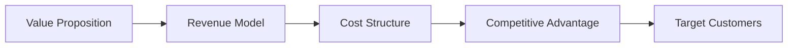
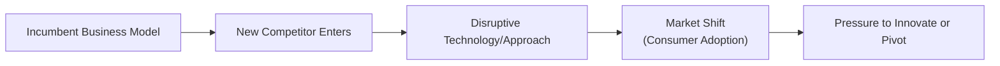
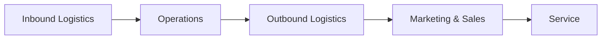

## 5.7 Business Models

Have you ever looked at two companies in roughly the same market and wondered: “Why are they making money so differently?” One might be generating revenue from a subscription, while the other relies on one-time product sales or licensing fees. That difference in approach — the plan for how a company creates, delivers, and captures value — is called a business model. Let’s stroll through how different models work, why they matter, and how you can evaluate them.

Many years ago, I remember being surprised at the success of an online streaming service that used a subscription model instead of retail sales. I thought, “Well, how on earth can they turn a profit by letting me watch so many shows for a small monthly fee?” Over time, I realized they’d perfected an approach that continuously attracts new subscribers while retaining existing ones, thanks to compelling content and ease of use. This is exactly what studying business models can help you understand — the logic behind how firms make money, scale, innovate, and remain competitive.

Below, we’ll break down key elements of business models, highlight common types, and walk through considerations for sustainability, revenue drivers, operational challenges, and more. Think of this as a friendly conversation rather than a purely academic lesson; I’ll share small anecdotes where it feels right, and hey, maybe you’ll discover a new perspective to use at work or in your own ventures.

---

### The Fundamentals of a Business Model

A business model is basically a blueprint for how an organization brings value to its customers and then captures some of that value as profit. It explains:  
• Who the target customers are.  
• What products or services are offered.  
• How revenues and costs flow in the organization.  
• Which partnerships or resources are essential.  
• Why this model might hold up better than alternatives in the market.

The essence? You need to deliver something people want at a certain price, keep your own costs under control, and do so in a way that’s different enough or strong enough that competitors can’t easily replicate and steal your lunch. It’s sort of like building a house: a great blueprint saves time, money, and headaches in the long run.

---

### Key Features of Business Models

There are a few core building blocks common to virtually every business model. Let’s talk about them briefly.

• Value Proposition: This is the heart of your model. The value proposition pinpoints the unique product or service that you offer. Maybe you’re a tech giant providing cloud solutions, or a fashion retailer offering trendy apparel at low prices. The big question is, “Why should customers choose you over someone else?”

• Revenue Model: Consider Netflix: They charge a monthly subscription. Apple might sell hardware devices for a profit margin plus take a cut of app sales. A clothing brand may bring in revenue based on per-item retail sales. The revenue model outlines the mechanics of how you make money, whether from subscriptions, markups, transaction fees, licensing, advertising, or something else.

• Cost Structure: Are your expenses mostly fixed, like rent and salaried labor, or primarily variable, such as materials or transaction fees that scale with sales? A fast-food chain with high-volume sales might rely on economies of scale to lower costs, while a consulting firm may have primarily variable labor costs that match the number of consulting hours sold. Understanding your cost structure is crucial for figuring out how profits change with sales volume.

• Competitive Advantage: You know how some businesses seem to stand out no matter how crowded the market is? They might have a brand legacy, proprietary technology (like an advanced algorithm), or maybe unique partnerships that give them exclusive access to something valuable (like licensed comic book characters). Whatever it is, that’s usually their core advantage, and it needs to be clearly defined in the model.

Below is an illustrative Mermaid diagram showing how the regions of a business model connect:

In practice, these elements interrelate: the value proposition determines how you’ll communicate and deliver your product, which influences your cost structure, which then ties into your potential revenue and profit. And if you have a strong competitive advantage, it can help you secure and retain those target customers.

---

### Types of Business Models

Business models can be classified in many ways, but let’s look at a few that often come up in Corporate Issuers:

• Manufacturing: Converting raw materials into finished goods. A car manufacturer sources steel, engines, and various components to assemble vehicles sold to dealerships or directly to consumers. Margin often hinges on volume, manufacturing efficiency, and supply chain management.

• Retail/Wholesale: Buying goods in bulk from producers and selling them at a mark-up to end consumers. Think supermarkets, department stores, or e-commerce sites. With online platforms, the distinction between retail and wholesale can blur because retailers sometimes use a “drop-shipping” model.

• Service-Based: Providing intangible services, such as consulting, software-as-a-service (SaaS), or hospitality. A personal anecdote: I witnessed a small consulting startup flourish by offering specialized analytics services, charging clients on a project basis. They had minimal overhead and a talented core team, which made it easier to break even.

• Platform/Marketplace: Connecting buyers and sellers, like eBay, Etsy, or Airbnb. The platform charges a fee or a percentage of each transaction. Network effects can make these models especially powerful — more users attract more sellers, which in turn attracts more users, and so on.

• Subscription/Membership: Collecting recurring fees for continuous access. Everything from streaming services to gyms might charge you monthly or annually. This model depends heavily on customer retention, because losing a subscriber can significantly reduce lifetime value (LTV).

• Franchise Models: Local operators buy rights to use a larger brand’s processes and trademarks. The parent company collects franchise fees or royalties, and the franchisee sells that brand’s goods or services. Think of fast-food chains, hotels, and convenience stores. Franchising can help a parent company expand rapidly without taking on as much overhead.

---

### Evaluating Business Model Sustainability

It’s one thing to launch a new company with a shiny idea; it’s another to sustain it. Let’s explore the factors that can drive or hinder long-term success:

• Customer Acquisition and Retention Costs: Many platform-based and subscription services live or die by their ability to attract and hold on to users. If it costs $100 to acquire a new subscriber (marketing, promotional offers) but a typical subscriber generates only $80 in lifetime revenue, your model is unsustainable. Um, that’s a problem.

• Switching Costs: These are the real or perceived costs a customer faces when changing from your offering to a competitor’s. If you accumulate detailed usage data on your platform, and that data is critical to a client’s operational needs, they may be reluctant to switch. High switching costs might create a sort of “stickiness” that sustains your model.

• Scalability and Network Effects: A scalable model can grow output or service capacity quickly without incurring proportional cost increases. Cloud computing services, for instance, can ramp up capacity with less friction than a traditional manufacturer. Meanwhile, network effects mean each new user increases the overall value of the network — typical in social media or online marketplaces.

Sometimes, though, scaling can be quite tricky. A business offering a physical product might face capital constraints, supply chain bottlenecks, or staff shortages. Growth is wonderful, but if it’s not planned well, it can lead to meltdown. “We grew so fast that we literally couldn’t replenish our inventory,” a friend of mine once said ruefully. That’s the flipside of a success story.

---

### Revenue Drivers and Key Metrics

Business model performance often hinges on a handful of metrics — let’s spotlight a few common ones:

• Average Revenue per User (ARPU): Often used in tech and telecommunications. Formally, 
  
    \text{ARPU} = \frac{\text{Total Revenue}}{\text{Total Number of Users}}.
  
  Monitoring changes in ARPU can reveal pricing power or the impact of upselling/cross-selling strategies.

• Churn Rate: Usually the number (or percentage) of customers who leave a subscription service in a given period. High churn is bad news. It means you’re losing clients faster than you can acquire them.

• Sales Growth: Straightforward but essential. High growth could indicate product-market fit or strong marketing, but it might also be influenced by macroeconomic factors.

• Market Share: Tells you what fraction of the total market you command. While not always the sole indicator of success, having a growing market share might be a sign your model is resonating with consumers.

• Pricing Strategies: Premium, freemium, dynamic pricing, and bundling can all dramatically impact per-user revenue. If you’re a streaming platform, offering a “freemium” version with ads might expand users quickly, but you have to ensure folks eventually upgrade to premium or you’ll never recoup your costs.

Below is a short example table showing some potential metrics for a hypothetical subscription-based video game platform:

| Metric               | Definition                                           | Target/Goal                      |
|----------------------|------------------------------------------------------|----------------------------------|
| ARPU                 | Revenue / Total Users                                | Increasing at least 5% YoY       |
| Churn Rate           | Cancellations / Total Users                          | Under 5% monthly                 |
| Customer Lifetime Value (CLV) | ARPU × Average Subscription Duration       | Exceeding acquisition cost by 2x |
| Marketing Cost per User (CPU) | Marketing Budget / New Subscribers         | Under $20                        |

---

### Operational Considerations

Depending on your industry, the operational aspects of your business model can differ wildly. Still, there are some universal concerns:

• Supply Chain Efficiency: Manufacturers and retailers live and die by an efficient supply chain. If you recall major retail chains that run out of hot products during the holiday season, you’ll see how crippling inefficiency can be.

• Scaling Challenges: It’s not just about having enough cash to buy more inventory; maybe you need to hire specialized experts, or invest in advanced software to handle more users. Service-based organizations might face a shortage of skilled labor, while product-based ventures might need more factory lines.

• Partnerships and Alliances: Sometimes you can’t do it all alone. Technology firms might rely on major cloud providers, or boutique retailers might partner with popular brand influencers. Partnerships can give you a distribution channel or a co-marketing advantage. On the flip side, they can also introduce dependencies and risks.

---

### Competition, Disruption, and Innovation

Markets change quickly, and business models that look invincible can become obsolete if they don’t adapt. That’s basically what happened to DVD rental stores when online streaming emerged.

• Technology-Based Disruptions: Think about how Amazon disrupted booksellers and then every other corner of retail. Or how digital streaming services have disrupted cable companies by offering on-demand content. Keeping an eye on new technologies is critical.

• Ongoing Innovation: Remember when big phone manufacturers would release a new model only once every couple of years? Now it feels like every six months. Continuous innovation is often necessary to stay ahead. By the time your competitors catch up to your old advantage, you want to have something even better.

A simple representation of a disruptive cycle might look like this:

---

### Linking Business Model to Financial Performance

Ultimately, a business model should drive healthy financial results. Some folks look at the profit margin, return on invested capital (ROIC), and the ratio of operating cash flow to net income to see if the model is truly profitable or just propped up by short-term hype.

• Profit Margins: High margins might come from unique pricing power, low-cost structures, or brand premiums. If margins start to slip, it might signal rising costs or eroding competitive advantage.

• Capital Intensity: Manufacturers and certain service providers might burn a lot of money on equipment or technology. If the return on that investment isn’t high enough (or your business environment changes), you might struggle to recover costs.

• Business Model Pivot Risks: Sometimes shifting from one revenue structure to another can alienate existing customers or trigger a spike in operational complexity. Imagine a company that moves from one-time software licensing to a cloud subscription model. That can be profitable in the long run, but the transition may cause short-term revenue dips, uncertain user adoption, or complicated accounting changes.

---

### Additional Mermaid Diagram for Value Chain

In many businesses, the value chain can be a critical element to understand, especially in a manufacturing or retail context. You can visualize the major steps and see where costs and bottlenecks might occur:

But keep in mind, pure service or digital models might have a different set of steps, often with significant emphasis on platform development, user acquisition, community management, and cloud infrastructure. The principle remains the same: each step of your value chain needs to add value or help you deliver that value more efficiently.

---

### Best Practices, Common Pitfalls, and Strategies to Overcome Them

• Best Practice: Continual Market Feedback — Always gather data on customers, their needs, and their usage patterns. That could mean user surveys, analytics dashboards, or direct interviews. Data-driven insights often guide more successful pivots or expansions.

• Common Pitfall: Underestimating the Competition — You’ve probably seen businesses that soared, got complacent, then were blindsided by smaller, hungrier rivals. Don’t let early success lull you into ignoring new entrants.

• Strategy to Overcome: Benchmarking — Compare your KPIs to industry best practices. If your churn rate is double the industry average, investigate why. If your ARPU is lower, check your pricing or value proposition. Keeping an eye on external benchmarks helps you avoid stagnation.

• Common Pitfall: Overcomplicating the Offering — Sometimes businesses add so many features that potential customers get overwhelmed or the product becomes too expensive. Keep the offering simple enough to attract a core user segment, then expand as needed.

• Strategy to Overcome: Minimum Viable Product (MVP) Approach — In technology, it’s often emphasized: launch the simplest version that provides value, then refine based on user feedback. This approach can reduce wasted resources.

• Best Practice: Have a Clear Differentiation — If you don’t stand out, you can’t command loyalty or premium prices. Whether your differentiator is brand authenticity, superior engineering, or a unique revenue model, it must be recognized by consumers and tough to replicate.

---

### Glossary

• **Business Model:** A systematic approach describing how a firm creates and profits from delivering value to customers.  
• **Scalability:** The capacity to increase output or service volume without proportionately increasing costs.  
• **Network Effect:** The increase in value of a product or service as the number of users expands.  
• **Value Chain:** The full range of activities needed to create a product or service, from design and sourcing through distribution.  
• **Churn Rate:** The rate at which customers drop a subscription or product usage over a specified period.  
• **Freemium:** A pricing approach that gives basic offerings for free, while charging for advanced features.  
• **Pivot:** A significant strategic shift in a firm’s core market, product, or revenue strategy.  
• **Benchmarking:** Comparing performance measures, strategies, and practices against peers or industry leaders.

---

### References and Further Reading

• CFA Institute Level I Curriculum (Corporate Issuers).  
• Osterwalder and Pigneur, “Business Model Generation.”  
• Harvard Business Review articles on disruptive innovation (Clayton Christensen).  
• “Competitive Strategy” by Michael Porter (offers frameworks for value chain analysis and strategic positioning).

---

It’s interesting how in some ways a business model might look downright simple: “Buy product A, sell it for higher price B.” But the deeper you go, the more you realize it’s a multi-layered puzzle requiring a consistent approach, a well-managed cost structure, and a knack for turning fleeting consumer interest into lasting profitability. By analyzing the building blocks, keeping an eye on metrics like ARPU and churn, and staying ready to innovate, companies can maintain an edge in ever-shifting markets. Hopefully, these insights feel like a friendly conversation about what really keeps a business going.

Now let’s wrap up with a quick quiz to check your understanding of business models and ensure you feel confident about these core ideas.

## Test Your Knowledge: Business Model Essentials Quiz



### Which element best describes how a firm creates unique value for its customers?

- [ ] Cost Structure
- [ ] Revenue Model
- [x] Value Proposition
- [ ] Competitive Advantage

> **Explanation:** The value proposition states how a firm's product or service is uniquely valuable to customers. It answers “What’s in it for the customer?”

### A streaming platform notices its churn rate is 8% each month. Why might this be problematic?

- [ ] High churn leads to higher average revenue per user.
- [x] It implies many users are leaving, reducing long-term subscription revenue.
- [ ] It can decrease customer acquisition costs.
- [ ] It indicates strong network effects.

> **Explanation:** A high churn rate means the platform is losing many users quickly, which can damage recurring revenue and weaken the overall sustainability of the business model.

### Which of the following is a key characteristic of a platform/marketplace business model?

- [x] It connects buyers and sellers, taking a fee or percentage of each transaction.
- [ ] It offers intangible services and bills on a per-hour or per-project basis.
- [ ] It franchises its brand and procedures to third-party operators.
- [ ] It manufactures raw materials into finished goods for sale.

> **Explanation:** Platform or marketplace models focus on bringing together two (or more) sides of a transaction, benefitting from network effects and transaction-based revenue.

### What is one primary advantage of a freemium revenue strategy?

- [ ] It immediately maximizes profit margins.
- [x] It attracts a large user base quickly, with the potential to upsell premium features.
- [ ] It eliminates the possibility of churn.
- [ ] It relies on high switching costs for customer retention.

> **Explanation:** Freemium models can rapidly grow the number of users; a subset of these users then convert to paying subscribers for premium features, often leading to a profitable customer base over time.

### How do switching costs support the sustainability of a business model?

- [ ] By completely removing competition.
- [ ] By eliminating sunk costs for the customer.
- [ ] By guaranteeing profit margins remain high.
- [x] By making it more difficult or costly for the customer to leave.

> **Explanation:** High switching costs discourage customers from dropping your service, as migrating to a competitor might entail data migration, time, effort, or financial penalties.

### What happens when a business grows in a scalable manner?

- [x] Output or user volume increases faster than operational costs.
- [ ] Marginal costs remain constant while revenue falls.
- [ ] Profits immediately double.
- [ ] The organization does not require more technology resources or labor.

> **Explanation:** Scalability means the business can handle growth with disproportionately lower increases in costs, creating efficiency gains and potentially larger profit margins.

### Which of the following metrics is often used to measure the financial value generated by each user?

- [ ] Churn Rate
- [ ] Market Share
- [x] ARPU
- [ ] Cost of Goods Sold

> **Explanation:** ARPU (Average Revenue per User) tracks how much revenue is generated on average for each user. It is a vital metric in subscription-based or user-based models.

### In which scenario might a company consider a pivot in its business model?

- [x] When it identifies a new revenue strategy that aligns better with market needs.
- [ ] When it has the highest market share and wants to exit the market.
- [ ] To eliminate any competitive advantage.
- [ ] When debt becomes impossible to refinance.

> **Explanation:** Pivots typically occur when a firm realizes its current approach isn’t optimal or sees a new, more profitable pathway. It’s a strategic shift to align with evolving consumer demand or competitive dynamics.

### Which of these is a common pitfall in business model execution?

- [x] Overcomplicating the product offering.
- [ ] Maintaining a clear brand identity.
- [ ] Using benchmarking to stay competitive.
- [ ] Managing customer expectations effectively.

> **Explanation:** Overloading your service or product with features or options can confuse customers and drive up costs without necessarily increasing demand or revenue.

### True or False: If a business’s capital intensity is high, it means it requires greater investment in equipment, facilities, or technology relative to the revenue generated.

- [x] True
- [ ] False

> **Explanation:** Capital intensity refers to how much capital (like machinery, technology, or infrastructure) is required to produce each dollar of revenue. High capital intensity can create barriers to entry but also demands consistent returns to justify the investment.


