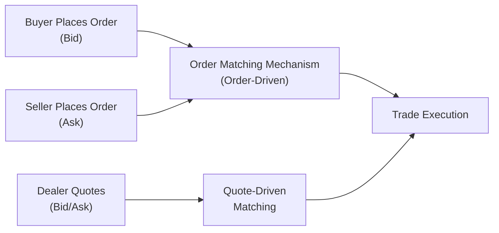
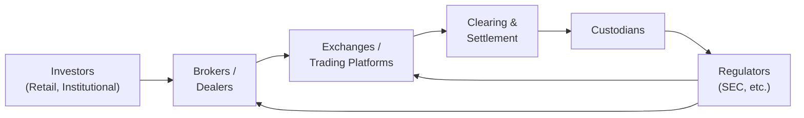

## 6.1 Market Organization and Structure

It’s funny—I still remember the first time I set foot in a bustling stock exchange. I was both thrilled and slightly overwhelmed, watching traders in colorful jackets shout orders and stare up at blinking electronic boards. I remember thinking: “Wow, this is where the magic happens, right?” Over time, I realized it’s not exactly magic—it’s a system. A system carefully organized to bring buyers and sellers together, determine prices, and efficiently direct money (or capital) to the right places. In other words, it’s market organization and structure in action. Trust me, it’s no small feat to make these markets hum along.

Let’s explore how financial markets are built, how they function, and why we rely on them when buying stocks, raising capital for new ventures, or even hedging the risk of, say, coffee bean prices. We’ll break down the major components, such as the types of markets (primary vs. secondary), trading mechanisms, and the role of intermediaries—like brokers, dealers, and custodians—all while sprinkling in a few personal experiences and easy-to-digest examples that, hopefully, will keep it fun. Ready? Let’s jump in.

### Foundations of Market Organization

Financial systems are designed to bring participants together—investors, issuers, intermediaries, regulators, you name it—and help them exchange assets in ways that can be fair, transparent, and cost-efficient. But “cost-efficient” doesn't just mean cheap fees; it also involves minimizing indirect costs, such as price volatility or the risk of no one being around to buy an asset. Essentially, markets exist to do three primary tasks:

• Facilitate price discovery.  
• Allocate resources.  
• Transfer risks.  

#### Price Discovery

At their core, markets help buyers and sellers figure out the “fair” price of a security—like a share of stock, a bond, or a derivative contract. When lots of people show up to trade, with differing views on what an asset is worth, the interactions among these participants let a price float to a level where supply meets demand.

#### Resource Allocation

Markets also connect money (capital) to those who need it. Suppose you have extra cash: you invest in shares of a new tech startup. This company, in turn, uses that money to build an app that might become the next big thing. Without a market structure allowing you to invest, your idle cash might be stuck in a cookie jar somewhere—useless to both you and the entrepreneurs who need capital to innovate. Well-functioning markets grease these wheels, making sure capital flows to promising ventures more easily.

#### Transfer of Risks

Finally, financial instruments—from basic stocks and bonds to exotic derivatives—allow participants to shift or share risk. If you’re a farmer worried about future wheat prices, you might hedge by selling wheat futures. If you’re an airline expecting to buy large amounts of fuel, you might want to lock in a certain price via a futures contract on oil. The presence of these instruments helps all parties manage uncertainties that could otherwise derail their businesses.

### Major Asset Classes and Markets

Broadly, we can group financial assets into categories: equity, fixed income, currencies, commodities, and derivatives. Some, like real estate, are often considered alternative investments. Regardless of category, assets trade in markets that might be grouped by function or time horizon.

• Primary vs. Secondary Markets  
• Money vs. Capital Markets  
• Spot vs. Forward (Derivative) Markets  

Let’s look at each.

#### Primary vs. Secondary Markets

The primary market is where new securities are issued. For instance, if a company goes public for the first time in an Initial Public Offering (IPO), those shares are being sold directly to the public. The proceeds go to the issuing firm. Once these securities are out in the world, they trade in the secondary market, where investors buy and sell existing shares from each other. The issuing company typically doesn’t see new proceeds with each trade in the secondary market, but the liquidity of this secondary market is what makes people more comfortable investing in the first place.

#### Money vs. Capital Markets

Money markets typically involve short-term debt instruments that mature in one year or less (think Treasury bills). These instruments help governments, banks, and corporations manage their short-term financing needs. In contrast, capital markets cater to longer-term funding, where instruments like bonds and equities might extend out to many years or have no maturity date at all (as in the case of common stock).

#### Spot vs. Forward (Derivative) Markets

In the spot market, trades settle in the near term—like buying 100 shares of a company that settle in a couple of business days. In forward or derivative markets, settlement happens at a future date. Participants lock in a price or condition today, but the exchange of assets (and cash) occurs down the road, which helps them manage future risks.

### Key Roles of Market Intermediaries

It’s not just about buyers and sellers showing up with their wallets. Many different intermediary institutions keep these markets functioning smoothly:

• Brokers: They act on behalf of clients, executing trades without taking a direct inventory position. A standard brokerage firm or an e-broker would be your agent, matching your order with the best possible execution in the market.  
• Dealers: Also known as “market makers,” dealers stand ready to buy (at the bid price) or sell (at the ask price) securities from their own inventory, thus providing liquidity.  
• Exchanges: Physical or electronic venues (like the New York Stock Exchange or NASDAQ) that organize and match buy and sell orders. Some operate as order-driven markets, while others may be quote-driven.  
• Custodians: Institutions that safeguard an investor’s assets, ensuring shares and other securities are properly held and accounted for.  
• Settlement Systems: After a trade is done, the actual exchange of securities for cash (settlement) has to be reconciled in a system ensuring everyone gets what they paid for.

### Major Types of Securities and Contracts

If you walk through the financial markets, you’ll see different categories of securities, each with its own benefits and quirks. Let’s do a quick tour:

• Equity Shares (Stocks): Ownership interest in a company. Price depends on underlying business fundamentals, market sentiment, and a dash of speculation.  
• Bonds (Fixed Income Securities): Contractual claims that pay periodic interest (coupons) and return principal at maturity. Government, corporate, and municipal bonds are common. Refer to 7.1 in the Fixed Income section for more details on bond features.  
• Derivatives (Futures, Forwards, and Options): Contracts whose value is derived from an underlying asset’s price. You can lock in future prices, speculate on price movements, or hedge existing positions.  
• Hybrid Securities: Preferred shares, convertible bonds, and other instruments that blend characteristics of equity and debt.

### Long and Short Positions

Whenever you trade in the markets, you’ve got a position:

• Long Position: This is when you buy a security hoping its price will rise. You profit if the price goes up and lose if it goes down.  
• Short Position: Ever bet that a price will fall? Short selling involves borrowing a security, selling it at today’s price, hoping to buy it back later at a lower price. If it works in your favor, you pocket the difference. But watch out—losses can, in theory, be infinite if the price skyrockets instead of dropping.  

This difference is crucial. Long positions typically benefit from growth or upward price movements, while short positions benefit from decline. When you combine them, you can hedge risk, express a market-neutral view, or just adapt to a personal forecast of market direction.

### Margin Transactions

One day, a friend of mine, let’s call him Dave, decided he absolutely needed to double the size of his investment in a hot tech stock. But he was short on cash. What did he do? He opened a margin account. In this arrangement, you put down part of the money (the margin), and the broker loans you the rest. Great if the stock goes up… not so great if it plummets.

#### Leverage Ratio

Leverage ratio tells you how much total exposure you have relative to your own capital. If you invest $10,000 of your own money and borrow another $10,000 from your broker, your position is $20,000 total. So your leverage ratio is 2:1. Gains or losses are magnified (doubled in this case) compared to if you only used your own money.

A rough formula for leverage ratio is:

L = (Value of Asset Position) / (Equity Investment)

#### Rate of Return on a Margin Position

Let’s say you purchase Stock A for $50/share, using 50% margin (which is $25/share out of your own pocket, while your broker supplies the rest). If the stock rises to $60, your rate of return is greater than just the difference in price because you’ve only committed half the capital.

A quick way to see it: if you buy 100 shares for $50 each, total cost is $5,000. You put in $2,500 and borrow $2,500. When shares rise to $60, the total value is $6,000. Net profit is $1,000 (before interest and commissions), which is $1,000 ÷ $2,500 = 40%—bigger than the 20% you would have made if you didn’t borrow.

#### Margin Call Price

A dreaded margin call is when your broker demands additional funds or collateral because the value of your equity portion has fallen below a specified level called the maintenance margin. Basically, the formula for a margin call price (Pᵐ) can be simplified like this:

Pᵐ = (Initial Price) × [(1 – Initial Margin) / (1 – Maintenance Margin)]

If your stock’s price drops to that level, you’ll get the dreaded phone call (or nowadays, probably an email) saying you must deposit more money or liquidate part of your position.

### Execution and Validity Instructions

Now, placing an order isn’t just about “buy” or “sell.” You can add details about how and when you want the order filled:

• Market Order: You’re willing to buy or sell at the best available price right now (though the final fill price may be higher or lower than you expect in a fast-moving market).  
• Limit Order: You specify a price you’re willing to pay or accept. If the market doesn’t reach that price, your order might not fill.  
• Stop Order (or Stop-Loss): Triggered when the market reaches a specified price—often used to exit a position that’s moving in the wrong direction.  
• Validity Instructions: You can also specify how long your order remains active—day order, good-’til-canceled (GTC), fill-or-kill, etc.

### Order-Driven vs. Quote-Driven Markets

Different exchanges and trading platforms operate under different rules for matching trades:

• Order-Driven Markets: This is where orders from buyers and sellers are matched directly. Electronic order books list all bids and offers. You might see a live “order book” showing a variety of limit orders at different prices. Traders cross orders when a buy matches a sell.  
• Quote-Driven (Dealer) Markets: Dealers stand ready to buy or sell from their own inventory at quoted bid and ask prices. This is common in fixed income markets and over-the-counter (OTC) systems. Dealers profit from the bid–ask spread but also bear risk of price fluctuations in the securities they hold.

A simple diagram might help visualize how an order-driven market contrasts with a quote-driven market:

### Importance of Well-Functioning Markets

In a perfect world, you’d be able to trade any asset quickly, with minimal costs, and at transparent prices. More realistically, markets try to approximate that. Well-functioning markets generally have:

• Liquidity: The ability to trade large quantities quickly without big price swings.  
• Transparency: Participants can see price information (and sometimes order flow).  
• Low Transaction Costs: This includes both explicit fees and implicit costs.  
• Regulatory Integrity: Rules that protect investors, ensure fair practices, and maintain confidence.

When markets operate efficiently, capital flows to the best ideas, and the economy—both local and global—benefits. Without well-functioning markets, funding new projects would be a nightmare, retirement accounts would lose value, and the fragile trust underpinning society’s economic engine could suffer.

### Objectives of Market Regulation

Regulations exist to safeguard investors, maintain fair practices, and ensure that confidence in the system remains strong. These objectives often include:

• Preventing fraud and market manipulation.  
• Maintaining order in the trading process.  
• Ensuring adequate disclosure of information to investors.  
• Protecting smaller retail investors from exploitative practices.  
• Setting capital requirements for market participants to ensure solvency.

Regulatory bodies like the U.S. Securities and Exchange Commission (SEC) or the Financial Conduct Authority (FCA) in the UK have far-reaching powers to enforce rules, require disclosures, and punish infractions. If you’re curious and maybe a bit of a regulation geek, you can dive deeper by exploring (https://www.sec.gov/) or the local regulatory authority in your region.

### Practical Examples and Case Studies

1. The Dot-Com IPO Craze: In the late 1990s, many tech companies jumped into the primary market with IPOs. Investors snapped up shares at sky-high valuations. Although some thrived, many crashed. This roller coaster showed how primary markets can quickly shift investor capital into emerging industries—and how secondary markets can reevaluate those valuations in a flash.

2. Short Selling: In 2008, some traders profited from shorting financial sector stocks, believing the subprime mortgage crisis would hammer banks. While controversial—because some blame short sellers for pushing prices down—they played a role in price discovery, reflecting negative prospects in stock valuations.

3. Limit Orders: Suppose you only want to buy your favorite company’s stock if it drops below $100. You place a limit order at $100. If the price slides down—not necessarily a good sign for others—voilà, your order might get filled. If it never drops, your order remains open until you cancel it or until the validity expires.

4. Margin Call in Real Life: Again, my friend Dave learned this lesson the hard way. He borrowed heavily on margin to buy shares in a biotech firm. The stock soared initially, but a negative FDA announcement later caused a sharp drop. When the price sank below his margin threshold, the broker forced him to deposit more or sell off shares, realizing a pretty nasty loss.

### Mermaid Diagram: Overview of Market Actors

Below is a simplified diagram of how the main market actors—investors, intermediaries, and regulators—fit together:

The arrows loosely show the flow of trades, negotiations, and oversight among participants.

### Common Pitfalls and Best Practices

• Avoid Overleverage: Borrowing to invest can be tempting (bigger gains if you’re right!), but it can also move your losses into a painful category if the market turns against you.  
• Understand Your Orders: A “market order” given during volatile conditions might get filled at a drastically different price than you expect.  
• Watch for Hidden Fees: Some brokers advertise “no commission,” but make sure to check the bid–ask spreads and the cost of margin.  
• Regulatory Compliance: Whether you’re an individual or a big financial institution, ignoring regulations isn’t just unethical—it can get you fined or even put behind bars.  
• Stay Rational: Markets sometimes go on emotional rollercoasters. Keep a level head and a long-term perspective, especially if you’re an investor rather than a day trader.

### Glossary Highlights

• Liquidity: The ability to buy or sell an asset quickly with minimal impact on its price.  
• Margin Call: A demand from a broker to deposit additional funds or securities to bring a margin account back up to the required minimum level.  
• Market Order: An instruction to buy or sell a security immediately at the best available price.  
• Limit Order: An instruction to buy or sell a security at a specified or better price.  
• Bid–Ask Spread: The difference between the price at which dealers will buy (bid) and sell (ask) the security.  
• Primary Market: The market for new securities issued directly by the company or government entity.  
• Secondary Market: The market for existing securities where investors trade among themselves.  
• Quote-Driven Market: A market in which dealers quote prices at which they will buy or sell securities.

### Conclusion

Market organization and structure might seem a bit complicated, but understanding its moving parts is vital if you want to invest responsibly or work in finance. Markets aren’t random chaos—they’re purposeful systems designed to bring together people with capital, people with good ideas, and those who can help facilitate trades for a fee (but hopefully not too big a fee!). Sure, you might make mistakes, like taking on too much risk or placing the wrong type of order, but that’s part of the learning process. You can mitigate many pitfalls by mastering the basics: how markets are organized, how they function, and what roles different participants play.

And maybe the next time you watch a financial news network with all those flashing quotes, or walk by a busy trading floor, you’ll think, “Hey, I kinda get what’s happening behind the scenes.” Ultimately, well-functioning markets help society allocate resources efficiently and fuel economic growth. They bring opportunities for profit, ways to manage risk, and a chance to support the companies we believe in.

If you’re still curious, keep reading—this is just one piece of the puzzle. Check out the references below or jump to other chapters on equity valuation, corporate issuers, or fixed income for a deeper look at how markets handle different instruments. In the end, the more you know about market organization and structure, the better you’ll be able to navigate this ever-evolving financial world.

#### References and Further Reading

- CFA Institute. (2020). CFA Program Curriculum, “Market Organization and Structure.”  
- Harris, L. (2003). Trading and Exchanges: Market Microstructure for Practitioners. Oxford University Press.  
- Mishkin, F. S. (2019). The Economics of Money, Banking, and Financial Markets. Pearson.  
- For deeper regulatory insights, visit the website of the U.S. SEC (https://www.sec.gov/) or other relevant regulatory authorities in your jurisdiction.  

## Test Your Knowledge: Market Organization and Structure Quiz



### A broker who executes trades without taking a position in the asset is best described as:
- [ ] A market maker
- [ ] A direct issuer
- [x] An agent
- [ ] A custodian

> **Explanation:** Brokers act primarily as agents, executing orders on behalf of their clients without maintaining an inventory of the security.

### Which of the following distinguishes a secondary market from a primary market?
- [ ] In a secondary market, only newly issued securities are sold to investors.
- [ ] In a secondary market, the issuing firm receives the trading proceeds.
- [x] In a secondary market, investors trade existing securities among themselves.
- [ ] In a secondary market, only money-market instruments are traded.

> **Explanation:** Once securities have initially been sold (in the primary market), subsequent trades occur in the secondary market, where investors buy and sell previously issued securities among themselves.

### Which is a key function of financial systems?
- [ ] Minimizing the role of regulation in transactions
- [x] Transferring risks from those who wish to reduce risk to those willing to accept risk
- [ ] Eliminating bid–ask spreads by matching buyer and seller
- [ ] Preventing short selling

> **Explanation:** Financial systems help transfer and manage risks. Participants can hedge or assume risk through various instruments.  

### A limit order to buy a stock at $50 will be executed:
- [x] Only if the stock’s price reaches $50 or below
- [ ] Immediately at the current market price
- [ ] Only at exactly $50
- [ ] In a quote-driven market but not an order-driven market

> **Explanation:** A buy limit order specifies a maximum purchase price. It will execute when the market reaches that price or offers a lower one, giving the investor a favorable cost.

### What is the main reason a margin call occurs?
- [ ] You have placed a market order
- [x] The security price has fallen, reducing the equity below required levels
- [ ] Volatility has completely disappeared in the market
- [ ] You hold a long position with no borrowed capital

> **Explanation:** A margin call occurs when your equity in the margin account falls below the maintenance requirement, often triggered by a decline in the asset’s price.

### In which type of market are dealers primarily responsible for setting prices at which trades occur?
- [x] Quote-driven markets
- [ ] Order-driven markets
- [ ] Hybrid stock exchanges
- [ ] Primary markets only

> **Explanation:** In quote-driven (dealer) markets, dealers quote both the bid and ask prices for securities, standing ready to buy or sell from their own inventory.

### Which order instruction is designed to close a losing position if the market moves against you?
- [x] Stop-loss order
- [ ] Market order
- [ ] Fill-or-kill order
- [ ] Good-’til-canceled order

> **Explanation:** A stop-loss order triggers a sale automatically once the price dips to a specified level, helping limit downside risk.

### A short position profits primarily when:
- [ ] The security’s price rises
- [x] The security’s price declines
- [ ] The security’s liquidity increases
- [ ] The margin requirement is higher

> **Explanation:** Short sellers “borrow and sell” at higher prices hoping to “buy back” at lower prices, thus profiting from a decline in the security’s value.

### What is a key characteristic of well-functioning financial markets?
- [ ] High transaction costs to discourage speculation
- [x] Liquidity that allows quick trades with minimal price impact
- [ ] Lack of regulatory oversight
- [ ] Inability to accurately discover prices

> **Explanation:** Liquidity—and typically low transaction costs—are both signs of well-functioning markets, where participants can transact efficiently and transparently.

### True or False: A long position has theoretically unlimited potential losses.
- [ ] True
- [x] False

> **Explanation:** A long position’s maximum loss is limited to the total amount invested, as the price of a security cannot go below zero (though that is effectively the total loss).


