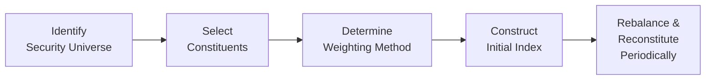

## 6.2 Security Market Indexes

Security market indexes are often the unsung heroes of finance. We see them plastered on websites, scrolling across TV tickers, or even popping up in casual conversations about “where the market is heading.” But what exactly are these indexes, and why do we care so much about them? In this section, let’s walk through the concept of market indexes, how they’re built, what makes each type of index unique, and how they are maintained and used. We’ll also share a few anecdotes, because, you know, sometimes the best way to grasp finance is to see it through real-life stories and experiences.

## What Is a Security Market Index?

A security market index is like your personal scoreboard for tracking the performance of a group of securities—think stocks, bonds, or even alternative assets. Imagine you have a favorite baseball team (maybe the Yankees or the Red Sox), and every day you check their win–loss record to see how well they’re doing in the league. A market index serves that same purpose, except it keeps score on the performance of a selected basket of securities.

Investors rely on indexes to measure changes in the overall market (like the S&P 500) or a narrower market segment (for instance, the FTSE 100 for top UK-listed companies). The point is to capture how a given set of securities is moving over time. 

Market indexes serve multiple functions:
• Benchmarking investment performance (How did my portfolio fare compared to the S&P 500?).  
• Monitoring market trends over time.  
• Building index-tracking investment products (ETFs and index mutual funds).  
• Supporting asset allocation and policy decisions for institutional and retail investors.  

I remember my very first attempt at “beating the market.” I compared my little self-managed portfolio to the S&P 500. After a few months, I realized that the index was a brutal master: if you’re underperforming it, you feel disheartened; if you’re outperforming it, you feel like a genius. That’s the power of an index—it gives you a reality check.

## Price Return vs. Total Return Indexes

Before we jump into weighting methods, it’s crucial to note that not all indexes measure returns in the same way. Some indexes track only price changes, while others capture both price changes and income (e.g., dividends or coupons).

• Price Return Index: Tracks only price movements. Dividends, interest, or other distributions are not included. The famous Dow Jones Industrial Average is a price return index.  
• Total Return Index: Tracks price movements plus any reinvested dividends or coupon payments. If you want to see the full picture of how an investment grows over time, you typically look at a total return index.  

Sometimes folks get confused when they see a “total return” version of an index. “Why is it showing a different performance figure than the normal index?” they might ask. Well, it includes dividends reinvested, so it’s typically going to be higher than the price-only version, especially if those underlying securities pay hefty dividends.

### Quick Formula Glimpse

If you’re curious about the mathematics, a simplified total return index at time t might be:

$$
\text{Total Return Index}_t = \text{Total Return Index}_{t-1} \times \left(1 + R_t\right)
$$

where \\( R_t \\) is the return (price changes plus dividends or coupons) between \\( t-1 \\) and \\( t \\). The price return index is basically the same formula but excludes the dividend component.

## Constructing the Index: Weighting Methods

One of the biggest differences between indexes lies in how each constituent (the securities included in the index) is weighted. Let’s say you’re making a fruit salad: do you add one piece of each fruit equally (like an equal-weighted approach)? Or do you add more of the fruit that is bigger or heavier (like a market-cap weighting)? Each method can produce a very different “flavor” or result.

### Price-Weighted Index

A price-weighted index assigns weights based on the security’s share price. In other words, the higher the share price, the larger the weight in the index. The Dow Jones Industrial Average (DJIA) is the most famous example. This can lead to quirks. If a stock has a very high price but not necessarily a high overall market value, it can dominate the index.  

Mathematically, a simple price-weighted index might look like:

$$
\text{PWI} = \frac{\sum_{i=1}^n P_i}{\text{Divisor}}
$$

Where \\( P_i \\) is the price of stock \\( i \\), and the divisor is adjusted over time (especially if there’s a stock split or another structural change) to maintain index continuity.

### Value-Weighted (Market-Cap Weighted) Index

A market-cap weighted index assigns weights based on the total market capitalization of each company included. Essentially, bigger companies (by market value) get a larger slice of the pie. Examples of market-cap weighted indexes include the S&P 500 and FTSE 100.

• Market Cap = Number of shares outstanding × Share price.  
• By weighting companies according to their market cap, the index reflects what the market thinks of each stock’s relative importance.

One interesting twist: in a bull market, big companies that get bigger have an even larger influence on the index, which can skew it toward a smaller group of mega-cap names. At times, people worry that a handful of tech giants might dominate the performance of market-cap weighted benchmarks.

### Equal-Weighted Index

In an equal-weighted index, every constituent gets the same dollar weighting or the same percentage in the index. It doesn’t matter if you’re dealing with a trillion-dollar giant or a tiny upstart. Each security’s performance impacts the index equally.  

This sounds fair in theory, but it has some real challenges:
• You need to rebalance frequently because prices move differently, and the weights wander away from “equal.”  
• Smaller-cap stocks get an outsized influence, which can be great if smaller companies do well. It can also be riskier because these stocks can be more volatile.  

### Fundamental-Weighted Index

Fundamental weighting is like saying, “We don’t trust the market price alone to dictate significance.” Instead, you pick some fundamental factor—like sales, earnings, book value, or dividends—and use that as the weighting measure. The idea is to capture some “true economic footprint” of companies. This approach can lead to indexes that deviate significantly from their market-cap peers. If a certain sector (like technology) is overpriced based on fundamentals, it might get underweighted relative to a purely market-cap approach, and vice versa.

## Index Maintenance: Rebalancing and Reconstitution

Building an index isn’t just a “set and forget” activity. Over time, market prices shift, corporate actions happen, new companies go public, and some go bankrupt. The index provider must keep the index aligned with its intended strategy and representation.

• Rebalancing: This involves adjusting the weights of the constituents back to the original target, whether that’s equal weighting, fundamental weighting, or something else. Market-cap weighted indexes require less rebalancing (it’s more of a self-adjusting method), whereas equal-weighted indexes might need it more frequently.  

• Reconstitution: The periodic review to remove certain constituents and add new ones. This is common in indexes like the S&P 500, which has specific rules regarding market capitalization, financial viability, and share float. Companies can be kicked out if they no longer meet the criteria, and new high-flyers can be added.  

If you’ve ever woken up to news that a certain tech darling is joining the S&P 500, watch out! The stock price tends to jump as index funds scramble to include it.

## A Visual Overview: Index Construction Flow

Below is a simple Mermaid.js diagram that shows the broad steps in constructing and managing an index:

Think of it like building a playlist of your favorite songs, picking the weighting method is deciding how many times each track will pop up in your queue, and rebalancing means changing the playlist to keep it in line with your music taste over time.

## Uses of Market Indexes

Indexes have a starring role in the modern investment world. Here are a few key uses:

• Performance Benchmarks: Fund managers (and everyday investors) compare their returns to an index to see how well they did. If your portfolio outperforms the benchmark, you’re a rock star—if not, you might consider switching strategies.  

• Market Trend Analysis: Analysts look at index trends to gauge overall market sentiment and possibly forecast business cycles or economic turns (along with other data).  

• Asset Allocation: Large institutional investors often use multiple indexes to represent different asset classes—like U.S. equities, international equities, fixed income, or real estate—to guide their portfolio allocation.  

• Index-Tracking Investments: Low-cost index mutual funds and ETFs are quite popular thanks to John Bogle’s idea of passive investing. If you want the returns of the entire market, you just buy a broad index fund and get to sip coffee while others do complicated stock picking.  

## Types of Indexes: Equity, Fixed Income, Alternatives, and Multi-Asset

Although this chapter focuses on equity indexes, indexes exist for practically any asset class you can lend, own, or trade.

• Equity Indexes: S&P 500, Russell 2000 (small-cap U.S. stocks), MSCI World (global equities). Construction is relatively straightforward, though reevaluations are needed for corporate actions like stock splits, mergers, or spin-offs.  

• Fixed-Income Indexes: Bloomberg U.S. Aggregate Bond Index, for example, is used to capture the performance of U.S. investment-grade bonds. Designing these indexes can be tricky due to less frequent trading in bonds, liquidity issues, and diverse issuance. Chapter 7 (“Fixed Income”) dives deeper into these nuances.  

• Alternative Indexes: Hedge fund indexes, commodity indexes, and private equity indexes. Data can be inconsistent, returns can be reported infrequently, or sometimes you don’t have continuous price feeds. This can lead to calculation difficulties.  

• Multi-Asset Indexes: Designed to combine multiple types of investments into one composite measure. They’re useful for broad portfolio comparisons—tracking both equities, bonds, and maybe a pinch of alternatives under one umbrella.  

In my personal life, I’ve noticed more and more advisors talk about multi-asset indexes as benchmarks. If you have a portfolio that includes a bit of everything—some inflation hedges, some bonds, some equities—it’s good to compare it to something that tries to measure all of those categories together.

## Best Practices, Pitfalls, and Strategies

Even though they look straightforward, indexes come with their own set of challenges and best practices:

• Understand the Weighting Impact: A market-cap weighted index might be heavily driven by a few mega-cap stocks. A price-weighted index might overemphasize high-priced shares. Know what’s inside your index and how weighting might skew the results.  

• Watch Out for Survivor Bias: Historical data might omit companies that were dropped from an index because they performed poorly. This can make back-tested returns look artificially good.  

• Frequent Reconstitution Impacts: Each time a company is added or removed, it can trigger trading costs. For an index fund, that can indirectly affect total returns.  

• Don’t Rely on One Index Alone: Sometimes you need multiple benchmarks to get a well-rounded picture. A small-cap manager might find the large-cap S&P 500 irrelevant.  

• Market Coverage: Always check the index’s coverage. An international equity index might skip certain emerging markets or might have limits on how many companies from a single country are included.  

If you keep these considerations in mind, you’ll have a better grasp of the nuances when you’re evaluating or using an index.

## Glossary (Key Terms)

Price-Weighted Index: An index where each component is weighted by its share price. Example: Dow Jones Industrial Average.  

Market-Cap Weighted Index (Value-Weighted Index): An index where each component is weighted by its market capitalization (number of shares × share price). Example: S&P 500.  

Equal-Weighted Index: An index that allocates the same weight to each constituent, regardless of size.  

Rebalancing: Adjusting the weights of the constituents to the intended target (e.g., returning to equal weights).  

Reconstitution: Adding or removing constituents to maintain the index’s representativeness based on predefined criteria.

## References and Further Reading

• CFA Institute. (2020). CFA Program Curriculum, “Security Market Indexes.”  
• Bogle, J. C. “The Little Book of Common Sense Investing.” A classic text that explores the concept of indexing and passive investing.  
• MSCI (https://www.msci.com/) and S&P Dow Jones Indices (https://www.spglobal.com/) for deeper dives into index methodology.  
• For more on fixed-income indexes, see Chapter 7: “Fixed Income.”  
• For alternative investments indexes, see Chapter 9: “Alternative Investments.”

And that pretty much sums it up. Let’s face it: indexes aren’t quite as thrilling as picking a single stock that could be the next big thing, but they can save you a ton of gray hair—and possibly money—by giving you a solid yardstick to measure performance and exposure. It’s kind of like stepping on a scale every morning: the data might not always be what you want, but it’s essential for tracking progress and adjusting when needed.

Now, how about putting this knowledge to the test?

## Test Your Knowledge: Security Market Index Essentials



### Which of the following statements best describes a security market index?

- [ ] A type of derivative contract used for hedging interest rate risk.  
- [ ] A single company’s balance sheet data.  
- [x] A measure of the performance of a specified group of securities.  
- [ ] A coupon-based spread measure of government bonds only.  

> **Explanation:** A security market index tracks or measures the performance of a basket of securities.  

### If an index reflects both price appreciation and reinvested dividends, it is generally referred to as:

- [ ] A price return index.  
- [x] A total return index.  
- [ ] A fundamental index.  
- [ ] A rebalanced index.  

> **Explanation:** A total return index includes both price appreciation and income from dividends (or coupons).  

### In a price-weighted index, which factor determines the weighting of each constituent?

- [x] The share price of each constituent.  
- [ ] The company’s total market capitalization.  
- [ ] The company’s book value.  
- [ ] Each constituent’s average dividend yield.  

> **Explanation:** Price-weighted indexes (e.g., DJIA) weight constituents based on their share prices.  

### What is one potential downside of a market-cap weighted index?

- [ ] It does not require any rebalancing.  
- [x] It may become dominated by a few very large stocks.  
- [ ] It automatically excludes stocks that pay dividends.  
- [ ] It is only used in the U.S. market.  

> **Explanation:** Market-cap weighting can be skewed by large-cap stocks exerting disproportionate influence.  

### Which of the following best describes fundamental weighting in an index?

- [ ] Weighting by short interest volume.  
- [x] Weighting by accounting metrics such as earnings or book value.  
- [x] Allocating weights based on “economic footprint” rather than market cap.  
- [ ] Using an incremental approach that adjusts only for share price.  

> **Explanation:** Fundamental weighting uses financial statement data (e.g., earnings, book value) to assign weights rather than market price alone.  

### An important reason for index rebalancing is:

- [x] To realign constituent weights to the original weighting scheme.  
- [ ] To capture short-term fluctuations for high-frequency trading.  
- [ ] To ensure dividends are distributed to investors.  
- [ ] To eliminate large-cap stocks from the index entirely.  

> **Explanation:** Rebalancing brings the index’s weights back to its intended structure, whether that’s equal weighting, fundamental weighting, etc.  

### What is reconstitution in the context of market indexes?

- [x] Adding or removing securities based on specific criteria.  
- [ ] Measuring returns of each index constituent more accurately.  
- [x] Periodic reviews to ensure the index remains representative.  
- [ ] Rewriting the fundamental weighting methodology.  

> **Explanation:** Reconstitution is the periodic process of adding or removing securities from the index to keep it representative of its target market or sector.  

### Why might equal-weighted indexes require more frequent rebalancing than market-cap weighted indexes?

- [x] Because price movements continually shift their weight away from equal allocations.  
- [ ] Because smaller stocks issue more dividends than larger stocks.  
- [ ] Because they include fewer securities overall.  
- [ ] Because they typically measure only one sector of the market.  

> **Explanation:** In an equal-weighted index, as prices move, weights deviate quickly from 1/n. So frequent rebalancing is needed to stay equal.  

### Which type of index would be most appropriate if an investor wants to capture all aspects of return, including dividends?

- [x] A total return index.  
- [ ] A price return index.  
- [ ] A nominal yield index.  
- [ ] A derivative-based index.  

> **Explanation:** A total return index includes dividends/coupons in its return calculations, providing the full performance picture.  

### True or False: Market indexes can be used for both performance benchmarking and creating index-tracking investment products.

- [x] True  
- [ ] False  

> **Explanation:** Indexes are commonly used to benchmark an investor’s portfolio performance and to form the basis of index mutual funds and ETFs.  




