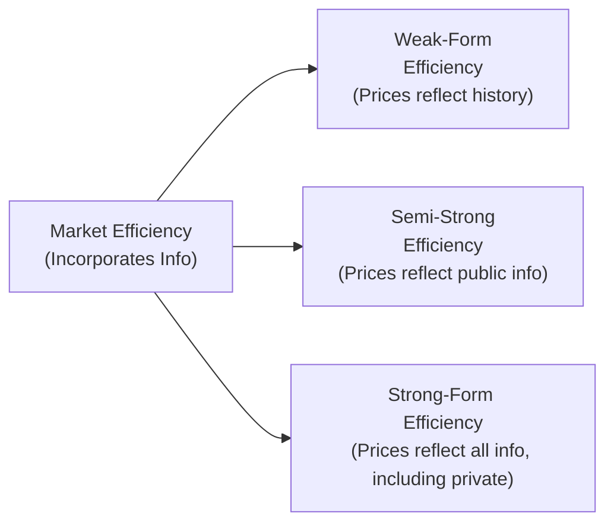

## 6.3 Market Efficiency

Have you ever browsed through financial news in the morning, thought about a particular stock that was just featured in an “upgrade” report, and then found its price skyrocket the moment you tried to place a buy order? It can be a bit frustrating—like the market somehow “knew” the news, right? This phenomenon gets us into the realm of market efficiency: the idea that a market’s prices often seem to reflect available information much faster than we’d expect.

Market efficiency is a cornerstone concept for investors, traders, and analysts. It has big implications for whether we should spend our time sifting through endless streams of data for undervalued securities or simply use a more passive approach. Let’s dig in and see how this concept shapes our understanding of equity markets.

### Defining Market Efficiency

Market efficiency is the theory that security prices incorporate all relevant information as soon as that information becomes available. If a market is truly efficient, the price of a stock or any other security at any given time should be an unbiased representation of its fair market value—based on what is known or knowable at that moment. 

Now, it’s not saying prices are always “correct” in some absolute sense; markets can—and do—overshoot or undershoot based on various triggers. But over the long term, those prices reflect the best estimate of the security’s true worth, given the flood of data that participants use to analyze and trade.

It’s a bit like stepping into a library: the better organized the information and the more people who are skilled at reading and interpreting that information, the more efficient the process becomes. When more market participants glean the right news or data quickly, trades happen, discrepancies get arbitraged away, and—boom—prices converge toward what we’d call fair value.

### Intrinsic Value vs. Market Price

Investors often talk about a security’s “intrinsic value,” which is basically an investor’s estimate of what the security is truly worth, versus its “market price,” which is the security’s actual trading price at a given moment.

• Intrinsic Value: This is a theoretical or “model-based” value. It’s the result of a fair-value analysis of all expected future cash flows, risk factors, and whatever else an investor considers relevant. It can vary from one analyst to another, depending on assumptions and methods.

• Market Price: This is the real-time, observed price at which you can buy or sell the asset. It’s driven by supply and demand in the marketplace, influenced by collective sentiment, as well as short-term events or even random noise.

In an efficient market, you might not have much of an opportunity to exploit mismatches between intrinsic and market values—because someone else will have already noticed that mismatch and traded on it, causing prices to realign quickly.

### Factors Affecting Market Efficiency

Market efficiency isn’t a magical switch that’s either on or off. Rather, it depends on several key conditions:

• Participant Sophistication  
  The more knowledgeable and skilled the market participants, the quicker they’ll pounce on mispricing opportunities. For example, institutional investors with advanced research capabilities can generate more efficient prices.

• Disclosure and Regulation  
  Strong disclosure regulations mean companies must provide timely and accurate information to the public. This helps level the playing field since analysts and investors can base valuations on reliable data instead of on rumors.

• Transaction Costs  
  If transaction costs are high, fewer people will trade frequently, even if they know prices are “off.” This can slow the process of correcting mispricing. Lower transaction costs typically aid efficiency.

• Availability and Speed of Information  
  Markets with faster data distribution networks and better information technology tend to correct mispricings quickly. Think about how high-frequency trading soared after fiber-optic networks made near-instant execution possible.

### Forms of Market Efficiency

Market efficiency is generally grouped into three forms, which differ by the type of information that’s believed to be reflected in security prices.

#### Weak-Form Efficiency

In a weak-form efficient market, the current price reflects all information contained in historical trading data. That is, past prices, trading volume, and other technical indicators are already built into the price. If a market is weak-form efficient, attempting to use chart patterns or past price movements to “beat the market” is essentially rooted in the idea that historical data alone won’t help you—because it’s already priced in.

“Um... so does that mean every chart-based strategy is doomed?” Not necessarily. In practice, technical traders try to exploit anomalies or patterns that still seem to exist. But strictly under the weak-form definition, chart-based approaches shouldn’t consistently generate abnormal profits.

#### Semi-Strong Form Efficiency

Semi-strong form efficiency states that a security’s price has incorporated all publicly available information. This includes not just historical trading data but also company announcements, earnings statements, macroeconomic news, industry-level data—basically, anything that’s on the public record.

Under this form, simply reading financial statements or devouring CNBC news reports shouldn’t give a persistent advantage. Any piece of public news is believed to be immediately digested by investors, who then buy or sell accordingly, pushing the price to fair value. Active managers, therefore, would need to interpret the news in a way that’s different (or better) than the average investor—or they’d need to uncover new information that isn’t yet public—to generate alpha.

#### Strong-Form Efficiency

A strongly efficient market goes further, suggesting that all information—public and private (or “insider”)—is reflected in the price. This implies that even insiders (like a company’s CEO or CFO with knowledge of an upcoming merger) can’t profit from their exclusive information. Now, in reality, strong-form efficiency is generally considered a stretch, as insider trading clearly can generate massive returns if the insider trades before the news is disclosed and if law enforcement does not intervene. In many countries, such activity is illegal, precisely because it would lead to unfair advantages.

The relationship among these three forms of efficiency can be visualized in a simple diagram:

### Implications for Analysis and Investing

If a market is strongly efficient, the implication is that neither fundamental analysis nor technical analysis would consistently produce above-average returns on a risk-adjusted basis, especially after fees. This is one reason why some folks just say, “Look, I’ll throw my money into a broad market index fund,” because they believe it’s nearly impossible to beat the market. 

In a semi-strong market (which many scholars argue is closest to reality for highly liquid developed equities), using simple public information might not be enough. Managers must either discover new information that’s not widely known or interpret existing information in a more sophisticated way to earn abnormal returns. That’s the basis for active management: analyzing underreported aspects, employing advanced models, or leveraging specialized expertise.

Weak-form efficiency is almost universally accepted in major equity markets: the consensus is that you’re unlikely to outsmart the market just using historical data patterns. But as we’ll learn, some anomalies and inefficiencies can appear, especially in smaller or less-tracked markets.

### Common Market Anomalies

Even in so-called efficient markets, investors and researchers have identified various anomalies suggesting that prices don’t always match fair value:

• Calendar Effects  
  You might have heard of the “January Effect,” where stock prices (particularly small-cap stocks) seem to do unusually well in January. Theoretically, year-end tax selling or fresh start-of-year optimism could distort prices in December, leading to rallying in January. While some data supports it, others see the pattern weakening in recent years.

• Momentum  
  Research shows that stocks which have performed well in the recent past sometimes continue to perform well (momentum), while “losers” continue to underperform for a period. If markets were purely efficient, such a predictable pattern might not persist. Yet momentum-based strategies do appear to work under certain conditions—at least for stretches of time.

• Overreaction  
  Sometimes the market reacts too strongly to news—pushing a stock either too high or too low—only to correct later. This is often attributed to investor psychology: we get overly excited or overly scared, and that emotional rollercoaster moves prices beyond their rational level.

These anomalies might be explained by risk factors not captured in mainstream models or by psychological and behavioral biases that distort collective decision-making. That brings us to the emerging field of behavioral finance.

### Behavioral Finance and Market Inefficiencies

Have you ever rushed to buy a stock just because everyone else seemed to be piling in? I’ll be honest—I’ve been there, done that. You see the price climbing, you don’t want to miss out, so you hop on board. This is called herding, and it’s just one example of how human behavior can lead to price distortions. Behavioral finance is all about systematically studying how we handle (or mis-handle) information, risk, and rewards.

Some common biases:

• Overconfidence  
  Many of us think our analysis is better than the average investor’s. I know I’ve personally fallen prey to the “I did the numbers carefully” mindset, feeling certain I’ve found a hidden gem. Overconfidence can lead to ignoring important contradictory data.

• Loss Aversion  
  We tend to hate losing money more than we love gaining money. This trait can cause us to hold onto losing stocks far too long (hoping they’ll bounce back) or to sell winners too soon.

• Herding  
  As mentioned, we follow the crowd—because if everyone else is doing it, maybe they’re onto something. But sometimes the crowd is just chasing performance blindly, and that can inflate price bubbles. 

• Anchoring  
  We latch onto a reference point—maybe a stock’s price from a few months ago—and struggle to change our valuation quickly, even if new information radically shifts the outlook.

Behavioral finance explains why inefficiencies might persist at least for a while, because people aren’t perfectly rational. We’re subject to biases that can lead to systematic errors in pricing. However, once enough rational players spot these errors, they’ll often act to arbitrage them away, moving the price closer to fair value. The interplay of rational and irrational participants is one reason markets sometimes appear both incredibly efficient and occasionally bafflingly inefficient.

### Practical Example of Behavioral Bias

Let’s say a company announces record quarterly earnings. The stock price shoots up by 10% right after the announcement. A rational approach might be: “Check the details of the earnings, factor them into my valuation model, update the intrinsic value, and see how it compares to the new market price.” But if you’re afflicted by overconfidence (“I’ve always been right about this stock”), you might decide to buy in big, ignoring potential negative details in the footnotes. This could push prices higher than warranted, eventually leading to a pullback.

### Strategies to Overcome Common Pitfalls

• Maintain an Investment Thesis  
  Document your reasons for buying or selling in a short bullet list. This will keep you from clinging to a loser too long simply because you got emotionally attached.

• Use a Systematic Process  
  Some folks swear by checklists or well-defined processes to combat emotional or biased decision-making. If your process is consistent, you’ll better learn from mistakes.

• Diversify  
  Don’t put all your eggs in one basket. Diversification helps you avoid catastrophic loss from a single flawed decision.

• Ongoing Education  
  Markets evolve, and new information flows in constantly. The best defense against errors is staying curious, keeping up with the latest research, and reviewing your investment theses with an open mind.

### Final Thoughts on Efficiency

Market efficiency is not black-and-white. It’s more like a spectrum, where most liquid markets are fairly efficient most of the time, but inefficiencies can crop up occasionally—especially in niche corners of the market or during periods of extreme investor emotion.

Trying to exploit small inefficiencies can be lucrative, but it’s also time-consuming and often requires advanced tools and significant trading capital. For many investors, a passive approach might indeed suffice. For those who love the puzzle and believe they can recognize mispricing earlier or more accurately than others, active investing can still hold appeal. Just remember: the competition is fierce, and the window of opportunity may be fleeting.

Let’s wrap it up with a quick summary:

• A market is efficient if security prices quickly incorporate all relevant information.  
• We have weak, semi-strong, and strong forms indicating the depth of information reflected in prices.  
• High participant sophistication, good disclosure, and low transaction costs foster efficiency.  
• Market anomalies exist but may be explained by overlooked factors or human biases (behavioral finance).  
• Knowing how to handle potential mispricings and biases is key to managing investments effectively.  

----
 

#### Glossary

• Semi-Strong Form Efficiency: Security prices incorporate all publicly available information, making simple fundamental analysis alone insufficient for consistent outperformance.  
• Behavioral Finance: A field studying how psychology and biases influence investor decision-making, which can explain why markets occasionally appear inefficient.  
• Market Anomalies: Observed patterns—like calendar effects or momentum—that deviate from the predictions of efficient market theory.  

#### References and Further Reading

• Fama, E. (1970). “Efficient Capital Markets: A Review of Theory and Empirical Work.” Journal of Finance.  
• Shleifer, A. (2000). Inefficient Markets: An Introduction to Behavioral Finance. Oxford University Press.  
• CFA Institute. (2020). CFA Program Curriculum, “Market Efficiency.”  

 

## Test Your Knowledge of Market Efficiency



### Which of the following best describes a semi-strong form efficient market?

- [ ] Asset prices reflect only historical trading data.
- [x] Asset prices reflect all publicly available information.
- [ ] Asset prices reflect both public and private (insider) information.
- [ ] Traders can systematically profit from technical analysis alone.

> **Explanation:** Under semi-strong form efficiency, a security’s price incorporates all publicly available information. Historical data alone describes weak-form, and insider information describes strong-form.

### In which form of market efficiency is it assumed that even insider information is fully reflected in stock prices?

- [ ] Weak-form efficiency
- [ ] Semi-strong form efficiency
- [x] Strong-form efficiency
- [ ] Random walk efficiency

> **Explanation:** Strong-form efficiency says prices reflect all information—public and private.

### Which factor is most likely to slow a market’s efficiency?

- [x] High transaction costs
- [ ] Rapid information flow
- [ ] Sophisticated market participants
- [ ] Strict disclosure regulation

> **Explanation:** High transaction costs reduce the incentive to correct mispricing quickly, impeding market efficiency.

### Which of the following anomalies highlights a spike in small-cap stocks in a specific month?

- [ ] Momentum anomaly
- [x] January effect
- [ ] Market overreaction
- [ ] Efficient market paradox

> **Explanation:** The January Effect is a calendar-based anomaly where small-cap stocks sometimes exhibit strong returns in January.

### Which of the following best illustrates loss aversion?

- [ ] Buying a stock because its price is skyrocketing.
- [x] Refusing to sell a losing position in hopes it will return to the original price.
- [ ] Overestimating your investment prowess due to past successes.
- [ ] Following others into a popular investment.

> **Explanation:** Loss aversion causes individuals to hold onto losing investments too long because they fear realizing the loss.

### What is the primary viewpoint of behavioral finance regarding market participants?

- [ ] All investors act with perfect rationality.
- [ ] Only a small percentage of investors use rational models.
- [x] Investors are subject to biases that can lead to mispriced securities.
- [ ] Markets never correct irrational herding.

> **Explanation:** Behavioral finance posits that psychological biases and emotional factors often drive investors to make suboptimal decisions.

### Which statement applies to weak-form efficiency?

- [ ] Public information is rapidly incorporated, but private information is not.
- [ ] Technical and fundamental information are both priced in.
- [x] Only historical market data is fully reflected in the current price.
- [ ] Investor sentiment is fully vetted in the price.

> **Explanation:** Weak-form efficiency contends only past market data is already factored into prices.

### If a market is strong-form efficient, what is the strategic implication for active management?

- [ ] Active managers can profit from momentum trading.
- [ ] Fundamental analysis yields consistent outperformance.
- [ ] Insider trading remains a key source of alpha.
- [x] Active management is unlikely to outperform in the long run, net of costs.

> **Explanation:** In a strong-form efficient market, even private information is reflected, so active managers can’t consistently beat the market.

### Which of the following factors typically enhances the efficiency of a market?

- [ ] Extremely high transaction fees
- [x] Low-cost electronic trading platforms
- [ ] Lack of disclosure requirements
- [ ] Very limited number of traders

> **Explanation:** Active, low-cost trading environments with many participants are more likely to incorporate new information rapidly into prices.

### The overreaction anomaly suggests that:

- [x] Investors sometimes push prices too high or too low after unexpected news.
- [ ] Markets systematically ignore fresh information.
- [ ] Only historical data are used to make price decisions.
- [ ] There is no such thing as mispricing.

> **Explanation:** Overreaction occurs when investors exaggerate the impact of good or bad news, leading to greater short-term price deviations.


