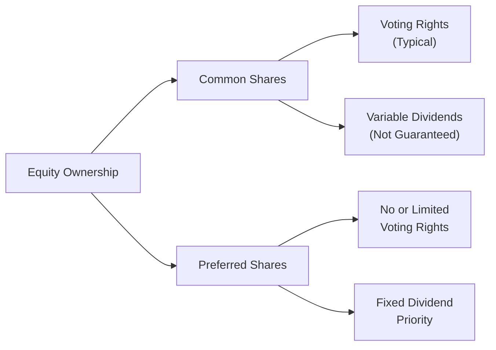

## 6.4 Overview of Equity Securities

Imagine you and a few friends start a small Internet cafe in your neighborhood. The funds you personally contribute make you a co-owner. In the corporate universe, such ownership is typically represented by equity securities—commonly called stocks or shares. Equity is basically a slice of ownership in a company, often providing voting rights and the possibility of sharing in the firm’s growth and profitability.

But let’s not get ahead of ourselves. In this section, we’ll explore what, exactly, equity securities are all about, focusing on common vs. preferred shares, differences between public and private equity, the ways we can invest internationally (like American Depositary Receipts), risk and return characteristics, and the primary reasons corporations might issue equity. We’ll also discuss the cost of equity from the company’s perspective, along with return on equity (ROE) from an investor’s vantage point. Think of it as the complete story of how stocks fit into the big financial picture.

---

### The Nature of Equity Securities

Equity securities represent an ownership stake in a corporation. If you hold shares of a company, you effectively own part of it—like your stake in that Internet cafe. It’s a personal slice of the profits (and, yes, sometimes the headaches) that come from running a business.

• Ownership Interest: Owning equity means you have a claim on the firm’s assets (after creditors are paid) and you share in the firm’s earnings.  
• Voting Rights: Many equity securities come with voting rights, which let you weigh in on key corporate decisions, such as electing the board of directors.  
• Residual Claim: In the event of liquidation, you’re entitled to what’s left after all liabilities are settled. This is often called a “residual claim.”  
• Potential for Capital Gains: If the company’s value grows, the price of its shares can go up, allowing you to sell for a profit. However, the opposite is also true—share prices can fall.  

One time, a friend told me, “I just bought shares of a chocolate factory. Does that mean I can walk in and grab a free bar?” Uh, not exactly! Although, as an equity holder, you do own part of the business, it doesn’t give you the right to just pluck the goods off the shelf. Instead, your ownership is more abstract, tied to stock price appreciation and dividends (if they’re paid).

---

### Common vs. Preferred Shares

Equity securities come in various stripes, but the two main categories are common shares and preferred shares. Let’s see how they compare:

#### Common Shares
Common stock is what most people think of when they hear “stocks.” Buying common shares typically grants you:
- Voting rights (e.g., electing board members or voting on major corporate policies).
- Variable dividends (not guaranteed).
- A higher potential for capital appreciation.
- The last claim on assets if the company goes under (hence, higher risk).

#### Preferred Shares
Preferred stock is sort of a hybrid between debt and equity. It has equity-like ownership features, but it also has bond-like features:
- Typically no voting rights (or limited voting rights).
- Priority in receiving dividends before common shareholders get anything.
- A fixed dividend rate in many cases.
- Priority in claim on assets over common stock, but still below bondholders and other creditors in the capital structure.

So, if a firm has a tough year, it must pay its preferred shareholders their dividend (assuming the terms require it) before paying out to common shareholders. But, you might be thinking, “Why would I buy something that doesn’t let me vote?” Because you may want the stable dividend income, especially if you’re an income-focused investor and don’t want to be as entangled in the ups and downs of day-to-day share price movement.

Visually, you can think of it like this:

---

### Different Share Classes

It’s not unusual for companies to issue multiple classes of common shares. For instance, Founders’ Class shares may carry additional voting rights—sometimes 10 votes per share—while the Class A shares (i.e., the ones freely traded on an exchange) might carry a single vote per share. Share classes can differ in:
- Voting power.
- Dividend treatment.
- Restrictions on resale.

This structure, although beneficial to founders who want to retain control, can lead to conflicts of interest. If you’re an investor, you might worry that the founders maintain too much power relative to their economic stake.

---

### Public vs. Private Equity

You’ve heard of “going public,” right? That’s the moment companies list their stock on a public exchange. Let’s break down the difference between public and private equity:

• Public Equity: Examples include stocks traded on the New York Stock Exchange (NYSE), NASDAQ, London Stock Exchange, etc. These shares are highly liquid, meaning you can buy or sell them relatively easily (in normal market conditions). There is a great deal of regulation, public scrutiny, and transparency involved.  

• Private Equity: This is ownership in privately held companies. Investing in private equity often requires meeting certain accreditation standards (e.g., net worth, income) and typically involves holding your investment for an extended period—these shares are highly illiquid. Opportunities include venture capital (VC) firms backing early-stage companies, or private equity buyouts of established businesses. The potential for big returns can be significant, but so is the risk, because you can’t just exit on a public exchange at the click of a button.

So, well, if you see a hot new startup before it goes public, you might get in on the ground floor of something disruptive—but if it flops, you’re stuck holding an illiquid investment with possibly no exit route in sight.

---

### Non-Domestic Equity Investments

Let’s say you’re based in the United States and you want to invest in a car manufacturer in Japan or a smartphone maker in South Korea. How do you do it without going through the complexities of a direct foreign listing? That’s where depositary receipts come into play:

• American Depositary Receipts (ADRs): These are certificates issued by U.S.-based banks, representing shares in foreign companies. They trade on U.S. exchanges (or over the counter) and are priced in U.S. dollars.  

• Global Depositary Receipts (GDRs): Similar concept, but these might trade on European or Asian exchanges, priced in local currency.  

Both ADRs and GDRs simplify cross-border investing by handling some of the currency conversion, regulatory, and settlement complexities. It’s like you’re buying a “proxy share” that stands in for the actual foreign share.

---

### Risk and Return Characteristics

Equities are typically considered riskier than bonds because bondholders enjoy certain contractual interest payments and priority if the company defaults. In contrast, returns to equity holders are not guaranteed—dividends can be cut at any time, and share prices can swing wildly.

• Higher Risk, Higher Return: Over the long run, equities have historically delivered higher returns than bonds or cash deposits.  
• Volatility: Stock prices can be volatile. External forces—like macroeconomic conditions, industry trends, or plain old investor sentiment—can send prices up or down.  
• Preferred Share Risk/Return: Preferred shares can be less volatile in price (depending on interest rate changes and liquidity), often feature a decent dividend yield, but come with limited upside potential compared to common shares.

Common pitfalls? One big one is “chasing returns.” If you see a stock soaring, it’s tempting to jump in—sometimes right before it’s about to come crashing down. Another is neglecting diversification—loading up on a single stock because you “have a good feeling” can be risky business. A best practice, ironically, is the old adage: “Don’t put all your eggs in one basket.”

---

### Equity’s Role in Corporate Financing

From a corporate issuer’s perspective, selling equity (i.e., raising funds through new share issuance) is a way to access fresh capital without incurring debt. There’s no obligation to repay principal. The trade-off? Ownership gets diluted, meaning each existing shareholder owns a smaller percentage of the firm, and the new shareholders have a claim on the firm’s future earnings. A few core points:

• Permanent Capital: Unlike debt, which must be repaid on a schedule, equity remains in the company indefinitely.  
• Dividends (if paid) are not contractual obligations: A company can reduce or eliminate dividends at will—though not without potential backlash from shareholders.  
• Governance Structure: With new shareholders comes new representation and potentially shifting governance dynamics.

Sometimes companies get big, cozy, and complacent. Issuing equity can bring in a wave of new shareholders expecting accountability and performance. This change in corporate culture can be beneficial, but it can also create friction if founders are used to calling all the shots.

---

### Cost of Equity and Return on Equity

#### Cost of Equity

The cost of equity is basically how much return investors demand to compensate them for the risk of holding a company’s stock. Businesses often estimate their cost of equity using models like the Capital Asset Pricing Model (CAPM):

KaTeX formula (CAPM):


\text{Cost of Equity} = R_f + \beta ( R_m - R_f )


Where:  
• \\( R_f \\) = The risk-free rate (like U.S. Treasury yields).  
• \\( \beta \\) = A measure of how much the stock moves relative to the market.  
• \\( R_m \\) = The expected return of the market as a whole.

Why does cost of equity matter? Because firms use that figure to evaluate whether projects or expansions will generate returns above (or below) the shareholders’ expected rate of return.

#### Return on Equity (ROE)

From an investor’s perspective, it’s really cool to measure how effectively a company is using your capital. Return on equity (ROE) is:


\text{ROE} = \frac{\text{Net Income}}{\text{Shareholders' Equity}}


ROE tells you how well a company’s management is generating profits from the money shareholders have invested. Suppose a company’s net income is \$10 million and its shareholders’ equity is \$100 million. That means an ROE of 10%. That’s one measure of profitability, though you might also consider growth rates, leverage, sector performance, and more.

---

### A Quick Case Study: Equity in Action

Let’s take a fictional example—Sunshine Solar, a renewable energy startup. Sunshine Solar needs \$50 million to expand and produce a next-generation solar panel. They can either:

• Issue New Shares: If they issue 5 million shares at \$10 each, that’ll raise \$50 million without incurring debt. But shareholders are diluted, and if the market doesn’t like the new share issuance, share prices might drop. Also, Sunshine now has more shareholders to please.  
• Borrow \$50 Million: If they get a 10-year term loan at a 5% interest rate, they must make interest payments (regardless of how many solar panels they sell). They also risk default if sales collapse.

In real life, businesses often use a mix (a “capital structure”)—some equity, some debt—balancing risk, flexibility, and cost. If Sunshine Solar’s share price rises significantly after the new product takes off, stockholders can rejoice over their capital gains. If it flops, well… equity holders can suffer big losses.

---

### Practical Tips, Challenges, and Strategies

• Diversify: Spread your equity investments across multiple companies, sectors, and geographies to avoid concentration risk.  
• Evaluate Dividends: Not all companies pay dividends. If stable income is what you want, focus on well-established dividend payers (like some utilities or consumer staples).  
• Growth vs. Value: Some folks chase high-growth (and often higher-risk) tech stocks, while others look for undervalued “value stocks.” Know your own risk tolerance and investment horizon.  
• Keep an Eye on Governance: If you’re concerned about corporate governance or ethical standards, look for companies with transparent shareholder communication and robust oversight.  
• Understand Liquidity: Publicly traded shares are easy to buy or sell (usually). Private equity is a different story—getting out might take years.  

A major pitfall for newcomers is to buy shares of a “hot” company without understanding its fundamentals. Another potential challenge is ignoring valuations altogether—if you pay too high a price, even a good company might fail to yield positive returns.

---

### Real-World Scenarios

• Investor Activism: Sometimes large shareholders (activists) pressure the company to make changes to boost the share price. While this can be positive for short-term gains, it might conflict with long-term strategies.  
• Equity Dilution: Companies occasionally reward executives with stock options or restricted stock. Good for talent retention, but it dilutes existing shareholders.  
• Economic Cycles: In a recession, equity values may decline as consumer demand and corporate earnings shrink. Conversely, in boom times, equity markets can surge.

---

### References and Further Reading

• CFA Institute. (2020). CFA Program Curriculum, “Overview of Equity Securities.”  
• “Investment Valuation” by Aswath Damodaran for deep dives on equity valuation techniques and risk.  
• U.S. Securities and Exchange Commission (SEC) Guide on ADRs:  
  (https://www.sec.gov/investor) for practical regulatory details and tips on investing in foreign companies.

---

## 10 Sample Exam Questions: Equity Securities Fundamentals



### Which of the following best describes an equity security?
- [ ] A claim on a company’s assets that must be repaid on a set schedule.
- [x] An ownership interest in a firm providing residual claim and voting rights (in many cases).
- [ ] A fixed-income instrument that guarantees regular interest payments.
- [ ] A corporate bond with embedded conversion rights.

> **Explanation:** Equity typically entitles the holder to ownership rights, residual claims on assets, as well as voting privileges, unlike bonds or other forms of debt.

### Which feature differentiates preferred shares from common shares most significantly?
- [ ] Preference for voting rights.
- [ ] Higher potential for capital gains.
- [x] Priority in receiving dividend payments.
- [ ] Equal standing in liquidation preference.

> **Explanation:** Preferred shareholders generally receive their dividends before common shareholders, and they have a higher claim in the event of liquidation than common shareholders.

### What is the main characteristic of American Depositary Receipts (ADRs)?
- [ ] They are bonds issued by American companies domiciled overseas.
- [ ] They allow U.S. firms to avoid paying taxes on foreign dividends.
- [x] They enable U.S. investors to buy shares of foreign companies in U.S. dollars.
- [ ] They guarantee a fixed rate of return for foreign equities.

> **Explanation:** ADRs represent shares in foreign companies but are traded in the U.S. and denominated in U.S. dollars, simplifying the process for domestic investors.

### Which statement is most accurate regarding risks associated with common equity investments?
- [ ] They do not experience price fluctuations.
- [x] They carry higher risk (and usually higher expected returns) than corporate bonds.
- [ ] They have guaranteed dividend payouts.
- [ ] They guarantee nominal protection against inflation.

> **Explanation:** Common shares generally bear higher volatility and risk compared to bonds, but they also offer higher expected returns over the long term.

### In the Capital Asset Pricing Model (CAPM), which factor is used to indicate how a particular stock moves relative to the overall market?
- [ ] Risk-free rate of return.
- [x] Beta (β).
- [ ] Alpha (α).
- [ ] Growth factor (g).

> **Explanation:** Beta (β) measures a stock’s volatility relative to the market’s volatility. A higher beta means higher sensitivity to market movements.

### What does the Return on Equity (ROE) ratio generally measure?
- [x] How effectively a company uses shareholders’ capital to generate profits.
- [ ] The required rate of return by shareholders.
- [ ] How annual dividends compare to market capitalization.
- [ ] The ratio of a stock’s closing price to its opening price.

> **Explanation:** ROE is computed by dividing net income by shareholders’ equity and indicates how well the firm is generating returns on the money invested by its owners.

### Which type of shares typically carries the highest risk in a corporate capital structure?
- [ ] Secured bondholders.
- [ ] Preferred stockholders.
- [x] Common stockholders.
- [ ] Senior debt holders.

> **Explanation:** Common stockholders stand last in line for claims on company assets and distributions, which makes their investment riskier than that of preferred shareholders or bondholders.

### A firm issues new shares to finance a major expansion plan. Which statement best describes the immediate effect?
- [x] Ownership is diluted, but the firm does not incur additional debt obligations.
- [ ] The firm is forced to pay dividends to the new shareholders every quarter.
- [ ] The company’s bondholders must be paid before the new shareholders.
- [ ] The firm reduces its exposure to the risk of default on interest payments.

> **Explanation:** Issuing equity does not create a debt obligation but dilutes existing shareholders’ ownership. The firm has no contractual obligation to pay dividends unless it decides to.

### Which is most accurate regarding private equity investments?
- [ ] They are highly liquid.
- [ ] They must be listed on a stock exchange.
- [ ] They entail minimal disclosure requirements for investors.
- [x] They often require a long investment horizon and have lower liquidity than public equity.

> **Explanation:** Private equity investments lack the liquidity of public markets, typically demanding investors commit their capital for longer periods.

### True or False: Preferred shares generally provide limited upside potential compared to common shares.
- [x] True
- [ ] False

> **Explanation:** Preferred shares typically offer a fixed dividend and priority over common shares for payouts, but they do not typically participate fully in the upside potential of share price appreciation like common shares do.


