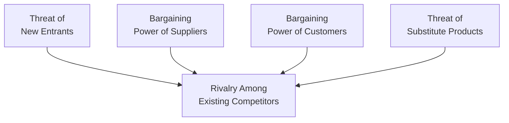
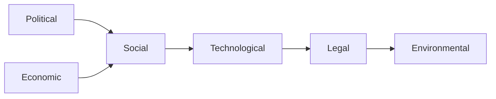

## 6.6 Industry and Competitive Analysis

Industry analysis is often the behind-the-scenes detective work that we do before picking a stock or forecasting a company’s performance. You might hear the phrase “read the room,” well, analyzing an industry is like reading the room for an entire economy sector. We’re trying to figure out the size, growth, competition, and external pressures that all shape how companies within that industry perform.

I remember, several years ago, I got curious about investing in a local electronics manufacturer. Everything about that company seemed to sparkle. You know, brand recognition, cool advertisements, the works. But after digging deeper into the industry, I realized that the entire sector was grappling with highly volatile input costs, strong new competition from abroad, and rapidly changing consumer demands. The glamorous brand was actually in a fight for survival. So, trust me, analyzing the industry isn’t optional—if you want to know what’s really happening, you have to get your hands a bit dirty in the details.

Below, we’ll walk through the big frameworks and steps for industry and competitive analysis, building from the simpler (like classification methods) to the more advanced (like Porter’s Five Forces and PESTLE). We’ll also discuss how to identify and evaluate a company’s competitive strategy once you have all that data in front of you.

### Purpose of Industry Analysis

The main reason for conducting an industry analysis is to find out how external factors—like competition, market demand, and overall industry growth prospects—impact a company’s ability to generate returns. In Chapter 6.5, we covered “Company Analysis: Past and Present,” which focuses on scrutinizing a company’s historical performance and the business environment it operates in. Industry analysis gives a broader angle, looking at:

• The overall size and shape of the market.  
• How concentrated it is (i.e., whether a few players dominate).  
• Key trends or catalysts that might shape the future (like technology shifts or changing consumer tastes).  

If you’re forecasting company fundamentals—like revenue growth or profit margins—you should keep an eye on the entire industry. You can’t guess a single player’s fate without understanding the broader game being played.

### Classification Methods for Industries

Before we dive into how an industry matures or how fiercely companies compete, we need to define what “industry” we’re even looking at. This is where classification systems come in. There are a few major ones out there, and if you’re new, it can be confusing because these frameworks can look quite similar:  
• Global Industry Classification Standard (GICS)  
• Industry Classification Benchmark (ICB)  
• North American Industry Classification System (NAICS)  
• Standard Industrial Classification (SIC), though older, is still sometimes used  

GICS is used by many major index providers (like MSCI and S&P) to group companies into roughly 11 sectors (Information Technology, Financials, Consumer Discretionary, etc.) and then further into industry groups and industries—all the way down to sub-industries. The Industry Classification Benchmark (ICB) is somewhat similar, used by FTSE Russell, and groups companies into 11 industries, 20 supersectors, and so on.

What these classification systems really offer is a consistent way to categorize companies, so we can compare apples to apples. If you’re analyzing an electronics manufacturer, you want to see how they stack up against other electronics makers, not, say, against a biotech startup.

### Industry Size, Growth, and Market Share Dynamics

After classifying the industry, you want to understand its size and growth potential. How big is the total market for the products or services offered? Are we looking at a multi-billion-dollar global industry or a very niche local market?

• Size: Typically measured by total revenues, total units sold, or total assets in the industry.  
• Growth Rates: You’ll usually see references to compound annual growth rates (CAGR). A high growth rate can be a valuable tailwind for companies in that industry. A slow or declining growth rate raises red flags.  
• Market Share: You want to find out if the industry is dominated by one or two giant firms (aka a concentrated market) or if there are dozens or hundreds of competitors. This can tell you a lot about pricing power and competitive intensity.

For instance, consider the global smartphone industry. Historically, you might see a few leading players capturing a large portion of the global market share, but smaller players may still exist for niche markets. That distribution of market share informs us about the nature of competition and how easy or hard it is to carve out a slice of the profits.

### The Porter’s Five Forces Framework

All right, so once you have a sense of industry size and basic structure, the next popular tool is Porter’s Five Forces. Developed by Michael Porter, this framework helps you analyze the competitive intensity and profit potential within an industry. In short, these forces shape how companies jockey for position and how comfortable (or cutthroat) the playing field is. Also, this directly ties in with your ability to forecast a company’s margins, because a high level of competitive pressure usually means thinner margins.

Below is a visual representation of Porter’s Five Forces in a Mermaid diagram:

Let’s briefly break down what each force means:

• Threat of New Entrants: If it’s easy for new companies to enter the industry (e.g., low startup costs, few regulatory barriers), existing players face the constant threat of new competition. That typically lowers profit potential.

• Bargaining Power of Suppliers: If suppliers have limited competition and are the sole source of a critical raw material, they can increase prices and reduce the margin for the industry players.

• Bargaining Power of Customers: If customers can easily switch providers or have access to many alternatives, they hold power. They can push for lower prices and better service, again cutting into margins.

• Threat of Substitute Products: This is about different offerings from outside the industry that can replace the need for your product. For example, streaming services can substitute for cable television.

• Rivalry Among Existing Competitors: How ferociously are companies competing on price, product features, and marketing? High rivalry can mean price wars and lower profits, while moderate rivalry might allow for stable, profitable operations.

#### Practical Example

Think about the airline industry. The threat of new entrants is moderate (you need a lot of capital to start an airline, plus there’s regulation). The bargaining power of suppliers (i.e., aircraft manufacturers and fuel providers) can be quite high, which puts airlines in a tight spot. The bargaining power of customers? Pretty high as well, because you have flight comparison websites where you can jump to whichever airline is cheapest. The threat of substitutes might be moderate (think of high-speed rail in some regions, or teleconferencing as a partial substitute for business travel). Finally, rivalry is usually high. All of these sum up to a relatively tough and low-margin industry.

### PESTLE Analysis: The Macro View

While Porter’s Five Forces focuses on competition, PESTLE goes broader. The name is an acronym for Political, Economic, Social, Technological, Legal, and Environmental factors. Some folks call it PESTEL or even PEST, but the idea is the same—understand the macro environment that your industry lives in. It’s like taking an even bigger step back to see how the environment might shift.

• Political: Government regulations, tax policies, and trade restrictions can influence how an industry grows or contracts. Some industries (e.g., healthcare, utilities) face more political challenges.

• Economic: Interest rates, inflation, economic growth rates, and consumer purchasing power. For instance, the cyclical automotive industry booms when the economy is strong.

• Social: Demographics, consumer attitudes, cultural trends, and lifestyle shifts. A growing preference for eco-friendly products or healthy living can reshape certain industries.

• Technological: Innovations or disruptive tech (like self-driving cars). Think about how quickly smartphone technology changed everything from cameras to banking.

• Legal: Industry-specific regulations, patent laws, labor laws, and more. Failing to comply can lead to heavy fines or losing your competitive edge.

• Environmental: Sustainability concerns, carbon emissions, climate change, and regulations around environmental impact. These can significantly affect industries such as energy, transportation, and manufacturing.

All of these factors can push or pull on the entire industry—so ignoring them is basically ignoring the big picture. Sometimes they create new opportunities (like emerging green technology) or new threats (like tariffs).  

### Identifying a Company’s Competitive Strategy

Once we’ve analyzed the industry context, it’s time to zoom back in on the individual company and see how it positions itself. Typically, we look at fundamental strategies like:  
• Cost Leadership  
• Differentiation  
• Focus (Niche)  

Cost leadership means aiming to be the industry’s lowest-cost producer. Usually involves significant economies of scale, streamlined operations, and sometimes standardization. A personal memory: a friend of mine worked at a big-box retail chain that was famous for its cut-throat prices. He used to say, “We measure everything, from shelf space to shipping routes, to save a few pennies.” That’s cost leadership at work—relentlessly cutting down costs.

Differentiation is about offering something unique or superior that customers value enough to pay more for. This could be a luxury brand, a specialized software solution, or outstanding customer service. This strategy can protect margins if customers truly see the product as worth the extra cost.

Focus (or niche) strategy zooms in on a particular segment of the market, whether that’s a geographic region, a certain demographic, or a specialized product. If you can serve that niche better than any generalist competitor, you can carve out a robust position.

#### Evaluating Execution, Risk Factors, and Sustainability

Regardless of whether a company chooses cost leadership, differentiation, or focus, it must execute effectively. You might see a sweet strategy in a slide deck, but does the company have the resources, the culture, and the management team to pull it off?

Pitfalls to watch for:

• Overexpansion: Companies adopting a cost leadership strategy might invest heavily in big factories or distribution networks. If demand isn’t there, they can get stuck with high fixed costs.  
• Brand Dilution: A differentiator might expand into too many product lines, confusing their brand image.  
• Competitor Imitation: If your “unique” advantage is easy to copy, your differentiation strategy might only last a short while.  

We always want to consider the sustainability of a strategy, given the industry dynamics uncovered by Porter's Five Forces and PESTLE. Does a competitor have an even deeper cost advantage? Are new technologies about to disrupt your niche? The best managers constantly scan the horizon, adjusting their strategies to meet new challenges.

### Bringing It Together: Best Practices

1. Start With Classification: Identify your industry or sector using GICS, ICB, or whatever classification standard is most relevant.  
2. Size and Growth: Check historical data and survey projections for future growth rates. A single company’s growth is easier to forecast when you know where the industry is headed.  
3. Competitive Forces Analysis: Use Porter’s Five Forces to evaluate pricing power, margins, and the potential for new entrants.  
4. Macro Factors: Conduct a PESTLE analysis for political, economic, social, technological, legal, and environmental influences. These can shape long-term demand and competitive landscapes.  
5. Define the Competitive Strategy: Is the company trying to be the cheapest, the coolest, or the best for a particular niche? Check if their strategy is actually feasible in the face of what you uncovered in steps 1–4.  
6. Look for Red Flags: Does the company have enough capital to stay afloat if demand dips? Are they ignoring a major threat from a potential substitute product?  
7. Check Execution and Sustainability: Even if a strategy is good on paper, can management execute it? And can it remain relevant over time?

### Common Pitfalls

• Blindly trusting top-line growth in a “hot” industry. It might be that margins are razor thin.  
• Ignoring external drivers such as regulatory changes or consumer shifts that can transform the market overnight.  
• Misjudging market share or current competition levels. A new competitor might change everything in a flash.  
• Failing to stay up to date on technology. A major tech breakthrough could disrupt the entire industry.  

### Practical Financial Examples and Case Studies

Imagine you’re analyzing a renewable energy company, “GreenWatt”:  

• Classification: Under GICS, “GreenWatt” might be placed in the Utilities or Energy Equipment & Services sub-industry.  
• Size and Growth: The renewable energy industry is growing in many markets as countries encourage clean energy. Let’s say it has a historical CAGR of 10% in solar power generation.  
• Porter’s Five Forces:  
  – Threat of New Entrants: Moderately high, as new solar companies pop up regularly, though large-scale solar farms require big capital.  
  – Bargaining Power of Suppliers: Solar panels rely on specialized components, so suppliers might have leverage if raw material is scarce.  
  – Bargaining Power of Customers: Governments or large corporations might sign big power purchase agreements. These customers can exert pressure on pricing.  
  – Threat of Substitutes: Fossil fuels are a direct substitute in many markets, though the global trend is shifting gradually toward renewables.  
  – Rivalry: High, with lots of players competing for subsidies and corporate deals.  

• PESTLE:  
  – Political: Government incentives for green energy.  
  – Economic: Economic downturns might reduce the appetite for big energy projects.  
  – Social: Positive social sentiment toward clean energy.  
  – Technological: Increasing solar panel efficiency and battery storage solutions.  
  – Legal: Regulations or carbon taxes might help or hinder.  
  – Environmental: Climate change concerns are fueling demand for renewables.  

• Competitive Strategy: GreenWatt might adopt a differentiation strategy by focusing on advanced, efficient solar tech. If they can’t match the scale advantages of big players, they’d better have the best tech or the best service.  

### Diagrams, Tables, and Charts

Visual aids can really help illustrate how an industry dynamic fits together. Some ideas:

• A simple bar chart comparing market shares of the top 5 players in an industry.  
• A timeline chart predicting industry growth rates over the next five years.  
• A table summarizing PESTLE factors, listing positive or negative influences.  

### References and Further Reading

• Porter, M. E. (2008). “The Five Competitive Forces That Shape Strategy.” Harvard Business Review.  
• CFA Institute. (2020). CFA Program Curriculum, “Industry and Competitive Analysis.”  
• Phadke, U. (2017). The Udyog Analysis: Holistic Industry Analysis Framework (for a PESTLE approach).  

Of course, none of these references will magically do the work for you—industry and competitive analysis is partly art, partly science. Immerse yourself in reading industry reports, watch what competitors are doing, keep an eye out for subtle shifts in consumer behavior, and combine that with a disciplined approach—like the frameworks we discussed—in order to form a coherent view.  

Sometimes, you’ll get conflicting insights. Maybe Porter’s framework points to a moderate threat of new entrants, but your PESTLE analysis reveals massive regulatory changes that could reduce barriers. That’s actually normal. Real-world industries are complicated, so stay nimble, be willing to revisit assumptions, and keep learning.

Anyway, hopefully, this broad overview plus the frameworks will help you proactively identify red flags and opportunities. I wish I’d done more of this back in the day before I got starry-eyed by a flashy brand name. Live and learn—plus, it’s more fun than it looks when you start digging into the stories behind the numbers.

---

## Test Your Knowledge: Industry & Competitive Analysis Quiz



### Which of the following is a primary goal of industry analysis?

- [ ] To determine a company's internal organizational structure 
- [x] To identify external factors and growth potential that shape a company’s performance
- [ ] To calculate a company’s current and quick ratios
- [ ] To obtain tax benefits during corporate restructuring

> **Explanation:** The principal aim of industry analysis is to uncover the external factors and competitive forces influencing company performance and potential, which helps in forecasting fundamentals.

### Which of the following best describes the function of GICS (Global Industry Classification Standard)?

- [ ] It is a macroeconomic framework for analyzing political, social, and technological forces in an industry.
- [ ] It focuses exclusively on environmental and sustainability issues when classifying industries.
- [ ] It refers to a method of analyzing firm-level corporate governance risks.
- [x] It systematically classifies companies into sectors, industry groups, industries, and sub-industries for easier comparison.

> **Explanation:** GICS is a common classification system used by many market index providers to categorize companies for effective comparison and analysis.

### In the context of industry analysis, what does market share imply?

- [x] The percentage of total industry sales or output held by a particular company
- [ ] The portion of market capitalization held by government entities
- [ ] The fraction of outstanding shares held by institutional investors
- [ ] The total number of shares a company issues to private investors

> **Explanation:** Market share measures how much of the industry's total output or revenue is captured by one company. It’s central to understanding competitive positioning.

### Which is NOT a force in Porter’s Five Forces framework?

- [x] Regulatory oversight by government agencies
- [ ] Threat of new entrants
- [ ] Bargaining power of suppliers
- [ ] Competitive rivalry among existing firms

> **Explanation:** Porter’s forces consider industry competition and profitability. Although regulation can be crucial, it's not explicitly one of Porter’s five forces.

### What is the primary focus of PESTLE analysis?

- [x] Assessing macroscopic factors—political, economic, social, technological, legal, and environmental—impacting an industry
- [ ] Evaluating a company’s internal leadership and organizational structure
- [ ] Measuring a firm’s working capital efficiency
- [ ] Estimating inventory turnover rates across markets

> **Explanation:** PESTLE is for macro-environmental scanning to see how external political, economic, social, technological, legal, and environmental elements may shape an industry.

### A firm following a cost leadership strategy will prioritize:

- [ ] Offering the most luxurious, high-end product features
- [ ] Acquiring multiple specialized brands to expand product variety
- [ ] Securing a small, exclusive customer segment
- [x] Achieving the lowest cost of production and operations

> **Explanation:** Cost leadership aims at being the lowest-cost producer in the industry to gain competitive advantage typically through price competitiveness.

### In a differentiation strategy, a company usually:

- [ ] Focuses on being the cheapest provider in the marketplace
- [x] Offers unique or premium products/features that justify higher prices
- [ ] Relies solely on high sales volume to remain profitable
- [ ] Aims to dominate multiple unrelated industries

> **Explanation:** Differentiation hinges on providing products or services perceived as unique or superior, allowing higher pricing power and brand loyalty.

### How does high bargaining power of suppliers affect industry profits?

- [ ] It decreases the likelihood of market share fluctuation
- [x] It can squeeze margins by forcing firms to pay higher prices for inputs
- [ ] It has no effect on a firm’s cost structure
- [ ] It leads to increased capacity utilization within the industry

> **Explanation:** When suppliers have high power, they can raise input costs or impose strict terms, thereby reducing potential profit margins for industry players.

### Why would you consider a “Threat of Substitutes” in your industry analysis?

- [ ] Substitutes never affect the original industry’s profitability
- [x] They can reduce demand for an industry’s product by offering an alternative solution 
- [ ] They exclusively emerge from within the same industry 
- [ ] Substitutes only apply to luxury goods

> **Explanation:** Substitute products or services can serve similar customer needs, eroding demand and profit potential for existing industry players.

### In PESTLE analysis, the Environmental element typically includes:

- [x] Concerns about climate change, pollution, and green initiatives 
- [ ] Customer online shopping behaviors 
- [ ] Bank interest rate policies 
- [ ] Corporate tax laws 

> **Explanation:** The Environmental factor in PESTLE covers eco-friendly policies, carbon footprints, and how companies respond to climate-related regulations or public sentiments.


