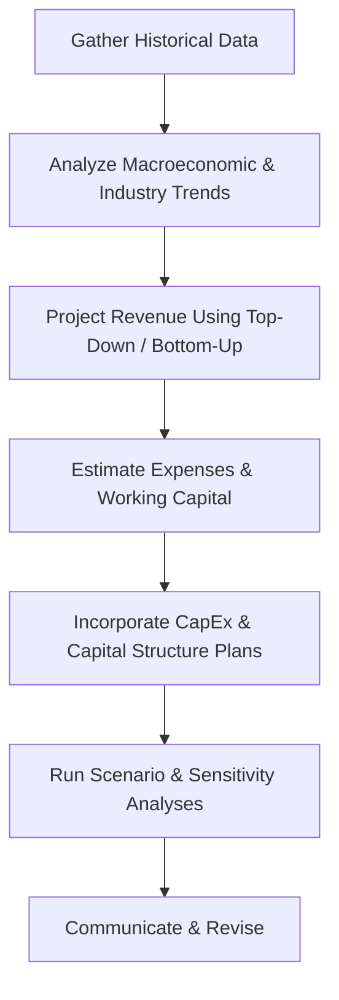

## 6.7 Company Analysis: Forecasting

Have you ever tried predicting the weather a week in advance? You come up with all sorts of data—humidity levels, wind patterns, ocean currents—and still, sometimes, a sunny Sunday turns into a rainy one. Well, forecasting corporate performance can feel a bit like that. We gather economic indicators, industry data, historical financials, and maybe even a sprinkle of luck. Yet, uncertainties abound. In this section, we’ll walk through the art and science of company analysis forecasting. Our goal is to break down the complexities, share a few personal anecdotes along the way, and leave you feeling equipped to tackle real-world forecasting challenges.

Before we jump into the nitty-gritty, let’s keep a couple of things in mind. We often use both macro (industry, economy-wide) insights and micro (firm-level) insights when we forecast. We’ll talk about top-down vs. bottom-up approaches, how to think about revenue growth, how to forecast costs, and how to assess capital investment needs. We’ll also look at scenario analysis—because, just like that unpredictable Sunday forecast, we want to model best, base, and worst cases. Finally, we’ll chat about how to communicate your forecast once you have it. Let’s get started.

---

## Principles of Financial Forecasting

Forecasting is equal parts art and science. The science rests on crisp historical data, well-known formulas, and sophisticated models. The art comes into play when we interpret that data, make informed assumptions, and decide when or how conditions might shift. In simpler terms, forecasting tries to answer questions like:

• How fast will this company’s sales grow next year?  
• Are we expecting margin expansions due to improved operations or perhaps new product lines?  
• Will the firm invest heavily in new machinery or technology?  
• Is management planning a stock or bond issuance to fund expansions?

The idea is to combine a top-down (macro, industry) lens with a bottom-up (firm-specific) perspective to create a cohesive, credible forecast. Think of it like painting a big picture. You start with broad strokes—industry outlook, overall economic conditions—then you fill in the details—the company’s product lines, cost structures, and unique competitive advantages.

### Credible Assumptions

Forecasters must be transparent and realistic with their assumptions. Stakeholders often ask, “How did you get that growth rate?” or “What data supports your margin projections?” Providing a clear roadmap of your sources and logic helps establish trust. Here are a few best practices:

• Tie growth rates to external indicators: GDP growth, industry outlook reports, competitor financials.  
• Match margins with known cost drivers: labor, raw material prices, overhead requirements, and economies of scale.  
• Validate your assumptions via historical performance, peer comparisons, or management guidance.  

---

## Top-Down vs. Bottom-Up Forecasting

### Top-Down Forecasting

Top-down forecasting starts with a high-level view of the world (or region or industry) and drills down to a specific firm. My friend once told me it’s like “starting with the entire pizza—the whole market’s revenue—then slicing off the piece for your company, based on market share or unique position.” You begin by estimating the total size of the market or industry growth. Next, you figure out the company’s share of that market and project future market share changes.

• You might say, “The global widget market is expected to be $10 billion next year. Company A has ~10% market share, so they might earn $1 billion if conditions remain the same.”  
• If you expect the market to grow 5%, you anticipate the market to be $10.5 billion, so Company A’s new revenue target might be $1.05 billion if the share remains stable. If the company plans an aggressive marketing campaign or new product launch, maybe you adjust that number upward.  

### Bottom-Up Forecasting

Bottom-up, on the other hand, flips the process. You start at the company’s internal data—maybe at the product-level or by geographic segment—or even by store location. You build your forecast by summing these smaller pieces. Here, you’re basically saying, “Product line A historically sells 100 units per month. We project that to rise to 120 units because of a new marketing push. Average price is $50, so monthly revenue is $6,000 from that line, times 12 months, gets you $72,000 a year.”

• This method is often more granular and can capture nuanced operational details.  
• However, it can also be cumbersome if a firm has dozens of product lines or operating segments.  

In practice, analysts often combine both approaches. They’ll see if their bottom-up results align with the broader industry environment from the top-down perspective. If there’s a big mismatch, it signals that something might be off in their assumptions.

---

## Approaches to Revenue Forecasting

Revenue forecasting is central to any financial model. You can’t estimate expenses, margins, or cash flows without first projecting the top line. Let’s outline a few common techniques.

### Trend Analysis

One of the simplest approaches is to look at historical trends in revenue growth. You might say, “Well, the company has grown at a compound annual growth rate (CAGR) of 8% over the last five years.” Then you assume that track record continues—maybe adjusting slightly for any known changes in the marketplace. But watch out for big pivot points: new management, brand acquisitions, or abrupt changes in consumer preferences can render a naive trend approach inaccurate.

### Market Share Analysis

If you know that the overall market for a product is growing (or shrinking), you can incorporate your forecast of the company’s share. This is effectively the top-down approach. It’s especially handy if you have reliable industry data and if the company’s share is relatively stable. If you anticipate a big new product launch, or if a competitor is going out of business, your market share assumption can shift dramatically.

### Regression with Economic Indicators

For more complex scenarios, you might regress the company’s revenue against macroeconomic or industry-specific variables (e.g., GDP, disposable income, commodity prices, consumer confidence). Suppose a homebuilder’s revenue correlates highly with interest rates and personal income. You can create a statistical model that best fits historical relationships:


\text{Revenue} = \alpha + \beta_1 (\text{Interest Rate}) + \beta_2 (\text{Personal Income}) + \varepsilon


Keep in mind that past correlations don’t guarantee future performance, especially if the firm’s strategy is changing.

### Cyclical and Seasonal Factors

Many businesses have seasonal patterns—think retail during the holiday season or tourism in the summertime. Similarly, certain industries—like automotive or construction—are cyclical, thriving in economic expansions and struggling in recessions. Make sure to factor in these cycles if relevant. Instead of forecasting one annual figure, you might forecast quarterly or monthly revenues, incorporating peak and off-peak demand.

---

## Forecasting Operating Expenses and Working Capital

Revenue is just the start. Next, you’ll want to forecast the costs required to produce that revenue, as well as the working capital needed to sustain operations.

### Operating Expenses

Operating expenses typically include costs like salaries, utilities, raw materials, selling expenses, and administrative overhead. Many analysts begin by classifying expenses into fixed and variable. Fixed expenses (like rent) don’t change much with production levels, while variable expenses (like materials and direct labor) scale with revenue or production volume. One fairly straightforward method is to look at historical expense-to-revenue ratios. For example, if labor costs have historically averaged 20% of sales, you might apply that ratio to forecasted revenue. Of course, you can adjust for known changes, like increased automation or wage inflation.

### Working Capital

Working capital (i.e., current assets minus current liabilities) can soak up cash as a business grows. For instance, if you forecast a jump in revenue, you may also see a pile-up of inventory and accounts receivable. A top-down approach might use historical relationships, like “days sales outstanding” (DSO) or “inventory turnover,” to project these balance sheet items. Alternatively, you might model them from the bottom-up, analyzing each product line’s supply chain requirements. Either way, be sure to keep an eye on how changes in working capital can shape a firm’s short-term liquidity. 

---

## Capital Investment and Capital Structure Forecasts

So, you’ve got a sense of revenue and expenses. Don’t forget that businesses also require ongoing capital investments—upgrading equipment, purchasing new facilities, or ramping up production lines. Additionally, they need funding sources, which often leads to changes in capital structure.

### Projecting Capital Expenditures (CapEx)

CapEx can be forecast by analyzing a company’s historical reinvestment rates or by referencing management’s explicit guidance. If a transportation company announces a massive plan to acquire new aircraft, you’d better include that in your CapEx estimates. Some industries also have typical maintenance CapEx levels, often expressed as a percentage of revenue or a percentage of gross fixed assets.

### Capital Structure and Funding Needs

Wondering if the company will raise new equity or debt? This is a big deal because it can shift your forecasts for interest expenses (from debt) or share dilution (from equity). For instance, imagine that you forecast a huge new project that requires $200 million in funding. If the company has a target debt-to-equity ratio, they may decide to raise a portion of that via bonds and the remainder via a secondary stock offering. That choice will affect future interest payments and the number of shares outstanding, potentially lowering earnings per share.

---

## Scenario Analysis

We all know forecasts rarely go exactly as planned. Scenario analysis helps address this uncertainty by modeling a range of outcomes—best-case, base-case, worst-case. Let’s be honest: this technique can feel like an exercise in guesswork. But it’s surprisingly valuable to see how changes in key variables—like sales volume or raw material costs—can alter the firm’s financial picture.

• **Best-case**: The economy grows faster than expected, the company gains market share, and profits surge.  
• **Base-case**: Everything pans out roughly in line with your initial forecast.  
• **Worst-case**: Economic recession, plunging demand, or supply chain disruptions.  

Or maybe you have specific event-based scenarios, such as the success/failure of a patent lawsuit or a regulatory approval. The point is to highlight volatility and the sensitivity of your model to certain assumptions.

### Sensitivity Analysis

Sensitivity analysis is a close cousin of scenario analysis. Instead of building entirely separate cash flow statements, you tweak one variable at a time: “What if revenue growth is only 4% instead of 8%? What if raw material costs go up 15%? How does that alter net income or free cash flow?” Sensitivity tables or spider charts can visualize these impacts.

Below is an example of a relationship diagram that visualizes how changes in sales volume can impact net income, all else being equal:

In practice, each step has its own cost and margin assumptions, so in a real scenario, you’d have (Demand × Price) – Costs = Profit, and so on. But this simple flowchart illustrates the chain reaction in your model.

---

## Communicating Forecast Results

Now that you’ve spent hours or days compiling data, building a model, and testing scenarios, how do you present your findings? One of the biggest pitfalls is burying your audience in numbers without explaining the critical assumptions or main drivers of projected results. Make sure to:

1. Show the assumptions front and center.  
2. Provide a brief explanation of your methodology.  
3. Highlight the sensitivity of your results to key variables.  
4. Indicate which scenario is most likely in your view (i.e., your base-case).  
5. Summarize all of this with a clear, concise conclusion, particularly if you’re connecting it to a valuation or investment recommendation.

A simple table or bar chart can also be powerful. For example, consider a table that outlines revenue forecasts across scenarios:

|                      | Worst-Case | Base-Case | Best-Case |
|----------------------|------------|-----------|-----------|
| Revenue Growth (YoY) | 2%         | 6%        | 10%       |
| Operating Margin     | 12%        | 15%       | 17%       |
| Net Income           | \$100M     | \$140M    | \$190M    |

Seeing these figures side by side helps management or investors quickly grasp potential outcomes.

---

## Common Pitfalls in Forecasting

• **Over-Optimism:** Sometimes we get excited about a firm’s prospects and overestimate growth. Always balance optimism with a realistic baseline.  
• **Ignoring Macro Trends:** You could build a perfect bottom-up forecast, but if the entire market is shrinking, that’s a problem.  
• **Underestimating Costs:** Operational hiccups or rising raw material costs can derail even the best forecasts.  
• **Failure to Update:** The environment changes. Good forecasters update assumptions periodically, especially when new data emerges.  
• **Incomplete Scenario Analysis:** If you only forecast one scenario, you might be blindsided by a big shift in economic conditions.  

---

## Best Practices and Final Thoughts

Forecasting is never perfect. But with a structured approach, comprehensive scenario analysis, and clear communication, you’ll minimize surprises. My personal experience? I once worked on a forecast for a manufacturing firm that was launching a new product line. We anticipated a modest ramp-up. The product took off more quickly than we expected—fantastic news, but we were caught off guard by the working capital crunch. That highlight taught me the importance of factoring in not just revenue but also inventory levels, accounts receivable, and supply chain readiness. 

You want your forecasts to be living documents. Keep them dynamic and update them as new information becomes available. After all, what matters most is using forecasts as a guide. Real strategic decisions hinge on realistic, thoughtful projections—so take the time to do it right, share your assumptions, and encourage critical examination.

In the flowchart above, we see how forecasting is an iterative and interconnected process: from gathering historical data to analyzing macro trends, projecting revenue, incorporating expenses, adding in capital needs, then moving on to scenario analysis and final communication.

---

## Glossary

• **Top-Down Forecasting**: Begins at the macro or industry level, then allocates market share to individual firms.  
• **Bottom-Up Forecasting**: Uses company-specific data (e.g., product lines, business segments) and aggregates to total revenue or expenses.  
• **Scenario Analysis**: Evaluates different possible future outcomes (best, base, worst), highlighting how sensitive results are to key variables.  

---

## References and Further Reading

1. CFA Institute. (2020). CFA Program Curriculum, “Company Analysis: Forecasting.”  
2. Pinto, J. E., Henry, E., Robinson, T. R., & Stowe, J. D. (2015). Equity Asset Valuation. Wiley.  
3. “Forecasting” section on Investopedia (https://www.investopedia.com/) for foundational forecasting concepts.  

If you’re itching to dig deeper, check out “Equity Asset Valuation” by Jerald E. Pinto et al., which offers excellent coverage of constructing forecasts for company valuation. And keep an eye on the latest articles from the CFA Institute on how macroeconomic shifts affect forecasts. All these resources can help you hone your forecasting skills.

---

## Test Your Knowledge: Company Analysis Forecasting



### Which statement best describes top-down forecasting?

- [ ] It starts by aggregating product-by-product or segment-level forecasts to arrive at a total revenue estimate.  
- [x] It begins at the macro or industry level, and then allocations are made to arrive at the company's share.  
- [ ] It ignores macro trends and focuses solely on the firm's internal historical data.  
- [ ] It relies exclusively on competitors’ reporting for data inputs.  

> **Explanation:** Top-down forecasting starts with industry-wide or macro-level data, then narrows down to the firm’s expected portion.  

### When using historical expense ratios to forecast operating expenses:

- [ ] It's unnecessary to adjust for known operational changes such as increased automation.  
- [x] Analysts often use historical expense-to-revenue ratios and then modify them if there are anticipated structural changes.  
- [ ] Scenario analysis is irrelevant for expense forecasting.  
- [ ] Overhead costs can be assumed to remain constant regardless of revenue growth.  

> **Explanation:** Historical expense ratios provide a good baseline, but adjustments should be made when structural changes—like automation, new supplier contracts, or strategic shifts—are expected to alter cost behavior.  

### Which of the following is a key advantage of bottom-up forecasting?

- [ ] It’s simpler than top-down forecasting and requires fewer data points.  
- [x] It allows analysts to incorporate granular product or operational details more accurately.  
- [ ] It completely eliminates forecasting error.  
- [ ] It typically results in higher forecast accuracy in cyclical industries, regardless of the product mix.  

> **Explanation:** Bottom-up forecasting starts with detailed estimates by product or segment, allowing for nuanced insights. It doesn’t guarantee perfect accuracy but captures operational specifics well.  

### A company with a traditional retail model typically sees 40% of its annual revenue in the fourth quarter. This is most likely reflecting:

- [x] Seasonal factors.  
- [ ] Overly optimistic forecasting.  
- [ ] A shift in the company's capital structure.  
- [ ] A newly introduced technology product.  

> **Explanation:** Many retail operations experience higher sales in the holiday season, highlighting the importance of modeling seasonality in forecasts.  

### In forecasting capital structure changes, analysts should:

- [ ] Ignore any mention of target debt ratios.  
- [ ] Only consider equity issuances if the firm has zero debt.  
- [x] Assess management’s capital structure targets or policies, along with financing needs and market conditions.  
- [ ] Assume any capital needed will be funded by short-term debt alone.  

> **Explanation:** Analysts should integrate the firm’s debt or equity issuance plans, target leverage ratios, and market conditions to gauge the potential impact on interest expenses, share counts, and overall cost of capital.  

### If a firm needs to raise \$100 million in new capital and decides to issue shares instead of debt:

- [x] It may increase the number of shares outstanding, potentially diluting earnings per share.  
- [ ] It will reduce the interest burden on the firm, but not affect ownership structure.  
- [ ] It will have no effect on the weighted average cost of capital.  
- [ ] It will completely eliminate operating risks.  

> **Explanation:** Issuing equity affects shares outstanding and can dilute EPS, though it can reduce debt-related interest costs. WACC might shift based on the new equity–debt mix.  

### How is worst-case scenario analysis typically used in forecasting?

- [ ] It’s used solely to create a single forecast that is intentionally underestimated.  
- [ ] It serves as the exclusive scenario analysts rely on to make financial decisions.  
- [x] It highlights negative outcomes so decision-makers can evaluate potential downside risks.  
- [ ] It is never combined with other scenarios, such as best-case or base-case.  

> **Explanation:** Worst-case scenarios model downside risks (like economic recessions, competition, supply chain issues), helping stakeholders understand the potential extent of negative outcomes.  

### Which of the following is a likely pitfall in conducting company forecasts?

- [ ] Using a combination of scenario and sensitivity analysis for robust modeling.  
- [ ] Regularly updating forecasts as new information comes in.  
- [x] Overlooking the macro environment while focusing solely on granular firm-level data.  
- [ ] Disclosing the underlying assumptions for transparency.  

> **Explanation:** A critical pitfall is failing to incorporate the broader economic or industry climate. Even accurate firm-level data can result in flawed forecasts if macro trends are ignored.  

### When communicating forecast results:

- [ ] Presenting only the final numbers, without assumptions, increases credibility.  
- [x] Clearly highlighting assumptions and uncertainties helps stakeholders understand key drivers and risks.  
- [ ] Including sensitivity analyses is redundant if you have a single, well-defined growth rate.  
- [ ] There’s no need to disclose any scenario that deviates from the base-case.  

> **Explanation:** Transparency about assumptions, key drivers, and risks builds credibility and helps audiences grasp the range of potential outcomes.  

### If we assume 5% GDP growth in a top-down model, but actual GDP ends up growing at 1%:

- [x] The forecast is likely to be overly optimistic, unless the firm gained extraordinary market share shifts.  
- [ ] The forecast would not be affected if the firm operates within the broader economy.  
- [ ] The firm’s revenue still grows at the same projected pace.  
- [ ] Interest expense automatically adjusts to keep the forecast aligned.  

> **Explanation:** A significant drop in GDP growth compared to the forecast can imply that the original revenue projections are too high, highlighting the importance of dynamic updates and scenario planning.  


