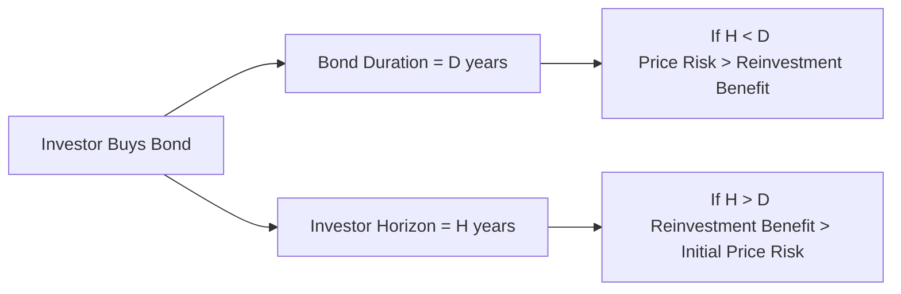
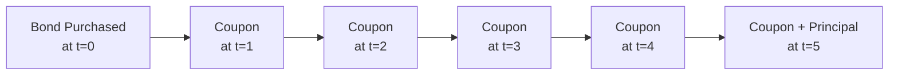

## 7.10 Interest Rate Risk and Return

Interest rate risk is one of those topics that sounds abstract at first—like something only quants with fancy spreadsheets would worry about. But trust me, once you see how it affects your bond portfolio or your personal investments, you won’t be able to ignore it. I remember once, a very dear friend of mine asked, “Why did my bond’s price go down when interest rates went up, even though I’m still getting the same coupon?” The question had this underlying tone of frustration. Well, that frustration is what we’ll unravel here.

In this section, we’ll walk through the nuts and bolts of interest rate risk, focusing on how a bond’s return can be broken down and how the bond’s duration lines up with an investor’s horizon. We’ll explore why rising rates aren’t always bad news—especially for those who hold their bonds longer than a certain threshold—and how Macaulay duration helps measure the “weighted-average timing” of all the bond’s expected cash flows. We’ll also look at the Holding Period Return (HPR) concept, which reveals how a bond’s ultimate profits or losses revolve around both price changes and coupon reinvestment.  

Use these ideas to refine your own bond strategy. You’ll see that interest rate risk is not simply about prices going up or down; it’s also about how those reinvested coupons can work in your favor if you’re patient enough. Let’s dive in.

### Decomposing Bond Returns

When you invest in bonds, your return isn’t just the coupon you see on the bond’s face. It actually consists of three key components:

1. Coupon income  
2. Price changes due to yield movements (a.k.a. capital gains or losses)  
3. Reinvestment income (the interest you earn on reinvested coupon payments)

Let’s unpack each so you see their interplay.

#### Coupon Income

Coupon income is typically the most visible part of bond returns. It’s what most people think of: “I bought a 5% bond, so I’m getting 5% of the face value each year.” Right—if the bond’s face (par) value is $1,000 and the coupon is 5%, you get $50 each year, usually in semiannual or annual installments.

In many ways, coupon income is the simplest component. You know how much you’ll receive each period if you hold on to the bond, and that’s that. But don’t underestimate its long-term importance—especially if you reinvest those coupons at a good rate.

#### Price Changes Due to Yield Movements

This piece is trickier. A bond’s price moves inversely with interest rates in the market (i.e., yields). If you remember the general rule: if market yields go up, bond prices usually head down, and vice versa. Why? Because if new bonds in the market are offering higher yields, your older bond’s coupon won’t look as attractive—which lowers its market price.

Sometimes people freak out when they see the price of their bond falling after rates go up. But keep in mind, that price decline might be offset by the fact that if you hold the bond to maturity, you’ll still receive its final par value. Alternatively, if you’re reinvesting the coupons, now you can do so at a higher rate. So, it’s not always a pure “loss,” depending on your horizon.

#### Reinvestment Income

Reinvestment income is the interest you earn by plowing your coupon payments back into some form of investment—often more bonds. This matters because if interest rates are high, you’ll earn more on those reinvested coupons. If interest rates are low, you’ll earn less. So if rates rise, there’s a silver lining for long-term bond investors: those coupons can be reinvested at higher and higher rates, which can boost overall returns in the long run.

One caution, though: when rates are low, you get less from reinvesting. That’s called reinvestment risk. If rates take a nosedive right when you have a juicy coupon to reinvest, well, that’s less fun. But again, keep your investment horizon in mind, because short-term hits can be offset by long-term gains (or vice versa).

### Understanding Macaulay Duration

Now let’s talk about duration. I recall a finance professor who used to say, “Duration is the single most important concept in fixed income investing.” It’s basically a measure of how sensitive your bond’s price is to interest rate changes. More formally, Macaulay duration is a time-weighted average of all the cash flows you expect from the bond (coupons and final principal repayment).

In slightly more technical language, the Macaulay duration (D) formula is often expressed like this:


D = \frac{\sum_{t=1}^n t \times \frac{CF_t}{(1 + y)^t}}{\sum_{t=1}^n \frac{CF_t}{(1 + y)^t}}


where:  
• \\( CF_t \\) is the cash flow at time t (which could be coupon or principal if it’s the final payment).  
• \\( y \\) is the bond’s yield per period.  
• \\( n \\) is the number of periods to maturity.  

It effectively tells you the “average time” (in years, typically) it takes to receive the bond’s cash flows, weighted by the present value of each of those cash flows. The higher the duration, the more sensitive the bond is to interest rate fluctuations. A 10-year duration, for example, typically suggests you’ll see about a 10% price drop for a 1% increase in yield (this is a rough approximation).

### Investment Horizon Meets Duration

It’s one thing to understand that the bond’s price is sensitive to rate changes. But so what? Whether that’s a big deal depends on when you’re planning to sell or dispose of the bond. This is where the notion of your “investment horizon” matters.

• If your horizon is shorter than the bond’s duration: Rising rates might hurt you, because you could be forced to sell the bond before you’ve reaped the benefits of reinvesting at those higher rates. In other words, you take the immediate price hit, but you never get the chance to gradually recoup that loss through higher coupon reinvestment over time.  

• If your horizon is longer than the bond’s duration: Rising rates can actually work in your favor over the long run. Sure, there’s a price drop initially, but you’re not selling—your plan is to hold the bond for a good while. In that time, your coupon payments get reinvested at higher rates, possibly leading to a higher overall return than if rates remained low.  

Think of it this way: a bond with a Macaulay duration of 7 years is basically telling you, “If you hold me for roughly 7 years, interest rate movements might sort of wash out.” Because any price headwinds or tailwinds can be offset by changes in reinvestment rates over a 7-year horizon. That’s a simplified interpretation, but a helpful rule of thumb.

#### A Mermaid Diagram to Illustrate Horizon vs. Duration

Below is a simple diagram showing the relationship between your investment horizon (H) and the bond’s duration (D). If \\(H < D\\), you might be more vulnerable to rising rates. If \\(H > D\\), rising rates could actually help.

This is just a conceptual picture: when your horizon is less than the bond’s duration, your exposure to price changes is more pronounced. When your horizon exceeds the duration, reinvestment gains may offset initial losses if rates increase.

### Holding Period Return (HPR) and Reinvestment

The total return you get during the period you hold a bond is what we call the Holding Period Return (HPR). It factors in:

1. The coupon payments you receive.  
2. Any change in the bond’s price from when you bought it to when you sold it (or redeemed it at maturity).  
3. The reinvestment rate on coupons you collected along the way.  

Formally, you might see a formula like:


\text{HPR} = \frac{\text{Ending Value of Investment}}{\text{Beginning Value of Investment}} - 1


The “Ending Value” includes all coupons and principal repayments, plus any interest earned on reinvested coupons. For instance, if you buy a $1,000 bond, collect some coupons, reinvest them for a year or two, and then sell the bond at $980 (because yields rose, so price is down) or $1,020 (because yields fell), your final HPR depends on both the price difference and how much extra you got from reinvesting coupons.

This is why it’s so important to look at the entire picture. Just focusing on the bond’s price or just focusing on the coupon might be misleading. The real magic and madness happen in that interplay. Sometimes, if yields climb and your horizon is long, you end up with a higher HPR than if yields had stayed put. Surprising, right? But that’s the power of reinvestment at higher rates.

### Practical Examples and Case Studies

Let’s walk through a simplified scenario to demonstrate how each piece plays out. 

#### Case 1: Rising Rates, Short Horizon

• You buy a 10-year bond with a 5% coupon at par ($1,000), so each year you receive $50 in coupons.  
• The bond’s Macaulay duration is about 7.5 years (hypothetical).  
• Your plan is to sell the bond in 3 years.  

Now suppose interest rates go up to 6%. Bond prices, including yours, drop. Maybe by the time you sell, the bond is worth $950. You also reinvested your coupons at 6% for that shorter time, which provides a bit of extra income, but it may not be enough to fully offset that $50 loss on the bond’s price. So your total HPR might be lower than if rates had stayed at 5%.

#### Case 2: Rising Rates, Longer Horizon

Let’s stay with the same bond but imagine your horizon is 10 years. You plan to hold until maturity (or close enough). Now if interest rates rise to 6% early on, your bond’s market price might drop initially. But because you’re not selling right away, you can keep reinvesting those $50 coupons at 6%. By the time you reach maturity, the reinvested coupons have grown at a higher rate, and you still get your full $1,000 par value at the end. So despite the initial price hit, your overall HPR across the full 10-year period might actually be better than it would have been if rates stayed at 5%.

### A Quick Table Summary

Below is a simple table that captures how changing interest rates might affect a 10-year bond investor, depending on horizon length. (Hypothetical numbers for illustration only.)

| Horizon | Initial Rate | New Rate | Bond Price Effect   | Reinvestment Effect     | Overall Impression                |
|---------|-------------|----------|---------------------|-------------------------|-----------------------------------|
| Short (3 yrs) | 5% | 6% | Price drops (some capital loss). | Slightly higher reinvestment income for 3 yrs. | Likely a net negative effect.     |
| Long (10 yrs) | 5% | 6% | Same price drop initially.       | Higher reinvestment for more years.             | Potential net gain over full term.|

### Common Pitfalls and Best Practices

• **Pitfall**: Ignoring Reinvestment Income. Many beginners focus on the bond’s booked price gain or loss and forget about the benefits or drawbacks of reinvestment.  
• **Pitfall**: Misalignment of Horizon and Duration. If you need funds in 2 years, investing in a 10-year bond might be risky unless you’re prepared to accept potential short-term fluctuations.  
• **Pitfall**: Overemphasizing Price Movements. A bond is a package of cash flows, not just a piece of paper whose price moves up and down.  

• **Best Practice**: Keep a clear sense of your time frame (investment horizon). Try to match the bond’s duration to your horizon if you want to minimize interest rate risk.  
• **Best Practice**: Check your assumptions about ongoing coupon reinvestment. If you plan to use coupon cash flows for living expenses, you might not be reinvesting them at all. Adjust expectations accordingly.  
• **Best Practice**: Monitor the yield curve (see 7.9 The Term Structure of Interest Rates: Spot, Par, and Forward Curves), so you understand how shifts at various maturities could affect your bond’s price and reinvestment rates.

### Mermaid Diagram of Cash Flows and Time

Below is a quick visualization of a coupon bond’s cash flows over a 5-year timeline, just to illustrate how you receive multiple coupons and one big principal repayment at the end.

Notice how each of those coupons (B through E) could be reinvested (depending on your strategy). The final payment at t=5 (F) is your principal plus the last coupon.

### Encouraging Critical Thinking

So now that we’ve laid out the basic framework, it’s always good to reflect on what this means for your own investment style:

• Are you investing in bonds specifically to generate stable coupon income?  
• Are you planning to hold bonds for the long term or just for a short bridging period?  
• How do you feel about reinvesting coupons?  

Answering these questions for yourself (or for your client, if you’re advising someone) clarifies how much interest rate risk you’re truly taking on and whether that risk is okay for your financial goals.

### References and Further Reading

If you’re captivated by interest rate risk and hungry to learn more, here are a few places to dig deeper:

• CFA Institute Level I Curriculum: Be sure to consult the sections on interest rate risk and bond return for the official perspective and practice quizzes.  
• Fabozzi, F. “Bond Markets, Analysis, and Strategies”: A go-to reference for bond pricing dynamics and risk decomposition.  
• “Fixed Income Securities” by Tuckman & Serrat: Takes a more quantitative approach to interest rate modeling and risk analysis, for those who want an advanced deep dive.  

Feel free to compare these resources and see which style resonates with you. They all address interest rate risk from slightly different angles and it’s instructive to see those overlapping viewpoints.

### Final Thoughts

Interest rate risk is sometimes misunderstood as purely bad news for bond investors. But as we discussed, a rise in rates isn’t always negative—especially if you have a longer horizon or if you’re systematically reinvesting coupons. Duration is a simple yet powerful tool to measure how exposed you are to rate swings and how quickly you’ll feel their effects. Holding Period Return (HPR) ties everything together: price changes, coupon income, and reinvestment returns. Understanding each piece makes you a better investor or portfolio manager, letting you stay calm when interest rates inevitably do their dance.

So the next time you see the market get spooked by a rate hike, remember: it’s not the end of the world. It might even be the beginning of a better return profile—if you’re patient enough and if your horizon lines up with your bond’s duration.

-----

## Test Your Knowledge of Interest Rate Risk and Return



### How can bond returns generally be decomposed?

- [x] Coupon income, price changes due to yield movements, and reinvestment income
- [ ] Principal repayment, management fees, and opportunity cost
- [ ] Dividend income, initial margin, and volatility
- [ ] Beta risk, alpha risk, and gamma adjustments

> **Explanation:** A bond’s total return is driven by regular coupon payments, any capital gain or loss due to changing yields, and the income you make from reinvesting these coupons.

### Which statement best describes the impact of rising interest rates on bond prices?

- [x] Rising interest rates generally lead to falling bond prices.
- [ ] Rising interest rates generally lead to rising bond prices.
- [ ] Bond prices are not affected by interest rates at all.
- [ ] Bond prices are fully determined by equity valuations.

> **Explanation:** Bond prices and interest rates have an inverse relationship. As market yields rise, existing bonds with lower coupons become less attractive, hence their prices decrease.

### If an investor’s horizon is shorter than the bond’s duration, what is the likely outcome if interest rates rise?

- [x] The investor experiences price risk exceeding the benefit from reinvesting coupons.
- [ ] The investor benefits more from reinvested coupons than the initial price decline.
- [ ] The investor is not impacted by any market yield movements.
- [ ] The investor automatically cancels out all interest rate risk.

> **Explanation:** With a horizon shorter than duration, the investor might be forced to sell before they can fully capitalize on higher reinvestment rates, making the initial price drop more detrimental.

### Why is reinvestment income considered a vital component of bond returns?

- [x] Coupon payments can be reinvested at prevailing interest rates, boosting total return over time.
- [ ] It guarantees the market price of a bond will remain constant throughout its life.
- [ ] It ensures bond yields never drop below the coupon rate.
- [ ] It is not relevant to fixed-rate bonds.

> **Explanation:** Reinvestment income can significantly augment bond returns over the holding period, especially when interest rates rise.

### Which measure is used to calculate the time-weighted average of a bond’s cash flows?

- [x] Macaulay duration
- [ ] Holding Period Return
- [x] None
- [ ] Coupon yield

> **Explanation:** Macaulay duration is the measure that gives you a weighted-average time to receive a bond’s cash flows, factoring in the present values of coupons and principal payments.

### What does an increase in a bond’s duration imply?

- [x] The bond’s price is more sensitive to changes in market yields.
- [ ] The bond’s price becomes entirely insensitive to changes in interest rates.
- [ ] The bond pays out higher coupons automatically.
- [ ] The bond’s credit risk is reduced.

> **Explanation:** A higher duration indicates a higher sensitivity to interest rate movements, meaning the bond’s price fluctuates more when yields change.

### If a bond’s yield rises soon after purchase, and the investor’s horizon matches the bond’s duration, what is a likely outcome?

- [x] The reinvestment advantage over time offsets the initial price decline.
- [ ] The investor fails to earn any coupon income.
- [x] The investor cannot reinvest coupons at all.
- [ ] The bond’s price immediately goes to zero.

> **Explanation:** If the horizon matches the duration, the negative effect from price decline can be offset by higher reinvestment returns, so overall it can balance out favorably.

### Holding Period Return (HPR) includes which of the following?

- [x] Price appreciation or depreciation, coupon income, and reinvestment income
- [ ] Only the coupon income earned on the bond
- [ ] Only the final principal return
- [ ] Prices from equity markets

> **Explanation:** HPR captures the entire total return picture: any price change, coupon payments, and what you earn by reinvesting those coupons.

### What is the primary type of risk if you are concerned about the rate at which coupon payments will be reinvested?

- [x] Reinvestment risk
- [ ] Credit risk
- [ ] Liquidity risk
- [ ] Currency risk

> **Explanation:** Reinvestment risk is precisely the risk that future coupon payments (and principal repayment) might be reinvested at a lower (or different) rate than expected.

### True or False: High interest rates always result in negative total returns for bond investors, regardless of investment horizon.

- [x] True
- [ ] False

> **Explanation:** Actually, this statement is tricky. If your horizon is long enough (and especially if it exceeds the bond’s duration), higher rates can lead to higher reinvestment income, possibly resulting in a better total return in the long run. However, from a short-horizon perspective, the initial price drop can indeed lower returns. Since this statement says “always” and “regardless of investment horizon,” that is contextually incorrect. The truthful answer is that it’s not always negative for everyone. But the statement as given says “High interest rates always result in negative total returns... regardless of horizon,” which is definitively false. The correct answer to a True or False question with the statement given is False.


