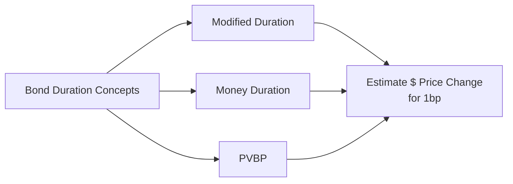

## 7.11 Yield-Based Bond Duration Measures and Properties

If you’ve ever listened to folks chatting about bonds, you might have heard them say things like, “Hey, watch your portfolio’s duration!” or “Man, that bond’s duration is super high—better be ready for some volatility.” Want to know what they’re talking about? Well, you’re in the right place. In this section, let’s explore yield-based bond duration measures—like Modified Duration and Money Duration—that show us how much a bond’s price will change when interest rates move around. 

We’ll also look at the price value of a basis point (PVBP), which is this neat, small, but mighty measure that tells us how much money we can gain or lose if yields shift by just 0.01%. Along the way, we’ll talk about a few personal experiences, a bit of head-scratching I did when I was learning this stuff, and some best practices you’ll want to keep in mind for real-world usage. Let’s dive in.

---

### Why Duration Matters

First off, why do we even care about duration? It’s simply (or maybe not so simply) a way to measure a bond’s sensitivity to changes in yield. A bond with higher duration experiences bigger price changes for a given shift in interest rates compared to a bond with lower duration. 

In other words, if you’re trying to gauge interest rate risk, you’ll likely want to check your bond’s duration as part of your routine. When yields go up, bond prices generally go down. Duration just helps quantify the extent of that relationship.

Let’s put it this way: Suppose you have two bonds that both trade at a price of $1,000. One bond’s duration is 5, and the other’s is 6. If interest rates rise by 1%, the first bond (duration 5) might drop approximately 5% in price (or $50), while the second bond (duration 6) might drop 6% in price (or $60). So you see, higher duration means more interest rate sensitivity—sometimes that’s good, sometimes not, depending on your position and outlook on rates.

---

### Modified Duration

Modified Duration is one of the most commonly used yield-based measures. Technically, it’s derived from Macaulay Duration, which measures the weighted average time you have to wait to receive each of the bond’s cash flows. But Macaulay Duration alone doesn’t incorporate the effect of the bond’s yield on its price sensitivity. Modified Duration adjusts that measure by dividing Macaulay Duration by (1 + YTM/k), where YTM is the bond’s yield to maturity, and k is the number of coupon periods per year (if we’re compounding semiannually, then k=2, etc.). 

Here's the formula in KaTeX:


\text{Modified Duration} \;=\; \frac{\text{Macaulay Duration}}{ \bigl(1 + \frac{YTM}{k}\bigr) }


But if you’re reading an exam question or a finance textbook, you’ll often see a simpler definition that doesn’t worry about the exact compounding. Instead, the text might say:


\text{Modified Duration} \approx \frac{\Delta P/P}{\Delta i}


where:
- \\( \Delta P \\) is the change in the bond’s price,
- \\( P \\) is the current bond price, and
- \\( \Delta i \\) is the change in yield (in decimal form).

The key idea: Modified Duration tells you the approximate percentage change in a bond’s price for a 1% (i.e., 100-basis-point) change in yield. So if your bond’s Modified Duration is 6, it means that if the bond’s yield goes up by 1%, the bond’s price will likely drop by about 6%.

I remember the first time I saw “Modified Duration” spelled out in a textbook. I was already comfortable with Macaulay Duration but got confused about the difference. Then, in a study group, a friend said, “Oh, it’s basically Macaulay with a yield factor correction—like an adjustment so it more precisely measures interest rate sensitivity.” And it just clicked—you know, that aha moment. Maybe you’ll have that moment yourself right now. 

#### Interpretation

One of the great things about Modified Duration is that it’s straightforward: a Modified Duration of x indicates that for every 1% increase in yield, the bond’s price falls (or rises, if yield goes down) by roughly x%. This linear relationship isn’t perfect for large changes in interest rates, but for small ones, it does a solid job.

---

### Money Duration (Dollar Duration)

As finance folks, we love percentages. But we also love actual monetary amounts. Enter Money Duration (also called Dollar Duration). While Modified Duration is a percentage measure, Money Duration is your bond’s actual dollar exposure to yield changes.

To compute Money Duration, you typically multiply:
1. Your bond’s full price (market value), by
2. The Modified Duration (as a decimal).

Symbolically,


\text{Money Duration} = \text{Bond Price} \times \text{Modified Duration}


An example might make this clearer. Let’s say we’ve got a bond priced at $1,000, with a Modified Duration of 5. Then its Money Duration is:


\$1{,}000 \times 5 = \$5{,}000


That means for a 1% change in yield, you might expect a $50 change from each $1,000 of par value—sorry if that’s a little confusing at first. Actually, the $5,000 figure is the absolute “exposure” measure if you held $1,000 par. For every 1% shift in yields, you’re looking at a $50 price shift per bond (since $1,000 × 5% = $50). But the total measure says your position has a $5,000 "duration weight" if you think in lumps of 1%.

#### Why We Use It

When you’re trying to figure out how a shift in interest rates might impact your portfolio, money talks! No, seriously—sometimes you just want a direct dollar figure for how big that shift might be. If your entire bond position is worth $10 million, and its average Modified Duration is 4, the Money Duration for that portfolio is $10 million × 4 = $40 million. If yields move by 0.01 (i.e., 1%), you can guess you’ll lose or gain about $400,000 (1% of $40 million) on that portfolio. Neat, right?

---

### Price Value of a Basis Point (PVBP)

Sometimes 1% yields changes are too big to be helpful. We’re often more interested in small interest rate changes—like, well, 1 basis point (0.01%). One basis point changes are quite typical in markets that can see yields fluctuate by a few basis points daily.

The Price Value of a Basis Point (PVBP) attempts to measure the monetary impact of just 1 basis point movement in yield. The formula’s straightforward:


\text{PVBP} \approx \text{Money Duration} \times 0.0001


**In words**: multiply your Money Duration by 0.0001 (because 1 basis point = 0.0001 in decimal).

For instance, if your bond’s Money Duration is \$50,000, the PVBP is:


\$50{,}000 \times 0.0001 = \$5


So basically, whenever the yield changes by 1 basis point, your bond’s price changes by about \$5 for each \$1,000 par (or whichever notional we’re referencing, depending on the context). 

#### Practical Usage

PVBP is a big hit with traders who’re looking to hedge or structure trades where they think yields might drift up or down by a few basis points. You see it used in day-to-day bond portfolio analytics, especially in large institutional contexts, to quickly gauge the risk or see if the position is properly hedged. 

I once had a manager who’d always say, “What’s our basis point risk?” And that’s exactly what we’d do—multiply out the portfolio’s PVBP to see how many dollars we’d gain or lose if interest rates moved just a hair in the opposite direction we expected.

---

### Factors Affecting Duration

Now that you know the definitions, let’s talk about what drives a bond’s duration. How do you know if a bond’s duration is going to be relatively high or low?

1. **Coupon Rate:** Lower coupon bonds tend to pay you less money before maturity, so you get more of your principal back at the end. That effectively extends the weighted average time until you get your cash flows. Higher coupon rates, by contrast, shorten the effective timeline. So, if you want to memorize a rule of thumb: 
   - Lower coupon → Higher Duration
   - Higher coupon → Lower Duration

2. **Yield Level:** The yield you use in the calculation also matters. If the bond’s yield is lower, the present value of those later cash flows is higher—meaning your average wait time for receiving “substantial” cash flows is effectively longer. So a lower yield tends to produce a higher duration. Conversely, higher yields reduce the present value of distant cash flows, effectively decreasing duration.

3. **Time to Maturity:** This is perhaps the most intuitive factor. The further away your final principal repayment, the more sensitive the bond’s price is to interest rate changes. So a longer-term bond usually has a higher duration.

Think of it this way: if you have a 30-year zero-coupon bond, you’re waiting 30 years for your entire payoff. That’s a big gamble if interest rates shift. On the other hand, if you hold a short-term bond (say 2 years) that also pays coupons, you’re recouping principal soon and you have less interest rate risk. 

---

### Using Duration Measures to Gauge and Hedge Interest Rate Risk

So, how do investors use all these measures—Modified Duration, Money Duration, PVBP—to manage interest rate risk?

#### Interest Rate Sensitivity

Simply put, a portfolio manager might line up all the durations of the bonds in a portfolio and gauge the portfolio’s overall exposure to yield changes. If the manager expects rates to go up, they might shorten the portfolio’s duration to buffer possible price declines. If they think rates are about to plummet, they might actually extend duration to maximize the upside from falling rates.

A simple example: Let’s say you manage a $100 million bond portfolio with an average Modified Duration of 6. If you fear a 0.25% (25-basis-point) rise in yields, you can do a quick estimate:

- Money Duration = $100 million × 6 = $600 million
- So a 1% (100-basis-point) increase in yield might cost about $6 million (1% of 600 million).
- For 0.25% (25 basis points), it’s $6 million × 0.25 = $1.5 million.

If that’s too big a hit, you might want to rearrange your holdings (or use derivative instruments) to reduce the overall duration. 

#### Hedging with Duration

One super common approach is duration matching. You set the duration of your assets equal to the duration of your liabilities (if you have them—like an insurance company might do or a pension fund with future liabilities). That way, if interest rates move, the value of your assets and liabilities, in theory, move in tandem, leaving you with minimal net exposure.

In practice, it’s not always that neat because, hey, interest rates can change in complicated ways, the yield curve can twist or shift differently for different maturities, and so on, but it’s still a helpful baseline. Derivative instruments (like interest rate swaps or bond futures) often come into the conversation here. They allow you to buy or sell “duration” in the market to adjust your portfolio’s interest rate exposure quickly. 

Imagine you have a portfolio with too little duration, but you can’t find long-term bonds that you like. You could buy interest rate futures or enter a receiver swap (where you receive fixed and pay floating) to artificially lengthen your portfolio’s duration. Alternatively, if you have too much duration, you could do the opposite.

---

### Bringing It All Together with an Example

Let’s do a small case study. Suppose you have a 5% coupon bond with 10 years to maturity, trading at par, so it’s \$1,000. Because it’s at par, its yield to maturity is also 5%. 

- **Coupon Rate:** 5% annually, paid semiannually. 
- **Time to Maturity:** 10 years. 
- **Yield:** 5%. 

We can’t get the exact formula-based Modified Duration without crunching every coupon’s present value. Still, you can guess the Modified Duration would be around 7 to 8, give or take, for a 10-year, 5% coupon bond. Let’s assume you do the math and get a Modified Duration of 7.5. That means:

1. If rates go up to 6% (a 1% shift from 5% to 6%), we’d expect the bond price to drop by 7.5% from \$1,000 = \$75. So your new bond price is roughly \$925. 
2. If you want to see the actual dollar exposure for one bond, your Money Duration is \$1,000 × 7.5 = \$7,500. 
3. The Price Value of a Basis Point is thus \$7,500 × 0.0001 = \$0.75. So every time yields move by 1 basis point, you’re on the hook for about \$0.75 in your bond’s price (per \$1,000 of principal).

---

### A Quick Mermaid Diagram

Below is a simple diagram that summarizes how these concepts connect:

You can see how all these variations revolve around the same idea: how does a bond’s price respond when interest rates change?

---

### Best Practices and Pitfalls

• **Best Practice #1:** Always confirm if you’re looking at an annual or semiannual yield. Right? Because sometimes these formula tweaks matter a lot, especially in exact calculations.

• **Best Practice #2:** Don’t over-rely on duration for large rate moves. Duration captures a linear approximation, but bond price–yield relationships can be convex. That’s why after you learn about duration, the next item you typically encounter (and maybe dread at first) is called convexity. (See Section 7.12 for more on bond convexity.)

• **Best Practice #3:** Keep an eye on changes in bond features (like coupon resets or calls). If your bond is callable, for instance, the effective duration can shift unexpectedly.

• **Pitfall #1:** Confusing Macaulay Duration with Modified Duration. Macaulay Duration is a weighted average of times until each payment, whereas Modified Duration incorporates yield and is typically used for interest rate sensitivity.

• **Pitfall #2:** Ignoring basis points. Some folks try to measure everything in 1% increments, but in a fast-moving bond market, changes often happen in smaller (like 5–10 bps) increments. So ignoring PVBP can lead to a big mismatch in your risk estimate.

• **Pitfall #3:** Assuming duration is stable over time. As time passes or if yields shift meaningfully, the duration of your bond can change, too. Always recalculate or estimate how your position’s sensitivity evolves with the market.

---

### Common Challenges

• **Challenge #1: Understanding the difference between percentage vs. dollar impact**. It’s easy to get lost in the numbers, especially when jumping between Modified Duration (a percentage measure) and Money Duration (an absolute measure).

• **Challenge #2: Figuring out which measure you need.** If you trade on a more macro or big-picture level, you might prefer percentage measures. If you want to hedge or manage your day-to-day basis point risk, you might rely on PVBP or Money Duration.

• **Challenge #3: Reconciling with real-world data.** You might be thinking, “Why doesn’t this approximate formula always match the actual price changes I see in the market?” Because real markets can reflect other factors: liquidity spreads, credit spreads, supply-demand dynamics, and so forth. Duration is just one component of analyzing bond price changes.

---

### Strategies to Overcome These Challenges

• **Practice with hypothetical scenarios.** If you’re new to bond math, take different combinations of yield, time to maturity, and coupon, then compute durations. You’ll start to see how each factor influences the result.

• **Track your Bond’s PVBP.** If you’re actively managing or even passively monitoring a bond portfolio, keep an eye on your total portfolio’s PVBP. It’s an easy, integrated way to see how a small shift in yields might immediately affect your bottom line.

• **Stay flexible and recalculate often.** Even if your bond is bullet (i.e., no embedded options, fairly straightforward), yields can jump or drop, time marches on, and your bond morphs from a 10-year to a 9-year to an 8-year instrument. Always keep your duration measures updated.

---

### A Personal Anecdote

Several years back, a colleague and I were building a small portfolio of corporate bonds. We felt pretty confident they'd hold up if interest rates rose. We had a sneaking suspicion that yields would climb by 50 basis points over the next quarter. I still remember telling him, “We’re golden; our duration’s fairly low, we’ll be okay.” 

And guess what happened? Rates rose even more sharply than expected—like 75 basis points. So the portfolio took a hit larger than we estimated. Why? We had used duration to estimate price sensitivity, but we had not accounted for the convexity effect and the fact that some of our callable bonds would get hammered in that environment. So, it’s always good to remember: duration is powerful, but it’s not the whole story. 

Anyway, that’s my cautionary tale: keep your eyes on the bigger picture and the other quirks that might crop up.

---

### Additional Resources

If you want to read more on all this, you might check out:

• Fabozzi, F. “Bond Markets, Analysis, and Strategies,” especially the sections on duration—lots of examples there!  
• CFA Institute Level I Curriculum, the official readings on duration, bond pricing, and yield.  
• Tuckman, B., & Serrat, A. “Fixed Income Securities: Tools for Today’s Markets.” This one gets into advanced duration topics and is a good resource if you want to go deeper.

---

### Final Words

Modified Duration, Money Duration, and PVBP are all ways of slicing the same “interest rate sensitivity” pie. The differences lie in whether you’re measuring relative vs. absolute sensitivity and whether you care about 1% yield changes or as little as 1 basis point. The key is to realize that no single measure is perfect. They’re approximations that help traders, portfolio managers, and risk managers get a handle on how a bond position might respond to rate fluctuations.

So get comfortable with the concepts, do a few practice calculations, and (if you’re in a real trading environment) combine them with other risk metrics like convexity, credit spreads, and liquidity measures. With a well-rounded approach, you’ll be better prepared to handle those yield curve surprises that pop up from time to time.

---

## Test Your Knowledge: Bond Duration and Interest Rate Sensitivity



### Which of the following best describes Modified Duration?

- [ ] The weighted average time to receive bond cash flows, ignoring yield.
- [x] The Macaulay Duration adjusted for the bond’s yield, estimating percentage price change for a 1% change in yield.
- [ ] A measure of how much excess return a bond offers over the risk-free rate.
- [ ] A measure of the bond’s default risk profile.

> **Explanation:** Modified Duration is Macaulay Duration divided by (1 + YTM/k), which accounts for the bond’s yield. It is used to estimate the bond’s price change for a given change in yield.

### Money (Dollar) Duration can be calculated by:

- [ ] Adding Macaulay Duration to the current yield.
- [ ] Dividing the bond price by the Macaulay Duration.
- [x] Multiplying the bond’s market price by its Modified Duration.
- [ ] Using the principal amount and dividing by 100.

> **Explanation:** Money Duration (Dollar Duration) = bond price × Modified Duration. It represents the dollar impact for a 1% change in yield.

### Price Value of a Basis Point (PVBP) is best described as:

- [x] The approximate dollar change in a bond’s price for a 0.01% change in yield.
- [ ] Measures the volatility of a bond for a 1% change in interest rates.
- [ ] The inverse of duration.
- [ ] A method of calculating the bond’s coupon payments.

> **Explanation:** PVBP estimates the monetary impact on the bond’s price from a one basis point (0.01%) movement in yield.

### Which combination of attributes generally increases a bond’s duration?

- [ ] Higher coupon rate, shorter maturity, and higher yield.
- [ ] Lower coupon rate, shorter maturity, and higher yield.
- [x] Lower coupon rate, longer maturity, and lower yield.
- [ ] Higher coupon rate, longer maturity, and higher yield.

> **Explanation:** Duration increases as coupon rate decreases, maturity lengthens, and yield decreases.

### If a bond has a Money Duration of $20,000, what is its PVBP?

- [ ] $20,000
- [ ] $2,000
- [ ] $2
- [x] $2.00

> **Explanation:** PVBP = Money Duration × 0.0001. Thus, \$20,000 × 0.0001 = \$2.00.

### A portfolio has a market value of $50 million and a Modified Duration of 4. If yields rise by 1%, the approximate loss in value is:

- [x] $2 million
- [ ] $2 thousand
- [ ] $20 thousand
- [ ] $200 thousand

> **Explanation:** The Money Duration = $50 million × 4 = $200 million. A 1% shift in yield implies a loss of 1% of $200 million, which is $2 million.

### What is the primary difference between Macaulay Duration and Modified Duration?

- [x] Macaulay Duration is a time-weighted measure, while Modified Duration adjusts for yield to measure interest rate sensitivity more directly.
- [ ] There is no difference; both terms are used interchangeably.
- [ ] Macaulay Duration only applies to zero-coupon bonds.
- [ ] Modified Duration only applies when interest rates are zero.

> **Explanation:** Macaulay Duration is a weighted average time measure, while Modified Duration incorporates yield to reflect actual price sensitivity.

### Why might a portfolio manager use derivatives like swaps or futures to manage duration?

- [ ] Because duration applies strictly to stocks, not bonds.
- [ ] To avoid paying any interest on borrowed funds.
- [x] To change the effective interest rate exposure of the portfolio without buying or selling actual bonds.
- [ ] To eliminate all default risk entirely.

> **Explanation:** Derivatives allow a manager to add or reduce duration exposure effectively without having to transact in physical bonds, which can be more efficient.

### Which statement about basis points is true?

- [ ] One basis point is equal to 1%.
- [ ] One basis point is irrelevant for measuring small yield changes.
- [ ] One basis point is equal to 10% of a yield.
- [x] One basis point is equal to 0.01% of a yield.

> **Explanation:** One basis point corresponds to 0.0001 in decimal, or 0.01% in percentage terms.

### True or False: Duration alone provides a complete picture of a bond’s price sensitivity for large changes in yield.

- [x] True
- [ ] False

> **Explanation:** This is actually a tricky statement because it is false in strict technical terms. Duration approximations are linear and can be inaccurate for larger yield changes, where convexity becomes important. But if we’re strictly reading the statement, we see it says "Duration alone provides a complete picture...," which is incorrect, meaning the correct answer is "False." 


