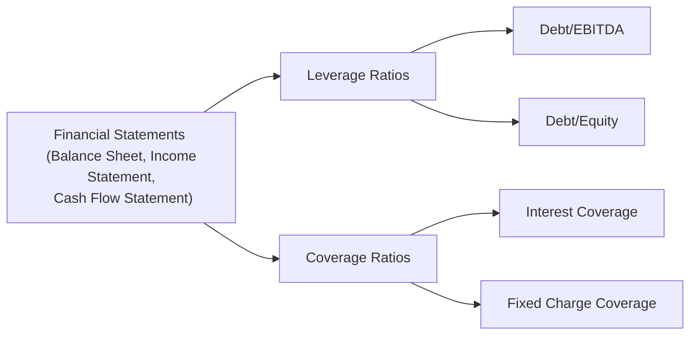
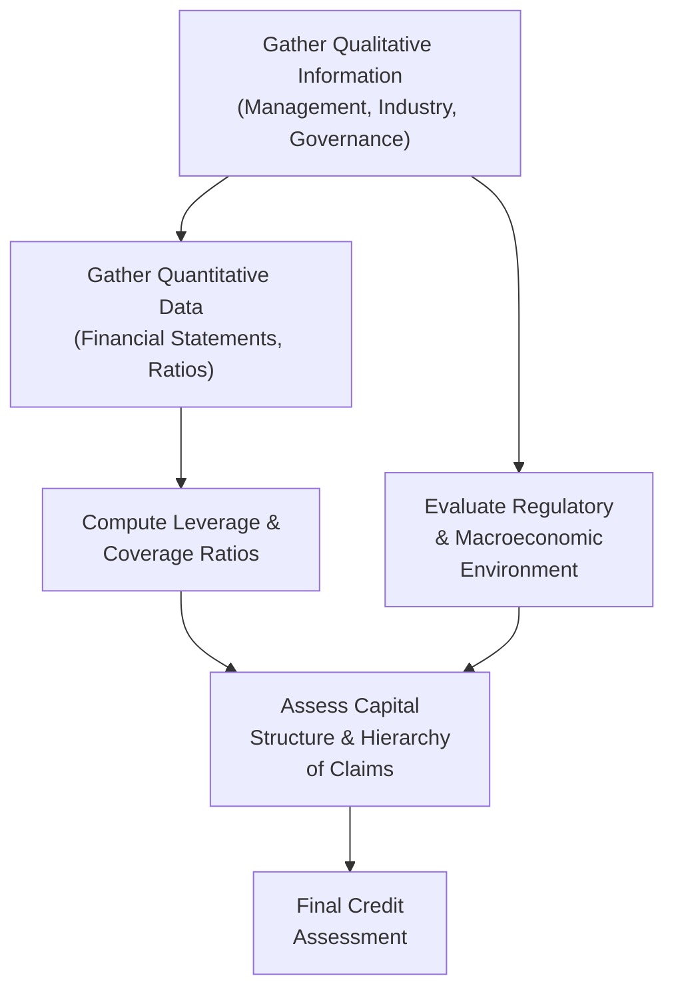

## 7.16 Credit Analysis for Corporate Issuers

Have you ever looked at a company’s financial statements and wondered, “Um, is this company actually able to repay its loans?” That’s basically the heart of credit analysis. It’s not just about plugging numbers into a spreadsheet—though that’s definitely part of it. It’s also about diving deep into how a company works, who’s running it, what markets it serves, and whether it has the right capital structure to survive the inevitable ups and downs of the business cycle.

Credit analysis for corporate issuers is a mix of an art and a science. We look at quantitative measurements—like debt ratios, yields, and coverage calculations—but we also pay attention to a firm’s management quality, competitive moat, and the broader economic backdrop. In this section, let’s explore some of the key factors and frameworks that go into forming an opinion on a corporate issuer’s creditworthiness.

### Introduction

When lenders or bondholders extend credit (like buying corporate bonds or offering a loan), they want to understand the odds of getting their money back—plus interest. The process of gauging these odds is credit analysis. Analysts, rating agencies, and institutional investors spend a lot of time learning everything they can about the potential borrower. It reminds me of the time I worked with a mid-sized manufacturing company. Their financials looked spectacular on paper—low debt-to-EBITDA, a decent interest coverage ratio—but, behind the scenes, they were losing key customers to global competition. This real-world example taught me that credit analysis is a lot more than just crunching the most recent numbers.

Below, we’ll examine two broad categories that matter in credit analysis: qualitative factors (e.g., management, governance, competitive position) and quantitative factors (e.g., leverage ratios, coverage ratios, liquidity). We’ll also tackle broader topics like industry trends, macroeconomic conditions, and capital structure intricacies.

---

### Understanding Qualitative Factors

Credit analysis starts with some old-fashioned due diligence. Sure, we can’t measure “management quality” as precisely as we measure Debt/EBITDA. But, in my opinion, it’s often just as important to get a feel for the people and culture driving the company.

#### Management and Corporate Governance

• Management Quality: A firm’s leadership sets its strategy, culture, and tone. Do they adapt or cling to outdated models? Have they demonstrated integrity and transparency? Do they have a track record of delivering on their promises? You might see disclaimers that past performance isn’t always predictive of future success, but it can sure give you a hint.

• Corporate Governance: Good governance controls can help reduce the risk of management making off-the-cuff (and possibly detrimental) decisions. If you see a board stacked with cronies or a complicated ownership structure, you might raise an eyebrow. A strong governance framework often correlates with better long-term credit stability.

#### Competitive Position and Market Share

How about the company’s competitive position in its industry? Is it the big fish or a small newcomer? Maybe it’s dabbling in a mature, ultra-competitive sector with modest growth potential—or perhaps it’s an innovative disruptor revolutionizing the market. The sustainability of market share, brand equity, and pricing power all factor into whether the company can consistently generate cash flows to service its debt. 

#### Regulatory or Legal Risks

Companies operating in heavily regulated industries—like utilities, banking, or healthcare—face extra attention from regulators. Ever see how a single regulatory decision can flip a company’s fortunes overnight? A new regulation can impose heavy compliance costs, which might hurt free cash flow. On the flip side, it can keep out new competitors, preserving a firm’s market share. The key is to know which side of the coin the company is on.

---

### Understanding Quantitative Factors

Now let’s get into the numbers. For me, the beauty of quantitative analysis is the clarity it can provide—though we must interpret the numbers in context. A typical approach might involve analyzing a firm’s balance sheet, income statement, and cash flow statement, then calculating various ratios.

#### Leverage Ratios

Companies that load up on debt may face bigger risks if their cash flows dry up or interest rates rise. Some popular leverage ratios:

• Debt-to-EBITDA: This ratio measures how many years of current EBITDA (Earnings Before Interest, Taxes, Depreciation, and Amortization) would be required to pay off the company’s total debt. A lower number generally indicates a lighter debt burden relative to operating earnings.

• Debt-to-Equity: The ratio of total debt to shareholders’ equity shows the degree to which a company is financing its operations through debt versus wholly-owned funds. A higher ratio suggests more leverage, which can amplify both returns and risks.

These ratios vary by industry. For instance, a telecom giant might have a higher debt load compared to a tech startup with minimal hard assets, so you want to benchmark the ratio to the industry norms.

#### Coverage Ratios

Coverage ratios help you see if a company is able to meet its interest obligations, or if it’s tiptoeing into default territory.

• Interest Coverage (EBIT/Interest): This ratio compares earnings before interest and taxes (EBIT) to interest expense. If it’s 5×, that means a company’s EBIT can cover its interest payments five times over. Sounds good, right? But if it’s close to 1.0×, you start sweating—one bad quarter could push the coverage below the threshold, risking default.

• Fixed Charge Coverage: A more comprehensive measure that factors in not just interest, but also lease obligations or other “fixed” charges. It indicates the company’s ability to pay all recurring charges on a more holistic basis.

---

### Key Ratios in Credit Analysis

Below is a quick visualization of how leverage and coverage ratios fit into a broader framework. Imagine we have a bird’s-eye view of an issuer’s financial standing:

Ultimately, you’ll combine these metrics with your qualitative impressions to see if a corporate issuer is well-positioned or if it’s on shaky ground.

---

### Industry, Regulatory, and Macroeconomic Considerations

Although analyzing financial statements and governance is essential, you also need to step back and ask: “Well, how is the overall industry performing?” If the company is making microchips, then demand cycles and trade policies might affect its revenue stability. If it’s in oil and gas, you’ll be heavily influenced by commodity price swings. 

#### Industry Dynamics

Let’s say you’re analyzing a paper manufacturer. That might sound stable until you factor in digitization and the rising global supply of recycled paper. Suddenly, you realize the industry could be in a structural decline, and that’s an immediate red flag for a long-term investor. Industry structure, competition, growth prospects, and barriers to entry all shape a firm’s ability to generate cash flow to meet interest and principal payments.

#### Regulatory Environment

Sometimes, a favorable regulatory shift can open up new markets or make life easier for incumbents. But the opposite can happen, too. A surprise tax or tariff could weigh on the issuer’s earnings or hamper its capital spending plans. As a credit analyst, you need to keep one eye on any changes that might cause new costs or hamper revenue streams.

#### Macroeconomic Trends

Interest rates, inflation, and currency movements can dramatically alter a company’s profitability and credit profile. A strong dollar might squeeze export-heavy businesses. Rising interest rates might cause an indebted company’s interest expenses to spike. Sometimes, the difference between survival and default can hinge on how well the issuer navigates these macro challenges.

---

### Capital Structure and Hierarchy of Claims

Now let’s talk about what happens when a company can’t pay its debts. If a company defaults or goes bankrupt, which creditors get paid first? This is where capital structure and hierarchy of claims come in.

At the top of the hierarchy are typically senior secured debt holders. They’re secured by specific assets—like real estate, machinery, or receivables—and thus have a stronger claim. Next come senior unsecured creditors, then subordinated debtholders, and, finally, equity holders. During bankruptcy or any distressed scenario, the recovery (aka how much each party actually gets back) depends on the value of assets and the order in which claims are paid out.

You might see a corporate issuer with multiple layers of debt: bank loans, bonds, convertible notes, etc. Understanding the relative priority of these obligations is critical for pricing risk. If you’re analyzing a high-yield bond that’s subordinated, you want to know what portion of the firm’s assets are already pledged to senior obligations. Because, obviously, you stand behind the senior lenders in a worst-case scenario.

---

### Real-World Example: Simplified Energy Company

Let’s say we’re analyzing a mid-sized energy exploration and production (E&P) firm. Suppose it’s rated BB by a major agency. It has:

• A strong management team that’s successfully navigated past commodity price crashes.  
• Moderate leverage, with Debt/EBITDA around 3×.  
• Solid coverage ratio of 4×.  
• Robust hedging strategy to mitigate oil price swings.  

But the commodity environment is uncertain. If oil prices drop 40%, our coverage ratio might plummet to 1.5× or even lower. Plus, the company has intangible drilling costs that are capitalized, which could inflate its asset base on the balance sheet. Once we factor in potential asset write-downs, that relatively safe 3× Debt/EBITDA might spike overnight. So, the key takeaway is to be mindful of how quickly the credit profile can shift, especially in a commodity-driven industry.

---

### Best Practices and Common Pitfalls

• Always rely on multiple ratios: Some folks overemphasize a single ratio (like just looking at Debt/EBITDA). A comprehensive approach is best.  
• Compare to industry norms: A ratio that appears “high” might be normal in a capital-intensive industry.  
• Look beyond the static snapshot: Conduct scenario analysis (e.g., what if interest rates rise by 200 basis points?).  
• Understand the cash flow statement thoroughly: Earnings can be manipulated more easily than cash flows, so watch out for unusual working capital changes or capitalizing operating expenses.  
• Beware of short-term fixes: A borrower might issue new debt to pay off old debt, kicking the can down the road but not improving overall credit health.  
• Stay attuned to management’s credibility: If management consistently overpromises and underdelivers, or if they create last-minute “one-time” adjustments, you might suspect deeper issues.

---

### Mermaid Diagram of a Simple Credit Analysis Process

Below is a simplified overview of how an analyst might approach credit evaluation, tying all these concepts together:

---

### Conclusion

Credit analysis for corporate issuers is both holistic and detailed. On the one hand, you’re digging into income statements and performing ratio analysis; on the other, you’re gauging how global interest rates and shifting regulatory policies might upend a business. It’s part detective work and part puzzle-solving. My hope is you walk away from this chapter feeling more confident—and maybe even a bit excited—about corporate credit analysis.

Keep refining your skills. If you’re anything like me, you’ll still make mistakes from time to time (hey, it happens!). But every project, every rating document, and every challenging conversation with management becomes a chance to learn. Just keep your eyes open to the bigger picture and never forget that behind the numbers, there’s a real business with people, products, and risks that can’t always be computed into neat formulas.

---

### References and Further Reading

• Altman, E. I. “Corporate Financial Distress and Bankruptcy.”  
• CFA Institute Level I Curriculum, corporate credit analysis readings.  
• Standard & Poor’s and Moody’s corporate rating methodologies.  

---

## Practice Questions: Test Your Knowledge of Credit Analysis for Corporate Issuers



### A key reason to analyze both qualitative and quantitative factors in corporate credit analysis is:

- [ ] Only qualitative factors matter for determining a firm’s creditworthiness.  
- [ ] Quantitative factors are always unreliable in volatile markets.  
- [x] Different dimensions of a company’s operations affect its ability to service debt.  
- [ ] Ratios alone can fully predict default risk.  

> **Explanation:** In reality, companies are dynamic entities. Quantitative ratios inform you about the current state, while qualitative factors—like management quality and industry dynamics—help validate the sustainability of those metrics.

### Which of the following is a commonly used leverage ratio?

- [x] Debt/EBITDA  
- [ ] Margin of Safety  
- [ ] Return on Equity  
- [ ] Dividend Payout Ratio  

> **Explanation:** Debt/EBITDA is a core leverage metric, indicating how many years of current earnings it would take to pay down debt. ROE and Dividend Payout Ratios are not typically used to gauge leverage.

### In assessing an issuer’s interest coverage ratio, you would most likely use:

- [x] EBIT / Interest Expense  
- [ ] EBITDA / Cost of Goods Sold  
- [ ] EBIT / Total Liabilities  
- [ ] Net Income / Interest Expense  

> **Explanation:** Times Interest Earned (EBIT/Interest Expense) is a common way to measure how well a firm’s earnings cover its interest obligations.

### If two senior secured bondholders claim the company’s same assets for collateral, the bond with the first-lien (first-priority) can:

- [x] Have a stronger claim in a liquidation scenario.  
- [ ] Defer automatically to the second-lien lender.  
- [ ] Share collateral equally at all times.  
- [ ] Require equity holders to pay them first.  

> **Explanation:** First-lien debt holders have the first claim on secured assets in the event of default or liquidation, giving them higher priority over second-lien holders.

### One common pitfall in credit analysis is:

- [x] Relying on a single ratio or metric to measure credit risk.  
- [ ] Comparing a company’s ratios to industry norms.  
- [ ] Using scenario analysis to stress test assumptions.  
- [ ] Evaluating the company’s cash flow statement.  

> **Explanation:** A tunnel-vision focus on one ratio can lead to incorrect conclusions. Credit analysis is most reliable when a variety of ratios and qualitative factors are considered.

### A company’s capital structure reveals:

- [x] The hierarchy of claims among different debt and equity instruments.  
- [ ] The company’s total market size.  
- [ ] The total number of shares outstanding.  
- [ ] The tax regime in the company’s home country.  

> **Explanation:** Capital structure defines how a firm finances itself through various layers of debt and equity, establishing the order of repayment in distress situations.

### Within a heavily cyclical industry, a firm’s credit profile might be more vulnerable if it:

- [x] Has high fixed costs and high leverage.  
- [ ] Maintains low-cost, flexible operations and aligns capacity quickly.  
- [x] Relies heavily on short-term funding in a volatile market.  
- [ ] Operates with a large pool of unrestricted cash.  

> **Explanation:** Cyclical industries experience swings in demand and pricing. A firm with high fixed costs, high leverage, or heavy short-term funding needs becomes more vulnerable in downturns.

### Which statement about management quality in credit analysis is true?

- [x] Effective, transparent management can improve a firm’s resilience and credit profile.  
- [ ] Management quality is irrelevant if the company’s coverage ratios are high.  
- [ ] Corporate governance has nothing to do with risk mitigation.  
- [ ] Management credibility is unimportant when assessing default risk.  

> **Explanation:** Management sets the company’s strategic direction and risk culture. High-quality, transparent leadership often correlates with stronger risk management and credit stability.

### In a distressed scenario, which creditors typically have priority?

- [x] Senior secured debt holders  
- [ ] Subordinated bondholders  
- [ ] Common equity shareholders  
- [ ] Preferred stockholders  

> **Explanation:** Usually, in bankruptcy or liquidation, senior secured debt holders have the first claim on specific collateral, followed by unsecured and subordinated classes, and equity is last.

### Adjusted Interest Coverage Ratios typically:

- [x] Factor in other fixed charges (like leases) into the coverage measure.  
- [ ] Ignore interest completely and focus on revenue alone.  
- [ ] Base calculations solely on net income.  
- [ ] Include only principal repayments of debt.  

> **Explanation:** An adjusted coverage ratio provides a more comprehensive view by including fixed charges (like lease payments) to assess a firm’s full capacity to meet obligations.


