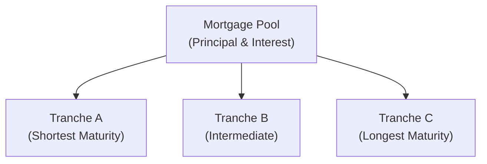

## 7.19 Mortgage-Backed Security (MBS) Instrument and Market Features

Mortgage-backed securities (MBS) might sound intimidating at first, but they’re actually quite straightforward once you see how the pieces fit together. I remember when I took a finance class (it feels like ages ago), I was so confused by all these complicated-sounding instruments—“pass-through,” “collateralized mortgage obligation,” what does that even mean, right? But if we dig in step by step, we’ll see that an MBS is basically a bundle of mortgage loans that are packaged and sold as a single security to investors. Those mortgage payments you or your neighbors make each month? They get funneled to the investors who hold these securities.

This section introduces you to the nuts and bolts of MBS, focusing on both residential mortgage-backed securities (RMBS) and commercial mortgage-backed securities (CMBS). We’ll chat about prepayment risk, the difference between pass-through securities and CMOs, how credit and default risk impact valuation, and—last but not least—why property income streams matter a lot for CMBS. By the end of this discussion, you’ll be armed with enough knowledge to participate in an MBS conversation at a cocktail party—or at least impress a few folks with your new “fun facts” about the mortgage market.

Remember: The best way to learn all this is to remain curious. So if something here sparks your interest, don’t hesitate to explore further through the references at the end. Let’s dive in!

---

### A Quick Overview of Mortgage-Backed Securities

MBS are a type of fixed-income instrument created by pooling mortgage loans—usually a large group of them—that are then sold to investors. The key idea is that homeowners or commercial property owners make monthly payments (principal + interest) on their loans, and those payments are eventually “passed through” to the investors holding the MBS in one form or another.

Why do this? Well, originators (like banks or other lending institutions) often want to free up their balance sheets and obtain liquidity so they can make even more loans. By packaging these mortgages into securities and selling them, originators get immediate funds, and investors gain access to what might be a stable and diversified set of cash flows.

Below is a simple diagram that illustrates, at a very high level, how funds and mortgages flow in an MBS structure:

- Homeowners (in the case of RMBS) or commercial property owners (in the case of CMBS) make monthly mortgage payments.
- Mortgage originators either keep the mortgage loans on their books or sell them to an agency or a structured investment vehicle (often called a special purpose vehicle, or SPV).
- The SPV pools these loans and issues securities—MBS—to investors. The monthly mortgage payments (interest plus scheduled principal, plus any unscheduled prepayments) pass through to investors.

---

### Residential Mortgage-Backed Securities (RMBS)
RMBS are backed by pools of residential mortgage loans. This means the underlying collateral is your typical home mortgage—think single-family residences, condominiums, or small multifamily dwellings. Of course, there are myriad underwriting standards and property types, but at its heart, RMBS basically represent the broad swath of “homeowner” mortgages that get packaged up.

#### Prepayment Risk in RMBS
With RMBS, you’ll hear about prepayment risk quite a bit. This might be the single largest source of “surprise” for investors in these securities. Prepayment happens whenever a homeowner decides to pay off a portion (or the entirety) of their mortgage ahead of schedule. Maybe they refinanced at a lower rate. Or they sold their house. Or they just had a windfall and wanted to pay down the mortgage early.

• Contraction risk: This is the risk that mortgage holders will pay off their loans faster when interest rates fall. Investors receive principal back sooner but must reinvest it (often at lower rates).  
• Extension risk: The opposite happens when interest rates rise—fewer homeowners refinance, meaning principal returns to investors more slowly than initially expected.  
• Reinvestment risk: If a big chunk of principal is prepaid when yields are low, you’ll have to put that cash to work in comparably low-yielding alternatives.

When I first heard about this, I had to think of it in everyday terms: If I prepay my mortgage, that’s good for me (less interest in the long run), but it changes the timing of cash flows for whoever owns my mortgage if it’s packaged in an MBS. That shifts—and can sometimes reduce—the investor’s return if interest rates have fallen, because they now have principal in hand that has to be reinvested at a potentially lower yield.

#### Pass-Through Structures vs. Collateralized Mortgage Obligations (CMOs)
RMBS can be built in a couple of different ways. The simplest structure is the pass-through MBS. In these, all investors share pro rata in the monthly principal and interest from the mortgage pool. If the pool experiences faster or slower prepayments, all investors get a higher or lower portion of their principal back at the same time.

CMOs, on the other hand, slice the mortgage pool into different layers (called tranches). Each tranche has its own coupon rate, maturity, and priority in receiving principal payments. By doing this, CMOs try to re-allocate or manage different types of risk—mainly prepayment risk. For instance, a “Planned Amortization Class” (PAC) tranche may get a more stable schedule of principal payments, but that stability is partially achieved by shifting more prepayment risk to other tranches (called “support” tranches).

Here’s a simplified illustration of how tranching might work in a CMO:

- Tranche A typically receives principal repayment first (plus interest on the balance).  
- Tranche B starts receiving principal payments only after Tranche A is completely retired (or partially, depending on structure).  
- Tranche C is last in line to get principal payments.  

This sequential pay structure can help tailor different risk profiles for investors with different appetites, effectively creating more predictability in some tranches by concentrating risk in others.

---

### Commercial Mortgage-Backed Securities (CMBS)
CMBS are backed by mortgages on commercial properties: office buildings, hotels, shopping centers, apartment complexes, and so on. Now, unlike residential mortgages, where each homeowner is typically just one family or individual, commercial mortgages often involve bigger-scale loans (with correspondingly more complicated underwriting). And they rely on income generated from the property, such as rents from tenants.

CMBS typically come with various forms of credit enhancement and structures to protect investors from property-level or borrower-level defaults. These might include overcollateralization, reserve funds, or subordination within tranches, all designed to absorb losses in case of borrower defaults.

#### Call Protection Measures
One of the hallmarks of CMBS is that they often provide greater call (prepayment) protection than RMBS. Commercial property owners are generally less likely to refinance as frequently as homeowners (though it still happens). Plus, many commercial mortgages have lockout periods or penalty provisions that discourage early payoff.

Some typical call protection measures in CMBS:
- Lockouts: Borrowers are contractually prohibited from prepaying their mortgage for a specified period.  
- Prepayment Penalties: If the borrower does prepay, they have to pay an additional fee to compensate the lender.  
- Yield Maintenance: The borrower might have to pay an amount that effectively makes the lender “whole” based on current interest rates—thus discouraging refinancing in a falling rate environment.  
- Defeasance: The borrower replaces the mortgage collateral with other securities (often Treasuries) that replicate the cash flows of the original loan.

These measures help ensure a more predictable maturity profile for CMBS investors, which is super useful if you’re trying to manage your cash flows.

---

### Prepayment and Default Considerations
Yes, we keep mentioning “prepayment.” In CMBS, that risk might be lower than in RMBS, but the risk of default can be higher if tenants stop paying rent, or if a mall or office building runs into trouble. If the property’s cash flow can’t cover the mortgage payments, you can run into delinquency or ultimately foreclosure, which leads to losses for the MBS investors. 

When I was learning about CMBS for the first time, one point that stuck out was how differently property risk behaves compared to residential mortgages. You might see an office building lose major tenants, or a shopping mall suffer massive vacancies if shoppers switch to e-commerce. It’s more “macro” risk, if you will, because the default might hinge on larger business cycles or structural changes in consumer behavior.

---

### Credit Risk, Default Rates, and Property Dynamics
Both RMBS and CMBS involve analyzing credit risk. With RMBS, you look at FICO scores, loan-to-value (LTV) ratios, documentation type, debt-to-income (DTI) ratios, and so forth. With CMBS, you’ll tend to look at the debt service coverage ratio (DSCR), appraisal values, type and location of property, local and macroeconomic conditions, and so on.

In either case, rating agencies, institutional investors, and big banks dive deep into these details to figure out how likely each mortgage pool is to generate all the necessary payments, or if there’s a risk that some portion of investors might not get everything they’re owed. That’s why subprime MBS, for example, have historically had higher loss rates, as was painfully discovered during the 2008 financial crisis. And why “AAA”-rated MBS (often with government agency backing or strong credit enhancements) might be considered safer.

Some big factors that drive MBS investment decisions:
- Interest rate environment: If rates go down, prepayments typically go up for RMBS, which affects returns and portfolio strategy.  
- Economic conditions: Commercial tenants might default if there’s a recession, or homeowners might lose jobs, resulting in mortgage defaults.  
- Regulatory changes: Government agencies such as Ginnie Mae, Fannie Mae, and Freddie Mac might change guidelines, which can alter the mortgage finance landscape.  
- Changing property usage: In commercial real estate, we’re seeing more changes—like the shift from brick-and-mortar retail to online. This can affect cash flows for those who lease commercial space.  

---

### Common Pitfalls and Strategies to Overcome Them
• Failing to consider prepayment risk. It’s tempting to see a yield on a mortgage-backed security and forget about the possibility that it might vanish if borrowers prepay. Make sure you have the tools and analytics to estimate prepayment speeds.  
• Treating all MBS the same. RMBS and CMBS differ in the underlying collateral essentials, call protection, and default dynamics. If you lump them all together, you might end up with a mismatch between your risk tolerance and the actual risk profile of your portfolio.  
• Overlooking property market fundamentals for CMBS. If you’re analyzing a commercial MBS, you can’t just rely on broad statements about the real estate market. It’s crucial to actually look at the property type (multifamily, office, retail, etc.), location, and the local economy.  
• Underestimating extension risk. Sure, you’re aware that folks might refinance if rates go down, but also keep in mind that if rates go up, you might be stuck with mortgage cash flows for longer than you initially expected.  
• Not stress-testing your valuations. Monte Carlo simulations, scenario analyses, or just good old-fashioned “what if” questions can help you see how changes in interest rates or default scenarios could affect your MBS investment.

---

### Example Exercise: Predicting Prepayments
Let’s take a simple hypothetical example to illustrate how prepayments can affect value. Suppose you buy an RMBS that has an expected weighted-average life of 5 years if prepayment speeds remain stable. If interest rates drop significantly, a lot of borrowers refinance, and your 5-year security effectively becomes a 3-year security because principal flows back to you faster. If you had locked in at a high yield originally, that’s now “lost opportunity” to keep earning that higher interest rate.

Conversely, if interest rates jump higher, prepayments might slow, turning your 5-year security into a 6- or 7-year security. So you get stuck holding an instrument that yields below-market rates.

These shifts can significantly alter the fair value of your MBS holdings, which is precisely why modeling prepayment speeds is so crucial. Many investors use proprietary or third-party models to forecast prepayments under different interest rate scenarios. The classic measure is the PSA (Public Securities Association) prepayment model, which expresses prepayment rates as a percentage of a “standard” baseline.

Example formula you might see for discounting MBS cash flows (simplified version):  


\text{Price of MBS} = \sum_{t=1}^{T} \frac{\text{Expected Principal + Interest}_t}{(1 + r_t)^t}


Where:
• T is the time until maturity (factoring in prepayment assumptions)  
• r_t is the appropriate discount rate for each time period (based partly on the yield curve and risk spreads)  
• “Expected Principal + Interest” includes the scheduled payments and anticipated prepayments

---

### Best Practices to Manage MBS Investments
• Leverage historical prepayment data but don’t assume it’s an absolute predictor of the future.  
• Use scenario analysis to better understand the yield and duration profile of your MBS investments.  
• Diversify across different MBS “vintages” (the year the mortgages were originated) to spread out prepayment and credit risk.  
• For CMBS, pay special attention to the call protection features—and also to the liquidity of the property markets in which the mortgages are originated.  
• Stay up to date on changes to government agency rules and the housing market. If you’re in the U.S., keep track of Fannie Mae, Ginnie Mae, and Freddie Mac announcements—these can dramatically affect how mortgages are originated (and thus how MBS are structured).  

Anyway, that’s all hopefully enough to give a sense of just how wide-ranging MBS analysis can get. Some folks even devote their entire careers to modeling prepayments alone, so you can imagine the level of detail that goes into professional analytics.

---

### Concluding Thoughts
Mortgage-backed securities are a huge part of the fixed-income universe, bridging individual property financing with global capital markets. RMBS come with that heavy dose of prepayment risk from homeowners and rely on stable housing markets; CMBS hinge on property income streams and default risk from the commercial side of real estate. Both instruments use tranching and structural features to manage risk, and both can be quite profitable if you have the skill, patience, and risk tolerance.

In my personal experience, the biggest pitfall is underestimating how quickly the environment can change. When rates drop, folks prepay in droves, and your return can shrink right before your eyes. When commercial property markets stumble, you can wind up with big hits to property values. It’s all about balancing that risk and reward. So as you continue to learn about fixed-income securities—and practice your bond pricing, duration, and spread skills—try zeroing in on how these unique MBS features fit into the big picture. Understanding them not only enriches your knowledge but can also be super useful if you ever plan to invest in real estate or manage a mortgage portfolio.

---

### References & Further Reading
• Fabozzi, F. “The Handbook of Mortgage-Backed Securities.”  
• CFA Institute Level I Curriculum, sections on MBS.  
• Ginnie Mae, Fannie Mae, Freddie Mac official resources for mortgage pass-through mechanics.  
• Rating agencies (Moody’s, S&P, Fitch) for methodologies on credit enhancement and default analysis.  

(You might also want to check news sources like the Financial Times or the Wall Street Journal for current developments in the housing and commercial real estate markets—these can have an immediate effect on MBS valuations.)

---

## Test Your Knowledge of Mortgage-Backed Securities



### Which of the following best describes a difference between RMBS and CMBS?

- [x] RMBS are backed by residential mortgages with higher prepayment sensitivity, whereas CMBS rely on income streams from commercial properties and typically have greater call protection features.
- [ ] RMBS usually have longer maturities than CMBS because commercial leases are short-term.
- [ ] CMBS face greater interest rate risk than RMBS because commercial borrowers never refinance.
- [ ] RMBS never use tranching structures, only CMBS do.

> **Explanation:** RMBS are backed by residential properties and are particularly sensitive to prepayments (e.g., homeowners refinancing). CMBS are backed by commercial properties and typically include lockouts, yield maintenance, or prepayment penalties.

### In a pass-through MBS structure, investors:

- [ ] Receive only interest payments while the originator retains principal.
- [x] Share pro rata in the principal and interest payments of the underlying mortgage pool.
- [ ] Receive no payments until maturity.
- [ ] Only receive payments if interest rates rise above a certain threshold.

> **Explanation:** Pass-through MBS “passes” all monthly principal and interest from the underlying pool directly to investors on a proportional basis.

### One key purpose of tranching in a CMO structure is to:

- [x] Redistribute prepayment risk among different classes of bonds.
- [ ] Eliminate prepayment risk entirely.
- [ ] Ensure that no principal repayments occur until the end of the mortgage term.
- [ ] Prevent any junior bondholders from receiving interest payments.

> **Explanation:** Tranching is used to create different risk/return profiles by assigning various priorities for principal repayment across separate classes (tranches), which helps manage or redistribute prepayment risk.

### A major difference between residential mortgage-backed loans and commercial mortgage-backed loans is that:

- [ ] RMBS have no prepayment options, while CMBS have unlimited prepayment flexibility.
- [x] CMBS typically include call protection measures like lockouts or yield maintenance, reducing unscheduled prepayments.
- [ ] RMBS are more likely to default and thus require yield maintenance.
- [ ] CMBS cannot be refinanced under any circumstances.

> **Explanation:** CMBS often incorporate contractual terms to limit or penalize prepayments, while residential mortgages typically have fewer barriers to refinancing.

### Which of the following statements about prepayment risk is correct?

- [x] Contraction risk occurs when interest rates drop and prepayments increase, causing investors to lose higher-yielding investments sooner.
- [ ] Contraction risk is highest during rising interest rate environments.
- [x] Extension risk occurs when interest rates increase and prepayments slow.
- [ ] Both contraction and extension risk are absent in RMBS because homeowners are legally obligated to pay until maturity.

> **Explanation:** RMBS investors may face contraction risk (early return of principal) when interest rates fall and homeowners refinance. If rates rise, prepayments slow, leading to extension risk.

### In assessing credit risk for an MBS, an investor should examine:

- [x] Borrower payment history, loan-to-value ratios, and macroeconomic factors such as unemployment trends or property vacancies.
- [ ] Only the interest rate environment, since default risk is negligible.
- [ ] The government’s debt-to-GDP ratio.
- [ ] Stock market price movements.

> **Explanation:** Mortgage credit risk depends on borrower characteristics (income, debt, credit scores), LTV ratios, and broader economic activity that affects default likelihood.

### Which best describes a lockout provision in a CMBS?

- [ ] It prevents commercial real estate lenders from demanding partial prepayments.
- [x] It prohibits the borrower from prepaying the mortgage for a specified time.
- [ ] It forces the borrower to maintain a certain level of occupancy.
- [ ] It automatically converts the floated rate to a fixed rate for the entire loan term.

> **Explanation:** A lockout period is a common call protection measure that legally restricts borrowers from paying off the principal ahead of schedule.

### Which scenario is a classic example of extension risk in an MBS?

- [ ] Borrowers refinance quickly when interest rates fall, returning principal ahead of schedule.
- [x] When interest rates rise, fewer borrowers refinance, prolonging the security’s maturity.
- [ ] When interest rates rise, the bond’s duration decreases unexpectedly.
- [ ] When borrowers default, accelerating principal repayments to the bondholders.

> **Explanation:** Extension risk manifests if rates increase, slowing prepayments and effectively extending the life of the security.

### Why might investors choose a “support tranche” in a CMO?

- [x] They wish to earn a potentially higher yield in exchange for taking on more prepayment variability.
- [ ] They automatically receive all principal first, reducing their prepayment risk.
- [ ] They have zero credit risk but high default rates.
- [ ] They prefer the most stable cash flow structure with minimal extension risk.

> **Explanation:** Support tranches absorb more of the volatility in prepayments (both up and down), typically bearing higher risk—and potentially higher reward—than more senior or PAC tranches.

### In a typical CMBS issuance, "call protection" provisions are:

- [x] True
- [ ] False

> **Explanation:** CMBS often include call protection measures, such as lockouts and yield maintenance, to reduce the uncertainty of prepayments.


