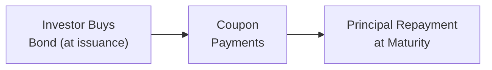

## 7.2 Fixed-Income Cash Flows and Types

Sometimes I think back to my very first encounter with bonds and wonder: “Why are there so many different ways for a company to pay me back?” Um, well, as it turns out, the diversity in bond structures isn’t there just to make life complicated. It’s actually to address the varying needs of investors, issuers, and the market. In other words, different bond structures are specifically designed to manage specific types of risk, payment timing preferences, tax considerations, and investor appetites.

In this section, we’ll discuss how cash flows differ from bond to bond. We’ll walk through bullet bonds, amortizing bonds, sinking funds, step-up notes, floating-rate notes, payment-in-kind bonds, and more. Also, we’ll explore embedded features like calls, puts, and convertibility, and how these features shift risk between the parties involved. Let’s dive in.

--------------------------------------------------------------------------------
### Overview of Fixed-Income Cash Flows

Broadly, when we talk about fixed-income instruments—commonly called bonds—we focus on two main types of payments:
• Coupon Payments: Interest payments that occur periodically (typically semiannually or annually).  
• Principal Repayment (Face Value Repayment): The amount the issuer returns to the investor at maturity or on a schedule (in the case of amortization).

At their core, most bonds have a standard lifecycle:
1. The investor buys the bond (the bond is issued).  
2. The issuer pays the investor interest over the life of the bond.  
3. At maturity (or earlier in certain cases), the investor receives the principal (face value) back.

Below is a simple visual representation of a typical bond lifecycle. I know it looks simple, but it captures the essence of many structures.

Anyway, that’s the super basic shape. Let’s dig deeper.

--------------------------------------------------------------------------------
### Bullet Bonds
A bullet bond is basically your “plain vanilla” straight bond. It pays a regular coupon—say an annual or semiannual coupon—throughout the bond’s life. The entire principal is paid back on the bond’s maturity date. A typical U.S. Treasury bond is a classic bullet structure.

• Example:  
  Suppose a corporation issues a 5-year, 5% annual-coupon bullet bond with a $1,000 face value. Investors will receive $50 each year (5% of $1,000) for five years. At the end of year five, they’ll also get back their $1,000 of principal.

Bullet bonds are popular because they’re straightforward: you know your interest payment, you know your final redemption date, and that’s that.

--------------------------------------------------------------------------------
### Amortizing Bonds
An amortizing bond repays its principal over the life of the bond, rather than as a single sum at maturity. That means each coupon date could have two components:
• Interest Payment (like usual), plus  
• A Portion of the Principal Repayment (the “amortizing” part)

• Example:  
  Think about a mortgage-backed security or certain corporate debt structures. Let’s say we have a 3-year bond with a face value of $1,000 and a coupon rate of 6% per year, but it amortizes in equal installments. Each year, you’d get some fraction of your principal returned, in addition to the interest due on the outstanding principal.

Amortizing bonds can help reduce credit risk for investors because they regularly receive principal back, which lowers the outstanding loan balance over time.

--------------------------------------------------------------------------------
### Sinking Funds
Sinking fund provisions basically force the issuer to “chip away” at the total bond principal over time. It’s a bit like required prepayments. The issuer must retire a specified portion of the bond issue periodically, which might happen through open-market bond purchases or calling (redeeming) a portion of the outstanding bonds at preset dates.

1. Benefit for Investors: Lower default risk because it reduces the issuer’s outstanding debt gradually.  
2. Drawback: Investors might face call risk if the issuer redeems the bonds early to meet sinking fund requirements.

Sometimes I joke that sinking funds keep everybody from “sinking” if the issuer waits until the last minute to repay a huge principal. Instead, principal obligations are spaced out, which can make the bond safer (and sometimes lowers the required yield).

--------------------------------------------------------------------------------
### Floating-Rate Notes (FRNs)
Unlike a fixed-rate bond, a floating-rate note has an interest payment that moves with a reference rate (for example, LIBOR or SOFR, plus a spread). This means:
• The coupon resets every period (e.g., every three or six months).  
• If the reference interest rate goes up, the coupon payment typically goes up.  
• If the reference rate goes down, the coupon payment goes down.

Why do investors like or dislike FRNs? Well, if you think rates will rise, the FRN’s coupon will adjust upward, protecting you from some interest-rate risk. If you think rates will fall, an FRN might pay you less over time. So it’s a trade-off.

--------------------------------------------------------------------------------
### Step-Up Notes
Step-up notes have a coupon rate that increases by a predetermined amount at a certain time (or times) in the future. One might see a step-up note where the coupon is 3% for the first two years, then escalates to 5% for the next three years.

• Use Cases:  
  Companies might issue step-up notes to offer some initial “low cost” financing, and then sweeten the coupon for investors later. Investors might be drawn to the bond’s higher future interest, particularly if rates or inflation are expected to rise.

--------------------------------------------------------------------------------
### Payment-in-Kind (PIK) Bonds
Payment-in-kind bonds (PIKs) could be described as the “IOU with an IOU” method. Instead of paying you cash coupon interest each period, the issuer can choose to pay additional bonds or notes of equivalent value. So if you hold $1,000 face value, the accrued interest might be paid as extra bond principal instead of cold hard cash. Over time, you end up with more face value of the bond if the issuer opts for PIK, which could pay off big if the bond eventually redeems at par.

• Investor Perspective:  
  – Potential for higher yields, but also higher risk.  
  – Less immediate cash flow.  
• Issuer Perspective:  
  – Conserves cash in the short term.  
  – Potentially more expensive in the long run if they have to repay a larger principal.

These are more common in leveraged buyouts or high-yield markets where issuers want to manage near-term cash flow constraints. 

--------------------------------------------------------------------------------
### Embedded Options: Callable, Putable, and Convertible Bonds
Bonds can include embedded options that affect how (and when) cash flows arrive. Let’s consider three main categories:

#### Callable Bonds
• The issuer has the right (but not the obligation) to repay the debt before maturity.  
• Usually, the bond contract defines call dates and call prices.   
• Issuer Advantage: If interest rates drop, the issuer can “refinance” at a cheaper rate.  
• Investor Disadvantage: If the bond is called when rates fall, investors face reinvestment risk (they must invest the principal at lower yields).

Honestly, I once had a corporate bond get called a mere year after I’d bought it. It was a bit annoying because I had to scramble to find a comparable yield. But that’s part of the investor’s trade-off: you typically get a higher initial yield in a callable bond as compensation for call risk.

#### Putable Bonds
• The investor has the right to sell the bond back to the issuer (at a defined price) before maturity.  
• Investor Advantage: Protects you if interest rates rise or if the issuer’s credit risk changes adversely.  
• Issuer Disadvantage: They could face the obligation of having to buy back the bond at a time they’d rather not.

Putable bonds usually offer a slightly lower yield than straight bonds because the investor is receiving extra protection from interest-rate risk.

#### Convertible Bonds
• The bondholder can exchange the bond for a specified number of shares of the issuer’s equity.  
• Investor Advantage: Upside if the issuer’s stock price rises.  
• Issuer Advantage: Convertible bonds often allow the issuer to offer lower coupons (since the conversion option is valuable to investors).

Sometimes I think of convertible bonds like a “car with built-in wings,” giving me a chance to “fly” if the equity becomes super attractive, but also letting me “drive” on stable ground if the stock lags.

--------------------------------------------------------------------------------
### Risk Shifting with Embedded Options
All these embedded options move risk around between issuer and investor:

• Call Risk: With callable bonds, the investor shoulders the risk of early redemption.  
• Reinvestment Risk: If the bond is called in a falling rate environment, where does the investor reinvest?  
• Put Risk for Issuer: If the investor can put the bond in a rising rate environment, the issuer might suddenly need to come up with a lump sum of cash.  
• Conversion Risk (for the issuer): If many investors convert their bonds into equity, the issuer’s ownership structure may dilute.

--------------------------------------------------------------------------------
### Zero-Coupon Bonds and Tax Considerations
A zero-coupon bond is issued at a discount to face value and pays no periodic interest. Instead, the difference between the purchase price and the face value is the investor’s return if held to maturity. However, there’s a twist:

• Tax on Imputed Interest: Even though you don’t receive current cash flows, many taxing authorities (like the IRS in the U.S.) require you to pay taxes on the “implied” or “accreted” interest each year.

This is sometimes called phantom income. You might not get the cash until maturity, but you still get the tax bill annually. So watch out for that, as it’s an important “gotcha” for zero-coupon bonds.

--------------------------------------------------------------------------------
### Inflation-Linked Securities (e.g., TIPS)
Inflation-linked bonds, like U.S. Treasury Inflation-Protected Securities (TIPS), adjust with inflation so the bond’s principal (or coupon) rises as inflation rises. If we see high inflation, your coupon payments and final redemption amount increase in real terms, preserving your purchasing power.

• Nominal vs. Real Cash Flows:  
  – Nominal bonds pay a fixed coupon in “nominal” dollars.  
  – TIPS or other inflation-linked notes adjust the principal or coupon by the inflation rate, so you effectively get “real” returns.
• Advantage for Investors: Protection from inflation risk.  
• Disadvantage for Issuers: Potentially higher (and uncertain) payments if inflation spikes.

--------------------------------------------------------------------------------
### Best Practices and Pitfalls
• Read the Bond Indenture: Always check the fine print for call schedules, sinking fund schedules, coupon reset clauses, and step-up triggers.  
• Tax Efficiency: Zero-coupon bonds can be great for certain tax-advantaged accounts (like retirement accounts) where you can defer the tax. In a regular taxable account, watch out for phantom income.  
• Market Yield vs. Bond Features: If a bond has extra sweeteners (convertibility) or has investor-friendly options (putable), you’ll often see a lower yield. If the bond has call features or other issuer-friendly terms, you’ll typically see higher yields.

--------------------------------------------------------------------------------
### Practical Example: Comparing Bond Cash Flows
Let’s illustrate the differences in cash flow timing with a simple table.

Type of Bond        | Coupon Flow Example             | Principal Repayment
--------------------|---------------------------------|---------------------
Bullet Bond         | Coupon paid semiannually        | Lump sum at maturity
Amortizing Bond     | Interest + partial principal     | Periodic partial redemptions
Floating Rate Note  | Adjusted each period to reference rate | Lump sum at maturity (unless otherwise stated)
Callable Bond       | Coupon paid but possibly ended early if called  | Potentially returned sooner
Putable Bond        | Coupon paid but possibly ended early if investor puts | Potential early redemption at investor’s choice
Convertible Bond    | Coupon paid until conversion    | Investor can convert into shares
Zero-Coupon Bond    | No coupon (discount issue)       | Lump sum at maturity (face value)

--------------------------------------------------------------------------------
### Additional References
• Mishkin, F., & Eakins, S. (2018). “Financial Markets and Institutions.” Pearson.  
• Fabozzi, F. “Bond Markets, Analysis, and Strategies.” Chapters on bond structures.  
• CFA Institute Level I Curriculum: Sections on bond cash flow structures, risk, and yield measures.

--------------------------------------------------------------------------------
### Final Thoughts
So, there you have it—bond structures can be as simple as a bullet bond (interest only, principal at the end) or as quirky as payment-in-kind bonds (basically paying coupons with more debt). Each structure caters to different financial needs, risk allocations, and market conditions. Remember: there’s no one-size-fits-all. A savvy investor or analyst evaluates each bond’s cash flows and embedded options carefully to make sure the investment lines up with their risk tolerance, market view, and tax situation.

Anyway, I hope that helps demystify some of the complexities around fixed-income cash flows and bond types. Let’s keep learning.

--------------------------------------------------------------------------------

## Test Your Knowledge: Fixed-Income Cash Flows and Types



### Which of the following best describes a bullet bond?

- [x] A bond paying regular coupon interest, with the entire principal repaid at maturity.
- [ ] A bond with no coupons, only principal repayment at maturity.
- [ ] A bond that repays both interest and principal on each payment date.
- [ ] A bond with interest payments that adjust according to a reference rate.

> **Explanation:** A bullet bond makes coupon payments over its life and repays the total principal in one lump sum at maturity.

### Which of the following is most likely associated with higher reinvestment risk for the bondholder?

- [ ] Zero-coupon bond
- [x] Callable bond
- [ ] Putable bond
- [ ] Amortizing bond

> **Explanation:** A callable bond could be called when rates are lower, forcing the bondholder to reinvest the returned principal at a lower yield.

### A sinking fund provision requires the issuer to do which of the following?

- [x] Retire or redeem a specific portion of the bond issue periodically.
- [ ] Convert the bond into equity at the bondholder’s request.
- [ ] Adjust the coupon rate to reflect the current market rate.
- [ ] Pay interest in the form of additional bonds or notes.

> **Explanation:** A sinking fund requires the issuer to systematically retire part of the principal over the life of the bond.

### Which bond feature gives the bondholder the right to sell the bond back to the issuer at a set price?

- [ ] Call option
- [x] Put option
- [ ] Sinking fund
- [ ] Step-up provision

> **Explanation:** The put option allows the investor to force the issuer to buy back the bond at a predetermined price.

### Which of the following statements is TRUE about an amortizing bond?

- [x] The bond repays principal gradually over the life of the bond.
- [ ] The entire principal is payable at maturity.
- [x] Interest payments typically decline as principal is repaid.
- [ ] No interest is paid until maturity.

> **Explanation:** Amortizing bonds repay part of the principal each period alongside interest. As principal outstanding declines, the interest portion may shrink, but keep in mind the way interest is paid can vary depending on the structure.

### Step-up notes have a coupon rate that:

- [x] Increases at predetermined times.
- [ ] Decreases when an issuer’s credit rating improves.
- [ ] Does not change throughout the bond’s life.
- [ ] Is fixed to an inflation-based index.

> **Explanation:** Step-up notes have coupon rates that “step up” or increase at scheduled intervals.

### Which of the following is a characteristic of a payment-in-kind (PIK) bond?

- [x] Allows interest to be paid in additional debt securities.
- [ ] Reduces the coupon automatically when interest rates fall.
- [x] Provides no near-term cash coupon payments.
- [ ] Converts automatically to equity upon default.

> **Explanation:** With PIK bonds, the issuer can pay the coupon in additional principal or notes instead of cash, conserving cash flow early on but increasing the total principal owed.

### Zero-coupon bonds are often purchased for which primary advantage?

- [x] They lock in a known return if held to maturity at a discount price.
- [ ] They offer regular interim cash flows for investors.
- [ ] They carry no tax liability on imputed interest.
- [ ] They prevent interest rate risk altogether.

> **Explanation:** Zero-coupon bonds are sold at a discount to par and do not pay coupons. The investor’s return is the difference between the purchase price and the face value at maturity. However, note that imputed interest is typically taxed each year.

### Which of the following is TRUE about inflation-linked bonds?

- [x] They adjust the principal or coupon payments based on inflation rates.
- [ ] They pay no interest until maturity.
- [ ] Investors owe no tax on inflation adjustments.
- [ ] They guarantee a 0% real yield.

> **Explanation:** Inflation-linked bonds (e.g., TIPS) adjust payments (principal or coupon) according to inflation rates.

### For convertible bonds, which statement is correct?

- [x] True
- [ ] False

> **Explanation:** Convertible bonds allow the bondholder to exchange the bond for a set amount of the issuer’s equity, typically at a predefined conversion ratio.


