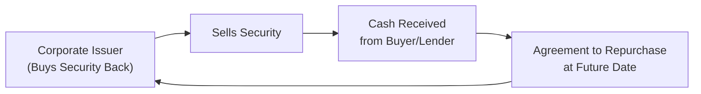

## 7.4 Fixed-Income Markets for Corporate Issuers

So, you’ve probably heard someone mention “corporate bonds” and wondered what that really means or how they differ from, say, government bonds. I remember the first time I held a dinner conversation about bonds (yes, I can be that dull), and someone asked: “Why would a company not just go to a bank for a loan?” Well, the short answer is that large companies can often issue bonds in the capital markets to borrow at competitive rates—sometimes better than a direct bank loan—while diversifying their pool of creditors. This section aims to demystify that process, from short-term debt instruments like commercial paper to the more flamboyant high-yield bonds, and to show why yield spreads, credit ratings, and covenants matter.

Anyway, let’s explore how corporate issuers navigate the fixed-income markets, how these products are structured, and how investors evaluate risk and return. Sound good? Let’s go.

### Overview of Corporate Bond Markets

Corporate bond markets channel funding from savers to large corporate borrowers. In essence, a corporation issues debt securities (bonds) to investors, promising periodic coupon payments and the return of principal at maturity. “But,” you might ask, “isn’t that exactly like a government bond—just from a different issuer?” Sort of. But while government bonds often come with negligible default risk (arguably so, but that’s another debate), corporate bonds have a broader spectrum of credit qualities. They range from investment-grade offerings by stable, profitable companies to high-yield (junk) bonds by companies with greater default risk. 

The difference in credit risk generally leads to a difference in yield. The riskier (i.e., more likely to default) the issuer, the more investors demand in terms of yield compensation. That extra yield demanded is typically measured as a spread above safer benchmarks (like government bonds). Over the years, the corporate bond market has turned into a massive, global operation, with thousands of issuers tapping both domestic and international investors. Each corporate bond issuance is shaped by factors like the issuer’s credit rating, interest rate environment, and market appetite for risk (uh, also known as investor sentiment). 

### Investment-Grade vs. High-Yield Bonds

When corporate borrowers approach the bond market, rating agencies (like Moody’s, S&P, and Fitch) step in to score their likelihood of paying back the debt. Bonds rated BBB (Baa3 for Moody’s) or higher are called “investment-grade,” while anything below that is considered “high-yield” or “junk.”

• Investment-grade bonds generally appeal to more conservative investors (insurance companies, pension funds, and your humble buy-and-hold folks). They typically offer lower yields but also lower default risk.

• High-yield bonds promise higher yields to investors willing to accept a bigger default probability. This segment is more volatile, influenced by broad shifts in credit cycles. However, it can offer more robust returns if the issuer’s business prospects improve or if broader market conditions favor risk-taking.

In the mid-2000s, I remember everyone had something to say about the “high-yield space”—some in an excited manner, others in a worried tone. They can deliver strong returns in an upswing but can also tumble uncomfortably quickly when economic conditions tighten.

### Short-Term Funding Instruments

You may have heard that not all “bonds” are created equal when it comes to maturity. Some are effectively just a few months long. Let’s check out two main short-term items: commercial paper and bankers’ acceptances.

#### Commercial Paper

Commercial paper (CP) is a short-term, unsecured promissory note usually issued by companies with strong credit. Maybe your large, stable tech giant or massive retail conglomerate. It doesn’t require collateral but thrives on reputation and ratings. Corporations often use CP to handle “working capital” needs. Think: bridging occasional short-term liquidity crunches. Because it’s unsecured, only highly rated companies can typically issue commercial paper at attractive rates, meaning if the issuer’s credit rating takes a hit, investors may demand a much higher yield or not buy it at all.

#### Bankers’ Acceptances

Bankers’ acceptances are more common in international trade finance. Picture a scenario where an exporter wants assurance they’ll be paid, and the importer’s bank “accepts” a draft guaranteeing payment at a future date. This “accepted” draft can be sold in the market, giving the exporter immediate liquidity. While not as universally utilized as commercial paper, bankers’ acceptances are vital for short-term financing in trade-heavy industries.

### Longer-Term Bonds: Debentures and Secured Bonds

When companies need money for expansions, acquisitions, or other big initiatives, they often issue longer-term debt. Key categories include:

• Debentures: These are unsecured bonds backed only by the general creditworthiness of the issuer. “Unsecured” might sound scary, but for a large investment-grade firm with stable operating cash flow, a debenture can be a straightforward option—albeit usually at a higher yield (or coupon) than a secured bond.

• Secured Bonds: By contrast, a secured bond has specific assets pledged as collateral. If the issuer defaults, creditors have a claim on those assets to satisfy their claims. Because of this extra protection, secured bonds often have lower yields (all else equal) because they carry less risk.

### Using Repurchase Agreements (Repos) for Corporate Funding

When I first learned about repos, I thought, “This is basically a pawnshop for securities.” A repurchase agreement is a short-term borrowing tool where the borrower (say, a corporate treasury department flush with securities) sells a security—often a government bond or other high-quality asset—to a lender with an agreement to buy it back at a slightly higher price in the near future. In practice:

• The initial sale = a short-term loan from the lender’s perspective.  
• The buyer of the security = the lender.  
• The borrower agrees to repurchase that security at a higher price, representing the interest.

Repos can be overnight or longer (known as term repos). Corporations might do repo transactions to manage day-to-day liquidity or just to optimize their cash positions quickly.

Here’s a simple diagram illustrating the flow:

In plain language, the corporate issuer obtains cash now but must buy the security back at a higher price later—effectively paying interest on a short-term loan. 

### The Role of Credit Ratings in Corporate Bond Pricing

Investors rely on credit ratings (issued by agencies like Moody’s, S&P, and Fitch) as a first line of assessment for default risk. A strong credit rating:

• Lowers the yield a corporation must offer, because the perceived risk is lower.  
• Opens investment to a broader set of investors (some of whom are restricted from purchasing anything below certain rating thresholds).

Conversely, if a company’s rating drops, its existing bond prices might decline in the secondary market, increasing yields for new issues. I recall a friend who used to say, “When the rating agencies whisper, the bond market shouts.” In other words, a mere mention of a downgrade can spark major price moves.

### Covenant Structures

Corporate bonds often come with covenants—these are basically “rules” laid out in the bond indenture that protect creditors (bondholders) or maintain certain obligations on the issuer. 

• Affirmative Covenants: The issuer must do certain things: maintain a certain level of insurance, submit financial statements, or keep certain financial ratios within boundaries.  
• Negative Covenants: The issuer must not do certain things: like exceed certain leverage limits, pay out excessive dividends, or issue more debt of a certain seniority without bondholder approval.

Covenants act like guardrails. They help ensure that the company doesn’t take actions that radically change its risk profile to the detriment of debt holders. For instance, a negative covenant might prohibit the issuer from selling core assets that generate revenue. If covenants are too restrictive, though, the company might have less operational flexibility. There’s a constant balancing act between protecting creditors and allowing the corporate issuer enough freedom to operate and grow.

### The Importance of Yield Spreads

Yield spread is essentially the difference between a corporate bond’s yield and a benchmark yield (commonly that of a Treasury security of similar maturity). It encapsulates credit risk, liquidity risk, and other market considerations. If a corporate bond yields 6% while a comparable-maturity government bond yields 4%, the spread is 2% (or 200 basis points).

• For an investment-grade issuer, spreads might be relatively modest (e.g., 50 to 200 basis points above Treasuries).  
• For high-yield issuers, the spread can be dramatically higher (300 to 1000+ basis points above Treasuries).

The spread also fluctuates with market sentiment. In times of market stress, high-yield bonds see their spreads widen sharply because investors demand more compensation for perceived higher risk. In calmer market conditions, spreads can narrow. 

### Practical Case Study: Funding a Major Acquisition

Imagine a company, WidgetTech Inc., that wants to buy a smaller rival to expand its product lineup. They need $500 million. They could issue:

• Commercial paper for short-term bridging finance—if they plan to quickly spin off a non-core asset.  
• A series of investment-grade debentures for the bulk of the funding, taking advantage of strong credit ratings.  
• A high-yield issue if their rating is low, ensuring investors are compensated for the higher risk.  
• Use a repo transaction in the meantime if they already hold a treasury portfolio, providing immediate liquidity for down payments or legal fees until the bond deal is finalized.

After the acquisition, the company’s leverage might increase, possibly pressuring its credit rating and causing the yield on any newly issued bonds to rise. If the acquisition goes well and leads to higher revenue and profit margins, ratings agencies might upgrade the company, lowering future financing costs.

### Common Pitfalls and Best Practices

• Over-Reliance on Ratings: Ratings can lag real-time market conditions or a company’s deteriorating fundamentals. Investors should do their own credit analysis.  
• Ignoring Covenants: Some issuers might sign covenants without anticipating potential constraints on future strategic decisions.  
• Liquidity Risk in High-Yield Issues: Markets can dry up if investor sentiment shifts. High-yield issuers can face big trouble if they need to refinance debt when no one wants to lend.

### Encouraging Critical Thinking

One thing I used to ponder: If a company’s situation is stable, why on earth might a bond slip into junk territory overnight? It can happen if a big event changes credit risk significantly (e.g., a huge, debt-funded acquisition). So always realize that credit quality can pivot quickly, and the market typically reacts faster than rating agencies.

It’s also good to reflect on how various macroeconomic factors—interest rates, inflation expectations, and business cycles—might influence corporate bond pricing. When central banks tighten monetary policy, yields on risk-free instruments may rise, so corporate bond yields often rise too (though spreads can fluctuate in different ways).

### Quick Glance at the Math

If you’re looking at a corporate bond price, you might think in terms of discounted cash flows:


\text{Bond Price} = \sum_{t=1}^{T} \frac{\text{Coupon Payment}}{(1 + r)^t} + \frac{\text{Par Value}}{(1 + r)^T},


where \\( r \\) is the yield (or discount rate) that reflects market interest rates plus the credit spread. A higher credit spread means a higher discount rate, translating into a lower bond price for the same coupon structure.

### Real-World Analogy

Some prefer to view corporate bonds as “renting out your money to a company” for a fixed time. The company pays rent (coupon interest) regularly, and eventually they’re supposed to give your money back. If the company has a strong track record, maybe you charge them a moderate “rent.” If the company looks a bit shaky, you demand a high “rent” (yield) to justify the risk.

### References and Further Study

• Frank J. Fabozzi: “Bond Markets, Analysis, and Strategies,” for an in-depth discussion on corporate bonds.  
• Rating agency websites (Moody’s, S&P, Fitch) for methodology and real-time rating updates.  
• CFA Institute Level I Curriculum materials on corporate bond market structure, credit analysis, and everything in between.

### Conclusion

Fixed-income markets for corporate issuers cover a kaleidoscope of instruments, from short-term commercial paper to long-term high-yield bonds. By examining factors like credit ratings, covenant structures, and yield spreads, investors can gauge the risk-return profile of corporate bonds. On the issuer side, understanding these markets’ dynamics is critical for optimizing funding costs and maintaining operational flexibility. 

At the end of the day, it’s a balancing act between investors who seek yield (and risk protection) and issuers who need capital at the best possible terms. The bond markets configure these needs via a fluid mechanism of pricing, spreads, and constant negotiation between risk and return. Certainly not a dull dinner conversation—well, at least in my humble opinion.

---

## Test Your Knowledge: Fixed-Income Markets for Corporate Issuers



### Which statement best describes investment-grade corporate bonds?

- [ ] They are rated below BBB/Baa and associated with higher default risk.  
- [x] They are rated BBB/Baa or higher by major rating agencies.  
- [ ] They typically offer yields higher than most speculative-grade options.  
- [ ] They are always secured by the issuer’s most valuable assets.

> **Explanation:** Investment-grade corporate bonds must have ratings of at least BBB/Baa. They generally carry lower default risk, hence lower yields.

### What is commercial paper primarily used for by corporations?

- [ ] Funding long-term capital improvements.  
- [x] Meeting short-term working capital needs.  
- [ ] Securing real estate holdings with collateral.  
- [ ] Acquiring competitor companies.

> **Explanation:** Commercial paper is a short-term, unsecured promissory note that corporations often issue to manage immediate cash flow and working capital requirements.

### Why might a corporation consider securing its bond issuance with collateral?

- [x] To reduce the yield demanded by investors.  
- [ ] To shift the default risk entirely onto the collateral institution.  
- [ ] To avoid paying coupon payments.  
- [ ] To bypass covenant requirements.

> **Explanation:** When a bond is backed by specific collateral, the risk to the investor is lower, and so the yield demanded by the market is typically lower as well.

### Which of the following best describes a repo (repurchase agreement)?

- [ ] A long-term security designed to remain on a company’s balance sheet until maturity.  
- [ ] A bond that pays a variable coupon tied to inflation.  
- [x] A short-term transaction in which a security is sold and later repurchased at a higher price.  
- [ ] A special type of unsecured commercial paper issued by banks.

> **Explanation:** Repos are effectively short-term loans. One party sells securities and agrees to buy them back at a higher price to compensate the lender.

### What factor most directly causes yield spreads on corporate bonds to widen?

- [ ] A drop in government bond yields.  
- [x] An increase in perceived credit risk for corporate issuers.  
- [ ] A surge in stock market prices.  
- [x] Deteriorating market liquidity for corporate bonds.

> **Explanation:** Yield spreads often widen if investors sense that corporate credit risk is climbing or if liquidity is drying up, requiring higher compensation for risk.

### Which is an example of an affirmative covenant in corporate bond documentation?

- [x] The issuer must submit periodic financial statements to bondholders.  
- [ ] The issuer cannot exceed a specified leverage ratio.  
- [ ] The issuer is prohibited from paying dividends.  
- [ ] The issuer must avoid new secured debt.

> **Explanation:** Affirmative covenants specify activities the issuer must do, such as routine reporting.

### How do credit ratings typically influence the bond’s coupon rate?

- [x] Higher ratings typically lead to lower coupon rates.  
- [ ] Bonds with higher ratings must pay higher coupons to attract investors.  
- [ ] Credit ratings do not affect coupon rates.  
- [ ] Lower ratings automatically mean zero coupon bonds.

> **Explanation:** Strong credit ratings reduce perceived risk, so investors accept lower coupons. Issuers with weak creditworthiness must offer higher coupons.

### What is the main advantage of using commercial paper over issuing new equity?

- [x] Lower costs and minimal dilution of existing shareholders.  
- [ ] Complete elimination of default risk for the issuer.  
- [ ] Long maturity that matches capital project timelines.  
- [ ] Ability to avoid paying interest altogether.

> **Explanation:** Commercial paper is cheap, short-term financing and doesn’t dilute shareholder ownership. However, it involves default risk and interest payments.

### Which of the following best describes high-yield (junk) bonds?

- [x] They pay higher coupons due to higher default risk.  
- [ ] They are guaranteed by the government.  
- [ ] They have lower probability of default than government bonds.  
- [ ] They are exclusively used by large, stable corporations.

> **Explanation:** High-yield bonds carry lower credit ratings, higher default risk, and thus must pay higher yields to attract investors.

### High-yield bonds are typically:

- [x] Rated below BBB/Baa.  
- [ ] Collateralized by Treasury securities.  
- [ ] Issued only by investment banks.  
- [ ] A form of permanent equity finance.

> **Explanation:** High-yield bonds lie below the investment-grade threshold and thus offer higher returns to compensate for greater perceived risk.


