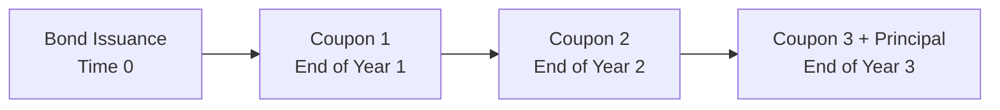

## 7.6 Fixed-Income Bond Valuation: Prices and Yields

Have you ever wondered, maybe late at night, why a bond selling at a discount ends up being a hot commodity for certain investors? I recall my first time trying to figure out if a simple corporate bond was a “good deal” or not, and I felt a bit overwhelmed. We talk about yields, coupon rates, and some weird concept of “accrued interest,” and it’s like—wait, what’s going on? Well, let's break it all down in plain English… or at least as plain as it can get in the world of fixed income!

Whether you’re new to this stuff or just brushing up, you’ll soon see how bond valuation can be understood with some friendly examples and a bit of math. In my opinion, once you grasp the relationship between bond prices and yields, the rest of the concepts start falling right into place.

## Bond Pricing Fundamentals and Key Concepts

Before we jump into the nitty-gritty, it’s good to get comfortable with some fundamentals. A bond is essentially a loan from an investor to an issuer (like a government or a corporation). In return, the investor typically receives periodic coupon payments and eventually the principal (face value) at maturity.

• Coupon – The interest payment the bond pays, often expressed as an annual percentage of the bond’s face value (e.g., 5% of a $1,000 face value = $50 per year).  
• Yield-to-Maturity (YTM) – The internal rate of return on a bond’s cash flows if held until maturity. It’s the discount rate that equates the present value of all future bond cash flows to the bond’s price.  
• Price – How much the bond costs in the market right now. This can be expressed in terms of its clean price or its full (dirty) price.  
• Time to Maturity – The length of time remaining until the bond’s final principal repayment.

### Relationship Among Price, Yield, Coupon Rate, and Time

A fundamental principle: bond prices and yields have an inverse relationship. If market interest rates (yields) rise, newly issued bonds come with higher coupon rates compared to older bonds, making those older bonds less attractive. Their prices must drop so that their yields rise to match the new market rates. Conversely, when yields drop, bond prices rise.

Imagine you hold a bond that pays you $50 each year per $1,000 face value. If yields in the market go up to 6% (i.e., a new bond might pay $60 per year for $1,000 face value), who would want to buy your older 5% bond at $1,000? It’d seem like a raw deal—so the price falls to make that 5% coupon comparatively compelling for new investors.

In my own early days of investing, I remember the frustration of seeing bond values dip whenever yields ticked up. It felt unfair—like, “I just bought this bond, why is it worth less now?” But once you realize it’s all about the present value of future cash flows, it makes perfect sense.

## Full Price (Dirty Price) vs. Clean Price (Flat Price)

Market participants often quote bond prices in two ways:

• Full Price (or Dirty Price) – The bond price that includes accrued interest.  
• Clean Price (or Flat Price) – The bond’s price without accrued interest added.

Why do we need two prices? Because bonds pay coupon interest on specific dates, but in reality, owners earn interest each day they hold the bond (even though they don’t get paid daily). At settlement, the buyer compensates the seller for the interest the seller has earned up to that point since the last coupon payment. That portion is known as accrued interest. 

In many markets, the “quoted” price you see for a bond is actually the clean price. But when you purchase or sell, your actual transaction price (the full price) will include whatever accrued interest has built up.

### Accrued Interest and Day-Count Conventions

Accrued interest might sound fancy, but it’s simply the interest that has accumulated between coupon payments.

There’s a formula for accrued interest that goes something like:

Accrued Interest = (Coupon Payment) × (Days from Last Coupon Payment to Settlement) / (Days in Coupon Period)

But—here’s the kicker—the actual number of “days” can get tricky. Different bond markets use different day-count conventions. For example:

• 30/360 – Each month is treated as 30 days, and a year is 360 days.  
• Actual/365 – Uses the actual calendar days elapsed over a 365-day year.  
• Actual/Actual – Uses actual calendar days with a year typically measured as 365 or 366 days, depending on leap years.  

Why bother? Because these conventions help standardize calculations so that everyone can more or less agree on how much interest is earned in each fraction of the coupon period. This ensures fairness (and fewer arguments) in bond transactions.

## Present Value of Future Cash Flows

Bond valuation is all about discounting future coupon payments and the future redemption (principal or face value) back to the present at an appropriate discount rate (the bond’s required yield or YTM). 

Conceptually, the Price of a bond is:

P = ∑ ( C / (1 + i)ᵗ ) + ( M / (1 + i)ᴺ )

• C = coupon payment per period  
• i = yield per period (YTM estimated for each coupon interval)  
• M = face value or par value  
• t = each coupon period (from 1 to N)  
• N = total number of coupon periods until maturity  

This might look a bit daunting, but it’s basically the same discounting logic folks use for time value of money (check out Chapter 2 on “Time Value of Money in Finance” if you need a refresher).

## Diagram: Timeline of Bond Cash Flows

Here’s a tiny visual to help see how these payments line up over time. Imagine a 3-year annual-coupon bond with annual payments and maturity at the end of Year 3.

In this timeline:

• At “Bond Issuance (Time 0),” the investor pays the bond price.  
• At the end of Year 1, the first coupon hits.  
• At the end of Year 2, the second coupon arrives.  
• At the end of Year 3, the third (final) coupon plus the principal redemption are paid.  

We discount each of these cash flows back to Time 0 at the required yield i. The sum of all discounted values is the bond price.

## Let’s Crunch a Quick Example

Suppose we have a 2-year bond with a 5% annual coupon, paid once per year. The face value is \$1,000, so each coupon is \$50. The yield-to-maturity is 6% annually. How do we find its price?

• The coupon in Year 1 is \$50, discounted back one year at 6%.  
• The coupon in Year 2 is \$50, plus the principal of \$1,000, discounted two years at 6%.

Price (P) can be computed as:

P = 
(50 / 1.06) +  
(1050 / 1.06²)

Breaking this down:

• PV of the first coupon = 50 / 1.06 ≈ \$47.17  
• PV of the second coupon + principal = 1050 / (1.06)² = 1050 / 1.1236 ≈ \$933.96

So total P ≈ 47.17 + 933.96 = \$981.13

If yields were to rise above 6%, that bond price would drop further. If yields fell below 6%, the price would rise.

## Price-Yield Relationship and Yield Curve Shifts

Because bond prices and yields move in opposite directions, a yield curve shift can change your bond’s value. A yield curve is basically a line that plots yields of bonds with the same credit quality across different maturities. If that yield curve suddenly shifts upward, yields across all maturities get higher, and bond prices typically move downward.

Ways the yield curve can shift:  
• Parallel shift – The entire curve moves up or down by the same number of basis points.  
• Flattening – The short end of the curve goes up while the long end goes down (or vice versa).  
• Twisting – The middle part changes relative to the short and long ends.

Bond portfolio managers closely track these movements to manage interest rate risk. If they expect yields to spike, they might reduce their exposure to long-maturity bonds, which are typically more sensitive to yield changes.

## Settlement on or Between Coupon Dates

When you buy or sell a bond between coupon dates, the seller has some interest that’s been building up since the last coupon. That’s exactly what accrued interest is.

### Full Price = Clean Price + Accrued Interest

So if your bond’s clean price is \$980, but there’s \$2 in accrued interest, you’ll pay \$982 as the full price at settlement. The day-count convention will determine how we calculate that \$2. 

Let’s do a simplified example:  
• Annual coupon: \$100  
• Day count: 30/360  
• 30 days since last coupon date out of a 180-day coupon period (for semiannual).  
Accrued interest = \$100 * (30 / 180) = \$16.67  

If your bond’s clean price is \$1,000, the full price you pay is \$1,016.67. The coupon is still paid in total when the next coupon date arrives, but effectively, you compensated the seller for the part of the cash flow they “earned” up to the day you took ownership.

## Practical Examples and Real-World Case Studies

Let’s say you’re analyzing two corporate bonds—Bond A with an 8% coupon, Bond B with a 4% coupon. Both have the same maturity date (5 years away) and the same yield-to-maturity of 5%. Which one is cheaper? Interestingly, if they have the same yield and maturity, they might not end up with the same price. Why? Because of how coupon timing interacts with compounding. Typically, for a given yield and maturity, a higher coupon leads to a higher price—although the difference can be fairly subtle.

In another real-world scenario, a friend of mine once bought a fallen angel bond (an investment-grade bond that got downgraded) at a big discount. The yield soared from around 4% to 7%. When the economy improved, the yield dipped, and the bond’s price shot up. That’s the power of those yield changes in real life—sometimes you catch a break, sometimes not.

## Best Practices in Bond Valuation

• Carefully choose the yield measure – Are we dealing with a semiannual yield, an annual yield, or something else? Consistency is key.  
• Track day-count conventions – This can trip up new analysts. If you’re not consistent, your accrued interest calculations might be off.  
• Watch for changes in credit quality – A bond’s required yield can shift due to macroeconomic factors or changes in the issuer’s credit rating.  
• Factor in liquidity – Some bonds trade infrequently, so their quoted prices may not reflect the “true” value if supply/demand is thin.  

## Common Pitfalls and How to Avoid Them

• Ignoring the difference between clean and dirty price – If you forget about accrued interest, you’ll be pretty surprised on your settlement date.  
• Mixing up day-count conventions – Using Actual/365 vs. 30/360 can produce quite different interest amounts, so be sure what the market standard is for your bond.  
• Overlooking compounding periods – Annual vs. semiannual vs. quarterly compounding can affect yield calculations.  
• Assuming yield is the same as coupon – They’re related, but absolutely not the same.

## Frequently Asked Questions and Informal Clarifications

1. Why can’t we just say the bond’s price is what the last transaction was?  
   Well, you can, but that’s typically the clean price. You still have to handle accrued interest to know the final cost.  

2. If yields rise, should I sell my bond right away?  
   Not necessarily. If you plan to hold to maturity, the bond will still pay its face value at maturity if there’s no default—so those price swings might not matter to you if your goal is to hold until it matures.  

3. Does day-count convention really matter that much?  
   If interest rates are large or you’re buying huge volumes (like big institutions do), even small differences can add up. For smaller trades, it’s less of a big deal, but it still matters for accuracy.  

## Conclusion

Bond valuation might feel like a puzzle at first, but it’s really about applying consistent discounting methods to future cash flows—and being aware of how these cash flows are quoted and settled in the real world. For me, once I started thinking of bonds as just streams of cash flows with a rate that ties everything together (the yield-to-maturity), it all clicked. The day you’re comfortable comparing a bond’s clean price to its dirty price (and factoring in accrued interest), you’ll be well on your way to mastering fixed income basics.

Feel free to revisit Chapter 2 if you need a refresher on time value of money. And keep in mind that the yield curve—covered in more depth in 7.9 “The Term Structure of Interest Rates”—affects the discount rates you’ll use for each bond maturity. 

And that’s really it—just remember the big ideas: bond price goes up if yield goes down, goes down if yield goes up, watch out for accrued interest, and discount future cash flows properly. 

### Glossary

• Yield-to-Maturity (YTM): The internal rate of return on a bond’s cash flows, assuming it’s held to maturity.  
• Accrued Interest: The interest earned but not yet received from the most recent coupon date to the trade settlement date.  
• Full Price (Dirty Price): The bond price that includes accrued interest.  
• Clean Price (Flat Price): The quoted bond price excluding accrued interest.  
• Present Value (PV): The discounted value of future coupon and principal payments.

### References & Further Reading

• Fabozzi, F.: “Bond Markets, Analysis, and Strategies” – check out the bond pricing sections for deeper dives.  
• CFA Institute Level I Curriculum – practice questions on bond pricing are a must.  
• Tuckman, B., & Serrat, A. (2011). “Fixed Income Securities: Tools for Today’s Markets.” Wiley.

-----

## Test Your Knowledge on Bond Valuation and Yields



### Which of the following statements correctly describes the relationship between bond prices and bond yields?
- [ ] Bond prices and yields move in the same direction.  
- [x] Bond prices and yields move in opposite directions.  
- [ ] Bond prices remain constant regardless of the yield.  
- [ ] Bond prices only change if the issuer defaults.  

> **Explanation:** When yields go up, prices must go down for the bond’s fixed coupon to remain attractive, and vice versa.

### A bond’s clean price is:
- [ ] The price that includes accrued interest.  
- [x] The quoted price that does not include accrued interest.  
- [ ] Always the same as its face value.  
- [ ] The yield-based price for an annual pay bond.  

> **Explanation:** The bond’s “clean” (or “flat”) price excludes accrued interest; the “full” (or “dirty”) price includes accrued interest.

### If you purchase a bond partway into the coupon period, which of the following is TRUE?
- [ ] You pay no accrued interest because coupons aren’t due yet.  
- [x] You pay the seller accrued interest for the period since the last coupon.  
- [ ] You receive a larger portion of the next coupon than the seller.  
- [ ] Accrued interest is borne by neither party.  

> **Explanation:** Accrued interest compensates the seller for the portion of the coupon period they held the bond.

### An investor is comparing two bonds with identical maturities and credit quality. Bond A has a higher coupon rate than Bond B, but both have the same yield-to-maturity. Which bond will have the higher price?
- [x] Bond A, because its higher coupon leads to larger regular cash flows.  
- [ ] Bond B, because it has a lower coupon.  
- [ ] They will be priced the same.  
- [ ] It depends on the yield curve.  

> **Explanation:** At the same yield and maturity, a higher coupon bond generally has a higher price because there are bigger coupon cash flows to discount.

### In the context of day-count conventions, which statement is correct?
- [x] The 30/360 convention treats each month as 30 days and each year as 360 days.  
- [ ] The 30/360 convention is only used for municipal bonds.  
- [x] The Actual/365 convention treats the year as 365 days, counting actual elapsed days.  
- [ ] Day-count conventions have no effect on accrued interest.  

> **Explanation:** Different markets use different conventions, such as 30/360 or Actual/365. This choice directly affects accrued interest calculations.

### For a semiannual coupon bond, the yield per semiannual period is:
- [x] The annual yield-to-maturity divided by two (approximately).  
- [ ] Always the coupon rate times two.  
- [ ] Determined by the 30/360 day-count convention.  
- [ ] Already included in the bond’s face value.  

> **Explanation:** With semiannual coupon bonds, you split the annual yield into two periods to discount each coupon appropriately.

### You see a bond quoted at 99.50. Its face value is $1,000. Which best describes the bond’s status?
- [x] The bond is trading at a discount to par.  
- [ ] The bond is trading at par value.  
- [x] The bond’s price is $995.00 if no accrued interest is considered.  
- [ ] The bond’s price is $1,005.00.  

> **Explanation:** A quoted price of 99.50 on a $1,000 benchmark typically means $995.00 (discount). Including accrued interest would raise the final settlement price.

### If the yield on a bond increases, the present value of its future coupon payments:
- [x] Decreases.  
- [ ] Increases.  
- [ ] Remains constant unless the bond is callable.  
- [ ] Becomes zero if the yield remains high.  

> **Explanation:** Higher discount rates mean lower present values for future cash flows.

### A bond with a 5% coupon and face value $1,000 currently trades at $970. Which must be true if the bond is priced below par?
- [x] The yield-to-maturity is greater than 5%.  
- [ ] The yield-to-maturity is less than 5%.  
- [ ] The bond is paying no interest.  
- [ ] The bond is priced below the minimum discount.  

> **Explanation:** For a bond trading below par (discount), the yield exceeds the coupon rate.

### A parallel upward shift of the yield curve generally implies:
- [x] Higher yields across all maturities and lower bond prices overall.  
- [ ] Lower yields for short-term maturities only.  
- [ ] Higher coupon rates for bonds currently outstanding.  
- [ ] No impact on any bond prices.  

> **Explanation:** A parallel shift means yields for all maturities move together. A rise in yields usually decreases bond prices across the board.


