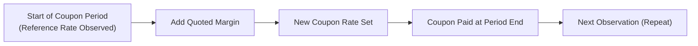
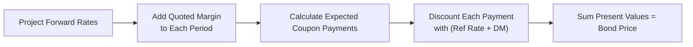

## 7.8 Yield and Yield Spread Measures for Floating-Rate Instruments

Floating-rate instruments (often called floaters or floating-rate notes, FRNs) can sometimes feel like magical unicorns in the fixed-income market, right? One minute, they seem to behave like short-term debt, and the next, they’re changing coupon rates based on a reference rate you may or may not follow daily. To someone just starting out, the notion that the coupon magically “floats” with an external index can be both fascinating and a bit scary. But rest assured, once you break down the mechanics, it’s not rocket science—though it can be easy to get lost in the details if you’re not careful.

This section explains what floating-rate instruments are all about, how the coupon is set, how yield is measured, and why the term “discount margin” might keep popping up whenever you read about FRNs. We’ll go step by step, sprinkling in some personal thoughts, examples, and yes, even the occasional digression or “aha” moment that might happen in a real conversation.

Use this knowledge to build a solid understanding of how floating-rate instruments fit into the broader fixed-income universe introduced in earlier sections (for instance, see sections on bond valuation or credit risk overviews in this Chapter 7). By the end of this article, you’ll be well-positioned to handle questions about FRNs on your CFA exam and beyond.

---

## The Essentials of Floating-Rate Notes

When you think about a standard fixed-rate bond, you’ve got a coupon that’s set in stone (well, more like set in the bond’s prospectus) for the life of the bond. Now imagine a bond whose coupon changes based on a market reference rate—like 3-month LIBOR, SOFR (Secured Overnight Financing Rate), or EURIBOR—plus some fixed spread (quoted margin). That’s your floating-rate note.

Here’s the basic idea: On each “reset date,” which often occurs every three or six months, the issuer checks the prevailing reference rate (let’s say 3-month SOFR) and adds a fixed margin to that rate. Boom—your new coupon rate for that upcoming period. So if the reference rate goes up, your coupon tends to go up, and vice versa if the rate falls.

### Key Terms to Keep in Mind

• Reference Rate: A market-based interest rate used to set the coupon on floating-rate notes. Examples: SOFR, LIBOR (being phased out in many markets), EURIBOR.  
• Quoted Margin or Spread: The fixed spread added to the reference rate to determine the coupon rate.  
• Reset Date: The date on which the coupon payment is recalculated based on the reference rate.

### A Quick Anecdote
I remember the first time someone explained an FRN to me. I was like, “Wait, so it’s like an adjustable-rate mortgage but for bonds?” My mentor just smiled and said, “Yep, that’s basically it.” And once I saw it that way, it wasn’t so scary anymore. The references are just different indexes.

---

## How the Coupon Is Set

One thing that often trips people up is the difference between the coupon formula on paper and the actual cash flows. Typically, that coupon formula is:

$$
\text{Coupon} = \text{Reference Rate} + \text{Quoted Margin}
$$

For example, if the 3-month SOFR is 2.5% and the quoted margin is 0.8%, the coupon you’ll be paid for the next quarter is 3.3%. Easy enough, right?

But then you realize that the reference rate can look different at different points in time, and there might be a “lock-in” period or an observation period that’s slightly offset from the actual coupon payment date. That’s one reason floaters can get complicated. Timing matters.

#### A Simple Illustration

Let’s say your FRN pays quarterly, with coupon resets every three months on the day the coupon is due. The reference rate used for the next coupon is observed just before the start of the coupon period. If 3-month SOFR is 2.5% at that observation date, and the margin is +0.80%, the next coupon is 3.3%.

In practice, you receive that coupon payment at the end of the period. Then, right before the next coupon period, the FRN’s reference rate is reset again. If the reference rate’s gone up to 3.1%, your new coupon might be 3.9%.

#### Visual Flow (Mermaid Diagram)

Below is a simplified flowchart of how a coupon adjusts:

The timing of each of these steps can differ across instruments, but this is the gist of the reset process.

---

## Reset Dates and Frequency

Reset frequency tells you how often a floater’s coupon is recalculated (commonly every 3 or 6 months). The reset date specifically is the date on which the rate is “locked in” for the upcoming period. Now, it can happen that the coupon is set two or three business days before the actual coupon period starts—some deals do that so there’s a known rate for the entire upcoming period. Overall, these details vary, but the fundamental logic is pretty standard.

I used to second-guess the concept of the reset date: “Wait, isn’t the coupon just ‘floating’ all the time?” Actually, it’s more accurate to say it’s floating on a schedule. Imagine a seesaw that only moves when a buzzer goes off every few months, rather than constantly adjusting minute by minute. That’s how an FRN’s coupon resets.

---

## Yield Calculations for Floaters

Yield calculations for floating-rate instruments can be a bit tricky because, in theory, the coupon resets each period to something close to the market interest rate. Many times, if the floater’s quoted margin reflects the risk level accurately, the security should be priced near par (assuming credit quality remains stable and all goes well in the market).

But how do you measure yield? One conceptual way is to forecast all the future reference rates (a daunting task, but analysts use forward curves for that) and then calculate the expected coupon payments for each period. You then discount those expected payments back to the present using appropriate discount factors. 

### Using Forward Rates

A more “textbook” approach says:  
1. Obtain the forward rates implied by the current yield curve for the reference index (e.g., forward 3-month SOFR rates).  
2. For each coupon period, add the quoted margin to that forward rate to estimate the coupon.  
3. Discount those future coupon cash flows back to present.  
4. Add in the principal repayment at maturity (usually par) discounted back as well.  
5. The discount rate used may incorporate the same forward rates plus any margin to reflect the security’s yield properly.

That’s obviously a bit on the elaborate side. In everyday practice, if the floater is near par, many people approximate the yield by simply adding the quoted margin to the reference rate in the short run, plus any current discount or premium to par. But for a “pure” approach, you do the full discounted-cash-flow method.

---

## Understanding the Discount Margin (DM)

You may have heard about the discount margin, or DM, in the context of floating-rate notes. In simple terms, the DM is the yield spread above that reference rate that investors would essentially earn if they held the floater to maturity, accounting for all the complexities of future reset rates. It’s basically the margin used to discount the future floating rate cash flows. The discount margin helps you figure out how “rich” or “cheap” a floater might be trading relative to the market.

### Why Does DM Matter?

If you have a quoted margin of +0.80%, that means each coupon is 0.80% above the reference rate. But you might actually demand a higher or lower spread based on the security’s credit risk, liquidity, or other considerations. Sometimes, the bond trades at a premium or a discount to par. The DM attempts to capture the “true” spread you, as the investor, are receiving after factoring in the security’s actual market price.

When the market perceives the issuer as riskier or if liquidity is poor, the bond might trade at a price that implies a DM bigger than the quoted margin. Conversely, if it’s a super high-quality issuer, or the bond is in demand, the DM might end up being smaller than the quoted margin.

### Formula for Discount Margin

Let’s say we denote DM by \\( \text{DM} \\). Conceptually, you get it by solving this equation (though it can get iterative in real life):

$$
\text{Price} = \sum_{t=1}^{n} \frac{\text{(Reference Rate}_t + \text{Quoted Margin}) \times \text{Notional} \times \text{DayCount}_t}{(1 + (\text{Reference Rate}_t + \text{DM}) \times \text{DayCount}_t)^{t}} + \frac{\text{Notional}}{(1 + (\text{Reference Rate}_n + \text{DM}) \times \text{DayCount}_n)^{n}}
$$

In practice, you might see analysts use software or a spreadsheet with iteration to solve for the DM since it can’t always be rearranged for a neat closed-form solution. But fortunately, exam-level problems often keep it simpler.

---

## Practical Examples and Real-World Scenarios

### Short Example: Quarterly FRN

Imagine a floating-rate note with:  
• Notional = $1,000.  
• Maturity = 1 year from now (so 4 reset periods).  
• Reference rate = 3-month SOFR, which is projected (forward rates) to be around 2.6%, 2.8%, 2.9%, 3.0%.  
• Quoted Margin = +1.0%.  
• Current market price is $995.  

We want to see if the discount margin is above, below, or equal to that +1.0% quoted margin. If the instrument’s price is slightly below par, that might signal the market is demanding a higher yield than just 1.0% over SOFR. So maybe the discount margin you solve for is something like 1.2%. That means if you buy it at $995, your actual yield over the life of the note is roughly 1.2% over the reference rates—higher than the stated 1.0%.

Conversely, if the bond was trading at $1,010, the implied discount margin might be less than 1.0%.

### Real-World Scenario: Transition from LIBOR to SOFR

A big shift has happened (and is ongoing) in the realm of floating-rate instruments with the move away from LIBOR (which was set to end, or “go out of style,” if you will) toward newer rates like SOFR in the U.S. The general mechanics remain the same: you stick a margin on top of your new reference rate. But practitioners needed to watch out for differences in the underlying rate mechanics (e.g., LIBOR was unsecured, whereas SOFR is secured). So if you see older FRN prospectuses, you might see references to LIBOR, but nowadays you’ll more likely see SOFR.

---

## Potential Pitfalls and Challenges

• Mismatch in Reset Frequency vs. Reference Rate Actuals: Sometimes there can be timing mismatches or day count mismatches that complicate the actual yield.  
• Overnight vs. Term Rates: Some reference rates (like daily SOFR) might differ from a term-based rate (3-month SOFR). The floater’s documentation will detail how it’s handled.  
• Credit Risk Changes Over Time: The quoted margin might have been set at issuance, but if the issuer’s credit risk deteriorates, the bond’s price declines, boosting the discount margin.  
• Spreads That Don’t Match the Bond’s Market Price: The bond might trade above or below par, so the stated margin in the bond’s documentation doesn’t necessarily reflect the real yield you end up with.

Honestly, it can be easy to get tunnel vision and forget that these pricing changes can happen daily in the market. The discount margin tries to unify everything into that single measure that you can compare across different floating-rate notes.

---

## Best Practices for Evaluating FRNs

• Always confirm the reference rate used: Are we talking about 3-month SOFR, daily SOFR with a compounding formula, or something else?  
• Understand the margin: Check if it’s the same as the DM or if the credit environment has changed, causing the actual trading spread to differ.  
• Model the expected future reference rates: Rely on current yield curves or forward rates for at least a baseline scenario—even if actual rates deviate in reality.  
• Watch out for credit events: If you’re holding an FRN from an issuer with questionable credit stability, keep track of market spreads.  
• Stay updated on regulatory changes: The path away from LIBOR was a pretty big deal; you don’t want to be left scratching your head if the FRN transitions to a different benchmark.

---

## Example Table of a Floating-Rate Payment Schedule

Below is a hypothetical payment schedule for a 1-year FRN paying quarterly:

| Period | Observation Date for Ref. Rate | Reference Rate (Projected) | Quoted Margin | Coupon Rate | Reset Date    | Payment Date    |
|--------|--------------------------------|----------------------------|---------------|------------|--------------|----------------|
| 1      | 03/01                          | 2.60%                      | +1.00%        | 3.60%      | 03/05        | 06/05          |
| 2      | 06/01                          | 2.80%                      | +1.00%        | 3.80%      | 06/05        | 09/05          |
| 3      | 09/01                          | 2.90%                      | +1.00%        | 3.90%      | 09/05        | 12/05          |
| 4      | 12/01                          | 3.00%                      | +1.00%        | 4.00%      | 12/05        | 03/05 (next Yr)|

(This is just an illustration. Real deals have specific day counts, actual settlement cycles, etc.)

---

## Small Mermaid Diagram: Recap of FRN Pricing

Below is a quick recap diagram of how an analyst might think of FRN valuation steps:

This flow highlights the same step-by-step approach we do with regular fixed-rate bonds, but with a changing coupon that depends on the forward reference rates.

---

## Final Thoughts and Encouragement

Working through yield calculations and discount margins for floating-rate instruments might feel like you’re juggling multiple moving parts—reference rates, reset schedules, discount factors, you name it. But the underlying principle is (almost) the same as any bond pricing technique: forecast cash flows, discount at the appropriate rate, compare the present value to the bond’s price. The main twist here is that the coupons are variable.

If you’re preparing for the CFA exam, keep in mind that an FRN question might require you to interpret how the discount margin differs from the quoted margin, or how a bond’s riskiness is reflected in a wider or narrower margin over time. Practicing a few examples, including one or two that require you to solve for the discount margin numerically, can help a ton. And as always—don’t forget to check the footnotes and disclaimers on how the reference rate is calculated, especially in this post-LIBOR era.

Now that you’ve got the gist, hopefully, you’ll see that FRNs can be a great way to hedge interest rate risk if you think rates will rise. And, well, if you’re issuing them, you might do so because the cost of funds could be lower if short-term rates stay stable. Either way, part of the fun of floaters is that you’re always paying attention to the short end of the yield curve—and that can keep life interesting.

---

## References and Further Reading

- CFA Institute Level I Curriculum, floating-rate valuation sections.  
- “Floating Rate Securities.” FINRA, https://www.finra.org  
- Fabozzi, F. “Bond Markets, Analysis, and Strategies,” chapters on floating-rate securities.  

---

## Test Your Knowledge: Yield and Spread Measures for Floating-Rate Instruments



### Which term describes the fixed spread added to the reference rate on a floating-rate note?

- [ ] Discount margin
- [x] Quoted margin
- [ ] Maturity margin
- [ ] Basis swap rate

> **Explanation:** The fixed spread added to the reference rate for coupon calculation is called the quoted margin. The discount margin, on the other hand, is used to value the floater’s cash flows.

### What do market participants typically use to forecast future reference rates when valuing floating-rate notes?

- [ ] Historical averages of interest rates
- [x] Forward rates implied by the current yield curve
- [ ] The last observed coupon rate
- [ ] The credit rating of the issuer

> **Explanation:** Analysts usually rely on forward rates implied by the current yield curve to estimate future reference rates for each coupon period.

### When a floating-rate note is priced at par, and its credit risk has not changed, what can we generally say about its discount margin (DM) relative to the quoted margin?

- [x] The DM should be approximately equal to the quoted margin.
- [ ] The DM will be significantly greater than the quoted margin.
- [ ] The DM will be significantly less than the quoted margin.
- [ ] The DM becomes undefined.

> **Explanation:** If the note trades at par and credit conditions remain stable, the DM typically aligns with the quoted margin because future coupon payments are expected to match the investor’s required rate.

### Why might a floating-rate note trade at a price below par immediately after issuance?

- [ ] Investors are anticipating a higher credit rating.
- [x] Investors perceive increased credit risk or market risk relative to the note’s initial assumptions.
- [ ] The issuer wants to reduce the market price for promotional reasons.
- [ ] The reference rate has been permanently fixed.

> **Explanation:** If the market believes the issuer’s credit risk has increased or if interest rates have shifted unfavorably, the note might trade below par to reflect a higher yield requirement.

### Which factor is NOT typically considered when determining a floater’s discount margin?

- [x] The issuer’s dividend payout ratio
- [ ] Credit risk of the issuer
- [ ] Liquidity of the issue
- [ ] Expectations for future reference rates

> **Explanation:** The discount margin accounts for credit risk, liquidity premiums, and future rate expectations. An issuer’s dividend policy is typically irrelevant for a bond’s discount margin unless it significantly impacts the issuer’s credit profile.

### If the reference rate for a floater rises and the quoted margin remains the same, which of the following is most likely to happen to the floater’s next coupon payment?

- [x] The next coupon payment will increase.
- [ ] The next coupon payment will decrease.
- [ ] The next coupon payment remains unchanged.
- [ ] The coupon payment resets to zero.

> **Explanation:** Since a higher reference rate plus the same margin results in a higher total coupon rate, the next coupon payment should increase.

### If an FRN’s current market price is above par, which of the following statements is most accurate regarding its discount margin?

- [ ] The discount margin is likely higher than the quoted margin.
- [x] The discount margin is likely lower than the quoted margin.
- [ ] The discount margin is equal to zero.
- [ ] The discount margin is set at par.

> **Explanation:** A price above par suggests investors are willing to accept a lower effective yield, so the discount margin (the “true” yield spread) tends to be lower than the quoted margin.

### Which of the following is the most applicable scenario for using forward rates in valuing floating-rate notes?

- [x] Predicting future reference rates to determine expected coupon payments
- [ ] Determining past reference rates for coupon adjustments
- [ ] Calculating the default probability of the issuer
- [ ] Adjusting for day-count conventions

> **Explanation:** Forward rates help project the future levels of the reference rate so that analysts can forecast the floating coupon payments and perform discounting accurately.

### A floating-rate note has a quoted margin of +150 basis points. If you solve for its DM and find 175 basis points, how is the bond trading relative to par?

- [ ] At a premium
- [ ] At par
- [x] At a discount
- [ ] In default

> **Explanation:** A DM higher than the quoted margin indicates the bond is trading at a discount, requiring a greater yield spread than the stated margin to attract investors.

### A floating-rate note resets its coupon every quarter based on the 3-month SOFR plus a margin. If rates increase significantly after the final reset date, which statement is most accurate?

- [x] The coupon remaining in that period does not change until the next reset.
- [ ] The coupon is immediately adjusted for the higher rates.
- [ ] The coupon is retroactively adjusted for the prior period.
- [ ] The margin automatically goes up too.

> **Explanation:** Once the coupon has been set for a particular period, it remains until the next reset date, regardless of how the market reference rate changes during that period.




