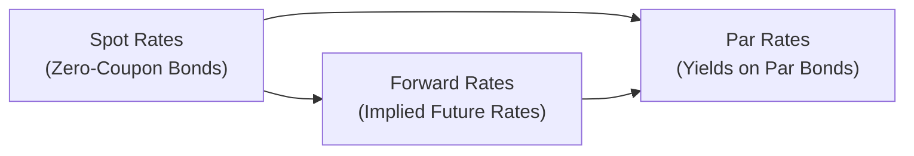

## 7.9 The Term Structure of Interest Rates: Spot, Par, and Forward Curves

If you’ve ever wondered why bonds with different maturities carry different yields—like why a 10-year bond might have a higher (or even lower) yield than a 2-year bond—then you’re already on the trail of the so-called “term structure of interest rates.” It’s a mouthful, right? But it’s really about how bond yields are shaped across different maturities, and it’s super important for evaluating everything from government treasuries to corporate bond investments. 

I remember, years ago, staring at a table of bond yields in my first finance class and feeling kind of stuck. The puzzle was, “Why don’t they all yield the same?” And the professor basically said, “Well, they’re not all the same, because the market is telling you something about time—like, shorter maturities might be priced differently than longer maturities for all sorts of reasons.” And so began my fascination with the yield curve!

Below, we’re going to explore the three main curves that describe returns across maturities: (1) spot curves, (2) par curves, and (3) forward curves. Then we’ll get into how to switch between them, how to price a bond using zero-coupon rates (spot rates!), how all these tie together with no-arbitrage arguments, and finally we’ll chat about some major theories on why the yield curve changes shape so much.

## Spot Rates

Spot rates are yields on zero-coupon bonds for specific maturities. If you think about a standard coupon-paying bond, you get payments every six months, plus your final principal redemption at maturity. A zero-coupon bond doesn’t pay anything along the way; you just buy it at a discount and get your principal (and interest effectively) at maturity. 

Spot rates—often denoted S₁, S₂, S₃, … for 1-year, 2-year, 3-year maturities, and so forth—are the yields that discount a single future cash flow at each point in time. In other words, the 2-year spot rate is what you’d use to find the present value of a payment exactly 2 years from now (assuming we’re working with annual compounding for simplicity). 

A quick formula for discounting a future payment FV at time t using a spot rate Sₜ is:

$$
\text{Present Value} = \frac{\text{FV}}{(1 + S_t)^t}.
$$

In practice, spot rates are often backed out (bootstrapped!) from the prices of a set of government zero-coupon bonds or from coupon-bearing bonds by carefully separating out their cash flows.

### Bootstrapping Spot Rates in Practice

If you only have coupon bonds available (rather than actual zero-coupon bonds), you can derive spot rates through a process called “bootstrapping.” It goes something like this:

1. Start with the shortest maturity bond—for instance, a 1-year bond. Since its price can be expressed in simple terms (one coupon plus redemption in a year), you can solve for the 1-year spot rate S₁.
2. Move to the next maturity (like 2-year). Express its price in terms of the known S₁ and the unknown S₂, and solve for S₂.
3. Progress through all maturities until you have an entire set of spot rates (S₁, S₂, S₃, …).

This is the backbone of the no-arbitrage approach. The main idea is that if markets are efficient, you can’t get “free money” by combining or splitting bond cash flows. So the spot rates for each date must match up just right so that all consistent positions lead to the same price.

## Par Rates

Par rates are the yields-to-maturity on hypothetical (or real) bonds priced exactly at par value (usually set as 100%). A par rate is basically the coupon rate at which a bond would trade at par. So, for a 5-year par yield to be 4%, it means a 5-year bond with a 4% coupon (paid annually or semiannually, depending on convention) would be priced exactly at 100% of its face value.

These par rates reflect a blend of the underlying spot rates. If you think about a 5-year coupon bond, each of its smaller coupon payments is discounted using the appropriate discount factor for the date it’s paid. Then, the big redemption at maturity is discounted as well. It's basket-like because the bond has several separate cash flows. But if the bond is at par, it implies that the yield that sets the present value to face value is the par yield.

You’ll often see a “par yield curve” published, showing, say, the 1-year par yield, 2-year par yield, 3-year, 5-year, 10-year, and so on. It’s widely used by market participants as a reference. But behind that par yield curve is a more fundamental spot rate curve that, if you dissect each coupon payment, you can figure out how those yields are derived.

### Converting from Par Rates to Spot Rates

The no-arbitrage argument ensures there’s a mechanical link between par rates and spot rates. If the par yield for a particular maturity is r, the price for that bond is par (like 100). But that price is also the sum of discounted coupon payments plus face value, each discounted at the relevant spot rate. So you can see how one can solve for (or “bootstrap”) each spot rate in turn from those par yields.

## Forward Rates

Forward rates are a step into the future. They’re implied interest rates for a future period, derived from today’s spot rate curve. Imagine, for example, the 1-year interest rate two years from now—like how the market is implicitly pricing “what interest rates will be for that single year, starting 2 years from today.” That’s a forward rate.

I find it kind of interesting, first time around, that the market’s best guess of tomorrow’s yield can be found by looking at the shape of the yield curve today. Well, maybe not a “pure guess,” but it’s basically an implied interest rate. 

To get a handle on forward rates, consider the 1-year forward rate that starts in one year, which we might call f(1,2). That notation can vary, but it usually means the forward rate for the period spanning 1 year from now to 2 years from now. In a typical annual compounding scenario, the relationship between spot rates and forward rates goes like this:

$$
(1 + S_2)^2 = (1 + S_1) \times (1 + f_{1,2}),
$$

where S₁ is the 1-year spot rate, S₂ is the 2-year spot rate, and f(1,2) is the 1-year forward rate one year from now. 

More generally:

$$
(1 + S_{m+n})^{m+n} = (1 + S_m)^m \times (1 + f_{m,n})^n,
$$

where f(m,n) is the n-year forward rate, starting in m years.

## Constructing Curves and No-Arbitrage Arguments

### Why No-Arbitrage Matters

No-arbitrage is basically the finance version of, “You can’t get something for nothing.” If you had two sets of identical cash flows under all scenarios, they must cost the same. Otherwise, people would buy the cheaper one, sell the more expensive one, and pocket the difference. This quickly corrects the market because all that buying and selling pressure brings prices back to equilibrium.

So if we think of a multi-year coupon bond as just a package of single cash flows, those separate “mini-bonds” within the bigger bond must align with the zero-coupon bond market. This is exactly why and how we build the spot curve from coupon bonds—and it’s also how we derive forward rates. If your derived spot rates or forward rates implied easy money, you’d see an arbitrage flood until somebody closed that gap.

### Pricing Bonds with Spot or Forward Rates

(1) Using Spot Rates  
When using spot rates, you price each future cash flow at its respective spot rate:

$$
\text{Bond Price} = \sum_{t=1}^{T} \frac{\text{Coupon}_t}{(1 + S_t)^t} + \frac{\text{Face Value}}{(1 + S_T)^T}.
$$

(2) Using Forward Rates  
Alternatively, you can chain together forward rates to arrive at equivalent discount factors. That might look more complicated at first, but it’s valid because of no-arbitrage. Essentially, if you discount a payment two years from now using S₂ or you discount it first at S₁ for one year and then at the forward rate f(1,2) for the second year, you should end up with the same present value. 

Well, that’s a lot of big words—just remember the principle: discounting through the spot curve or chaining forward rates yields the same outcome in an ideal, frictionless market.

In the diagram above, you can see that Spot Rates lead us to both Forward Rates and Par Rates, and Forward Rates also connect to Par Rates, illustrating how these three are interlinked.  

## Theories Explaining the Shape of the Yield Curve

If you’ve ever seen a yield curve chart, you know it’s not always the same shape: sometimes it slopes upwards, sometimes it’s flat, and occasionally it inverts (which can signal a possible recession). Let’s quickly highlight some of the big theories that aim to explain these shapes.

### Expectations Theory

This theory says that the shape of the yield curve is basically the market’s expectation of upcoming short rates. If the market expects future short-term interest rates to go up, the yield curve slopes upward. If it expects them to drop, it might invert.

It’s consistent with the forward rate concept: forward rates are effectively the market’s guess about upcoming rates. Under a simple version of this theory, a 2-year yield is kind of an average of the 1-year rate today and the 1-year rate one year from now.

### Liquidity Preference Theory

Then there’s Liquidity Preference Theory, which basically says, “Sure, the yield curve might reflect expectations, but investors also demand a liquidity premium for locking up their money over longer horizons.” Typically, that means the yield curve tends to slope upward because people want extra yield to hold longer-term bonds. 

The actual shape might reflect both the expected path of short-term rates and some incremental premium to cover the risk and illiquidity of being locked in for a longer time.

### Segmented Market Theory

Segmented Market Theory focuses on the idea that different investors have varying maturity preferences (perhaps liability-driven investors only buy long-dated bonds, while some institutions only buy shorter maturities). These market segments can create supply and demand imbalances at certain points along the curve. So the shape can reflect the distinct supply-demand dynamics in each maturity segment, rather than a single overarching factor.

In reality, no single theory always explains everything. Often it’s a mix. But it’s helpful to know these theoretical underpinnings so you can interpret changes in the yield curve. If you see a big shift in the 5-year area that’s not matched in the 10-year or 2-year, you might suspect supply/demand or some short-term expectations shift. 

## A Quick Anecdote on Yield Curve Surprises

I personally got a shock in 2019 when the yield curve briefly inverted. My friend in finance said, “Uh oh, that’s a big recession indicator.” Meanwhile, I was thinking, “Wait, an inverted curve means short-term rates exceed longer-term rates? That’s not typical!” So the shape of the curve is more than just a pretty line—it can reflect big-time economic expectations, policy shifts, and investor sentiment.

## Practical Example: Bond Pricing with Spot Rates

Let’s do a small example (numbers are hypothetical, so don’t take them as real quotes). Suppose you have a 2-year bond with a 5% annual coupon, face value of $1,000. The known spot rates are:

• 1-year spot rate, S₁ = 4%  
• 2-year spot rate, S₂ = 4.5%  

We want to price the bond. The first coupon is discounted at (1 + 0.04); the second coupon plus redemption are discounted at (1 + 0.045)². So:

$$
\text{Price} = \frac{50}{1.04} + \frac{50 + 1000}{(1.045)^2}.
$$

Let’s do a quick calculation:

• First payment: 50 / 1.04 ≈ 48.08  
• Second payment: (1050) / (1.045)² ≈ 1050 / 1.092025 ≈ 961.73  
• Sum: 48.08 + 961.73 = 1,009.81  

So our bond is priced at about $1,009.81, which is slightly above par value (1000). That implies the yield on that bond is somewhere between 4% and 4.5% (makes sense, right?). 

## Common Pitfalls and Points to Remember

• Mixing Up Spot and Yield: A “yield to maturity” is not the same as a “spot rate.” Spot rates are pure discount rates for single cash flows; yield to maturity lumps all the bond’s cash flows into one measure. 

• Overlooking Compounding Conventions: Be sure whether it’s annual, semiannual, continuous—any difference in compounding changes the formula. They might throw you for a loop if you’re not careful.

• Arbitrage Over Slices of the Curve: If the forward rates you derive from your spot curve don’t make sense, you might be missing an arbitrage. Double-check the math.

• Real-World Frictions: In practice, markets have transaction costs, taxes, and so on. So pure no-arbitrage is a bit theoretical—but still a powerful guiding principle.

• Interpolation: Often, you won’t have a perfect set of maturities to build a pristine curve. You’ll have to interpolate between known points to fill in the gaps.

## Closing Thoughts

The term structure of interest rates—spot, par, and forward curves—tells us how the market values money over time and across different maturities. It’s a cornerstone of fixed-income analysis and helps in pricing all sorts of financial instruments, from bonds to interest rate derivatives. Understanding how these curves are built, how they inter-relate, and the theories behind their shapes helps you interpret market signals about future interest rates and liquidity preferences.

Don’t be discouraged if it feels like you’re juggling a thousand formulas right now. You are! But with practice, you’ll see how the no-arbitrage principle ties everything together into a logical framework. Keep exploring, and keep an open mind to the different theories that might (or might not) explain that ever-changing yield curve.

-----

## References and Further Reading

• Tuckman, B., & Serrat, A. “Fixed Income Securities: Tools for Today’s Markets”  
• CFA Institute Level I Curriculum, yield curve and term structure sections  
• Fabozzi, F. “Bond Markets, Analysis, and Strategies”  

-----

## Test Your Knowledge: Understanding the Term Structure of Interest Rates



### Which of the following best describes the concept of a spot rate?

- [x] The yield on a zero-coupon bond for a specific maturity.
- [ ] The yield that prices a coupon-paying bond at par.
- [ ] The implied future rate for a specific time interval.
- [ ] The annual return on a money market account.

> **Explanation:** A spot rate is the yield (or discount factor) specific to a zero-coupon bond for a given future date.

### In a no-arbitrage market, which of the following is true when comparing two identical cash flow streams?

- [ ] They can trade at different prices without consequence.
- [x] They must trade at the same price, otherwise arbitrage opportunities arise.
- [ ] They must have the same yield but not the same price.
- [ ] They can have slightly different prices if they have different coupon rates.

> **Explanation:** The no-arbitrage principle states that identical cash flows must be priced identically in an efficient market. Otherwise, an arbitrage opportunity would exist.

### What is one primary difference between a par rate and a spot rate?

- [ ] A par rate treats all future coupon payments as a single lump sum.
- [ ] A par rate only applies to bonds that don’t pay coupons.
- [x] A par rate is the coupon rate on a bond priced at par, while a spot rate discounts each separate cash flow.
- [ ] There is no difference; they are the same thing.

> **Explanation:** A par rate is a single yield that makes a coupon-bearing bond price at par, while a spot rate is used for discounting an individual cash flow at a specific time.

### Which formula correctly relates a two-year spot rate S₂ and one-year forward rate f(1,2)?

- [ ] (1 + S₂)² = f(1,2)
- [ ] (1 + S₂) = (1 + f(1,2))
- [x] (1 + S₂)² = (1 + S₁)(1 + f(1,2))
- [ ] (1 + f(1,2)) = (1 + S₂) + (1 + S₁)

> **Explanation:** For one year of forward rate starting in one year, (1 + S₂)² = (1 + S₁) (1 + f(1,2)) under annual compounding.

### Which theory suggests that investors demand a premium for holding longer-term bonds due to higher interest rate and liquidity risk?

- [ ] Expectations theory
- [x] Liquidity preference theory
- [ ] Segmented market theory
- [ ] No-arbitrage theory

> **Explanation:** Liquidity preference theory states that investors require a premium for holding longer maturities due to liquidity and interest rate risks.

### When using the “bootstrapping” method to derive spot rates from coupon bonds, which maturity do analysts typically start with first?

- [x] The shortest maturity available
- [ ] The longest maturity available
- [ ] The average maturity
- [ ] No specific order is required

> **Explanation:** Bootstrapping proceeds from the shortest to the longest maturity, solving for each spot rate in turn.

### In practice, which of the following is often used to graph yields for coupon-paying bonds priced at par?

- [x] Par yield curve
- [ ] Zero-coupon yield curve
- [ ] Floating-rate curve
- [ ] Discount factor graph

> **Explanation:** A par yield curve shows yields-to-maturity for (real or hypothetical) bonds priced at par.

### According to the Expectations Theory, if the market believes future short-term interest rates will significantly increase, the yield curve is most likely to be:

- [x] Upward sloping
- [ ] Downward sloping
- [ ] Flat
- [ ] Humped

> **Explanation:** Expectations Theory suggests that an upward-sloping yield curve reflects the market's anticipation of higher future short rates.

### When pricing a 2-year coupon bond using spot rates, an investor should discount:

- [x] Both coupon payments and the face value at their respective spot rates.
- [ ] The entire bond cash flow at one single average yield.
- [ ] Coupons at a forward rate and the face value at the yield to maturity.
- [ ] The face value only because the investor ignores coupons for discounting.

> **Explanation:** Each cash flow (coupons and face value) should be discounted at the spot rate with the same maturity.

### True or False: In a perfectly efficient market with no transaction costs, the bond price found by discounting with spot rates must match the price found by discounting with forward rates.

- [x] True
- [ ] False

> **Explanation:** By the no-arbitrage principle, discounting by spot rates or by chaining together forward rates yields the same result in an idealized market.


