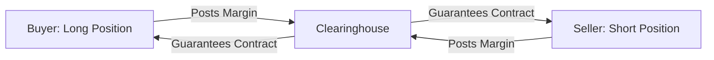

## 8.1 Derivative Instrument and Derivative Market Features

Have you ever heard someone talking about “betting on future prices” of, say, wheat or coffee beans? I remember sitting with a friend in a coffee shop and thinking, “Wait, you’re telling me people can lock in coffee bean prices six months in advance?” That was my first real conversation about derivatives—these amazing instruments that let you manage price risks that might otherwise keep you awake at night. Let’s dive deeper into what they are and how they work.

### Introduction
A derivative is like a chameleon in the financial world. Its value changes based on something else, called an underlying asset (or reference rate). That underlying can be stocks, bonds, interest rates, currencies, commodities, or even indexes like the S&P 500. The key idea is that the derivative “derives” its value from the performance of that underlying. To bring it down to a simpler level: imagine you make a bet with a friend about the future price of a pizza ingredient—say cheese. If cheese prices go up, you might receive money; if they go down, you pay. That bet’s payoff depends entirely on cheese prices. Well, that’s essentially how derivatives work—except they’re more formalized, regulated (to varying degrees), and typically traded by institutions, professional investors, or corporate treasurers.

### Definition of a Derivative
We can think of a derivative as a financial contract whose terms and payoff depend on the value of an underlying asset. For example, the payoff of a stock option contract may be based on the price of Apple stock on a certain date. That dependency is precisely why we call it a “derivative.”

Key elements often found in a derivative contract:
• Two (or more) parties: buyer and seller.  
• Terms specifying how the payoff is determined (the payoff function).  
• Notional value or amount, which is used to scale the gains or losses from the position.  
• Maturity date (for many, but not all derivatives) or settlement period.  
• Delivery/settlement conditions (physical delivery versus cash settlement).  

### Key Features of Derivative Instruments

#### Contractual Agreement
At its core, a derivative is an agreement between a buyer (long position) and a seller (short position). This agreement lays out when and how the derivative will be settled, plus any obligations—like posting margin or collateral.

#### Notional Amount
The notional amount is the “face value” that you’ll often see in a derivative contract. It’s used to compute how much money changes hands, but it might not necessarily change hands in full. For instance, in an interest rate swap, the notional principal frequently remains the same and isn’t actually exchanged—only the net interest payments change hands. Nonetheless, that notional amount matters for calculating your potential gains or losses.

#### Delivery or Settlement
Settlement can take two forms:
• Physical Delivery: The actual underlying asset gets delivered. Think a barrel of oil.  
• Cash Settlement: Rather than delivering the physical asset, the parties settle the contract by exchanging a payment that reflects the difference between the contract price and the market price.  

In modern financial markets, many derivative trades utilize cash settlements because it’s simpler, cheaper, and more convenient, especially when the underlying asset is intangible or difficult to handle physically (like an index).

#### Counterparty Risk
In an ideal world, everything goes smoothly. But in reality, there’s always the risk that the other party might fail to live up to their end of the bargain. This is known as counterparty risk. It’s particularly significant in Over-the-Counter (OTC) markets, where trades are bilateral (one-on-one) rather than guaranteed by an exchange clearinghouse. More on that in a moment.

### Exchange-Traded vs Over-the-Counter (OTC) Derivatives
You’ve probably heard about the “futures exchange” on the news. These exchanges provide standardized derivative contracts. Meanwhile, OTC derivatives are private, bespoke deals negotiated directly between two parties. Let’s open that up a bit more.

#### Exchange-Traded Market
• Standardized Contracts: Futures contracts, most exchange-listed options, and some other derivatives come in fixed amounts with standardized maturity dates.  
• Clearinghouse Guarantee: Exchanges use a central clearinghouse. Buyers and sellers post margins to the clearinghouse, which stands in between them as the buyer to every seller and the seller to every buyer.  
• Lower Counterparty Risk: Because the clearinghouse serves as a backstop, individuals face reduced counterparty risk.  
• Transparent Pricing: Exchange-traded derivatives usually have publicly available price quotations.  
• Regulatory Oversight: Exchanges typically operate under stricter regulations that aim to protect investors and ensure market integrity.

Let’s illustrate the relationship among the buyer, seller, and clearinghouse in an exchange-traded environment:

In this diagram, the clearinghouse effectively ensures that both buyer and seller honor their commitments. If the buyer cannot pay, the clearinghouse covers the default (at least up to certain limits), and vice versa.

#### Over-the-Counter (OTC) Market
• Customized Contracts: Parties can tailor notional amounts, maturities, and settlement terms to their unique needs.  
• Higher Counterparty Risk: There is no clearinghouse. Each party relies on the other to meet obligations.  
• Less Transparency: Prices are usually negotiated privately, so there isn’t a central order book.  
• Flexibility: Because the contracts can be customized, participants might find precisely the risk exposures they need.  
• Importance of Credit Assessment: Each participant must closely evaluate the creditworthiness of the other side.  

Examples of OTC derivatives include many swaps (interest rate swaps, currency swaps) and exotic options (instruments with special payoff features).

### Margin Requirements, Collateral, and Clearing Mechanisms
Margins act a bit like security deposits to ensure that parties fulfill their obligations. In exchange-traded derivatives, margins are mandatory. Typically, there’s an initial margin (you post upfront) and maintenance margin (which you must continuously meet with variation margin calls). If your contract moves against you (i.e., you are losing money), you’ll have to top up your margin to get back to the required level.

In the OTC world, collateral requirements can also exist, but they’re negotiated between the parties. Large institutions usually sign an International Swaps and Derivatives Association (ISDA) master agreement that outlines how collateral gets posted, when margin calls occur, and how disputes about valuation might be resolved. If any party’s credit situation changes, the contract might require additional collateral to manage the increased default risk.

### Case Study: Hedging Commodity Prices
Let’s say you run a small coffee-roasting business (true story: I once dreamed of starting one, until I realized how volatile coffee bean prices can be!). You’re worried about rising coffee bean prices over the next few months. You can use a coffee futures contract on an exchange to lock in today’s price for beans. If coffee bean prices soar, your futures contract gains in value, offsetting what you pay in the cash market for the actual beans.

However, if coffee prices tumble, your futures contract loses value, but you can buy cheaper beans in the spot market. Either way, you’ve reduced your risk because you - in effect - “locked in” your cost in advance. That’s a real benefit of derivative markets: letting you hedge risk so your business doesn’t get blown away by price swings.

### Risks and Regulatory Framework
Regulations can vary significantly between jurisdictions, but they tend to be stricter for exchange-traded derivatives. That’s partly because policymaking bodies believe transparency and standardized oversight help contain systemic risk. The 2008 global financial crisis sparked major reforms of the OTC derivative market, pushing many standardized OTC derivatives to be traded on electronic platforms (or at least centrally cleared) in an effort to reduce counterparty risk.

• Regulatory Bodies: Some important organizations in derivatives oversight include the Commodity Futures Trading Commission (CFTC) in the United States and the European Securities and Markets Authority (ESMA) in the European Union.  
• Post-2008 Reforms: Many jurisdictions mandate so-called central clearing for standardized swaps and require more robust margining, recordkeeping, and reporting for OTC derivatives.  
• Systemic Risk: Some regulators keep a close eye on “too big to fail” institutions heavily involved in derivatives to ensure that the default of one major player doesn’t cascade through the entire financial system.

### Common Pitfalls and Best Practices
• Underestimating Counterparty Risk: In OTC markets, it’s easy to overlook your counterparty’s credit quality. Thorough due diligence is crucial.  
• Over-Leverage: Derivatives often use margin, which can lead to magnified losses if the position moves against you. Always keep an eye on your leverage.  
• Ignoring Liquidity: Thinly traded contracts can yield large bid-ask spreads. If you need to exit a position quickly, think about how much it might cost.  
• Documentation: Well, it’s not glamorous, but make sure legal terms (like those in the ISDA master agreement) are properly understood.  
• Regulatory Requirements: If you’re using derivatives in a professional context, be sure to adhere to reporting, margining, and clearing rules that might apply in your jurisdiction.  

A best practice approach is to maintain a robust risk management process: define your hedging objectives, measure your risk exposures, and monitor positions regularly. Even if you have a custom derivative that perfectly offsets a particular risk in normal circumstances, changes in markets or in the counterparty’s credit quality might transform the “perfect hedge” into something less certain.

### Conclusion
In a nutshell, derivatives allow market participants to transfer (or take on) risks tied to underlying assets—like interest rates, currencies, commodities, or equities. Because they’re flexible and powerful, derivatives serve vital roles in price discovery, speculation, and risk management. But it’s not all sunshine and roses. Derivatives can be complicated, and the potential for large losses is real if you don’t fully understand the product. That said, if used responsibly, derivatives can be a game-changer, whether you’re a multinational corporation hedging currency risk or a local roaster locking in your coffee bean prices.

### References and Further Reading
• Hull, J. C. (2021). “Options, Futures, and Other Derivatives.” Pearson.  
• CFA Institute “Derivatives and Alternative Investments” readings.  
• Tuckman, B., & Serrat, A. (2011). “Fixed Income Securities: Tools for Today’s Markets.” Wiley.  
• BIS (Bank for International Settlements) Reports on OTC Derivatives:  
  https://www.bis.org/statistics/derstats.htm  

---------

## Test Your Knowledge: Derivative Instrument and Derivative Market Features



### Which of the following statements best describes a derivative instrument?

- [ ] A financial instrument whose value is entirely independent of other assets.
- [x] A financial contract whose value is derived from the performance of an underlying asset.
- [ ] A security that always involves physical delivery of commodities.
- [ ] A type of money market instrument unaffected by interest rate movements.

> **Explanation:** Derivatives depend on the performance (price, rate, or index) of something else, such as a stock, bond, or commodity.

### In an exchange-traded derivative contract, the clearinghouse primarily serves which purpose?

- [ ] It acts as a private broker linking buyers and sellers directly without margin requirements.
- [x] It guarantees contract performance by interposing itself between buyers and sellers.
- [ ] It eliminates all forms of counterparty credit risk in the market.
- [ ] It ensures that derivatives are always physically settled.

> **Explanation:** The clearinghouse stands in the middle of buyers and sellers to guarantee performance and reduce counterparty risk.

### A customized interest rate swap is typically traded in which type of market?

- [ ] On a regulated futures exchange with uniform contract sizes.
- [ ] On an exchange-traded options market.
- [x] Over-the-Counter (OTC) market.
- [ ] On a strictly government-regulated spot market.

> **Explanation:** Swaps are commonly OTC market instruments, allowing parties to negotiate specific terms.

### What does “notional amount” refer to in a derivative contract?

- [ ] The actual cash amount that changes hands every time.
- [x] The face value used to calculate payments.
- [ ] The market price of the underlying asset at expiration.
- [ ] The liquidation value of the contract on any given day.

> **Explanation:** The notional amount is used for calculation of payments but may not necessarily be exchanged.

### Which feature is most associated with an OTC derivative contract?

- [x] Flexible or customized terms catering to the exact needs of the parties.
- [ ] Strict standardization of contract size and expiration dates.
- [ ] Guaranteed performance by the clearinghouse.
- [x] Negotiable but might carry higher counterparty risk.

> **Explanation:** OTC derivatives are customized but come with additional counterparty risk because there is no central clearing.

### The process of posting a security deposit to cover potential losses in a derivative position is commonly known as:

- [ ] Hedging collateral.
- [ ] Price leveling.
- [x] Margining.
- [ ] Premium settlement.

> **Explanation:** Margin is the deposit that derivative users must maintain to absorb potential losses.

### Why might an organization choose a cash-settled derivative rather than physical delivery?

- [ ] Because cash-settled derivatives are unregulated.
- [x] Because physical delivery of the underlying asset might be impractical or expensive.
- [x] Because it often reduces logistical costs and complexities.
- [ ] Because it eliminates all credit risks.

> **Explanation:** Cash settlement simplifies the process by eliminating the need to deliver the underlying asset directly, reducing cost and complexity.

### Underestimating counterparty risk is more likely to occur in which scenario?

- [ ] Exchange-traded futures because they have standardized margins.
- [ ] Clearinghouse-backed options traded on large exchanges.
- [x] Private, bilateral OTC contracts without third-party guarantees.
- [ ] Government bonds that pay fixed coupons.

> **Explanation:** OTC contracts do not have the safety net of a clearinghouse, making counterparty risk especially relevant.

### One key motivation for regulators to encourage central clearing of standardized OTC derivatives is to:

- [ ] Avoid the use of margins and collateral.
- [ ] Prevent direct negotiation among participants.
- [x] Reduce systemic risk by pooling and netting exposures in a central entity.
- [ ] Increase the use of physical delivery in the market.

> **Explanation:** Central clearing can significantly reduce the chain reaction that might follow a large counterparty default.

### Collateral arrangements in the OTC derivatives space are typically governed by:

- [x] An ISDA master agreement.
- [ ] The clearinghouse rulebook.
- [ ] Federal bankruptcy laws only.
- [ ] The Commodity Swap Standards Board.

> **Explanation:** In bilateral OTC markets, collateral provisions (e.g., margin calls, thresholds) are usually set out in an ISDA master agreement.


