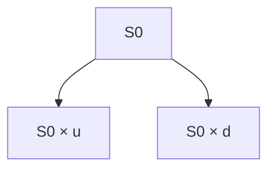

## 8.10 Valuing a Derivative Using a One-Period Binomial Model

Picture the following scenario: you’re introduced to the concept of derivative pricing for the first time, and it feels like diving into a vast ocean with no land in sight. I remember that sense of overwhelm the first time I saw all the formulas for options and futures. “How does one even begin to systematically value these things?” you might think. Well, one intuitive stepping stone is the one-period binomial model. It’s a neat, simplified framework that can help us understand how derivative prices emerge—and it’s also the gateway to more complex models down the line. 

In this article, we’ll explore how a one-period binomial model works, why the concept of risk-neutral probability is so central, and walk through a practical example. Despite its simplicity, the one-period binomial model is an integral piece of modern derivative pricing. So let’s jump in.

## Why the One-Period Binomial Model?

If you’ve been perusing the earlier sections of this chapter (see Sections 8.1–8.9 for a broader overview), you know that derivatives often contain complex payoff structures. But at the core of any derivative’s value lies the same principle: discounting expected future payoffs to the present. The binomial model simplifies the path of the underlying asset into an “up” or “down” movement over a single time step. Although it may look too simplistic, it beautifully lays out the process of:

• Defining possible price outcomes,  
• Calculating potential payoffs,  
• Incorporating risk-neutral probabilities,  
• Discounting to find today’s fair value.

We’ll see how each of these links together in just a bit.

## Key Concepts

### Up and Down Factors (u and d)

In the binomial model, we assume the underlying asset (such as a stock) can only move to one of two prices after one period:

• Up to S₀ × u  
• Down to S₀ × d  

Here,  
• S₀ is the current price,  
• u represents the “up factor,”  
• d represents the “down factor.”  

Instead of containing a continuous range of possibilities like real life, the model gives you two discrete paths. This might feel simplistic (and it is), but it’s a way to break down a problem into more digestible chunks.

### Risk-Free Rate (r) and Discounting

To value a derivative, we need a benchmark for time value of money. We typically use the risk-free rate r for discounting future cash flows. Whether it’s the yield on a short-term government bond, or some other proxy, it sets the standard for how we compare money we receive in the future versus money we have today.

### Risk-Neutral Probability (p*)

The heart of the binomial model is the concept of risk-neutral valuation. Under the risk-neutral measure, we pretend that all investors are indifferent to risk—meaning they only require a return equal to the risk-free rate. This doesn’t mean real investors are actually indifferent to risk; this is merely a mathematical device that simplifies pricing. 

The risk-neutral probability p* is derived in such a way that the expected growth of the underlying asset under this “neutral” world matches the risk-free rate. In continuous compounding form:

p* = ( e^(r × ∆t) – d ) / ( u – d )

If you’re working with discrete compounding, you might see:

p* = ( (1 + r) – d ) / ( u – d )

Either way, p* is not necessarily the same as the real-world probability that prices go up or down. Instead, it’s specifically crafted for a no-arbitrage framework.

### No-Arbitrage

No-arbitrage is a principle that basically says: “There is no free lunch in the market.” If there were, it’d mean you could make a profit with zero net investment over a certain time horizon, which is supposedly impossible (well, in theory anyway!). The risk-neutral probability is precisely set so that no arbitrage opportunities exist in the simple up/down world of our binomial model.

## The One-Period Binomial Model Step by Step

Let’s outline the process in a structured way:

• Identify the current price of the underlying asset, S₀, and the strike or payoff conditions of the derivative.  
• Pick or estimate the up factor (u) and the down factor (d). These can come from historical volatility, or a simplified assumption like “up by 20%, down by 10%.”  
• Determine the derivative payoff in each scenario—call it Vᵤ (for the up scenario) and V_d (for the down scenario).  
• Compute the risk-neutral probability p*.  
• Find the expected payoff under the risk-neutral measure: p* × Vᵤ + (1 – p*) × V_d.  
• Discount it by the risk-free rate. The result is the derivative’s fair value today.  

Now, let’s see how this works in a real (though simplified) numerical example.

## A Practical Example: Valuing a One-Period Call Option

Let’s say we have a stock currently trading at S₀ = $100. Our up factor is u = 1.2 (implying a 20% up move), and our down factor is d = 0.8 (implying a 20% decline). We have a risk-free rate r = 5% for the period (assume discrete compounding for clarity). The time horizon is one period—maybe that’s one year, or one month, or one minute, depending on your model, but typically we assume something like six months or one year.

We want to price a call option with a strike price K = $105, which expires at the end of this single period. Let’s:

1. Calculate the stock price in both states:  
   • Up state: Sᵤ = S₀ × u = 100 × 1.2 = $120.  
   • Down state: S_d = S₀ × d = 100 × 0.8 = $80.  

2. Determine the payoff of the call (Vᵤ, V_d) in both states. Since a call payoff is max(0, S_T – K):  
   • Vᵤ = max(0, 120 – 105) = $15.  
   • V_d = max(0, 80 – 105) = $0 (because it’s out of the money if the stock ends up at $80).  

3. Compute the risk-neutral probability p*. With discrete compounding:  
   p* = ( (1 + r) – d ) / ( u – d )  
        = ( (1 + 0.05) – 0.8 ) / (1.2 – 0.8 )  
        = (1.05 – 0.8) / 0.4  
        = 0.25 / 0.4  
        = 0.625  

4. Calculate the expected payoff under p*:  
   Eₙ [V] = p* × Vᵤ + (1 – p*) × V_d  
           = 0.625 × 15 + (1 – 0.625) × 0  
           = 0.625 × 15 + 0.375 × 0  
           = 9.375  

5. Discount that expected value at the risk-free rate. Over one period with discrete compounding, the present value is:  
   Value = Eₙ [V] / (1 + r)  
         = 9.375 / (1 + 0.05)  
         = 9.375 / 1.05  
         ≈ $8.93  

So, in our simplified scenario, the fair call price is approximately $8.93. That’s it—our one-period binomial model is done! Sure, real life is more complicated, but that’s the big idea. 

### A Quick Sanity Check

Think about whether this $8.93 makes sense: a call with a strike of $105, where the stock might end up at $120, does have some “intrinsic style” value if you expect an upward move. But it might also expire worthless if the stock heads downward. Discounting that expectation at a modest risk-free rate yields a price a bit over $8. That seems in a reasonable ballpark.

## Visualizing the One-Period Tree

You might find it helpful to visualize the one-period binomial model via a simple diagram. Here’s a quick Mermaid diagram showing the asset price evolution from time 0 to time 1:

Time flows from left to right. From a single node at time 0—representing the current price—moves branch into two nodes, one for the up state and one for the down state.

## A Note on Risk-Neutral Valuation

It’s worth repeating that risk-neutral pricing isn’t trying to say that in the real world, the asset has a 62.5% chance of going up (in our example) and a 37.5% chance of going down. Instead, it’s a constructing device that ensures you can’t get arbitrage profits. It’s an incredibly elegant trick: If you discount payoffs by the risk-free rate with these probabilities, you get the correct, no-arbitrage price.

## Practical Considerations and Best Practices

• Choose Realistic (u, d) Factors: If you pick unrealistic up/down factors or ones that don’t reflect the asset’s volatility, you’ll get a shaky sense of the derivative’s theoretical cost. Some folks use u = e^(σ√Δt) and d = e^(–σ√Δt), where σ is the volatility.  
• Keep Track of Time Steps: Even though we’re focusing on a single step, many real models have multiple steps or use continuous-time approaches. As you add more time steps, you get closer to results from continuous models like Black–Scholes.  
• Verify No-Arbitrage: If (1 + r) is not strictly between u and d, you might run into arbitrage or negative probabilities. For instance, you need d < (1 + r) < u in the discrete version.  
• Check for Negative Probability: If p* comes out negative or above 1, your parameters are invalid for a no-arbitrage framework.  

## Multi-Period Extensions

You might be thinking, “Hey, real markets don’t just move once and stop.” Precisely. The key advantage of the binomial tree approach is that it seamlessly extends to multiple periods. For a two-period model, you’d have three possible ending stock prices: up-up, up-down (or down-up), and down-down. Each node in the second stage depends on the prices from the first stage. 

As the number of periods grows, the binomial model gradually converges to the continuous-time approach used by something like the Black–Scholes model (see also Section 8.4 on arbitrage). The steps become smaller and more numerous, and you approximate a continuous price path. 

For instance, in a two-period model:

• First period: S₀ goes to either S₀ × u or S₀ × d.  
• Second period from the up node: S₀ × u × u or S₀ × u × d.  
• Second period from the down node: S₀ × d × u or S₀ × d × d.  

You then compute the payoff at the final nodes, discount them back step by step (using risk-neutral probabilities at each branch), and arrive at the value at time 0.

## Relating to Other Derivative Pricing Methods

The binomial model is a foundation for many other pricing approaches. Whether you eventually move on to multi-step binomial trees, trinomials, or even fancy Monte Carlo simulations, the method is anchored in the same principles:

• No-arbitrage,  
• Risk-neutral valuation, and  
• Discounting expected payoffs.  

If you’re exploring advanced derivative topics, you might delve into Section 8.4 (“Arbitrage, Replication, and the Cost of Carry in Pricing Derivatives”) or Section 8.9 (“Option Replication Using Put–Call Parity”) for complementary insights. The binomial tree method is like a mini-laboratory for learning the deeper logic of these models before tackling more complex frameworks.

## Real-World Considerations

In the real world, you rarely just see one up or down movement. Prices fluctuate constantly, often more like a spider web of possibilities than a simple tree. Nonetheless, the binomial model’s basic architecture remains relevant. In practice, you’ll combine it with advanced calibration methods, historical data analysis, or real-time volatility measures to get workable results.

Also, keep in mind that markets are not truly “risk-neutral.” Investors demand compensation for taking on greater risk. Risk-neutral worlds are a pricing convenience, not a predictor of real outcomes. That said, re-valuing derivatives under this assumption is widely accepted in the industry for establishing a fair theoretical price.

## Common Pitfalls

• Mixing Up Real vs. Risk-Neutral Probabilities: Don’t confuse p* with the actual probability that the asset goes up or down in real life.  
• Ignoring Transaction Costs: The binomial model in its pure form assumes frictionless trading. In practice, fees, slippage, and other factors can lead to slightly different valuations.  
• Misapplying Continuously vs. Discretely Compounded Rates: Make sure your formula for p* is aligned with your approach to compounding. Wrong formula usage = nonsense results.  
• Overlooking Reinvestment or Dividend Yields: If the underlying asset pays dividends, you need to factor that into your up/down moves or adjust your payoff accordingly.

## Personal Reflections

I remember the first time I walked through a numerical example similar to the one above. It seemed so strange that we were using these made-up “risk-neutral” probabilities. But once I realized we’re simply forcing the expected growth rate of the stock in this little model to be the risk-free rate, it clicked: we’re scanning for a world with no freebies and no risk premiums in the sense of the underlying drifting. It’s a mathematically consistent world—if you deviate from it, you’d get arbitrage. Funny how that works, right?

## References

- Cox, J. C., Ross, S. A., & Rubinstein, M. (1979). “Option Pricing: A Simplified Approach.” Journal of Financial Economics.  
- Hull, J. C. (2021). Options, Futures, and Other Derivatives. Pearson, various chapters on Binomial Trees.  
- CFA Institute. Required Readings on “Binomial Option Pricing.”  
- See also: Chapter 8.4, “Arbitrage, Replication, and the Cost of Carry in Pricing Derivatives,” and 8.9, “Option Replication Using Put–Call Parity” for deeper insights.

-----

## Test Your Knowledge: One-Period Binomial Model Fundamentals



### Which of the following best describes the key assumption in a one-period binomial model?

- [x] The price of the underlying can move to exactly two possible values over one time step.
- [ ] The price of the underlying follows a geometric Brownian motion.
- [ ] The price of the underlying moves in a continuous path.
- [ ] The price of the underlying must remain unchanged until option expiration.

> **Explanation:** In a one-period binomial model, we assume the underlying moves “up” or “down” just once during the life of the option.

### How is the risk-neutral probability (p*) derived in a discrete compounding framework?

- [ ] p* = (u – (1+r)) / ( d – u )
- [ ] p* = (u – d) / ((1+r) – d)
- [x] p* = ((1 + r) – d) / (u – d)
- [ ] p* = (d – (1+r)) / (u – d)

> **Explanation:** Under discrete compounding, the risk-neutral probability is p* = [ (1 + r) – d ] / (u – d). It ensures the expected growth rate of the underlying matches the risk-free rate.

### In the one-period binomial model, what primary role does the risk-neutral probability (p*) serve?

- [x] It ensures there is no arbitrage in the model.
- [ ] It predicts real-world likelihoods of asset price movements.
- [ ] It forces the stock price to remain constant.
- [ ] It matches the volatility of the asset in the real market.

> **Explanation:** Risk-neutral probabilities are used strictly to avoid arbitrage and price derivatives consistently, not to describe real-world probabilities.

### In a simple one-period binomial model with an up factor u=1.10, a down factor d=0.90, and a discrete risk-free rate r=0.02, which of the following p* calculations is correct?

- [ ] p* = (1.02 – 1.10) / (1.10 – 0.90)
- [ ] p* = (1.10 – 1.02) / (1.10 – 0.90)
- [ ] p* = (1.02 – 0.10) / (1.10 – 0.10)
- [x] p* = (1.02 – 0.90) / (1.10 – 0.90)

> **Explanation:** We apply p* = [ (1 + r) – d ] / (u – d ) = [ (1.02) – 0.90 ] / (1.10 – 0.90 ) = 0.12 / 0.20 = 0.60.

### If the payoff to a call option in the up state is $15 and $0 in the down state, and p* is 0.70, what is the one-period expected payoff under the risk-neutral measure?

- [ ] $0
- [ ] $15
- [x] $10.50
- [ ] $10.00

> **Explanation:** The expected payoff is 0.70 × 15 + 0.30 × 0 = $10.50 under the risk-neutral measure.

### Which statement is accurate regarding discounting the expected payoff in a one-period binomial model?

- [x] The future payoff is discounted at the risk-free rate to get today’s fair value.
- [ ] The payoff is discounted at the real-world expected return of the underlying.
- [ ] No discount factor is used because there is only one period.
- [ ] The payoff is not discounted if the option is at the money.

> **Explanation:** The one-period binomial model requires discounting the risk-neutral expected payoff at the risk-free rate to achieve no arbitrage pricing.

### Which formula correctly reflects the present value (PV) of a risk-neutral expected payoff Eₙ[V] under continuous compounding for one period Δt?

- [x] PV = Eₙ[V] × e^(-r × Δt)
- [ ] PV = Eₙ[V] / (e^(r × Δt) – 1)
- [ ] PV = Eₙ[V] × (1 – r × Δt)
- [ ] PV = Eₙ[V] × (1 + r × Δt)

> **Explanation:** Under continuous compounding, the present value is Eₙ[V] × e^(-r × Δt). This ensures a no-arbitrage solution.

### Which of the following could cause the risk-neutral probability p* to become negative or greater than 1, violating the no-arbitrage condition?

- [x] Choosing an up factor u less than (1+r) or a down factor d greater than (1+r).
- [ ] Using the continuously compounded version of p* instead of the discrete version.
- [ ] Assuming the underlying price can take more than two values.
- [ ] Discounting at a rate higher than the actual risk-free rate.

> **Explanation:** If (1 + r) fails to lie strictly between u and d (or e^(r × Δt) fails to lie between u and d for continuous compounding), p* might fall outside [0,1], which indicates an arbitrage condition in the model.

### According to the binomial model, why do we say p* is a “risk-neutral” probability, even though it might differ from real-world estimates?

- [x] Because it is constructed so that investors are indifferent to risk and the underlying grows at the risk-free rate under this measure.
- [ ] Because it perfectly matches real-world scenarios.
- [ ] Because it aligns exactly with the stock’s historic volatility.
- [ ] Because it is the default probability used by all investors.

> **Explanation:** Under the risk-neutral measure, investors are treated as if they only care about the risk-free rate, making them indifferent to risk in this theoretical framework.

### True or False: The one-period binomial model for an option's value becomes more accurate as you add more periods and let those periods shrink in length.

- [x] True
- [ ] False

> **Explanation:** As the number of periods rises and the step size decreases, the binomial tree approximates a continuous-time model, which is typically more precise in capturing the dynamics of asset price movements.


