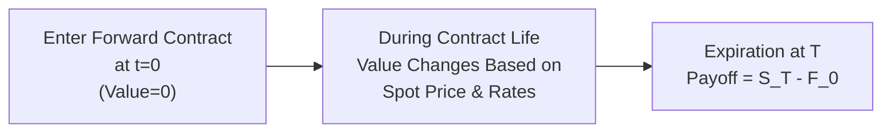

## 8.5 Pricing and Valuation of Forward Contracts and Underlying with Varying Maturities

There’s something both mysterious and exciting about forward contracts, right? The notion that you can lock in a price today for something deliverable at a specified future date can feel like fortune-telling—yet, in finance, we see it as a practical, grounded strategy. Like many of you, I remember being utterly clueless when I first encountered forward contracts in a textbook. I kept wondering: “Wait, how do you agree on a price today that makes sense for a transaction tomorrow, and how does that even stay fair for both parties?” Well, let’s clear that up by exploring how forward contract pricing is set, how it changes over time, and how maturity lengths influence it all.

Feel free to hop over to Chapter 2 (Quantitative Methods) if you need a refresher on interest rate fundamentals (Section 2.1, “Rates and Returns”) or skip over to Chapter 7 (Fixed Income) if you want to see how spot, par, and forward curves (Section 7.9) relate to fixed-income instruments. After all, finance is one big puzzle, so let's piece it together step by step.

---

Understanding the Basics  
Sometimes we throw around the term “forward contract” as though it’s automatically intuitive. But in simple terms, a forward contract is an agreement between two parties to buy or sell an underlying asset at a predetermined price (the forward price) on a future date (the maturity date). No money typically changes hands when you initiate the contract—so it's literally a “promise” to transact in the future.

• The buyer of the forward (the “long” position) agrees to buy the underlying asset at maturity.  
• The seller of the forward (the “short” position) agrees to sell.  

Until we reach that maturity date, the contract itself may fluctuate in value. It can be super confusing if you’re new to the concept, so let's break it down in more detail.

---

Forward Price at Initiation (Zero Value at T=0)  
First things first: when a forward contract is initiated, we set what we call the “forward price” (F₀) in such a way that the value of this contract is zero to both parties. That means neither the buyer nor the seller is at an advantage or disadvantage right away.

Let’s consider the simplest possible scenario: a non-dividend-paying stock, no storage costs, and a risk-free rate r that we assume to be constant and applied continuously. In that idealized universe, the contract’s forward price for delivery T years from now is:

$$
F_0 = S_0 e^{rT}
$$

Here:  
• \\(F_0\\) is the forward price at initiation.  
• \\(S_0\\) is the current spot price of the underlying.  
• \\(r\\) is the risk-free interest rate (continuously compounded).  
• \\(T\\) is the time to maturity (in years).

If we instead assume discrete compounding, we might use:

$$
F_0 = S_0 (1 + r)^T.
$$

Basically, what’s happening is: the cost of deferring payment for the asset is captured by the factor \\(e^{rT}\\) or \\((1+r)^T\\). If you bought the asset outright today, you’d pay \\(S_0\\). If you wait T years, you pay \\(F_0\\), which includes the accumulation of interest or “carry costs” over time.

---

Adjustments for Dividends, Convenience Yields, and Coupons  
Of course, life’s rarely that simple. Many assets pay dividends (like stocks), coupons (like bonds), or might have storage costs or a so-called “convenience yield” (like commodities). Each of these can shift the forward price.

• Dividends: If the asset pays a known dividend yield \\(\delta\\), it reduces the forward price because owning the asset outright yields some cash flow.  
• Convenience Yield: For some commodities—think precious metals or even industrial metals—owning the physical good provides intangible advantages (like guaranteeing supply). This intangible benefit is often modeled as a “convenience yield” that reduces the forward price.  
• Coupon Yield: Bonds pay out periodic coupons. If those coupons are known, the forward price is adjusted downward, reflecting that the holder of the bond receives coupon payments during the life of the contract.

When we factor these in (continuously compounded), a more general formula might look like:

$$
F_0 = S_0 e^{(r - y + s) \times T}
$$

…where:  
• \\(y\\) is the continuous yield (like a dividend yield or coupon yield).  
• \\(s\\) could be net storage costs minus convenience yield, if relevant.  

A bit messy, right? But the essence is always the same: we’re adding or subtracting any benefits or costs of carrying the asset from the forward price.

---

Value During the Life of the Contract  
Let’s say we’ve marched a few months into this forward contract. Now the spot price may have changed, the interest rates might be different, or the yield environment could be updated. At that point, the forward contract that was once zero-value might now show a profit or loss for one party.

Mathematically, if \\(F_0\\) was the original forward price, and \\(F_t\\) is the new “fair” forward price at some time \\(t\\), then the current value of the forward contract (to the long position) could be approximated by:

$$
\text{Value to long} = S_t - F_0 e^{-r \times (T-t)}
$$

…under continuous compounding assumptions (and ignoring additional yields or convenience factors for simplicity). Another approach is to say the value is:

$$
V_t = \left(F_t - F_0\right) \times e^{-r \times (T-t)}.
$$

Both approaches conceptually discount the difference between the newly determined forward price and the old locked-in forward price, because you can’t collect or pay that difference until the contract matures. If the new fair forward price \\(F_t\\) is higher than \\(F_0\\), the long is sitting on a gain, and vice versa.

Anyway, it’s not that complicated once you see it in action. Imagine it like this: if the forward contract set a locked-in price of \$100 for an asset, but now the market says the “fair” forward price should be \$110, that’s obviously bad news for the short position (who’s obligated to sell at \$100). The total difference of \$10 belongs to the long, but discounted for the time remaining. Done deal.

---

Value at Expiration  
Fast-forward to maturity (time T). The contract is (finally!) about to be executed. The payoff for the long is:

$$
\text{Payoff to long} = S_T - F_0
$$

…where \\(S_T\\) is simply the spot price of the underlying asset at maturity. It’s straightforward: if the spot price at maturity is above your locked-in forward price \\(F_0\\), you’re in the money. If it’s below \\(F_0\\), the short wins. The short’s payoff is \\(F_0 - S_T\\).

On a side note, if you were just speculating and never intended to actually take delivery, you might “close out” your position in the same way: if the spot price is higher than your forward price, you gain. Otherwise, you lose. There’s no running away from it.

---

Forward Rates for Interest Rate Contracts  
Let’s pivot slightly to interest rate forwards, sometimes called Forward Rate Agreements (FRAs). You might recall from Chapter 7 or from real-world bond trading floors, interest rates can be mapped out in a yield curve. Then we can “derive” forward rates for specific times in the future.

For example, if you want to lock in an interest rate to borrow or lend money three months from now for a six-month period, you can do so with an FRA. The general approach is similar: use the relevant short-term rates or zero-coupon yield curve to compute a forward interest rate that would make the contract’s initial value zero.

We can neatly illustrate the concept of forward interest rates using the following notation:

• \\(L(t_1, t_2)\\) = the annualized forward interest rate applied between \\(t_1\\) and \\(t_2\\).  
• Typically, you’d discount or compound according to the yield curve spot rates to solve for that forward rate.

But the easy part to remember is: if you’ve hammered out a forward rate in an FRA, you have locked in that future interest rate right now.

---

Varying Maturities and the Term Structure  
Here’s the fun part: forward contract prices differ for different maturities because the cost of carry, interest rate environment, and yield assumptions vary across time. Instead of a single contract for T=6 months, you might be analyzing T=1 year, T=2 years, or T=5 years. Each maturity can have a unique forward price. This is especially evident in the fixed income space, where you see an entire “forward curve” that extends into future time periods, shaped by expectations of future rates (or supply and demand, or central bank policy signals, or any number of factors).

In commodities markets, you sometimes see an entire forward (or “futures”) curve that can either be in “contango” (longer maturities are more expensive) or in “backwardation” (longer maturities trade at lower prices). This shape can reflect storage costs, convenience yields, or the expected supply/demand imbalance. Traders or hedgers pick the maturity that aligns with when they need physical delivery or want to close out their risk.

So, from a practical standpoint:  
• If you’re a wheat farmer who wants to hedge the sale of your harvest, you’d pick a forward contract that expires around harvest time.  
• If you’re a bond portfolio manager wanting to lock in an interest rate six months from now for a 12-month period, you’d pick an FRA that exactly covers those dates.  

Different players, different needs, different maturities—and the differing forward prices reflect the entire term structure of interest rates or cost of carry over the relevant horizon.

---

A Quick Visual Overview

Below is a simple flowchart that captures the timeline of a typical forward contract, from initiation to evaluation during life, then to final payoff at expiration:

At the start, value = 0. Over time, the contract’s value can rise or fall for each party until maturity when it’s settled.

---

Practical Examples and Stories  
1. Hedging Stock Positions: Imagine you own a block of a non-dividend-paying stock and you’re worried it might drop in price. A forward contract can lock in a sell price for a few months, letting you sleep better. If the stock plummets, your short forward gains.  
2. Commodities for Bread Makers: A small bakery that uses lots of wheat might sign a forward contract with a grain supplier to lock in a stable cost of wheat. No more sleepless nights about prices spiking.  
3. FRA for Corporate Borrowing: A company that plans to issue debt in six months might want to fix the interest rate. They do an FRA with a bank—if rates rise, the bank compensates them, if rates decline, the company compensates the bank. Helps with budget planning, but obviously has costs or an opportunity loss if rates move in your favor ironically.

On a more personal front, I remember being relieved when a friend locked in a forward price for some foreign currency for a study abroad trip. They had that “Oh phew, no more stress about the exchange rate” moment. They gave up some possible upside if the currency swung the other way, but they nicely avoided the risk of it becoming more expensive.

---

Best Practices and Common Pitfalls  
• Clearly define your hedging objectives before using forwards. No one wants to find out they’ve hedged the wrong maturity or the wrong quantity.  
• Understand your underlying thoroughly—especially if there’s a dividend or a convenience yield. This changes the cost-of-carry math.  
• Watch out for credit risk. Forwards are often over-the-counter (OTC) instruments, so if your counterparty goes bust, you might not get paid. In contrast, exchange-traded futures have clearinghouses.  
• Don’t forget that the mark-to-market process is different from futures. A forward contract’s cash exchange happens at contract expiration (unless you close out early). With futures, gains and losses settle daily.  
• Over-hedging or hedging with the wrong maturity can create new exposures. If harvest occurs in 4 months but you used a 6-month forward, you might face basis risk or mismatch in time.  

--

Looking at the Balance Sheets (and Life)  
If you’re an accountant or a future analyst currently cruising through Chapter 4 (Financial Statement Analysis), consider how forward contracts can appear off-balance-sheet for the period in which they're not yet exercised. They can experience a huge swing in value, but they might not show up precisely if you haven't marked them to market. So be sure your knowledge of IFRS or GAAP regarding derivatives is up to speed. Another reason to keep your coffee machine at the office well-stocked!

---

References and Further Reading  
• CFA Institute Readings: “Pricing and Valuation of Forward Contracts.”  
• Hull, J. C. (2021). “Options, Futures, and Other Derivatives.” Various chapters covering forwards, FRAs, and valuation.  
• Tuckman, B., & Serrat, A. (2011). “Fixed Income Securities.” Chapters discussing forward interest rates and term structures.

---

Below is a sample table summarizing how to adjust the forward price for various yields (assuming continuous compounding). For more detail, you can also look back at Chapter 2 for time value of money tips.

| Underlying   | Forward Price Formula            | Notes                                                              |
|--------------|----------------------------------|--------------------------------------------------------------------|
| No Dividends | F₀ = S₀ e^(rT)                   | Basic cost-of-carry approach.                                      |
| Dividend Yield | F₀ = S₀ e^((r - \\(\delta\\))T)   | \\(\delta\\) reduces net cost of carry.                              |
| Commodity Storage | F₀ = S₀ e^((r + s - CY)T)    | Storage costs (s) vs. convenience yield (CY).                      |
| Bond Coupon   | F₀ = S₀ e^((r - \\(\text{coup}\\))T)| Deduct present value of coupons.                                   |

---

Wrap-Up  
So, that’s it in a nutshell (a big nutshell, I know!). Forward contract pricing is all about imposing fair value initially, then letting market forces move the value around over time. By the time you reach maturity, you’ll see who is “in the money” and who’s “brokenhearted” about that locking in arrangement. Varying maturities just reflect that time horizon differences imply different interest rates, storage costs, or simply changes in market expectations, so each forward contract effectively has its own price. 

If you leave with just one key takeaway, let it be this: whenever you’re dealing with forward contracts, keep your eyes on the cost of carry, the yields (coupon, dividend, convenience), and the time horizon. These are the main puzzle pieces. Make sure they’re all in place, and your forward pricing puzzle solves itself nicely.

Now, shall we dig into a quick self-test?

## Master the Details of Forward Contract Pricing and Valuation: Quiz



### Which of the following statements best describes the value of a forward contract at initiation?

- [ ] It is always strictly positive.
- [ ] It is always strictly negative.
- [x] It is zero to both parties if priced fairly.
- [ ] It oscillates unpredictably from day one.

> **Explanation:** A properly priced forward contract has zero initial value to both the long and the short.  

### In a simple world with no dividends, no storage costs, and continuous compounding, what is the fair forward price F₀ for an asset that has a current spot price S₀ and a risk-free rate r for T years?

- [ ] F₀ = S₀ × e^(-rT)
- [x] F₀ = S₀ × e^(rT)
- [ ] F₀ = T × r × S₀
- [ ] F₀ = S₀ / (1 + r)^T

> **Explanation:** Under continuous compounding and no other costs or yields, F₀ = S₀ × e^(rT).  

### How does the existence of a convenience yield (CY) typically impact the forward price of a commodity?

- [x] It reduces the forward price compared to a situation with zero convenience yield.
- [ ] It raises the forward price compared to a situation with zero convenience yield.
- [ ] It has no effect.
- [ ] It mirrors a dividend yield.

> **Explanation:** A positive convenience yield is an extra benefit from holding the physical commodity, so the forward price tends to be lower.  

### If a company entered a forward contract to buy an asset at F₀ = $100, and three months later the “fair” forward price for the same maturity is $105, what does that indicate for the value to the long position (ignoring discounting)?

- [ ] It's at a $5 loss since the forward price rose.
- [x] It's at a $5 gain since the original forward price is lower than the new fair price.
- [ ] It remains unchanged because the contract can’t be marked to market.
- [ ] It depends on whether interest rates have decreased.

> **Explanation:** If the new fair forward price is higher, the original long locked in a cheaper price, so the position has gained in value by $5 (before discounting).  

### At the expiration of a forward contract, what is the payoff to the short if the final spot price (Sᵀ) is below the originally agreed forward price (F₀)?

- [ ] 0
- [ ] Sᵀ + F₀
- [x] F₀ − Sᵀ
- [ ] Sᵀ ÷ F₀

> **Explanation:** The short’s payoff is F₀ − Sᵀ at expiration. If Sᵀ is below F₀, the short benefits.  

### What does it mean if a commodities forward curve is in “contango”?

- [ ] Shorter-dated contracts have higher prices than longer-dated ones.
- [x] Longer-dated contracts trade at progressively higher prices compared to nearer contracts.
- [ ] Forward prices for all dates are identical.
- [ ] The underlying commodity is expected to vanish by maturity.

> **Explanation:** Contango refers to a situation where forward prices are higher at longer maturities, often driven by storage costs and other factors.  

### A forward rate agreement (FRA) is primarily used to:

- [x] Lock in a borrowing or lending rate for a future period.
- [ ] Hedge currency exchange risk.
- [ ] Gain exposure to equities without ownership.
- [ ] Commit to a commodity delivery at a future date.

> **Explanation:** FRAs are specifically designed to lock in an interest rate for a future borrowing/lending period.  

### Suppose you have a bond paying an annual coupon of 5%. When pricing the forward contract on this bond, how would the coupon typically affect the forward price?

- [x] It lowers the forward price relative to a zero-coupon bond.
- [ ] It raises the forward price relative to a zero-coupon bond.
- [ ] It has no effect whatsoever.
- [ ] It can either raise or lower the forward price, depending on stock market volatility.

> **Explanation:** Cash flows like coupons reduce the forward price because the holder of the underlying bond receives these payments directly.  

### Which statement best describes the role of “cost of carry” in forward pricing?

- [x] It encapsulates storage costs, financing costs, and any income from holding the asset.
- [ ] It is solely the interest rate used for discounting.
- [ ] It only applies to perishable commodities.
- [ ] It only applies to equity markets.

> **Explanation:** Cost of carry includes all relevant costs (including financing rates, storage, etc.) and benefits (e.g., dividends, convenience yield) associated with holding the underlying asset until maturity.  

### True or False: A forward contract on a zero-coupon bond that matures at the same time as the bond itself would be identical to just owning the bond outright.

- [x] True
- [ ] False

> **Explanation:** If the bond itself has no coupons and both the contract and the bond mature at the same time, the forward contract effectively replicates the same payoff as holding the bond (excluding credit risk differences if any).  




