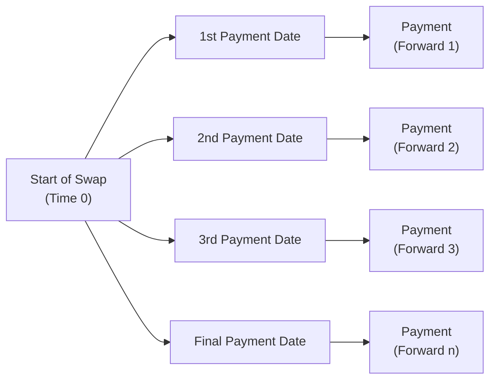

## 8.7 Pricing and Valuation of Interest Rates and Other Swaps

Swaps are everywhere in the world of finance—though often hiding in plain sight. They might seem a bit abstract when you first encounter them, but, trust me, these instruments are part of everyday corporate and investment decision-making. In the simplest sense, a “swap” is just an agreement between two parties to exchange a series of cash flows in the future. That’s it! But once you dig deeper, you realize the powerful roles swaps play in managing risk, tailoring exposures, or even speculating on interest rates or foreign currencies.

I remember the first time I encountered an interest rate swap while consulting for a small manufacturing company. I was so puzzled: “Wait, so they owe me a payment if rates go one way, and I owe them if rates go another way?” But soon, it all clicked: the company was using a swap to hedge against rising interest costs on a floating-rate loan—and it was saving them a lot of money when interest rates unexpectedly climbed.

Let’s pull back the curtain on how these fascinating instruments work. In this section, we’ll walk through the concept of interest rate swaps, see how to value them, and also touch upon other popular swaps like currency swaps and equity swaps.

---

### Swaps as a Series of Forward Contracts

One of the neat mental models for understanding interest rate swaps is to see them as a bundle (or series) of forward contracts. Specifically, a plain vanilla interest rate swap—with one party paying a fixed rate and receiving a floating rate—can be thought of as multiple forward rate agreements (FRAs). Each FRA corresponds to a specific payment date, fixing the terms for that particular interval.

• Plain Vanilla Interest Rate Swap  
  – One counterparty pays a fixed rate on a notional principal.  
  – The other counterparty pays a floating rate on the same notional principal.  
  – The floating rate is often tied to a popular index, such as LIBOR (historically) or SOFR (in more recent contracts), or another local reference rate, resetting periodically.

You might wonder: “Why see it as multiple forward contracts?” Well, each time we have a scheduled payment in the swap, we can treat it as if it were a single forward contract paying off at that date. Summed together, all those FRAs replicate the interest rate swap’s net cash flow profile. This vantage point also lets us see how swaps are priced consistently with other forward-based instruments.

If you like visuals, here’s a high-level look. In the following Mermaid diagram, each forward contract is one arrow in the timeline of cash flows:



Each “Payment <br/>(Forward X)” highlights that every single payment can be considered a FRA (or forward-based contract). The notional principal remains the reference, but it’s not typically exchanged in an interest rate swap.

---

### Similarities to Forward Commitments

So how does a plain vanilla interest rate swap compare to other forward commitments? Both a swap and a forward contract require a future exchange of cash flows. On day one, as a brand-new contract is born, it’s typically structured so that its initial fair value is zero—meaning both sides think they’re getting a fair deal.

• Both swap and forward: An agreement now for settlement in the future.  
• Net present value (NPV): At inception, the contract has an NPV of zero.  
• Gains and losses: The value can fluctuate as market conditions (e.g., interest rates, currency rates, stock-index levels) move.

The difference mainly lies in the repeated exchange of cash flows that a swap entails. A forward contract for a particular commodity or financial asset typically has one settlement date (or at most a handful if it physically settles). A swap, however, is like a forward contract that resets and settles repeatedly, each period, until it matures.

---

### Valuation of an Interest Rate Swap

Valuation can be broken into two times: (1) right at initiation and (2) during the life of the swap.

#### Valuation at Initiation

At the moment a plain vanilla interest rate swap is set up, the fixed rate is chosen such that the present value of expected payments on the floating leg equals the present value of expected payments on the fixed leg. Because these two present values match, the value of the swap is zero. To see why, imagine if the swap wasn’t initially worth zero: one party would be handing the other side an immediate profit. No rational counterparty would agree to that (or they'd demand a compensating payment).

Let’s say we have a swap that runs for three years with semiannual payments, and the floating rate is something like SOFR plus a spread. If the best estimate of that floating rate leads to an expected average of 3.5% annualized, then the fixed rate we choose might also end up around 3.5% (or maybe a bit higher or lower, depending on day-to-day markets) to make the swap’s initial fair value zero.

#### Valuation During the Life of a Swap

Once the swap is alive and kicking, its value can change for each party. For instance, if interest rates start to rise significantly above the fixed rate you’re paying, guess what: your fixed-rate payments might suddenly look sweet compared to if you’d stayed floating. Conversely, if rates fall, the floating-rate payer might be on the losing side.

To figure out the value at any point in time, we basically “mark to market” both legs—just like you’d do for a bond. Let’s break it down:

• Fixed leg value:  
  – The present value (PV) of all the remaining fixed payments (including that final notional if it’s a principal-exchanging swap, though in a standard interest rate swap, the notional isn’t swapped).  
  – We discount each fixed payment using appropriate discount factors for the specific future payment dates.

• Floating leg value:  
  – Usually on the reset date, the floating rate gets locked in for the next period. This means if we’ve just reset the floating rate, the floating portion of the swap is typically worth par (equal to the notional) right after that reset—because the next floating payment is set to match the market rate.  
  – If we’re in between resets, the floating leg’s value might deviate slightly from par, reflecting accrued interest and the present value of future floating-rate payments.

#### A Handy Example

Imagine you entered a 2-year swap, paying 4% fixed and receiving a floating rate that is currently 4.2%. Let’s say we’re one year in, and the new market swap rate (for a new 1-year swap) is 5%. Because new swaps are paying 5% fixed, your locked-in 4% might be less attractive to a potential buyer of your position. You can compute the difference between the present value of paying 4% for the remaining year and the present value of paying 5% for a brand-new swap. That difference is basically the swap’s market value from your perspective (and it could be negative, meaning you'd have to pay to exit the swap).

Anyway, to do the math step by step:

1. Calculate the present value of your fixed payments (4% of the notional) for the remaining periods, discounted at the current appropriate rate (around 5% in this example).  
2. Calculate the present value of receiving floating payments, which might be 4.2% for the next period, plus expectations for the subsequent reset if it’s within the year.  
3. Subtract the second from the first (or vice versa, depending on which side you’re on) to figure out your net value.

---

### Other Swaps

Interest rate swaps aren’t the only game in town. We also have currency swaps, equity swaps, commodity swaps, and so on, each with its own little quirks.

#### Currency Swaps

In a currency swap, you exchange principal and interest payments in one currency for principal and interest in another. For example, you might have a British company that wants to borrow USD at a low rate, while a U.S. company wants to borrow GBP at a low rate. They might do a currency swap: each agrees to make payments in the currency the other one needs. What’s interesting here is that the notionals in different currencies are typically exchanged at the start and re-exchanged at maturity. As a result, currency swaps often involve actual principal exchanges (unlike a standard interest rate swap where notional is just a reference).

I recall a big beverage company that used a currency swap to fund expansion in Europe. Instead of going through the trouble of issuing euro-denominated bonds (which can have higher issuance costs for foreign corporations), they issued a dollar-denominated bond in the U.S., then swapped those payments into euros, effectively achieving a euro liability at a lower cost. It was a neat trick that saved them a bundle on interest payments. 

#### Equity Swaps

Equity swaps let you exchange the return on an equity index or individual stock for a different stream of payments, which could be a fixed rate, floating rate, or even another equity index. For example, one party might pay the return on the S&P 500 Index, while receiving LIBOR plus 2%. This is a way to get or hedge equity market exposure without directly buying or selling shares. Because you’re just “swapping returns,” there need not be the large upfront cost or the friction of physically trading the underlying.

Equity swaps are a popular tool for portfolio managers who want to quickly change their exposure to equity markets. Maybe they want to be out of the physical shares for a short time—like if they’re anticipating a big tax event or corporate action—but still want to hold an equity exposure. An equity swap can accomplish that elegantly.

---

### Putting It All Together: A Multi-Swap Perspective

Let’s say you’re a CFO of a mid-sized firm with global operations. You might have an interest rate swap hedging your floating-rate debt, a currency swap managing your exposure to European revenues, and (if you’re really fancy) an equity swap to replicate a performance bonus for some execs who want upside in the firm’s stock price. “Um, that’s a lot,” you might say. Indeed, you can stack these instruments to fine-tune your risk profile as you see fit.

In truth, banks or financial institutions typically stand ready to provide these custom solutions. They’ll do the behind-the-scenes magic of matching your needs to other clients’ needs—or they might just hedge your swap in the open market themselves. As a result, the global swap market is massive—a testament to how crucial these instruments are worldwide.

---

### Best Practices and Common Pitfalls

While swaps can be immensely helpful, there are a few pitfalls worth mentioning:

• Overhedging: Sometimes, companies “overhedge” their exposure and lock in rates that end up unfavorable if the original risk profile changes.  
• Credit Risk with Counterparties: A swap is only as good as the promise of the other side to keep paying. Counterparty risk management (via collateral, netting, clearinghouses, or close-out netting provisions) is critical.  
• Complexity: If you’re not careful, the complexity of multiple swaps or unusual swap structures can lead to confusion, especially around resetting periods, notional changes, or embedded options.  
• Wrong Forecasting: If you enter into a swap under the assumption that rates will move a certain way—but the market does the opposite—your hedge or speculation might cost you instead of saving you.

One of the best ways to handle these issues is to have a clear hedging or investment policy that outlines what exposures you aim to hedge and for how long. If you decide to speculate with swaps—which some firms do—that’s fine, but be transparent with your stakeholders about the risks and possible outcomes.

---

### Practical Example: Lisa’s Coffee House

Sometimes a small business with a variable-rate loan can run into trouble if interest rates spike. Let’s suppose Lisa has a chain of quaint coffee houses, financed by a floating-rate bank loan pegged to a local index that’s currently at 3%. She’s worried about further increases as the economy heats up.

Lisa strikes an interest rate swap deal with her local bank:

• She agrees to pay a 3.5% fixed rate.  
• The bank pays her the floating rate (reset monthly) on the notional principal of $1 million.

At inception:  
– The swap is set so that the expected floating rate is around 3.5%, so no cash changes hands initially (NPV = 0).  

Over time:  
– If the floating rate rises to 4%, Lisa receives 4% from the bank, pays out 3.5%, and nets 0.5% (which she can use to partially offset the higher rate on her actual loan).  
– If the floating rate falls to 2.5%, she receives 2.5%, pays 3.5%, and nets –1.0%. But, the drop in the interest cost of her actual loan makes up for part of this loss.  

The end result is that Lisa’s interest costs get more predictable—she’s effectively locked in a stable (3.5%) rate plus or minus some net difference. She’s hedged her risk. Owning a small chain of coffee houses, she sleeps better at night, not constantly checking the financial news to see if interest rates have soared.

---

### Case Study: Cross-Currency Swap for a Tech Startup

Alternatively, consider a cross-currency swap scenario. Suppose you’re running a tech startup in the U.S. that wants to sell software in Japan. You might plan to tap a local Japanese investor who is willing to lend you yen at a relatively attractive rate. However, you still have a lot of expenses in the U.S. and prefer to pay them in dollars. You could:

• Borrow the funds in yen from the Japanese investor.  
• Enter a cross-currency swap with a bank, where you exchange yen for dollars at the beginning.  
• Throughout the life of the swap, you pay the bank interest in yen, and you receive interest in dollars from the bank.  
• At maturity, you swap the principal amounts back.

This arrangement can potentially secure a lower cost of funding than if you just borrowed in dollars, especially if your global brand or local intelligence in the Japanese market qualifies you for cheaper borrowing in yen. Because you handle the currency exchange via the swap, you reduce your exposure to fluctuations in the dollar–yen exchange rate.

---

### Diagrams for Valuation Insights

Let’s illustrate how valuation changes for a plain vanilla interest rate swap. We’ll do a simplified timeline:

```mermaid
flowchart LR
    start["Swap Start <br/>(t=0)"] --> fixLeg["Pay Fixed Rate <br/>(semiannual)"] 
    fixLeg --> midPoint["Current Time <br/>(t=x)"]
    midPoint --> floatLeg["Receive Floating Rate <br/>(semiannual)"] 
    floatLeg --> end["Swap End <br/>(t=T)"]
```

At t=0, the net value is zero. At some time x in the middle of the swap’s life, the swap might have a positive or negative value, depending on changes in market rates relative to the fixed rate you locked in. By the time you get to t=T (maturity), all payments are settled, and the swap’s value is zero again (because there are no future payments left).

---

### Common Formulas (KaTeX)

Often when we talk about the fixed leg’s present value, we use the standard bond pricing approach:


\text{PV}_{\text{fixed leg}} = \sum_{i=1}^{n} \left( R_{\text{fixed}} \times \text{Notional} \times \tau_i \times P_i \right),


where:  
• \\( R_{\text{fixed}} \\) is the fixed swap rate.  
• \\( \tau_i \\) is the fraction of the year for each payment period \\( i \\).  
• \\( P_i \\) is the discount factor for the \\( i \\)-th payment date.  

For the floating leg, right after a rate reset, we can consider it as near par (i.e., worth the notional), because it’s set to the market rate. Otherwise, you can compute the present value of each expected floating payment in a similar summation, discounting by appropriate discount factors.

---

### Strategies for Risk Management

• **Hedging Floating-Rate Debt**: If you’ve borrowed at a floating rate but want certainty, paying fixed in a swap is a straightforward solution.  
• **Speculative Positions on Rates**: Traders or funds might want to bet on falling (or rising) rates. They’ll enter a swap to profit if their rate forecast materializes.  
• **Transforming a Debt Portfolio**: A corporate treasurer might hold existing bonds or loans and want to shift the profile from short-term to long-term or vice versa. Swaps can do that elegantly without requiring a new physical issuance or redemption.

---

### Where Does All This Fit in the CFA® Program?

- **Forward Commitment Underpinnings**: Remember from earlier sections (e.g., “Forward Commitment and Contingent Claim Features and Instruments”) that a forward contract commits you to a future transaction. Swaps essentially string multiple forward commitments together.  
- **Marking-to-Market and Pricing**: You’ll see echoes of bond valuation logic and forward rate logic in these swaps. Everything ties back to discounting—just like in fixed income.  
- **Risk Management**: Being comfortable with swaps is vital for the Portfolio Management portion of the program (Chapter 10). Understanding how to measure and hedge exposures can be a game-changer.

---

### Practical Tips, Common Pitfalls, and Strategies to Succeed

• **Tip**: Always specify the day count convention (30/360, actual/360, actual/365, etc.) and the frequency of payments. It can affect the exact rates.  
• **Tip**: Confirm if the swap has a standard fixed-for-floating structure or if it’s an amortizing swap, a step-up swap, or something exotic.  
• **Pitfall**: Failing to monitor or update your assumptions on the benchmark rates used. If the reference rate changes drastically (like the transition from LIBOR to SOFR), you could be caught off guard.  
• **Pitfall**: Overlooking “credit value adjustments” (CVA) or “debit value adjustments” (DVA) in computing the fair value of a swap. Real-world swaps can entail credit risk that modifies the fair value.  

If you ask me, the best approach is to keep your eyes on the fundamentals: discounting using correct yield curves, being mindful of reset dates, and regularly re-evaluating the creditworthiness of your counterparty.

---

### References and Further Reading

- CFA Institute readings on “Pricing and Valuation of Swaps.”  
- Hull, J. C. (2021). Options, Futures, and Other Derivatives. (See chapters on interest rate swaps and currency swaps.)  
- Sundaresan, S. (2009). Fixed Income Markets and Their Derivatives. Academic Press.  

These sources dive even deeper into the nitty-gritty of swaps, from multi-curve discounting to advanced credit considerations.

---

So that’s the story on pricing and valuation of interest rate swaps and other swaps. Essentially, at inception, a swap is crafted to have zero fair value, with the fixed rate pegged to the floating rate outlook. Valuation after that is about marking to market each leg—discounting future cash flows to see where you stand. And remember, currency swaps, equity swaps, and many other variants follow a similar logic but adapt to different underlying references.  

If you’re ever in the position of deciding whether to enter into a swap, keep your eyes open for how interest rate expectations, credit risk, and liquidity in the swap market can shift your fortunes. Thanks for reading, and I hope you’re feeling more at ease with this vital topic. Now go forth and swap wisely!

---

## Test Your Knowledge: Interest Rate and Other Swaps Quiz



### 1. A plain vanilla interest rate swap can be viewed conceptually as:  
- [ ] Multiple currency swap agreements.  
- [x] A series of forward rate agreements.  
- [ ] A series of options on interest rates.  
- [ ] A single bond and a single floating-rate note.  

> **Explanation:** A plain vanilla interest rate swap essentially consists of multiple FRAs, each covering one payment period in the swap.

### 2. At the initiation of a typical plain vanilla interest rate swap, the value to both parties is:  
- [ ] Positive for the fixed-rate payer.  
- [ ] Negative for the floating-rate payer.  
- [x] Zero for both parties.  
- [ ] Dependent on the floating rate’s next reset.  

> **Explanation:** At initiation, the swap is designed such that the present value of the fixed leg equals the present value of the floating leg, resulting in zero initial value.

### 3. In valuing the floating leg of a plain vanilla interest rate swap right after a reset date:  
- [ ] The floating leg value is always greater than the fixed leg’s value.  
- [x] The floating leg can be considered approximately equal to the notional.  
- [ ] The floating leg has no value if rates decrease.  
- [ ] The floating leg is negative if the floating rate is above the fixed rate.  

> **Explanation:** Right after the floating rate resets, the floating-rate payments align with the current market rates, making the floating leg’s value close to par (i.e., near the notional).

### 4. In a currency swap, the principal:  
- [ ] Is never exchanged at all.  
- [x] Is typically exchanged at the start and re-exchanged at maturity.  
- [ ] Is only notional and never changes hands.  
- [ ] Is exchanged monthly along with interest payments.  

> **Explanation:** Currency swaps generally involve exchanging principal amounts in two different currencies at the start, then re-exchanging at maturity, plus exchanging interest payments throughout.

### 5. For a firm that has floating-rate debt but wants to lock in their cost of debt, the firm would typically use:  
- [ ] A credit default swap.  
- [x] A pay-fixed, receive-floating interest rate swap.  
- [ ] A currency swap.  
- [ ] An equity swap.  

> **Explanation:** To hedge rising floating rates and lock in a fixed rate, the firm pays fixed and receives floating. This offsets changes in its floating-rate debt payments.

### 6. In an interest rate swap, the notional principal is:  
- [x] Typically not exchanged by either party.  
- [ ] Always exchanged at both initiation and maturity.  
- [ ] Swapped only if interest rates move more than 200 basis points.  
- [ ] Exchanged if the swap’s value becomes positive.  

> **Explanation:** In a standard plain vanilla interest rate swap, payments are based on the same notional principal, but it is not actually exchanged.

### 7. The typical benefit of an equity swap is that it allows an investor to:  
- [ ] Buy and hold physical shares without paying dividends.  
- [x] Gain or hedge equity exposure without physical ownership of the underlying stock.  
- [ ] Never pay transaction costs when trading stocks.  
- [ ] Become immune to market risk.  

> **Explanation:** Equity swaps let you receive or pay equity returns synthetically, removing the need to physically buy or sell the underlying shares.

### 8. Which of the following describes a major risk in using interest rate swaps?  
- [x] Counterparty credit risk.  
- [ ] The inability to fix the interest rate.  
- [ ] Complete elimination of all market risks.  
- [ ] Guaranteed profit from interest rate fluctuations.  

> **Explanation:** Swaps are subject to counterparty risk because either party may default on scheduled payments. They don’t guarantee profit.

### 9. If a floating-rate payer in a plain vanilla swap expects interest rates to rise significantly, the market value of their swap position (floating-rate payer, fixed-rate receiver) will likely:  
- [x] Increase.  
- [ ] Decrease.  
- [ ] Remain the same.  
- [ ] Instantly expire.  

> **Explanation:** If you receive fixed and pay floating, and floating rises, you pay more. But from a valuation standpoint, your position becomes more favorable because receiving a higher fixed rate has value in a rising rate environment.

### 10. A swap can be thought of as a portfolio of:  
- [x] Multiple forward contracts.  
- [ ] American call options.  
- [ ] European put options.  
- [ ] Outright futures positions.  

> **Explanation:** Each payment period of a swap resembles a separate forward agreement, making the swap a bundle of forward-type contracts.


