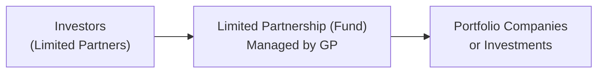
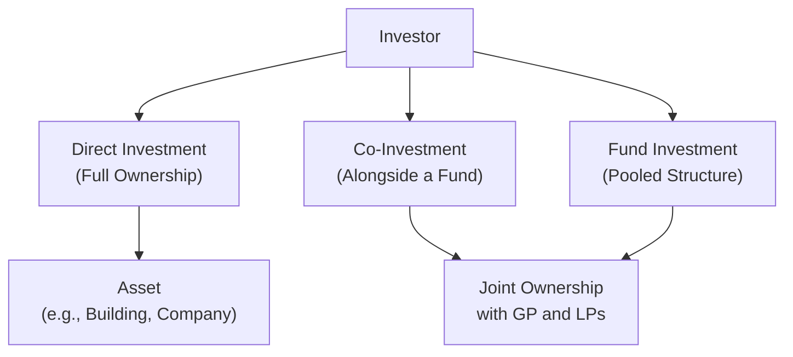

## 9.1 Alternative Investment Features, Methods, and Structures

Picture this: my aunt once tried to diversify her retirement portfolio and ended up buying a small piece of farmland. She’s not a professional farmer, and she’ll be the first to say, “Well, I’ve got no idea how to harvest wheat!” But something about owning real assets to guard against inflation felt comforting. And, truthfully, she liked the romantic notion of farmland more than having all her money in, you know, intangible stocks and bonds. This down-to-earth story captures an essential essence of alternative investments: they can be fascinating, they can be fruitful, but they often involve complexities and unique levels of risk (and, occasionally, real wheat).

Below, we’ll explore why many investors consider alternative investments in the first place, what sets them apart from traditional asset classes like stocks and bonds, and how these investments are often structured and managed. So, let’s buckle up (or lace up our farm boots)—we’ve got quite a bit to cover!

### Characteristics of Alternative Investments

Alternative investments typically refer to things like private equity, private debt, real estate, infrastructure, commodities, hedge funds, and yes, the emerging world of digital assets. They generally share a few distinct characteristics:

• Lower Liquidity: Many alternatives, such as private equity, are not easily traded on open markets. You often face a lock-up period—maybe several years—where you literally cannot redeem your investment, even if you’re itching to cash out.  
• Less Transparency: Hedge funds and some private capital structures aren’t always required to disclose full details of their holdings on a day-to-day basis. That secrecy can be a double-edged sword: it frees the managers to pursue sophisticated strategies, but it can also be uncomfortable for some investors who like to keep a close eye on their portfolio.  
• Revised Regulatory Oversight: Traditional investments like publicly traded stocks typically face more stringent reporting requirements. Meanwhile, alternative investments often enjoy fewer regulatory constraints. This can allow them to use leverage, derivatives, or short-selling with fewer limitations—again, more freedom and potentially more complexity.  
• Higher Potential for Outsized Returns: Because of their complexity and relative illiquidity, these investments can (in theory) offer higher returns. They can also help with diversification and may have unique risk-return profiles compared to public equities and bonds. However, with the potential for higher returns, watch out for unique risks and sometimes higher fees.

### Motivations for Investing in Alternatives

Investors who incorporate alternatives into their portfolios tend to chase a few main benefits:

• Diversification: Perhaps one of the biggest reasons. If an asset class moves to its own beat (i.e., low correlation with equities or bonds), it can reduce overall volatility in the portfolio.  
• Inflation Hedge: Real estate, farmland, commodities—these often track inflation better than a typical stock or bond might, at least in theory. So, if you’re worried about inflation eroding your purchasing power, alternative investments can sometimes act like a cozy hedge.  
• Potentially Enhanced Returns: Private equity funds attract many investors because of the possibility of higher (though not guaranteed) returns. If the economy is booming, or if technology startups are skyrocketing, a private capital fund might bring in significant gains above the public market.  

Of course, these benefits come with strings attached—unusual assets require more rigorous due diligence, and things like valuation can be more complicated, sometimes involving specialized knowledge or resources.

### Comparison: Traditional vs. Alternative Asset Classes

If you’re used to buying shares of a publicly traded company or a government bond, stepping into alternative investments can feel like you’ve landed on a different planet. You might experience:

• Different Valuation and Reporting: Traditional stocks and bonds have daily price quotes. Many alternative assets only update valuations quarterly or even annually.  
• Complex Strategies: Hedge funds can combine leverage, short selling, derivatives, and other tactics not generally used by long-only equity or fixed-income portfolios.  
• Longer Time Horizons: With private equity or infrastructure projects, you may commit capital for a decade or more. These “patient capital” approaches demand an investor’s unwavering tolerance for illiquidity.  

### Investment Methods

Rather than diving headfirst into farmland you’d have to manage personally, there are multiple ways to gain exposures to alternative assets. Each comes with its own pros, cons, and complexities.

#### Direct Investment

This is where you buy the home, the office building, the farmland, or the entire private business outright—no middleman. It can be incredibly hands-on and requires:

• Capital Commitments: Direct ownership usually involves a large chunk of cash. Owning an office tower obviously costs more than a few equity shares.  
• Domain-Specific Knowledge: Real estate developers, farmland managers, or niche business owners need specialized expertise. If you purchase farmland with zero clue how wheat futures work, you can quickly find yourself in trouble.  
• Active Management: Upkeep, compliance, hiring staff, paying property taxes—these tasks fall squarely in your lap.

Still, some folks love the control that direct ownership grants them. They don’t rely on a fund manager’s decisions. It’s like being the boss (but sometimes that boss job is tough).

#### Co-Investment

In a co-investment deal, you typically team up with a specialist fund on a particular project. For example, let’s say a private equity firm spots a promising mid-sized tech startup. The fund invests on behalf of its pooled vehicle, but they also let a few limited partners put additional money directly into the same company.

• Advantages: Co-investments can lower fees, provide deeper insight into a specific deal, and let you focus your capital on an opportunity you really believe in.  
• Risks: Concentration risk looms large. If your co-investment is in a single real estate project or company that fails, it can be a major blow to your capital.  

Co-investment is sometimes considered the “best of both worlds,” but it sure isn’t risk-free: you’re still reliant on the general partner (GP) for management and due diligence—plus your capital is significantly tied up in a single place.

#### Fund Investment

This is the most common route for individuals and institutions who want exposure to alternatives but don’t have the time, resources, or thirst for direct involvement. You invest in a fund, typically:

• Structured as a pooled vehicle where a professional manager (the GP) invests across multiple opportunities (portfolio companies, real estate projects, commodities, etc.).  
• Entails Management Fees (maybe around 1–2% of committed or invested capital) plus an Incentive Fee (often around 20%) based on the profits. We’ll talk more about these fees a bit later.  
• Might Have a Lock-up Period. Hedge funds might lock your capital for one year or more. Private equity funds, even longer—sometimes ten years or more.  

Investing via funds is usually “hands-off,” so you have fewer responsibilities but also less direct control over the assets. That means your success is tied deeply to the skill of the manager.

### Common Ownership Structures

Fundamentally, how are alternative investments packaged and legally structured? Here are two popular choices:

• Limited Partnership (LP): This is extremely common for private equity, venture capital, and hedge funds. The GP manages investments and bears unlimited liability (in classic legal structure terms), while limited partners (LPs) have limited liability but no say in daily operations.  
• Limited Liability Company (LLC): This arrangement offers liability protection and a flexible management system that might better suit certain jurisdictions or investor types.

These structures are used because they clearly separate the manager from the investor, define the liability boundary, and offer pass-through tax treatment (in many jurisdictions) that can be more favorable for investors.  

### Compensation Structures

Compensation, or the way a fund manager makes money, is critical for aligning interests. Personally, I’ve had friends in private equity who’s entire bonus hinged on meeting performance hurdles—talk about loving (or hating) the idea of a year-end check.

• Management Fees: Usually, a fixed percentage of the fund’s committed or invested capital. Let’s say 2% per year is common for many private equity or hedge funds.  
• Performance / Incentive Fees: This is typically a share of the fund’s profits that exceeds a benchmark or hurdle rate. For example, the manager might be paid 20% of all returns above 8%. In formula form, it might look like:  
  
  \text{Performance\_Fee} = \alpha \times \max(R - \text{Hurdle\_Rate}, 0)
    
  where \\(\alpha\\) represents the participation rate (like 20%), \\(R\\) is the total return, and \\(\text{Hurdle\_Rate}\\) is the minimum required return. If \\(R\\) doesn’t exceed the hurdle, no performance fee is paid, which ideally aligns the manager’s incentive with the investor’s outcome.

Some managers also factor in a “high-water mark,” meaning if the fund dips below a certain NAV (net asset value), they have to catch up that performance before earning new incentive fees. That’s designed to prevent managers from getting paid multiple times on the same gains after a drawdown.

### Key Concepts and Terms

In the world of alternative investments, you’ll encounter plenty of specialized terms. Let’s clarify a few to reduce the confusion:

• Lock-up Period: The time you cannot redeem your capital from the fund. Private equity and venture capital typically have the longest lock-up periods—often seven to ten years.  
• Drawdown Schedule (Capital Call): Private equity or real estate managers don’t always need your full amount of committed capital right away. They “call” for it (in increments) as investment opportunities arise.  
• Hurdle Rate: Think of it as the minimum performance level the fund manager has to beat before they get their performance fee.  
• Vintage Year: The year a private equity or alternative fund starts calling capital. This is useful for performance benchmarking because you can compare funds launched in the same economic climate.

### Visualizing a Typical Fund Structure

Sometimes, diagrams help clarify the relationships among investors, managers, and underlying assets. Below is a simple Mermaid.js flowchart of a pooled fund structure:

• Investors (LPS) commit capital to the fund but do not handle day-to-day decisions.  
• The GP manages the fund, sources deals, invests capital, and aims to generate returns.  
• The fund holds stakes in various portfolio companies or assets.

### Potential Pitfalls and Challenges

Now, I’m sure everything sounds exciting—who wouldn’t want to invest early in the next tech unicorn or buy farmland that produces a neat side income? But we’d be minimizing reality if we didn’t address some big potential issues:

• Valuation Risks: Many alternative assets aren’t valued daily, so you might carry them at some estimate on your books. Surprises can occur when the asset is eventually sold.  
• Illiquidity: Let’s say you’ve locked up your money in a 10-year private equity fund. If you suddenly need the cash, you’re often out of luck.  
• Regulatory and Tax Complexities: Some countries treat hedge fund or private equity gains differently. You may have to jump through complicated structures to mitigate double taxation or to remain compliant.  
• Manager Selection: The difference between the top and bottom quartile alternative investment managers is often much wider than in traditional assets. Picking a strong manager matters, big time.

### Real-World Scenarios

• The Private Equity Boom: Over the last decade, private equity has grown massively. Institutional investors, like pension funds, allocate increasing portions of their portfolio to PE for higher returns. However, they must also accept the multi-year lock-up and the complexity of evaluating these managers.  
• Hedge Fund Evolutions: Hedge funds began as exotic trading vehicles for high-net-worth individuals. Now, they’re a mainstream option for endowments, sovereign wealth funds, and even some retail investors via “liquid hedge funds.” They can utilize long-short strategies, global macro strategies, or event-driven strategies—often behind a veil of limited disclosure.  
• Digital Assets Emergence: Cryptocurrencies and broader digital tokens—these make the alternative investing world even more dynamic. They have the potential for large gains, but also big drawdowns, and come with unique security and regulatory questions.

### Strategies for Navigating Alternatives

• Conduct Extensive Due Diligence: If you’re investing directly or choosing a manager, do your homework. Evaluate track records, understand strategies, talk to references, and, well, kick the tires.  
• Assess Liquidity Needs: The portfolio you build should match your liquidity profile. If you might need quick access to cash, investing a large share in a long-term locked-up fund can be a real problem.  
• Proper Diversification: Don’t put all your eggs in one basket—particularly relevant in the alternative space, where single deals or strategies might carry substantial idiosyncratic risk.  
• Scrutinize Fee Structures: A 2% management fee and 20% incentive might be standard, but you should push for terms that align with your interests. Do you want a hard hurdle, a soft hurdle, or a catch-up provision? It matters more than you might think over the life of the fund.  

### Encouraging Critical Thinking

In my opinion, alternative investments represent a fantastic area for adventurous and sophisticated investors—just don’t let their mystique overshadow your rational analysis. Perhaps you hear a friend bragging about their successful private equity investment, then you wonder if you should jump in. Pause. Ask yourself: “Do I truly understand the underlying asset or strategy? Can I handle the risk of losing a big chunk of money?” If yes, then keep exploring. If not, maybe it’s time to read more or consult a professional.

### Best Practices

• Start Small: If you’re new to alternatives, it can be wise to begin with a relatively small allocation within your overall portfolio. Get familiar. Learn the ropes.  
• Align with Reputable Managers: Track record alone isn’t everything, but it’s a big part of manager selection. A well-established team with a proven approach can make a difference.  
• Be Patient: Alternatives can take years before you see results. Private equity investments might not exit for ages, and real estate cycles can be lumpy. Realize that “quick wins” might be unlikely.  

### Additional Mermaid Diagram: Comparing Investment Methods

Below is a simple diagram comparing direct investment, co-investment, and fund investment approaches—just to visualize how the capital and responsibilities might flow.

• With direct investment, the investor goes directly into an asset.  
• With co-investment, the investor partners with a fund for a specific deal.  
• With fund investment, the investor joins a pooled vehicle managed by the GP, which then invests in multiple assets.

### References and Recommended Readings

1. CFA Institute, “Alternative Investments,” Level I Curriculum.  
2. Handbook of Alternative Assets by Mark J. P. Anson.  
3. Preqin Insights (https://www.preqin.com/) for data on private capital, hedge funds, and other alternative markets.  
4. ILPA (Institutional Limited Partners Association) Guidelines: https://ilpa.org  

These resources dig deeper into performance metrics, due diligence frameworks, and best practices around governance. They’re also helpful in building concrete knowledge to pass the CFA® Level I exam and beyond.

All in all, alternative investments blend excitement with complexity—potential returns with unique risks, and specialized strategies with complicated fee structures. You might find them fascinating if you enjoy puzzle-solving or treasure hunts, but approach them with robust analysis, a steady plan, and maybe a dash of realism. Because at the end of the day, you don’t want to be the person who invests in farmland purely for the nice Instagram pictures of wheat, right? (Unless that’s your calling, in which case, good luck harvesting!)

## Test Your Knowledge: Alternative Investment Features & Structures Quiz



### Which of the following best describes the primary motivation for including alternative investments in a portfolio?

- [ ] Achieving daily liquidity and transparent pricing
- [ ] Avoiding fee structures
- [ ] Maintaining a near-certain return close to benchmark
- [x] Enhancing diversification and potentially achieving higher returns

> **Explanation:** Alternative assets often have low correlation with traditional assets, helping improve diversification. They can also offer returns that are uncorrelated to general market performance.

### An investor decides to purchase a shopping mall directly, rather than going through a pooled fund structure. This method of alternative investment is called:

- [x] Direct investment
- [ ] Co-investment
- [ ] Mutual fund investment
- [ ] Limited liability partnership

> **Explanation:** Direct investment involves the investor’s outright purchase of the underlying asset, thereby taking on full ownership and management responsibility.

### All of the following are common characteristics of alternative investments EXCEPT:

- [ ] Lower liquidity relative to traditional assets
- [x] Strict daily transparency and reporting like listed stocks
- [ ] Potentially higher fees and complex strategies
- [ ] Fewer regulatory constraints in general

> **Explanation:** Alternative investments typically do not provide strict daily transparency and reporting. In contrast, they often have lower liquidity and more complex fee structures.

### A fund typically charges 2% of committed capital as a management fee and 20% of profits above an 8% hurdle rate. The 20% portion is known as:

- [ ] Lock-up fee
- [ ] Drawdown fee
- [x] Performance or incentive fee
- [ ] Administration fee

> **Explanation:** The incentive or performance fee portion is the share of the profits that the GP earns when returns exceed the hurdle rate.

### In a co-investment structure:

- [x] Investors partner with a fund on a specific deal, often receiving favorable fee terms
- [x] Investors may face greater concentration risk on a single project
- [ ] Investors must fully own and manage the asset alone
- [ ] Investors benefit from daily liquidity

> **Explanation:** Co-investors invest alongside the main fund for a specific project. This often yields better fee terms but can increase risk concentration.

### Which term refers to the process of a private equity fund requesting a portion of its committed capital over time?

- [x] Drawdown schedule (capital call)
- [ ] Single-day disbursement
- [ ] Early redemption
- [ ] Open-end structure

> **Explanation:** Private equity funds follow a drawdown schedule, gradually calling investor capital as they identify investment opportunities.

### Which of the following structures offers limited liability to investors and is often used by hedge funds and private equity managers?

- [x] Limited Partnership
- [ ] Joint Stock Company
- [x] Limited Liability Company (LLC)
- [ ] Sole Proprietorship

> **Explanation:** Limited partnerships and LLCs provide liability protection to the limited partners (or members in an LLC), which is why they are commonly used in alternative investment vehicles. (Two correct answers.)

### A lock-up period in a hedge fund is best described as:

- [x] A timeframe when investors cannot redeem their shares
- [ ] A period when management fees are waived
- [ ] An interval when only performance fees are applied
- [ ] A period when the fund is closed to new investments

> **Explanation:** The lock-up is the period during which investors must keep their capital in the fund without redemption.

### Private equity funds often have a "vintage year." This term generally refers to:

- [x] The year the fund begins investing or draws capital
- [ ] The date the GP was founded
- [ ] The year all investments are sold
- [ ] The year the first performance fee is paid

> **Explanation:** Vintage year marks the start of a fund’s investment activity, useful for performance comparisons across funds.

### True or False: Alternative investments, such as real estate or hedge funds, typically offer high liquidity and daily price discovery.

- [ ] True
- [x] False

> **Explanation:** One defining characteristic of alternative investments is that they generally have lower liquidity and are not priced daily like publicly traded instruments.


