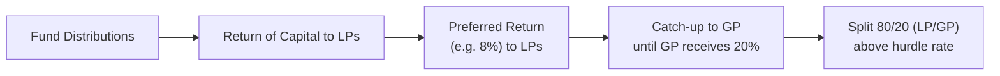
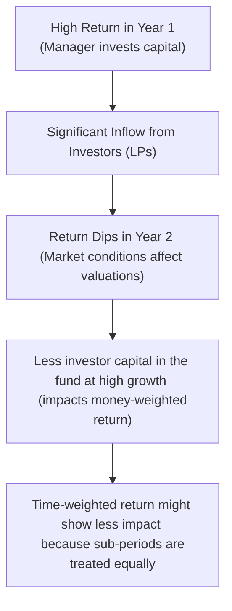

## 9.2 Alternative Investment Performance and Returns

Let’s talk about the captivating world of alternative investment performance and returns. Now, I remember the first time I looked at a private equity term sheet. Let me tell you, I was so confused that I nearly spilled my coffee—multiple times. The usual metrics I'd learned for stocks and bonds, like annualized returns or standard deviation, just didn’t feel quite right for, say, a real estate fund or a venture capital deal. Part of the trickiness is that alternative investments can be downright illiquid, they might have sporadic valuations, and they involve unique fee structures that can make your head spin. But, you know, once you get the hang of it, measuring performance can be truly rewarding (no pun intended).

Below, we’ll explore the various facets of how performance is measured in alternative investments, such as private equity, real estate, and hedge funds. We’ll dig into all the good stuff: IRR, MOIC, time- vs. money-weighted returns, fee structures, and even the challenges of benchmarking. If some of these terms sound unfamiliar, don’t worry—we’ll define them along the way. So, let’s get started.

### Understanding the Nature of Alternative Investment Returns

Alternative investments are different from the typical publicly traded world of stocks and bonds in significant ways. First, they often involve long time horizons—think 5 to 10 years, or even longer. Second, many alternative strategies are not as liquid; a portion of your capital can be locked up in an investment vehicle that might not allow easy entry or exit. Third, valuations can be tricky because you might not have a daily price feed like you do for a publicly traded asset. And, well, if your only reference to a “fair value” is a quarterly fund report or an annual audit, it’s easy to see the challenges in figuring out how well the investment is really doing.

Hedge funds, private equity, real estate partnerships, and venture capital funds might have unique legal structures and cash flow distributions. For instance, a private equity fund will call capital from investors over time (capital calls), invest that capital, and eventually distribute proceeds once the investments are sold or realize gains (distributions). The performance measurement for these illiquid assets is, therefore, more nuanced than just comparing day-to-day or month-to-month returns.

### Common Performance Measures

Let’s break down a few of the more common methods used to capture the performance of these investments. You’ll see that each serves a particular purpose, and each can be manipulated or misunderstood if you’re not careful.

#### Internal Rate of Return (IRR)

I still recall the first time I played around with IRR in a spreadsheet. There was trial and error. A lot of it. IRR is the discount rate that equates the net present value (NPV) of an investment’s cash inflows and outflows to zero. In other words, if you invested a series of cash flows in a project or fund at certain points in time—and you get distributions (or returns) at other points—what constant annual rate would make all these cash flows sum up to zero?

• IRR is a **money-weighted** measure of return.  
• It captures the timing of actual cash flows (capital calls and distributions).  
• It can be heavily influenced by the specific timing of those flows, so an early big distribution can boost IRR significantly, even if long-term returns are less impressive.  

In the context of alternative investments, IRR is often used to measure private equity or venture capital performance, because the actual flow of money in and out of the fund is so important. However, one pitfall is that IRR can overemphasize early distributions or opportunistic debt usage.

When I was working with a friend on a hypothetical real estate project, we put together a timeline of capital calls, monthly net operating income, and final sale proceeds. The IRR formula is built to handle exactly that. But if you’re not modeling it carefully—especially with the exact timing of each cash flow—you can come up with a misleading IRR. So always double-check your data.

A simplified timeline for IRR might look like this:

In the flow above, the IRR is the single discount rate that makes all these inflows and outflows sum to zero in net present value terms.

#### Multiple of Invested Capital (MOIC)

Another key measure is the multiple of invested capital, known as MOIC. Sometimes you’ll hear it referred to as a “multiple” or by sub-terms like TVPI (total value to paid-in capital), RVPI (residual value to paid-in capital), and DPI (distributions to paid-in capital).

• **TVPI:** (Total Value / Paid-In Capital) = (Distributions + Remaining Value) / Capital Invested  
• **DPI:** (Distributions / Paid-In Capital) = Cumulative distributions / Capital Invested  
• **RVPI:** (Residual Value / Paid-In Capital) = Value still in the fund / Capital Invested  

Where IRR focuses on time and the rate of return, these multiples focus on the total scale of return. If you hear something like “the fund achieved a 2.5x multiple on invested capital,” that typically means that for every $1 the limited partners put in, they got back $2.50, net of fees and expenses (assuming it’s net). It’s easy to see how this can be a straightforward measure, but it doesn’t account for how long it took to earn that multiple. A 2.5x return in two years is a whole lot different than a 2.5x return in ten years, which is where IRR adds color.

#### Time-Weighted vs. Money-Weighted Returns

Time-weighted returns measure the performance by calculating the growth of $1 over consecutive time periods, ignoring the size and timing of cash flows. So, in a sense, time-weighted returns are refined to measure the skill of an investment manager—how well they manage the sub-period returns—because we effectively neutralize the effect of big inflows or outflows. This is typically how mutual funds or hedge funds measure performance, especially if they have frequent subscriptions and redemptions by investors.

On the other hand, money-weighted returns (like IRR) consider the exact timing and magnitude of cash flows, which is more relevant if the manager is in control of when to call capital and distribute it. In private equity, for example, money-weighted returns are more revealing because so much of the manager’s “skill” also lies in the decisions about when to invest and when to exit.

### Before-Fee vs. After-Fee Returns

So, you might wonder, “Why does that fancy private equity presentation say they returned 25% but the investor statements show only 18%?!” Well, fees. It’s all about fees—management fees, incentive fees, and carried interest. 

1. **Management Fee:** A percentage (say, 2%) of committed or invested capital each year.  
2. **Incentive Fee / Carried Interest:** The share of profits (e.g., 20%) allocated to the general partner (GP) above a certain hurdle rate.  
3. **Clawback Provisions:** If early distributions to the GP are too high relative to the ultimate performance, investors may “claw back” some of the GP’s carried interest.

All these fees can eat into your returns significantly. If you want to understand how the investors actually fared, you need to look at after-fee returns, often called “net” returns. 

#### Distribution Waterfalls

Many private funds use what’s called a “waterfall structure” to spell out precisely how distributions flow. Typically, you’ll see something like:

1. Return of capital to LPs until they’ve recovered their contributions.  
2. Payment of a preferred return (hurdle rate) to LPs.  
3. Carried interest distribution to the GP, often 20% of profits above the preference.  
4. The remainder to LPs, proportionate to their ownership.

Here’s a rough sketch of a simplified waterfall:

While real-world waterfalls can be more complex, this helps illustrate how multiple layers of fees and allocations happen before the investor’s net return is calculated.

### Benchmarking Challenges

Once you have a handle on the performance metrics, you might ask, “Compared to what?” That’s the essence of benchmarking, and with alternative investments, it’s not always easy. There’s no S&P 500 for private equity or real estate, at least not in the same sense of uniform structure and liquidity.

1. **Peer Group Comparisons:** Sometimes you compare funds against each other by vintage year, strategy, or geography. But if you mismatch them (for instance, comparing a U.S.-focused buyout fund to a global venture capital fund), the comparison won’t make sense.  
2. **Index Providers:** Certain organizations like Cambridge Associates, Preqin, and Burgiss provide private market indexes. But the data can be lagged, self-reported, or not fully comprehensive.  
3. **Survivorship Bias:** Funds with poor performance can drop out of indexes or stop reporting. This can artificially inflate the average performance of those that remain.  

So, you often have to be cautious and ask a few questions, like: Are these benchmarks net-of-fees? Are they the right vintage year? Is the strategy the same (e.g., buyout vs. growth equity)? If not, you might get misled.

### Real-World Example: Private Equity

Let’s imagine a private equity fund, Redwood Growth Partners I, launched in Year 0 with $100 million of committed capital from limited partners (LPs). The GP invests the capital in mid-sized manufacturing companies over the next three years and then gradually exits them over the following five years.

• They call $80 million total, returning $40 million by Year 3 from the sale of one portfolio company.  
• They eventually distribute $160 million by Year 8 when the rest of the investments are exited.

If we look at the IRR, maybe the result is 17% net of fees. The MOIC might be $160 million distributions / $80 million invested = 2.0x. If you consider time-weighted returns, it might differ because the capital calls come at different points, and the manager invests in cycles. 

To see how Redwood Growth Partners compares to others, we might examine Cambridge Associates’ Private Equity benchmark for the 2015 vintage year (assuming Redwood started in 2015). If Redwood’s IRR is above the median or top quartile, Redwood might be considered a successful fund. But keep in mind: Redwood’s strategy and geography also matter. For a fair comparison, Redwood should be matched against other U.S.-focused mid-market buyout funds from 2015.

### Real-World Example: Real Estate

In real estate, the issues are similar but can be extra complicated by property-level leverages and varying local markets. For instance, if you invest in a real estate private equity fund that focuses on mixed-use properties in major cities, you might get periodic cash flow from rents, plus a big capital gain upon sale. The IRR calculation is crucial: the earlier they can sell a property at a profit, the better the IRR. But if the sale is delayed or if leases take too long to get signed, that IRR can deflate.

Additionally, you might have years with no distributions at all but heavy capital expenditures. That’s where MOIC can come in handy, giving an indication of your eventual total payoff. And to compare performance, you might rely on a specialized real estate index produced by NCREIF or other data providers, but each index might track different property types or geographies, so always read the fine print.

### Best Practices and Common Pitfalls

Here are a few tips to keep in mind, gleaned from personal experience (and some mild heartbreak along the way):

• **Check the assumptions**: IRR can be highly sensitive to the exact date of cash flow. If the date is off by just a few months, you could see a noticeable difference.  
• **Understand the difference between gross and net**: If you see an eye-popping IRR in a marketing presentation, that might be gross-of-fees. Ask for net.  
• **Look at multiples**: Sure, 25% IRR is nice, but was it backed by a 1.2x multiple or a 2.5x multiple? The difference is massive long-term.  
• **Clawback provision**: Always explore the details. If your deal includes a clawback, make sure you know how it’s triggered.  
• **Benchmark carefully**: If your real estate fund invests in Asia, don’t compare it to a U.S. real estate index. Or, if you do, at least understand the mismatch.  
• **Beware short track records**: In private equity or venture capital, brand-new managers might show a big IRR from one exit, but it might not last through the full fund life cycle.  

### Diagrams for Clarity

Below is a conceptual diagram showing how manager skill (time-weighted) can differ from investor experience (money-weighted) in a single fund. Notice the difference in perspective:

### Summary Thoughts

Measuring alternative investment performance is both an art and a science. You’ve got to juggle IRR, MOIC, time-weighted returns, fee structures, and incomplete or illiquid data. But once you understand the logic behind each metric—and how to layer in real-world details like distribution waterfalls or clawback provisions—your insights can become far more actionable. 

Alternative investments can be incredibly rewarding but also carry distinct risks and complexities. Hopefully, this discussion helps demystify some of the key elements around performance measurement and—maybe, just maybe—saves you from that coffee spill of confusion I went through many years ago.

### References and Recommended Readings

- CFA Institute Level I Curriculum: “Performance Measurement for Alternative Investments.”  
- John Gilligan and Mike Wright, “Private Equity Demystified.”  
- Cambridge Associates Benchmarking Methodologies: [https://www.cambridgeassociates.com](https://www.cambridgeassociates.com)

--------------------------------------

## Test Your Knowledge: Alternative Investment Performance and Returns



### Which of the following is one of the main reasons it’s challenging to measure alternative investment performance?

- [x] Illiquid nature and difficulty marking to market
- [ ] They have higher correlation with public markets than stocks
- [ ] They rely only on time-weighted returns
- [ ] The absence of any fees or carry

> **Explanation:** Alternative investments tend to be illiquid and lack frequent pricing, making performance measurement more complex.

### IRR in alternative investments is considered what type of return?

- [x] Money-weighted return
- [ ] Time-weighted return
- [ ] Risk-adjusted return
- [ ] Inflation-adjusted return

> **Explanation:** IRR is a money-weighted measure because it accounts for the exact timing and size of cash flows.

### Which of the following is the most relevant if an investor wants to understand the total multiple of their invested capital?

- [ ] IRR
- [ ] Time-weighted return
- [x] MOIC (Multiple of Invested Capital)
- [ ] Standard deviation of returns

> **Explanation:** MOIC shows how many dollars are returned for every dollar invested, giving insight into total multiple.

### What does DPI specifically measure?

- [ ] The potential performance of a fund before distributions
- [x] The ratio of cumulative distributions to paid-in capital
- [ ] The interest rate used to discount net present value to zero
- [ ] The difference between net asset value and gross asset value

> **Explanation:** DPI (Distributions to Paid-In) measures how much capital has been distributed compared to what has been invested.

### How do management fees typically differ from incentive fees (carried interest)?

- [x] Management fees are charged annually on committed or invested capital, while carried interest is a share of profits above a certain hurdle
- [ ] Management fees apply only when there is a profit, while carried interest applies in every scenario
- [x] Management fees usually range between 1-2%, while carried interest is often around 20% of gains
- [ ] Management fees are usually performance-based

> **Explanation:** Management fees are generally a fixed percentage, while carried interest is usually performance-based, kicked in after meeting a hurdle rate.

### If a manager wants to show how well they performed independent of cash flow timing, which return metric would they consider?

- [x] Time-weighted return
- [ ] Money-weighted return
- [ ] IRR
- [ ] MOIC

> **Explanation:** Time-weighted returns ignore the effect of inflows and outflows, allowing an assessment of the manager’s skill at different sub-periods.

### What is the primary role of a clawback provision in a private fund?

- [x] To ensure the GP returns some of its carried interest if early distributions were too high relative to final performance
- [ ] To penalize LPs for late capital contributions
- [x] To automatically adjust management fees based on the fund’s net asset value
- [ ] To lock the GP into a longer investment period

> **Explanation:** A clawback ensures that if the GP receives more than their fair share of profit early on, it can be reclaimed when the fund’s final performance is realized.

### Why might IRR be misleading if a fund has significant early distributions?

- [x] Because IRR heavily weights earlier cash flows, making the total performance appear higher
- [ ] Because IRR doesn’t account for fees
- [ ] Because IRR includes leverage in the calculation
- [ ] Because IRR doesn’t consider the timing of capital calls

> **Explanation:** IRR is sensitive to the timing of cash flows. A large early distribution can inflate IRR, even if later returns are lackluster.

### When benchmarking alternative investments, why is it important to match vintage years?

- [x] Because performance can vary significantly based on when the fund started investing
- [ ] Because fees are only incurred during the vintage year
- [ ] Because IRR is reset every vintage year
- [ ] Because the time-weighted return approach only applies to a single year

> **Explanation:** Vintage year matters a lot in alternative investments, since macro conditions and sector cycles play a big role in investment outcomes.

### In the context of distributions, which statement is TRUE?

- [x] True
- [ ] False

> **Explanation:** Distributions are cash or stock returned to investors over the life of an alternative fund, often triggered by asset sales or liquidity events.


