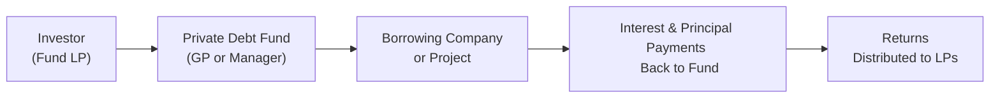

## 9.3 Investments in Private Capital: Equity and Debt

Well, let’s talk about private capital—sometimes it feels like this mysterious corner of the investing universe. I remember a friend who once invested in a local craft brewery before it got big, boasting about how he “had shares” in a company that didn’t even trade on the stock market. That’s basically private capital in a nutshell: investing in businesses that aren’t on public exchanges, from fledgling start-ups to mature companies looking for fresh capital, or even companies struggling to stay afloat.

Private capital can be broadly divided into two categories: private equity and private debt. They overlap in interesting ways—both are off the public radar—but each has unique characteristics, risk-return profiles, and roles in a portfolio. Let’s walk through them step by step, chatting about why they matter, how they’re structured, and the benefits and challenges that come with them.

--------------------------------------------------------------------------------
<!-- Table of Contents reference example (if needed) -->
*(You may find it helpful to revisit Chapter 6: Equity Investments or Chapter 7: Fixed Income to compare public markets to the concepts discussed here.)*
--------------------------------------------------------------------------------

## Overview of Private Equity

Private equity involves taking ownership stakes—usually controlling stakes—in companies that are not publicly traded. These aren’t your everyday stocks on the New York Stock Exchange or Nasdaq. Instead, private equity firms typically form limited partnerships, pool capital from institutional investors and high-net-worth individuals, and then deploy these funds into private companies. It’s a hands-on, active management style. Private equity’s hallmark strategies include:

• Venture Capital  
• Growth Capital  
• Leveraged Buyouts  
• Distressed Investments  

And sometimes we get sub-categories within these. Let’s break down the highlights of each.

### Venture Capital (VC)

Venture capital is that early-stage excitement. Think of the energetic start-ups that might have little more than a prototype, a half-baked business plan, and some big dreams. VC investors provide seed money or Series A/B/C funding in exchange for equity. We often see:

• Longer Time Horizon: Getting in early can mean waiting 5–10 years (or more) for real returns.  
• High Risk, High Reward: Early-stage companies might explode in valuation (like many big tech start-ups did), but they can also go bust.  
• Active Mentorship: VC investors don’t just write checks; they help with strategy, hiring, marketing, and operations.

A quick anecdote: I once bumped into an angel investor who boasted about a 100x return from a single start-up. He also mentioned that five of his other companies failed miserably. That’s the nature of VC—when it’s good, it’s spectacular, but the failures can be painful.

### Growth Capital

Growth capital focuses on slightly more mature companies than those in the venture capital stage. They’re typically revenue-generating businesses looking to expand, enter a new market, or make a large strategic acquisition. It’s still private equity, but the risk level can be (somewhat) lower than seed-stage VC because there’s a known product or established customer base. Returns can be lucrative if the growth plan pans out.

### Buyouts (Leveraged Buyouts or LBOs)

Buyouts involve acquiring a controlling (or sometimes complete) stake in an established company. Often, the private equity firm uses a combination of equity and large amounts of borrowed money (hence “leveraged” in leveraged buyouts). Key points:

• Control and Restructuring: The private equity sponsor exerts significant operational control, aiming to restructure and improve efficiency.  
• High Leverage: Debt can amplify returns if the company’s cash flows are strong enough to service it. Of course, it also amplifies risk.  
• Exit Strategy: Once they’ve improved the business, typical exit routes include selling it to a strategic buyer, going for an initial public offering (IPO), or selling to another private equity firm.

### Distressed Investments

Distressed investments involve purchasing debt or equity of companies that are in (or near) bankruptcy, often available at huge discounts. The rationale:

• Potential for Turnaround: If the company can recover, the upside is substantial.  
• Restructuring Opportunities: Distressed debt can be converted into equity or restructured for more favorable terms.  
• High Risk: The obvious risk is that the company could still fail outright; distressed deals are not for the faint of heart.

### Characteristics and Risk-Return Profile

Regardless of these sub-strategies, private equity often promises potentially higher returns than public equity markets—when successful. But let’s not ignore the big downsides:

• Long Holding Periods (5–10 Years): Patience is crucial, as liquidity is limited.  
• High Risk: A single company’s fate can dramatically affect returns, especially for smaller private equity funds.  
• Active Management & Operational Input: Private equity firms often step in with cost-cutting measures, new strategies, or management overhauls to boost company value.

And because these investments are less regulated and less transparent compared to public markets, due diligence can be more complex.

--------------------------------------------------------------------------------

## Overview of Private Debt

Private debt is all about lending money to companies that either cannot or do not want to borrow from traditional capital markets (e.g., issuing public bonds). Instead, they turn to private lenders—often private debt funds, direct lending platforms, or private equity funds that also do debt deals. Common forms of private debt include:

• Direct Lending  
• Mezzanine Debt  
• Special Situations Lending  

### Direct Lending

Here, non-bank institutions provide loans directly to companies. It’s a bit like a traditional bank loan, but often with more bespoke terms. Direct lending is popular because:

• Potential for Higher Yield: These loans can offer higher returns than standard publicly traded bonds due to their bespoke nature and often higher risk profile.  
• Covenant Structures: Lenders might impose stringent covenants to protect themselves (e.g., requirements on debt coverage ratios).  
• Less Liquid: There’s no active secondary market for most direct loans, so lenders must be ready to hold until maturity.

### Mezzanine Debt

Mezzanine finance is that curious hybrid. It’s subordinated debt—sitting behind senior loans but ahead of equity. It’s often accompanied by equity “kickers” or warrants, offering lenders a share in the upside if a company succeeds. Key traits:

• Higher Yield Than Senior Debt: With more risk (since you’re lower in the capital structure), you demand a higher coupon.  
• Equity Upside: Sometimes you can convert parts of the debt into equity or benefit from equity-linked features.  
• Ties in Well with LBOs: Mezzanine is commonly used in LBOs to fill the funding gap between senior secured loans and the equity portion.

### Special Situations Lending

This is the edgy corner of private debt—think distressed loans, turnaround financing, or rescue lending. It’s for companies in or near financial trouble that need capital to stave off collapse or to buy more time for a turnaround.

• High Risk-High Reward: Gains can be significant if the company recovers.  
• Requires Expertise: Investors often must navigate legal or bankruptcy processes.  
• Illiquidity: Selling these loans in the secondary market can be challenging.

### Credit Risk and Liquidity Risk

When you invest in private debt, you’re generally taking on two big risks:

• Credit Risk: The borrower might default.  
• Liquidity Risk: You might not be able to sell these loans easily; you’re often locked in until maturity.  

But the reward for bearing these risks can be an attractive yield premium relative to comparable public bonds.

--------------------------------------------------------------------------------

## Markets, Structures, and Example Workflows

It can help to see how these investments flow, right? Let’s use a quick flowchart to visualize the life cycle of a private equity fund deployment of capital.

1. Investors (Limited Partners) commit capital to the Private Equity Fund.  
2. The General Partner chooses target companies.  
3. The General Partner injects capital and expertise, hoping to boost performance.  
4. Eventually, the General Partner exits the investment, ideally at a nice profit, and returns capital plus gains to the investors.  

Private debt funds often follow a similar model, except they lend capital to companies rather than taking equity stakes:

--------------------------------------------------------------------------------

## Diversification Benefits in a Portfolio Context

Now, from a portfolio management standpoint (which you can explore further in Chapter 10: Portfolio Management), adding a slice of private capital can provide:

• Low Correlation (Maybe…): Private equity returns often appear to move differently than public equity, at least in the short-term. However, during major economic downturns, correlations can spike (when everyone’s stressed).  
• Potential Higher Yields: Private debt can yield more than public bonds, offering an “illiquidity premium.”  
• Smoothing Effect: Because private assets aren’t marked to market daily, you might see less day-to-day volatility in reported performance—though the risk is still there.  

Still, be careful. Private capital can be cyclical, especially buyouts and growth equity, which rely heavily on economic conditions, credit availability, and exit markets. Distressed investments can also be heavily impacted by an overall macroeconomic downturn or an industry’s collapse.

--------------------------------------------------------------------------------

## Key Risks and Mitigation Strategies

### Liquidity Risk

Since private assets are not easily tradable:

• Be Clear on Lock-Up Periods: Understand that your capital might be tied up for years.  
• Manage Cash Flow Needs: Only invest what you can afford to lock away.  

### Valuation Risk

Private equity valuations are often “appraised” or based on models, so:

• Cross-Check with Transactions: Sometimes the only real benchmark is a comparable company’s acquisition or the next funding round.  
• Conservative Assumptions: If your investment thesis assumes overly rosy revenue growth, you could be heading for disappointment.

### Concentration Risk

Investors often concentrate in a handful of private deals:

• Diversify Across Strategies: A mix of VC, buyout, and distressed could smooth returns.  
• Spread Capital Across Vintage Years: Don’t invest everything in the same fund in the same year.  

### Operational/Execution Risk

Private equity and private debt managers typically take a very hands-on role:

• Due Diligence on the Manager: Past performance, expertise, deal pipeline, industry focus—these matter big time.  
• Governance Methods: For example, in buyouts, strong board oversight can reduce missteps.

--------------------------------------------------------------------------------

## Practical Examples and Case Studies

1. Growth Capital Success Story: Imagine a health-care technology start-up generating $10 million in annual revenue. A private equity growth fund invests $5 million for a minority stake, helps the firm expand its sales team nationwide, and guides them to streamline software development. Over five years, the start-up grows to $100 million in annual revenue and eventually merges with a bigger industry player. The fund cashes out at a healthy multiple, returning substantial profits to investors.

2. Distressed Debt Turnaround: A failing retail chain can’t meet interest payments. A private debt fund swoops in, buys the distressed debt at 40 cents on the dollar, restructures the chain’s debt obligations, and invests in an e-commerce pivot. With some luck, the business rebounds. The debt can eventually be sold at 80 cents on the dollar or converted to equity, doubling the investment.

3. Mezzanine Financing in a Leveraged Buyout: A mid-market buyout is short $15 million to close the deal. Senior lenders won’t provide more, so the sponsor turns to a mezzanine fund. They negotiate a 12% coupon plus warrants for equity. The buyout eventually IPOs, and the mezzanine investors exercise their warrants at a huge gain.

--------------------------------------------------------------------------------

## Integrating Private Capital into a Broader Investment Strategy

If you’re thinking, “So, uh, how do I actually use private capital in a portfolio?” the answer ties to your risk tolerance, liquidity needs, and long-range growth objectives.

• Institutional Investors (like pension funds) often allocate a portion of their assets to private equity or debt for the potential alpha and diversification.  
• High-Net-Worth Individuals might invest through specialized funds or co-investment opportunities.  
• Smaller Investors might access private capital via professional fund-of-funds or listed vehicles (like business development companies, or BDCs, in the U.S.), which offer some liquidity but come with fees.

As always, the big thing is to weigh the trade-off: you might earn more, but you’ll surrender liquidity and take on higher risk. Long time horizons also mean you need to plan carefully and stay comfortable with the idea that your money is “locked up.”

--------------------------------------------------------------------------------

## Common Pitfalls and Challenges

1. **Underestimating Management Impact:** Private equity relies heavily on the skill of the general partner’s team. Without experienced operators, even a decent target company can flounder.  
2. **Over-Leverage:** In buyouts, too much debt can cripple a company if there’s an economic downturn.  
3. **Lack of Diversification:** Putting all your private capital allocations in one fund or sector is a recipe for disaster if that sector tanks.  
4. **Timing the Market:** Private markets can be cyclical. Investing heavily at the top of the market often leads to smaller returns.  

--------------------------------------------------------------------------------

## Glossary of Key Terms (Recap)

1. **Venture Capital:** Early-stage (or growth-oriented) private equity funding.  
2. **Mezzanine Debt:** Hybrid financing placed between senior debt and equity, featuring higher yields and potential equity participation.  
3. **Distressed Investing:** Purchasing securities (often debt) of troubled companies at cheap prices, hoping for a turnaround or beneficial restructuring.  
4. **Buyout (LBO):** Acquiring a controlling stake in a company, typically using a mix of debt and equity.

--------------------------------------------------------------------------------

## References and Recommended Readings

• **CFA Institute Level I Curriculum, “Private Equity and Private Debt Markets.”**  
• **Private Equity at Work by Eileen Appelbaum and Rosemary Batt.**  
• **Preqin: Direct Lending and Private Debt** (https://www.preqin.com/).  

These resources expand on valuation methods, deal structures, and the broader institutional landscape of private capital.

--------------------------------------------------------------------------------

## Concluding Thoughts

Anyway, private capital—both equity and debt—can play a powerful role in a well-structured portfolio, offering potentially higher returns, diversification, and unique risk exposures. The trade-offs aren’t trivial: less liquidity, higher complexity, and bigger economic sensitivity than you might initially assume. But if you’ve got patience, risk tolerance, and can partner with skilled managers, private capital investments can be a mighty addition to your investment toolkit. Whether you’re backing the next big tech sensation via venture capital or funding a turnaround via distressed debt, it’s a space loaded with possibility (and pitfalls). Always do your homework.

--------------------------------------------------------------------------------

## Test Your Knowledge: Private Capital Investments Quiz



### Which of the following is a typical characteristic of private equity investments?  
- [ ] Short holding periods of less than a year  
- [ ] Immediate liquidity in a transparent market  
- [x] Long-term commitment, often 5–10 years  
- [ ] No involvement from management teams  

> **Explanation:** Private equity investments generally involve a longer-term commitment, commonly requiring capital to be locked in for 5–10 years.  

### What is a primary motivation for using mezzanine debt in a leveraged buyout?  
- [x] To fill the financing gap between senior debt and equity  
- [ ] To replace the need for senior debt entirely  
- [ ] To exit the investment within one year  
- [ ] To obtain government guarantees  

> **Explanation:** Mezzanine debt is typically used when the acquisition requires more financing than senior lenders are willing to provide, bridging the funding gap between senior debt and equity.  

### Which of the following best describes an advantage of direct lending over publicly traded bonds?  
- [ ] Significantly higher liquidity  
- [x] Potential for higher yields due to custom structures  
- [ ] Zero credit risk for the lender  
- [ ] Complete protection from default  

> **Explanation:** Direct lending often offers higher yields because the loans are more customized and less liquid, carrying a higher risk premium than standard publicly traded bonds.  

### Which of the following terms refers to acquiring a controlling stake of a company using substantial debt financing?  
- [ ] Venture debt  
- [ ] Mezzanine financing  
- [x] Leveraged buyout (LBO)  
- [ ] Distressed investment  

> **Explanation:** A leveraged buyout (LBO) involves acquiring a majority or controlling interest, often financed with large amounts of borrowed money.  

### Which statement about distressed investing is most accurate?  
- [ ] It involves investing only in healthy companies with strong cash flows.  
- [x] It involves investing in companies that are near or in bankruptcy, hoping for recovery.  
- [ ] It guarantees quick profits due to discounted prices.  
- [ ] It excludes converting debt into equity.  

> **Explanation:** Distressed investing focuses on financially troubled companies. Investors buy debt or equity at heavily discounted prices with the expectation of a turnaround or beneficial restructuring.  

### What is the biggest drawback associated with the illiquidity of private capital investments?  
- [x] Difficulty in withdrawing invested funds before the end of the holding period  
- [ ] Receiving interest payments instead of dividends  
- [ ] The inability to calculate net asset value (NAV)  
- [ ] Lower returns than comparable public market investments  

> **Explanation:** Private capital investments are not easily traded. Investors must often hold until a significant liquidity event (trade sale, IPO, or maturity), making exits difficult before the fund’s mandated time horizon.  

### In the context of private debt, a “special situations” investment typically refers to:  
- [x] Lending to a company in distress or involved in a significant operational change  
- [ ] Providing low-interest, long-term mortgages to real estate developers  
- [x] Providing mezzanine financing to high-growth technology start-ups  
- [ ] Issuing freely tradable, investment-grade bonds  

> **Explanation:** Special situations lending generally describes financing for companies dealing with financial, structural, or operational difficulties—hoping for a turnaround or restructuring.  

### In the capital structure, mezzanine debt is:  
- [ ] Senior to all other forms of capital  
- [ ] Equal in ranking to common equity  
- [x] Subordinate to senior debt but above common equity  
- [ ] Unrelated to the concept of capital hierarchy  

> **Explanation:** Mezzanine debt sits below senior debt in terms of claims, but ahead of common equity in the event of liquidation.  

### Which best describes a venture capital investment?  
- [ ] Buying publicly traded shares in a large-cap company  
- [ ] Lending to established, highly rated corporations  
- [x] Providing equity financing to early-stage companies that show strong growth potential  
- [ ] Purchasing distressed bonds of a bankrupt corporation  

> **Explanation:** Venture capital investments typically target new or emerging companies, often with innovative ideas, high growth potential, and limited operating history.  

### Private equity returns often appear smoother than public equity indexes because:  
- [x] Private equity valuations are appraised periodically rather than traded daily  
- [ ] Private equity investments always generate stable cash flows  
- [ ] Private equity avoids all market cycles  
- [ ] Private equity firms cannot borrow capital  

> **Explanation:** Private equity returns are usually based on periodic appraisals or “mark-to-model” rather than continuous market pricing. This can make their returns look smoother, even though the underlying risks are still present.  


