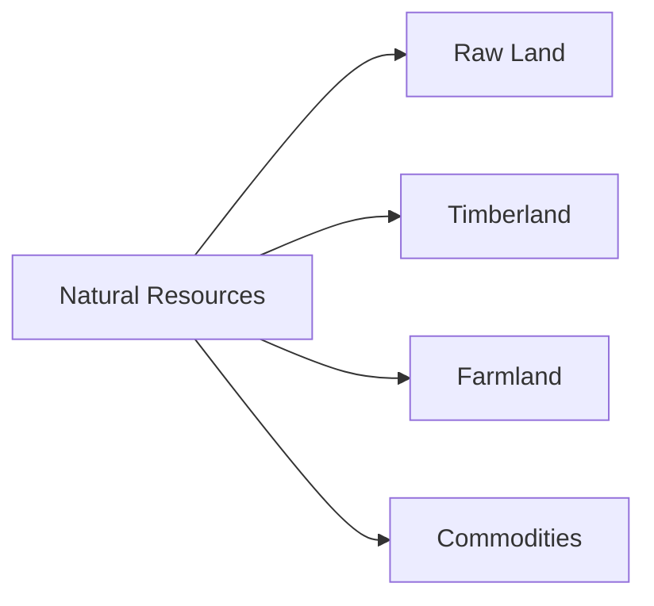
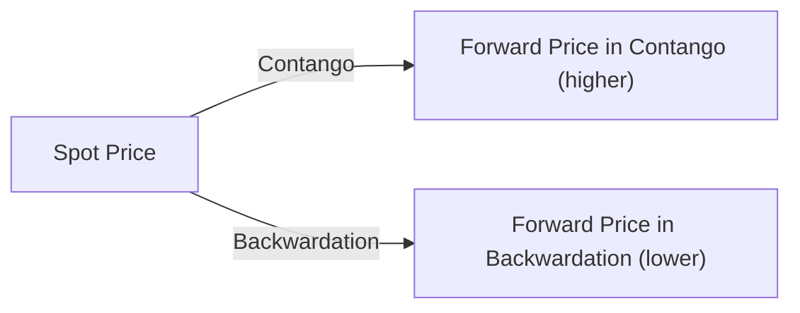

## 9.5 Natural Resources

Natural resources as an investment category can feel a bit like searching for hidden treasures—there’s often uncertainty, but also the chance for real rewards. The category usually refers to investments in raw land, timberland, farmland, and various commodities (like precious metals, agricultural products, and energy). All these assets can play a valuable role in an investment portfolio, but they definitely come with quirks, complexities, and a couple of surprises along the way. I remember someone once telling me, "Investing in farmland is like planting seeds of wealth you hope will grow for future generations." It stuck with me because so many natural resource investments require patience, specialized knowledge, and a strategic approach.

Natural resources can be both appealing and intimidating. On one hand, demand for materials and basic goods often remains high across different economic conditions. On the other hand, factors like weather patterns, geopolitical tensions, and even local regulations can result in major swings in prices. It’s both an art and a science—understanding how all these forces interact can make or break your strategy.

This section explores the essential features and characteristics of investing in raw land, timberland, farmland, and commodities. We’ll also talk about how natural resources can help diversify a portfolio, the types of risks they bring, and some practical ways to navigate this space. So, let’s dig in (no pun intended).

  
Introduction

Sometimes, you’ll hear the phrase “inflation hedge” tossed around when discussing natural resources. In other words, some folks believe that because commodities and land contain real, physical value, they can act as a store of wealth when currency values fluctuate. While that’s partially true (especially with assets like gold), it doesn’t mean that natural resources are a bulletproof shield against all inflationary pressures. After all, farmland might produce revenue through crops if there’s enough demand, but a slump in crop prices or a drought could really disrupt your returns. So, yeah, it’s not as simple as just parking money in farmland or gold.

Natural resources remain a popular choice for those who want tangible assets in their portfolio—stuff you can touch and feel. But these aren’t set-it-and-forget-it deals; they require ongoing monitoring and management. Investors must consider everything from supply-and-demand trends to environmental concerns and short-term cyclical factors. Let’s break down the main types of natural resource investments to get a more concrete sense of what’s out there.

  
Types of Natural Resource Investments

Raw Land  
Raw land is basically any undeveloped land. You’re not immediately generating timber or crops from it, nor are you extracting anything like oil or natural gas (although sometimes you could, if the land comes with related mineral rights). In many cases, people invest in raw land hoping that it will either appreciate over time or become suitable for future development projects.

It’s important to note that raw land generally doesn’t produce an income stream from the get-go. Unless you lease the land for grazing or something, your returns typically stem from land appreciation. And that can be unpredictable. If local regulations change, or a proposed highway suddenly shifts routes, land values can zig or zag. It’s definitely not the type of investment to jump into without thorough local-market research. 

Timberland  
Timberland investments involve owning a tract of forest where the timber can be harvested and sold. It feels a bit like a living, breathing factory because the trees literally grow in value over time—though that growth can be impacted by pests, fire risk, and changes in lumber prices. Timberland can generate two main types of returns:

• Operational income from harvesting timber.  
• Potential appreciation in the value of the land itself.

Some folks really like timberland because trees keep growing whether the market’s up or down—assuming you avoid catastrophes like massive storms or pest infestations. Trees don’t exactly read stock market news. But to manage timberland properly, you often need specialized expertise in forestry, environmental regulations, and sustainability practices. I remember discussing timberland with an investor who said, "It’s nice to think you can just let the trees grow. But eventually, you face real decisions: harvesting, replanting, disease control, and so forth. It’s buying into an ecosystem, not just real estate."

Farmland  
Investing in farmland can be a bit more hands-on because farmland can produce consistent cash flows if you grow crops or raise livestock. In addition to potential land price appreciation, farmland might generate rental income or direct profits from selling produce. Of course, farmland returns depend heavily on factors like:

• Soil quality, water availability, and climate.  
• Crop selection and local/international demand.  
• Input costs (seed, fertilizer, labor).  
• Weather patterns and pest management.

Farmland can be relatively capital intensive—buying large plots sufficient for commercial-scale operations is a big investment. You also need either strong agricultural management skills or the ability to hire experienced operators. Weather, commodity price volatility, and regulatory changes (like those related to water usage or environmental protections) can significantly influence your returns. Still, some investors enjoy the tangibility—knowing they’re profiting from an asset that literally feeds people.

Commodities  
Commodities span an incredibly wide array of assets: precious metals (gold, silver, platinum), industrial metals (copper, aluminum), agricultural products (wheat, corn, coffee, soybeans), and energy resources (crude oil, natural gas). These are typically traded on commodity exchanges via futures contracts, and they can be some of the more volatile assets out there.

One big reason people pay attention to commodities is their historical role as an inflation hedge. During periods of rising prices, real assets like oil, metals, or grains may appreciate, helping offset declines in purchasing power. But, let’s be real: commodity prices can also be extremely sensitive to supply-and-demand disruptions, weather events (crop freezes, hurricanes in the Gulf of Mexico), and geopolitical conflicts. For example, an OPEC decision to reduce oil production can send prices skyrocketing overnight.  

Below is a simple diagram illustrating different segments of natural resource investments:

  
Key Features and Characteristics

Land Price Appreciation and Operational Income  
Raw land, timberland, and farmland can generate a two-pronged stream of returns. Not only can their underlying land values go up (assuming favorable market conditions), but you can also earn operational income—like renting farmland to a tenant farmer or selling harvested timber to construction material suppliers. Operational income often represents a less volatile (though not guaranteed) revenue source, especially when compared with day-to-day commodity price swings in the futures markets.

Inflation Hedge Potential  
Commodities, in particular, have often been cited as an effective inflation hedge. The logic is: when inflation rises, prices of goods increase, so the raw materials used to produce these goods should also see price increases. However, this relationship isn’t always 1-to-1. Occasionally, rising supply or weaker demand can offset or overshadow the inflationary effect. One year, an investor might see farmland returns outpace inflation thanks to high corn prices, but the next year, a bumper crop and large inventories might push corn prices down even if inflation is on the rise. So yes, it’s an interesting dynamic.

Seasonal and Cyclical Influences  
Farmland and timberland returns rely heavily on the annual harvest cycle. Commodities are often influenced by production seasons—think about how wheat or soybean yield can fluctuate based on whether it’s a good or bad harvest season. Additionally, energy prices may fluctuate if there’s a cold winter or a hot summer fueling demand for heating or cooling. Layer on top of that the cyclical nature of the broader economy, and you get a complex tapestry of factors to watch.

Supply-Demand Imbalances  
We can’t overlook supply-demand forces, from consumer trends (like shifts toward electric vehicles that might spike demand for certain metals) to major policy changes or technology breakthroughs that suddenly alter consumption patterns. When supply lags behind demand, prices sometimes soar—just as they can plunge when the reverse happens. Occasionally, you’ll see commodities overshoot in either direction due to speculation. Gold might surge if investors expect financial turmoil, only to correct once these fears subside.  

  
Portfolio Diversification Benefits

Natural resource investments can be appealing based on their historical (though not guaranteed) low correlation with traditional equity and bond markets. When stocks are tumbling, agricultural or energy-related assets might hold steady or even rise, potentially stabilizing overall portfolio returns. Imagine your equity portfolio is under pressure during a recession but your farmland investment benefits from rising crop prices.  

Still, it’s not as simple as “buy a bunch of commodities and watch them perfectly offset your equity risk.” Correlations evolve. Sometimes commodities march in sync with other markets, especially if a global macroeconomic factor (like a pandemic or major financial crisis) affects nearly everything at once. However, from a strategic asset allocation standpoint, including natural resources in moderate proportions can smooth out portfolio volatility over the long term.

  
Risks and Considerations

Cyclical and Geopolitical Risks  
Commodity prices can go through wild ups and downs thanks to cyclical factors (e.g., economic expansions boosting demand for metals) and geopolitical events (e.g., conflicts that disrupt energy supply). Others might revolve around shifting trade policies or currency swings that can significantly impact import/export activities. If you’re investing in farmland in a certain region, maybe a new import tariff or a currency devaluation changes the profitability of exporting your crops. That’s a real challenge.

Weather and Environmental Challenges  
Mother Nature can make or break farmland returns, with floods, droughts, or pests decimating yields. Timberland, especially in certain regions, faces risk from wildfires, insects, or even shifts in local climate. Although some of these factors can be insured against, you never eliminate them entirely. Plus, environmental regulations might limit how you manage the land, possibly affecting yields or operational income.

Capital Requirements and Illiquidity  
Another consideration is that farmland, timberland, and raw land require significant upfront capital. Many investors underestimate how long it can take to buy or unload these assets at favorable prices. With commodities, you have liquid futures markets, but there’s still roll yield, storage costs (if you hold the physical commodities), and margin requirements. So, whether you’re investing in farmland or gold futures, you need an appropriate liquidity strategy.

Need for Sector-Specific Know-How  
If you aren’t familiar with farmland yields, agriculture best practices, or commodity storage, you may face a steep learning curve. The cost of management, whether direct or via professional managers, can be high. Mistakes in planting or harvesting scheduling, for instance, can be expensive. In the commodities space, misunderstanding contango versus backwardation might lead to significant unexpected costs.

  
Contango and Backwardation

Contango and backwardation are terms you’ll see in futures markets, describing the relationship between the spot price of a commodity and its futures prices at different maturities. They can directly impact your commodity investment returns, especially if you’re rolling over futures contracts. A market is in contango if the futures price is higher than the current spot price; in backwardation if it’s lower.

Let’s visualize it briefly:

In contango, when you roll your position (let’s say every month) by selling the near-month future and buying a longer-dated contract at a higher price, you may face a negative roll yield. Conversely, a backwardation environment often implies a positive roll yield if you keep rolling futures positions at lower forward prices. These market structures can significantly affect returns in commodity futures trading.

  
Collateral Yield, Storage Costs, and Land Appreciation

Collateral Yield  
If you’re trading futures, you typically post collateral—often in the form of cash or highly liquid securities. The return from that collateral can become part of your overall commodity investment return, known as your “collateral yield.” For instance, if you’ve posted Treasury bills as collateral and interest rates rise, your collateral yield might improve. This was particularly relevant in times of higher interest rates—although in a low-rate environment, this yield may be nominal.

Storage Costs  
Physical commodities require storage, whether it’s oil in tankers, metals in warehouses, or grains in silos. Those costs (plus insurance) can eat into the net returns if you’re physically holding the commodity. Even if you’re in futures markets, storage costs can show up in the futures curve (part of what causes contango in some cases). Commodity traders pay close attention to whether it’s cheaper to store a commodity now in hopes of higher future prices or to simply lock in futures contracts.

Land Appreciation  
Much like the general real estate market, land values for farmland, timberland, or raw land can escalate due to scarcity, development potential, or improvements (like irrigating farmland or replanting with higher-value tree species). This appreciation is somewhat unpredictable, but in regions with growing populations and limited new arable land, farmland often sees consistent upward pressure on prices. That said, it can take quite a while for that appreciation to be realized—think decades, not months.

  
Practical Examples and Real-World Scenarios

• Example 1: Farmland Investment in the Midwest  
  Suppose you buy farmland in the U.S. Midwest, planning to grow corn or soybeans. You might see operational income each year from selling crops, minus costs like seeds, machinery, and farm labor. Over time, population growth and increasing demand for biofuels could push up grain prices, giving you a higher income. Meanwhile, the land itself might appreciate if that region becomes more desirable, or if climate change makes farmland in other places less viable. However, a single crop failure from drought or a sudden slump in demand could derail returns in any particular year.

• Example 2: Timberland in the Southeastern U.S.  
  If you purchase timberland in Georgia, you’ll receive periodic income when you harvest pines and sell the wood to pulp or lumber mills. This harvest might be staggered to optimize tree growth cycles. If lumber prices rally due to a housing market boom, your returns get an extra boost. But if you get hit by a hurricane in year five or if lumber prices plunge, you’ll need to adjust your harvest schedule—possibly waiting longer than planned to sell your timber. Meanwhile, the underlying land may appreciate if it’s in a region with growing population and potential for recreational uses.

• Example 3: Commodity Futures in Energy Markets  
  An investor wants exposure to crude oil and chooses to buy near-month futures contracts. If the market is in contango, the investor might lose money each time they roll the contract forward. They’d be selling the near-month contract at one price, then buying the next month at a higher price. Even if spot oil prices remain relatively stable, this ongoing roll cost can chip away at returns. If the market flips into backwardation (maybe due to supply cuts or geopolitical tensions), the investor might even enjoy positive roll yield.

  
Best Practices and Common Pitfalls

It’s easy to get excited by “hot” commodity markets or farmland booms, but caution is key:

• Diversify Across Different Natural Resources: Just like you might diversify across stocks and bonds, consider diversifying within natural resources—precious metals, energy, farmland, forests, etc.  
• Understand the Local (and Global) Environment: If you’re investing in farmland in South America, get a handle on local rules, climate issues, and currency risks.  
• Watch the Futures Curve: If you’re trading commodity futures, contango and backwardation can have a huge impact on your returns, so always factor in roll yields.  
• Think Long-Term: Especially for farmland, timberland, and raw land. If you need quick liquidity, this might not be your best move.  
• Don’t Underestimate Operational Expertise: Running a farm or managing a forest demands skill. Partner with experienced operators if you’re not ready to go it alone.  

  
Glossary

Contango & Backwardation  
These terms describe the shape of the commodity futures curve. Contango means futures prices exceed the spot price, often implying a cost of carry (e.g., storage, financing). Backwardation is the opposite—futures prices are below the spot price, often reflecting tight supply or high immediate demand.

Collateral Yield  
The return on the collateral posted to hold futures or other derivatives positions. It can be a meaningful component of total returns, especially during higher interest rate environments.

Storage Costs  
Costs associated with physically holding commodities, including warehousing, insurance, and shipping. Such costs also influence futures prices.

Land Appreciation  
Increase in land value that can be driven by scarcity, improved infrastructure, higher productivity, or shifts in supply-demand dynamics within a region.

  
References and Recommended Readings

• CFA Institute Level I Curriculum, “Natural Resource Investing.”  
• Commodity Investing by Adam Dunsby, John Eckstein, Jess Gaspar, and Jacob S. Gordon.  
• USDA (https://www.usda.gov/) for U.S. agricultural data, insights on farming practices, and crop market conditions.  
• FAO (http://www.fao.org/) for global data on agricultural production and trends.  

  
Conclusion

Natural resource investments aren’t a monolith. Each subcategory—raw land, timberland, farmland, commodities—comes with its own set of benefits and challenges. They can be an excellent source of diversification, especially if they exhibit low correlation to the rest of your portfolio. But they also demand specialized knowledge and strong risk management. Whether it’s anticipating harvest cycles, factoring in potential weather-related disasters, or figuring out when the oil market might move from contango to backwardation, an investor’s success in natural resources stems from understanding that these assets can be either a protective shield against inflation or a highly volatile bet on shifting tides.

You don’t need to master every technical detail, but you do want a foundational grasp of these fundamental forces. So, maybe next time you hear about farmland prices soaring or gold spiking, you’ll remember some of the nuances we’ve discussed. Natural resources can be a compelling piece of the investment puzzle, but they’re definitely not a set-and-forget solution. Keeping an eye on macro conditions, local markets, and the inherent cycles can help you make more informed, and hopefully more rewarding, decisions.

## Natural Resources Knowledge Check



### Which of the following is most associated with the idea of “land price appreciation” as a return source?
- [ ] Contango and backwardation in futures markets
- [ ] Storage costs in commodity trading
- [ ] Roll yield on futures
- [x] An increase in intrinsic land value over time

> **Explanation:** Land appreciation specifically refers to an increase in the underlying value of the land itself (such as farmland or timberland). This is distinct from futures market concepts like contango/backwardation and storage costs that relate more to commodities.

### Which factor is most likely to provide a diversification benefit for a portfolio when adding commodities?
- [ ] High correlation between commodity and equity prices
- [ ] Commodities rarely experience volatility
- [x] Historically low correlation with traditional assets like stocks and bonds
- [ ] The ability to generate significant debt financing

> **Explanation:** Commodities have historically demonstrated relatively low correlation with equity and bond markets, providing diversification benefits. While this relationship can shift, it’s their historically low correlation that can help reduce overall portfolio volatility.

### Raw land typically offers returns through:
- [x] Potential increase in land value
- [ ] Immediate consistent cash flows
- [ ] High-frequency trading opportunities
- [ ] Guaranteed yearly dividends

> **Explanation:** Raw land does not yield an active cash flow (unless you lease it for certain uses). Typically, investors rely on price appreciation over time. Lack of immediate income is a key consideration in such investments.

### Which of the following best describes contango in the commodity markets?
- [x] A situation where futures prices are higher than the current spot price
- [ ] A situation where the term “spot” no longer applies
- [ ] A situation where the forward price is always lower than the spot price
- [ ] An assurance that investors realize gains from roll yield

> **Explanation:** Contango occurs when futures prices exceed spot prices, often influenced by factors like storage costs and higher cost of carry for future delivery.

### Which scenario best depicts a long-term advantage associated with investing in farmland?
- [x] Generating both operational income from crop sales and land price appreciation
- [ ] Capturing high-frequency trading opportunities
- [ ] Purely benefitting from immediate gold spot prices
- [ ] Avoiding weather risks entirely

> **Explanation:** Farmland can provide regular income through sales of crops and a possibility of land price appreciation. Weather risk, however, remains a significant consideration.

### In a backwardation market for crude oil futures:
- [x] The near-month futures price is higher than a longer-dated futures price
- [ ] Investors automatically lose money rolling futures contracts
- [ ] Spot prices have no relationship to futures prices
- [ ] Investors must trade exclusively in physical oil

> **Explanation:** Backwardation is where futures prices trade below the near-month (closer maturity) or spot price. This can potentially lead to a positive roll yield for investors who consistently roll contracts forward.

### When investing in timberland, which of the following statements is typically true?
- [x] Revenue can come from harvesting timber as well as potential appreciation in land value
- [ ] The main source of gain is from daily trading of lumber futures
- [x] Trees continue to grow biologically, potentially increasing the asset’s value over time
- [ ] There is zero environmental risk to consider

> **Explanation:** Timberland investors can capitalize on both the sale of timber and any appreciation in the underlying land. But environmental risks, such as pests or wildfires, can't be ignored.

### Which of the following is a potential benefit of adding natural resources to a traditional equity-bond portfolio?
- [x] Reduced overall portfolio volatility
- [ ] Guaranteed capital preservation in all market conditions
- [ ] Elimination of currency risk
- [ ] Elimination of need for due diligence

> **Explanation:** An allocation to natural resources can offer diversification benefits, reducing portfolio volatility over the longer term. It doesn’t eliminate other risks, however.

### Which is most likely to heavily influence agricultural commodity prices?
- [x] Weather patterns and global supply-demand factors
- [ ] Daily movements in global corporate bonds
- [ ] The Federal Reserve’s setting of the federal funds rate only
- [ ] Technology usage in mobile device components

> **Explanation:** Agricultural commodities are heavily affected by weather (droughts, floods, etc.), as well as production and consumption levels worldwide. While interest rates can have an indirect effect, primary drivers remain supply-demand and environmental conditions.

### True or False: Collateral yield refers to the profit that an investor receives from leasing out farmland to tenants.
- [x] True
- [ ] False

> **Explanation:** This is a tricky one. Some might think “collateral yield” relates only to futures. However, in broader usage, collateral yield can refer to earnings derived from the collateral posted for a derivative or from another asset structure. If farmland is used as collateral and provides rent, that rent can be viewed as yield on the underlying collateral. While strictly in the futures context “collateral yield” usually means interest earned on posted collateral, farmland can also function as a form of collateral providing rental income, so the statement can have a kernel of truth in certain contexts.


