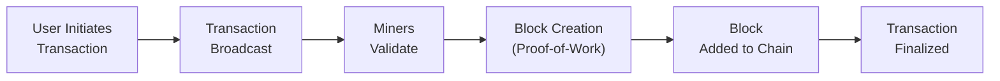

## 9.7 Introduction to Digital Assets

Have you ever wondered if there’s more to “currency” than just cash in your wallet or numbers in your bank account? Well, welcome to a world where intangible digital tokens can represent just about anything—money, ownership, access to digital applications, or membership in a specialized community. It’s all wrapped up under the umbrella of “digital assets.”

Digital assets can be thought of as cryptographically secured representations of value, ownership, or rights that exist on a distributed ledger network (such as a blockchain). In this section, we’ll walk through the fundamental concepts, big ideas, and potential pitfalls in the digital asset landscape. We’ll also discuss the underlying technology, examine investment considerations, and consider how they fit into broader portfolio management strategies.

It’s a pretty huge topic. In fact, I remember first hearing about Bitcoin back in the day and thinking: “Um, is this some kind of online game currency?!” That was my initial reaction—groups of folks on the internet sending digital coins back and forth. Little did I know how it would expand into this massive ecosystem of alternative investments, which might just revolutionize entire industries.

Let’s dive in.

---

### What Are Digital Assets?

Digital assets are essentially tokens or “coins” that exist electronically and utilize cryptography to secure transactions. The most common types of digital assets include:

• Cryptocurrencies (e.g., Bitcoin, Ethereum)  
• Tokens issued on existing blockchains (e.g., fungible tokens, non-fungible tokens)  
• Stablecoins pegged to an external reference (often a fiat currency like the U.S. dollar)  
• Tokenized securities representing real-world assets (such as real estate or equity ownership)

Some digital assets are designed to be money-like, while others function more like shares of a company or membership licenses to digital communities. A significant underpinning for most digital assets is distributed ledger technology (DLT), with blockchain being its most famous example.

---

### Blockchain and Distributed Ledger Technology

DLT basically means there’s no single, central authority that maintains all transaction records. Instead, the transaction ledger is shared across multiple nodes (computers) on the network. Each node holds a copy of the ledger, and cryptographic consensus mechanisms (such as Proof-of-Work or Proof-of-Stake) help ensure that all copies remain in sync and accurately reflect every valid transaction.

#### Key Characteristics

1. Decentralization:  
   There’s no single entity that controls or verifies every transaction. The network collectively maintains the record.

2. Immutability:  
   Once transactions are recorded on a blockchain, they are extremely difficult (practically impossible) to alter. This characteristic fosters trust in the data.

3. Transparency:  
   Most public blockchains allow anyone to view the transaction history. (Some blockchains do focus on privacy, though, so transparency is not universal.)

4. Security:  
   Cryptographic techniques, including hashing and digital signatures, make it very tough for malicious actors to tamper with or counterfeit transactions.

I remember a friend who runs a supply chain business telling me about how they started using blockchain to authenticate delivery records, enabling real-time tracking of goods from factories to retail shelves. It was fascinating to see how “cryptocurrency technology” was woven into something as unassuming (or maybe as complicated) as supply chain management. The same technology is making waves in digital identity verification, finance, healthcare, and more.

---

### Investment Features of Digital Assets

Digital assets don’t behave like traditional stocks, bonds, or commodities. They have some unique characteristics and risk factors. If you’re even thinking of including them in a portfolio, you’ll want to keep these in mind:

1. High Volatility and Speculative Behavior  
   • Crypto markets can be insanely volatile, with price swings of 10% or more in a single day.  
   • While this volatility sometimes presents trading opportunities, it also increases risk.

2. Regulatory Uncertainty  
   • Different countries treat digital assets in different ways. Some have embraced them, some have outright banned them, and others fall somewhere in between.  
   • Ongoing changes in regulation can significantly affect market sentiment and asset prices.

3. Potential Diversification  
   • Early studies suggested that cryptocurrencies had low correlation with other asset classes like equities or bonds.  
   • Over time, correlations can shift. Don’t assume they’ll always remain uncorrelated. Conduct continuous correlation analysis within portfolio context.

4. Custody, Security, and Liquidity Issues  
   • Unlike traditional assets, digital assets often require a specialized wallet to store or transfer them.  
   • Exchanges can get hacked, and private keys (the codes that let you access your assets) can be lost or stolen.  
   • Liquidity levels vary drastically among different coins and tokens. Smaller tokens may be extremely illiquid.

---

### Forms and Vehicles of Digital Asset Investment

Positions in digital assets can be accessed in various ways, and different methods come with different trade-offs around control, security, and fees:

• Direct Ownership (Wallets, Exchanges)  
  – Purchasing digital assets directly on crypto exchanges (like Coinbase or Binance) and storing them in a digital wallet.  
  – You can choose between a custodial wallet (the exchange controls the private keys, which some see as less secure) or a non-custodial wallet (you hold your private keys, but bear responsibility for their safekeeping).

• Trusts, Exchange-Traded Products (ETPs), or Private Funds  
  – Similar to how people buy gold through exchange-traded funds (ETFs) or trust structures.  
  – These investment vehicles typically track the price of a digital asset.  
  – Offers convenience, but can come with management fees, premiums/discounts to net asset value (NAV), and regulatory restrictions depending on the region.

• Tokenized Securities  
  – Imagine slicing up a building’s ownership into tiny digital tokens and allowing each token holder to benefit from rental income or asset appreciation.  
  – Tokenized securities are regulated financial instruments that represent real-world assets in digital form.  
  – They’re an emerging trend that we might see a lot more of in the coming years.

---

### Risk, Return, and Diversification

Now, for the question you might be itching to ask: “Where do digital assets fit in my portfolio?” It depends on your risk tolerance, investment timeline, and objectives:

1. Risk  
   – Digital assets can be subject to extreme volatility. In some markets, daily price changes can exceed 10% or 20%.  
   – Regulatory clampdowns can quickly shift sentiment or even freeze trading in certain regions.

2. Return  
   – Historically, cryptocurrencies such as Bitcoin have had substantial long-term returns—if you managed to stomach the volatility and occasional crashes.  
   – There are no guarantees. Past performance is never a certain guide to the future, and plenty of assets have gone to zero.

3. Diversification  
   – Some folks like to allocate a small percentage of their portfolio to digital assets because it might offer diversification benefits—at least at times.  
   – Correlations with the Russell 2000 or S&P 500 can fluctuate, so continually monitor your portfolio’s risk exposures.

---

### Potential Use Cases Beyond Investment

Broadly speaking, digital assets and DLT use cases go far beyond just speculation. Some real-world scenarios include:

• Supply Chain Tracking: Tracking products from factory to customer for transparency and immutability.  
• Decentralized Finance (DeFi): Borrowing, lending, and trading digital assets without centralized intermediaries.  
• Payment Solutions: Cross-border remittances that are faster and sometimes cheaper than traditional wire transfers.  
• Digital Identity: Securing personal information and preventing identity theft, all stored on a decentralized ledger.

I once volunteered on a project in a remote region, and the conversation came up: “Wouldn’t it be cool for farmers here to receive payments in a stable digital token that’s pegged to a local currency, so they don’t have to worry about hyperinflation or traveling to the nearest city to handle transactions?” That was the first time I realized that real, on-the-ground benefits could be possible—not just in sophisticated financial markets but in everyday life situations, too.

---

### Key Concepts in Digital Assets

A few important terms pop up frequently in the digital assets space:

• Stablecoin  
  – A cryptocurrency designed to minimize price volatility, often backed 1:1 by fiat currency reserves or other collateral.  
  – Tether (USDT) and USD Coin (USDC) are popular examples, though their reserve mechanisms can vary.

• Smart Contract  
  – Computer code that runs on a blockchain network.  
  – Automatically executes certain actions (like transferring funds) upon meeting predefined conditions.  
  – Enables decentralized applications (dApps) to run without relying on a central authority.

• Decentralized Finance (DeFi)  
  – Ecosystem of financial services (e.g., lending, borrowing, derivatives) that operate without traditional intermediaries like banks.  
  – Built primarily on blockchain networks with smart contracts.  
  – Offers potentially high yields but also carries significant protocol, liquidity, and smart-contract risks.

• Mining or Validation  
  – The process by which blockchain networks validate transactions.  
  – Proof-of-Work (PoW) involves computationally expensive tasks to “mine” new blocks (as in Bitcoin).  
  – Proof-of-Stake (PoS) involves users staking coins to get the right to validate transactions (as in new Ethereum).

---

### Diagram: Simplified Blockchain Flow

Here is a simple diagram showing a basic flow of transactions in a Proof-of-Work blockchain. This is not an exhaustive representation, but it helps visualize the main steps:

1. The user initiates a transaction (like sending some digital currency).  
2. The transaction is broadcast to network nodes (participants).  
3. Miners (validators) check the transaction for validity (e.g., the sender has enough funds).  
4. Miners compete to solve a cryptographic puzzle, which is the “Proof-of-Work.”  
5. The winning miner assembles a block of valid transactions and appends it to the chain.  
6. The transaction is now recorded in the chain, considered final, and the miner receives a reward.

---

### Case Study: Crypto Exposure Through Exchange-Traded Products

Let’s say you’re a portfolio manager at a medium-sized asset management firm. Clients have started asking for “crypto exposure,” but internal compliance is uneasy about setting up wallets or dealing directly with crypto exchanges. One possible route: investing in a regulated exchange-traded product (ETP) that tracks the price of Bitcoin or Ethereum.

• Pros:  
  – You gain the price exposure without having to worry about private keys, crypto wallets, or custody arrangements.  
  – You can buy and sell the product via a brokerage account, just like any other ETP.  

• Cons:  
  – The product might trade at a substantial premium or discount to the underlying digital asset’s net asset value.  
  – Management and sponsor fees could eat into returns.  
  – Regulatory changes can affect ETP availability. For instance, some countries restrict direct listing of crypto-based ETPs on public exchanges.

This approach might be more comfortable for traditional investors, especially if they are new to the digital asset space. However, it does require ongoing monitoring of market conditions and regulatory developments.

---

### Best Practices, Common Pitfalls, and Risk Management

• Educate Yourself:  
  – Understand the technology beyond just the price.  
  – Keep up with developments, especially around regulations and major protocol upgrades.

• Diversify:  
  – Treat digital assets as part of a broader portfolio.  
  – Use risk management techniques similar to other asset classes, but keep in mind digital assets’ unique characteristics.

• Secure Your Keys:  
  – If investing directly, ensure proper wallet security (hardware wallets, multisignature solutions, secure backups).  
  – Exchange hacks and phishing scams remain prevalent.

• Watch Out for Scams:  
  – The digital asset space, especially in bull markets, can attract fraudulent projects promising unrealistic returns.  
  – Always perform rigorous due diligence.

• Regulatory and Tax Implications:  
  – Regulations vary by jurisdiction.  
  – Tax authorities often treat digital assets as property, meaning capital gains rules can apply.  
  – Keep track of costs, acquisitions, sale records, and potential capital gains or losses.

These might sound like no-brainers, but you’d be surprised how many folks jump into cryptos just because “the price is going up.” Then, when the inevitable downturn happens—or if they lose access to their private keys—they realize they neglected the fundamentals.

---

### Behavioral Biases in Digital Asset Investing

As covered in Chapter 10 on Portfolio Management, it’s important to recognize the behavioral biases that can affect investment decisions. With digital assets, these biases can be even more pronounced:

• Overconfidence Bias:  
  – Investors might think they “understand crypto” fully just because they read a few online articles.  
  – Remember, markets can be unpredictable, and new technologies come with hidden risks.

• Herding Behavior:  
  – Many jump into crypto purely because “everyone else is buying it.” This can inflate asset bubbles quickly and lead to severe crashes.  
  – Consider fundamentals and your personal or organizational risk tolerance before jumping in.

• Fear of Missing Out (FOMO):  
  – The rapid price appreciations and social media hype can trigger strong emotional reactions.  
  – Setting specific investment guidelines can help keep you grounded.

---

### Glossary

• Stablecoin:  
  – A cryptocurrency that aims to keep its value stable relative to another asset, often fiat currency.  
  – Stability is typically maintained through reserves, algorithmic mechanisms, or a mix of both.

• Smart Contract:  
  – A self-executing contract with agreement terms directly written into computer code.  
  – Reduces the need for intermediaries and can lower transaction costs.

• Decentralized Finance (DeFi):  
  – Blockchain-based applications offering financial services without traditional intermediaries.  
  – Can include lending, trading, yield farming, and more.

• Mining/Validation:  
  – The process of confirming transactions and securing the network in exchange for rewards.  
  – Different protocols use different methods (PoW, PoS, and others).

---

### References and Recommended Readings

• CFA Institute articles on fintech, blockchain, and decentralized finance (regularly updated on the CFA Institute website).  
• Burniske, Chris, and Jack Tatar. “Cryptoassets: The Innovative Investor’s Guide to Bitcoin and Beyond.”  
• Official websites of major digital asset exchanges (Coinbase, Binance, Kraken, etc.) provide helpful guides, tutorials, and market data.  
• Keep up-to-date with regulatory developments in your jurisdiction to ensure compliance.  

---

Before we wrap up, let’s do a quick recap:

1. Digital assets are an emerging alternative investment with high volatility and new forms of risk.  
2. DLT and blockchain technology support decentralized recording and validation of transactions.  
3. Various investment options exist—from direct ownership to regulated funds—each with its own pros and cons.  
4. Risk management is paramount; pay attention to custody, security, liquidity, and regulatory compliance.  
5. This is an evolving space with enormous potential beyond pure speculation—from supply chain to decentralized finance and beyond.

It seems to me that digital assets, for all their controversy, remain an area of significant innovation. They might continue to reshape how we think about financial markets. If you’re intrigued, keep digging deeper—just be sure to stay grounded in sound investment principles, risk management, and compliance.

Now, how about testing your knowledge on these concepts with a few sample exam questions?

---

## Test Your Knowledge: Digital Assets Quiz



### Which of the following best describes a key benefit of blockchain technology?

- [ ] It centralizes transaction verifications under one trusted party.
- [x] It creates a decentralized record of transactions verified cryptographically.
- [ ] It makes all digital transactions fully private and untraceable.
- [ ] It removes the need for any regulation or governance.

> **Explanation:** Blockchain distributes transaction data across a network of nodes, ensuring decentralization and cryptographic verification, which is different from single-authority verification methods.

### Which of the following is most likely a characteristic of digital assets?

- [x] They exhibit high volatility relative to many traditional assets.
- [ ] They typically trade with the same liquidity as large-cap stocks.
- [x] They can be used as a means to represent real-world ownership (e.g., tokenized securities).
- [ ] They are fully insured by government agencies in most countries.

> **Explanation:** Digital assets often exhibit large daily price swings, and many tokens can represent ownership in real-world assets. However, they do not generally benefit from sovereign insurance protection, and liquidity varies widely.

### In evaluating digital assets, a primary concern for institutional investors is:

- [x] Custodial risk, including securing private keys.
- [ ] Lack of volatility, making returns too stable.
- [ ] The absence of blockchain consensus mechanisms.
- [ ] Immutability, which leads to overly frequent ledger rewrites.

> **Explanation:** Storing private keys safely is crucial, as losing them can render assets inaccessible. Volatility is not typically cited as “too low,” and standard blockchains are collectively agreed upon, not frequently rewritten.

### What is one potential advantage of stablecoins?

- [x] They attempt to reduce price volatility compared to other cryptocurrencies.
- [ ] They are used only by central banks for cross-border transactions.
- [ ] They are pegged to digital identities rather than fiat currency.
- [ ] They eliminate all transaction recording on blockchains.

> **Explanation:** Stablecoins generally seek to maintain a stable market value, often pegged to fiat currencies, mitigating extreme price movements typical of other cryptocurrencies.

### When an investor buys an exchange-traded product (ETP) that tracks a cryptocurrency, one drawback can be:

- [x] The risk of buying at a premium over the underlying asset’s net asset value.
- [ ] The investor taking custody of the crypto’s private keys.
- [x] Higher fees compared to direct crypto ownership in some cases.
- [ ] Guaranteed returns from the underlying blockchain.

> **Explanation:** Some ETPs trade at a premium or discount to the net asset value (NAV), and fees may be higher than those encountered in direct ownership. Also, ETP investments typically do not involve the investor holding private keys.

### Which statement about tokenized securities is true?

- [x] They represent ownership in real-world assets on a blockchain.
- [ ] They eliminate the need for regulated offerings.
- [ ] They are always unregulated utility tokens.
- [ ] They cannot distribute dividends or interest payments.

> **Explanation:** Tokenized securities are regulated and represent claims on tangible or intangible assets, often providing dividends, interest, or other financial rights similar to traditional securities.

### Decentralized Finance (DeFi) primarily aims to:

- [x] Offer financial services without traditional intermediaries via smart contracts.
- [ ] Provide a controlled environment where only banks can trade.
- [x] Facilitate peer-to-peer lending and trading on blockchain networks.
- [ ] Eliminate all types of financial risk.

> **Explanation:** DeFi aims to decentralize financial services using smart contracts operating on blockchains. It potentially offers lending, borrowing, and other services but doesn’t eliminate all risk.

### Which of the following is considered a security best practice for direct digital asset ownership?

- [x] Using hardware wallets or multisignature solutions to secure private keys.
- [ ] Keeping private keys in plain text on one’s phone for easy access.
- [ ] Removing all password protections to facilitate faster trading.
- [ ] Relying solely on unregulated custodians with no insurance.

> **Explanation:** Protecting private keys is paramount. Best practices include using hardware wallets or multisignature accounts, not storing sensitive data unencrypted or with unsecure entities.

### What is a main drawback of Proof-of-Work (PoW) blockchain networks?

- [x] They can consume significant energy to validate transactions.
- [ ] They cannot support any cryptocurrency other than Bitcoin.
- [ ] They prevent any form of decentralization.
- [ ] They have no security features whatsoever.

> **Explanation:** Proof-of-Work consensus mechanisms require large amounts of computational work, often leading to high energy consumption. However, PoW networks can still be decentralized and secure.

### Including digital assets in a portfolio might be beneficial if:

- [x] True
- [ ] False

> **Explanation:** Some investors see digital assets as a means of obtaining diversification or higher potential returns. However, such benefits depend on an investor’s risk profile and market conditions.


