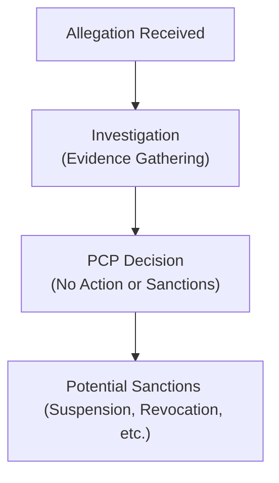

## 1.2 Code of Ethics and Standards of Professional Conduct

It’s funny how, when I first heard about the CFA Institute’s Code of Ethics and Standards of Professional Conduct, I thought it was all about memorizing a set of rigid rules for an exam. I vividly recall thinking, “Um, do I really need to know all these bullet points by heart?” But once I dove in and began applying them to real-life scenarios—like dealing with client information in my old internship or trying to figure out what gifts were “too nice” to accept from a broker—I realized it was more than just a formality. These guidelines shape how we, as finance professionals, behave every day. And it’s not just about passing a test either; it’s about what we do, even when no one’s looking.

Below, we’ll dig into the Code of Ethics, the Seven Standards of Professional Conduct, how they’re actually enforced via the Professional Conduct Program (PCP), and how it all fits into your everyday professional life. We’ll keep it practical and slightly informal, with some personal experiences and stories tossed in, so that you end up with not just head knowledge but practical wisdom.

---

### Why Ethics Matters

We can’t talk about the Code of Ethics and the Standards of Professional Conduct without first pondering why ethics is even such a big deal in the investment profession. When you think about it, people entrust their life savings, their retirement funds, or their child’s college tuition money into the hands of professionals. For that trust to exist, the entire financial system needs to operate with integrity—clients must believe that we’re looking out for them, not just out to earn a quick buck or use insider information.

Ethics helps build that trust. It’s the bedrock of capital markets—without it, we get all sorts of shady scenarios: false information, misrepresentation, front-running, conflicts of interest, and a whole bunch of nonsense that does nothing but damage client wealth and investor confidence.

---

### Inside the CFA Institute Code of Ethics

The Code of Ethics is kind of like a set of guiding principles that underscore how CFA Institute members and candidates should act. In a nutshell, these principles typically revolve around:

• Acting with integrity, competence, diligence, respect, and in an ethical manner with the public, clients, prospective clients, employers, employees, colleagues, and other participants in the global capital markets.  
• Placing the integrity of the investment profession and the interests of clients above one’s own personal interests.  
• Using reasonable care and exercising independent professional judgment.  
• Practicing and encouraging others to practice in a professional and ethical manner that will reflect credit on the members and the profession.  
• Promoting the integrity and viability of the global capital markets for the ultimate benefit of society.  
• Maintaining and improving professional competence.  

If you want a quick memory hook: it’s about acting in the client’s best interest, treating others with fairness, and always doing what’s right to maintain trust in markets. Sometimes, that means you’ll have to say “no thanks” to a lavish gift from a vendor that might compromise your judgment. Sometimes, it’s about speaking up if your boss wants you to fudge a performance report. Sounds obvious, right? Yet, in practice, these calls can be tricky.

---

### The Professional Conduct Program: An Enforcement Mechanism

I remember the first time I heard about the Professional Conduct Program (PCP), I sort of pictured a group of detectives in suits, rummaging through documents to catch sneaky individuals. That’s not too far off from reality. The PCP is the enforcement body within CFA Institute that monitors and ensures adherence to the Code and Standards. When a complaint of a potential violation arises—like if someone suspects a member of misrepresentation—the PCP steps in, investigates, and determines whether any disciplinary action is warranted.

Here’s a simplified view of how a disciplinary process might flow:

1. Allegation Received: A tip or a shred of evidence that a CFA Charterholder or candidate might have done something unethical lands on the PCP’s desk.  
2. Investigation (Evidence Gathering): The PCP collects details—documents, interviews, statements—to build a picture of what happened.  
3. PCP’s Decision: Based on gathered facts, the PCP can decide no violation took place, or they can recommend sanctions.  
4. Sanctions: If they conclude a violation did indeed happen, the PCP can impose penalties, which range from private censure to revoking your right to use the CFA designation.

This process underscores just how serious and real these standards are—if you violate them, there’s more than your conscience at stake. Your entire career could be on the line.

---

### Structure of the Disciplinary Process

This enforcement structure is not just about “gotcha” moments. It’s intended to maintain the investment profession’s integrity. If we want the public to place millions—sometimes billions—of dollars in our hands, there has to be a reliable system that weeds out unethical players. The disciplinary process typically involves:

• A thorough inquiry where both sides can present evidence.  
• A hearing or a chance to respond to allegations.  
• A reasoned conclusion based on whether the evidence shows a violation of the Code and Standards.  
• Potential appeals or reviews in certain cases to ensure fairness.  

While it can feel intimidating, it’s also comforting to know that there’s a robust mechanism designed to protect the reputation of Charterholders who are doing the right thing.

---

### The Seven Standards of Professional Conduct

The Code of Ethics is like the compass pointing us in the right direction, while the Standards of Professional Conduct provide more precise coordinates. There are seven broad standards, each with sub-sections. They address specific areas where ethical dilemmas pop up in our day-to-day professional lives.

#### Professionalism

The first standard revolves around professionalism. It includes maintaining independence and objectivity, especially when facing external or internal pressures that could sway our judgment. It means keeping up to date with relevant laws and regulations (i.e., knowledge of the law), avoiding misrepresentation (don’t lie or twist data), and steering well clear of misconduct. If a friend at a party is pressuring you into giving them “tips” about a company you’re analyzing—run. Or politely say, “No way.” That’s part of maintaining your professional integrity.

Key sub-sections here:  
• A. Knowledge of the Law  
• B. Independence and Objectivity  
• C. Misrepresentation  
• D. Misconduct  

These remind you that you’re only as good as the honesty of your research and interactions. After all, who trusts a professional known for fudging data? That’s a rhetorical question, obviously, since no one does.

#### Integrity of Capital Markets

This standard targets insider trading and market manipulation. Honestly, this is where many new professionals get that “Oh, my gosh, how do I not slip up?” kind of anxiety. The gist: You must not act on material nonpublic information or do anything that jeopardizes fair market prices.

Examples:  
• If you’re analyzing a publicly traded company and find out about an upcoming merger from a friend working at that firm (and that info is not yet public), you have to zip it and not trade on it.  
• Manipulating market prices, like spreading false rumors or using unscrupulous short-selling strategies to tank a stock, is an absolute no-no.

Remember, when markets stop being seen as fair and transparent, trust evaporates. And that trust is precisely what keeps your salary paid.

#### Duties to Clients

This standard is about loyalty, prudence, and care. You’re expected to always place client interests above your own. That might mean avoiding any conflicts of interest, or at least properly disclosing them. Suppose your client’s portfolio would be better off with a certain security, but your employer is nudging you to sell an in-house fund instead. You might be caught in a conflict—your loyalty is to your client’s best interest, not increasing your firm’s bottom line (unless, of course, the in-house fund is truly the better choice).  

The sub-sections under Duties to Clients can cover performance presentation, preserving confidentiality, and fair dealing so that all clients get the same quality of service and information.

#### Duties to Employers

Just as you must place your clients’ interests first, you must also exhibit loyalty to your employer—within reason. You don’t steal trade secrets, you don’t go around defaming your company, and if you decide to leave, you make sure to do it ethically, not whisking away proprietary data and your entire client list to a competitor.  

But let’s be blunt: If your employer is asking you to do something illegal or unethical, your loyalty is superseded by your obligation to the law and integrity. Standard I.A. (Knowledge of the Law) also reminds you that it’s not enough to follow whichever is “most lenient”; you follow the most strict requirement—be it the local law, the standard, or your employer’s code.

#### Investment Analysis, Recommendations, and Actions

Now we’re in the meaty part that many folks in the investment world wrestle with daily—executing trades, making recommendations, analyzing securities. Here’s the big idea: you must have a reasonable basis for your recommendations, use thorough diligence, and communicate effectively with clients. If you recall, back in your early days, maybe you saw someone push a stock solely because they saw a hot tip on social media. That’s not quite the “reasonable basis” the standards require.  

A robust research process, appropriate diversification considerations, and consistent re-checking of your assumptions all ensure that you’re not misleading clients or making decisions based on incomplete information.

#### Conflicts of Interest

Conflicts happen. In finance, we often juggle multiple responsibilities—clients, employers, personal investments—and these can collide. The trick is to disclose them clearly and manage them so that none overshadow the client’s or public’s interest. If you own shares in a company you’re recommending, or if your sister is the CFO of a firm you’re analyzing, it’s crucial to let your employer, clients, or prospective clients know.  

This standard covers things like personal trading, referral fees, or relationships that might color your advice. Very often, issues arise not because a manager wanted to “get away with something,” but simply because they didn’t realize how a small personal connection could be seen as a big conflict.

#### Responsibilities as a CFA Institute Member or CFA Candidate

Finally, the seventh standard zeroes in on the responsibilities you take on when you become a CFA Charterholder or candidate. You’re expected to uphold the reputation of the designation, not misrepresent your status (like calling yourself a “CFA” before you’ve actually earned the charter) or cheat on the exams. Also, do not share confidential exam information or otherwise degrade the integrity of the test.  

If you think about it, the whole value of the CFA charter depends on all participants honoring that trust. It’s like a chain—if one link breaks, the entire thing can lose its integrity.

---

### Practical Examples and Real-World Case Studies

Let’s look at a few scenarios you might see:

• Gift Acceptances: Imagine you’re on the buy side, analyzing real estate securities, and a property developer you cover offers you an all-expenses-paid trip to a fancy resort. That sounds amazing, but it might compromise your independence. A modest working lunch can be okay, but a lavish getaway may create the appearance of a conflict.  

• Lies in Marketing Materials: Maybe your firm’s launching a new mutual fund. The marketing team wants to advertise a super-attractive performance history—problem is, they’ve excluded the biggest losing months from the data. That’s misrepresentation if you fold or fudge the numbers to attract assets under management.  

• Trading on Hunches from Non-Public Info: You overhear an executive call in a coffee shop. They are bragging about a massive buyout that’s about to go down. Trading on that information would violate the Integrity of Capital Markets standard.  

• Front Running: You hear your firm’s about to place a huge buy order on a stock. Placing a personal or family member’s order beforehand is front running and severely unethical.  

• Disclosure: You have an arrangement where if you place clients in a certain external fund, you get a referral fee. As long as you fully disclose that fee to the client (and it’s not detrimental to them), that’s typically acceptable. Hiding it is not.

These scenarios might sound innocuous, but they can spiral into major disciplinary issues if not handled properly. They illustrate that the Code and Standards aren’t just lofty ideals—these are day-to-day guidelines we live by.

---

### Common Pitfalls and Overcoming Them

Pitfall: “Everyone else is doing it.”  
• Honestly, you’ll hear that if you complain about questionable activities at your workplace. But guess what—everyone else’s wrongdoing doesn’t give you a free pass. If you cave in, you’re not only risking your career, but also failing your ethical obligations.  

Pitfall: “I’m not sure if this is a violation.”  
• Whenever in doubt, seek clarity from a mentor or compliance officer. The easiest path to trouble is to assume that since it’s not obviously illegal, it must be okay.  

Pitfall: “The ends justify the means.”  
• The idea that bending rules because results will “benefit clients” is a slippery slope. If you cross ethical lines, you may help your client today but harm the integrity of the market and your own reputation tomorrow.  

Pitfall: “No one will ever find out.”  
• That’s exactly the kind of thinking that the PCP process is designed to address. Investigations can surface the truth. Plus, your own conscience will catch up to you eventually.  

---

### Practical Implementation Strategies

• Regularly Review the Code and Standards: It’s not just for exam prep. Keeping these guidelines top of mind helps you spot problems before they become big issues.  
• Establish a Personal Firewall: If you are in a position with potential conflicts—like a big personal stake in a company you also cover—consider steps to remove yourself from coverage or create a robust disclosure practice.  
• Document Everything: In situations where your ethics might be questioned, having records of your due diligence, research notes, and communications can go a long way in proving you acted properly.  
• Encourage an Ethical Culture: If you’re in a leadership role, reward employees who highlight potential risks or conflicts rather than shutting them down.  

---

### A Quick Glossary

These terms might come up frequently:

• Professional Conduct Program (PCP): The CFA Institute’s enforcement body that investigates and sanctions violations.  
• Disciplinary Process: The formal procedure that begins when there’s an alleged breach of the Code and Standards, proceeding through investigation to possible sanctions.  
• Integrity of Capital Markets: A principle requiring professionals to avoid insider trading, market manipulation, and any actions that damage fairness and transparency.  
• Misrepresentation: Providing false or misleading information, whether through statements, performance data, or other forms of communication.  
• Independence and Objectivity: Ensuring your professional judgment is free from external pressures or personal gain.  
• Duties to Clients: The obligation to act with loyalty, prudence, and care, keeping client interests first and foremost.

---

### Conclusion and Encouragement

Sometimes, all these rules might feel cumbersome, but I’d argue they’re actually freeing. Knowing exactly how to navigate potential conflicts or ambiguous situations actually reduces stress. Rather than wake up at night worrying about whether your client or boss will question your judgment, you can rest easy, anchored by a solid framework. The Code of Ethics and the Standards of Professional Conduct bring clarity to what we’re supposed to do and, more importantly, who we’re supposed to be.

Let’s remember: The reason these standards exist is that we, as investment professionals, have a noble purpose—to manage, grow, and protect people’s wealth and the capital markets that support economic growth worldwide. Honoring that purpose by being ethical isn’t just a rule. It’s the heart and soul of the profession.

---

### References for Further Exploration

• CFA Institute. (2020). “Code of Ethics & Standards of Professional Conduct.”  
• “Standards of Practice Handbook” (latest edition), CFA Institute.  
• Neikirk, T. (n.d.). “Enforcement of Ethical Standards,” Journal of Investment Compliance.  
• Official CFA Institute Resource:  
  – https://www.cfainstitute.org/ethics-standards  
• Consider reading about parallel ethics enforcement frameworks in accounting and law (e.g., AICPA’s Code of Professional Conduct or ABA Model Rules for Professional Responsibility) for additional perspectives.  

---

## Test Your Knowledge: Code of Ethics and Standards of Professional Conduct



### Which of the following best describes the purpose of the CFA Institute Code of Ethics?  
- [ ] To provide strict legal statutes for investment advisors.  
- [x] To outline the fundamental ethical principles guiding the investment profession.  
- [ ] To serve only as a marketing tool to attract investors.  
- [ ] To determine industry compensation benchmarks.  

> **Explanation:** The Code of Ethics sets forth broad ethical principles that guide behavior in the investment profession, emphasizing integrity, professionalism, and client-first standards.

### What is the primary role of the Professional Conduct Program (PCP)?  
- [ ] To create new hedge fund strategies for CFA candidates.  
- [x] To investigate alleged breaches and enforce the CFA Institute Code and Standards.  
- [ ] To conduct all securities trading for CFA Institute members.  
- [ ] To handle only legal disputes unrelated to ethics.  

> **Explanation:** The PCP enforces the Code and Standards by investigating violations, gathering evidence, and imposing sanctions where necessary.

### Which scenario may violate the Integrity of Capital Markets Standard?  
- [ ] An analyst using publicly reported quarterly results in a research report.  
- [ ] An advisor recommending government bonds because of a macroeconomic forecast.  
- [x] A manager trading on a confidential tip about an upcoming merger.  
- [ ] A portfolio manager diversifying across multiple sectors.  

> **Explanation:** The Integrity of Capital Markets Standard prohibits trading based on material nonpublic information or otherwise undermining fairness and transparency.

### Under the Duties to Clients Standard, which action is most appropriate?  
- [x] Disclosing to a client any referral fee arrangements you have when recommending specific external services.  
- [ ] Offering different levels of research detail to clients based on subjective biases.  
- [ ] Refusing to share important portfolio information until the client pays added fees.  
- [ ] Executing trades for your personal account before placing the same trades for the client.  

> **Explanation:** Disclosing referral arrangements ensures transparency and supports acting in the client’s best interest.

### What must a CFA Institute member or candidate do if their employer instructs them to undertake an illegal activity?  
- [x] Refuse to comply and consider reporting the issue to relevant authorities or compliance.  
- [ ] Follow the instruction because employer loyalty supersedes all else.  
- [x] Seek legal counsel or guidance from a compliance officer if uncertain.  
- [ ] Quietly comply, but keep a record of it for future reference.  

> **Explanation:** Under the Code and Standards, knowledge of, and compliance with, the law and professional integrity are paramount, even above loyalty to one’s employer.

### Which sub-section of the Professionalism Standard addresses avoiding gifts or perks that might bias your judgment?  
- [x] Independence and Objectivity.  
- [ ] Duties to Clients.  
- [ ] Misrepresentation.  
- [ ] Fair Dealing.  

> **Explanation:** Independence and Objectivity focuses on ensuring that external factors, such as gifts or lavish entertainment, do not compromise professional judgment.

### An analyst discloses that her brother is the CFO of a company she covers. Which standard is she most directly addressing by providing this information?  
- [x] Conflicts of Interest.  
- [ ] Misrepresentation.  
- [x] Fair Dealing.  
- [ ] Market Manipulation.  

> **Explanation:** Disclosing personal relationships that could affect objectivity is crucial under the Conflicts of Interest Standard.

### Which of the following behaviors is most likely to constitute Misrepresentation?  
- [x] Presenting hypothetical back-tested performance as actual past returns without disclosure.  
- [ ] Accepting a gift worth $15 from a supplier.  
- [ ] Changing a macroeconomic outlook in a research report after new public data is released.  
- [ ] Letting your boss review your research notes.  

> **Explanation:** Falsely presenting hypothetical performance as real track record misleads investors, violating the Code and Standards.

### When it comes to acting on material nonpublic information, the correct response is to:  
- [x] Refrain from trading or recommending a trade until the information becomes public.  
- [ ] Only act if you believe no one else has the information.  
- [ ] Share it only with your closest colleagues.  
- [ ] Immediately trade before someone else does.  

> **Explanation:** Trading on inside information damages market fairness and is strictly prohibited under the Integrity of Capital Markets Standard.

### True or False: A CFA Charterholder has the freedom to describe themselves as a “CFA” without specifying “Chartered Financial Analyst.”  
- [x] True  
- [ ] False  

> **Explanation:** Use of the “CFA” marks is permitted once the Charter has been earned, though the charterholder must adhere to the CFA Institute guidelines on usage.  


