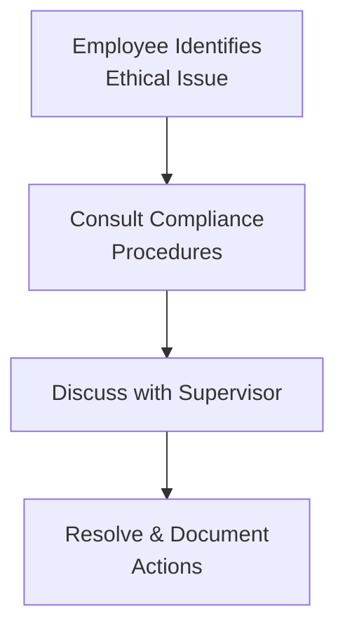

## 1.3 Guidance for Standards I–VII

This section delves into real-world examples and best practices to help investment professionals apply the Code of Ethics and Standards of Professional Conduct (often referred to as the “Standards”) in their day-to-day activities. If you’ve ever wondered how to handle material nonpublic information when an old college friend calls you with a hot tip, or if you’ve felt unsure about disclosing a private client detail to the marketing team, the guidance contained here is meant to shed light on those tricky scenarios. 

Ethics, as we all know, is not just about abstract principles—it’s about real people making real decisions that can significantly impact clients’ lives, market integrity, and our professional reputations. The deeper you understand the Standards, the more prepared you’ll be to spot red flags and foster a culture of integrity within your organization.

Below, we’ll explore insights on each Standard, talk about required policies and controls, and share a few personal anecdotes and stories. We’ll also highlight easy-to-implement compliance solutions, such as restricted lists, staff training, and robust compliance manuals. Ultimately, the goal is for you to feel fully equipped to meet the highest ethical benchmarks in all your professional dealings and to effectively encourage your colleagues to do the same.

Remember: staying ethical isn’t just a matter of following rules to avoid regulatory trouble—it’s also about building client trust, maintaining your professional reputation, and contributing to the well-being of the entire financial ecosystem.

---

Overview of Standards I–VII

• Standard I (Professionalism): Being honest, independent, and diligent in all professional behavior.  
• Standard II (Integrity of Capital Markets): Refraining from actions that harm market integrity, such as insider trading.  
• Standard III (Duties to Clients): Always placing client interests first and ensuring confidentiality.  
• Standard IV (Duties to Employers): Balancing employer interests and your own professional obligations while avoiding conflicts.  
• Standard V (Investment Analysis, Recommendations, and Actions): Performing comprehensive due diligence and presenting findings fairly.  
• Standard VI (Conflicts of Interest): Achieving transparency and resolving real or potential conflicts promptly.  
• Standard VII (Responsibilities as a CFA Institute Member or CFA Candidate): Acting in a manner that upholds the reputation of the CFA Institute and the credential.

The following pages provide a deep dive into what each Standard entails for daily, real-world practice.

---

Professionalism and Practical Application

Professionalism undergirds every other rule. If you lack a conscientious, honest approach, even the best compliance manual will fail. For instance, consider your approach to referencing qualifications on a résumé—or listing credentials you haven’t actually earned. It might be tempting to inflate your achievements or list your expected CFA® charter as if you already have it. But that small exaggeration undermines the entire principle of Professionalism (Standard I) and can cause reputational damage that’s tough to repair.

Just last year, I heard about a senior associate who casually mentioned that he had “completed all requirements” for the CFA charter, though in reality, he still had one exam left. An HR manager discovered the truth during routine background checks, and it created an awkward situation for the entire firm. The moral of the story? Always be upfront and transparent about credentials, job performance, or anything else your clients or employer might rely on to judge your trustworthiness.

Key points of Standard I (Professionalism) often address:  
• Competence: Knowing your stuff, staying up to date, and avoiding work in areas beyond your expertise (unless properly supervised).  
• Independence and Objectivity: Not allowing freebies, perks, or personal relationships to cloud your judgment when recommending securities.  
• Misrepresentation: Being precise and truthful in marketing, reports, or communications.  
• Misconduct: Avoiding any actions that threaten your professional reputation, whether in or out of the office.

---

Clear Examples and Best Practices

Let’s say your firm’s research department gets a fancy lunch every quarter from a particular bank. Friendly lunches can be innocent, but if the bank is doing it to subtly push their IPO underwriting business, you might be tempted to cast them in a favorable light when discussing them with clients. The line between a courtesy and a conflict can be blurry. A best practice is to promptly report or document any gifts or entertainment you receive. This ensures firm-wide transparency and helps draw an objective line between an innocent meal and a potential bribe.

Another big piece of Standard I is the concept of due diligence. If you claim to be an expert on structured products but you haven’t properly researched the new securities you’re evaluating, that is an issue. Keep thorough records of your research and be ready to provide rationale for your recommendations at any time.

---

Integrity of Capital Markets: Avoiding Insider Trading

Now, let’s talk about Standard II (Integrity of Capital Markets). This standard is all about ensuring that your actions do not undermine the fairness and efficiency of the markets, which in turn helps maintain public trust. Insider trading is a big no-no, but it goes beyond “trading.” Even if you never place a trade yourself, sharing material nonpublic information with others—like a neighbor, who then trades on your tip—can also violate this Standard.

What does material nonpublic information really mean? Here’s a simple rule of thumb: If an investor would likely change their decision to buy, sell, or hold if they had that piece of info, it’s material. And if it hasn’t been released to the public in a well-disseminated form, it’s nonpublic. For instance, imagine you overheard a conversation in your office lobby about a major pharmaceutical firm finalizing a merger the next day. In your excitement, you text your cousin who trades that stock, telling her something like, “Big things are happening tomorrow—buy if you can!” Even though you didn’t trade, you triggered insider activity, undermined market fairness, and put yourself in breach of the Standard (and likely regulators’ crosshairs!). 

To prevent insider risks, many firms maintain Chinese Wall (information barrier) policies that segment employees to keep them from sharing sensitive data. Another typical safeguard is the restricted list. If your M&A department is advising a company, that company’s security appears on a restricted list, and staff are barred from trading or recommending it. Meanwhile, employees must promptly escalate if there is a risk of material nonpublic information crossing that barrier.

---

Duties to Clients: Putting Their Interests First

Standard III (Duties to Clients) centers on loyalty, prudence, and care. If you’re an investment adviser or portfolio manager, you must place client interests before your own—and definitely before your firm’s short-term profit motives.

Client confidentiality is a guiding principle that feels almost like a doctor–patient relationship in finance. If your client confides details about their personal finances, such as their health issues or an imminent divorce (info that might affect their risk tolerance or financial planning), you are obligated to keep that information safe. Disclosure is only permissible if required by law or specifically authorized by the client. 

A friend of mine once faced a tough situation: a stranger emailed him requesting proof that a certain wealthy client was invested in a particular hedge fund. The stranger claimed to be the “client’s spouse,” but my friend noticed something fishy in the request. Rather than comply, he directed the query through formal compliance channels, which uncovered that the request was a hoax. This scenario highlights how easy it can be to slip up if you aren’t vigilant. Always confirm the identity and verify the authorization of information requests.

Client loyalty also means taking steps to secure the best execution on trades and charging reasonable fees. This Standard is not about “cheapest is always best,” but about balancing a variety of factors like speed, reliability, cost, and the client’s particular objectives.

---

Duties to Employers—Yes, They Matter Too

Standard IV (Duties to Employers) might surprise some people who assume that focusing on clients inevitably means ignoring what the employer wants. But it’s about finding alignment and respecting your employment contract, internal policies, and intellectual property. 

If you decide to leave your firm to start your own advisory business, you’re obviously allowed to use general knowledge and skills you’ve developed, but you can’t walk away with a client list or proprietary trading algorithms. At the same time, you can’t ignore your own rights. If you’re asked to do something that violates any other Standard, no matter how your employer insists, you must refuse (and possibly blow the whistle if needed). 

My personal tip: If you’re unsure whether you’re crossing a line with your employer (like using a client contact in your personal capacity), just be transparent. Many conflicts or misunderstandings can be avoided by having open conversations with your compliance department or direct supervisor.

---

Investment Analysis, Recommendations, and Actions

Standard V covers how you formulate and present your investment recommendations and analyses. The words “accuracy,” “thoroughness,” and “expert judgment” all come to mind here. If you’re preparing an equity research report, you need to evaluate relevant data and highlight the assumptions used in your forecast. You also need to properly reference data sources and never misrepresent the extent of your analysis by, for instance, claiming to have done extensive on-the-ground research when you actually only used a widely available aggregator.

Consider the mismatch that occurs when you rely heavily on third-party rating agencies for a structured product—that’s not in itself a violation. But if you write in your memo that you “personally traveled to energy rigs for site visits and concluded there’s minimal risk of default,” and you never left your desk, you’re presenting a false impression that leads to misrepresentation. 

Even small omissions can mislead. If you know there’s a data limitation or a conflict in your model, it’s good practice to attach disclaimers or footnotes. This Standard essentially aims to ensure your written and verbal communications are an honest reflection of your actual research.

---

Conflicts of Interest: Being Transparent and Fair

Standard VI deals with conflicts of interest, which are inevitable in finance but not necessarily evil if you handle them openly. A classic example is a portfolio manager who invests in a company for clients and also owns shares personally. That’s not inherently problematic—unless the manager front-runs client trades, or fails to disclose this interest to the firm and clients. So, the principle is about disclosing conflicts to clients and employers so they can decide how to proceed, or so you can take mitigating actions.

Gift policies typically fall under the umbrella of conflict management. For instance, you might have a rule that if you receive a gift or business entertainment worth over a certain dollar amount, you must promptly report it. Even something like a holiday hamper from a vendor can turn into a conflict if you start choosing their products simply because of that hamper. Another scenario is nepotism. Let’s say your cousin is a senior executive at a company you’re analyzing. That’s definitely relevant information to your employer and to prospective investors in your research.

---

Responsibilities as a CFA Institute Member or CFA Candidate

Finally, Standard VII is especially near and dear to aspiring or existing CFA charterholders. It addresses how you carry yourself as a member or candidate. Basically, you may not use the CFA designation in a misleading way (like referring to yourself as a “CFA Level IV” if you’ve passed all three exams but haven’t completed the work experience). And you shouldn’t imply that passing the exam alone is a fast track to guaranteed market outperformance.

This Standard also states that members or candidates should not engage in conduct that compromises the integrity of the CFA Program or the examination process—like sharing confidential exam information or exam questions that appear on the test. If you’re not sure whether your wording on LinkedIn might overstate your involvement in the Program, it’s wise to check the official CFA Institute guidelines for referencing candidacy.

---

Common Violations and How to Avoid Them

• Insider Trading and Tipping: Even a casual mention to a third party can be penalized.  
• Misrepresentation of Credentials or Performance Results: Watch out for inflated claims in marketing materials.  
• Front Running Client Orders: Always place client interests first.  
• Conflicts of Interest: Failing to mention personal relationships or stakes in recommended investments.  
• Client Confidentiality Breaches: Discussing private client matters in open areas.  
• Neglecting Independent and Objective Judgment: Letting gifts or personal relationships sway recommendations.  

If you ever feel that twinge of conscience—“Should I be sharing this with a client? Is this detail actually public?”—take a step back and talk to your compliance officer or legal department. A tiny bit of caution can prevent a big ethical fiasco.

---

Designing a Compliance Framework

1) Clear Policies: Develop a comprehensive compliance manual that details how and when employees must declare gifts, personal trades, or potential conflicts.  
2) Ongoing Training: Ensure that ethics training is routine. People often need a refresher on how to interpret new regulations or handle emerging technologies (like digital assets).  
3) Information Barriers/Chinese Walls: Keep sensitive deal-making or private client data in segmented departments to prevent inadvertent disclosure.  
4) Restricted Lists: Maintain and frequently update a restricted list that flags securities your firm is currently advising on, to avoid piggybacking for personal gain.  
5) Supervision and Monitoring: Implement a system for reviewing email communications, chat logs, or abnormal trading patterns. Some employees might inadvertently share sensitive data if it’s “just an internal chat.”  

Below is a simple flowchart illustrating a typical compliance check process:

Consider embedding steps like these into your daily routine—these processes encourage employees to follow up with the right people and minimize the chance of slipping into a violation.

---

Practical Example: Restricted Lists

Many organizations maintain a restricted list to manage potential conflicts. For example, you work in the research department of a large investment bank. Your colleague from the corporate finance department is advising Company X on a confidential merger. The bank then places Company X’s security on a restricted list. This prevents employees like you from trading on that tip. 

It might also mean that your research on Company X has to be put on hold (or published with disclaimers) until the merger is publicly announced. The entire restricted list process is aimed at blocking improper trade advantages. 

---

Incorporating Technology and Control Mechanisms

In the modern era, well-designed compliance technology can be your biggest ally. From chat monitoring tools to AI-driven “content scanning” solutions that flag potential insider references in real time, these tech solutions can reduce your risk profile substantially.

Below, for example, is a table with sample features you might see in a well-designed compliance system:

| Feature            | Description                                          | Example                                                                                |
|--------------------|------------------------------------------------------|----------------------------------------------------------------------------------------|
| Employee Trading Hub | Requires staff to pre-clear personal trades          | Employees submit orders for pre-approval, ensuring they aren’t front-running clients.  |
| Automated Email Screening | Flags mention of restricted securities or suspicious phrases | System catches unusual communication like “We need to buy X before tomorrow!”         |
| Training Modules   | Interactive courses and scenario-based quizzes        | Quarterly modules that challenge staff with real-world ethics dilemmas.               |
| Whistleblower Hotline | Anonymous channel allowing staff to report concerns | Employees feel safe reporting suspicious colleagues or instructions.                  |

---

Culture of Integrity

None of these policies will matter if the organization’s culture encourages “winning at all costs.” That’s why senior management buy-in is vital. Managers at all levels must model ethical behavior—demonstrate transparency in trading, respect confidential info, and follow gift disclosure rules themselves. If employees see hypocrisy at the upper echelons, the best policies in the world can seem hollow.

It might sound grandiose, but an ethics-first viewpoint is also about your own well-being. Knowing you can do your job without fear of crossing legal or ethical lines is liberating. You can focus on analyzing markets, serving clients, and developing your career rather than covering your tracks or living under the constant anxiety of a compliance shortfall.

---

Sample Case: Conflicts of Interest and Insider Info

Imagine you’re a portfolio manager at a mid-sized asset management firm. You recently discovered that your brother-in-law works in the product development team at a big tech company. You keep hearing him complain about production delays, which—unofficially—hint at possible supply issues (material if widely known). The next day, your fund is considering whether to increase its position in that big tech company.

• How do you handle it?  
    – Immediately disclose this potential conflict or the possibility of inside info to your compliance department.  
    – Ask your brother-in-law to refrain from sharing nonpublic details (and remind yourself to avoid probing him with questions about the company’s internal affairs).  
    – If you feel the supply issue is indeed material and hasn’t been disclosed publicly, you must not trade on it.  

This scenario highlights the value of policies and a robust process. If your firm sets clear guidelines, you’d know to consult compliance before proceeding, ensuring no questionable trades occur.

---

Encouraging a Proactive Mindset

No one wants to face an enforcement action or a media scandal. But ethical problems often start small: a single “harmless” piece of insider info that you can’t resist trading on, or a short, whispered conversation about a restricted stock. Proactive measures—like disclosing conflicts, seeking advice, or recusing yourself from certain decisions—protect you, your firm, and your clients.

Some professionals even keep personal “red lines,” such as never discussing client holdings at social gatherings or politely steering conversations away when a friend tries to brag about corporate secrets. Simple steps like these can prevent major ethical dilemmas.

---

FAQ: Quick Answers on Standards I–VII

• Q: If I overhear a rumor at a restaurant, does that count as material nonpublic information?  
   – A: Possibly. You need to confirm whether it’s truly material and nonpublic. If it appears credible and material, you must treat it as MNPI until proven otherwise.  

• Q: My client wants me to share personal trading strategies with their spouse. Is that allowed?  
   – A: Only if the client legally authorizes you to share such data. Otherwise, that may violate confidentiality.  

• Q: Do I need permission from my employer for outside consulting?  
   – A: Usually, yes. Depending on your contract and corporate policy, you might have to get written approval to ensure no conflicts of interest or usage of firm resources.  

• Q: Can I put “CFA, expected 20XX” on my business card if I’m a candidate in the Program?  
   – A: CFA Institute guidelines typically allow you to reference your candidacy, but not to state or imply partial designations. For instance: “CFA Level III Candidate—Exam Date June 20XX.”  

---

Key Takeaways

• The Standards aren’t just rules to memorize; they reflect principles that help maintain credibility in the financial markets.  
• Ethical conduct instills trust among clients, peers, employers, and regulators.  
• Policies like restricted lists, Chinese Walls, and compliance manuals are only effective if supported by a firm culture that values integrity.  
• True professionalism involves ongoing education, self-awareness, and the willingness to speak up if you suspect wrongdoing.  

Whether you’re a brand-new analyst or a seasoned industry veteran, regularly reviewing these Standards—and applying them consistently—cultivates a stronger sense of responsibility and fosters a more ethical finance community.

---

References, Articles, and Further Reading

• CFA Institute (2020). “Standards of Practice Handbook.” This is your primary resource for standardized guidance.  
• Welch, I. (2019). “Corporate Finance: An Introduction.” Helpful for real-life corporate governance and compliance scenarios.  
• Case studies published by CFA Institute on ethical dilemmas and real enforcement outcomes. Search “CFA Institute Case Studies” for details.  
• Official websites of regulatory bodies (e.g., SEC, FCA, ASIC) for enforcement actions related to insider trading, misrepresentation, and more.

---

## Test Your Knowledge: Guidance for Standards I–VII Quiz



### Which of the following best describes "material nonpublic information"?

- [ ] Any rumor that might boost an investor’s confidence about a security.
- [x] Confidential information that, if disclosed, would affect an investor’s decision to invest.
- [ ] Company information that only top executives know but will remain irrelevant indefinitely.
- [ ] Data publicly released in a local newspaper regarding the company’s earnings.

> **Explanation:** “Material nonpublic information” is both nonpublic and significant enough to influence an investor's decision.

### A senior analyst at a firm has overheard her manager stating, “We’re advising a firm on a huge merger deal tomorrow.” The analyst then sells her personal shares in that firm. Which Standard is potentially violated?

- [ ] Standard III (Duties to Clients)
- [x] Standard II (Integrity of Capital Markets)
- [ ] Standard IV (Duties to Employers)
- [ ] Standard VI (Conflicts of Interest)

> **Explanation:** Selling shares based on material nonpublic information violates Standard II, which covers insider trading and undermines the integrity of the markets.  

### A portfolio manager wants to invest in a company that her brother-in-law works for, and he sometimes slips her confidential updates. What should she do according to best practices?

- [x] Disclose the relationship to compliance and refrain from trading on confidential updates.
- [ ] Ignore the brother-in-law’s updates and proceed with the trade without telling anyone.
- [ ] Share the information with clients immediately to maintain transparency.
- [ ] Trade only a small portion of the portfolio to avoid suspicion.

> **Explanation:** The correct step is to disclose and refrain from using any insider information. Not disclosing it or trading based on the updates breaches the standards.

### Under Standard I (Professionalism), which of the following represents a possible violation?

- [x] Falsely claiming to have completed the CFA Program on a personal website.
- [ ] Informing compliance officers about a new trading strategy.
- [ ] Taking notes while performing due diligence on a bond issue.
- [ ] Properly referencing third-party sources in a research report.

> **Explanation:** Misrepresenting credentials is a direct violation of Standard I. The other options depict proper behavior or compliance steps.

### When is an investment professional allowed to share confidential client information?

- [x] When required by law or explicitly authorized by the client.
- [ ] When the professional believes it is in the client's best interest, regardless of authorization.
- [x] When the client expressly instructs sharing with a designated third party.
- [ ] Whenever the employer requests client details for marketing purposes.

> **Explanation:** Confidential information should be protected except where law and/or explicit client permission mandates disclosure. Marketing purposes alone are insufficient for disclosure.

### According to Standard VI (Conflicts of Interest), the recommended action if a research analyst receives an expensive gift from a mutual fund wholesaler is to:

- [x] Report the gift for review under the firm’s compliance policy.
- [ ] Immediately return the gift without further discussion.
- [ ] Keep the gift private to avoid conflict among colleagues.
- [ ] Sell the gift and use the proceeds for a team lunch.

> **Explanation:** The correct action involves transparency. Reporting the gift allows compliance to assess and address any conflict.

### Which of these is a best practice in preventing insider trading?

- [x] Implementing restricted lists and Chinese Wall policies.
- [ ] Sharing client trades among team members without restriction.
- [x] Maintaining an information barrier between research and corporate finance teams.
- [ ] Encouraging analysts to seek “tips” from industry contacts.

> **Explanation:** Using restricted lists, erecting information barriers, and disallowing suspicious “tips” are key methods to prevent insider trading violations.  

### An effective way to reduce potential front running is:

- [x] Requiring employees to submit personal trades for pre-approval.
- [ ] Allowing employees to trade freely as long as they notify compliance afterward.
- [ ] Only monitoring client trades above $1 million.
- [ ] Focusing compliance efforts solely on large institutional accounts.

> **Explanation:** By requiring pre-clearance of personal trades, a firm can spot and prevent potential front running more effectively.  

### If an investment firm places a stock on the restricted list, what does it typically mean?

- [x] Personnel within the firm are prohibited from trading or recommending the stock until further notice.
- [ ] Employees can trade freely in the stock as long as it’s for personal accounts.
- [ ] The stock is recommended to high-net-worth clients only.
- [ ] The stock is barred from all public trading exchanges.

> **Explanation:** A restricted list generally prohibits firm employees from trading or advising on a particular stock due to conflicts or insider knowledge.

### A charterholder references the CFA designation incorrectly as “CFA Expert Analyst.” Is this a violation?

- [x] True
- [ ] False

> **Explanation:** The CFA designation must be used as defined by CFA Institute guidelines. “CFA Expert Analyst” is a misuse and a violation of Standard VII.


