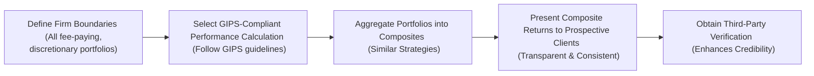

## 1.4 Introduction to the Global Investment Performance Standards (GIPS)

If you’ve ever tried to compare the performance of different fund managers, maybe you’ve had that nagging feeling: “Are these returns really measured in the same way?” I still remember when I was helping a friend evaluate two funds that both claimed “outstanding” results. Turns out, one fund showed gross-of-fees returns, while the other fund cleverly didn’t mention additional transaction costs. It was like comparing apples to...I don’t know...kale chips. Not exactly a fair match.

This is exactly where the Global Investment Performance Standards (GIPS) step in. GIPS are voluntary standards that aim to ensure performance reporting by investment managers is transparent, complete, and comparable across different firms and geographies. In other words, GIPS are the “rules of the game” so that investors can compare fund A, fund B, and fund Z with confidence. 

Below, we’ll break down how GIPS came to be, what they require, and how they can help both managers and investors feel a whole lot better about reading (or disclosing) those all-important performance reports.

### Background and Purpose 
The story behind GIPS goes back to the 1990s, when concerns were brewing about inconsistent and, sometimes, downright misleading performance reporting practices. You know how it is: some managers excluded losing portfolios from their track records. Others included “model” results based on hypothetical backtesting. And some managers omitted relevant fees. 

As a result, investment professionals, under the auspices of the CFA Institute, collaborated to create a globally recognized framework. GIPS is not a law; it’s a set of voluntary ethical principles and calculation/reporting guidelines for investment performance. But many institutional investors and consultants strongly prefer GIPS-compliant managers. It’s kind of like having a gold seal of approval in the industry. 

### Key Principles of GIPS
GIPS rest on a few essential pillars:

• Standardized Measurement and Disclosure.  
• Full Disclosure of Investment Results.  
• Fair Representation of Returns (no cherry-picking best portfolios).  
• Comprehensive Composite Construction (all fee-paying, discretionary portfolios fall under the relevant composite).

Following these pillars allows investors to make “apples-to-apples” comparisons — a practice that was definitely lacking back in the day.

### Firm Definition and Discretion
First, you’ve got to define the boundaries of the firm. This is really important, because if you’re looking at performance, you need to be crystal-clear about which portfolios are included under the firm’s umbrella. GIPS requires that any fee-paying, discretionary portfolio that the firm manages be included in at least one appropriate composite. 

“Discretion” basically means the firm has the freedom to make investment decisions within the constraints of a particular strategy. If a portfolio has so many client-driven restrictions that the manager can’t actually stick to a strategy, that portfolio may not be considered discretionary. But watch out — you can’t just label a portfolio “non-discretionary” to avoid including poor results in your composite.

### Composites: Grouping Portfolios that Share a Strategy
Composites are central to GIPS. Think of them as buckets of portfolios that share the same strategy, risk profile, or investment objective. For example, if a firm manages 50 large-cap equity portfolios using the same approach, it should group all of those portfolios in a single composite. Then it calculates an overall return for that composite, using standardized methods. Prospective clients can look at the composite’s track record to get a realistic sense of how that firm’s large-cap strategy performs in the real world.

#### Constructing Composites
• Identify Strategy: For instance, “Large-Cap Growth,” “Global Bonds,” or “Emerging Markets Equity.”  
• Allocate Portfolios: Place every fee-paying, discretionary account that follows that strategy into the composite.  
• Calculate Returns: Use consistent formulas so that performance computations are comparable over time.  
• Report Composite Performance: Present the composite as a single track record, including relevant measures like annualized returns, standard deviation, and more.

By ensuring that all relevant portfolios find a home in their respective composite, nobody can slip a few bad eggs under the rug.

### Performance Calculation and Presentation
GIPS also lays out guidelines on how to calculate returns. This might sound surprising, but there are different ways to measure performance: time-weighted returns, money-weighted returns, gross vs. net of fees, and so on. GIPS sets out specific rules to ensure performance is measured and presented consistently — typically preferring time-weighted returns that remove the impact of cash inflows/outflows from the performance calculation. 

Why does that matter? Well, a manager could get a huge deposit right before the market tanks, which might artificially drag down money-weighted returns. That may not accurately reflect the manager’s skill. By using standardized, time-weighted methods, GIPS tries to isolate the manager’s real investment prowess.

### Verification and Third-Party Assurance
One cool aspect of GIPS is the concept of third-party verification. Think of verification like a second set of eyes that isn’t affiliated with the manager. An independent verifier checks whether:

• The firm’s policies and procedures are designed in compliance with GIPS.  
• The firm has indeed followed those policies and procedures.  

If the firm passes muster, the verifier issues a report. This is optional, but it can greatly enhance credibility. If you’re a prospective client, it’s awfully comforting to see that a neutral third party has looked at the performance outputs and given them the thumbs-up.

### Benefits of GIPS Compliance
Why go through all this effort? Because GIPS compliance:

• Builds Trust: Investors can rely on your performance numbers if you’re following a globally recognized standard.  
• Demonstrates Ethics: Managers show they’re serious about transparency and ethical conduct.  
• Facilitates Comparisons: Investors can line up different GIPS-compliant firms and compare them on an equal footing.  
• Attracts Business: Many institutional investors require or strongly prefer GIPS compliance.  

Really, it’s a “win-win” for both the manager (who can market with a recognized seal of quality) and the investor (who can make more accurate assessments).

### Challenges, Pitfalls, and Lessons Learned
Of course, no standard is perfect. Firms need robust systems to gather data, track portfolio changes, calculate returns, and present the info in a GIPS-compliant format. Here are a few common headaches:

• Missing or Incomplete Records: GIPS states that you need to show at least five years of GIPS-compliant performance history (or since inception if shorter) and once you have a five-year compliant record, you add another year of performance each year until you get a minimum of 10 years. If your records are fuzzy or incomplete, that’s a problem.  
• Complex Fee Structures: If a manager charges performance fees or invests in alternative assets, calculating net-of-fees returns can be tricky.  
• Evolving Firm Definitions: Sometimes, organizations merge or restructure. Then it’s not always clear how to redefine the “firm” boundary for GIPS.  

I’ve known managers who didn’t realize just how detailed GIPS recordkeeping can be until they tried to claim compliance. Without good systems, the process can be a real challenge. But good preparation and consistent data management help ensure an easier verification path.

### A (Slightly) Real-World Scenario
Let’s imagine Aiden, a portfolio manager at “Stable Growth Capital,” wants to attract a large institutional investor. That investor’s consultant says, “Well, we only work with GIPS-compliant managers.” Aiden thinks, “Ah, we’re basically GIPS-compliant, right?” But then he digs into the details:

• He must define the boundaries of the firm: Maybe they have multiple divisions, so that takes some time.  
• He needs to gather data for all discretionary portfolios in that large-cap growth strategy. That means 10 different accounts across multiple platforms.  
• He must ensure the returns are calculated on a time-weighted basis, net of transaction costs, but gross of management fees for certain disclosures (or net, depending on the standard).  
• He hires a third-party verifier who runs through the records with a magnifying glass.  

It’s a lot of work. But if stable Growth Capital meets GIPS requirements and obtains verification, they can brand themselves as GIPS-compliant. That might open the door to bigger institutional accounts and a lot more credibility in the marketplace.

### Mermaid Diagram of GIPS Compliance Flow

### Glossary
• Global Investment Performance Standards (GIPS). A set of ethical principles and guidelines designed to ensure consistent, transparent investment performance calculations and reporting worldwide.  
• Composites. Groups of individual discretionary portfolios that share similar strategies or objectives.  
• Performance Presentation. The standardized way of showing returns (using consistent calculation methods) so that results are comparable across time and managers.  
• Firm Discretion. The portfolio manager’s ability to implement a strategy without significant client-imposed restrictions.  
• Verification. An independent review by a qualified third party that affirms a manager’s GIPS compliance.  
• Prospective Client. A potential investor or client who might rely on GIPS performance records when making investment decisions.

### Best Practices for GIPS Adoption
Below are some practical tips if you’re considering GIPS compliance or just want to understand it better:

• Document Everything: Keep clean records so you can trace each portfolio’s performance.  
• Introduce Strong Internal Controls: Regularly review policies and procedures related to performance measurement.  
• Align with Your Firm’s Goals: Ensure that the definition of the “firm” is consistent with how you want to present performance to clients.  
• Maintain Clear Communication: Let current and prospective clients know you’re GIPS-compliant and what that entails.  
• Stay Updated: GIPS standards evolve; the 2020 GIPS Standards introduced changes in areas like pooled funds and performance-based fees.  

### Links and Further Exploration
• CFA Institute Official Resource on GIPS:  
  https://www.cfainstitute.org/ethics-standards/gips-standards  
• “Global Investment Performance Standards (GIPS),” 2020, published by the CFA Institute.  
• “Managing Investment Portfolios: A Dynamic Process,” Maginn, Tuttle, Pinto, and McLeavey (2021).  
• “The Handbook of Investment Performance Measurement,” Spaulding, D., for in-depth coverage on performance calculation methods.

Seriously, once you’re aware of GIPS, you start noticing just how vital it is to have standardized, transparent performance reporting in our industry. It may not solve every performance reporting issue under the sun, but it’s a major step forward for investor confidence and ethical standards.

---

## Test Your Knowledge: Global Investment Performance Standards (GIPS)



### Which best describes the primary objective of GIPS?

- [ ] To maximize fund returns by optimizing portfolio models.
- [x] To ensure a transparent and consistent framework for performance reporting.
- [ ] To require firms to pay standardized fees across all portfolios.
- [ ] To eliminate market risk entirely.

> **Explanation:** GIPS is about promoting ethical, consistent performance calculations and presentations, not mandating specific returns or fee structures.

### Which of the following is a requirement under GIPS regarding composites?

- [ ] Only the manager’s best-performing portfolios should be included.
- [x] All fee-paying, discretionary portfolios with a shared strategy should be included.
- [ ] Only portfolios with more than one year of performance should be included.
- [ ] Portfolios with specific performance hurdles cannot be included.

> **Explanation:** GIPS requires that all fee-paying, discretionary portfolios that follow a similar investment strategy be placed in the same composite.

### What is a significant benefit of obtaining GIPS verification by a third-party?

- [x] It enhances the credibility of the firm’s claim of GIPS compliance.
- [ ] It replaces the need to provide clear disclosures.
- [ ] It guarantees future performance for prospective investors.
- [ ] It absolves the firm of ethical and professional responsibilities.

> **Explanation:** Verification adds extra assurance about the firm’s performance tracking and compliance but doesn’t replace required disclosures or guarantee returns.

### Why does GIPS emphasize time-weighted returns for many composites?

- [x] To remove the effects of cash flows so that the manager’s skill is more accurately assessed.
- [ ] To incorporate client-driven contributions or withdrawals into the performance calculation.
- [ ] To apply the simplest possible calculation method.
- [ ] To ensure that composite returns never exceed 10%.

> **Explanation:** Time-weighted returns focus on the manager’s investment performance by controlling for the timing and amount of cash inflows and outflows.

### A prospective client is:

- [x] Someone who may rely on the firm’s composites to make investment decisions.
- [ ] An existing client who has already invested with the firm.
- [x] An investor who could potentially engage a firm for asset management.
- [ ] A third-party reviewer for GIPS verification.

> **Explanation:** By definition, a prospective client is a potential or future client, and GIPS presentation is targeted at helping them make informed decisions.

### Which of the following is TRUE about firm discretion under GIPS?

- [x] The firm must exclude portfolios that have significant client-imposed restrictions altering the strategy.
- [ ] The firm may arbitrarily assign portfolios to composites without regard to client constraints.
- [ ] Discretion only applies to fixed-income portfolios and not equity portfolios.
- [ ] Firms need to include all client-imposed constraints in composite performance even if they distort strategy.

> **Explanation:** Portfolios that do not allow the manager to carry out the intended strategy meaningfully are considered non-discretionary and thus excluded from performance composites.

### What is one of the critical challenges firms face when attempting GIPS compliance?

- [x] Gathering consistent, long-term data across various accounts and strategies.
- [ ] Ensuring competition with other GIPS-compliant firms is outlawed.
- [x] Dealing with complex fee structures in performance calculations.
- [ ] Guaranteeing positive returns in every reporting period.

> **Explanation:** Data management and fee calculation complexities are some of the most common difficulties firms encounter when implementing GIPS.

### Which of the following is included in the concept of “verification” for GIPS?

- [x] Third-party reviewers assess the firm’s policies and procedures for GIPS compliance.
- [ ] A written guarantee of at least 5% annual returns.
- [ ] The government performs routine checks on all GIPS documents.
- [ ] Only passive funds are subject to auditing for compliance.

> **Explanation:** Verification is a voluntary process in which an external party ensures that the firm’s performance reporting complies with GIPS.

### When constructing a composite, what is the rationale behind grouping portfolios with similar investment objectives or strategies?

- [x] It allows prospective clients to compare relevant performance across similar portfolios.
- [ ] It prevents the firm from including any new portfolios within existing composites.
- [ ] It helps inflate performance by mixing high-risk and low-risk portfolios.
- [ ] It is only required for large-cap equity funds.

> **Explanation:** The grouping ensures a fair “apples-to-apples” comparison, reflecting the manager’s execution of a specific strategy.

### Under GIPS, the claim “XYZ Asset Management is GIPS-compliant” is considered:

- [x] True 
- [ ] False

> **Explanation:** Firms can claim GIPS compliance once they meet all requirements and adhere to the standards for all relevant portfolios, allowing them to state that they are GIPS-compliant.


