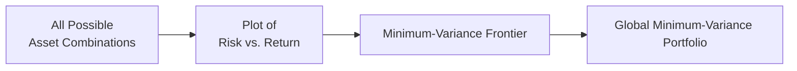
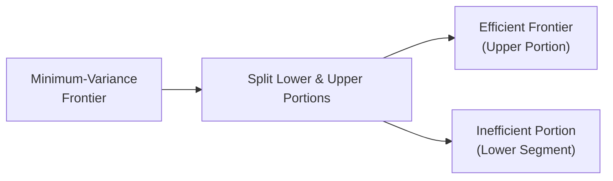

## 10.1 Portfolio Risk and Return: Part I

Have you ever tried to plan a vacation with friends who have very different tastes and budgets? You’re trying to pick a destination that fits everyone’s happiness level. One friend wants an all-inclusive resort on a tropical beach, while another wants a low-key camping trip in the mountains. Meanwhile, you might want a quick city escape. It’s a balancing act—and, oddly enough, that’s kind of how we manage portfolios in finance, too.

Below, we’ll explore how various asset classes behave, why investors care about risk and return, and how we can combine different assets to (hopefully) find that sweet spot—just like picking that best vacation destination for the whole group.

### Major Asset Classes and Characteristics

Let’s start with the major asset classes you’ll typically see in a portfolio:

• Equities (Stocks)  
• Fixed Income (Bonds)  
• Cash Equivalents (Money Market Instruments)  
• Alternative Investments (Private Equity, Hedge Funds, Commodities, etc.)  
• Real Estate

Each asset class has distinct traits in terms of risk and return. You’ll see references to volatility, liquidity, income generation, and so forth when analyzing these. Say, for instance, you own stock in a fast-growing tech startup. You might get big gains if the company grows rapidly but risk losing a chunk of your investment if that growth never materializes. Meanwhile, a government bond is usually more predictable (especially if it’s a highly rated one) but tends to offer a lower return. The trade-off is: more certainty, but less upside.

Below is a small table to summarize general characteristics of each class:

| Asset Class               | Common Return Components                    | Typical Risks                                           | Liquidity Level         |
| ------------------------- | ------------------------------------------ | ------------------------------------------------------- | ----------------------- |
| Equities (Stocks)         | Capital gains, dividends                   | High volatility, market risk, company-specific risk     | Moderate to High        |
| Fixed Income (Bonds)      | Interest income, potential capital gains   | Interest rate risk, default risk, inflation risk        | High for many, lower for some corporate bonds |
| Cash Equivalents          | Minimal interest or yield                  | Very low market risk, inflation risk (losing purchasing power) | Very High              |
| Alternative Investments   | Varied (capital gains, income, etc.)       | Illiquidity, high leverage, unique market and strategy risks | Very Low (often restricted) |
| Real Estate               | Rental income, capital appreciation        | Illiquidity, property-specific risk, interest rate risk | Low to Moderate         |

Over time, we’ve seen that different asset classes respond differently to economic cycles. For instance, equities might thrive in an economic boom but struggle in a downturn, whereas certain forms of alternative investments (like some hedge funds) may fare better when markets decline, depending on their strategy. Understanding these nuances is the heart of portfolio construction.

### Risk Aversion and Utility Theory

Now, let’s talk about how investors weigh these choices. Investors, as a rule, don’t like risk for risk’s sake. If you offered your buddy a guaranteed $50 or the chance to flip a coin for a 50% shot at $100 (and 50% at $0), they might pause and think, “Well, the coin flip has the same expected outcome on average, but it comes with risk!”

• Risk Aversion means preferring a more predictable outcome, even if the uncertain “expected payoff” is the same.  
• Utility Theory formalizes this idea by assigning a “utility” value to levels of wealth or outcomes.

For a risk-averse investor, the utility function is typically concave. Simply put: each additional bit of return feels less exciting the more you pile on the risk. My friend once told me, “I’d rather sleep well at night than chase that extra 1%.” That’s an example of risk aversion in action.

Mathematically, if U(W) is a utility function over wealth W, a concave shape means the investor jumps a lot for the first bit of gains but is less excited for further gains (especially if more risk is attached).

In portfolio management, we often combine investors’ utility functions with possible portfolio outcomes (returns, drawdowns, etc.) to find the “optimal” risk level they’re willing to take. The sweet spot is where your friend says, “I’m comfortable with this much volatility—and the potential returns still look good to me.”

### Mean, Variance, Covariance, and Correlation

Before diving into how multiple assets mix, let’s recall a few core definitions:

• Mean (Expected Return): The average return we think we’ll get from an investment. If your favorite stock has historically returned 8% per year, you might guess the future expected return is somewhere around that.

• Variance: A measure of how spread out returns are around the mean. If an investment’s returns swing wildly from one year to the next, it’ll have a large variance. A stable investment with returns that barely budge will have low variance.

• Covariance: How two assets move in relation to each other. A positive covariance means they tend to walk hand in hand (both go up or both go down at the same time). A negative covariance means they generally move in opposite directions—like a see-saw: when one goes up, the other goes down. 

• Correlation: This is basically the standardized version of covariance, ranging from –1.0 (perfectly inverse) to +1.0 (perfectly in sync). A correlation of zero means there’s absolutely no linear relationship between the two asset returns—like random teens who aren’t texting each other at all.  

If we imagine two assets:  
• Asset A: High growth, high volatility (like a biotech stock)  
• Asset B: Low growth, moderate volatility (like a stable utility company)  

Even if each has significant volatility, the degree to which they move together (their correlation) can dramatically affect overall portfolio risk when both are held simultaneously.

### Portfolio Standard Deviation

Now, how do we find the risk (standard deviation) of a portfolio combining two (or more) assets? 

For a two-asset portfolio, the variance (square of the standard deviation) is:

$$
\sigma_p^2 = w_1^2 \sigma_1^2 + w_2^2 \sigma_2^2 + 2 w_1 w_2 \,\text{Cov}(r_1, r_2)
$$

• \\( \sigma_p^2 \\) is the portfolio variance.  
• \\( w_1 \\) and \\( w_2 \\) are the portfolio weights in each asset (they sum to 1).  
• \\( \sigma_1^2 \\) and \\( \sigma_2^2 \\) are the variances of Asset 1 and Asset 2, respectively.  
• \\( \text{Cov}(r_1, r_2) \\) is the covariance between the returns of the two assets.

If I reduce the correlation between the two assets, the whole term \\( 2 w_1 w_2 \,\text{Cov}(r_1, r_2) \\) might shrink, and that can reduce overall portfolio variance. This is the magic of diversification: choosing assets that don’t move in lockstep to reduce total risk.

### Minimum-Variance Frontier

Let’s say we have a big “universe” of assets. If you combine them in all possible ways and then plot each combination’s expected return against its variance, you get something referred to as the “minimum-variance frontier.”

• These portfolios on the frontier are the combinations that yield the lowest variance for each level of expected return.  
• The leftmost point on this frontier is the global minimum-variance portfolio (GMVP). That’s literally the most defensive portfolio you can build with that set of assets (in terms of having the least volatility).

Here’s a simple Mermaid diagram to illustrate how a set of portfolio combinations might look on a risk-return plot:

Think of it as a curving line in a two-dimensional space (return on the vertical axis, risk on the horizontal). The GMVP is the leftmost point on that curve—meaning you can’t get any lower risk from that set of assets.

### Efficient Frontier

But wait, we’re not done. We can actually split that curve into two segments. The “lower” portion might not be so desirable because you could get more return for the same level of risk if you pick a portfolio on the “upper” portion of that line. The top half of the curve is called the efficient frontier.

Why is it “efficient”? Because these portfolios dominate the lower ones (they’re basically better risk–return bargains). In theory, rational investors should only choose portfolios on that upper portion—everything else is just suboptimal, or as we often say, it’s “inefficient.” You wouldn’t choose a trip that costs more and is less fun, right?

If we drew this in a separate diagram, you might see:

The principle is straightforward: among all the possible ways to blend your asset classes, you want the maximum return for a given risk (or the smallest risk for a given return). 

In practice, once you include constraints (like “I can’t invest in certain industries” or “I want at least 10% in bonds”), the shape of that efficient frontier can shift. But the idea remains the same. 

### Practical Example

Let’s do a quick hypothetical scenario:  
• Asset X has an expected return of 10% and a standard deviation of 20%.  
• Asset Y has an expected return of 6% and a standard deviation of 10%.  
• The correlation between X and Y is, say, 0.2.  

We can mix these assets in different weights to see how the portfolio’s expected return changes and how the portfolio’s standard deviation changes. Perhaps a 50–50 mix yields an expected return of 8% with a standard deviation of, I don’t know, 12.5%. That might be appealing for someone who doesn’t want to go all-in on a single asset. If correlation were negative, the overall standard deviation (risk) would drop even further, highlighting the power of diversification.

### Why Diversification Matters

It’s worth emphasizing: diversification doesn’t guarantee a profit or an absence of losses. But the principle behind it—combining assets that don’t perfectly move together—provides a cushion. Imagine you lose your job and your spouse also loses theirs at the exact same time—scary, right? That’s like having two stocks that tank at once, with a correlation near +1. Meanwhile, if your spouse is in a completely different field that’s thriving when your field is struggling, your household finances remain more stable overall. That’s exactly how adding diversified assets can help keep your portfolio afloat when a particular sector or style goes through a rough patch.

### Glossary

Asset Class: A group of securities with similar risk and return traits (e.g., equities, bonds).  
Covariance: A measure of how two assets move together (positive or negative).  
Correlation: A standardized measure of that co-movement (–1.0 to +1.0).  
Mean (Expected Return): The average or central tendency of your returns.  
Variance: The spread or dispersion of returns around the mean.  
Minimum-Variance Frontier: A plot of the portfolios that offer the lowest variance for every possible level of return.  
Global Minimum-Variance Portfolio (GMVP): The absolute leftmost portfolio on that frontier, with the lowest possible variance among all combinations.  
Efficient Frontier: The “upper” portion of the minimum-variance frontier where returns are maximized for each level of risk.

### References and Further Reading

• Bodie, Z., Kane, A., & Marcus, A. J. (2014). “Investments.” 10th ed. McGraw-Hill.  
• CFA Institute Official Curriculum, Level I, Study Session on Portfolio Management.  
• Sharpe, W. F. (1964). “Capital Asset Prices: A Theory of Market Equilibrium Under Conditions of Risk.” The Journal of Finance.  
• Elton, E. J., & Gruber, M. J. (1995). “Modern Portfolio Theory and Investment Analysis.” Wiley.  

Anyway, that’s the big picture on portfolio risk and return—at least in Part I. We looked at the different types of assets, how risk-averse folks seek to balance risk and reward, and how combining assets can lower overall volatility if their returns aren’t perfectly correlated. This approach underpins modern portfolio theory and is the gateway to all sorts of advanced concepts in finance—like the Capital Asset Pricing Model (CAPM), factor models, and more. In our next segment, we’ll delve even deeper.

## Test Your Knowledge: Portfolio Risk and Return Essentials



### Which statement best describes the risk–return characteristics of equities compared to cash equivalents?

- [ ] Equities generally offer lower returns than cash but also lower risk. 
- [ ] Equities and cash equivalents have the same level of risk in most scenarios.
- [ ] Equities generally offer the same level of risk as cash but higher returns. 
- [x] Equities generally offer higher returns than cash over the long term but also carry higher volatility.

> **Explanation:** Historically, equities have provided higher average returns but with significantly higher volatility than cash equivalents.

### If two assets have a correlation coefficient of –1.0, what does this imply?

- [ ] They move perfectly together.
- [x] They move perfectly in opposite directions.
- [ ] They have no linear relationship.
- [ ] They have partial co-movement.

> **Explanation:** A correlation coefficient of –1.0 means the two assets move inversely in a perfectly linear fashion. When one goes up, the other goes down in the same proportion.

### In the context of the minimum-variance frontier, which portfolio has the smallest possible variance?

- [ ] The first point on the efficient frontier.
- [ ] Any portfolio on the inefficient portion.
- [ ] A 50–50 mix of risk-free asset and a risky asset.
- [x] The global minimum-variance portfolio (GMVP).

> **Explanation:** The GMVP is the portfolio with the absolute lowest variance along the entire set of possible combinations.

### When investors are risk-averse, how does a concave utility function affect their choice of job offers with varying salaries and uncertainty?

- [ ] They are indifferent to all options with the same expected salary.
- [x] They will choose the option that minimizes risk for a given expected salary.
- [ ] They will always choose the highest salary, regardless of risk.
- [ ] They will ignore expected salary and pick the lowest risk only.

> **Explanation:** A risk-averse (concave utility) investor or individual typically prefers a stable payoff over a risky one with the same expected value.

### Which of the following statements is true about covariance and correlation?

- [x] Correlation is a standardized version of covariance.
- [x] Covariance can be positive, negative, or zero.
- [ ] Correlation always equals one for any two assets.
- [ ] They are never helpful in portfolio construction.

> **Explanation:** Correlation is derived from covariance, standardized by the product of the standard deviations of the two variables. Both measures are essential in understanding how assets interact in a portfolio.

### What happens to total portfolio variance when the correlation between two assets is negative?

- [x] The portfolio variance can decrease significantly.
- [ ] It has no effect on the portfolio variance.
- [ ] The portfolio variance increases significantly.
- [ ] The standard deviation remains unchanged but the expected return grows.

> **Explanation:** Negative correlation can help reduce overall variance because when one asset’s return goes up, the other tends to go down, stabilizing the portfolio’s total return.

### Which of the following best defines the efficient frontier?

- [x] The set of portfolios that maximize return for each level of risk on the minimum-variance frontier.
- [ ] A line graph connecting all portfolios with above-average returns.
- [x] The “upper” portion of the minimum-variance frontier.
- [ ] A measure of correlation between assets.

> **Explanation:** The efficient frontier is that upper segment of the minimum-variance frontier giving the highest expected return at each risk level.

### Which of these asset classes is typically characterized by the highest liquidity?

- [ ] Real estate
- [ ] Hedge funds
- [x] Cash equivalents
- [ ] Private equity

> **Explanation:** Cash equivalents are generally the most liquid type of investment, often redeemable on very short notice.

### Which statement is a key idea of risk aversion?

- [ ] Investors always prefer more risk, as it increases returns.
- [ ] Utility functions are convex for risk-averse individuals.
- [x] For a risk-averse investor, each additional unit of risk is less appealing.
- [ ] A risk-averse investor maximizes variance.

> **Explanation:** Risk-averse investors have concave utility functions, implying each increment of risk yields smaller marginal utility from returns.

### True or False: A portfolio made up of highly correlated assets may offer more diversification benefits than a portfolio of uncorrelated assets.

- [ ] True
- [x] False

> **Explanation:** Highly correlated assets move similarly, providing fewer diversification benefits. Lower correlation (especially negative) is what drives diversification’s risk-reducing effect.




