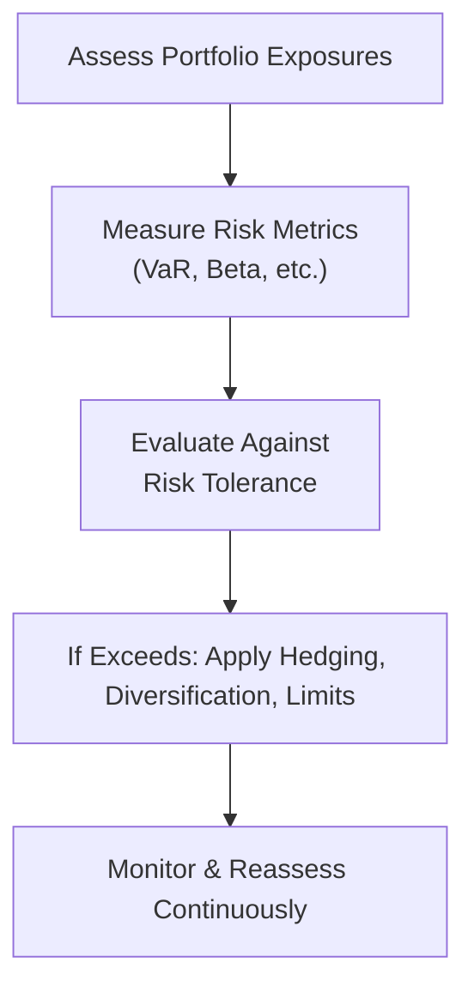

## 10.6 Introduction to Risk Management

Risk management is, at its heart, about ensuring that potential downsides don’t derail your goals. It’s sort of like wearing elbow pads when you’re learning to skateboard—you try to keep yourself safe without stopping yourself from having any fun. In investing, this can translate to setting strict guidelines around what losses you can handle, how much of your portfolio can be exposed to certain risks, and what you’ll do if the unexpected suddenly happens.

I still remember one of my first stints in finance, years ago. One of my mentors admitted he once overlooked an operational risk—he was so focused on market risk that he didn’t spot serious flaws in the internal controls for trade confirmations. That ended up causing a messy reconciliation fiasco. Thankfully, it wasn’t catastrophic, but it could have been avoided with a good risk management framework. 

This chapter will walk you through the fundamentals of risk management. We’ll discuss frameworks, governance, budgeting, sources of risk, measurements, and how to mitigate or alter risk exposures. By the end, you should see risk as something to be navigated rather than something to be avoided at all costs.

### Defining Risk Management

Risk management is the process of identifying, measuring, and deciding how to handle various types of risk in a financial or organizational context. It’s not just a “set it and forget it” approach. Rather, you tweak and refine your risk management strategies as market conditions shift or your organizational objectives change.

• Identify the risks: Ask yourself, “What could go wrong here? What’s that worst-case scenario?”  
• Measure the risks: Use quantification tools such as Value at Risk (VaR), stress testing, or standard deviation to get an estimate of potential losses.  
• Decide on an approach: Decide whether to accept the risk, mitigate it, transfer it (insurance or hedging), or even avoid it altogether.  
• Monitor continuously: Keep an eye on how the risks evolve—in finance, things can change in an instant.

### Features of a Risk Management Framework

A robust risk management framework is like a good playbook for a sports team: it ensures you know your roles, your strategies, and how you’ll respond if things suddenly go sideways. A framework typically includes the following features:

• Risk Identification:  
  – Identify every possible risk that matters. This includes financial risk (like market and credit risk) and non-financial risk (like regulatory and reputational risks).  
  – This step can be as simple as brainstorming or as sophisticated as building a risk register that methodically lists and classifies risks.

• Risk Measurement:  
  – Once you figure out the “what,” you have to pin down the “how bad” or “how big.”  
  – Tools like VaR, scenario analysis, and stress testing help us measure how losses might stack up in various situations.  

• Risk Mitigation or Management Tools:  
  – Think of diversifying your investments, using derivatives for hedging, setting exposure limits, or even buying insurance.  
  – For instance, if you fear interest rates might skyrocket, you could hedge with interest rate swaps or futures.  

• Monitoring and Reporting:  
  – Because risk is dynamic, you keep tabs on your exposures over time.  
  – Timely and clear reporting ensures that stakeholders (like upper management or board members) stay informed.

Below is a simple flowchart that represents a typical risk management process:

### Risk Governance and Effective Risk Governance Elements

Risk governance is all about who’s in charge and how decisions get made. It’s like the guardrails an organization puts up to make sure risk is managed consistently from the top all the way down. Good risk governance involves:

• A structured approach: The board of directors or senior management defines the risk appetite and sets a clear tone about acceptable risk-taking.  
• Accountability: Business lines and individuals know their responsibilities and the limits of risk they can take on.  
• Transparent risk reporting: Comprehensive disclosure of risk exposures and any changes in risk profile keeps everyone in the loop.

When governance is weak, organizations can be blindsided by big losses—nobody wants to be that firm in the headlines!  

### Risk Tolerance and Its Effects on Risk Management

Risk tolerance refers to the maximum amount of uncertainty or potential loss an investor or entity is willing (and able) to bear while trying to achieve their objectives. Some investors—large pension funds, for example—can absorb more volatility because their time horizons stretch far into the future. Others—like retirees living off their nest egg—might prefer a more stable investment approach.

Factors influencing risk tolerance include:  
• Financial capacity: How much can you lose before you can no longer meet obligations or operate effectively?  
• Regulatory requirements: Banks often must maintain capital ratios, limiting the kinds of risks they can assume.  
• Time horizon: The longer your horizon, the more likely you can ride out volatility.  
• Stakeholder expectations: Investors or customers might have a low appetite for risk, especially in uncertain times.

If an organization’s risk tolerance is set too high, it might be in for painful drawdowns. Too low, and it may miss good opportunities or hamper its competitive advantage. 

### Risk Budgeting

Risk budgeting is a systematic way to “spend” your risk tolerance. Let’s imagine you have a big jar of “risk tokens” that you can allocate across different business units or investment strategies. Do you give more risk budget to your emerging markets team because they can generate higher returns, or do you spread it evenly?

• Helps ensure the total risk you take on doesn’t exceed your overall tolerance.  
• Allocates risk based on potential returns, strategic importance, or specialized expertise.  
• Encourages business units or portfolio managers to think more carefully about where they’re deploying their risk capital.

### Financial and Non-Financial Sources of Risk

Risk doesn’t come in a neat little package. It can pop up in any part of your operations.

• Financial Risks:  
  – Market risk: The risk of adverse price movements in equities, interest rates, currencies, or commodities.  
  – Credit risk: The chance that a counterparty (like a bond issuer or a borrower) defaults.  
  – Liquidity risk: The difficulty of quickly converting assets into cash without major price concessions.

• Non-Financial Risks:  
  – Operational risk: Internal process breakdowns, human errors, or technological failures.  
  – Reputational risk: Potential harm to a firm’s image or brand—the stuff nightmares are made of for some companies.  
  – Regulatory/compliance risk: Fines or penalties you could face if you fail to comply with rules.  
  – Legal risk: Lawsuits or contractual disputes that can lead to financial and reputational setbacks.  
  – Model risk: Relying on flawed or outdated models for forecasting or valuation.  
  – External disruptions: Natural disasters, political crises, or pandemics—basically things you can’t control that might hit you by surprise.

### Measuring and Modifying Risk Exposures

Measuring risk can be as simple as keeping an eye on volatility or as advanced as building intricate mathematical models. Here are some common techniques:

• Volatility (standard deviation): A measure of how much an asset’s returns fluctuate over time.  
• Duration: Used primarily in fixed-income to measure sensitivity to interest rate changes.  
• Beta: A measure of an asset’s sensitivity relative to the overall market.  
• Value at Risk (VaR): Estimates the potential maximum loss over a given time period at a certain confidence level.  
• Stress testing and scenario analysis: Look at portfolio outcomes under extreme or hypothetical conditions (e.g., a 2008-style financial crisis or a sudden spike in oil prices).

Modifying risk exposures often involves:  
• Diversification: Spreading bets across asset classes, regions, or investment styles.  
• Hedging with derivatives: Using futures, forwards, options, or swaps to offset potential losses in another position.  
• Position limits: Restricting maximum exposure to a particular asset or sector.  
• Insurance: Transferring risk to a third party (insurer) in exchange for a premium.

Below is a simplified diagram that shows how one can measure and manage risk in a portfolio context:

### Factors in Choosing Among Risk Management Methods

So, how do you pick from this toolbox of hedging, diversifying, or transferring risk options? It often boils down to:

• Efficiency: Does the method effectively neutralize the risk without introducing new unintended risks?  
• Cost: Derivatives can be expensive if implied volatility spikes, while insurance premiums can eat into profits.  
• Complexity: Some hedging methods (like exotic options structures) can be tough to understand or implement.  
• Regulatory or compliance constraints: In some jurisdictions, you might have capital requirements or have specific restrictions on derivatives usage.  
• Strategic alignment: Make sure your risk management approach is consistent with your broader business or investment strategy.  

### Glossary

• Risk Management Framework: The overarching process, policies, and organizational structure for identifying, measuring, controlling, and reporting risk.  
• Risk Tolerance: The degree of variability in investment returns (or potential losses) that an investor or firm is willing to withstand.  
• Risk Budgeting: The practice of allocating allowable levels of risk to different parts of a firm or portfolio.  
• Market Risk: The possibility of losses due to changes in market prices (equities, bonds, currencies, commodities).  
• Operational Risk: Potential losses from failed internal processes, people, or systems, or from external events.  
• Reputational Risk: The threat of harm to an organization’s standing or brand in the eyes of stakeholders.  
• Value at Risk (VaR): A metric that estimates the potential loss at a certain confidence level over a specific time horizon.

### References and Further Reading

• Jorion, P. (2007). “Value at Risk: The New Benchmark for Managing Financial Risk.” 3rd ed. McGraw-Hill.  
• Stulz, R. M. (2003). “Risk Management and Derivatives.” Southwestern College Publishing.  
• CFA Institute Official Curriculum, Level I, “Introduction to Risk Management.”  
• Hull, J. (2018). “Risk Management and Financial Institutions.” Wiley.  

Feel free to dive into these resources if you’d like to learn more. Risk management might not be glamorous, but it’s what helps keep your financial ambitions on track—even when the market tosses you a curveball!

--------------------------------------------------------------------------------

## Test Your Knowledge: Introduction to Risk Management Quiz



### Which of the following is NOT typically considered a component of a risk management framework?

- [ ] Risk Identification  
- [x] Profit Maximization  
- [ ] Risk Measurement  
- [ ] Monitoring and Reporting  

> **Explanation:** A risk management framework focuses on risk identification, measurement, and monitoring. Maximizing profit is an organizational goal, but it's not a core component of the risk management process itself.

### Which statement best characterizes the primary purpose of stress testing?

- [ ] To guarantee no losses will happen  
- [x] To evaluate potential portfolio outcomes under extreme or hypothetical conditions  
- [ ] To eliminate all operational risk  
- [ ] To validate regression models used for equity forecasting  

> **Explanation:** Stress testing is designed to test how a portfolio or firm would fare under very challenging or hypothetical market conditions.

### What is the key difference between financial and non-financial risks?

- [x] Financial risks relate to balance sheet exposures; non-financial risks concern operations, reputation, and external events  
- [ ] Financial risks are easy to manage; non-financial risks are impossible to manage  
- [ ] Financial risks always have a quantifiable cost; non-financial risks do not  
- [ ] Non-financial risks are more important to regulators than financial risks  

> **Explanation:** Financial risks typically arise from market, credit, or liquidity factors, while non-financial risks stem from internal processes, reputational concerns, or external disruption.

### A company’s risk tolerance is most significantly influenced by which of the following factors?

- [ ] Their shareholders’ short-term trading habits  
- [x] Their financial capacity, regulatory environment, and strategic objectives  
- [ ] The personal risk preferences of the CFO  
- [ ] Whether they are listed on a major stock exchange  

> **Explanation:** Risk tolerance depends on factors like financial capacity, regulatory constraints (e.g., required capital ratios), and the firm’s strategic or investment goals.

### What does Value at Risk (VaR) measure?

- [ ] The average annual return on an investment  
- [x] The maximum potential loss over a given time period at a specified confidence level  
- [ ] The probability of operational failure  
- [x] The level of forecast accuracy for macroeconomic indicators  

> **Explanation:** VaR calculates how much one might lose over a period, with a certain confidence level (like 95% or 99%).

### Which of the following strategies would typically be used to modify (reduce) market risk?

- [x] Hedging equity holdings using index futures  
- [ ] Issuing more debt during high-volatility markets  
- [ ] Increasing allocation to a single, volatile asset  
- [ ] Eliminating the internal audit department  

> **Explanation:** Hedging with derivatives, such as futures contracts, is a common way to reduce exposure to market movements.

### What is a key benefit of diversification in a risk management context?

- [ ] It guarantees a profit in any market environment  
- [x] It can reduce the portfolio’s overall volatility  
- [ ] It allows for limitless risk-taking  
- [x] It forces investors to use derivatives  

> **Explanation:** Diversification spreads losses across different assets, often reducing the overall portfolio volatility.

### In the context of risk governance, what is the role of the board of directors?

- [x] Setting the appropriate risk appetite and overseeing risk policies  
- [ ] Executing daily trading activities to manage the portfolio  
- [ ] Auditing operational processes every quarter  
- [ ] Designing advanced quantitative models  

> **Explanation:** The board of directors typically establishes the governance structures, sets risk tolerance, and ensures that risk management activities align with the firm’s objectives.

### Which metric is most often used to assess interest rate risk in a bond portfolio?

- [x] Duration  
- [ ] Beta  
- [ ] Sharpe ratio  
- [ ] Treynor ratio  

> **Explanation:** Duration measures a bond’s sensitivity to changes in interest rates.

### The practice of allocating a preset amount of acceptable risk to individual business units or portfolio managers is known as:

- [x] Risk budgeting  
- [ ] Capital structure analysis  
- [ ] Mean–variance optimization  
- [ ] Position limit management  

> **Explanation:** Risk budgeting is about distributing a “risk capacity” among different groups or strategies to ensure conformance with overall risk tolerance.


