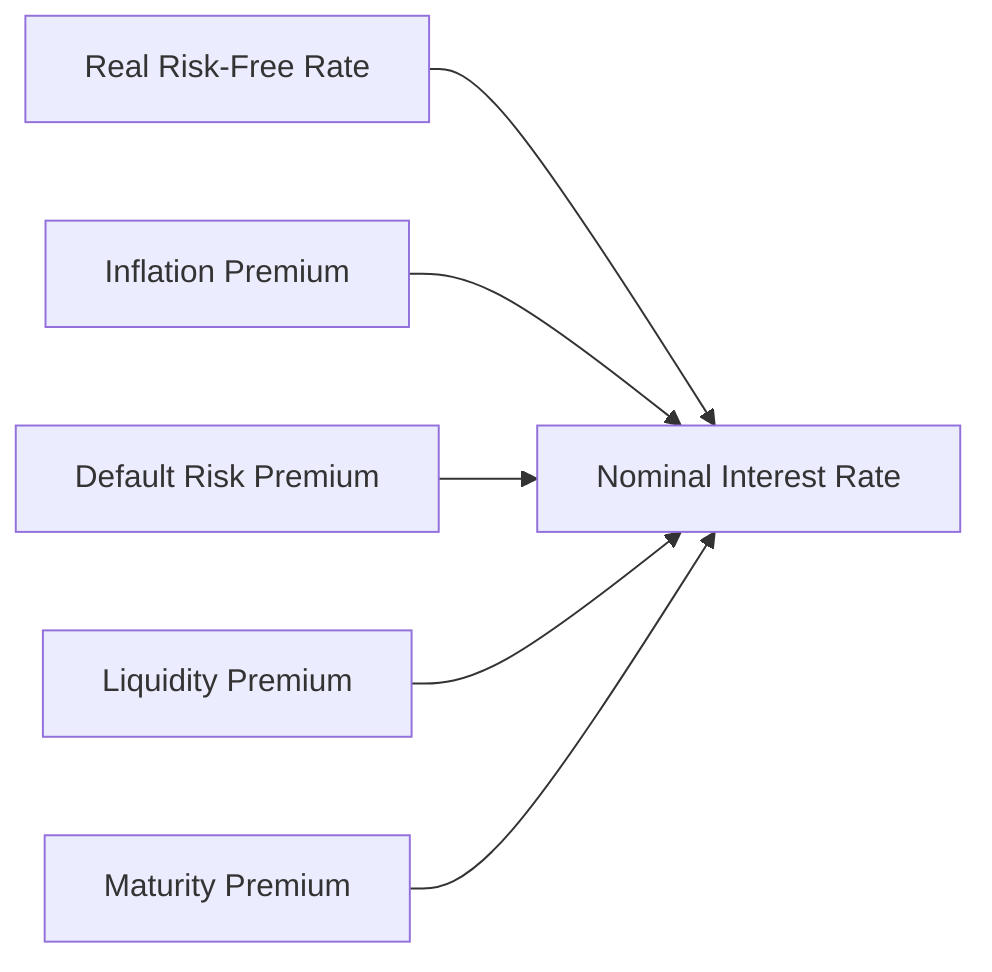

## 2.1 Rates and Returns

Imagine it’s your very first day on the job at a large investment firm—you're tasked with analyzing potential returns for different projects, and your manager leans in and says, “So, what’s the interest rate on that?” And you’re thinking, “Oh gosh, interest rates—aren’t those just the percentages the bank quotes me for a mortgage?” You’re not entirely wrong, but interest rates in the world of finance can be so much more. They can shape how we discount future cash flows, act as a measure of opportunity cost, reflect inflation, capture default risk, and impact decisions far beyond just borrowing money. That one little percentage figure can represent multiple layers of risk and reward. Let’s explore all that fun stuff in detail.

We’ll step through key interest rate concepts, break them into pieces, and see how they connect to the returns you actually earn when you invest. We’ll also highlight why measuring returns accurately is critical, especially if you want to evaluate portfolio performance (or your new manager’s performance, for that matter).

---

### The Many Faces of an Interest Rate

Let’s start with a broad definition: an interest rate is the cost of borrowing money or the reward for lending money, expressed as a percentage per time period—usually per year. But in finance, we often view an interest rate in at least three ways:

1. A Required Rate of Return (RRR):  
   • This is essentially the minimum annual percentage return that convinces you to invest in something rather than stash your cash under your mattress.  
   • For instance, if you buy corporate bonds, your minimum requirement might be something like 5% to compensate you for taking on credit risk.

2. A Discount Rate for Future Cash Flows:  
   • If you value a stock, you estimate its future dividends or cash flows and then discount them using a rate that reflects the time value of money plus the risk of those cash flows.  
   • The higher the discount rate, the lower the present value of the future stream of payments.

3. An Opportunity Cost of Capital:  
   • If you invest in Project A, you can’t invest that same money in Project B. So the rate you use effectively weighs the opportunity you forgo.  
   • In other words, what might you have earned if you used your cash in another “comparable-risk” venture?

Kinda wild how so much can be packed into one ordinary-looking “rate,” right? Let’s disentangle these forces a bit more.

---

### Nominal Interest Rates and Their Decomposition

If you ever hear someone say “the interest rate is 8%,” that might be the nominal interest rate. Let’s see what that means. Nominal interest rates are made up of a real risk-free rate plus a bunch of premiums that account for various risks:

1. **Real Risk-Free Rate**  
   • This is the theoretical rate of return on an investment with zero risk in a world with no inflation.  
   • Basically, it’s the reward for deferring consumption. If you skip buying that fancy new gadget today, you demand a little extra tomorrow to make it worth your wait.

2. **Inflation Premium**  
   • Inflation erodes your future purchasing power. If you expect prices to go up 3% over the year, you need at least 3% more return, just to stand still in terms of real buying power.  

3. **Default Risk Premium**  
   • If you’re lending to a company or government that might default, you need compensation for that possibility. The riskier the borrower, the higher the premium.

4. **Liquidity Premium**  
   • Securities that are harder to trade (like that obscure corporate bond from a little-known firm) usually offer a bit of extra yield, because you may not be able to sell quickly if you need cash.

5. **Maturity Premium**  
   • Longer-term bonds often have higher yields to compensate you for the greater uncertainty over a long horizon, like changes in interest rates or inflation over 30 years vs. just 3 months.

In formula terms, you might see something like:


\text{Nominal Rate} = r_\text{real risk-free} + \text{Inflation Premium} + \text{Default Risk Premium} + \text{Liquidity Premium} + \text{Maturity Premium}


You can think of it as an onion with layers upon layers. You start out with the real risk-free rate at the core, and then each risk factor adds its own ring.

---

### Visualizing the Decomposition (Mermaid Diagram)

Let’s do a quick diagram to show these layers:

We put all these components together, and voilà—you get one single nominal interest rate. But it’s helpful to remember each piece whenever you see “10% interest” thrown around somewhere.

---

### Return Measures: An Overview

Now, let’s pivot to the notion of returns, because ultimately, that’s what you care about when you invest. Different types of returns can be used to quantify how well (or poorly) you’ve done:

• **Holding Period Return (HPR)**  
• **Effective Annual Yield (EAY)**  
• **Money-Weighted Rate of Return (MWRR)**  
• **Time-Weighted Rate of Return (TWRR)**  
• **Continuously Compounded Return**  

You might be thinking, “Hey, a return is a return, so why the fuss with all these acronyms?” The short answer is that each measure paints a slightly different picture of performance, factoring in issues like compounding frequency, external cash flows, or continuous growth.

---

### Holding Period Return (HPR)

The Holding Period Return is one of the simplest ways to measure your return for a given period—be it a day, a month, or a year.


\text{HPR} = \frac{\text{(Ending Value - Beginning Value) + Distributions}}{\text{Beginning Value}}


If you purchase a stock for \$100, it goes up to \$110 in three months, and you also receive \$2 in dividends, then:


\text{HPR} = \frac{(110 - 100) + 2}{100} = \frac{12}{100} = 12\%


You can annualize that if you want, but watch out—annualizing a short-term return can sometimes create illusions if that short period was unusual.

---

#### Single- vs. Multi-Period HPR

• **Single-Period HPR**: Measures return for one uninterrupted period.  
• **Multi-Period HPR**: You can chain multiple single-period returns together to get a total growth factor over multiple periods. For instance, if in Period 1 you earn 10%, and in Period 2 you earn 5%, your overall growth factor is (1 + 0.10) × (1 + 0.05) = 1.15, or a 15% total gain over the two periods.  

A quick caution: if you keep adding money or withdrawing money between these periods, the single/multi-period HPR approach might get complicated. That’s where money-weighted returns and time-weighted returns ride in to save the day.

---

### Effective Annual Yield (EAY)

Effective Annual Yield (EAY) answers the question: “How much do I actually earn in one year if interest is compounded multiple times?” So if you have an investment that states a nominal rate of 10% but is compounded semiannually, you might actually be earning slightly more than 10% over a year’s time.


\text{EAY} = \left( 1 + \frac{\text{r}_{\text{nominal}}}{m} \right)^{m} - 1


where \\( m \\) is the number of compounding periods per year. EAY is super handy when you want to compare two investments with different compounding frequencies.

---

### Money-Weighted Rate of Return (MWRR)

Now we get into the more advanced territory of performance evaluation. The Money-Weighted Rate of Return is basically the Internal Rate of Return (IRR) for an investment. It incorporates the timing and magnitude of all the cash inflows (like contributions) and outflows (like withdrawals or dividends).

In plain English:
• The MWRR is the discount rate that sets the present value of your cash inflows equal to the present value of your cash outflows (plus the final value of the investment).  
• If you’re the type of investor who adds money throughout the year when you feel bullish and withdraws money occasionally for daily living expenses, the MWRR accounts for all those moves.

Let’s say you invest \$1,000 at the beginning of the year, and after six months you add \$500 more. At year-end, the total value is \$1,700. If your MWRR comes out to 12%, that means 12% is the discount rate that equates the present value of all cash flows with the final value. If you had bad timing—adding a bunch of money right before a market dip—your MWRR would be arguably lower than it would have been if you had perfect timing.

One caveat: MWRR might punish (or reward) managers for the investor’s own cash-flow choices, even if the manager had no control over the timing of deposits or withdrawals.

---

### Time-Weighted Rate of Return (TWRR)

Ever wonder how portfolio managers brag about returns without the pesky effect of big investor deposits or redemptions? Queue the TWRR. The Time-Weighted Rate of Return measures the compound growth of one unit of money invested over a stated measurement period—ignoring external cash flows.

Here’s how you compute TWRR in a simplified manner:
1. Break your total investment timeline into sub-periods, each time a cash flow occurs that’s external to performance (like a deposit or withdrawal).
2. Calculate the HPR for each sub-period.
3. Compound them together to get the overall growth rate.


\text{TWRR} = \sqrt[n]{ \prod_{i=1}^{n} (1 + \text{HPR}_i) } - 1


where \\( n \\) is the number of sub-periods. For example, if your returns across three sub-periods were 5%, -3%, and 10%, then the TWRR is:


(1.05) \times (0.97) \times (1.10) = 1.11615 \quad \Longrightarrow \quad 11.615\% \text{ total multiplier}


If these are three equally spaced sub-periods over one year, the TWRR is 11.615% - 1 = 10.48%. (We might refine further if these sub-periods differ in length.)

Because TWRR effectively removes the effect of the timing of capital flows, it’s a common standard in the investment industry to gauge a manager’s skill.

---

### TWRR vs. MWRR: When to Use Which?

• **Use TWRR**:
  - When you want to measure the manager’s performance independent of external investor contributions or withdrawals.  
  - If the investment manager has no control over the timing or size of cash flows in or out.

• **Use MWRR**:
  - When you want to measure your personal performance, factoring in how well you “timed” your contributions and withdrawals.  
  - If measuring the actual experience an investor had with real money inflows/outflows is your main focus.

Trust me, picking the right measure is crucial. I remember a friend who started bragging about a 15% “annual return,” but after factoring the timing of all the money he added after a big rally, that rate quickly dropped under 8%. Ow.

---

### Continuously Compounded Returns

Sometimes called log returns or “the natural log of price relatives,” continuously compounded returns are used often in more advanced financial modeling—like if you’re analyzing short-term trades or looking at the distribution of returns for volatile assets. Mathematically:


r_{\text{cc}} = \ln\left(\frac{P_1}{P_0}\right)


Why directly take the natural log of the price ratio? One big reason: once you go into the continuous compounding realm, returns across sub-periods become nicely additive. Also, in certain theoretical models (like the Black–Scholes option model), log returns are easier to handle. If you love statistics, normal distributions of log prices can factor in here, making modeling more manageable.

Let’s do a tiny example: you buy a stock at \$100, and it goes up to \$105 by next month.


r_{\text{cc}} = \ln\left(\frac{105}{100}\right) \approx \ln(1.05) \approx 0.04879 \approx 4.879\%


If you want the “simple” return, it’s 5%. Notice how the continuously compounded return is a bit lower than the simple return. For small changes, they’re close. For large changes, the difference grows.

---

### Putting It All Together for Portfolio Performance

If you’re a portfolio manager or an analyst, you’re constantly juggling a variety of return measures to paint the most accurate picture. Here’s a quick summary:

• **HPR** is nice for quick snapshots of performance over a single period or multiple periods (if you chain them).  
• **MWRR (IRR)** is all about the actual experience the investor has realized, reflecting personal cash flow decisions.  
• **TWRR** is perfect for performance reporting if you want to isolate the manager’s skill.  
• **Continuously Compounded Returns** are used extensively in theoretical models, quantitative finance, and short-term trading analysis—particularly for lognormal-based modeling.

Be aware that misapplication of these measures is not just a dry classroom scenario; it happens in the real world. For example, you might congratulate a fund manager for a high TWRR, but if most investors put cash in at the worst possible times, the money-weighted returns they experience might look drastically different. Or if you’re analyzing extremely volatile assets (like certain crypto tokens), using simple returns might produce weird results. A log return approach could be more stable for modeling.

---

### A Quick Personal Anecdote

I learned about TWRR vs. MWRR the hard way when I managed my parents’ retirement account. They contributed funds near the market peak—unfortunately—then withdrew some money during a downturn to finance a home renovation. When I provided them with a naive “overall return” figure, it looked okay. But if we used a money-weighted approach, the timing of those deposits and withdrawals hammered the actual performance to a lower figure. Let’s just say we had a lively dinner conversation afterward—though it luckily ended with them trusting the process.  

The moral of the story? Make sure you’re using the method that captures what you really want to measure or compare.

---

### Common Pitfalls and Best Practices

**Pitfalls**:

1. **Mixing Up Return Measures**: Using TWRR in a context where you need MWRR can be misleading, and vice versa.  
2. **Ignoring Compounding**: Quoting nominal rates when compounding frequency matters can distort your comparisons.  
3. **Over-Annualizing**: Taking a short-term HPR (like monthly) and raising it to a high power can project unrealistic returns.  
4. **Not Accounting for Carry or Fees**: If your returns are before fees, but you pay hefty management fees or taxes, the real realized yield can differ.  

**Best Practices**:

1. **Match the Method to the Goal**: Use TWRR for manager performance, MWRR for personal investment performance, and HPR for simpler single-period use-cases.  
2. **Disclose Your Methods**: Let colleagues or clients know exactly how you’re measuring performance.  
3. **Build Consistency**: If you’re analyzing multiple funds, stick to the same approach across them for comparability.  
4. **Keep an Eye on Time Horizons**: Be mindful of short vs. long horizons and annualizing methods.

---

### Looking Ahead

We’ve covered a lot, from the “why” of interest rates to the “how” of measuring returns. These concepts form a bedrock for so many higher-level topics in finance. You’ll see them pop up again and again—in pricing bonds, projecting equity returns, calculating portfolio performance, you name it. Remember: if you get interest rates or return measures wrong, your entire analysis can topple like a Jenga tower.

If you want a taste of how these ideas tie into portfolio construction, check out the later sections in Chapter 10 on Portfolio Management. Meanwhile, if you’re curious about how global events can affect interest rates and currency returns, you’ll find some discussion in Chapter 3’s coverage of economics and monetary policy. And if you’re a data geek, keep an eye on the advanced analytics teased in 2.11: Introduction to Big Data Techniques.

---

### Additional References

• Bodie, Z., Kane, A., & Marcus, A. J. (2014). Investments. McGraw-Hill.  
• Maginn, T., Tuttle, D., Pinto, J., & McLeavey, D. (eds). (2020). Managing Investment Portfolios: A Dynamic Process. CFA Institute Research Foundation.  
• “Quantitative Investment Analysis” (CFA Institute Investment Series).

---

## Mastering Rates and Returns: 10 Sample Exam Questions



### You want to compare two investments with different compounding frequencies. Which measure best indicates the true annual return for each?

- [ ] Holding period return (HPR)
- [ ] Nominal rate
- [x] Effective annual yield (EAY)
- [ ] Continuously compounded return

> **Explanation:** EAY incorporates the effect of compounding into a single annual rate, making it the best measure for comparing investments with different compounding frequencies.

### Which of the following components is most likely part of a nominal interest rate?

- [x] Liquidity premium
- [ ] The Sharpe ratio
- [ ] The risk-adjusted discount factor
- [ ] Debt-to-equity ratio

> **Explanation:** Nominal interest rates are composed of the real risk-free rate plus premiums for inflation, default risk, liquidity, and maturity. The Sharpe ratio, risk-adjusted discount factor, and D/E ratio are not part of the breakdown of a nominal interest rate.

### When calculating the internal rate of return (IRR) for an investment with numerous contributions and withdrawals, which return measure applies?

- [x] Money-weighted rate of return (MWRR)
- [ ] Time-weighted rate of return (TWRR)
- [ ] Effective annual yield (EAY)
- [ ] Holding period return (HPR)

> **Explanation:** The MWRR is effectively the IRR, incorporating the exact timing and amount of cash flows. In contrast, the TWRR ignores external cash flows beyond chopping returns into sub-periods.

### If an investor wants to evaluate a portfolio manager’s skill independent of the timing of investor cash flows, which measure is most appropriate?

- [x] Time-weighted rate of return (TWRR)
- [ ] Money-weighted rate of return (MWRR)
- [ ] Nominal interest rate
- [ ] Effective annual yield (EAY)

> **Explanation:** The TWRR “normalizes” returns by factoring out external contributions or withdrawals. This focuses on the manager’s performance in investing the portfolio’s assets, without penalizing or benefiting from the client’s cash-flow decisions.

### A single-period holding period return (HPR) for a stock where you bought shares at $50, sold them for $55, and received a $1 dividend is:

- [x] 12%
- [ ] 10%
- [x] 12.5%
- [ ] 2%

> **Explanation:** The HPR is [(55 – 50) + 1] / 50. That equals 6 / 50 = 12%. However, if we interpret it strictly as a single correct answer, 12% is the standard calculation. If someone modifies the denominator or timing, the result might vary slightly, but (5 + 1)/50 = 12% is standard.

### A risk premium that compensates investors for the possibility of bond issuers failing to make payments on time is:

- [x] Default risk premium
- [ ] Liquidity premium
- [ ] Maturity premium
- [ ] Inflation premium

> **Explanation:** The default risk premium compensates for the probability that a borrower might not meet payment obligations on schedule or at all.

### An investor's MWRR is greater than their TWRR over the same period. Which of the following best explains this?

- [x] The investor added more funds right before strong performance
- [ ] The investor only invested in risk-free securities
- [x] The investor withdrew funds systematically after gains
- [ ] The TWRR automatically exceeds the MWRR

> **Explanation:** The money-weighted return is sensitive to the timing of cash flows. If the investor added funds just before a market upswing or withdrew systematically after booking gains, their personal rate of return (MWRR) might exceed the TWRR.  

### In a continuous compounding context, the return is calculated as:

- [x] The natural logarithm of the price ratio
- [ ] The percentage difference in prices multiplied by 360 days
- [ ] The coupon rate minus inflation
- [ ] The nominal rate reversed over time

> **Explanation:** Continuously compounded returns use the formula ln(P₁ / P₀). It’s a direct consequence of continuous compounding mathematics.

### Which statement about TWRR vs. MWRR is most accurate?

- [x] TWRR focuses on investment performance unaffected by external cash flows, while MWRR accounts for the timing and amount of cash flows.
- [ ] TWRR is always higher than MWRR
- [ ] MWRR excludes dividends
- [ ] MWRR assumes no compounding

> **Explanation:** TWRR isolates the portfolio’s performance regardless of external cash flows, whereas MWRR heavily depends on when those cash flows occur and is effectively an IRR measure.

### True or False: A nominal interest rate always provides a complete picture of real investor returns over the investment horizon.

- [x] True
- [ ] False

> **Explanation:** This statement is actually tricky, but strictly speaking, a nominal rate does not always reflect the real or inflation-adjusted return. If you interpret “always provides a complete picture” literally, that might typically be false. However, in some contexts, a nominal rate plus knowledge of its premiums can suffice if the user knows how to interpret it. (In practice, it’s important to break down the nominal rate for a “complete” real-return view.)


