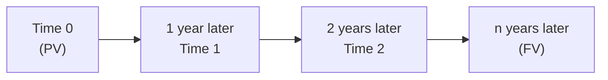
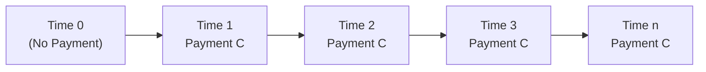

## 2.2 Time Value of Money in Finance

Have you ever thought, “Well, getting $100 today feels different than getting $100 in a year”? Me too. My first real taste of that difference came when I was a freshman in college, trying to decide whether I should spend the $100 right then on a weekend trip or, you know, maybe stick it in the bank and earn a bit of interest. It wasn’t a huge amount, but it was the spark that got me hooked on the concept we call the Time Value of Money (TVM). In plain English, the idea is that money you have now can grow over time if you invest it, so a dollar today is more valuable than that same dollar tomorrow. Let’s delve into precisely why that is—and how we do the math behind it.

## Conceptual Overview

The Time Value of Money is a cornerstone of financial analysis. Whether you’re comparing two investment opportunities, valuing stocks and bonds, or just choosing between spending and saving, TVM will pop up over and over again. At its simplest, TVM addresses the question: “If I receive a certain amount of money in the future, what’s it worth to me right now?” and, conversely, “If I have some money right now, how much might it grow to by a certain point in the future?”

Here are some key points to keep in mind:

• Because of inflation, a future dollar generally can buy fewer goods and services than a dollar you hold now.  
• Opportunities to invest mean you can earn interest on today’s dollar, so you’re often better off receiving money sooner rather than later.  
• Risk matters. If you won’t get that future dollar for sure, it’s typically worth even less today.  

We typically convert between present and future values by using discount rates (when moving from the future to the present) or growth/interest rates (when moving from the present to the future).

## Basic TVM Formulas

We often use two main formulas:

• Future Value formula for a single lump sum:  
  (FV) = (PV) × (1 + i)ⁿ  

• Present Value formula for a single future amount:  
  (PV) = (FV) ÷ (1 + i)ⁿ  

where:  
• PV = Present Value  
• FV = Future Value  
• i = Interest rate (or discount rate), sometimes denoted as r  
• n = Number of compounding periods  

In KaTeX notation:

Future Value:  
 \text{FV} = \text{PV} \times (1 + i)^{n} 

Present Value:  
 \text{PV} = \frac{\text{FV}}{(1 + i)^{n}} 

## Present and Future Value of a Single Lump Sum

So let’s start with a simple scenario. Suppose you deposit $1,000 in the bank today (t=0) at an annual interest rate of 5%. You let it earn interest for three years. How much will you have at t=3?

You’ll use the Future Value formula:  
FV = 1,000 × (1 + 0.05)³ = 1,000 × 1.157625 = $1,157.63 (approximately)

Conversely, if you know you’ll receive $1,157.63 in three years from now, and your required rate of return is 5% a year, you can find out what that’s worth to you right now (the present value). You do:  
PV = 1,157.63 ÷ (1 + 0.05)³ = 1,000 (approximately)

## Graphical Timeline of a Single Cash Flow

It sometimes helps to draw a timeline when analyzing TVM. Let’s use a simple Mermaid diagram to illustrate how a lump-sum amount at time 0 grows through time or is discounted back from the future.

In this diagram, the value at “Time 0” is your starting point (PV). Over successive years, interest is added, so the amount grows to the future value at “n years later.”

## Cash Flow Additivity Principle

One of the key foundations is that the present value of a series of separate cash flows is just the sum of the present values of the individual cash flows. That’s the “cash flow additivity principle.” If you receive $200 in one year and $300 in two years, you’d calculate each present value separately and then add them up.  
Mathematically, if CF₁ is the cash flow in one year, CF₂ is the cash flow in two years:

 \text{Total PV} = \frac{\text{CF}_1}{(1 + i)^1} + \frac{\text{CF}_2}{(1 + i)^2} 

It’s straightforward, but it’s super powerful, because it’s the basis of how we handle multi-year or “uneven” streams of cash flows—such as irregular dividends or a business project that generates different amounts of net cash inflows each year.

## Annuities

An annuity is just a series of equal payments made or received at regular intervals. For instance, if you pay a fixed $200 every month on your car loan for 24 months, that’s an annuity. In finance, we often run into annuities in bond coupon payments or mortgage payments.

Generally, we break annuities down into:

• Ordinary annuity: Payments occur at the end of each period (e.g., rent paid at the end of the month).  
• Annuity due: Payments occur at the beginning of each period (e.g., some leases require payment at the start of the month).  

Let’s say you have an ordinary annuity paying (or receiving) C each period at an interest rate of i for n periods. The Present Value (PV) of that annuity at the time of the first payment (i.e., one period before the first payment) is:

 
\text{PV}_{\text{annuity}} 
= C \times \frac{1 - (1 + i)^{-n}}{i}.


The Future Value of that same ordinary annuity at the time of the last payment is:

 
\text{FV}_{\text{annuity}} 
= C \times \frac{(1 + i)^n - 1}{i}.


For an annuity due, each payment is effectively shifted one period earlier, so the present value is slightly higher compared to an ordinary annuity. Specifically, you multiply the above formulas by (1 + i) if you want the PV or FV of an annuity due.

## Perpetuities

A perpetuity is like an annuity that goes on forever with a constant payment. Think about a guaranteed annual payment of $1,000, with no end date. For a perpetuity that starts one period from now (like an ordinary perpetuity, if you will), the present value is:


\text{PV}_{\text{perpetuity}} = \frac{C}{i},


where C is the regular payment and i is the periodic interest (or discount) rate. This formula is surprisingly simple but pops up a lot in finance, particularly in the context of preferred stocks that pay a fixed dividend forever or in certain real estate valuations.

## Uneven Cash Flow Streams

Of course, real life isn’t always neat. People don’t always promise you a constant $100 every year. Maybe you get $50 in Year 1, $120 in Year 2, $75 in Year 3, and so on. You can still apply the time value of money concept, but you have to discount each of those future amounts separately and sum them. That is the direct application of the cash flow additivity principle:


\text{PV of uneven CFs} 
= \sum_{t=1}^{n} \frac{\text{CF}_t}{(1 + i)^t}.


## No-Arbitrage Concept

The no-arbitrage condition says: if two (or more) assets have exactly the same cash flows (including timing and risk), they must have the same price. If they didn’t, investors would swoop in, buy the underpriced asset, short the overpriced asset, and make a riskless profit—driving the prices back into line.

This principle underlies many of our pricing formulas: we can replicate a future set of cash flows using a combination of simpler financial instruments, then reason about what their price should be. If the market disagrees, traders take advantage until prices adjust. It’s also a good reason to trust the TVM formulas—if you can replicate a risky cash flow or a risk-free cash flow, you can figure out its price.

## Nominal versus Effective Interest Rates

So, you say you’re getting 10% interest, but is that actually 10% effective interest? That depends on the compounding frequency. Nominal rates are the stated annual rates that do not account for compounding within the year. Effective Annual Rates (EAR) factor in that more frequent compounding can raise your actual annual return.

EAR can be calculated from the nominal rate i, compounded m times per year, by:


\text{EAR} = \left(1 + \frac{i}{m}\right)^m - 1.


When m → ∞ (continuous compounding), the EAR formula transforms into:


\text{EAR}_{\text{continuous}} = e^i - 1.


If someone quotes you a 12% annual nominal rate, but it’s compounded monthly, the actual effect is more than 12%. Let’s walk through that:


\text{EAR} = \left(1 + \frac{0.12}{12}\right)^{12} - 1 
= (1 + 0.01)^{12} - 1 
\approx 0.1268 \text{ or } 12.68\%.


So 12% nominal with monthly compounding is 12.68% effective. That’s a pretty big difference, so always keep an eye on what type of rate you’re dealing with.

## The Link Between Discount Rates and Growth Rates

If your discount rate is 10% for a particular investment, you can think of that 10% as the required rate of return or the growth rate you demand (given the risk you’re taking). So discount rates can also be seen as the implied growth rates required by investors in equity or bond markets. In stock valuation, for instance, if we expect a company’s dividends to grow at g = 3% and our required return is 8%, that 8% is the discount rate we apply to the projected dividends in the dividend discount model.

## Time Value of Money in Bond and Stock Valuation

Time Value of Money is deeply woven into the practice of bond pricing. A bond typically pays periodic coupons and eventually redeems the principal (the “face value”) at maturity. Each coupon is a cash flow at a specific future date, and the principal redemption is a larger cash flow at the end. We discount them all back to the present at the bond’s yield (the discount rate we view as appropriate for that bond’s risk). Summing those present values gives the fair bond price.

Similarly, for stocks, one common approach is the Dividend Discount Model (DDM). If you believe a stock’s dividends will grow at a steady rate indefinitely, you could apply:


\text{P}_0 = \frac{D_1}{k - g},


where P₀ is the current stock price, D₁ is the next dividend, k is the required return (or discount rate), and g is the expected growth rate. Notice the similarity to a perpetuity (C/i). Here, we’ve just replaced the infinite constant cash flow with dividends that grow at a constant rate g.

## Practical Examples and Real-World Scenarios

– Mortgage Financing: When you sign up for a mortgage, your monthly payment is an annuity. The bank or lender calculates how much you owe each month by discounting your future payments at the mortgage rate to arrive at the present amount of the loan.  
– Saving for Retirement: By calculating the future value of your monthly contributions to a retirement fund, you can estimate how large your nest egg might be.  
– Corporate Projects: CFOs use Net Present Value (NPV) analysis to decide whether a project’s estimated future cash flows (revenues from the project) justify the upfront capital outlay.  

The truth is, once you grasp TVM, it feels like you have the secret sauce for just about any financial decision.  

## Common Pitfalls

• Confusing nominal rates with effective rates. (Trust me, that can lead to some big miscalculations.)  
• Forgetting the timing of payments in annuities (beginning vs. end).  
• Mixing up discount rates for cash flows with different risks.  
• Being lazy about compounding frequency.  

## Best Practices

• Carefully draw a timeline for each problem. You’ll be amazed how much clarity a simple line with T=0, T=1, T=2, etc. can bring.  
• Verify that your discount rate matches the timing of the cash flows (e.g., if you have monthly cash flows, use a monthly discount rate).  
• Double-check whether the problem states an ordinary annuity or an annuity due.  
• Incorporate the no-arbitrage condition as a mental check—if two sets of cash flows are effectively the same, they should be valued identically.

## Mermaid Diagram: Annuity Cash Flow Timeline

Here’s another little diagram to visualize an ordinary annuity with equal payments C at the end of each period from t=1 to t=n:

Each payment can be discounted to Time 0 and summed. That’s the foundation for various loan calculations (like car loans, mortgages, or corporate bond coupons).

## References and Additional Resources

• Fabozzi, F. J. (2012). Bond Markets, Analysis, and Strategies. Pearson.  
• Damodaran, A. (2012). Investment Valuation: Tools and Techniques for Determining the Value of Any Asset. Wiley.  
• “Quantitative Investment Analysis” (CFA Institute Investment Series).  

These provide extended reading if you’re looking to dive deeper into the mathematics or advanced valuation techniques. (It’s totally worth it if you want to nerd out.)

## Conclusion

Well, it’s probably no surprise by now that the Time Value of Money concept is at the very heart of almost every aspect of finance, from personal saving choices to big corporate decisions. It’s a super versatile toolset—you can compare streams of cash flows, decide if you should buy a bond or prefer a stock, or figure out how much you need to retire comfortably. Of course, all these formulas would just be decoration if we didn’t also keep an eye on risk, inflation, liquidity, and so on. But TVM is always where the conversation begins and ends, so mastering it is downright critical.

And that’s the story. Whether you’re deciding to spend your 100 bucks on dinner tonight or sock it away until tomorrow, keep in mind that finances are never static; money evolves over time if you let it. I still remember that first weekend trip I skipped so I could deposit my $100—Well, maybe it wasn’t the most glamorous choice, but it sure taught me the power of interest, right?

Now, sharpen your pencils (or your minds), because we’ve got a few practice questions to see how you’re absorbing all this.

## Test Your Time Value of Money Knowledge



### Which statement best describes the core idea of Time Value of Money (TVM)?

- [x] A dollar today is worth more than a dollar in the future due to its earning potential.
- [ ] A dollar in the future is always worth more because it arrives later.
- [ ] TVM only applies to interest rates above 5%.
- [ ] TVM means interest rates are always constant over time.

> **Explanation:** The key principle is that money available now can be invested to earn interest, making it more valuable than an identical amount in the future.

### Which of the following formulas correctly computes the Future Value of a lump sum after n periods?

- [ ] PV = FV ÷ (1 + i)ⁿ
- [ ] EAR = (1 + i/m)ᵐ - 1
- [ ] PV = C × (1 – (1 + i)⁻ⁿ) / i
- [x] FV = PV × (1 + i)ⁿ

> **Explanation:** The basic Future Value formula for a single lump sum is FV = PV × (1 + i)ⁿ.

### If a regular payment (C) is made at the end of each period for n periods, and the discount rate per period is i, which formula gives the Present Value of an ordinary annuity?

- [ ] (C ÷ i) × (1 – (1 + i)⁻ⁿ)
- [x] C × (1 – (1 + i)⁻ⁿ) / i
- [ ] C + (1 – i)ⁿ
- [ ] C × (1 + i)ⁿ × n

> **Explanation:** The present value of an ordinary annuity is determined by C × [(1 – (1 + i)⁻ⁿ) / i].

### A perpetuity with a constant cash flow of $200 per year and a discount rate of 8% has a present value closest to:

- [ ] $25
- [x] $2,500
- [ ] $250
- [ ] $16

> **Explanation:** PV = C / i = $200 / 0.08 = $2,500.

### Which of the following best describes the Cash Flow Additivity Principle?

- [x] The present value of a series of future cash flows equals the sum of the individual present values.
- [ ] Multiple cash flows have no combined effect on present value.
- [x] It disallows adding the present values of different time horizons.
- [ ] It requires summing only the future values of cash flows.

> **Explanation:** Each cash flow is discounted to present value separately, then added together.

### An effective annual rate (EAR) that is higher than the nominal rate occurs if:

- [x] Interest is compounded more than once per year.
- [ ] Interest is never compounded.
- [ ] Interest is compounded annually.
- [ ] The discount rate is negative.

> **Explanation:** Any compounding higher than annually (e.g., monthly, quarterly) results in an EAR above the stated nominal rate.

### Which concept states that two investments with identical cash flows must have the same price to deny riskless profit?

- [ ] Discount Factor
- [ ] EAR
- [x] No-Arbitrage Condition
- [ ] Cash Flow Additivity Principle

> **Explanation:** The no-arbitrage principle ensures identical cash flows cannot differ in price, preventing riskless profit.

### If you invest $1,000 at a nominal annual rate of 6% compounded monthly, which expression should be used to find its Future Value after one year?

- [ ] 1,000 × (1 + 0.06)¹
- [x] 1,000 × (1 + 0.06/12)¹²
- [ ] 1,000 × (1 + 0.06)³
- [ ] 1,000 ÷ (1 + 0.005)¹²

> **Explanation:** Monthly compounding means dividing the nominal rate by 12 and raising to the 12th power for one year.

### Which best describes the relationship between the discount rate and the implied growth rate for an equity instrument?

- [x] The discount rate is essentially the required rate of return, indicating how much investors expect the value to grow over time.
- [ ] The discount rate is always lower than the growth rate.
- [ ] The implied growth rate equals zero if the discount rate is known.
- [ ] The growth rate is constant and unrelated to the discount rate.

> **Explanation:** When valuing equity, the discount rate is generally the expected or required return, reflecting the growth investors demand.

### True or False: The time value of money concept is irrelevant when evaluating capital investments.

- [x] True
- [ ] False

> **Explanation:** Trick question—because it’s actually false that it’s “irrelevant.” A correct interpretation is that TVM is extremely relevant for capital investments. The “True” option here is intentionally inverted to test reading comprehension. In practice, TVM is central to evaluating capital investments.


