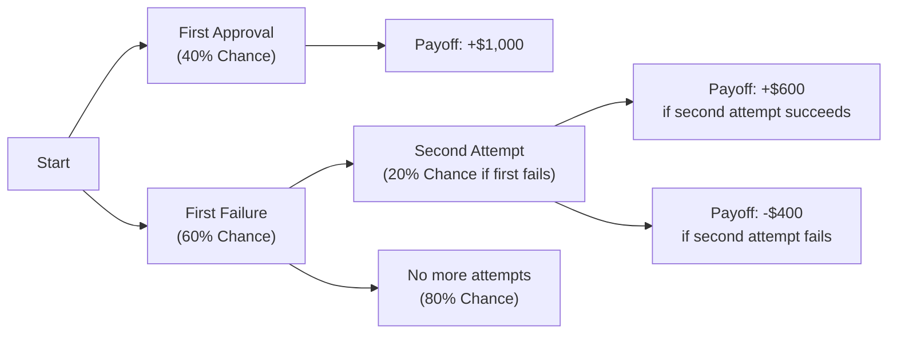
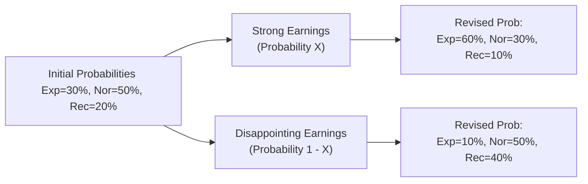

## 2.4 Probability Trees and Conditional Expectations

Talking about probability can sometimes feel a bit intimidating, like you’re standing at the edge of a big unknown. But, um, you know, once you start breaking it down, it’s not so bad. In fact, one of my earliest memories in finance is building a tiny probability tree to figure out if a business would succeed or fail under different economic conditions. I remember scribbling these branches on a scrap of paper—each branch a scenario, each scenario a probability—and something just clicked: this stuff can be a lot more straightforward when you can actually see how each possible outcome plays out.

In modern finance (particularly in risk management and forecasting), probability trees form a great way to illustrate how different events can occur in sequence, each with its own probability, and how we might adjust our expectations each time we learn something new. Let’s dive into how you can easily build and interpret these trees, compute expected values, and incorporate conditional probabilities—including Bayes’ formula—to make more informed investment decisions.  

---

### Why Probability Trees Matter

Probability trees provide a visual representation of possible outcomes of sequential events. They’re super-useful for clarifying complex scenarios where multiple paths are feasible. For instance, if you’re analyzing possible quarterly earnings for a company that might face different consumer spending environments, you can break down each scenario into branches based on “good market,” “bad market,” or “neutral market” and then apply conditional probabilities.

Once the tree is built, you can quickly see how each path adds up to an overall picture. It’s like playing “choose your own adventure” with finance—except that, instead of purely guesswork, each branch is weighted by probabilities.

---

### Fundamentals of Probability and the Vocabulary We Use

Before we dig into drawing trees, let’s get a few fundamentals—just to make sure we’re all on the same page:

• Probability Tree: A branching diagram that depicts all possible outcomes of sequential events, with associated probabilities at each branch.  
• Expected Value (EV): The weighted average (mean) of all possible outcomes, using the probabilities of each outcome as weights. In finance, EV is often interpreted as the average return or payoff you might get if you replayed the scenario many times.  
• Conditional Probability (P(A|B)): The probability that event A occurs given that event B has already occurred.  
• Unconditional Probability (P(A)): The probability of event A happening, without any additional information or constraints.  
• Multiplication Rule: Method to find the joint probability of two events (particularly helpful in building probability trees).  
• Addition Rule: Method to find the probability that at least one of multiple events will occur.  
• Bayes’ Formula: A powerful tool for updating initial beliefs (probabilities) when new evidence or information is obtained.  
• Conditional Expectation: The expected value of a variable—like a stock’s return—given that certain conditions (e.g., an economic environment) hold true.

We’ll use these terms a lot, so keep this mini-glossary handy as you go.  

---

### Constructing a Simple Probability Tree

It might help to see a basic example. Picture yourself as an analyst checking out a small biotech firm. You believe there’s a 40% chance the firm will receive regulatory approval for a new drug. If it fails to get approval, a second attempt may push the probability of success up to 20% the next time around (but that second attempt happens only if the first fails). Then, you want to evaluate possible payoffs. Let’s say:

• If the company gets approval, your net payoff (profit) is $1,000 (this is just a hypothetical).  
• If it fails, you lose $300.  
• If the firm fails the first time but tries again, maybe it invests additional funds in R&D, so your second payoff is, let’s say, $600 if eventually approved, and if it fails the second time, you lose $400 in total.

We can illustrate it with a probability tree:

- Probability of first approval: 0.40.  
- Probability of first failure: 0.60.  
- Probability of second attempt success (given the first failure happened): 0.20 × 0.60 = 0.12 unconditional.  
- Probability of second attempt failure: 0.60 × 0.80 = 0.48 unconditional.

And so on. By laying out each branch and labeling it, you avoid confusion.

Once your tree is built, you might want to find the overall expected payoff:

(0.40 × $1,000) + (0.60 × 0.20 × $600) + (0.60 × 0.80 × -$400).

We can do that arithmetic:

• Segment 1: 0.40 × 1000 = 400  
• Segment 2: 0.60 × 0.20 × 600 = 0.12 × 600 = 72  
• Segment 3: 0.60 × 0.80 × -400 = 0.48 × -400 = -192  

Summing these up:

EV = 400 + 72 - 192 = 280

So the overall expected value of this investment is $280.  

---

### Adding the Multiplication and Addition Rules

At times, you’ll want to find the joint probability (the “and” scenario) or the probability that at least one event happens.

–––––

#### Multiplication Rule

The multiplication rule states:  
P(A ∩ B) = P(A|B) × P(B)

Or equivalently:  
P(A ∩ B) = P(B|A) × P(A)

Meaning that the probability of both A and B happening is the probability that A happens and then, given that A happened, B also happens. In the biotech example, the probability of first failing (Event F) and then succeeding on the second attempt (Event S2) is:

P(F) × P(S2 | F)

We used that concept in drawing the tree and labeling the second attempt’s success probability as 0.20 given the first attempt’s failure.

–––––

#### Addition Rule

The addition rule is about “or.” For two events A and B, the probability that A or B (or both) will occur is:

P(A ∪ B) = P(A) + P(B) - P(A ∩ B)

Sometimes, you’ll build out a probability tree to see which branches represent “A or B,” then sum up all those branches. The combo approach helps you systematically keep track of possibilities without double-counting.

---

### Conditional Probability: P(A|B)

In daily life, we often speak about probabilities informally, like “I think there’s a 30% chance it’ll rain tomorrow.” However, we might then add something like “but if the humidity keeps climbing, that chance goes up to 50%.” That’s conditional probability: the notion that new information (humidity is rising) changes your perspective on the likelihood of rain.

In the investment world, the same principle applies. Maybe there’s a baseline 25% chance a firm outperforms the market. Then, if its new product launch gets strong reviews, the chance might jump to 55%. Written formally:

P(Outperform | Strong reviews) = 0.55  
P(Outperform) = 0.25

This knowledge is crucial in scenario analysis, as real-world finance rarely exists in a vacuum. We continuously get new data—earnings calls, economic announcements, CEO statements—and each piece might update our view about a security’s future.

---

### Bayes’ Formula: Updating Your Beliefs

It’s possible that the single biggest reason probability trees are so practical is their relationship with Bayes’ formula. Bayes’ formula says that if you want to know the probability P(A|B)—the probability of A given B occurred—but you only initially know P(B|A), P(A), and P(B), you can find your updated probability:


P(A \mid B) = \frac{P(B \mid A) \, P(A)}{P(B)}


To see how this might matter, think about a scenario where you’re analyzing credit defaults. Suppose:

• P(Default) = 0.05 (5% chance a borrower defaults)  
• You have a new automated system that flags potential defaulters. It produces flags in 8% of all loans.  
• Among those who default, the system has a 90% chance to flag them (so P(Flag | Default) = 0.90).

What if someone is flagged—what’s the chance they’ll actually default? That’s P(Default | Flag). With Bayes’ formula:


P(\text{Default | Flag}) = \frac{P(\text{Flag | Default}) \times P(\text{Default})}{P(\text{Flag})}


We know:

• P(Flag | Default) = 0.90  
• P(Default) = 0.05  
• P(Flag) = 0.08  

So:


P(\text{Default | Flag}) = \frac{0.90 \times 0.05}{0.08} = \frac{0.045}{0.08} = 0.5625 = 56.25\%


In other words, learning that a loan has been flagged updates your belief about the probability of default from 5% to 56.25%. This is exactly the kind of revision you can capture with a probability tree—maybe the first branch is “Flagged” vs. “Not Flagged,” and then the subsequent branches are “Default” or “No Default” given the flag status.

---

### Conditional Expectations in Finance

When analyzing potential stock returns or project outcomes, you often want the expected value under a specific condition. That’s conditional expectation. For example, if your organization thinks there’s a 40% chance the economy enters a recession next year, you might want to know the expected return on your equities portfolio in that “economy = recession” scenario. This helps break down overall risk. You can say: “Well, if the economy slows down, then historically, our equities have an average of -5% return, but if the economy stays stable, we might see +7%.” Weighted by the probabilities, you get your unconditional expectation.   

But sometimes you just want to zero in on that -5%—the conditional expectation if we’re actually in a recession. That’s especially helpful if your job is to manage risk and you need to figure out how big the losses could be (and maybe hedge out that risk).  

---

### Variance and Standard Deviation of Discrete Random Variables

Let’s say you list out all possible scenarios for a discrete random variable (like returns: -5%, 0%, +5%, etc.) and the probabilities for each scenario. You can compute the variance (σ²) by:

1. Calculating the EV = Σ(xᵢ·pᵢ).  
2. Subtracting the EV from each outcome (xᵢ - EV).  
3. Squaring these differences.  
4. Multiplying by the outcome’s probability and summing across all scenarios.

Formally:


\text{Var}(X) = \sum \limits_{i} [ (x_i - \mathbb{E}[X])^2 \, p_i ]


The standard deviation (σ) is just the square root of the variance. In probability trees, after you figure out each branch’s outcome, you can find the expected outcome and then do a quick variance calculation. It can be super-useful if you’re trying to measure how “uncertain” or “risky” a particular investment is.

---

### Real-World Applications

Well, you might be thinking: “So what if I can draw a fancy tree? How does it actually help me?” The truth is, having a structured approach to outcomes is relevant almost everywhere in finance:

• Portfolio Construction and Scenario Analysis: Portfolio managers often create multiple economic scenarios—recession, moderate growth, strong growth—and estimate the probability of each. Then they figure out the expected returns for different assets in each scenario, weigh them by probabilities, and arrive at unconditional expectations.  
• Risk Management: Probability trees (and their continuous cousins—decision trees) come in handy for analyzing operational risk, credit risk, or potential lawsuits. You might have a branching sequence of events: lawsuit filed, rejected, appealed, settled. Each outcome changes the probability and potential payoff.  
• Performance Attribution: Let’s say you’re trying to forecast performance under different interest rate paths. A probability tree can help break down each interest rate path and the likely performance of certain instruments.  
• Corporate Finance Decisions: Whether it’s launching a new product or investing in a capital project, you can break down success or failure probabilities, gather data from pilot tests, and update your model’s probabilities using Bayes’ formula.  

---

### Avoiding Common Pitfalls

• Not Accounting for All Branches: Always make sure your probability tree branches add up to 1. If you have two branches that sum to 0.80, you might be missing a 0.20 branch.  
• Double Counting: Sometimes, we might add up probabilities for “Event X or Event Y” incorrectly if we don’t properly handle the intersection. The addition rule is your friend here.  
• Using Unrealistic Probabilities: The best analysis in the world can still break down if your input assumptions about the world are way off. Always refine your probabilities with good data.  
• Confusing Conditional with Unconditional: P(A|B) is not necessarily the same as P(A). This is a big error. Distinguish carefully.  
• Overlooking Correlations: Probability trees can oversimplify if events are not truly sequential or if they’re correlated in more complex ways. Make sure your branches reflect actual real-world relationships.

---

### An Extended Example: Scenario-Based Forecasting for a Portfolio

To get a more integrated look, consider a portfolio that invests in two asset classes: equities (E) and bonds (B). You want to forecast a single-year return. You figure out three possible states of the economy for next year:

• Expansion (Exp) – 30% chance  
• Normal (Nor) – 50% chance  
• Recession (Rec) – 20% chance  

You also estimate that if you observe a strong earlier quarter, it updates the probabilities for each state. So your baseline probabilities might shift if, mid-year, you see surprisingly strong corporate earnings. Let’s assume:

• If early corporate earnings are strong, the revised odds become: P(Exp | Strong) = 60%, P(Nor | Strong) = 30%, P(Rec | Strong) = 10%.  
• If early corporate earnings are disappointing, the revised odds might be: P(Exp | Disappoint) = 10%, P(Nor | Disappoint) = 50%, P(Rec | Disappoint) = 40%.

Next, you figure out the expected return for your E-B portfolio in each condition:

• R(Exp) = +12%  
• R(Nor) = +6%  
• R(Rec) = -3%

Initially, your unconditional expected return on the portfolio is:


\mathbb{E}[R] = (0.30 \times 12\%) + (0.50 \times 6\%) + (0.20 \times -3\%) = 3.6\% + 3.0\% - 0.6\% = 6.0\%


But then, let’s say new data arrives that corporate earnings are strong. Your updated scenario probabilities become 60%, 30%, and 10% for Exp, Nor, and Rec, respectively. The conditional expectation is:


\mathbb{E}[R | \text{Strong}] = (0.60 \times 12\%) + (0.30 \times 6\%) + (0.10 \times -3\%) 
= 7.2\% + 1.8\% - 0.3\% = 8.7\%


So your new best guess about returns is 8.7%. If your portfolio is sensitive to these updated beliefs, you might rebalance, buying more equities to take advantage of expected expansion. This is a prime example of how an initial unconditional probability is updated with new evidence (strong earnings), shifting to a new conditional probability distribution, and leading to a different expected return.

---

### Diagram: Multi-Stage Probability Scenario

If you want to build a simplified probability tree combining these ideas:

Each of these branches can then map to different expected returns for your portfolio.  

---

### Connecting to Risk Management

Risk management is all about identifying potential future states and figuring out how they might affect your portfolio or business. Probability trees help you:

• Identify states that could lead to big losses.  
• Quantify the likelihood of those states occurring.  
• Calculate an expected loss (or shortfall) measure.  
• Evaluate whether your portfolio is well diversified against multiple possible events.

Moreover, you can combine your own scenario analysis or stress test with Bayesian updating. If new data suggests the world is heading toward a worse (or better) scenario, you update your probability distribution accordingly. In a world of continuous and evolving data streams, this dynamic approach can reflect the real-time nature of risk management decisions.

---

### Best Practices to Keep in Mind

• Keep it simple at first: Don’t build a “monster” probability tree with 50 branches. Start small and expand as you gain clarity.  
• Validate your assumptions: Probability trees are only as good as the probabilities you put in. Test them with historical data, or use expert judgment.  
• Combine with advanced methods: Probability trees are great for discrete events, but for more intricate correlations and continuous outcomes, you might integrate Monte Carlo simulation (see Section 2.6) or regression modeling (see Section 2.10).  
• Revisit often: As new data emerges, you may want to refine your tree or re-estimate your probabilities. Probability is an evolving measure, not set in stone.

---

### Quick Recap

• Probability Trees: Visual layout of sequential outcomes.  
• Conditional Probability: Probability that an event occurs, given certain info.  
• Bayes’ Formula: Updates your probabilities with new evidence.  
• Expected Value, Variance, and Standard Deviation: Key metrics for analyzing random outcomes.  
• Real-World Application: From forecasting returns to credit risk analysis, probability trees and conditional expectations show up all over the place in finance.

---

### References and Additional Resources

- DeGroot, M. H., & Schervish, M. J. (2012). Probability and Statistics. Addison-Wesley.  
- Grinold, R. C., & Kahn, R. N. (2000). Active Portfolio Management. McGraw-Hill.  
- Chapter 2.6 in this text (Simulation Methods) offers a deeper dive into running simulations that complement probability trees.  
- Chapter 2.3 (Statistical Measures of Asset Returns) also ties in for computing expected returns and risk.  

---

## Test Your Knowledge: Probability Trees and Conditional Expectations



### Which statement best describes a probability tree?

- [ ] A tool for computing risk-adjusted returns using only linear algebra.  
- [x] A diagram that maps out sequential events and their probabilities.  
- [ ] A scatterplot of two variables' correlation.  
- [ ] A time-series graph used for price history analysis.  

> **Explanation:** Probability trees are branching diagrams that lay out the possible outcomes of sequential events, along with their probabilities.

### What is the unconditional probability P(A)?

- [x] The probability of event A occurring without any additional context.  
- [ ] The probability of event A occurring given B has occurred.  
- [ ] The probability that both A and B occur simultaneously.  
- [ ] The probability that either A or B occurs.  

> **Explanation:** By definition, unconditional (or marginal) probability is the probability of an event in itself, independent of other events.

### When applying Bayes’ formula, which piece of information is NOT strictly necessary?

- [ ] P(B | A) (the probability of B given A).  
- [ ] P(A) (the prior probability of A).  
- [ ] P(B) (the probability of B).  
- [x] P(A ∩ B) (the combined probability of A and B).  

> **Explanation:** Bayes’ formula can be used if you know P(B|A), P(A), and P(B). You don’t directly need P(A ∩ B); it’s derived within Bayes’ formula if needed.

### In a probability tree, if there are two branches from a node representing events M and N that are mutually exclusive and exhaustive, what should be true about their probabilities?

- [ ] They can be any values as long as they are greater than 1.  
- [ ] They must each be less than 0.50.  
- [x] They should sum to 1.00.  
- [ ] They should sum to 2.00.  

> **Explanation:** Mutually exclusive (cannot both happen) and collectively exhaustive (they cover all possibilities) means their probabilities add up to 1.

### Which statement best illustrates conditional probability?

- [ ] “There’s a 50% chance of event X.”  
- [x] “If event Y occurs, there’s a 30% chance event X will happen.”  
- [ ] “Event X is guaranteed to happen.”  
- [ ] “Events X and Y always occur at the same time.”  

> **Explanation:** Conditional probability is about the probability of X happening under the condition that Y has already occurred.

### How do we compute the expected value (EV) of a discrete random variable?

- [x] By multiplying each outcome by its probability and summing the products.  
- [ ] By squaring each outcome, summing, and dividing by the variance.  
- [ ] By taking the square root of the variance and multiplying by 2.  
- [ ] By adding the five largest outcomes and dividing by five.  

> **Explanation:** The EV is the sum of each outcome times its probability.

### Which of the following is an example of Bayes’ formula usage in finance?

- [ ] Calculating the daily correlation between two stock returns.  
- [x] Updating the probability of default after receiving new signals about a borrower’s creditworthiness.  
- [ ] Converting nominal interest rates into real interest rates.  
- [ ] Computing the P/E ratio from a company’s earnings statements.  

> **Explanation:** Bayes’ formula updates prior probabilities (e.g., of default) when new information arrives.

### What does the multiplication rule of probability help you find?

- [ ] The probability that either event A or event B occurs.  
- [ ] The difference between the probabilities of events A and B.  
- [x] The joint probability of events A and B happening together.  
- [ ] The –1 to +1 measure of correlation.  

> **Explanation:** The multiplication rule is what you use to figure out the joint probability of two events that occur in sequence or simultaneously.

### If you have a probability tree with three equally likely states of the economy (25%, 25%, and 50%), what should you check first?

- [ ] How these probabilities compare to last year’s official data.  
- [x] That the probabilities sum to 100%.  
- [ ] Whether each branch yields at least a 10% return.  
- [ ] The correlation between the events.  

> **Explanation:** Probability distributions must sum to 1. If your three states add to 25%, 25%, and 50%, you get 100%, so that’s consistent.

### Is it correct to say, “Conditional probability is always greater than unconditional probability?”

- [x] False  
- [ ] True  

> **Explanation:** There’s no guarantee that conditional probability is always larger. It might be bigger, smaller, or the same, depending on how the new information changes the probability.


